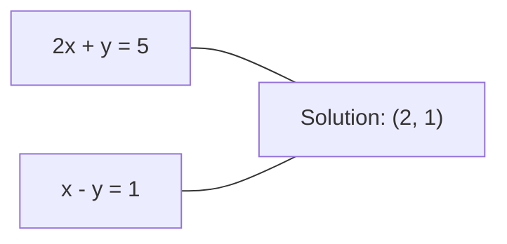
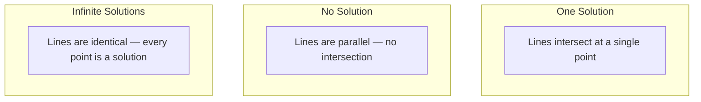

# 線性方程組

> 解 Ax = b 是數學裡最古老的問題，而它今天還在跑你的神經網路。

**類型：** 實作
**程式語言：** Python
**先修單元：** 階段 1 · 單元 01（線性代數直覺）、02（向量與矩陣）、03（矩陣轉換）
**時間：** 約 120 分鐘

## 學習目標

- 用帶部分主元選取的高斯消去法加上回代解 Ax = b
- 用 LU、QR 與 Cholesky 分解拆解矩陣，並說明各自適用的場合
- 推導最小平方的正規方程，並把它連結到線性迴歸與 ridge 迴歸
- 用條件數診斷病態方程組，並用正則化把它穩定下來

## 問題所在

每次你訓練一個線性迴歸，你就在解一個線性方程組。每次你算一個最小平方擬合，你就在解一個線性方程組。每次神經網路的一層算 `y = Wx + b`，它就在計算一個線性方程組的其中一邊。加上正則化，你就是在改動這個方程組。用高斯過程時，你在做矩陣分解。為了算 Mahalanobis 距離而把共變異數矩陣反轉時，你在解一個線性方程組。

Ax = b 這個式子到處都是。A 是一個已知係數的矩陣，b 是一個已知輸出的向量，x 是你想找出來的未知數向量。在線性迴歸裡，A 是你的資料矩陣，b 是你的目標向量，x 是權重向量。整個模型化簡成一句話：找出一個 x，使 Ax 盡可能接近 b。

這一課會從零把解這條式子的每個主要方法都做出來。你會理解為什麼有些方法快、有些方法穩，為什麼有些只能處理方陣系統、有些能處理超定系統，以及為什麼矩陣的條件數決定了你算出來的答案到底有沒有意義。

## 核心概念

### Ax = b 的幾何意義

一組線性方程式有幾何上的讀法。每條方程式定義一個超平面。解就是所有超平面相交的那個點（或那組點）。

```
2x + y = 5          Two lines in 2D.
x - y  = 1          They intersect at x=2, y=1.
```


```mermaid
graph LR
    A["2x + y = 5"] --- S["Solution: (2, 1)"]
    B["x - y = 1"] --- S
```

會發生三種情況：


```mermaid
graph TD
    subgraph "One Solution"
        A1["Lines intersect at a single point"]
    end
    subgraph "No Solution"
        A2["Lines are parallel — no intersection"]
    end
    subgraph "Infinite Solutions"
        A3["Lines are identical — every point is a solution"]
    end
```

寫成矩陣形式時，「唯一解」表示 A 可逆；「無解」表示這個方程組不相容；「無限多解」表示 A 有非零的零空間。大多數機器學習問題都落在「沒有精確解」這一類，因為你的方程式（資料點）比未知數（參數）多。這就是最小平方登場的地方。

### 欄的觀點與列的觀點

讀 Ax = b 有兩種方式。

**列的觀點。** A 的每一列定義一條方程式，每條方程式是一個超平面，解就是它們共同相交的位置。

**欄的觀點。** A 的每一欄是一個向量。問題變成：A 的各欄要怎麼線性組合才會得到 b？

```
A = | 2  1 |    b = | 5 |
    | 1 -1 |        | 1 |

Row picture: solve 2x + y = 5 and x - y = 1 simultaneously.

Column picture: find x1, x2 such that:
  x1 * [2, 1] + x2 * [1, -1] = [5, 1]
  2 * [2, 1] + 1 * [1, -1] = [4+1, 2-1] = [5, 1]   check.
```

欄的觀點更本質。如果 b 落在 A 的欄空間裡，這個方程組有解；如果不在，你就去找欄空間裡離 b 最近的那個點。那個最近的點就是最小平方解。

### 高斯消去法

高斯消去法把 Ax = b 變成一個上三角系統 Ux = c，再用回代解出來。它是最直接的方法。

演算法：

```
1. For each column k (the pivot column):
   a. Find the largest entry in column k at or below row k (partial pivoting).
   b. Swap that row with row k.
   c. For each row i below k:
      - Compute multiplier m = A[i][k] / A[k][k]
      - Subtract m times row k from row i.
2. Back substitute: solve from the last equation upward.
```

範例：

```
Original:
| 2  1  1 | 8 |       R2 = R2 - (2)R1     | 2  1   1 |  8 |
| 4  3  3 |20 |  -->  R3 = R3 - (1)R1 --> | 0  1   1 |  4 |
| 2  3  1 |12 |                            | 0  2   0 |  4 |

                       R3 = R3 - (2)R2     | 2  1   1 |  8 |
                                       --> | 0  1   1 |  4 |
                                           | 0  0  -2 | -4 |

Back substitute:
  -2 * x3 = -4    -->  x3 = 2
  x2 + 2  = 4     -->  x2 = 2
  2*x1 + 2 + 2 = 8 --> x1 = 2
```

高斯消去法的成本是 O(n^3) 次運算。對一個 1000x1000 的系統，那大約是十億次浮點運算。這已經很快了，但如果你要用同一個 A 解很多個系統，還可以做得更好。

### 部分主元選取：為什麼重要

沒有主元選取，高斯消去法可能直接失敗，或是算出一堆垃圾。如果某個主元是零，你就會除以零；如果它很小，你就會把捨入誤差放大。

```
Bad pivot:                       With partial pivoting:
| 0.001  1 | 1.001 |            Swap rows first:
| 1      1 | 2     |            | 1      1 | 2     |
                                 | 0.001  1 | 1.001 |
m = 1/0.001 = 1000              m = 0.001/1 = 0.001
R2 = R2 - 1000*R1               R2 = R2 - 0.001*R1
| 0.001  1     | 1.001   |      | 1      1     | 2     |
| 0     -999   | -999.0  |      | 0      0.999 | 0.999 |

x2 = 1.000 (correct)            x2 = 1.000 (correct)
x1 = (1.001 - 1)/0.001          x1 = (2 - 1)/1 = 1.000 (correct)
   = 0.001/0.001 = 1.000        Stable because the multiplier is small.
```

在精度有限的浮點運算裡，沒選主元的版本會損失掉好幾位有效數字。部分主元選取永遠挑當前可用的最大主元，把誤差放大壓到最小。

### LU 分解

LU 分解把 A 拆成一個下三角矩陣 L 與一個上三角矩陣 U：A = LU。L 存的是高斯消去法過程中的乘數，U 則是消去後的結果。

```
A = L @ U

| 2  1  1 |   | 1  0  0 |   | 2  1   1 |
| 4  3  3 | = | 2  1  0 | @ | 0  1   1 |
| 2  3  1 |   | 1  2  1 |   | 0  0  -2 |
```

為什麼要做分解，而不是直接消去就好？因為一旦有了 L 與 U，對任何新的 b 解 Ax = b 都只要 O(n^2)：

```
Ax = b
LUx = b
Let y = Ux:
  Ly = b    (forward substitution, O(n^2))
  Ux = y    (back substitution, O(n^2))
```

O(n^3) 的成本在分解時付一次就好，之後每次求解都是 O(n^2)。如果你要用同一個 A 但不同的 b 解一千個系統，LU 在總工作量上省下大約 1000/3 倍。

加上部分主元選取後，你得到的是 PA = LU，其中 P 是一個記錄列交換的置換矩陣。

### QR 分解

QR 分解把 A 拆成一個正交矩陣 Q 與一個上三角矩陣 R：A = QR。

正交矩陣滿足 Q^T Q = I，它的各欄是一組正交規範向量。乘上 Q 不會改變長度與夾角。

```
A = Q @ R

Q has orthonormal columns: Q^T Q = I
R is upper triangular

To solve Ax = b:
  QRx = b
  Rx = Q^T b    (just multiply by Q^T, no inversion needed)
  Back substitute to get x.
```

在解最小平方問題時，QR 在數值上比 LU 更穩定。Gram-Schmidt 程序一欄一欄地把 Q 建起來：

```
Given columns a1, a2, ... of A:

q1 = a1 / ||a1||

q2 = a2 - (a2 . q1) * q1        (subtract projection onto q1)
q2 = q2 / ||q2||                (normalize)

q3 = a3 - (a3 . q1) * q1 - (a3 . q2) * q2
q3 = q3 / ||q3||

R[i][j] = qi . aj    for i <= j
```

每一步都把沿著先前所有 q 向量的成分扣掉，只留下那個新的正交方向。

### Cholesky 分解

當 A 對稱（A = A^T）且正定（所有特徵值都是正的）時，你可以把它分解成 A = L L^T，其中 L 是下三角矩陣。這就是 Cholesky 分解。

```
A = L @ L^T

| 4  2 |   | 2  0 |   | 2  1 |
| 2  5 | = | 1  2 | @ | 0  2 |

L[i][i] = sqrt(A[i][i] - sum(L[i][k]^2 for k < i))
L[i][j] = (A[i][j] - sum(L[i][k]*L[j][k] for k < j)) / L[j][j]    for i > j
```

Cholesky 的速度是 LU 的兩倍，儲存量只要一半。它只適用於對稱正定矩陣，但這種矩陣出現的頻率極高：

- 共變異數矩陣是對稱半正定的（加上正則化就變成正定）。
- 高斯過程裡的核矩陣是對稱正定的。
- 凸函式在極小點的 Hessian 是對稱正定的。
- A^T A 永遠是對稱半正定的。

在高斯過程裡，你用 Cholesky 分解核矩陣 K，再解 K alpha = y 得到預測均值。Cholesky 因子同時也給了你邊際似然需要的對數行列式：log det(K) = 2 * sum(log(diag(L)))。

### 最小平方：當 Ax = b 沒有精確解

如果 A 是 m x n 且 m > n（方程式比未知數多），這個方程組是超定的，沒有精確解。取而代之，你去讓平方誤差最小：

```
minimize ||Ax - b||^2

This is the sum of squared residuals:
  sum((A[i,:] @ x - b[i])^2 for i in range(m))
```

讓它最小的那個解滿足正規方程：

```
A^T A x = A^T b
```

推導：把 ||Ax - b||^2 展開成 (Ax - b)^T (Ax - b) = x^T A^T A x - 2 x^T A^T b + b^T b，對 x 取梯度並令其為零：2 A^T A x - 2 A^T b = 0。

```
Original system (overdetermined, 4 equations, 2 unknowns):
| 1  1 |         | 3 |
| 1  2 | x     = | 5 |       No exact x satisfies all 4 equations.
| 1  3 |         | 6 |
| 1  4 |         | 8 |

Normal equations:
A^T A = | 4  10 |    A^T b = | 22 |
        | 10 30 |            | 63 |

Solve: x = [1.5, 1.7]

This is linear regression. x[0] is the intercept, x[1] is the slope.
```

### 正規方程 = 線性迴歸

這個對應是完全精確的。在線性迴歸裡，你的資料矩陣 X 每一列是一個樣本，每一欄是一個特徵；目標向量 y 每個元素對應一個樣本。權重向量 w 滿足：

```
X^T X w = X^T y
w = (X^T X)^(-1) X^T y
```

這就是線性迴歸的閉式解。每一次呼叫 `sklearn.linear_model.LinearRegression.fit()` 算的都是這個（或是用 QR、SVD 算的等價版本）。

在矩陣上加一個正則化項 lambda * I，你就得到 ridge 迴歸：

```
(X^T X + lambda * I) w = X^T y
w = (X^T X + lambda * I)^(-1) X^T y
```

正則化讓矩陣的條件變好（更容易精確地反轉），同時把權重往零方向收縮以避免過度擬合。當 lambda > 0 時，X^T X + lambda * I 永遠是對稱正定的，所以你可以用 Cholesky 來解。

### 偽逆（Moore-Penrose）

偽逆 A+ 把矩陣求逆推廣到非方陣與奇異矩陣上。對任何矩陣 A：

```
x = A+ b

where A+ = V Sigma+ U^T    (computed via SVD)
```

Sigma+ 的做法是：把每個非零奇異值取倒數，再把結果轉置。如果 A = U Sigma V^T，那麼 A+ = V Sigma+ U^T。

```
A = U Sigma V^T        (SVD)

Sigma = | 5  0 |       Sigma+ = | 1/5  0  0 |
        | 0  2 |                | 0  1/2  0 |
        | 0  0 |

A+ = V Sigma+ U^T
```

偽逆給出的是最小範數的最小平方解。如果這個方程組：
- 有唯一解：A+ b 就是那個解。
- 沒有解：A+ b 給出最小平方解。
- 有無限多解：A+ b 給出 ||x|| 最小的那一個。

NumPy 的 `np.linalg.lstsq` 與 `np.linalg.pinv` 內部都用 SVD。

### 條件數

條件數衡量解對輸入的微小變動有多敏感。對一個矩陣 A，條件數是：

```
kappa(A) = ||A|| * ||A^(-1)|| = sigma_max / sigma_min
```

其中 sigma_max 與 sigma_min 分別是最大與最小的奇異值。

```
Well-conditioned (kappa ~ 1):        Ill-conditioned (kappa ~ 10^15):
Small change in b -->                Small change in b -->
small change in x                    huge change in x

| 2  0 |   kappa = 2/1 = 2          | 1   1          |   kappa ~ 10^15
| 0  1 |   safe to solve            | 1   1+10^(-15) |   solution is garbage
```

幾條經驗法則：
- kappa < 100：安全，解是準確的。
- kappa ~ 10^k：你的浮點運算大約會損失 k 位有效數字。
- kappa ~ 10^16（對 float64 而言）：解毫無意義，這個矩陣實質上是奇異的。

在機器學習裡，病態通常發生在特徵接近共線的時候。正則化（加上 lambda * I）把條件數從 sigma_max / sigma_min 改善成 (sigma_max + lambda) / (sigma_min + lambda)。

### 迭代法：共軛梯度法

對非常大的稀疏方程組（數百萬個未知數），LU 或 Cholesky 這類直接法太貴了。迭代法的做法是從一個猜測出發，一次次把它改進成近似解。

共軛梯度法（CG）用來解 A 為對稱正定時的 Ax = b。在精確算術下，它最多 n 次迭代就會找到精確解，但如果 A 的特徵值聚集在一起，通常收斂得快得多。

```
Algorithm sketch:
  x0 = initial guess (often zero)
  r0 = b - A x0           (residual)
  p0 = r0                 (search direction)

  For k = 0, 1, 2, ...:
    alpha = (rk . rk) / (pk . A pk)
    x_{k+1} = xk + alpha * pk
    r_{k+1} = rk - alpha * A pk
    beta = (r_{k+1} . r_{k+1}) / (rk . rk)
    p_{k+1} = r_{k+1} + beta * pk
    if ||r_{k+1}|| < tolerance: stop
```

CG 用在這些地方：
- 大規模最佳化（Newton-CG 方法）
- 解偏微分方程的離散化系統
- 核矩陣太大、無法分解的核方法
- 為其他迭代求解器做預條件

收斂速度取決於條件數。條件較好的系統收斂較快，這也是正則化有幫助的另一個理由。

### 全貌：什麼時候用哪個方法

| 方法 | 前提條件 | 成本 | 適用場合 |
|--------|-------------|------|----------|
| 高斯消去法 | A 為方陣且非奇異 | O(n^3) | 一次性解一個方陣系統 |
| LU 分解 | A 為方陣且非奇異 | 分解 O(n^3) + 求解 O(n^2) | 用同一個 A 解多次 |
| QR 分解 | 任意 A（m >= n） | O(mn^2) | 最小平方，數值穩定 |
| Cholesky | A 為對稱正定 | O(n^3/3) | 共變異數矩陣、高斯過程、ridge 迴歸 |
| 正規方程 | 超定（m > n） | O(mn^2 + n^3) | 線性迴歸（n 很小時） |
| SVD／偽逆 | 任意 A | O(mn^2) | 秩不足的系統、最小範數解 |
| 共軛梯度法 | A 為對稱正定且稀疏 | O(n * k * nnz) | 大型稀疏系統，k = 迭代次數 |

### 與機器學習的關聯

這一課的每個方法都出現在實際上線的機器學習裡：

**線性迴歸。** 閉式解就是在解正規方程 X^T X w = X^T y。實作上會用 Cholesky（n 很小時）、QR（在意數值穩定性時）或 SVD（矩陣可能秩不足時）。

**Ridge 迴歸。** 在 X^T X 上加 lambda * I。正則化後的方程組 (X^T X + lambda * I) w = X^T y 永遠可以用 Cholesky 解，因為當 lambda > 0 時 X^T X + lambda * I 是對稱正定的。

**高斯過程。** 預測均值需要解 K alpha = y，其中 K 是核矩陣。對 K 做 Cholesky 分解是標準做法。對數邊際似然會用到 log det(K) = 2 sum(log(diag(L)))。

**神經網路初始化。** 正交初始化用 QR 分解造出各欄為正交規範的權重矩陣，這能避免深層網路裡的訊號崩塌。

**預條件。** 大規模最佳化器會用不完全 Cholesky 或不完全 LU 當共軛梯度求解器的預條件子。

**特徵工程。** X^T X 的條件數告訴你特徵是否共線。如果 kappa 很大，就砍掉一些特徵或加上正則化。

```figure
linear-system-conditioning
```

## 動手實作

### 步驟 1：帶部分主元選取的高斯消去法

```python
import numpy as np

def gaussian_elimination(A, b):
    n = len(b)
    Ab = np.hstack([A.astype(float), b.reshape(-1, 1).astype(float)])

    for k in range(n):
        max_row = k + np.argmax(np.abs(Ab[k:, k]))
        Ab[[k, max_row]] = Ab[[max_row, k]]

        if abs(Ab[k, k]) < 1e-12:
            raise ValueError(f"Matrix is singular or nearly singular at pivot {k}")

        for i in range(k + 1, n):
            m = Ab[i, k] / Ab[k, k]
            Ab[i, k:] -= m * Ab[k, k:]

    x = np.zeros(n)
    for i in range(n - 1, -1, -1):
        x[i] = (Ab[i, -1] - Ab[i, i+1:n] @ x[i+1:n]) / Ab[i, i]

    return x
```

### 步驟 2：LU 分解

```python
def lu_decompose(A):
    n = A.shape[0]
    L = np.eye(n)
    U = A.astype(float).copy()
    P = np.eye(n)

    for k in range(n):
        max_row = k + np.argmax(np.abs(U[k:, k]))
        if max_row != k:
            U[[k, max_row]] = U[[max_row, k]]
            P[[k, max_row]] = P[[max_row, k]]
            if k > 0:
                L[[k, max_row], :k] = L[[max_row, k], :k]

        for i in range(k + 1, n):
            L[i, k] = U[i, k] / U[k, k]
            U[i, k:] -= L[i, k] * U[k, k:]

    return P, L, U

def lu_solve(P, L, U, b):
    n = len(b)
    Pb = P @ b.astype(float)

    y = np.zeros(n)
    for i in range(n):
        y[i] = Pb[i] - L[i, :i] @ y[:i]

    x = np.zeros(n)
    for i in range(n - 1, -1, -1):
        x[i] = (y[i] - U[i, i+1:] @ x[i+1:]) / U[i, i]

    return x
```

### 步驟 3：Cholesky 分解

```python
def cholesky(A):
    n = A.shape[0]
    L = np.zeros_like(A, dtype=float)

    for i in range(n):
        for j in range(i + 1):
            s = A[i, j] - L[i, :j] @ L[j, :j]
            if i == j:
                if s <= 0:
                    raise ValueError("Matrix is not positive definite")
                L[i, j] = np.sqrt(s)
            else:
                L[i, j] = s / L[j, j]

    return L
```

### 步驟 4：用正規方程做最小平方

```python
def least_squares_normal(A, b):
    AtA = A.T @ A
    Atb = A.T @ b
    return gaussian_elimination(AtA, Atb)

def ridge_regression(A, b, lam):
    n = A.shape[1]
    AtA = A.T @ A + lam * np.eye(n)
    Atb = A.T @ b
    L = cholesky(AtA)
    y = np.zeros(n)
    for i in range(n):
        y[i] = (Atb[i] - L[i, :i] @ y[:i]) / L[i, i]
    x = np.zeros(n)
    for i in range(n - 1, -1, -1):
        x[i] = (y[i] - L.T[i, i+1:] @ x[i+1:]) / L.T[i, i]
    return x
```

### 步驟 5：條件數

```python
def condition_number(A):
    U, S, Vt = np.linalg.svd(A)
    return S[0] / S[-1]
```

## 框架應用

把各個零件組起來，在真實資料上做線性迴歸與 ridge 迴歸：

```python
np.random.seed(42)
X_raw = np.random.randn(100, 3)
w_true = np.array([2.0, -1.0, 0.5])
y = X_raw @ w_true + np.random.randn(100) * 0.1

X = np.column_stack([np.ones(100), X_raw])

w_ols = least_squares_normal(X, y)
print(f"OLS weights (ours):    {w_ols}")

w_np = np.linalg.lstsq(X, y, rcond=None)[0]
print(f"OLS weights (numpy):   {w_np}")
print(f"Max difference: {np.max(np.abs(w_ols - w_np)):.2e}")

w_ridge = ridge_regression(X, y, lam=1.0)
print(f"Ridge weights (ours):  {w_ridge}")

from sklearn.linear_model import Ridge
ridge_sk = Ridge(alpha=1.0, fit_intercept=False)
ridge_sk.fit(X, y)
print(f"Ridge weights (sklearn): {ridge_sk.coef_}")
```

## 產出交付

這一課產出：
- `code/linear_systems.py` —— 從零實作的高斯消去法、LU 分解、Cholesky 分解、最小平方與 ridge 迴歸
- 一個可執行的示範，說明正規方程與 sklearn 的 LinearRegression 會得到相同的權重

## 練習

1. 用你的高斯消去法、你的 LU 求解器，以及 `np.linalg.solve` 解 `[[1,2,3],[4,5,6],[7,8,10]] x = [6, 15, 27]`。驗證三者在浮點誤差容許範圍內給出同樣的答案。

2. 產生一個 50x5 的隨機矩陣 X 與目標 y = X @ w_true + noise。分別用正規方程、QR（`np.linalg.qr`）、SVD（`np.linalg.svd`）與 `np.linalg.lstsq` 解出 w。比較這四個解。量測 X^T X 的條件數，並說明它如何影響你該相信哪個方法。

3. 讓兩欄幾乎相同（例如第 2 欄 = 第 1 欄 + 1e-10 * noise），造出一個接近奇異的矩陣。算出它的條件數。在有和沒有正則化（加 0.01 * I）的情況下解 Ax = b。比較兩者的解與殘差，並解釋為什麼正則化有幫助。

4. 對一個 100x100 的隨機對稱正定矩陣實作共軛梯度法。數一數它要幾次迭代才收斂到容許誤差 1e-8。跟理論上限的 n 次迭代比一比。

5. 在大小 10、50、200、500 的對稱正定矩陣上，分別為你的 Cholesky 求解器、你的 LU 求解器與 `np.linalg.solve` 計時。把結果畫出來。驗證 Cholesky 大約比 LU 快兩倍。

## 關鍵術語

| 術語 | 大家怎麼說 | 實際上是什麼 |
|------|----------------|----------------------|
| 線性方程組 | 「解出 x」 | 一組線性方程式 Ax = b。找出 x 就是找出在轉換 A 之下會產生輸出 b 的那個輸入。 |
| 高斯消去法 | 「做列運算化簡」 | 系統性地用列運算把對角線以下的元素消成零，得到一個可用回代求解的上三角系統。O(n^3)。 |
| 部分主元選取 | 「交換列以求穩定」 | 在第 k 欄開始消去之前，把該欄絕對值最大的那一列換到主元位置。避免除以很小的數。 |
| LU 分解 | 「拆成兩個三角矩陣」 | 寫成 A = LU，其中 L 是下三角（存乘數）、U 是上三角（消去後的矩陣）。把 O(n^3) 的成本攤到多次求解上。 |
| QR 分解 | 「正交分解」 | 寫成 A = QR，其中 Q 的各欄正交規範、R 是上三角。做最小平方時比 LU 穩定。 |
| Cholesky 分解 | 「矩陣的平方根」 | 對對稱正定的 A，寫成 A = LL^T。成本是 LU 的一半。用在共變異數矩陣、核矩陣與 ridge 迴歸。 |
| 最小平方 | 「無法精確時的最佳擬合」 | 當系統超定（方程式比未知數多）時，讓殘差平方和 ||Ax - b||^2 最小。 |
| 正規方程 | 「微積分抄的捷徑」 | A^T A x = A^T b。把 ||Ax - b||^2 的梯度設為零而來。這就是線性迴歸的閉式解。 |
| 偽逆 | 「非方陣也能求逆」 | 透過 SVD 得到 A+ = V Sigma+ U^T。對任何矩陣（方陣或長方陣、奇異或不奇異）都給出最小範數的最小平方解。 |
| 條件數 | 「這個答案有多可信」 | kappa = sigma_max / sigma_min。衡量對輸入擾動的敏感度。大約會損失 log10(kappa) 位有效數字。 |
| Ridge 迴歸 | 「加了正則化的最小平方」 | 解 (X^T X + lambda I) w = X^T y。加上 lambda I 改善條件數，並把權重往零收縮。可避免過度擬合。 |
| 共軛梯度法 | 「大矩陣的迭代式 Ax=b」 | 針對對稱正定系統的迭代求解器。最多 n 步收斂。在分解太貴的大型稀疏系統上很實用。 |
| 超定系統 | 「資料比參數多」 | m x n 系統中 m > n。沒有精確解。最小平方會找出最好的近似。每個迴歸問題都是這樣。 |
| 回代 | 「從最底下往上解」 | 給定一個上三角系統，先解最後一條方程式，再往回逐一代入。O(n^2)。 |
| 前代 | 「從最上面往下解」 | 給定一個下三角系統，先解第一條方程式，再往下逐一代入。O(n^2)。用在 LU 求解的 L 那一步。 |

## 延伸閱讀

- [MIT 18.06: Linear Algebra](https://ocw.mit.edu/courses/18-06-linear-algebra-spring-2010/)（Gilbert Strang）—— 講線性方程組與矩陣分解最權威的課程
- [Numerical Linear Algebra](https://people.maths.ox.ac.uk/trefethen/text.html)（Trefethen & Bau）—— 理解數值穩定性、條件數，以及演算法為什麼會失敗的標準參考
- [Matrix Computations](https://www.cs.cornell.edu/cv/GolubVanLoan4/golubandvanloan.htm)（Golub & Van Loan）—— 收羅所有矩陣演算法的百科式參考
- [3Blue1Brown: Inverse Matrices](https://www.3blue1brown.com/lessons/inverse-matrices) —— 用視覺直觀說明解 Ax = b 在幾何上是什麼意思
