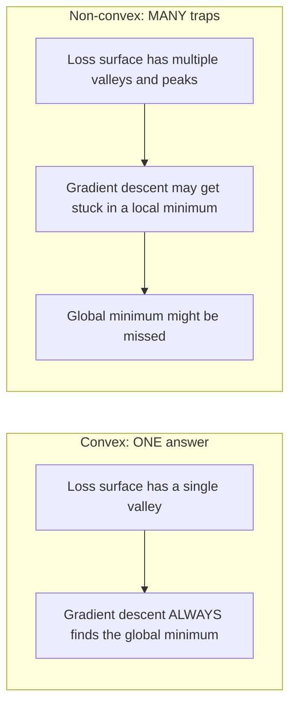
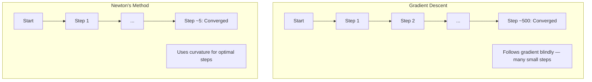
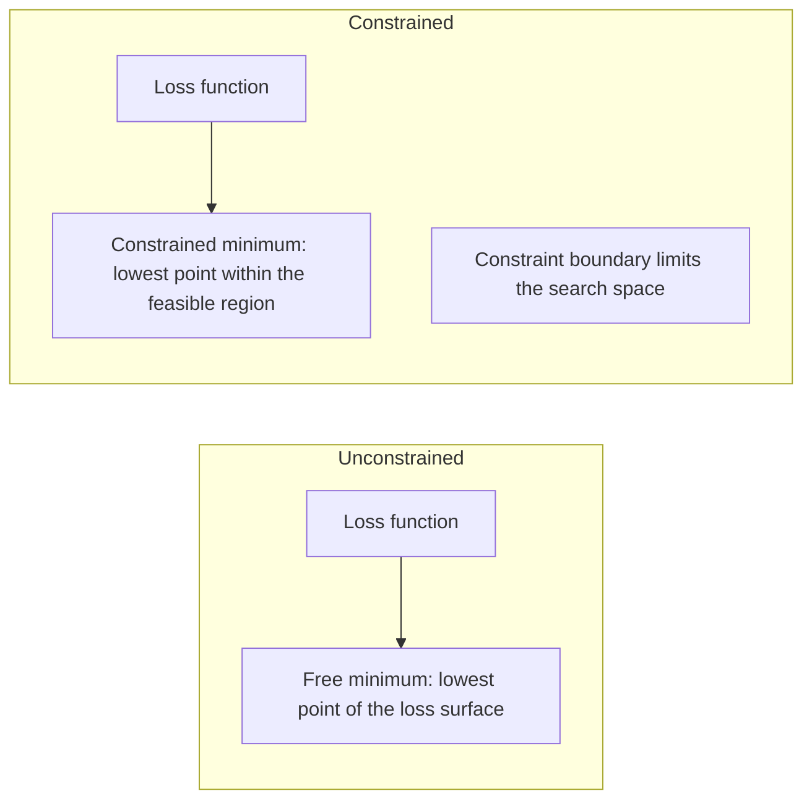
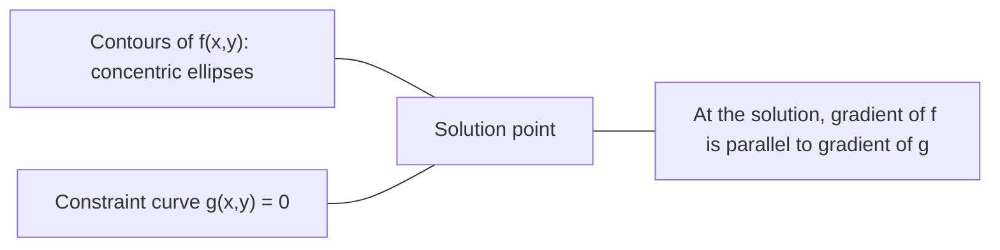

# Dışbükey Optimizasyon

> Dışbükey problemlerin bir vadisi vardır. Neural network'lerin milyonları var. Farkı bilmek önemlidir.

**Tür:** Yapım
**Dil:** Python
**Önkoşullar:** Aşama 1, Dersler 04 (ML için Matematik), 08 (Optimizasyon)
**Süre:** ~90 dakika

## Öğrenme Hedefleri

- Tanımı, ikinci türevi ve Hessian kriterlerini kullanarak bir fonksiyonun dışbükey olup olmadığını test edin
- Newton yöntemini uygulayın ve ikinci dereceden yakınsamasını gradient inişiyle karşılaştırın
- Lagrange çarpanlarını kullanarak kısıtlı optimizasyon problemlerini çözün ve KKT koşullarını yorumlayın
- neural network kayıp manzaralarının neden dışbükey olmadığını ancak SGD'nin hala iyi çözümler bulduğunu açıklayın

## Sorun

Ders 08 size gradient inişini, momentumunu ve Adam'ı öğretti. Bu optimize ediciler her yüzeyde yokuş aşağı yürürler. Ama hiçbir garantiyle gelmiyorlar. Dışbükey olmayan bir arazideki Gradient inişi, kötü bir yerel minimuma inebilir, bir eyer noktasına sıkışabilir veya sonsuza kadar salınabilir. Yine de kullandınız çünkü neural network'ler dışbükey değil ve alternatif yok.

Ancak machine learning'deki sorunların çoğu dışbükeydir. Doğrusal regresyon, lojistik regresyon, SVM'ler, LASSO, ridge regresyonu. Bunlar için daha güçlü bir şey var: Matematiksel garantili optimizasyon. Dışbükey bir problemin tam olarak bir vadisi vardır. Yokuş aşağı yürüyen herhangi bir algoritma küresel minimuma ulaşacaktır. Yeniden başlatmaya gerek yok. Öğrenme oranı çizelgesi yok. Dua yok.

Dışbükeyliği anlamak üç şeyi sağlar. İlk olarak, probleminizin ne zaman kolay (dışbükey) ve ne zaman zor (dışbükey olmayan) olduğunu size söyler. İkincisi, dışbükey problemler için Newton'un yöntemi gibi daha hızlı araçlar sağlar. Üçüncüsü, makine öğrenimi boyunca ortaya çıkan kavramları açıklıyor: bir kısıtlama olarak düzenlileştirme, SVM'lerde dualite ve dışbükeyliğin size sağladığı her güzel özelliği ihlal etmesine rağmen deep learning'nin neden işe yaradığı.

## Konsept

### Dışbükey kümeler

Bir S kümesi, S'deki herhangi iki nokta için aralarındaki doğru parçası da tamamen S'de bulunuyorsa dışbükeydir.

| Dışbükey kümeler | Dışbükey değil |
|---|---|
| **Dikdörtgen**: İçerideki herhangi iki nokta, içeride kalan bir çizgi parçasıyla birleştirilebilir | **Yıldız/hilal şekli**: içteki iki nokta arasındaki çizgi kümenin dışından geçebilir |
| **Üçgen**: aynı özellik tüm iç noktalar için geçerlidir | **Çörek/halka**: delik, bazı çizgi parçalarının setten çıktığı anlamına gelir |
| Herhangi iki nokta arasındaki çizgi parçası | Bazı nokta çiftleri arasındaki doğru parçası kümeden çıkar |

Biçimsel test: S'deki herhangi bir x, y noktası ve [0, 1]'deki herhangi bir t noktası için, tx + (1-t)y noktası da S'dedir.

Dışbükey küme örnekleri:
- Bir doğru, bir düzlem, R^n'nin tamamı
- Bir top (daire, küre, hiperküre)
- Bir yarım boşluk: {x : a^T x <= b}
- Herhangi bir sayıda dışbükey kümenin kesişimi

Dışbükey olmayan kümelere örnekler:
- Bir çörek (halka)
- İki ayrı dairenin birleşimi
- "Göçük" veya "delik" bulunan herhangi bir set

### Dışbükey fonksiyonlar

Bir f fonksiyonu, tanım kümesi bir dışbükey küme ise ve tanım kümesindeki herhangi iki x, y noktası ve [0, 1]'deki herhangi bir t için dışbükeydir:

```
f(tx + (1-t)y) <= t*f(x) + (1-t)*f(y)
```

Geometrik olarak: grafikteki herhangi iki nokta arasındaki çizgi parçası grafiğin üzerinde veya üstünde yer alır.

| Emlak | Dışbükey fonksiyon | Dışbükey olmayan fonksiyon |
|---|---|---|
| **Çizgi segmenti testi** | Grafikteki herhangi iki nokta arasındaki çizgi eğrinin **üstünde veya üstünde** yer alır | Grafikteki bazı noktalar arasındaki çizgi eğrinin **altına** iniyor |
| **Şekil** | Yukarı doğru kıvrılan tek çanak/vadi | Karışık eğriliğe sahip çoklu zirveler ve vadiler |
| **Yerel minimum** | Her yerel minimum, küresel minimumdur | Farklı yüksekliklerde birden fazla yerel minimum mevcut olabilir |

Ortak dışbükey fonksiyonlar:
- f(x) = x^2 (parabol)
- f(x) = |x| (mutlak değer)
- f(x) = e^x (üstel)
- f(x) = max(0, x) (ReLU, parçalı doğrusal olsa da)
- x > 0 için f(x) = -log(x) (negatif log)
- Herhangi bir doğrusal fonksiyon f(x) = a^T x + b (hem dışbükey hem de içbükey)

### Dışbükeylik testi

En kolayından en zoruna doğru üç pratik test.

**Test 1: İkinci türev testi (1D).** Tüm x'ler için f''(x) >= 0 ise f dışbükeydir.

- f(x) = x^2: f''(x) = 2 >= 0. Dışbükey.
- f(x) = x^3: f''(x) = 6x. x < 0 için negatif. Dışbükey değil.
- f(x) = e^x: f''(x) = e^x > 0. Dışbükey.

**Test 2: Hessian testi (çok değişkenli).** Eğer Hessian matrisi H(x) tüm x'ler için pozitif yarı tanımlı ise, f dışbükeydir. Hessian ikinci kısmi türevlerin matrisidir.

**Test 3: Tanım testi.** f(tx + (1-t)y) <= t*f(x) + (1-t)*f(y) eşitsizliğini doğrudan kontrol edin. Türevlerin hesaplanmasının zor olduğu fonksiyonlar için kullanışlıdır.

### Dışbükeylik neden önemlidir?

Dışbükey optimizasyonun merkezi teoremi:

**Dışbükey bir fonksiyon için her yerel minimum, global bir minimumdur.**

Bu, gradient inişinin sıkışıp kalamayacağı anlamına gelir. Yokuş aşağı giden her yol aynı cevaba çıkar. Algoritmanın optimal çözüme yakınsaması garanti edilir.



Sonuçlar:
- Rastgele yeniden başlatmalara gerek yok
- Gelişmiş öğrenme oranı programlarına gerek yok
- Yakınsaklık kanıtları mümkündür (oran, fonksiyon özelliklerine bağlıdır)
- Çözüm benzersizdir (düz bölgelere kadar)

### ML'de dışbükey ve dışbükey olmayan

| Sorun | Dışbükey mi? | Neden |
|---------|---------|-----|
| Doğrusal regresyon (MSE) | Evet | Kayıp ağırlık cinsinden ikinci derecedendir |
| Lojistik regresyon | Evet | Günlük kaybı ağırlıklarda dışbükeydir |
| SVM (menteşe kaybı) | Evet | Maksimum doğrusal fonksiyonlar |
| LASSO (L1 regresyonu) | Evet | Dışbükey fonksiyonların toplamı dışbükeydir |
| Sırt regresyonu (L2) | Evet | İkinci dereceden + ikinci dereceden = dışbükey |
| Neural network (herhangi bir kayıp) | Hayır | Doğrusal olmayan aktivasyonlar dışbükey olmayan bir manzara yaratır |
| k-kümeleme anlamına gelir | Hayır | Ayrık atama adımı |
| Matris çarpanlarına ayırma | Hayır | Bilinmeyenlerin çarpımı |

Dışbükey kayıpları olan doğrusal modeller dışbükeydir. Doğrusal olmayan aktivasyonlarla gizli katmanları eklediğinizde dışbükeylik bozulur.

### Hessian matrisi

Bir f fonksiyonunun Hessian H'si: R^n -> R, ikinci kısmi türevlerin n x n matrisidir.

```
H[i][j] = d^2 f / (dx_i dx_j)
```

f(x, y) = x^2 + 3xy + y^2 için:

```
df/dx = 2x + 3y       d^2f/dx^2 = 2      d^2f/dxdy = 3
df/dy = 3x + 2y       d^2f/dydx = 3      d^2f/dy^2 = 2

H = [ 2  3 ]
    [ 3  2 ]
```

Hessian eğriliği anlatıyor:
- Özdeğerlerin tümü pozitiftir: fonksiyon her yönde yukarı doğru eğriler (bu noktada dışbükey)
- Özdeğerlerin tümü negatif: her yönde aşağı doğru eğriler (içbükey, yerel maksimum)
- Karışık işaretler: eyer noktası (bazı yönlerde yukarı, bazı yönlerde aşağı doğru kıvrılır)
- Sıfır özdeğer: bu yönde düz (dejenere)

Dışbükeylik için, Hessian'ın yalnızca bir noktada değil, her yerde pozitif yarı tanımlı (tüm özdeğerler >= 0) olması gerekir.

### Newton'un yöntemi

Gradient iniş birinci dereceden bilgileri (gradient) kullanır. Newton'un yöntemi ikinci dereceden bilgiyi (Hessian) kullanır. Geçerli noktada ikinci dereceden bir yaklaşıma uyar ve doğrudan bu ikinci dereceden minimuma atlar.

```
Update rule:
  x_new = x - H^(-1) * gradient

Compare to gradient descent:
  x_new = x - lr * gradient
```

Newton'un yöntemi, skaler öğrenme oranını ters Hessian ile değiştirir. Bu, yerel eğriliğe göre adım boyutunu ve yönünü otomatik olarak ayarlar.



Avantajları:
- Minimuma yakın ikinci dereceden yakınsama (her adımda hata kareleri)
- Ayarlanacak öğrenme oranı yok
- Ölçekle değişmez (sorunu nasıl parametreleştirdiğinize bakılmaksızın çalışır)

Dezavantajları:
- Hessian'ı hesaplamak O(n^2) hafızaya ve tersine çevirmek için O(n^3)'e mal olur
- 1 milyon ağırlığa sahip bir neural network için, bu 10^12 giriş ve 10^18 işlemdir
- deep learning için pratik değil

### Kısıtlı optimizasyon

Kısıtsız optimizasyon: f(x)'i tüm x'ler üzerinden en aza indirin.
Kısıtlı optimizasyon: kısıtlamalara bağlı olarak f(x)'i en aza indirin.

Gerçek sorunların kısıtlamaları vardır. Maliyeti en aza indirmek istiyorsunuz ancak bütçeniz sınırlı. Hatayı en aza indirmek istiyorsunuz ancak model karmaşıklığınız sınırlıdır.



### Lagrange çarpanları

Lagrange çarpanları yöntemi, kısıtlı bir problemi kısıtsız bir probleme dönüştürür.

Problem: f(x)'i g(x) = 0'a bağlı olarak en aza indirin.

Çözüm: Yeni bir değişken (Lagrange çarpanı lambda) tanıtın ve kısıtlanmamış problemi çözün:

```
L(x, lambda) = f(x) + lambda * g(x)
```

Çözümde L'nin gradient'si sıfırdır:

```
dL/dx = df/dx + lambda * dg/dx = 0
dL/dlambda = g(x) = 0
```

Geometrik sezgi: kısıtlı minimumda, f'nin gradient'si g kısıtının gradient'sine paralel olmalıdır. Paralel olmasalardı kısıtlama yüzeyi boyunca hareket edebilir ve f'yi daha da azaltabilirsiniz.



Örnek: x + y = 1'e bağlı olarak f(x,y) = x^2 + y^2'yi en aza indirin.

```
L = x^2 + y^2 + lambda(x + y - 1)

dL/dx = 2x + lambda = 0  =>  x = -lambda/2
dL/dy = 2y + lambda = 0  =>  y = -lambda/2
dL/dlambda = x + y - 1 = 0

From first two: x = y
Substituting: 2x = 1, so x = y = 0.5, lambda = -1
```

x + y = 1 doğrusu üzerinde orijine en yakın nokta (0,5, 0,5)'tir.

### KKT koşulları

Karush-Kuhn-Tucker koşulları Lagrange çarpanlarını eşitsizlik kısıtlamalarına kadar genişletir.

Sorun: i = 1, ..., m için g_i(x) <= 0'a bağlı olarak f(x)'i en aza indirin.

KKT koşulları (optimalite için gerekli):

```
1. Stationarity:    df/dx + sum(lambda_i * dg_i/dx) = 0
2. Primal feasibility:  g_i(x) <= 0  for all i
3. Dual feasibility:    lambda_i >= 0  for all i
4. Complementary slackness:  lambda_i * g_i(x) = 0  for all i
```

Tamamlayıcı gevşeklik temel anlayıştır: ya kısıtlama aktiftir (g_i = 0, çözüm sınırda durur) ya da çarpan sıfırdır (kısıtlama önemli değildir). Çözümü etkilemeyen bir kısıtlama lambda = 0'dır.

KKT koşulları SVM'lerin merkezinde yer alır. Destek vektörleri kısıtlamanın aktif olduğu (lambda > 0) veri noktalarıdır. Diğer tüm veri noktaları lambda = 0'a sahiptir ve karar sınırını etkilemez.

### Kısıtlı optimizasyon olarak düzenlileştirme

L1 ve L2'nin düzenlenmesi keyfi hileler değildir. Bunlar kılık değiştirmiş kısıtlı optimizasyon problemleridir.

**L2 düzenlemesi (Ridge):**

```
minimize  Loss(w)  subject to  ||w||^2 <= t

Equivalent unconstrained form:
minimize  Loss(w) + lambda * ||w||^2
```

||w||^2 <= t kısıtı bir topu tanımlar (2B'de daire, 3B'de küre). Çözüm, kayıp konturlarının bu topa ilk temas ettiği yerdir.

**L1 düzenlemesi (LASSO):**

```
minimize  Loss(w)  subject to  ||w||_1 <= t

Equivalent unconstrained form:
minimize  Loss(w) + lambda * ||w||_1
```

||w||_1 <= t kısıtı bir baklava tanımlar (2B'de döndürülmüş kare).

| Emlak | L2 kısıtlaması (daire içine alın) | L1 kısıtlaması (elmas) |
|---|---|---|
| **Kısıtlama şekli** | Daire (yüksek loşlukta küre) | Elmas (2D'de döndürülmüş kare) |
| **Kayıp konturunun temas ettiği yer** | Pürüzsüz sınır — daire üzerindeki herhangi bir nokta | Köşe — bir eksenle hizalanmış |
| **Çözüm davranışı** | Ağırlıklar küçük ama sıfır değil | Bazı ağırlıklar tam olarak sıfırdır (seyrek) |
| **Sonuç** | Ağırlık küçülmesi | Özellik seçimi |

Bu, L1'in neden seyrek modeller (özellik seçimi) ürettiğini, L2'nin ise yalnızca ağırlıkları küçülttüğünü açıklamaktadır. Elmasın eksenlerle hizalanmış köşeleri vardır. Kayıp konturlarının bir köşeye dokunma olasılığı daha yüksektir ve bir veya daha fazla ağırlığı tam olarak sıfıra ayarlar.

### Dualite

Her kısıtlı optimizasyon probleminin (birincil) bir tamamlayıcı problemi (ikili) vardır. Dışbükey problemler için asal ve ikili aynı optimal değere sahiptir. Bu güçlü bir dualitedir.

Lagrange ikili fonksiyonu:

```
Primal: minimize f(x) subject to g(x) <= 0
Lagrangian: L(x, lambda) = f(x) + lambda * g(x)
Dual function: d(lambda) = min_x L(x, lambda)
Dual problem: maximize d(lambda) subject to lambda >= 0
```

Dualite neden önemlidir:
- İkili problemi çözmek bazen ilk problemden daha kolaydır
- SVM'ler, sorunun veri noktaları arasındaki nokta çarpımlarına bağlı olduğu ikili formda çözülür (çekirdek hilesini etkinleştirerek)
- İkili, çözüm kalitesini kontrol etmek için yararlı olan, temel optimum üzerinde bir alt sınır sağlar

Özellikle SVM'ler için:

```
Primal: find w, b that maximize the margin 2/||w|| subject to
        y_i(w^T x_i + b) >= 1 for all i

Dual:   maximize sum(alpha_i) - 0.5 * sum_ij(alpha_i * alpha_j * y_i * y_j * x_i^T x_j)
        subject to alpha_i >= 0 and sum(alpha_i * y_i) = 0

The dual only involves dot products x_i^T x_j.
Replace x_i^T x_j with K(x_i, x_j) to get the kernel trick.
```

### deep learning dışbükey olmamasına rağmen neden çalışıyor?

Neural network loss function'ler son derece dışbükey değildir. Her klasik ölçüye göre bunları optimize etmek başarısız olmalıdır. Ancak stokastik gradient inişi güvenilir bir şekilde iyi çözümler bulur. Bunu çeşitli faktörler açıklamaktadır.

**Yerel minimumların çoğu yeterince iyidir.** Yüksek boyutlu uzaylarda, rastgele kritik noktalar (gradient'nin sıfır olduğu yerlerde) yerel minimumlar değil, çoğunlukla eyer noktalarıdır. Mevcut birkaç yerel minimum, genel minimuma yakın kayıp değerlerine sahip olma eğilimindedir. Parametre uzayı milyonlarca boyuta sahip olduğunda korkunç bir yerel minimumda sıkışıp kalmak son derece olası değildir.

**Yerel minimumlar değil, eyer noktaları asıl engeldir.** n parametreli bir fonksiyonda, bir eyer noktası pozitif ve negatif eğrilik yönlerinin bir karışımına sahiptir. Yüksek boyutlarda rastgele bir kritik nokta için, tüm n özdeğerin pozitif (yerel minimum) olma olasılığı kabaca 2^(-n)'dir. Neredeyse tüm kritik noktalar eyer noktalarıdır. SGD'nin gürültüsü onlardan kaçmaya yardımcı oluyor.

**Aşırı parametrelendirme ortamı düzgünleştirir.** Eğitim örneklerinden daha fazla parametreye sahip ağlar daha düzgün, daha bağlantılı kayıp yüzeylerine sahiptir. Daha geniş ağlarda daha az kötü yerel minimum bulunur. Bu, mantığa aykırıdır ancak ampirik olarak tutarlıdır.

**Kayıp peyzaj yapısı:**

| Emlak | Düşük boyutlu uzay | Yüksek boyutlu uzay |
|---|---|---|
| **Manzara** | Birçok izole zirve ve vadi | Sorunsuz bir şekilde birbirine bağlanan vadiler |
| **Minimum** | Birçok izole yerel minimum | Birkaç kötü yerel minimum; çoğu optimale yakın |
| **Navigasyon** | Küresel minimumu bulmak zor | Birçok yol iyi çözümlere yol açar |
| **Kritik noktalar** | Yerel minimum ve eyer noktalarının karışımı | Yerel minimumlar değil, ezici bir çoğunlukla eyer noktaları |

**Stokastik gürültü, örtülü düzenleme görevi görür.** Mini toplu SGD, keskin minimumlara yerleşmeyi önleyen gürültü ekler. Keskin minimum aşırı uyum; düz minimum genelleme. Gürültü, optimizasyonu kayıp manzarasının düz bölgelerine doğru yönlendirir.

### Uygulamada ikinci dereceden yöntemler

Pure Newton'un yöntemi büyük modeller için pratik değildir. Birkaç yaklaşım, ikinci dereceden bilgiyi kullanılabilir hale getirir.

**L-BFGS (Sınırlı bellekli BFGS):** Son m gradient farklarını kullanarak ters Hessian'a yaklaşır. O(n^2) yerine O(mn) belleği gerektirir. ~10.000'e kadar parametre içeren problemlerde iyi çalışır. Klasik ML'de (lojistik regresyon, CRF'ler) kullanılır ancak deep learning kullanılmaz.

**Doğal gradient:** Standart Hessian yerine Fisher bilgi matrisini (log olasılığının beklenen Hessian'ı) kullanır. Bu olasılık dağılımlarının geometrisini açıklar. K-FAC (Kronecker Faktörlü Yaklaşık Eğrilik), Fisher matrisine bir Kronecker ürünü olarak yaklaşır ve neural network'ler için pratik hale getirir.

**Hessian içermeyen optimizasyon:** Hx = g'yi hiç H oluşturmadan çözmek için gradient eşleniği kullanır. Yalnızca otomatik türev yoluyla O(n) süresinde hesaplanabilen Hessian vektör çarpımları gerektirir.

**Köşegen yaklaşımlar:** Adem'in ikinci momenti, Hessian köşegeninin çapraz yaklaşımıdır. AdaHessian, Hutchinson tahmincisi aracılığıyla gerçek Hessian köşegen elemanlarını kullanarak bunu genişletir.

| Yöntem | Bellek | Adım başına maliyet | Ne zaman kullanılır |
|--------|--------|--------------|-------------|
| Gradient iniş | O(n) | O(n) | Temel, büyük modeller |
| Newton'un yöntemi | O(n^2) | O(n^3) | Küçük dışbükey problemler |
| L-BFGS | O(mn) | O(mn) | Orta dışbükey problemler |
| Adem | O(n) | O(n) | Deep learning varsayılan |
| K-FAC | O(n) | Katman başına O(n) | Araştırma, büyük serili eğitim |

```figure
convex-vs-nonconvex
```

## İnşa Et

### Adım 1: Dışbükeylik denetleyicisi

Noktaları örnekleyerek ve tanımı kontrol ederek dışbükeyliği deneysel olarak test eden bir fonksiyon oluşturun.

```python
import random
import math

def check_convexity(f, dim, bounds=(-5, 5), samples=1000):
    violations = 0
    for _ in range(samples):
        x = [random.uniform(*bounds) for _ in range(dim)]
        y = [random.uniform(*bounds) for _ in range(dim)]
        t = random.uniform(0, 1)
        mid = [t * xi + (1 - t) * yi for xi, yi in zip(x, y)]
        lhs = f(mid)
        rhs = t * f(x) + (1 - t) * f(y)
        if lhs > rhs + 1e-10:
            violations += 1
    return violations == 0, violations
```

### Adım 2: Newton'un 2B yöntemi

Açık bir Hessian kullanarak Newton'un yöntemini uygulayın. Yakınsama hızını gradient inişiyle karşılaştırın.

```python
def newtons_method(f, grad_f, hessian_f, x0, steps=50, tol=1e-12):
    x = list(x0)
    history = [x[:]]
    for _ in range(steps):
        g = grad_f(x)
        H = hessian_f(x)
        det = H[0][0] * H[1][1] - H[0][1] * H[1][0]
        if abs(det) < 1e-15:
            break
        H_inv = [
            [H[1][1] / det, -H[0][1] / det],
            [-H[1][0] / det, H[0][0] / det],
        ]
        dx = [
            H_inv[0][0] * g[0] + H_inv[0][1] * g[1],
            H_inv[1][0] * g[0] + H_inv[1][1] * g[1],
        ]
        x = [x[0] - dx[0], x[1] - dx[1]]
        history.append(x[:])
        if sum(gi ** 2 for gi in g) < tol:
            break
    return history
```

### Adım 3: Lagrange çarpanı çözücü

Lagrange'da gradient inişini kullanarak kısıtlı optimizasyonu çözün.

```python
def lagrange_solve(f_grad, g_val, g_grad, x0, lr=0.01,
                   lr_lambda=0.01, steps=5000):
    x = list(x0)
    lam = 0.0
    history = []
    for _ in range(steps):
        fg = f_grad(x)
        gv = g_val(x)
        gg = g_grad(x)
        x = [
            xi - lr * (fgi + lam * ggi)
            for xi, fgi, ggi in zip(x, fg, gg)
        ]
        lam = lam + lr_lambda * gv
        history.append((x[:], lam, gv))
    return history
```

### Adım 4: Birinci derece ile ikinci dereceyi karşılaştırın

gradient inişini ve Newton yöntemini aynı ikinci dereceden fonksiyon üzerinde çalıştırın. Yakınsamaya giden adımları sayın.

```python
def quadratic(x):
    return 5 * x[0] ** 2 + x[1] ** 2

def quadratic_grad(x):
    return [10 * x[0], 2 * x[1]]

def quadratic_hessian(x):
    return [[10, 0], [0, 2]]
```

Newton'un yöntemi 1 adımda yakınsayacaktır (ikinci dereceden denklemler için kesindir). Gradient iniş yüzlerce adım alacaktır çünkü Hessian'ın özdeğerleri 5 kat farklılık göstererek uzun bir vadi oluşturur.

## Kullan onu

Konvekslik analizi, ML modelleri ve çözücüleri seçerken doğrudan uygulanır.

Dışbükey problemler için (lojistik regresyon, SVM'ler, LASSO):
- Özel çözücüler kullanın (liblinear, CVXPY, scipy.optimize.minimize ve method='L-BFGS-B')
- Benzersiz bir küresel çözüm bekliyoruz
- İkinci dereceden yöntemler pratik ve hızlıdır

Dışbükey olmayan problemler için (neural network'ler):
- Birinci dereceden yöntemleri kullanın (SGD, Adam)
- Çözümün başlatmaya ve rastgeleliğe bağlı olduğunu kabul edin
- Örtülü düzenleme olarak aşırı parametrelendirme, gürültü ve öğrenme oranı çizelgelerini kullanın
- Küresel minimumu arayarak zaman kaybetmeyin. İyi bir yerel minimum yeterlidir.

```python
from scipy.optimize import minimize

result = minimize(
    fun=lambda w: sum((y - X @ w) ** 2) + 0.1 * sum(w ** 2),
    x0=np.zeros(d),
    method='L-BFGS-B',
    jac=lambda w: -2 * X.T @ (y - X @ w) + 0.2 * w,
)
```

SVM'ler için ikili formülasyon, çekirdek numarasını kullanmanıza olanak tanır:

```python
from sklearn.svm import SVC

svm = SVC(kernel='rbf', C=1.0)
svm.fit(X_train, y_train)
print(f"Support vectors: {svm.n_support_}")
```

## Egzersizler

1. **Dışbükeylik galerisi.** Denetleyiciyi kullanarak bu işlevleri dışbükeylik açısından test edin: f(x) = x^4, f(x) = sin(x), f(x,y) = x^2 + y^2, f(x,y) = x*y, f(x) = max(x, 0). Her sonucun neden anlamlı olduğunu açıklayın.

2. **Newton ile gradient iniş yarışı.** Her iki yöntemi de başlangıç noktasından (10, 10) f(x,y) = 50*x^2 + y^2 üzerinde çalıştırın. < 1e-10 kaybına ulaşmak için her birinin kaç adıma ihtiyacı vardır? Koşul numarası (en büyük Hessian özdeğerinin en küçüğüne oranı) arttığında gradient inişine ne olur?

3. **Lagrange çarpan geometrisi.** x + 2y = 4'e bağlı olarak f(x,y) = (x-3)^2 + (y-3)^2'yi en aza indirin. f'nin gradient'sinin çözümde g'nin gradient'sine paralel olduğunu kontrol ederek çözümü doğrulayın.

4. **Düzenlileştirme kısıtlaması.** L1 kısıtlı optimizasyonu uygulayın: |x|'e bağlı olarak (x-3)^2 + (y-2)^2'yi en aza indirin + |y| <= 1. Çözümün bir koordinatının sıfıra eşit olduğunu gösterin (elmas kısıtlamasından kaynaklanan seyreklik).

5. **Hessian özdeğer analizi.** Rosenbrock fonksiyonunun (1,1) ve (-1,1)'deki Hessian'ını hesaplayın. Her iki noktadaki özdeğerleri hesaplayın. Özdeğerler size minimumdaki eğrilik ile ondan uzaktaki eğrilik hakkında ne söylüyor?

## Anahtar Terimler

| Dönem | Ne anlama geliyor |
|------|---------------|
| Dışbükey set | Kümedeki herhangi iki nokta arasındaki doğru parçasının kümenin içinde kaldığı bir küme |
| Dışbükey fonksiyon | Grafiği üzerindeki herhangi iki nokta arasındaki çizginin grafiğin üstünde veya üzerinde olduğu bir fonksiyon. Eşdeğer olarak, Hessian her yerde pozitif yarı kesindir |
| Yerel minimum | Yakındaki tüm noktalardan daha düşük bir nokta. Dışbükey fonksiyonlar için her yerel minimum, global minimumdur |
| Küresel minimum | Bir fonksiyonun tüm etki alanı üzerindeki en düşük noktası |
| Hessian matrisi | Tüm ikinci kısmi türevlerin matrisi. Eğrilik bilgilerini kodlar |
| Pozitif yarı kesin | Özdeğerlerinin tümü negatif olmayan bir matris. "İkinci türev >= 0"ın çok boyutlu analoğu |
| Durum numarası | Hessian'ın en büyük özdeğerinin en küçüğüne oranı. Yüksek durum sayısı, uzun vadiler ve yavaş iniş anlamına gelir gradient |
| Newton'un yöntemi | Adım yönünü ve boyutunu belirlemek için ters Hessian'ı kullanan ikinci dereceden optimize edici. Minimuma yakın ikinci dereceden yakınsama |
| Lagrange çarpanı | Kısıtlı bir optimizasyon problemini kısıtsız bir probleme dönüştürmek için tanıtılan bir değişken |
| KKT koşulları | Eşitsizlik kısıtlamaları ile optimallik için gerekli koşullar. Lagrange çarpanlarını genelleştirin |
| Tamamlayıcı gevşeklik | Çözümde ya kısıt aktiftir ya da çarpanı sıfırdır. Hiçbir zaman ikisi de sıfırdan farklı |
| İkilik | Her kısıtlı problemin bir eşlik eden ikili problemi vardır. Dışbükey problemler için her ikisi de aynı optimal değere sahiptir |
| Güçlü dualite | Primal ve dual optimal değerler eşittir. Slater koşulunu sağlayan dışbükey problemler için geçerlidir |
| L-BFGS | Tam Hessian |
| Eyer noktası | gradient'nin sıfır olduğu ancak bazı yönlerde minimum ve bazı yönlerde maksimum olduğu bir nokta |
| Aşırı parametrelendirme | Eğitim örneklerinden daha fazla parametre kullanma. Kayıp ortamını düzeltir ve kötü yerel minimumları azaltır |

## Daha Fazla Okuma

- [Boyd & Vandenberghe: Dışbükey Optimizasyon](https://web.stanford.edu/~boyd/cvxbook/) - standart ders kitabı, çevrimiçi olarak ücretsiz olarak erişilebilir
- [Bottou, Curtis, Nocedal: Büyük Ölçekli Machine Learning için Optimizasyon Yöntemleri (2018)](https://arxiv.org/abs/1606.04838) - dışbükey optimizasyon teorisi ile deep learning uygulaması arasında köprü kurar
- [Choromanska ve diğerleri: Çok Katmanlı Ağların Kayıp Yüzeyleri (2015)](https://arxiv.org/abs/1412.0233) - dışbükey olmayan neural network manzaraları neden göründükleri kadar kötü değil
- [Nocedal & Wright: Sayısal Optimizasyon](https://link.springer.com/book/10.1007/978-0-387-40065-5) - Newton yöntemi, L-BFGS ve kısıtlı optimizasyon için kapsamlı referans
