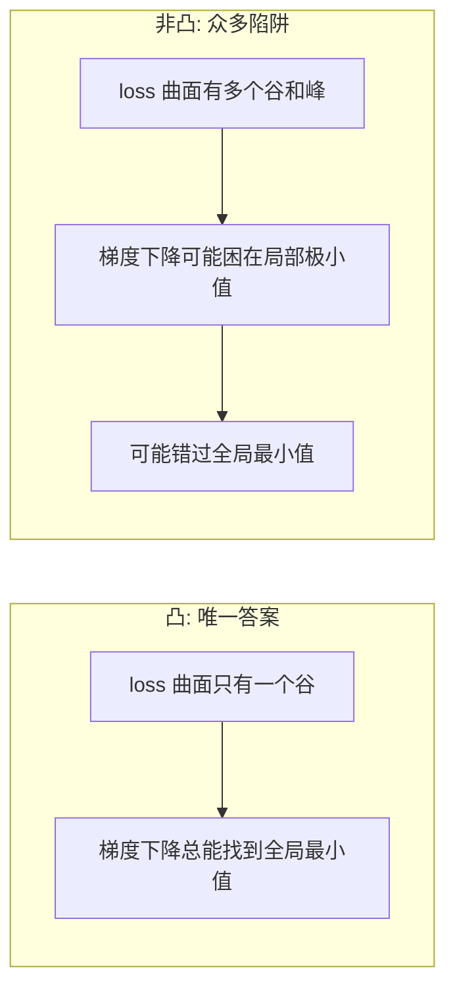
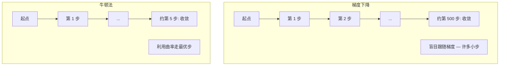
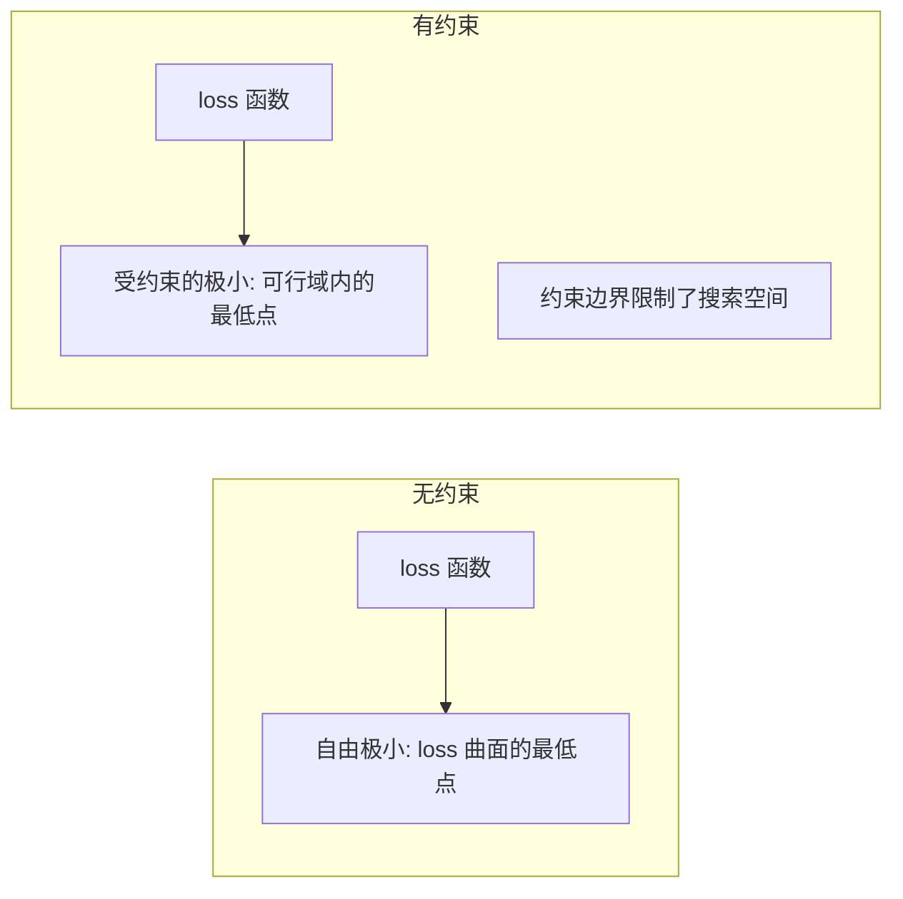
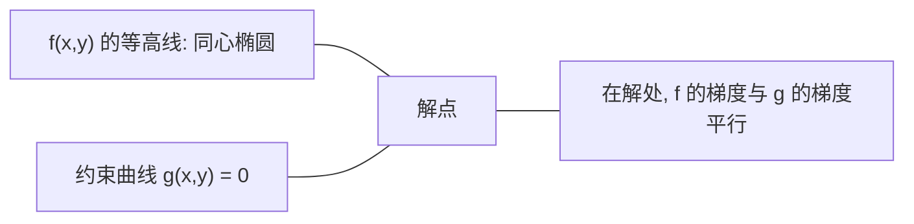

# 凸优化（Convex Optimization）

> 译注：本文译自同目录 [`en.md`](./en.md)。术语遵循仓根 [TRANSLATION_GUIDE.md](../../../../TRANSLATION_GUIDE.md)。

> 凸问题只有一个山谷。神经网络有几百万个。能不能分清这两者，很重要。

**Type:** Build
**Language:** Python
**Prerequisites:** Phase 1, Lessons 04 (Calculus for ML), 08 (Optimization)
**Time:** ~90 minutes

## 学习目标（Learning Objectives）

- 用定义、二阶导数和 Hessian 三种判据，检验一个函数是否凸
- 实现 Newton's method（牛顿法），把它的 quadratic convergence（二次收敛）和梯度下降做对比
- 用 Lagrange multipliers（拉格朗日乘子）解约束优化问题，并解读 KKT 条件
- 解释为什么神经网络的 loss 曲面是非凸的，但 SGD 仍然能找到不错的解

## 问题（The Problem）

Lesson 08 教过你梯度下降、动量和 Adam。这些 optimizer 在任何曲面上都能往低处走。但它们没有任何保证。在非凸 landscape 上跑梯度下降，可能落进糟糕的 local minimum（局部极小），可能卡在 saddle point（鞍点），也可能永远在震荡。你之所以还在用，是因为神经网络本身就是非凸的，没别的选择。

但机器学习里很多问题本身就是凸的。线性回归、logistic regression、SVM、LASSO、ridge regression 都是。对这些问题，存在更强的东西：**带数学保证的优化**。一个凸问题恰好只有一个山谷。任何往低处走的算法都会到达全局最小值。不需要重启，不需要学习率调度，不需要烧香拜佛。

理解 convexity（凸性）能给你三件事。第一，它告诉你哪些问题是简单的（凸），哪些是难的（非凸）。第二，它给你更快的工具，比如对凸问题用 Newton's method。第三，它解释了 ML 里到处可见的概念：把 regularization（正则化）看作约束、SVM 里的 duality（对偶性），以及为什么深度学习违反了 convexity 的所有好性质却还能 work。

## 概念（The Concept）

### 凸集（Convex sets）

集合 S 是凸的，当且仅当 S 中任意两点之间的线段也完全落在 S 里。

| 凸集 | 非凸 |
|---|---|
| **矩形**：内部任意两点连成的线段都在内部 | **星形/月牙形**：两个内部点之间的线段可能跑到集合外 |
| **三角形**：所有内部点都满足这个性质 | **甜甜圈/环形**：中间的洞会让某些线段离开集合 |
| 任意两点之间的线段都不离开集合 | 某些点对之间的线段会离开集合 |

形式化判据：对 S 中任意 x、y 和任意 t ∈ [0, 1]，点 tx + (1-t)y 也在 S 中。

凸集示例：
- 一条直线、一个平面、整个 R^n
- 球（圆、球面、超球面）
- 半空间：{x : a^T x <= b}
- 任意多个凸集的交集

非凸集示例：
- 甜甜圈（环形）
- 两个不相交的圆的并集
- 任何带「凹陷」或「洞」的集合

### 凸函数（Convex functions）

函数 f 是凸的，当且仅当其定义域是凸集，且对定义域中任意两点 x、y 和任意 t ∈ [0, 1]：

```
f(tx + (1-t)y) <= t*f(x) + (1-t)*f(y)
```

几何上：函数图像上任意两点之间的线段都位于图像之上或正好在图像上。

| 性质 | 凸函数 | 非凸函数 |
|---|---|---|
| **线段判据** | 图像上任意两点之间的连线**在曲线之上或正好相切** | 某些点之间的连线会**跌到曲线之下** |
| **形状** | 单一向上弯的碗/谷 | 多个峰谷，曲率方向混杂 |
| **局部极小** | 每个 local minimum 都是 global minimum | 可能存在多个高度不同的 local minima |

常见的凸函数：
- f(x) = x^2（抛物线）
- f(x) = |x|（绝对值）
- f(x) = e^x（指数函数）
- f(x) = max(0, x)（ReLU，虽然是分段线性）
- f(x) = -log(x) for x > 0（负对数）
- 任意线性函数 f(x) = a^T x + b（既凸又凹）

### 检验凸性

三种实用判据，从最简单到最严谨。

**判据 1：二阶导数判据（一维）。** 若对所有 x 都有 f''(x) >= 0，则 f 是凸的。

- f(x) = x^2：f''(x) = 2 >= 0。凸。
- f(x) = x^3：f''(x) = 6x。x < 0 时为负。非凸。
- f(x) = e^x：f''(x) = e^x > 0。凸。

**判据 2：Hessian 判据（多元）。** 若 Hessian 矩阵 H(x) 在所有 x 处都半正定（positive semidefinite），则 f 是凸的。Hessian 就是二阶偏导数构成的矩阵。

**判据 3：定义判据。** 直接验证不等式 f(tx + (1-t)y) <= t*f(x) + (1-t)*f(y)。当导数难以计算时很有用。

### 凸性为什么重要

凸优化的中心定理：

**对凸函数而言，每个局部极小都是全局极小。**

这意味着梯度下降不会被困住。任何下行路径都会通向同一个答案。算法保证收敛到最优解。



带来的后果：
- 不需要随机重启
- 不需要复杂的学习率调度
- 可以做收敛性证明（速率取决于函数性质）
- 解是唯一的（除非有平坦区域）

### ML 中的凸 vs 非凸

| 问题 | 凸吗？ | 原因 |
|---------|---------|-----|
| 线性回归（MSE） | 是 | 损失关于权重是二次的 |
| Logistic regression | 是 | Log-loss 关于权重是凸的 |
| SVM（hinge loss） | 是 | 线性函数的最大值 |
| LASSO（L1 回归） | 是 | 凸函数之和仍凸 |
| Ridge regression（L2） | 是 | 二次 + 二次 = 凸 |
| 神经网络（任意 loss） | 否 | 非线性激活制造了非凸 landscape |
| k-means 聚类 | 否 | 离散的分配步骤 |
| 矩阵分解 | 否 | 未知量相乘 |

带凸损失的线性模型是凸的。一旦加上带非线性激活的隐藏层，凸性就破了。

### Hessian 矩阵

函数 f: R^n -> R 的 Hessian H 是二阶偏导数构成的 n × n 矩阵。

```
H[i][j] = d^2 f / (dx_i dx_j)
```

对 f(x, y) = x^2 + 3xy + y^2：

```
df/dx = 2x + 3y       d^2f/dx^2 = 2      d^2f/dxdy = 3
df/dy = 3x + 2y       d^2f/dydx = 3      d^2f/dy^2 = 2

H = [ 2  3 ]
    [ 3  2 ]
```

Hessian 描述的是曲率：
- 特征值全部为正：函数在每个方向上都向上弯（该点处凸）
- 特征值全部为负：每个方向都向下弯（凹，局部极大）
- 正负混合：saddle point（某些方向上弯，某些方向下弯）
- 零特征值：在该方向上是平的（退化）

要判定凸性，Hessian 必须**处处**半正定（所有特征值 >= 0），而不是只在某一点。

### Newton's method（牛顿法）

梯度下降使用的是一阶信息（梯度）。Newton's method 用的是二阶信息（Hessian）。它在当前点拟合一个二次近似，然后直接跳到那个二次函数的极小点。

```
更新规则：
  x_new = x - H^(-1) * gradient

对比梯度下降：
  x_new = x - lr * gradient
```

Newton's method 用 Hessian 的逆矩阵替换了标量学习率。这会根据局部曲率自动调整步长和方向。



优点：
- 在极小点附近 quadratic convergence（每一步误差平方）
- 没有学习率要调
- 与参数化方式无关（你怎么参数化都不影响）

缺点：
- 计算 Hessian 需要 O(n^2) 内存、O(n^3) 求逆
- 对 100 万个权重的神经网络，那是 10^12 个元素和 10^18 次操作
- 深度学习场景不可行

### 约束优化（Constrained optimization）

无约束优化：在所有 x 上最小化 f(x)。
约束优化：在约束条件下最小化 f(x)。

现实问题都有约束。你想最小化成本，但预算有限。你想最小化误差，但模型复杂度有上限。



### Lagrange multipliers（拉格朗日乘子）

Lagrange multipliers 方法把一个约束问题转化为无约束问题。

问题：在 g(x) = 0 的约束下最小化 f(x)。

解法：引入新变量（Lagrange multiplier lambda），然后求解无约束问题：

```
L(x, lambda) = f(x) + lambda * g(x)
```

在解处，L 的梯度为零：

```
dL/dx = df/dx + lambda * dg/dx = 0
dL/dlambda = g(x) = 0
```

几何直觉：在约束极小点处，f 的梯度必须与约束 g 的梯度平行。如果不平行，你就可以沿约束曲面继续移动，把 f 进一步降低。



例子：在 x + y = 1 的约束下最小化 f(x,y) = x^2 + y^2。

```
L = x^2 + y^2 + lambda(x + y - 1)

dL/dx = 2x + lambda = 0  =>  x = -lambda/2
dL/dy = 2y + lambda = 0  =>  y = -lambda/2
dL/dlambda = x + y - 1 = 0

由前两式：x = y
代入：2x = 1，所以 x = y = 0.5，lambda = -1
```

直线 x + y = 1 上离原点最近的点是 (0.5, 0.5)。

### KKT 条件

Karush-Kuhn-Tucker 条件把 Lagrange multipliers 推广到不等式约束。

问题：在 g_i(x) <= 0（i = 1, ..., m）的约束下最小化 f(x)。

KKT 条件（最优性的必要条件）：

```
1. 平稳性（Stationarity）:    df/dx + sum(lambda_i * dg_i/dx) = 0
2. 原始可行性（Primal feasibility）:  g_i(x) <= 0  对所有 i
3. 对偶可行性（Dual feasibility）:    lambda_i >= 0  对所有 i
4. 互补松弛（Complementary slackness）:  lambda_i * g_i(x) = 0  对所有 i
```

互补松弛是关键洞察：要么约束是激活的（g_i = 0，解落在边界上），要么乘子为零（约束不起作用）。**对解没有影响的约束，其 lambda = 0。**

KKT 条件是 SVM 的核心。support vector 就是约束激活（lambda > 0）的那些数据点。所有其他数据点的 lambda = 0，对决策边界没有影响。

### 把正则化看成约束优化

L1 和 L2 正则化不是凭空冒出来的小技巧。它们其实是被乔装打扮的约束优化问题。

**L2 正则化（Ridge）：**

```
最小化  Loss(w)  约束条件  ||w||^2 <= t

等价的无约束形式：
最小化  Loss(w) + lambda * ||w||^2
```

约束 ||w||^2 <= t 定义了一个球（二维是圆，三维是球）。解就是损失等高线第一次接触到这个球的位置。

**L1 正则化（LASSO）：**

```
最小化  Loss(w)  约束条件  ||w||_1 <= t

等价的无约束形式：
最小化  Loss(w) + lambda * ||w||_1
```

约束 ||w||_1 <= t 定义了一个菱形（二维下是旋转过的正方形）。

| 性质 | L2 约束（圆） | L1 约束（菱形） |
|---|---|---|
| **约束形状** | 圆（更高维下是球） | 菱形（二维下是旋转过的正方形） |
| **损失等高线接触位置** | 光滑边界——圆上任意一点 | 角点——与坐标轴对齐 |
| **解的行为** | 权重很小但非零 | 部分权重精确为零（稀疏） |
| **结果** | 权重收缩 | 特征选择 |

这就解释了为什么 L1 产生稀疏模型（特征选择），而 L2 只会收缩权重。菱形的角点与坐标轴对齐。损失等高线更可能首先碰到这种角点，从而把一个或多个权重精确地压到零。

### 对偶性（Duality）

每个约束优化问题（原始问题，primal）都有一个伴生问题（对偶问题，dual）。对凸问题而言，原始与对偶的最优值相同。这就是 strong duality（强对偶性）。

Lagrangian 对偶函数：

```
原始: 最小化 f(x) 约束 g(x) <= 0
Lagrangian: L(x, lambda) = f(x) + lambda * g(x)
对偶函数: d(lambda) = min_x L(x, lambda)
对偶问题: 最大化 d(lambda) 约束 lambda >= 0
```

对偶为什么重要：
- 对偶问题有时比原始问题更容易解
- SVM 是在它的对偶形式下求解的，那里问题只依赖于数据点之间的内积（这就开启了 kernel trick）
- 对偶给出原始最优值的下界，可以用来检查解的质量

具体到 SVM：

```
原始: 寻找 w, b，使 margin 2/||w|| 最大，约束
       y_i(w^T x_i + b) >= 1 对所有 i

对偶: 最大化 sum(alpha_i) - 0.5 * sum_ij(alpha_i * alpha_j * y_i * y_j * x_i^T x_j)
       约束 alpha_i >= 0 且 sum(alpha_i * y_i) = 0

对偶里只出现内积 x_i^T x_j。
把 x_i^T x_j 替换成 K(x_i, x_j) 就得到 kernel trick。
```

### 深度学习为什么能在非凸下 work

神经网络的 loss 函数极度非凸。按一切经典指标，优化它们都该失败。但 SGD 却能稳定地找到不错的解。有几个因素能解释。

**多数 local minima 已经够好了。** 在高维空间里，随机选取的 critical point（梯度为零的点）压倒性地是 saddle point，而不是 local minimum。少数存在的 local minima 的 loss 通常都很接近 global minimum。当参数空间维度有几百万时，被困在一个糟糕的 local minimum 里几乎不可能。

**真正的障碍是 saddle point，不是 local minimum。** 在带 n 个参数的函数里，一个 saddle point 在某些方向上有正曲率，在另一些方向上有负曲率。对高维下的随机 critical point 而言，所有 n 个特征值都为正（即 local minimum）的概率大约是 2^(-n)。几乎所有 critical point 都是 saddle point。SGD 的噪声有助于逃出来。

**Overparameterization（过参数化）让 landscape 更平滑。** 参数比训练样本还多的网络，loss 曲面更平滑、更连通。更宽的网络反而有更少的坏 local minima。这反直觉，但经验上一致成立。

**Loss landscape 结构：**

| 性质 | 低维空间 | 高维空间 |
|---|---|---|
| **landscape** | 大量孤立的峰和谷 | 平滑相连的山谷 |
| **极小点** | 大量孤立的 local minima | 坏的 local minima 很少；多数都接近最优 |
| **导航** | 找 global minimum 很难 | 多条路径都通向好解 |
| **critical point** | local minima 与 saddle point 混杂 | 压倒性地是 saddle point，而非 local minimum |

**随机噪声起到隐式正则化的作用。** mini-batch SGD 引入的噪声阻止你陷入 sharp minima（尖锐极小）。Sharp minima 容易过拟合；flat minima（平坦极小）泛化更好。噪声让优化偏向 loss landscape 的平坦区域。

### 二阶方法的实用版本

纯 Newton's method 在大模型上不可行。一些近似让二阶信息变得可用。

**L-BFGS（Limited-memory BFGS）：** 用最近 m 次梯度差来近似 Hessian 的逆。内存需求 O(mn)，而不是 O(n^2)。对参数量在 1 万以内的问题表现良好。在经典 ML（logistic regression、CRF）里常用，但深度学习里不用。

**Natural gradient（自然梯度）：** 用 Fisher information matrix（log-likelihood 的期望 Hessian）替代标准 Hessian，体现概率分布本身的几何结构。K-FAC（Kronecker-Factored Approximate Curvature）把 Fisher 矩阵近似为 Kronecker 积，使其对神经网络可行。

**Hessian-free optimization：** 用共轭梯度法解 Hx = g，过程中始终不显式构造 H。只需要 Hessian-向量乘积，可以通过自动微分在 O(n) 时间算出。

**对角近似：** Adam 的二阶矩就是对 Hessian 对角线的对角近似。AdaHessian 在此基础上更进一步，通过 Hutchinson 估计器使用真实的 Hessian 对角元素。

| 方法 | 内存 | 单步代价 | 何时使用 |
|--------|--------|--------------|-------------|
| 梯度下降 | O(n) | O(n) | 基线，大模型 |
| Newton's method | O(n^2) | O(n^3) | 小型凸问题 |
| L-BFGS | O(mn) | O(mn) | 中等规模凸问题 |
| Adam | O(n) | O(n) | 深度学习默认 |
| K-FAC | O(n) | 每层 O(n) | 研究、大 batch 训练 |

## 动手实现（Build It）

### Step 1: 凸性检查器

写一个函数，通过采样点并检查定义来经验性地测试凸性。

```python
import random
import math

def check_convexity(f, dim, bounds=(-5, 5), samples=1000):
    violations = 0
    for _ in range(samples):
        x = [random.uniform(*bounds) for _ in range(dim)]
        y = [random.uniform(*bounds) for _ in range(dim)]
        t = random.uniform(0, 1)
        mid = [t * xi + (1 - t) * yi for xi, yi in zip(x, y)]
        lhs = f(mid)
        rhs = t * f(x) + (1 - t) * f(y)
        if lhs > rhs + 1e-10:
            violations += 1
    return violations == 0, violations
```

### Step 2: 二维 Newton's method

显式使用 Hessian 来实现 Newton's method。和梯度下降比一比收敛速度。

```python
def newtons_method(f, grad_f, hessian_f, x0, steps=50, tol=1e-12):
    x = list(x0)
    history = [x[:]]
    for _ in range(steps):
        g = grad_f(x)
        H = hessian_f(x)
        det = H[0][0] * H[1][1] - H[0][1] * H[1][0]
        if abs(det) < 1e-15:
            break
        H_inv = [
            [H[1][1] / det, -H[0][1] / det],
            [-H[1][0] / det, H[0][0] / det],
        ]
        dx = [
            H_inv[0][0] * g[0] + H_inv[0][1] * g[1],
            H_inv[1][0] * g[0] + H_inv[1][1] * g[1],
        ]
        x = [x[0] - dx[0], x[1] - dx[1]]
        history.append(x[:])
        if sum(gi ** 2 for gi in g) < tol:
            break
    return history
```

### Step 3: Lagrange multiplier 求解器

用对 Lagrangian 做梯度下降的方式来解约束优化。

```python
def lagrange_solve(f_grad, g_val, g_grad, x0, lr=0.01,
                   lr_lambda=0.01, steps=5000):
    x = list(x0)
    lam = 0.0
    history = []
    for _ in range(steps):
        fg = f_grad(x)
        gv = g_val(x)
        gg = g_grad(x)
        x = [
            xi - lr * (fgi + lam * ggi)
            for xi, fgi, ggi in zip(x, fg, gg)
        ]
        lam = lam + lr_lambda * gv
        history.append((x[:], lam, gv))
    return history
```

### Step 4: 一阶 vs 二阶对比

在同一个二次函数上跑梯度下降和 Newton's method。数一数收敛各需要多少步。

```python
def quadratic(x):
    return 5 * x[0] ** 2 + x[1] ** 2

def quadratic_grad(x):
    return [10 * x[0], 2 * x[1]]

def quadratic_hessian(x):
    return [[10, 0], [0, 2]]
```

Newton's method 一步就收敛（对二次函数它是精确的）。梯度下降会需要几百步，因为 Hessian 的特征值差了 5 倍，形成一个细长的山谷。

## 用起来（Use It）

凸性分析在挑选 ML 模型和求解器时直接派上用场。

对于凸问题（logistic regression、SVM、LASSO）：
- 用专用求解器（liblinear、CVXPY、`scipy.optimize.minimize` 配 `method='L-BFGS-B'`）
- 期待唯一的全局解
- 二阶方法实用且快

对于非凸问题（神经网络）：
- 用一阶方法（SGD、Adam）
- 接受解依赖于初始化和随机性这一事实
- 用 overparameterization、噪声和学习率调度作为隐式正则化
- 不要浪费时间寻找 global minimum，一个好的 local minimum 就够了

```python
from scipy.optimize import minimize

result = minimize(
    fun=lambda w: sum((y - X @ w) ** 2) + 0.1 * sum(w ** 2),
    x0=np.zeros(d),
    method='L-BFGS-B',
    jac=lambda w: -2 * X.T @ (y - X @ w) + 0.2 * w,
)
```

对 SVM 来说，对偶形式让你能用 kernel trick：

```python
from sklearn.svm import SVC

svm = SVC(kernel='rbf', C=1.0)
svm.fit(X_train, y_train)
print(f"Support vectors: {svm.n_support_}")
```

## 练习（Exercises）

1. **凸性博物馆。** 用前面的检查器测以下函数的凸性：f(x) = x^4、f(x) = sin(x)、f(x,y) = x^2 + y^2、f(x,y) = x*y、f(x) = max(x, 0)。解释每个结果为什么合理。

2. **Newton vs 梯度下降赛跑。** 从起点 (10, 10) 出发，在 f(x,y) = 50*x^2 + y^2 上跑两种方法。各需要多少步才能让 loss < 1e-10？当 condition number（Hessian 最大与最小特征值之比）变大时，梯度下降会怎样？

3. **Lagrange multiplier 几何。** 在 x + 2y = 4 的约束下最小化 f(x,y) = (x-3)^2 + (y-3)^2。验证解：检验在解处 f 的梯度与 g 的梯度是否平行。

4. **正则化即约束。** 实现 L1 约束的优化：在 |x| + |y| <= 1 的约束下最小化 (x-3)^2 + (y-2)^2。证明解的某一坐标恰好为零（菱形约束带来的稀疏性）。

5. **Hessian 特征值分析。** 在 (1,1) 和 (-1,1) 两点处计算 Rosenbrock 函数的 Hessian。在两点都计算特征值。这些特征值告诉你极小点处与远离极小点处的曲率有什么不同？

## 关键术语（Key Terms）

| 术语 | 含义 |
|------|---------------|
| Convex set（凸集） | 一个集合，其中任意两点之间的线段仍位于该集合内部 |
| Convex function（凸函数） | 一个函数，其图像上任意两点之间的连线都位于图像之上或之上。等价地：Hessian 处处半正定 |
| Local minimum（局部极小） | 比所有附近点都低的点。对凸函数而言，每个 local minimum 都是 global minimum |
| Global minimum（全局极小） | 函数在整个定义域上的最低点 |
| Hessian matrix（Hessian 矩阵） | 所有二阶偏导数构成的矩阵。编码了曲率信息 |
| Positive semidefinite（半正定） | 特征值全部非负的矩阵。是「二阶导数 >= 0」在多维下的对应 |
| Condition number（条件数） | Hessian 最大与最小特征值之比。条件数大意味着山谷细长，梯度下降会很慢 |
| Newton's method | 二阶 optimizer，用 Hessian 的逆决定步长方向和大小。极小点附近 quadratic convergence |
| Lagrange multiplier | 引入的一个变量，用来把约束优化转化为无约束优化 |
| KKT conditions | 不等式约束下最优性的必要条件。是 Lagrange multipliers 的推广 |
| Complementary slackness（互补松弛） | 在解处，要么约束是激活的，要么对应的乘子为零，绝不会两者都非零 |
| Duality（对偶性） | 每个约束问题都有伴生的对偶问题。对凸问题而言，两者最优值相等 |
| Strong duality（强对偶性） | 原始与对偶最优值相等。在满足 Slater 条件的凸问题上成立 |
| L-BFGS | 近似的二阶方法，存储最近 m 次梯度差而不是完整 Hessian |
| Saddle point（鞍点） | 梯度为零，但在某些方向是极小、在另一些方向是极大的点 |
| Overparameterization（过参数化） | 参数比训练样本还多。让 loss landscape 更平滑、坏 local minima 更少 |

## 延伸阅读（Further Reading）

- [Boyd & Vandenberghe: Convex Optimization](https://web.stanford.edu/~boyd/cvxbook/) ——标准教材，网上免费。
- [Bottou, Curtis, Nocedal: Optimization Methods for Large-Scale Machine Learning (2018)](https://arxiv.org/abs/1606.04838) ——把凸优化理论与深度学习实践打通。
- [Choromanska et al.: The Loss Surfaces of Multilayer Networks (2015)](https://arxiv.org/abs/1412.0233) ——为什么神经网络的非凸 landscape 没那么糟。
- [Nocedal & Wright: Numerical Optimization](https://link.springer.com/book/10.1007/978-0-387-40065-5) ——Newton's method、L-BFGS、约束优化的全面参考。
