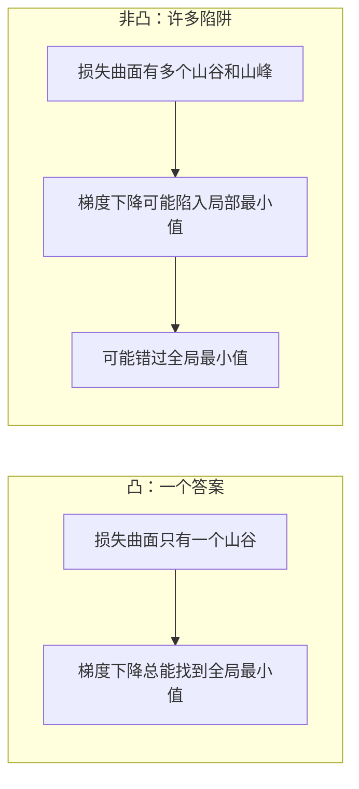
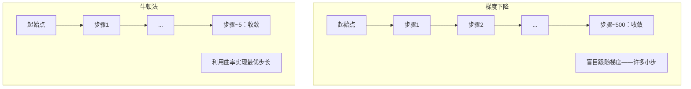

# 凸优化

> 凸问题只有一个山谷。神经网络却有数百万个。理解这一区别至关重要。

**类型：** 构建
**语言：** Python
**前置知识：** 第一阶段，第04课（机器学习微积分）、第08课（优化）
**时间：** 约90分钟

## 学习目标

- 使用定义、二阶导数和海森矩阵判据测试函数是否为凸函数
- 实现牛顿法，并将其二次收敛速度与梯度下降进行比较
- 使用拉格朗日乘数法求解带约束的优化问题，并解释KKT条件
- 解释为什么神经网络损失景观是非凸的，但随机梯度下降（SGD）仍能找到好的解

## 问题

第08课教了你梯度下降、动量和Adam。这些优化器在任何曲面上都能向下走。但它们没有提供任何保证。在非凸景观上进行梯度下降可能会陷入糟糕的局部最小值、卡在鞍点上，或者永远振荡。你仍然使用它，因为神经网络是非凸的，而且别无选择。

但机器学习中的许多问题是凸的。线性回归、逻辑回归、支持向量机（SVM）、套索回归（LASSO）、岭回归。对于这些问题，存在更强大的方法：具有数学保证的优化。一个凸问题恰好有一个山谷。任何向下走的算法都会达到全局最小值。无需重新启动，无需学习率调度，无需祈祷。

理解凸性有三点好处。首先，它告诉你你的问题是容易（凸）还是困难（非凸）。其次，它为你提供了更快的工具，比如用于凸问题的牛顿法。第三，它解释了贯穿机器学习的各种概念：作为约束的正则化、SVM中的对偶性，以及为什么深度学习尽管违反了凸性给出的所有良好性质却仍然有效。

## 概念

### 凸集

如果对于集合S中的任意两点，它们之间的线段完全位于S内，则集合S是凸的。

| 凸集 | 非凸 |
|---|---|
| **矩形**：内部任意两点之间的线段始终位于内部 | **星形/新月形**：两个内部点之间的线段可能穿过集合外部 |
| **三角形**：对所有内部点同样成立 | **甜甜圈/环面**：空洞导致某些线段离开集合 |
| 任意两点之间的线段始终位于集合内 | 某些点对之间的线段会离开集合 |

形式化测试：对于S中的任意点x、y以及任意t ∈ [0, 1]，点tx + (1-t)y也属于S。

凸集的例子：
- 直线、平面、整个R^n
- 球体（圆、球、超球）
- 半空间：{x : a^T x <= b}
- 任意多个凸集的交集

非凸集的例子：
- 甜甜圈（环形面）
- 两个不相交圆的并集
- 任何有“凹陷”或“空洞”的集合

### 凸函数

如果函数f的定义域是凸集，并且对于定义域中的任意两点x、y以及任意t ∈ [0, 1]满足：

```
f(tx + (1-t)y) <= t*f(x) + (1-t)*f(y)
```

几何上：图形上任意两点之间的线段位于图形上方或与图形重合。

| 性质 | 凸函数 | 非凸函数 |
|---|---|---|
| **线段测试** | 图形上任意两点之间的线段位于**曲线上方或与曲线重合** | 图形上某些点之间的线段会**降至曲线下方** |
| **形状** | 单个碗形/山谷，向上弯曲 | 多个峰谷，曲率混合 |
| **局部最小值** | 每个局部最小值都是全局最小值 | 可能存在多个不同高度的局部最小值 |

常见的凸函数：
- f(x) = x^2（抛物线）
- f(x) = |x|（绝对值）
- f(x) = e^x（指数函数）
- f(x) = max(0, x)（ReLU，虽为分段线性）
- f(x) = -log(x) where x > 0（负对数）
- 任意线性函数 f(x) = a^T x + b（既是凸函数也是凹函数）

### 凸性测试

三种实用测试方法，从最简单到最严谨。

**测试1：二阶导数测试（一维）。** 如果对所有x都有 f''(x) >= 0，则f是凸的。

- f(x) = x^2: f''(x) = 2 >= 0。凸。
- f(x) = x^3: f''(x) = 6x。当x<0时为负。非凸。
- f(x) = e^x: f''(x) = e^x > 0。凸。

**测试2：海森矩阵测试（多维）。** 如果海森矩阵H(x)对所有x都是半正定的，则f是凸的。海森矩阵是二阶偏导数的矩阵。

**测试3：定义测试。** 直接检查不等式f(tx + (1-t)y) <= t*f(x) + (1-t)*f(y)。适用于导数难以计算的函数。

### 为什么凸性很重要

凸优化的核心定理：

**对于凸函数，每个局部最小值都是全局最小值。**

这意味着梯度下降不会陷入陷阱。任何下坡路径都会导向相同的结果。算法保证收敛到最优解。



后果：
- 无需随机重启
- 无需复杂的学习率调度
- 可以证明收敛性（速率取决于函数性质）
- 解是唯一的（在平坦区域除外）

### 机器学习中的凸与非凸

| 问题 | 凸？ | 原因 |
|---------|---------|-----|
| 线性回归（MSE） | 是 | 损失是权重的二次函数 |
| 逻辑回归 | 是 | 对数损失是权重的凸函数 |
| SVM（合页损失） | 是 | 线性函数的最大值 |
| LASSO（L1回归） | 是 | 凸函数之和为凸 |
| 岭回归（L2） | 是 | 二次+二次=凸 |
| 神经网络（任何损失） | 否 | 非线性激活函数产生非凸景观 |
| k-means聚类 | 否 | 离散分配步骤 |
| 矩阵分解 | 否 | 未知量的乘积 |

具有凸损失的线性模型是凸的。一旦你添加具有非线性激活函数的隐藏层，凸性就会被破坏。

### 海森矩阵

函数 f: R^n -> R 的海森矩阵H是二阶偏导数的n×n矩阵。

```
H[i][j] = d^2 f / (dx_i dx_j)
```

对于 f(x, y) = x^2 + 3xy + y^2：

```
df/dx = 2x + 3y       d^2f/dx^2 = 2      d^2f/dxdy = 3
df/dy = 3x + 2y       d^2f/dydx = 3      d^2f/dy^2 = 2

H = [ 2  3 ]
    [ 3  2 ]
```

海森矩阵告诉你曲率信息：
- 所有特征值均为正：函数在每个方向上都向上弯曲（该点处凸）
- 所有特征值均为负：函数在每个方向上都向下弯曲（凹，局部最大值）
- 符号混合：鞍点（某些方向上向上弯曲，某些方向上向下弯曲）
- 零特征值：该方向平坦（退化）

对于凸性，海森矩阵必须在所有点处（而不仅仅是一点）都是半正定的（所有特征值 >= 0）。

### 牛顿法

梯度下降使用一阶信息（梯度）。牛顿法使用二阶信息（海森矩阵）。它在当前点拟合一个二次近似，并直接跳转到该二次近似的极小点。

```
更新规则：
  x_new = x - H^(-1) * 梯度

与梯度下降对比：
  x_new = x - 学习率 * 梯度
```

牛顿法用逆海森矩阵替换了标量学习率。这根据局部曲率自动调整步长和方向。



优点：
- 接近最小值时二次收敛（误差每一步平方）
- 无需调整学习率
- 尺度不变（无论你如何参数化问题都有效）

缺点：
- 计算海森矩阵需要O(n^2)内存，求逆需要O(n^3)运算
- 对于拥有100万个权重的神经网络，这意味着10^12个条目和10^18次运算
- 对深度学习不实用

### 带约束的优化

无约束优化：在所有x上最小化f(x)。
带约束的优化：在满足约束条件下最小化f(x)。

实际问题都有约束。你想最小化成本但预算有限；你想最小化误差但模型复杂度有限。


### 拉格朗日乘数法

拉格朗日乘数法将带约束的问题转化为无约束问题。

问题：在g(x) = 0的条件下最小化f(x)。

解法：引入一个新变量（拉格朗日乘数lambda）并求解无约束问题：

```
L(x, lambda) = f(x) + lambda * g(x)
```

在解处，L的梯度为零：

```
dL/dx = df/dx + lambda * dg/dx = 0
dL/dlambda = g(x) = 0
```

几何直觉：在约束最小值点，f的梯度必须平行于约束g的梯度。如果它们不平行，你可以沿着约束曲面移动并进一步减小f。


示例：在x + y = 1的条件下最小化f(x,y) = x^2 + y^2。

```
L = x^2 + y^2 + lambda(x + y - 1)

dL/dx = 2x + lambda = 0  =>  x = -lambda/2
dL/dy = 2y + lambda = 0  =>  y = -lambda/2
dL/dlambda = x + y - 1 = 0

从前两个方程可得：x = y
代入：2x = 1, 所以 x = y = 0.5, lambda = -1
```

直线x + y = 1上离原点最近的点是(0.5, 0.5)。

### KKT条件

Karush-Kuhn-Tucker条件将拉格朗日乘数法扩展到不等式约束。

问题：在g_i(x) <= 0 (i = 1, ..., m)的条件下最小化f(x)。

KKT条件（最优性的必要条件）：

```
1. 平稳性：    df/dx + sum(lambda_i * dg_i/dx) = 0
2. 原始可行性：  g_i(x) <= 0  对于所有i
3. 对偶可行性：  lambda_i >= 0  对于所有i
4. 互补松弛性：  lambda_i * g_i(x) = 0  对于所有i
```

互补松弛性是关键洞察：要么约束是活跃的（g_i = 0，解位于边界上），要么乘数为零（该约束无关紧要）。不影响解的约束具有lambda = 0。

KKT条件是SVM的核心。支持向量是那些约束活跃（lambda > 0）的数据点。所有其他数据点的lambda = 0，不影响决策边界。

### 作为约束优化的正则化

L1和L2正则化并非随意技巧。它们实际上是带约束的优化问题。

**L2正则化（岭回归）：**

```
最小化  Loss(w)  满足  ||w||^2 <= t

等价的无约束形式：
最小化  Loss(w) + lambda * ||w||^2
```

约束||w||^2 <= t定义了一个球体（二维中是圆，三维中是球面）。解是损失等高线首次接触这个球体的点。

**L1正则化（LASSO）：**

```
最小化  Loss(w)  满足  ||w||_1 <= t

等价的无约束形式：
最小化  Loss(w) + lambda * ||w||_1
```

约束||w||_1 <= t定义了一个菱形（二维中是旋转的正方形）。

| 性质 | L2约束（圆） | L1约束（菱形） |
|---|---|---|
| **约束形状** | 圆（高维中是球体） | 菱形（二维中是旋转的正方形） |
| **损失等高线接触点** | 光滑边界——圆上的任何点 | 角点——与坐标轴对齐 |
| **解的行为** | 权重很小但不为零 | 某些权重精确为零（稀疏） |
| **结果** | 权重收缩 | 特征选择 |

这解释了为什么L1产生稀疏模型（特征选择）而L2只收缩权重。菱形有与坐标轴对齐的角点。损失等高线更可能接触角点，使一个或多个权重精确为零。

### 对偶性

每个带约束的优化问题（原始问题）都有一个伴随问题（对偶问题）。对于凸问题，原始问题和对偶问题具有相同的最优值。这就是强对偶性。

拉格朗日对偶函数：

```
原始问题：在 g(x) <= 0 条件下最小化 f(x)
拉格朗日函数：L(x, lambda) = f(x) + lambda * g(x)
对偶函数：d(lambda) = min_x L(x, lambda)
对偶问题：在 lambda >= 0 条件下最大化 d(lambda)
```

为什么对偶性重要：
- 对偶问题有时比原始问题更容易求解
- SVM是在其对偶形式中求解的，此时问题依赖于数据点之间的点积（从而实现核技巧）
- 对偶问题提供了原始问题最优值的下界，可用于检查解的质量

具体到SVM：

```
原始问题：找到最大化间隔 2/||w|| 的 w, b，满足：
          y_i(w^T x_i + b) >= 1，对所有 i

对偶问题：最大化 sum(alpha_i) - 0.5 * sum_ij(alpha_i * alpha_j * y_i * y_j * x_i^T x_j)
          满足 alpha_i >= 0 且 sum(alpha_i * y_i) = 0

对偶形式只涉及点积 x_i^T x_j。
将 x_i^T x_j 替换为 K(x_i, x_j) 即可得到核技巧。
```

### 深度学习为何在非凸情况下仍有效

神经网络损失函数是高度非凸的。按照所有经典标准，优化它们应该会失败。然而随机梯度下降（SGD）却可靠地找到了好的解。以下几个因素解释了这一点。

**大多数局部最小值已经足够好。** 在高维空间中，随机临界点（梯度为零的点）绝大多数是鞍点，而不是局部最小值。存在的少数局部最小值其损失值往往接近全局最小值。当参数空间有数百万个维度时，陷入一个极差的局部最小值的可能性极低。

**鞍点才是真正的障碍，而非局部最小值。** 在一个具有n个参数的函数中，鞍点具有正曲率和负曲率方向混合的特点。对于高维中的随机临界点，所有n个特征值都为正（局部最小值）的概率大约为2^(-n)。几乎所有的临界点都是鞍点。SGD的噪声有助于逃离它们。

**过参数化使景观变得平滑。** 参数比训练样本多的网络具有更平滑、连接更紧密的损失曲面。更宽的网络拥有更少的坏局部最小值。这虽然反直觉，但经验上是一致的。

**损失景观结构：**

| 性质 | 低维空间 | 高维空间 |
|---|---|---|
| **景观** | 许多孤立的峰和谷 | 平滑连接的山谷 |
| **最小值** | 许多孤立的局部最小值 | 坏的局部最小值很少；大多数接近最优 |
| **导航** | 难以找到全局最小值 | 许多路径导向好的解 |
| **临界点** | 局部最小值和鞍点混合 | 绝大多数是鞍点，而非局部最小值 |

**随机噪声充当隐式正则化。** 小批量SGD增加了噪声，阻止了收敛到尖锐最小值。尖锐最小值过拟合；平坦最小值泛化能力好。噪声使优化偏向