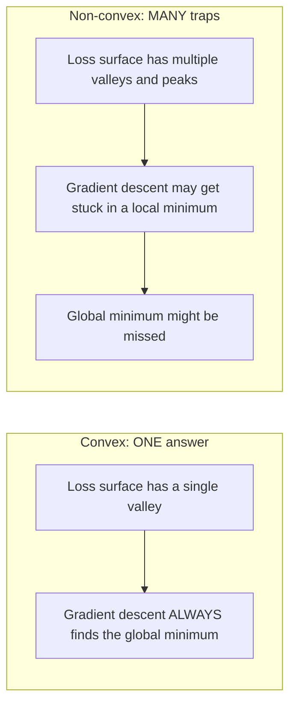
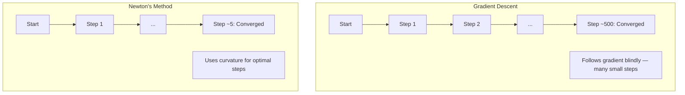
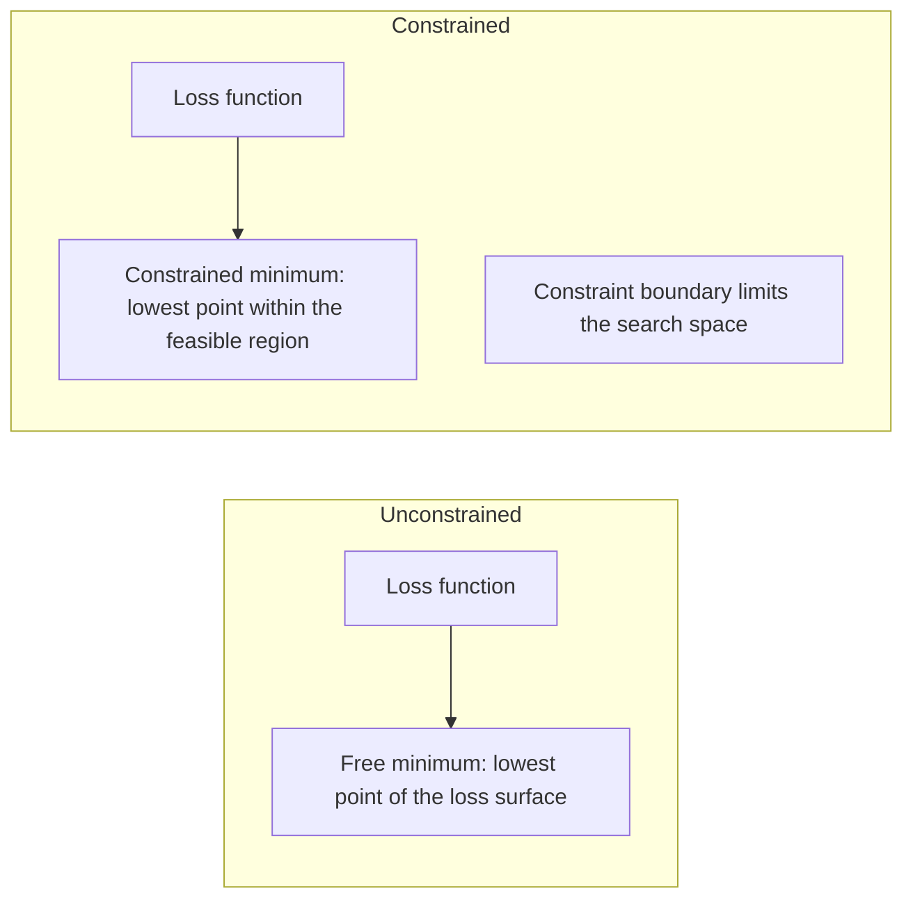
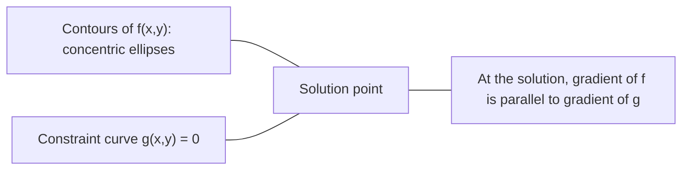

# 18 · 凸优化

> 凸问题只有一个山谷。神经网络有数百万个。知道二者的区别很重要。

**类型：** 实战构建
**语言：** Python
**前置：** 第 1 阶段，第 04 课（面向 ML 的微积分）、第 08 课（优化）
**时长：** 约 90 分钟

## 学习目标

- 使用定义、二阶导数和「海森矩阵（Hessian）」判据检验一个函数是否为凸函数
- 实现「牛顿法（Newton's method）」，并将其二次收敛速度与梯度下降进行对比
- 使用「拉格朗日乘子（Lagrange multipliers）」求解约束优化问题，并解释「KKT 条件（KKT conditions）」
- 解释为什么神经网络的损失曲面是非凸的，而「随机梯度下降（SGD）」仍然能找到好的解

## 问题所在

第 08 课教过你梯度下降、动量法和 Adam。这些优化器能在任意曲面上向下行走，但它们不附带任何保证。在非凸曲面上，梯度下降可能落入糟糕的局部最小值，可能卡在鞍点上，也可能永远振荡下去。你之所以照用不误，是因为神经网络本来就是非凸的，而且别无选择。

但机器学习中许多问题是凸的：线性回归、逻辑回归、SVM、LASSO、岭回归。对这些问题，存在某种更强的东西：带有数学保证的优化。一个凸问题恰好只有一个山谷。任何向下行走的算法都会到达全局最小值，无需重启，无需学习率调度，也无需祈祷。

理解凸性能带来三件事。第一，它告诉你什么时候问题是容易的（凸）、什么时候是困难的（非凸）。第二，它为凸问题提供了更快的工具，比如牛顿法。第三，它能解释贯穿整个 ML 的诸多概念：作为约束的正则化、SVM 中的对偶性，以及为什么深度学习在违反凸性所赋予的每一条优良性质的情况下仍然有效。

## 核心概念

### 凸集

一个集合 S 是「凸集（convex set）」，当且仅当对 S 中任意两点，连接它们的线段也完全落在 S 内。

| 凸集 | 非凸 |
|---|---|
| **矩形**：内部任意两点都可以用一条始终留在内部的线段连接 | **星形/月牙形**：两个内部点之间的连线可能穿出集合之外 |
| **三角形**：对所有内部点都满足同样的性质 | **甜甜圈/圆环**：中间的洞使得某些线段会离开集合 |
| 任意两点之间的线段都留在集合内 | 某些点对之间的线段会离开集合 |

形式化判据：对 S 中任意点 x、y 以及任意 t ∈ [0, 1]，点 tx + (1-t)y 也属于 S。

凸集的例子：
- 一条直线、一个平面、整个 R^n
- 一个球（圆、球面、超球面）
- 一个半空间：{x : a^T x <= b}
- 任意多个凸集的交集

非凸集的例子：
- 一个甜甜圈（圆环）
- 两个不相交圆的并集
- 任何带有「凹陷」或「洞」的集合

### 凸函数

一个函数 f 是「凸函数（convex function）」，当且仅当它的定义域是凸集，且对定义域中任意两点 x、y 以及任意 t ∈ [0, 1]：

```
f(tx + (1-t)y) <= t*f(x) + (1-t)*f(y)
```

几何上：函数图像上任意两点之间的线段都位于图像上方或图像上。

| 性质 | 凸函数 | 非凸函数 |
|---|---|---|
| **线段判据** | 图像上任意两点之间的连线位于曲线**上方或曲线上** | 图像上某些点之间的连线会**跌到**曲线**下方** |
| **形状** | 单个向上弯曲的碗状/山谷 | 多个峰谷、曲率混杂 |
| **局部最小值** | 每个局部最小值都是全局最小值 | 可能存在多个高度不同的局部最小值 |

常见的凸函数：
- f(x) = x^2（抛物线）
- f(x) = |x|（绝对值）
- f(x) = e^x（指数）
- f(x) = max(0, x)（ReLU，尽管是分段线性的）
- f(x) = -log(x)，当 x > 0（负对数）
- 任何线性函数 f(x) = a^T x + b（既凸又凹）

### 检验凸性

三种实用的检验方法，由易到严。

**方法 1：二阶导数检验（一维）。** 如果对所有 x 都有 f''(x) >= 0，则 f 是凸函数。

- f(x) = x^2：f''(x) = 2 >= 0。凸。
- f(x) = x^3：f''(x) = 6x。当 x < 0 时为负。非凸。
- f(x) = e^x：f''(x) = e^x > 0。凸。

**方法 2：海森矩阵检验（多元）。** 如果对所有 x，海森矩阵 H(x) 都是「半正定（positive semidefinite）」的，则 f 是凸函数。海森矩阵是二阶偏导数构成的矩阵。

**方法 3：定义检验。** 直接检查不等式 f(tx + (1-t)y) <= t*f(x) + (1-t)*f(y)。适用于导数难以计算的函数。

### 凸性为什么重要

凸优化的核心定理：

**对于凸函数，每一个局部最小值都是全局最小值。**

这意味着梯度下降不可能被困住。任何向下的路径都通向同一个答案。算法保证收敛到最优解。



由此带来的结果：
- 无需随机重启
- 无需复杂的学习率调度
- 收敛性证明成为可能（收敛速率取决于函数性质）
- 解是唯一的（在平坦区域上至多差一个偏移）

### ML 中的凸与非凸

| 问题 | 是否凸？ | 原因 |
|---------|---------|-----|
| 线性回归（MSE） | 是 | 损失关于权重是二次的 |
| 逻辑回归 | 是 | 对数损失关于权重是凸的 |
| SVM（合页损失） | 是 | 线性函数的最大值 |
| LASSO（L1 回归） | 是 | 凸函数之和仍是凸的 |
| 岭回归（L2） | 是 | 二次 + 二次 = 凸 |
| 神经网络（任何损失） | 否 | 非线性激活造就非凸曲面 |
| k-means 聚类 | 否 | 离散的分配步骤 |
| 矩阵分解 | 否 | 未知量的乘积 |

带凸损失的线性模型是凸的。一旦你加入带有非线性激活的隐藏层，凸性就被打破了。

### 海森矩阵

函数 f: R^n -> R 的「海森矩阵（Hessian）」H 是一个由二阶偏导数构成的 n x n 矩阵。

```
H[i][j] = d^2 f / (dx_i dx_j)
```

对于 f(x, y) = x^2 + 3xy + y^2：

```
df/dx = 2x + 3y       d^2f/dx^2 = 2      d^2f/dxdy = 3
df/dy = 3x + 2y       d^2f/dydx = 3      d^2f/dy^2 = 2

H = [ 2  3 ]
    [ 3  2 ]
```

海森矩阵告诉你曲率信息：
- 特征值全为正：函数在每个方向上都向上弯曲（在该点处凸）
- 特征值全为负：在每个方向上都向下弯曲（凹，局部最大值）
- 符号混杂：鞍点（某些方向向上弯曲，某些方向向下弯曲）
- 特征值为零：在该方向上是平的（退化）

要保证凸性，海森矩阵必须在**任何地方**都是半正定的（所有特征值 >= 0），而不只是在某一个点处。

### 牛顿法

梯度下降使用一阶信息（梯度）。牛顿法使用二阶信息（海森矩阵）。它在当前点拟合一个二次近似，并直接跳到该二次函数的最小值。

```
更新规则：
  x_new = x - H^(-1) * gradient

与梯度下降对比：
  x_new = x - lr * gradient
```

牛顿法用海森矩阵的逆替换了标量学习率。这会根据局部曲率自动调整步长和方向。



优点：
- 在最小值附近呈二次收敛（误差每步平方缩小）
- 没有学习率需要调
- 尺度不变（无论你如何参数化问题都有效）

缺点：
- 计算海森矩阵需要 O(n^2) 内存，求逆需要 O(n^3)
- 对于一个有 100 万权重的神经网络，这意味着 10^12 个元素和 10^18 次运算
- 对深度学习不实用

### 约束优化

无约束优化：在所有 x 上最小化 f(x)。
约束优化：在满足约束的前提下最小化 f(x)。

现实问题都有约束。你想最小化成本，但预算有限。你想最小化误差，但模型复杂度受到限制。



### 拉格朗日乘子

拉格朗日乘子法将一个约束问题转化为无约束问题。

问题：在约束 g(x) = 0 下最小化 f(x)。

解法：引入一个新变量（拉格朗日乘子 lambda），求解无约束问题：

```
L(x, lambda) = f(x) + lambda * g(x)
```

在解处，L 的梯度为零：

```
dL/dx = df/dx + lambda * dg/dx = 0
dL/dlambda = g(x) = 0
```

几何直觉：在约束最小值处，f 的梯度必须与约束 g 的梯度平行。如果二者不平行，你就可以沿着约束曲面移动，进一步减小 f。



例子：在约束 x + y = 1 下最小化 f(x,y) = x^2 + y^2。

```
L = x^2 + y^2 + lambda(x + y - 1)

dL/dx = 2x + lambda = 0  =>  x = -lambda/2
dL/dy = 2y + lambda = 0  =>  y = -lambda/2
dL/dlambda = x + y - 1 = 0

由前两式：x = y
代入：2x = 1，所以 x = y = 0.5，lambda = -1
```

直线 x + y = 1 上离原点最近的点是 (0.5, 0.5)。

### KKT 条件

「Karush-Kuhn-Tucker 条件（KKT conditions）」将拉格朗日乘子推广到不等式约束。

问题：在约束 g_i(x) <= 0（i = 1, ..., m）下最小化 f(x)。

KKT 条件（最优性的必要条件）：

```
1. 平稳性：        df/dx + sum(lambda_i * dg_i/dx) = 0
2. 原始可行性：     g_i(x) <= 0  对所有 i
3. 对偶可行性：     lambda_i >= 0  对所有 i
4. 互补松弛：       lambda_i * g_i(x) = 0  对所有 i
```

「互补松弛（complementary slackness）」是关键洞见：要么约束是起作用的（g_i = 0，解落在边界上），要么乘子为零（约束无关紧要）。一个不影响解的约束其 lambda = 0。

KKT 条件是 SVM 的核心。「支持向量（support vectors）」就是约束起作用（lambda > 0）的那些数据点。所有其他数据点的 lambda = 0，对决策边界没有影响。

### 作为约束优化的正则化

L1 和 L2 正则化不是随意的技巧。它们其实是伪装起来的约束优化问题。

**L2 正则化（岭回归）：**

```
minimize  Loss(w)  subject to  ||w||^2 <= t

等价的无约束形式：
minimize  Loss(w) + lambda * ||w||^2
```

约束 ||w||^2 <= t 定义了一个球（二维中是圆，三维中是球面）。解就是损失等高线首次触及这个球的位置。

**L1 正则化（LASSO）：**

```
minimize  Loss(w)  subject to  ||w||_1 <= t

等价的无约束形式：
minimize  Loss(w) + lambda * ||w||_1
```

约束 ||w||_1 <= t 定义了一个菱形（二维中是旋转 45 度的正方形）。

| 性质 | L2 约束（圆） | L1 约束（菱形） |
|---|---|---|
| **约束形状** | 圆（高维中是球面） | 菱形（二维中是旋转的正方形） |
| **损失等高线触及之处** | 光滑边界——圆上任意一点 | 角点——与某个坐标轴对齐 |
| **解的行为** | 权重很小但非零 | 部分权重恰好为零（稀疏） |
| **结果** | 权重收缩 | 特征选择 |

这就解释了为什么 L1 产生稀疏模型（特征选择），而 L2 只是收缩权重。菱形的角点与坐标轴对齐。损失等高线更有可能触及某个角点，从而将一个或多个权重恰好置为零。

### 对偶性

每个约束优化问题（「原问题（primal）」）都有一个配套问题（「对偶问题（dual）」）。对于凸问题，原问题与对偶问题有相同的最优值。这就是「强对偶性（strong duality）」。

拉格朗日对偶函数：

```
原问题：minimize f(x) subject to g(x) <= 0
拉格朗日函数：L(x, lambda) = f(x) + lambda * g(x)
对偶函数：d(lambda) = min_x L(x, lambda)
对偶问题：maximize d(lambda) subject to lambda >= 0
```

对偶性为什么重要：
- 对偶问题有时比原问题更容易求解
- SVM 以其对偶形式求解，此时问题只依赖于数据点之间的点积（从而实现核技巧）
- 对偶给出原问题最优值的一个下界，有助于检验解的质量

具体到 SVM：

```
原问题：找出 w, b，在约束
        y_i(w^T x_i + b) >= 1（对所有 i）下最大化间隔 2/||w||

对偶问题：maximize sum(alpha_i) - 0.5 * sum_ij(alpha_i * alpha_j * y_i * y_j * x_i^T x_j)
        subject to alpha_i >= 0 且 sum(alpha_i * y_i) = 0

对偶问题只涉及点积 x_i^T x_j。
将 x_i^T x_j 替换为 K(x_i, x_j) 即得到核技巧。
```

### 为什么深度学习在非凸的情况下仍然有效

神经网络的损失函数极度非凸。按照每一项经典标准，优化它们都应该失败。然而随机梯度下降却能可靠地找到好的解。有几个因素能解释这一点。

**大多数局部最小值已经足够好。** 在高维空间中，随机的临界点（梯度为零之处）压倒性地是鞍点，而不是局部最小值。少数存在的局部最小值往往其损失值都接近全局最小值。当参数空间有数百万维时，被困在一个糟糕的局部最小值中是极不可能的。

**真正的障碍是鞍点，而非局部最小值。** 在一个有 n 个参数的函数中，鞍点同时拥有正曲率方向和负曲率方向。对于高维空间中的随机临界点，所有 n 个特征值都为正（即局部最小值）的概率大约是 2^(-n)。几乎所有临界点都是鞍点。SGD 的噪声有助于逃离它们。

**过参数化使曲面变平滑。** 参数比训练样本还多的网络拥有更平滑、更连通的损失曲面。更宽的网络坏的局部最小值更少。这违反直觉，但在经验上始终成立。

**损失曲面结构：**

| 性质 | 低维空间 | 高维空间 |
|---|---|---|
| **曲面** | 许多孤立的峰和谷 | 平滑连通的山谷 |
| **极小值** | 许多孤立的局部最小值 | 坏的局部最小值很少；大多接近最优 |
| **导航** | 难以找到全局最小值 | 许多路径都通向好的解 |
| **临界点** | 局部最小值与鞍点混杂 | 压倒性地是鞍点，而非局部最小值 |

**随机噪声起到隐式正则化的作用。** 小批量 SGD 引入的噪声阻止它落入尖锐的极小值。尖锐的极小值会过拟合；平坦的极小值则泛化良好。噪声使优化偏向损失曲面的平坦区域。

### 实践中的二阶方法

纯粹的牛顿法对大模型不实用。有几种近似方法能让二阶信息变得可用。

**L-BFGS（有限内存 BFGS）：** 用最近的 m 个梯度差来近似海森矩阵的逆。所需内存为 O(mn) 而非 O(n^2)。对参数量在 1 万左右以内的问题效果良好。用于经典 ML（逻辑回归、CRF），但不用于深度学习。

**自然梯度（Natural gradient）：** 使用「费舍尔信息矩阵（Fisher information matrix）」（对数似然的期望海森矩阵）替代标准海森矩阵。这考虑了概率分布的几何结构。K-FAC（Kronecker 因子近似曲率）将费舍尔矩阵近似为一个 Kronecker 积，使其对神经网络可行。

**无海森优化（Hessian-free optimization）：** 使用共轭梯度法求解 Hx = g，而无需显式构造 H。它只需要海森-向量积，这可以通过自动微分在 O(n) 时间内计算。

**对角近似：** Adam 的二阶矩就是海森矩阵对角线的一个对角近似。AdaHessian 在此基础上扩展，借助 Hutchinson 估计器使用真实的海森矩阵对角元素。

| 方法 | 内存 | 单步开销 | 适用场景 |
|--------|--------|--------------|-------------|
| 梯度下降 | O(n) | O(n) | 基线、大模型 |
| 牛顿法 | O(n^2) | O(n^3) | 小型凸问题 |
| L-BFGS | O(mn) | O(mn) | 中型凸问题 |
| Adam | O(n) | O(n) | 深度学习默认选择 |
| K-FAC | O(n) | 每层 O(n) | 研究、大批量训练 |

## 动手构建

### 第 1 步：凸性检验器

构建一个函数，通过采样点并检查定义来经验性地检验凸性。

```python
import random
import math

def check_convexity(f, dim, bounds=(-5, 5), samples=1000):
    violations = 0
    for _ in range(samples):
        x = [random.uniform(*bounds) for _ in range(dim)]
        y = [random.uniform(*bounds) for _ in range(dim)]
        t = random.uniform(0, 1)
        mid = [t * xi + (1 - t) * yi for xi, yi in zip(x, y)]
        lhs = f(mid)
        rhs = t * f(x) + (1 - t) * f(y)
        if lhs > rhs + 1e-10:
            violations += 1
    return violations == 0, violations
```

### 第 2 步：二维的牛顿法

使用显式海森矩阵实现牛顿法。将其收敛速度与梯度下降对比。

```python
def newtons_method(f, grad_f, hessian_f, x0, steps=50, tol=1e-12):
    x = list(x0)
    history = [x[:]]
    for _ in range(steps):
        g = grad_f(x)
        H = hessian_f(x)
        det = H[0][0] * H[1][1] - H[0][1] * H[1][0]
        if abs(det) < 1e-15:
            break
        H_inv = [
            [H[1][1] / det, -H[0][1] / det],
            [-H[1][0] / det, H[0][0] / det],
        ]
        dx = [
            H_inv[0][0] * g[0] + H_inv[0][1] * g[1],
            H_inv[1][0] * g[0] + H_inv[1][1] * g[1],
        ]
        x = [x[0] - dx[0], x[1] - dx[1]]
        history.append(x[:])
        if sum(gi ** 2 for gi in g) < tol:
            break
    return history
```

### 第 3 步：拉格朗日乘子求解器

通过对拉格朗日函数做梯度下降来求解约束优化。

```python
def lagrange_solve(f_grad, g_val, g_grad, x0, lr=0.01,
                   lr_lambda=0.01, steps=5000):
    x = list(x0)
    lam = 0.0
    history = []
    for _ in range(steps):
        fg = f_grad(x)
        gv = g_val(x)
        gg = g_grad(x)
        x = [
            xi - lr * (fgi + lam * ggi)
            for xi, fgi, ggi in zip(x, fg, gg)
        ]
        lam = lam + lr_lambda * gv
        history.append((x[:], lam, gv))
    return history
```

### 第 4 步：对比一阶方法与二阶方法

在同一个二次函数上运行梯度下降和牛顿法。统计收敛所需的步数。

```python
def quadratic(x):
    return 5 * x[0] ** 2 + x[1] ** 2

def quadratic_grad(x):
    return [10 * x[0], 2 * x[1]]

def quadratic_hessian(x):
    return [[10, 0], [0, 2]]
```

牛顿法将在 1 步内收敛（它对二次函数是精确的）。梯度下降则需要数百步，因为海森矩阵的特征值相差 5 倍，造就了一个狭长的山谷。

## 实战应用

在选择 ML 模型和求解器时，凸性分析可以直接派上用场。

对于凸问题（逻辑回归、SVM、LASSO）：
- 使用专门的求解器（liblinear、CVXPY、带 method='L-BFGS-B' 的 scipy.optimize.minimize）
- 预期会得到唯一的全局解
- 二阶方法实用且快速

对于非凸问题（神经网络）：
- 使用一阶方法（SGD、Adam）
- 接受解依赖于初始化和随机性这一事实
- 使用过参数化、噪声和学习率调度作为隐式正则化
- 不要浪费时间去寻找全局最小值。一个好的局部最小值就足够了。

```python
from scipy.optimize import minimize

result = minimize(
    fun=lambda w: sum((y - X @ w) ** 2) + 0.1 * sum(w ** 2),
    x0=np.zeros(d),
    method='L-BFGS-B',
    jac=lambda w: -2 * X.T @ (y - X @ w) + 0.2 * w,
)
```

对于 SVM，对偶形式让你能使用核技巧：

```python
from sklearn.svm import SVC

svm = SVC(kernel='rbf', C=1.0)
svm.fit(X_train, y_train)
print(f"Support vectors: {svm.n_support_}")
```

## 练习

1. **凸性画廊。** 用检验器测试以下函数的凸性：f(x) = x^4、f(x) = sin(x)、f(x,y) = x^2 + y^2、f(x,y) = x*y、f(x) = max(x, 0)。解释为什么每个结果都说得通。

2. **牛顿法 vs 梯度下降竞速。** 从起点 (10, 10) 出发，对 f(x,y) = 50*x^2 + y^2 运行这两种方法。各自需要多少步才能达到 loss < 1e-10？当条件数（海森矩阵最大特征值与最小特征值之比）增大时，梯度下降会发生什么？

3. **拉格朗日乘子几何。** 在约束 x + 2y = 4 下最小化 f(x,y) = (x-3)^2 + (y-3)^2。通过检查在解处 f 的梯度与 g 的梯度是否平行来验证该解。

4. **正则化约束。** 实现 L1 约束优化：在约束 |x| + |y| <= 1 下最小化 (x-3)^2 + (y-2)^2。证明解中有一个坐标等于零（来自菱形约束的稀疏性）。

5. **海森矩阵特征值分析。** 计算 Rosenbrock 函数在 (1,1) 和 (-1,1) 处的海森矩阵。在这两个点处计算特征值。这些特征值告诉了你关于「在最小值处」与「远离最小值处」曲率的什么信息？

## 关键术语

| 术语 | 含义 |
|------|---------------|
| 凸集 | 一个集合，其中任意两点之间的线段都留在集合内部 |
| 凸函数 | 一个函数，其图像上任意两点之间的连线都位于图像上方或图像上。等价地，海森矩阵处处半正定 |
| 局部最小值 | 比附近所有点都低的点。对凸函数而言，每个局部最小值都是全局最小值 |
| 全局最小值 | 函数在整个定义域上的最低点 |
| 海森矩阵 | 由所有二阶偏导数构成的矩阵。编码曲率信息 |
| 半正定 | 特征值全部非负的矩阵。是「二阶导数 >= 0」的多维类比 |
| 条件数 | 海森矩阵最大特征值与最小特征值之比。条件数高意味着狭长的山谷和缓慢的梯度下降 |
| 牛顿法 | 利用海森矩阵的逆来确定步进方向和步长的二阶优化器。在最小值附近呈二次收敛 |
| 拉格朗日乘子 | 为将约束优化问题转化为无约束问题而引入的变量 |
| KKT 条件 | 带不等式约束时最优性的必要条件。推广了拉格朗日乘子 |
| 互补松弛 | 在解处，要么某个约束起作用，要么其乘子为零。二者绝不会同时非零 |
| 对偶性 | 每个约束问题都有一个配套的对偶问题。对凸问题而言，两者有相同的最优值 |
| 强对偶性 | 原问题与对偶问题的最优值相等。对满足 Slater 条件的凸问题成立 |
| L-BFGS | 一种近似二阶方法，存储最近的 m 个梯度差而非完整的海森矩阵 |
| 鞍点 | 梯度为零的点，但它在某些方向上是最小值、在另一些方向上是最大值 |
| 过参数化 | 使用比训练样本更多的参数。使损失曲面变平滑并减少坏的局部最小值 |

## 延伸阅读

- [Boyd & Vandenberghe: Convex Optimization](https://web.stanford.edu/~boyd/cvxbook/) —— 标准教科书，可在线免费获取
- [Bottou, Curtis, Nocedal: Optimization Methods for Large-Scale Machine Learning (2018)](https://arxiv.org/abs/1606.04838) —— 衔接凸优化理论与深度学习实践
- [Choromanska et al.: The Loss Surfaces of Multilayer Networks (2015)](https://arxiv.org/abs/1412.0233) —— 为什么非凸的神经网络损失曲面并不像看上去那么糟糕
- [Nocedal & Wright: Numerical Optimization](https://link.springer.com/book/10.1007/978-0-387-40065-5) —— 牛顿法、L-BFGS 和约束优化的全面参考资料
