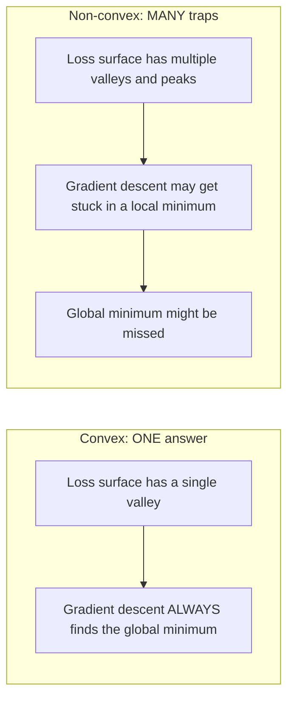
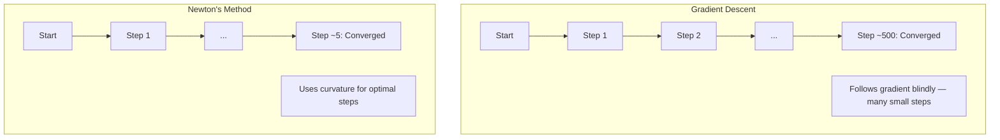
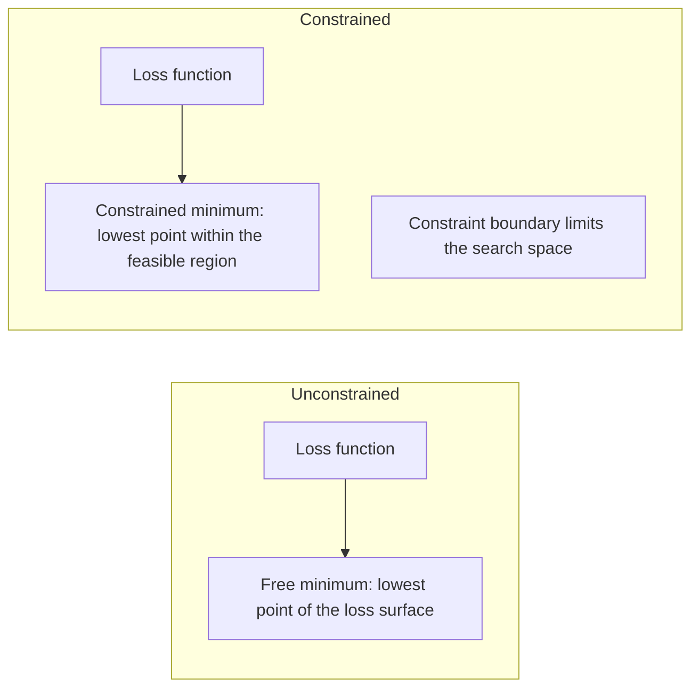
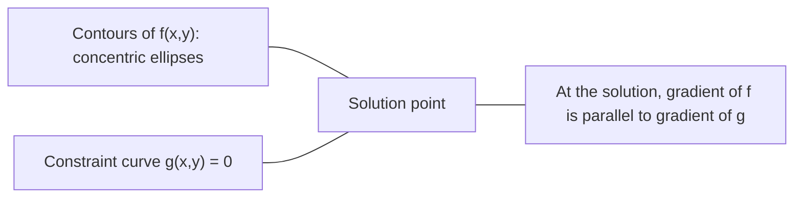

# Convex Optimization

> 凸问题有一个谷。神经网络有数百万个。了解差异很重要。

** 类型：** 构建
** 语言：** Python
** 先决条件：** 第1阶段，课程04（ML微积分）、08（优化）
** 时间：** ~90分钟

## Learning Objectives

- 使用定义、二阶求导和黑森准则测试函数是否是凸的
- 实现牛顿方法并比较其二次收敛与梯度下降
- 使用拉格朗日乘子解决约束优化问题并解释KKT条件
- 解释为什么神经网络损失景观是非凸的，但Singapore仍然找到了良好的解决方案

## The Problem

第8课教你梯度下降，动量和亚当。这些优化者在任何表面上都是走下坡路的。但他们没有保证。非凸景观上的梯度下降可能会落在一个糟糕的局部最小值，卡在鞍点上，或者永远振荡。无论如何，你还是使用了它，因为神经网络是非凸的，没有替代方案。

但机器学习中的许多问题都是凸的。线性回归、逻辑回归、支持者服务器、LASO、岭回归。对于这些，存在更强大的东西：具有数学保证的优化。凸问题恰好有一个谷。任何走下坡路的算法都会达到全局最小值。无需重新启动。没有学习率计划。没有祈祷。

理解凸性有三件事。首先，它会告诉您您的问题何时是简单（凸）还是困难（非凸）。其次，它为您提供了更快的工具，例如解决凸问题的牛顿方法。第三，它解释了整个ML中出现的概念：作为约束的正规化、支持器中的二元性，以及为什么深度学习在违反了凸性赋予您的每一个良好属性的情况下仍然有效。

## The Concept

### Convex sets

如果对于S中的任何两个点，它们之间的直线段也完全位于S中，则集合S是凸的。

| 凸集 | 不是凸 |
|---|---|
| ** 矩形 **：里面的任何两点都可以通过留在里面的直线段连接 | ** 星形/新月形 **：两个内部点之间的线可以通过片场外 |
| ** 三角形 **：相同的属性适用于所有内部点 | ** 甜甜圈/圆环 *：洞意味着一些直线段离开集合 |
| 任何两点之间的直线段均留在集合内 | 某些点对之间的直线段退出集合 |

正式测试：对于S中的任何点x、y和[0，1]中的任何t，点tt+（1-t）y也在S中。

凸面集的例子：
- 一条线，一个平面，R ' n的全部
- 球（圆、球体、超球体）
- 半空间：{x：a ' T x <= b}
- 任意数量的凸集的交集

非凸集的例子：
- 甜甜圈（圆环）
- 两个不相交的圈子的联盟
- 任何带有“凹痕”或“洞”的套装

### Convex functions

函数f是凸的，如果其定义域是凸集，并且对于其定义域中的任何两个点x、y和[0，1]中的任何t：

```
f(tx + (1-t)y) <= t*f(x) + (1-t)*f(y)
```

几何上：图形上任何两点之间的直线段位于图形上方或图形上。

| 财产 | 凸函数 | 非凸函数 |
|---|---|---|
| ** 分段测试 ** | 图形上任何两点之间的线位于曲线上 ** 上方或 ** | 图表上某些点之间的线低于 ** 曲线 |
| ** 形状 ** | 单碗/谷向上弯曲 | 具有混合弯曲的多个峰和谷 |
| ** 当地最低标准 ** | 每个局部最低值都是全球最低值 | 不同高度可能存在多个局部极小值 |

常见凸函数：
- f（x）= x2（parabola）
- f（x）=| X|（绝对值）
- f（x）= e ' x（指数）
- f（x）= max（0，x）（ReLU，尽管分段线性）
- f（x）= -log（x），x > 0（负log）
- 任何线性函数f（x）= a & T x + b（凸的和凹的）

### Testing for convexity

三个实际测试，从最简单到最严格。

** 检验1：二阶导数检验（1D）。**如果f“（x）>= 0，则f是凸的。

- f（x）= x2：f '（x）= 2 >= 0。凸面。
- f（x）= x3：f '（x）= 6x。x < 0时为负。不凸。
- f（x）= e ' x：f '（x）= e ' x '。凸面。

** 测试2：黑森测试（多元）。**如果Hessian矩阵H（x）对于所有x都是半正定的，那么f是凸的。黑森是二阶偏导的矩阵。

** 测试3：定义测试。**直接检查不等式f（yx+（1-t）y）<= t*f（x）+（1-t）*f（y）。对于难以计算求导的函数很有用。

### Why convexity matters

凸优化的中心定理：

** 对于凸函数，每个局部极小值都是全局极小值。**

这意味着梯度下降不会被困住。任何下坡路都会得到同样的答案。保证算法收敛到最优解。



后果：
- 无需随机重启
- 不需要复杂的学习率计划
- 收敛性证明是可能的（速率取决于函数属性）
- 该解决方案是独特的（直到平坦区域）

### Convex vs non-convex in ML

| 问题 | 凸面？ | 为什么 |
|---------|---------|-----|
| 线性回归（SSE） | 是的 | 损失按重量计算为二次 |
| Logistic回归 | 是的 | 对数损失在权重中是凸的 |
| SV（铰链损失） | 是的 | 线性函数的最大值 |
| LASSO（L1回归） | 是的 | 凸函数和是凸的 |
| 岭回归（L2） | 是的 | 二次+二次=凸 |
| 神经网络（任何损失） | 没有 | 非线性激活创造非凸景观 |
| k-means聚类 | 没有 | 离散分配步骤 |
| 矩阵分解 | 没有 | 未知数的产物 |

具有凸损失的线性模型是凸的。当您添加具有非线性激活的隐藏层时，凸性就会打破。

### The Hessian matrix

函数f：R & n -> R的Hessian H是n x n二次偏导矩阵。

```
H[i][j] = d^2 f / (dx_i dx_j)
```

对于f（x，y）= x#2 + 3xy+ y#2：

```
df/dx = 2x + 3y       d^2f/dx^2 = 2      d^2f/dxdy = 3
df/dy = 3x + 2y       d^2f/dydx = 3      d^2f/dy^2 = 2

H = [ 2  3 ]
    [ 3  2 ]
```

黑森教告诉您关于弯曲的信息：
- 特征值均为正值：函数在各个方向上向上弯曲（在该点处凸）
- 特征值均为负：在各个方向上向下曲线（凹陷，局部最大值）
- 混合标志：鞍点（在某些方向向上弯曲，在其他方向向下弯曲）
- 零特征值：在该方向平坦（退化）

对于凸性，黑森函数必须在任何地方都是半定的（所有特征值>= 0），而不仅仅是在一点。

### Newton's method

梯度下降使用一阶信息（梯度）。牛顿的方法使用二阶信息（黑森）。它在当前点符合二次逼近，并直接跳到该二次逼近的最小值。

```
Update rule:
  x_new = x - H^(-1) * gradient

Compare to gradient descent:
  x_new = x - lr * gradient
```

牛顿的方法用逆Hessian代替了纯量学习率。这会根据局部弯曲自动调整步进大小和方向。



优点：
- 二次收敛接近最小值（每一步误差平方）
- 没有学习率可调
- 比例不变（无论您如何参数化问题，都有效）

缺点：
- 计算Hessian需要O（n#2）内存和O（n#3）来倒置
- 对于具有100万个权重的神经网络来说，即10#12个条目和10#18个操作
- 对于深度学习来说不实用

### Constrained optimization

无约束优化：在所有x上最小化f（x）。
约束优化：在约束下最小化f（x）。

真正的问题是有限制的。您想要最大限度地降低成本，但您的预算有限。您想要最大限度地减少错误，但您的模型复杂性是有限度的。



### Lagrange multipliers

拉格朗日乘子方法将有约束问题转化为无约束问题。

问题：最小化f（x）服从g（x）= 0。

解决方案：引入一个新变量（拉格朗日乘数）并解决无约束问题：

```
L(x, lambda) = f(x) + lambda * g(x)
```

在解决方案中，L的梯度为零：

```
dL/dx = df/dx + lambda * dg/dx = 0
dL/dlambda = g(x) = 0
```

几何直觉：在约束最小值处，f的梯度必须平行于约束g的梯度。如果它们不平行，则可以沿着约束面移动并进一步减少f。



示例：最小化f（x，y）= x#2 + y#2，条件是x + y = 1。

```
L = x^2 + y^2 + lambda(x + y - 1)

dL/dx = 2x + lambda = 0  =>  x = -lambda/2
dL/dy = 2y + lambda = 0  =>  y = -lambda/2
dL/dlambda = x + y - 1 = 0

From first two: x = y
Substituting: 2x = 1, so x = y = 0.5, lambda = -1
```

x + y = 1线上距离原点最近的点是（0.5，0.5）。

### KKT conditions

Karush-Kuhn-Tucker条件将拉格朗日乘数扩展到不平等约束。

问题：最小化f（x），前提是g_i（x）<= 0，i = 1，.，M.

KKT条件（优化所需）：

```
1. Stationarity:    df/dx + sum(lambda_i * dg_i/dx) = 0
2. Primal feasibility:  g_i(x) <= 0  for all i
3. Dual feasibility:    lambda_i >= 0  for all i
4. Complementary slackness:  lambda_i * g_i(x) = 0  for all i
```

补充松弛是关键的见解：要么约束是活动的（g_i = 0，解位于边界上），要么乘数为零（约束并不重要）。不影响解决方案的约束为Lambda = 0。

KKT条件是支持者的核心。支持载体是约束处于活动状态（拉姆达> 0）的数据点。所有其他数据点的Lambda = 0并且不影响决策边界。

### Regularization as constrained optimization

L1和L2正规化并不是任意的技巧。它们是变相的约束优化问题。

**L2正规化（Ridge）：**

```
minimize  Loss(w)  subject to  ||w||^2 <= t

Equivalent unconstrained form:
minimize  Loss(w) + lambda * ||w||^2
```

约束||W|| #2 <= t定义球（2D中的圆形，3D中的球体）。解决方案是损失轮廓首先接触这个球的地方。

**L1正规化（LASO）：**

```
minimize  Loss(w)  subject to  ||w||_1 <= t

Equivalent unconstrained form:
minimize  Loss(w) + lambda * ||w||_1
```

约束||W||_1 <= t定义钻石（2D旋转方形）。

| 财产 | L2约束（圆圈） | L1约束（钻石） |
|---|---|---|
| ** 约束形状 ** | 圆形（较大尺寸的球体） | 钻石（2D旋转方形） |
| ** 损失轮廓触及的地方 ** | 光滑边界-圆上的任何点 | 角-与轴对齐 |
| ** 解决方案行为 ** | 重量很小但非零 | 有些权重恰好为零（稀疏） |
| ** 结果 ** | 重量收缩 | 特征选择 |

这解释了为什么L1产生稀疏模型（特征选择），而L2只缩小权重。菱形的角与轴对齐。损失等值线更有可能触及一个角落，将一个或多个权重精确设置为零。

### Duality

每个约束优化问题（原始问题）都有一个伴随问题（二元问题）。对于凸问题，原始问题和二元问题具有相同的最优值。这是很强的二元性。

拉格朗日二元函数：

```
Primal: minimize f(x) subject to g(x) <= 0
Lagrangian: L(x, lambda) = f(x) + lambda * g(x)
Dual function: d(lambda) = min_x L(x, lambda)
Dual problem: maximize d(lambda) subject to lambda >= 0
```

为什么二元性很重要：
- 双重问题有时比原始问题更容易解决
- 支持器以双重形式解决，其中问题取决于数据点之间的点积（启用内核技巧）
- 二元提供了原始最优值的下限，用于检查解决方案质量

特别对于支持服务器：

```
Primal: find w, b that maximize the margin 2/||w|| subject to
        y_i(w^T x_i + b) >= 1 for all i

Dual:   maximize sum(alpha_i) - 0.5 * sum_ij(alpha_i * alpha_j * y_i * y_j * x_i^T x_j)
        subject to alpha_i >= 0 and sum(alpha_i * y_i) = 0

The dual only involves dot products x_i^T x_j.
Replace x_i^T x_j with K(x_i, x_j) to get the kernel trick.
```

### Why deep learning works despite non-convexity

神经网络损失函数是非常非凸的。按照每一种经典衡量标准，优化它们都应该失败。然而，随机梯度下降可靠地找到了好的解决方案。有几个因素可以解释这一点。

** 大多数当地最低标准都足够好。**在多维空间中，随机临界点（梯度为零）绝大多数是鞍点，而不是局部极小值。存在的少数局部最小值往往具有接近全球最小值的损失值。当参数空间有数百万个维度时，陷入可怕的局部极小值是极不可能的。

** 真正的障碍是马鞍点，而不是局部最小值。**在具有n个参数的函数中，鞍点具有正和负弯曲方向的混合。对于高维度中的随机临界点，所有n个特征值为正（局部最小值）的概率大约为2^（-n）。几乎所有临界点都是鞍点。新元的噪音有助于逃离它们。

** 过度参数化使景观变得光滑。**参数比训练示例更多的网络具有更平滑、更连通的损失表面。更广泛的网络具有更少的不良局部极小值。这违反直觉，但在经验上是一致的。

** 景观结构损失：**

| 财产 | 低维空间 | 高维空间 |
|---|---|---|
| ** 风景 ** | 许多孤立的山峰和山谷 | 连接顺畅的山谷 |
| ** 最小值 ** | 许多与世隔绝的当地最低限度 | 很少有坏的局部最低值;大多数都接近最佳 |
| ** 导航 ** | 很难找到全球最低限度 | 许多途径都能带来良好的解决方案 |
| ** 关键点 ** | 局部极小值和鞍点的混合 | 压倒性的马鞍点，而不是局部最低点 |

** 随机噪音充当隐性正规化。**小批量新元增加了噪音，防止陷入尖锐的最小值。尖锐的极小值过度适合;扁平的极小值概括。噪音使优化偏向损失景观的平坦区域。

### Second-order methods in practice

纯牛顿方法对于大型模型来说是不切实际的。几种近似使得二阶信息可用。

** L-BFSG（有限内存BFSG）：** 使用最后m个梯度差逼近逆Hessian。需要O（nn）内存而不是O（n^2）。适用于最多约10，000个参数的问题。用于经典ML（逻辑回归，CFR），但不用于深度学习。

** 自然梯度：** 使用Fisher信息矩阵（log似然的预期Hessian）而不是标准Hessian。这解释了概率分布的几何形状。K-FAC（克罗内克因子逼近曲线）将Fisher矩阵逼近为克罗内克积，使其适用于神经网络。

** 无Hessian优化：** 使用共乘梯度求解Hx = g，而无需形成H。仅需要Hessian-vector积，可以通过自动求导在O（n）时间内计算。

** 对角近似：** 亚当二阶矩是海森对角线的对角近似。AdaHessian通过Hutchinson估计器使用实际的Hessian对角元素扩展了这一点。

| 方法 | 存储器 | 每步成本 | 何时使用 |
|--------|--------|--------------|-------------|
| 梯度下降 | O（n） | O（n） | 基线、大型模型 |
| 牛顿法 | 时间复杂度为O（n^2） | O（n#39;） | 小凸问题 |
| L-BFGS | O（mon） | O（mon） | 中凸问题 |
| 亚当 | O（n） | O（n） | 深度学习默认 |
| K-FAC | O（n） | O（n）每层 | 研究、大批量培训 |

## Build It

### Step 1: Convexity checker

构建一个通过采样点和检查定义来经验测试凸性的函数。

```python
import random
import math

def check_convexity(f, dim, bounds=(-5, 5), samples=1000):
    violations = 0
    for _ in range(samples):
        x = [random.uniform(*bounds) for _ in range(dim)]
        y = [random.uniform(*bounds) for _ in range(dim)]
        t = random.uniform(0, 1)
        mid = [t * xi + (1 - t) * yi for xi, yi in zip(x, y)]
        lhs = f(mid)
        rhs = t * f(x) + (1 - t) * f(y)
        if lhs > rhs + 1e-10:
            violations += 1
    return violations == 0, violations
```

### Step 2: Newton's method for 2D

使用显式Hessian实现牛顿方法。比较收敛速度和梯度下降。

```python
def newtons_method(f, grad_f, hessian_f, x0, steps=50, tol=1e-12):
    x = list(x0)
    history = [x[:]]
    for _ in range(steps):
        g = grad_f(x)
        H = hessian_f(x)
        det = H[0][0] * H[1][1] - H[0][1] * H[1][0]
        if abs(det) < 1e-15:
            break
        H_inv = [
            [H[1][1] / det, -H[0][1] / det],
            [-H[1][0] / det, H[0][0] / det],
        ]
        dx = [
            H_inv[0][0] * g[0] + H_inv[0][1] * g[1],
            H_inv[1][0] * g[0] + H_inv[1][1] * g[1],
        ]
        x = [x[0] - dx[0], x[1] - dx[1]]
        history.append(x[:])
        if sum(gi ** 2 for gi in g) < tol:
            break
    return history
```

### Step 3: Lagrange multiplier solver

使用拉格朗日上的梯度下降来解决约束优化。

```python
def lagrange_solve(f_grad, g_val, g_grad, x0, lr=0.01,
                   lr_lambda=0.01, steps=5000):
    x = list(x0)
    lam = 0.0
    history = []
    for _ in range(steps):
        fg = f_grad(x)
        gv = g_val(x)
        gg = g_grad(x)
        x = [
            xi - lr * (fgi + lam * ggi)
            for xi, fgi, ggi in zip(x, fg, gg)
        ]
        lam = lam + lr_lambda * gv
        history.append((x[:], lam, gv))
    return history
```

### Step 4: Compare first-order vs second-order

对同一二次函数运行梯度下降和牛顿方法。数数趋同的步骤。

```python
def quadratic(x):
    return 5 * x[0] ** 2 + x[1] ** 2

def quadratic_grad(x):
    return [10 * x[0], 2 * x[1]]

def quadratic_hessian(x):
    return [[10, 0], [0, 2]]
```

牛顿的方法将在一步内收敛（对于二次曲线来说是精确的）。梯度下降需要数百步，因为黑森的特征值相差5倍，从而形成一个细长的山谷。

## Use It

在选择ML模型和求解器时，凸性分析直接应用。

对于凸问题（逻辑回归、支持器、LASO）：
- 使用专用求解器（liblinear、CVXPY、scipy. optimate.minimize，方法=' L-BFSG-B '）
- 期待独特的全球解决方案
- 二阶方法实用且快速

对于非凸问题（神经网络）：
- 使用一阶方法（新元、Adam）
- 接受解依赖于初始化和随机性
- 使用过度参数化、噪音和学习率计划作为隐性正规化
- 不要浪费时间寻找全球最低限度。良好的当地最低限度就足够了。

```python
from scipy.optimize import minimize

result = minimize(
    fun=lambda w: sum((y - X @ w) ** 2) + 0.1 * sum(w ** 2),
    x0=np.zeros(d),
    method='L-BFGS-B',
    jac=lambda w: -2 * X.T @ (y - X @ w) + 0.2 * w,
)
```

对于SVMs，双重公式允许您使用内核技巧：

```python
from sklearn.svm import SVC

svm = SVC(kernel='rbf', C=1.0)
svm.fit(X_train, y_train)
print(f"Support vectors: {svm.n_support_}")
```

## Exercises

1. ** 凹凸画廊。**使用检查器测试这些函数的凸性：f（x）= x#4，f（x）= sin（x），f（x，y）= x#2 + y#2，f（x，y）= x*y，f（x）= max（x，0）。解释为什么每个结果都有意义。

2. ** 牛顿vs梯度下降竞赛。**从起点（10，10）开始，在f（x，y）= 50* x#2 + y#2上运行这两个方法。每个人需要多少步才能达到损失<1 e-10？当条件数（最大与最小黑森特征值之比）增加时，梯度下降会发生什么？

3. ** 拉格朗日乘数几何。**最小化f（x，y）=（x-3）#2+（y-3）#2，条件是x +2 y = 4。通过检查f的梯度是否平行于溶液处g的梯度来验证溶液。

4. ** 正规化约束。**实施L1约束优化：最小化（x-3）#2+（y-2）#2，服从于|X|  + |y| <= 1。表明解决方案有一个等于零的坐标（与钻石约束的稀疏性）。

5. ** 黑森特征值分析。**计算罗森布洛克函数在（1，1）和（-1，1）处的海森值。计算两点的特征值。关于最小值与远离最小值的情况，特征值告诉您什么？

## Key Terms

| Term | 意味着什么 |
|------|---------------|
| 凸集 | 集合中任何两点之间的直线段留在集合内 |
| 凸函数 | 一个函数，其图形上任何两点之间的线位于图形上方或图形上。同样，黑森在任何地方都是正半定的 |
| 局部最小 | 低于所有附近点的一个点。对于凸函数，每个局部最小值都是全局最小值 |
| 全局最小 | 函数在其整个域上的最低点 |
| Hessian矩阵 | 所有二阶偏导的矩阵。编码弯曲信息 |
| 半正定 | 特征值全部非负的矩阵。“二阶求导>= 0”的多维类比 |
| 条件数 | 黑森州最大与最小特征值之比。高条件数意味着狭长的山谷和缓慢的梯度下降 |
| 牛顿法 | 二阶优化器，使用逆Hessian来确定步骤方向和大小。接近最小值的二次收敛 |
| 拉格朗日乘子 | 为将有约束的优化问题转化为无约束的优化问题而引入的变量 |
| KKT条件 | 具有不等式约束的最优性的必要条件。推广拉格朗日乘数 |
| 互补差馀 | 在解决方案中，约束要么有效，要么其乘数为零。绝不能都非零 |
| 二元性 | 每个约束问题都有一个伴随的二元问题。对于凸问题，两者具有相同的最优值 |
| 强对偶 | 原始最优值和对偶最优值相等。满足Slater条件的凸问题 |
| L-BFGS | 存储最后m个梯度差而不是完整的Hessian的近似二阶方法 |
| 鞍点 | 梯度为零但在某些方向上为最小值而在其他方向上为最大值的点 |
| 过参数化 | 使用比训练示例更多的参数。平滑损失景观并减少不良的局部最低值 |

## Further Reading

- [Boyd& Vandenberghe：凸优化]（https：//web.stanford.edu/guardboyd/cvxbook/）-标准教科书，在线免费提供
- [博图、柯蒂斯、诺塞达尔：大规模机器学习的优化方法（2018）]（https：//arxiv.org/ab/1606.04838）-连接凸优化理论和深度学习实践
- [Choromanska等人：多层网络的损失表面（2015）]（https：//arxiv.org/ab/1412.0233）-为什么非凸神经网络景观并不像看起来那么糟糕
- [诺塞达尔和赖特：数值优化]（https：//link.springer.com/book/10.1007/978-0-387-40065-5）-牛顿法、L-BFSG和约束优化的全面参考
