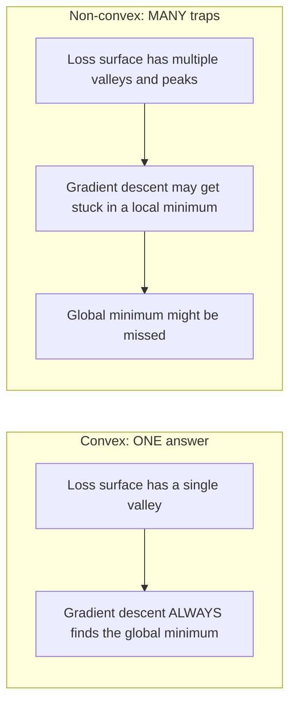
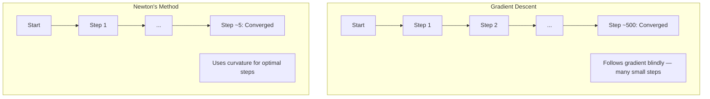
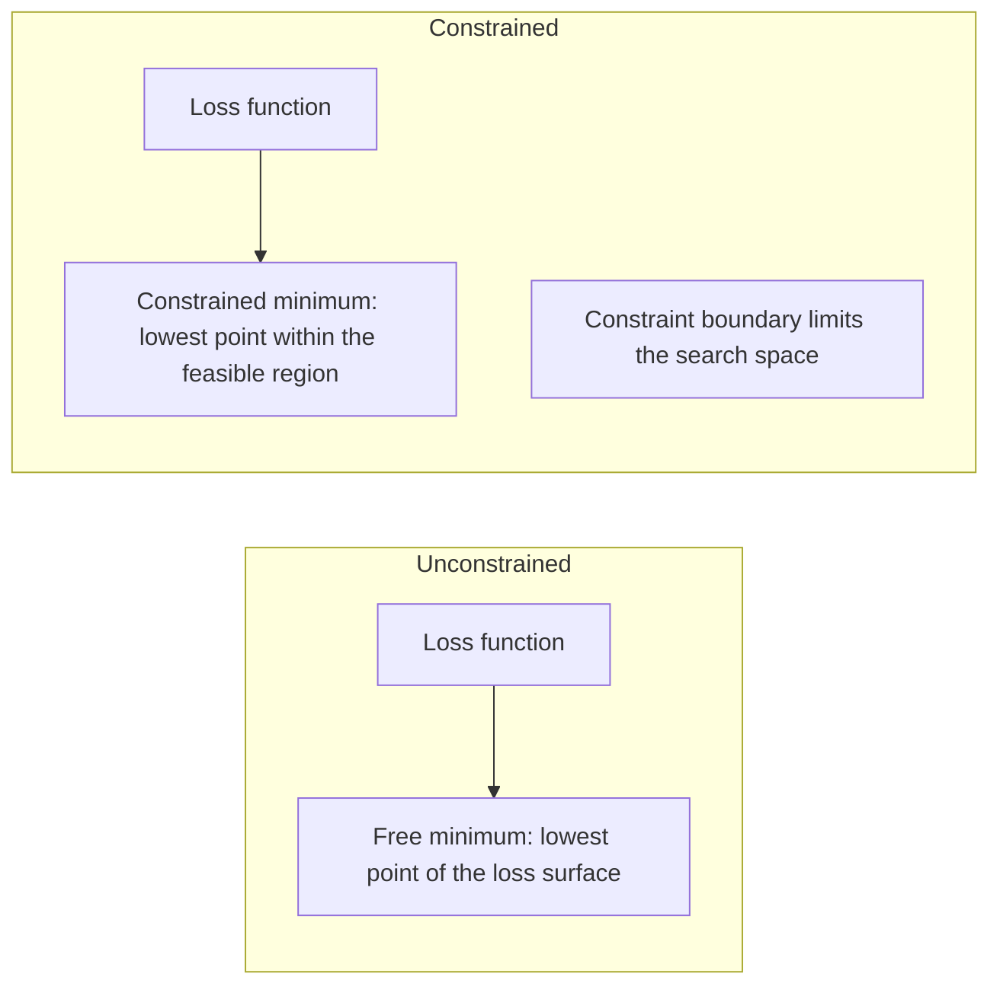
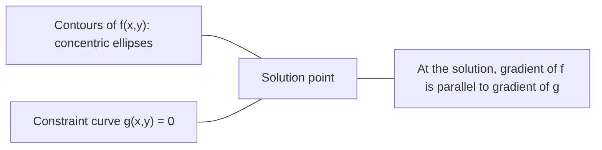

# 凸最佳化

> 凸問題只有一個山谷。神經網路有幾百萬個。分得清這個差別很重要。

**類型：** 實作
**程式語言：** Python
**先修單元：** 階段 1 · 單元 04（機器學習微積分）、08（最佳化）
**時間：** 約 90 分鐘

## 學習目標

- 用定義、二階導數與 Hessian 三種判準檢驗一個函式是不是凸的
- 實作牛頓法，並把它的二次收斂速度拿來跟梯度下降比較
- 用拉格朗日乘數法解帶約束的最佳化問題，並解讀 KKT 條件
- 說明神經網路的損失地景為什麼是非凸的，而 SGD 卻依然能找到不錯的解

## 問題所在

單元 08 教了你梯度下降、動量與 Adam。這些最佳化器在任何曲面上都能往下坡走。但它們不給任何保證。在非凸地景上跑梯度下降，可能落進一個很差的區域最小值、卡在鞍點上，或是永遠震盪下去。你還是用了它，因為神經網路是非凸的，而且沒有別的選擇。

但機器學習裡有很多問題其實是凸的。線性迴歸、邏輯迴歸、SVM、LASSO、ridge 迴歸都是。對這些問題來說，存在更強的東西：帶數學保證的最佳化。凸問題就只有一個山谷。任何往下坡走的演算法都會走到全域最小值。不用重啟。不用學習率排程。不用禱告。

理解凸性能帶來三件事。第一，它告訴你問題是容易的（凸）還是困難的（非凸）。第二，它給你更快的工具，例如針對凸問題的牛頓法。第三，它解釋了機器學習裡到處出現的概念：把正則化看成一個約束、SVM 裡的對偶，以及深度學習明明違反了凸性所給的每一個良好性質，為什麼還是行得通。

## 核心概念

### 凸集

一個集合 S 是凸集，若 S 中任兩點之間的線段也完整落在 S 裡面。

| 凸集 | 非凸 |
|---|---|
| **矩形**：內部任兩點連成的線段都留在內部 | **星形／月牙形**：兩個內部點之間的連線可能跑到集合外面 |
| **三角形**：對所有內部點都有同樣的性質 | **甜甜圈／環域**：中間的洞讓某些線段離開集合 |
| 任兩點之間的線段都留在集合內 | 某些點對之間的線段會離開集合 |

正式判準：對 S 中任意點 x、y 以及任意 t 在 [0, 1] 之間，點 tx + (1-t)y 也在 S 裡。

凸集的例子：
- 一條線、一個平面、整個 R^n
- 一個球（圓、球面、超球）
- 一個半空間：{x : a^T x <= b}
- 任意多個凸集的交集

非凸集的例子：
- 甜甜圈（環域）
- 兩個不相交圓的聯集
- 任何有「凹陷」或「洞」的集合

### 凸函數

一個函式 f 是凸函數，若它的定義域是凸集，且對定義域中任兩點 x、y 以及任意 t 在 [0, 1] 之間：

```
f(tx + (1-t)y) <= t*f(x) + (1-t)*f(y)
```

幾何上的意思是：圖形上任兩點之間的線段都落在圖形之上，或貼著圖形。

| 性質 | 凸函數 | 非凸函數 |
|---|---|---|
| **線段檢驗** | 圖形上任兩點之間的連線都在曲線**之上或貼著曲線** | 圖形上某些點之間的連線會沉到曲線**底下** |
| **形狀** | 單一個向上彎的碗／山谷 | 多個峰與谷，曲率正負混雜 |
| **區域最小值** | 每個區域最小值都是全域最小值 | 可能存在多個高度不同的區域最小值 |

常見的凸函數：
- f(x) = x^2（拋物線）
- f(x) = |x|（絕對值）
- f(x) = e^x（指數）
- f(x) = max(0, x)（ReLU，雖然是分段線性的）
- f(x) = -log(x) 在 x > 0 上（負對數）
- 任何線性函式 f(x) = a^T x + b（同時是凸的也是凹的）

### 檢驗凸性

三個實用的檢驗方式，由最簡單排到最嚴謹。

**檢驗 1：二階導數檢驗（一維）。** 若對所有 x 都有 f''(x) >= 0，則 f 是凸的。

- f(x) = x^2：f''(x) = 2 >= 0。凸。
- f(x) = x^3：f''(x) = 6x。在 x < 0 時為負。非凸。
- f(x) = e^x：f''(x) = e^x > 0。凸。

**檢驗 2：Hessian 檢驗（多變數）。** 若 Hessian 矩陣 H(x) 對所有 x 都是半正定的，則 f 是凸的。Hessian 就是二階偏導數排成的矩陣。

**檢驗 3：定義檢驗。** 直接檢查不等式 f(tx + (1-t)y) <= t*f(x) + (1-t)*f(y)。對那些導數不好算的函式很有用。

### 凸性為什麼重要

凸最佳化的核心定理：

**對凸函數而言，每個區域最小值都是全域最小值。**

這意味著梯度下降不可能被困住。任何一條往下坡的路都通往同一個答案。演算法保證會收斂到最佳解。


```mermaid
graph LR
    subgraph "Convex: ONE answer"
        direction TB
        C1["Loss surface has a single valley"] --> C2["Gradient descent ALWAYS finds the global minimum"]
    end
    subgraph "Non-convex: MANY traps"
        direction TB
        N1["Loss surface has multiple valleys and peaks"] --> N2["Gradient descent may get stuck in a local minimum"]
        N2 --> N3["Global minimum might be missed"]
    end
```

帶來的結果：
- 不需要隨機重啟
- 不需要精巧的學習率排程
- 收斂性證明是做得出來的（速率取決於函式的性質）
- 解是唯一的（除了平坦區域以外）

### 機器學習裡的凸與非凸

| 問題 | 凸嗎？ | 為什麼 |
|---------|---------|-----|
| 線性迴歸（MSE） | 是 | 損失對權重是二次的 |
| 邏輯迴歸 | 是 | log-loss 對權重是凸的 |
| SVM（hinge loss） | 是 | 線性函式的最大值 |
| LASSO（L1 迴歸） | 是 | 凸函數之和仍是凸的 |
| Ridge 迴歸（L2） | 是 | 二次 + 二次 = 凸 |
| 神經網路（任何損失） | 否 | 非線性激活函式造出非凸地景 |
| k-means 分群 | 否 | 離散的指派步驟 |
| 矩陣分解 | 否 | 未知量相乘 |

搭配凸損失的線性模型是凸的。一旦你加上帶非線性激活函式的隱藏層，凸性就破了。

### Hessian 矩陣

函式 f: R^n -> R 的 Hessian 矩陣 H 是一個 n x n 的二階偏導數矩陣。

```
H[i][j] = d^2 f / (dx_i dx_j)
```

對 f(x, y) = x^2 + 3xy + y^2 來說：

```
df/dx = 2x + 3y       d^2f/dx^2 = 2      d^2f/dxdy = 3
df/dy = 3x + 2y       d^2f/dydx = 3      d^2f/dy^2 = 2

H = [ 2  3 ]
    [ 3  2 ]
```

Hessian 告訴你曲率的資訊：
- 特徵值全為正：函式在每個方向上都往上彎（在該點是凸的）
- 特徵值全為負：在每個方向上都往下彎（凹，是一個區域最大值）
- 正負混雜：鞍點（某些方向往上彎，其他方向往下彎）
- 特徵值為零：該方向是平的（退化）

要是凸的，Hessian 必須在所有地方都是半正定的（所有特徵值 >= 0），不只是在某一個點上。

### 牛頓法

梯度下降用的是一階資訊（梯度）。牛頓法用的是二階資訊（Hessian）。它在當前的點配一個二次近似，然後直接跳到那個二次函式的最小值。

```
Update rule:
  x_new = x - H^(-1) * gradient

Compare to gradient descent:
  x_new = x - lr * gradient
```

牛頓法把純量學習率換成了 Hessian 的逆。這會自動根據區域曲率調整步伐大小與方向。


```mermaid
graph TD
    subgraph "Gradient Descent"
        GD1["Start"] --> GD2["Step 1"]
        GD2 --> GD3["Step 2"]
        GD3 --> GD4["..."]
        GD4 --> GD5["Step ~500: Converged"]
        GD_note["Follows gradient blindly — many small steps"]
    end
    subgraph "Newton's Method"
        NM1["Start"] --> NM2["Step 1"]
        NM2 --> NM3["..."]
        NM3 --> NM4["Step ~5: Converged"]
        NM_note["Uses curvature for optimal steps"]
    end
```

優點：
- 在最小值附近是二次收斂（誤差每一步平方一次）
- 沒有學習率要調
- 尺度不變（不管你怎麼把問題參數化都管用）

缺點：
- 算 Hessian 要花 O(n^2) 記憶體，求逆要 O(n^3)
- 對一個有 100 萬個權重的神經網路來說，那是 10^12 個元素與 10^18 次運算
- 對深度學習不實用

### 帶約束的最佳化

無約束最佳化：在所有 x 上最小化 f(x)。
帶約束的最佳化：在滿足約束的前提下最小化 f(x)。

真實問題都有約束。你想壓低成本，但預算有限。你想壓低誤差，但模型複雜度有上限。


```mermaid
graph LR
    subgraph "Unconstrained"
        U1["Loss function"] --> U2["Free minimum: lowest point of the loss surface"]
    end
    subgraph "Constrained"
        C1["Loss function"] --> C2["Constrained minimum: lowest point within the feasible region"]
        C3["Constraint boundary limits the search space"]
    end
```

### 拉格朗日乘數

拉格朗日乘數法把一個帶約束的問題轉換成無約束的問題。

問題：在 g(x) = 0 的約束下最小化 f(x)。

解法：引入一個新變數（拉格朗日乘數 lambda），然後解這個無約束問題：

```
L(x, lambda) = f(x) + lambda * g(x)
```

在解的位置上，L 的梯度為零：

```
dL/dx = df/dx + lambda * dg/dx = 0
dL/dlambda = g(x) = 0
```

幾何上的直覺：在帶約束的最小值處，f 的梯度必須與約束 g 的梯度平行。如果它們不平行，你就還能沿著約束曲面移動、把 f 再壓低一些。


```mermaid
graph LR
    A["Contours of f(x,y): concentric ellipses"] --- S["Solution point"]
    B["Constraint curve g(x,y) = 0"] --- S
    S --- C["At the solution, gradient of f is parallel to gradient of g"]
```

例子：在 x + y = 1 的約束下最小化 f(x,y) = x^2 + y^2。

```
L = x^2 + y^2 + lambda(x + y - 1)

dL/dx = 2x + lambda = 0  =>  x = -lambda/2
dL/dy = 2y + lambda = 0  =>  y = -lambda/2
dL/dlambda = x + y - 1 = 0

From first two: x = y
Substituting: 2x = 1, so x = y = 0.5, lambda = -1
```

直線 x + y = 1 上離原點最近的點是 (0.5, 0.5)。

### KKT 條件

Karush-Kuhn-Tucker 條件把拉格朗日乘數法擴充到不等式約束。

問題：在 g_i(x) <= 0（i = 1, ..., m）的約束下最小化 f(x)。

KKT 條件（最佳性的必要條件）：

```
1. Stationarity:    df/dx + sum(lambda_i * dg_i/dx) = 0
2. Primal feasibility:  g_i(x) <= 0  for all i
3. Dual feasibility:    lambda_i >= 0  for all i
4. Complementary slackness:  lambda_i * g_i(x) = 0  for all i
```

互補鬆弛是這裡的關鍵洞見：要嘛約束是作用中的（g_i = 0，解就坐在邊界上），要嘛乘數為零（這個約束無關緊要）。一個不影響解的約束，其 lambda = 0。

KKT 條件是 SVM 的核心。支援向量就是那些約束為作用中（lambda > 0）的資料點。其他所有資料點的 lambda = 0，對決策邊界毫無影響。

### 把正則化看成帶約束的最佳化

L1 與 L2 正則化不是隨手湊出來的技巧。它們其實是換了個樣子的帶約束最佳化問題。

**L2 正則化（Ridge）：**

```
minimize  Loss(w)  subject to  ||w||^2 <= t

Equivalent unconstrained form:
minimize  Loss(w) + lambda * ||w||^2
```

約束 ||w||^2 <= t 定義出一個球（二維是圓，三維是球面）。解就落在損失等高線第一次碰到這個球的位置。

**L1 正則化（LASSO）：**

```
minimize  Loss(w)  subject to  ||w||_1 <= t

Equivalent unconstrained form:
minimize  Loss(w) + lambda * ||w||_1
```

約束 ||w||_1 <= t 定義出一個菱形（二維是轉了 45 度的正方形）。

| 性質 | L2 約束（圓） | L1 約束（菱形） |
|---|---|---|
| **約束的形狀** | 圓（高維是球面） | 菱形（二維是轉了 45 度的正方形） |
| **損失等高線碰到哪裡** | 平滑的邊界 —— 圓上任何一點 | 尖角 —— 與座標軸對齊 |
| **解的行為** | 權重很小但不為零 | 某些權重剛好是零（稀疏） |
| **結果** | 權重收縮 | 特徵選擇 |

這說明了為什麼 L1 會產生稀疏模型（特徵選擇），而 L2 只是把權重縮小。菱形有跟座標軸對齊的尖角。損失等高線比較容易碰到尖角，於是把一個或多個權重剛好設成零。

### 對偶

每一個帶約束的最佳化問題（原始問題，primal）都有一個伴隨問題（對偶問題）。對凸問題而言，原始問題與對偶問題有相同的最佳值。這就是強對偶。

拉格朗日對偶函式：

```
Primal: minimize f(x) subject to g(x) <= 0
Lagrangian: L(x, lambda) = f(x) + lambda * g(x)
Dual function: d(lambda) = min_x L(x, lambda)
Dual problem: maximize d(lambda) subject to lambda >= 0
```

對偶為什麼重要：
- 對偶問題有時比原始問題好解
- SVM 是用對偶形式解的，這時問題只取決於資料點之間的內積（這讓 kernel trick 得以成立）
- 對偶給出原始問題最佳值的下界，可以用來檢查解的品質

具體到 SVM：

```
Primal: find w, b that maximize the margin 2/||w|| subject to
        y_i(w^T x_i + b) >= 1 for all i

Dual:   maximize sum(alpha_i) - 0.5 * sum_ij(alpha_i * alpha_j * y_i * y_j * x_i^T x_j)
        subject to alpha_i >= 0 and sum(alpha_i * y_i) = 0

The dual only involves dot products x_i^T x_j.
Replace x_i^T x_j with K(x_i, x_j) to get the kernel trick.
```

### 非凸卻依然行得通：深度學習為什麼有效

神經網路的損失函式非凸得離譜。按照每一個古典判準來看，最佳化它們都應該失敗。然而隨機梯度下降卻能穩定地找到不錯的解。有幾個因素可以解釋這件事。

**大多數區域最小值都夠好了。** 在高維空間裡，隨機的臨界點（梯度為零的地方）絕大多數是鞍點，而不是區域最小值。少數確實存在的區域最小值，損失值往往都很接近全域最小值。當參數空間有好幾百萬個維度時，掉進一個糟糕透頂的區域最小值極不可能發生。

**真正的障礙是鞍點，不是區域最小值。** 在一個有 n 個參數的函式裡，鞍點在某些方向的曲率為正、某些為負。對高維空間中一個隨機的臨界點來說，n 個特徵值全為正（也就是區域最小值）的機率大約是 2^(-n)。幾乎所有臨界點都是鞍點。SGD 的雜訊有助於逃離它們。

**過度參數化會把地景抹平。** 參數數量超過訓練樣本數的網路，損失曲面更平滑、更連通。越寬的網路，糟糕的區域最小值越少。這聽起來很反直覺，但實驗上一致成立。

**損失地景的結構：**

| 性質 | 低維空間 | 高維空間 |
|---|---|---|
| **地景** | 許多孤立的峰與谷 | 平滑連通的山谷 |
| **最小值** | 許多孤立的區域最小值 | 糟糕的區域最小值很少；多數都接近最佳 |
| **導航** | 難以找到全域最小值 | 有很多條路都通往不錯的解 |
| **臨界點** | 區域最小值與鞍點混雜 | 絕大多數是鞍點，而非區域最小值 |

**隨機雜訊扮演隱式正則化的角色。** 小批次 SGD 加入的雜訊會避免模型安頓在尖銳的最小值裡。尖銳的最小值會過度擬合；平坦的最小值泛化得好。這些雜訊讓最佳化偏向損失地景中平坦的區域。

### 二階方法的實務做法

純粹的牛頓法對大模型不實用。有幾種近似做法讓二階資訊變得可用。

**L-BFGS（有限記憶體 BFGS）：** 用最近 m 次的梯度差來近似 Hessian 的逆。只需要 O(mn) 記憶體，而不是 O(n^2)。對參數量最多約 10,000 的問題效果不錯。用在古典機器學習（邏輯迴歸、CRF）上，但不用在深度學習。

**自然梯度：** 用 Fisher 資訊矩陣（對數似然的期望 Hessian）取代標準 Hessian。這會把機率分布的幾何結構納入考量。K-FAC（Kronecker-Factored Approximate Curvature）把 Fisher 矩陣近似成一個 Kronecker 積，讓它在神經網路上變得實用。

**Hessian-free 最佳化：** 用共軛梯度法解 Hx = g，過程中完全不用把 H 建出來。只需要 Hessian 與向量的乘積，而這可以透過自動微分在 O(n) 時間內算出來。

**對角近似：** Adam 的二階動量就是 Hessian 對角線的一種對角近似。AdaHessian 進一步用 Hutchinson 估計量取得真正的 Hessian 對角元素。

| 方法 | 記憶體 | 每步成本 | 什麼時候用 |
|--------|--------|--------------|-------------|
| 梯度下降 | O(n) | O(n) | 基準線、大模型 |
| 牛頓法 | O(n^2) | O(n^3) | 小型凸問題 |
| L-BFGS | O(mn) | O(mn) | 中型凸問題 |
| Adam | O(n) | O(n) | 深度學習的預設 |
| K-FAC | O(n) | 每層 O(n) | 研究、大批次訓練 |

```figure
convex-vs-nonconvex
```

## 動手實作

### 步驟 1：凸性檢查器

寫一個函式，靠取樣點並檢查定義來從經驗上檢驗凸性。

```python
import random
import math

def check_convexity(f, dim, bounds=(-5, 5), samples=1000):
    violations = 0
    for _ in range(samples):
        x = [random.uniform(*bounds) for _ in range(dim)]
        y = [random.uniform(*bounds) for _ in range(dim)]
        t = random.uniform(0, 1)
        mid = [t * xi + (1 - t) * yi for xi, yi in zip(x, y)]
        lhs = f(mid)
        rhs = t * f(x) + (1 - t) * f(y)
        if lhs > rhs + 1e-10:
            violations += 1
    return violations == 0, violations
```

### 步驟 2：二維的牛頓法

用顯式的 Hessian 實作牛頓法。把收斂速度拿來跟梯度下降比較。

```python
def newtons_method(f, grad_f, hessian_f, x0, steps=50, tol=1e-12):
    x = list(x0)
    history = [x[:]]
    for _ in range(steps):
        g = grad_f(x)
        H = hessian_f(x)
        det = H[0][0] * H[1][1] - H[0][1] * H[1][0]
        if abs(det) < 1e-15:
            break
        H_inv = [
            [H[1][1] / det, -H[0][1] / det],
            [-H[1][0] / det, H[0][0] / det],
        ]
        dx = [
            H_inv[0][0] * g[0] + H_inv[0][1] * g[1],
            H_inv[1][0] * g[0] + H_inv[1][1] * g[1],
        ]
        x = [x[0] - dx[0], x[1] - dx[1]]
        history.append(x[:])
        if sum(gi ** 2 for gi in g) < tol:
            break
    return history
```

### 步驟 3：拉格朗日乘數求解器

用梯度下降跑在拉格朗日函式上，解帶約束的最佳化問題。

```python
def lagrange_solve(f_grad, g_val, g_grad, x0, lr=0.01,
                   lr_lambda=0.01, steps=5000):
    x = list(x0)
    lam = 0.0
    history = []
    for _ in range(steps):
        fg = f_grad(x)
        gv = g_val(x)
        gg = g_grad(x)
        x = [
            xi - lr * (fgi + lam * ggi)
            for xi, fgi, ggi in zip(x, fg, gg)
        ]
        lam = lam + lr_lambda * gv
        history.append((x[:], lam, gv))
    return history
```

### 步驟 4：比較一階與二階方法

在同一個二次函式上跑梯度下降與牛頓法。數一數各自要幾步才收斂。

```python
def quadratic(x):
    return 5 * x[0] ** 2 + x[1] ** 2

def quadratic_grad(x):
    return [10 * x[0], 2 * x[1]]

def quadratic_hessian(x):
    return [[10, 0], [0, 2]]
```

牛頓法會在 1 步之內收斂（對二次函式來說它是精確的）。梯度下降會花上好幾百步，因為 Hessian 的特徵值差了 5 倍，形成一條狹長的山谷。

## 框架應用

在挑選機器學習模型與求解器時，凸性分析可以直接派上用場。

對凸問題（邏輯迴歸、SVM、LASSO）：
- 用專用的求解器（liblinear、CVXPY、scipy.optimize.minimize 搭配 method='L-BFGS-B'）
- 預期會得到唯一的全域解
- 二階方法既實用又快

對非凸問題（神經網路）：
- 用一階方法（SGD、Adam）
- 接受解會受初始化與隨機性影響這件事
- 把過度參數化、雜訊與學習率排程當成隱式正則化來用
- 不要浪費時間去找全域最小值。一個好的區域最小值就夠了。

```python
from scipy.optimize import minimize

result = minimize(
    fun=lambda w: sum((y - X @ w) ** 2) + 0.1 * sum(w ** 2),
    x0=np.zeros(d),
    method='L-BFGS-B',
    jac=lambda w: -2 * X.T @ (y - X @ w) + 0.2 * w,
)
```

對 SVM 來說，對偶形式讓你能用上 kernel trick：

```python
from sklearn.svm import SVC

svm = SVC(kernel='rbf', C=1.0)
svm.fit(X_train, y_train)
print(f"Support vectors: {svm.n_support_}")
```

## 練習

1. **凸性圖鑑。** 用檢查器檢驗下列函式的凸性：f(x) = x^4、f(x) = sin(x)、f(x,y) = x^2 + y^2、f(x,y) = x*y、f(x) = max(x, 0)。解釋每個結果為什麼合理。

2. **牛頓法與梯度下降賽跑。** 從起點 (10, 10) 出發，在 f(x,y) = 50*x^2 + y^2 上跑這兩種方法。各自要幾步才能讓損失降到 1e-10 以下？當條件數（Hessian 最大特徵值與最小特徵值的比值）變大時，梯度下降會怎樣？

3. **拉格朗日乘數的幾何。** 在 x + 2y = 4 的約束下最小化 f(x,y) = (x-3)^2 + (y-3)^2。透過檢查解的位置上 f 的梯度是否與 g 的梯度平行來驗證答案。

4. **正則化約束。** 實作 L1 約束下的最佳化：在 |x| + |y| <= 1 的約束下最小化 (x-3)^2 + (y-2)^2。證明解裡有一個座標剛好等於零（來自菱形約束的稀疏性）。

5. **Hessian 特徵值分析。** 算出 Rosenbrock 函式在 (1,1) 與 (-1,1) 的 Hessian。在這兩個點都算出特徵值。這些特徵值告訴你在最小值處與離最小值很遠處的曲率有什麼不同？

## 關鍵術語

| 術語 | 實際上是什麼 |
|------|---------------|
| 凸集 | 一個集合，其中任兩點之間的線段都留在集合內 |
| 凸函數 | 一個函式，其圖形上任兩點之間的連線都落在圖形之上或貼著圖形。等價的說法是：Hessian 在所有地方都是半正定的 |
| 區域最小值 | 比附近所有點都低的點。對凸函數來說，每個區域最小值都是全域最小值 |
| 全域最小值 | 一個函式在整個定義域上的最低點 |
| Hessian 矩陣 | 所有二階偏導數排成的矩陣。編碼了曲率資訊 |
| 半正定 | 特徵值全為非負的矩陣。相當於「二階導數 >= 0」的多維版本 |
| 條件數 | Hessian 最大特徵值與最小特徵值的比值。條件數高意味著狹長的山谷與緩慢的梯度下降 |
| 牛頓法 | 用 Hessian 的逆決定步伐方向與大小的二階最佳化器。在最小值附近是二次收斂 |
| 拉格朗日乘數 | 為了把帶約束的最佳化問題轉換成無約束問題而引入的變數 |
| KKT 條件 | 帶不等式約束時最佳性的必要條件。是拉格朗日乘數法的推廣 |
| 互補鬆弛 | 在解的位置上，要嘛某個約束是作用中的，要嘛它的乘數為零。絕不會兩者都非零 |
| 對偶 | 每個帶約束的問題都有一個伴隨的對偶問題。對凸問題而言，兩者的最佳值相同 |
| 強對偶 | 原始問題與對偶問題的最佳值相等。對滿足 Slater 條件的凸問題成立 |
| L-BFGS | 一種近似的二階方法，只存最近 m 次的梯度差，而不是完整的 Hessian |
| 鞍點 | 梯度為零的點，但它在某些方向上是最小值、在其他方向上是最大值 |
| 過度參數化 | 使用比訓練樣本數更多的參數。會把損失地景抹平，減少糟糕的區域最小值 |

## 延伸閱讀

- [Boyd & Vandenberghe: Convex Optimization](https://web.stanford.edu/~boyd/cvxbook/) - 標準教科書，網路上免費取得
- [Bottou, Curtis, Nocedal: Optimization Methods for Large-Scale Machine Learning (2018)](https://arxiv.org/abs/1606.04838) - 串起凸最佳化理論與深度學習實務
- [Choromanska et al.: The Loss Surfaces of Multilayer Networks (2015)](https://arxiv.org/abs/1412.0233) - 為什麼非凸的神經網路地景沒有看起來那麼糟
- [Nocedal & Wright: Numerical Optimization](https://link.springer.com/book/10.1007/978-0-387-40065-5) - 牛頓法、L-BFGS 與帶約束最佳化的完整參考書
