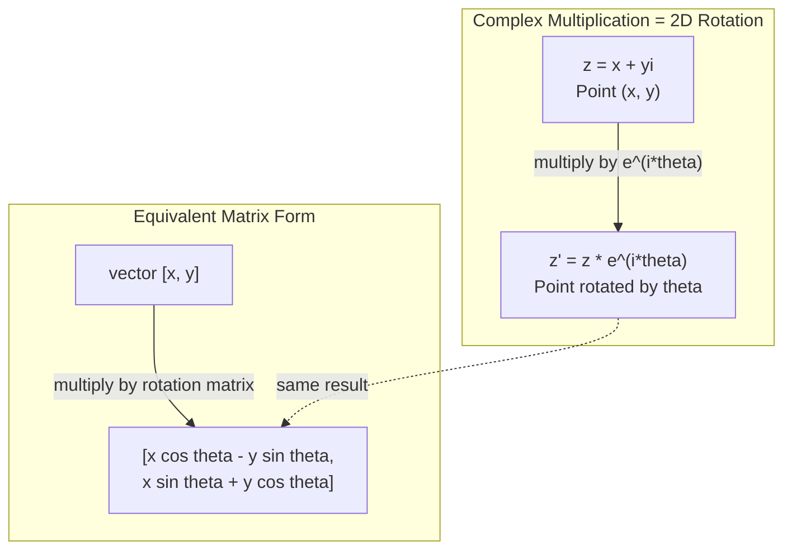
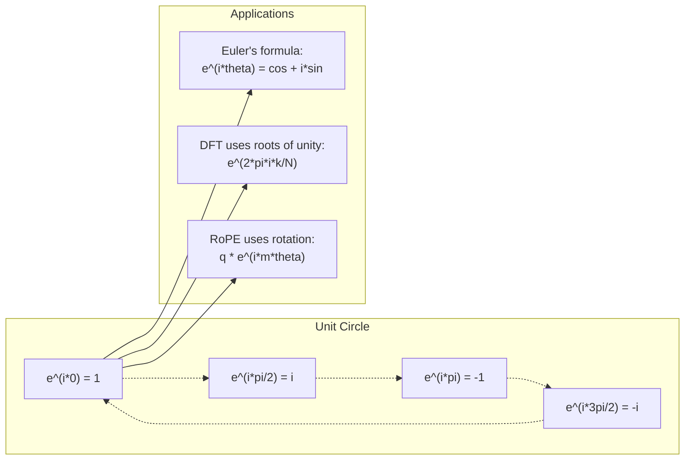

# Yapay Zeka için Karmaşık Sayılar

> -1'in karekökü sanal değildir. Dönüşlerin, frekansların ve sinyal işlemenin yarısının anahtarıdır.

**Tür:** Öğren
**Dil:** Python
**Önkoşullar:** Aşama 1, Dersler 01-04 (doğrusal cebir, matematik)
**Süre:** ~60 dakika

## Öğrenme Hedefleri

- Hem dikdörtgen hem de kutupsal biçimde karmaşık aritmetik işlemlerini (toplama, çarpma, bölme, birleştirme) gerçekleştirin
- Karmaşık üstel sayılar ve trigonometrik fonksiyonlar arasında dönüşüm yapmak için Euler formülünü uygulayın
- Birliğin karmaşık köklerini kullanarak Ayrık Fourier Dönüşümünü uygulayın
- transformer'lerde RoPE ve sinüzoidal konumsal kodlamaların temelinde karmaşık rotasyonların nasıl yattığını açıklayın

## Sorun

Fourier dönüşümleri üzerine bir makale açıyorsunuz ve her yerde `i` var. transformer konumsal kodlamalara bakıyorsunuz ve farklı frekanslarda `sin` ve `cos`'yi görüyorsunuz; karmaşık üstellerin gerçek ve sanal kısımları. Kuantum hesaplama hakkında okuyorsunuz ve her şeyin karmaşık vektör uzaylarında ifade edildiğini görüyorsunuz.

Karmaşık sayılar soyut görünüyor. -1'in karekökü üzerine kurulu bir sayı sistemi bir matematik hilesi gibi geliyor. Ama bu bir hile değil. Dönmelerin ve salınımların doğal dilidir. Bir şeyin döndüğü, titreştiği veya salındığı her seferde karmaşık sayılar doğru araçtır.

Karmaşık sayıları anlamadan Ayrık Fourier Dönüşümünü anlayamazsınız. FFT'yi anlayamazsınız. RoPE'nin (Döner Konum Embedding) modern dil modellerinde nasıl çalıştığını anlayamazsınız. Orijinal Transformer makalesindeki sinüzoidal konumsal kodlamaların neden kullandıkları frekansları kullandığını anlayamazsınız.

Bu ders karmaşık aritmetiği sıfırdan oluşturur, onu geometriye bağlar ve karmaşık sayıların machine learning'de tam olarak nerede göründüğünü gösterir.

## Konsept

### Karmaşık sayı nedir?

Karmaşık sayının iki kısmı vardır: gerçek kısım ve sanal kısım.

```
z = a + bi

where:
  a is the real part
  b is the imaginary part
  i is the imaginary unit, defined by i^2 = -1
```

İşte bu. Sayı doğrusunu bir düzleme uzatırsınız. Gerçek sayılar bir eksende yer alır. Hayali sayılar diğer tarafta oturuyor. Her karmaşık sayı bu düzlemde bir noktadır.

### Karmaşık aritmetik

**Toplama.** Gerçek parçaları toplayın, sanal parçaları toplayın.

```
(a + bi) + (c + di) = (a + c) + (b + d)i

Example: (3 + 2i) + (1 + 4i) = 4 + 6i
```

**Çarpma.** Dağılım yasasını kullanın ve i^2 = -1 olduğunu unutmayın.

```
(a + bi)(c + di) = ac + adi + bci + bdi^2
                 = ac + adi + bci - bd
                 = (ac - bd) + (ad + bc)i

Example: (3 + 2i)(1 + 4i) = 3 + 12i + 2i + 8i^2
                            = 3 + 14i - 8
                            = -5 + 14i
```

**Eşlenik.** Hayali kısmın işaretini çevirin.

```
conjugate of (a + bi) = a - bi
```

Karmaşık bir sayının ve eşleniğinin çarpımı her zaman gerçektir:

```
(a + bi)(a - bi) = a^2 + b^2
```

**Bölme.** Pay ve paydayı paydanın eşleniğiyle çarpın.

```
(a + bi) / (c + di) = (a + bi)(c - di) / (c^2 + d^2)
```

Bu, paydanın sanal kısmını ortadan kaldırarak size temiz bir karmaşık sayı verir.

### Karmaşık düzlem

Karmaşık düzlem, her karmaşık sayıyı 2 boyutlu bir noktaya eşler. Yatay eksen gerçek eksen, dikey eksen sanal eksendir.

```
z = 3 + 2i  corresponds to the point (3, 2)
z = -1 + 0i corresponds to the point (-1, 0) on the real axis
z = 0 + 4i  corresponds to the point (0, 4) on the imaginary axis
```

Karmaşık bir sayı aynı anda hem bir nokta hem de orijinden gelen bir vektördür. Bu ikili yorum, karmaşık sayıları geometri için yararlı kılan şeydir.

### Kutupsal form

Düzlemdeki herhangi bir nokta, orijine olan uzaklığı ve pozitif gerçek eksene olan açısı ile tanımlanabilir.

```
z = r * (cos(theta) + i*sin(theta))

where:
  r = |z| = sqrt(a^2 + b^2)     (magnitude, or modulus)
  theta = atan2(b, a)             (phase, or argument)
```

Dikdörtgen form (a + bi) toplamaya uygundur. Kutupsal form (r, teta) çarpma için iyidir.

**Kutupsal biçimde çarpma.** Büyüklükleri çarpın, açıları ekleyin.

```
z1 = r1 * e^(i*theta1)
z2 = r2 * e^(i*theta2)

z1 * z2 = (r1 * r2) * e^(i*(theta1 + theta2))
```

Karmaşık sayıların rotasyonlar için mükemmel olmasının nedeni budur. Büyüklüğü 1 olan bir karmaşık sayıyla çarpmak saf rotasyondur.

### Euler formülü

Karmaşık üstel sayılar ve trigonometri arasındaki köprü:

```
e^(i*theta) = cos(theta) + i*sin(theta)
```

Bu dersteki en önemli formül budur. Teta = pi olduğunda:

```
e^(i*pi) = cos(pi) + i*sin(pi) = -1 + 0i = -1

Therefore: e^(i*pi) + 1 = 0
```

Tek bir denklemde bağlantılı beş temel sabit (e, i, pi, 1, 0).

### Euler formülü makine öğrenimi için neden önemlidir?

Euler'in formülü `e^(i*theta)`'nin teta değiştikçe birim çemberi takip ettiğini söylüyor. Teta = 0'da (1, 0)'dasınız. Teta = pi/2'de (0, 1)'desiniz. Teta = pi'de (-1, 0)'dasınız. Teta = 3*pi/2'de (0, -1)'desiniz. Tam dönüş teta = 2*pi'dir.

Bu, karmaşık üstellerin ARE rotasyonları anlamına gelir. Ve dönüşler sinyal işleme ve makine öğreniminin her yerindedir.

### 2D döndürmelere bağlantı

Karmaşık sayının (x + yi) e^(i*theta) ile çarpılması, (x, y) noktasını orijin etrafında teta açısı kadar döndürür.

```
Rotation via complex multiplication:
  (x + yi) * (cos(theta) + i*sin(theta))
  = (x*cos(theta) - y*sin(theta)) + (x*sin(theta) + y*cos(theta))i

Rotation via matrix multiplication:
  [cos(theta)  -sin(theta)] [x]   [x*cos(theta) - y*sin(theta)]
  [sin(theta)   cos(theta)] [y] = [x*sin(theta) + y*cos(theta)]
```

Aynı sonuçları üretirler. Karmaşık çarpma 2 boyutlu döndürmedir. Döndürme matrisi, matris gösterimiyle yazılmış karmaşık çarpma işlemidir.



### Fazörler ve dönen sinyaller

Karmaşık bir üstel e^(i*omega*t), birim çember etrafında omega açısal frekansında dönen bir noktadır. T arttıkça nokta çemberi takip eder.

Bu dönme noktasının gerçek kısmı cos(omega*t)'dir. Sanal kısım sin(omega*t)'dir. Sinüzoidal bir sinyal, dönen bir karmaşık sayının gölgesidir.

```
e^(i*omega*t) = cos(omega*t) + i*sin(omega*t)

Real part:      cos(omega*t)    -- a cosine wave
Imaginary part: sin(omega*t)    -- a sine wave
```

Bu fazör gösterimidir. Kıpır kıpır bir sinüs dalgasını izlemek yerine, düzgün bir şekilde dönen bir oku izlersiniz. Faz kaymaları açı kaymalarına dönüşür. Genlik değişiklikleri büyüklük değişikliklerine dönüşür. Sinyallerin eklenmesi vektör toplama haline gelir.

### Birliğin kökleri

Birliğin N'inci kökleri birim çember üzerinde eşit aralıklı N noktadır:

```
w_k = e^(2*pi*i*k/N)    for k = 0, 1, 2, ..., N-1
```

N = 4 için kökler şunlardır: 1, i, -1, -i (dört pusula noktası).
N = 8 için dört pusula noktası artı dört köşegen elde edersiniz.

Birliğin kökleri Ayrık Fourier Dönüşümünün temelidir. DFT, bir sinyali bu N eşit aralıklı frekanstaki bileşenlere ayrıştırır.

### DFT'ye bağlantı

Bir x[0], x[1], ..., x[N-1] sinyalinin Ayrık Fourier Dönüşümü:

```
X[k] = sum_{n=0}^{N-1} x[n] * e^(-2*pi*i*k*n/N)
```

Her X[k], sinyalin k'inci birlik köküyle (k frekansındaki karmaşık bir sinüzoid) ne kadar ilişkili olduğunu ölçer. DFT, bir sinyali N adet dönen fazöre böler ve size her birinin genliğini ve fazını söyler.

### Neden hayali değilim

"Hayali" kelimesi tarihsel bir tesadüftür. Descartes bunu küçümseyerek kullandı. Ama ben, insanların onları ilk reddettiği zamanki negatif sayılar kadar hayali değilim. Negatif sayılar "3'ten 5'i çıkararak ne elde edersiniz?" sorusunun cevabını verir. Hayali birim "-1 elde etmek için neyin karesini alırsın?" sorusunu yanıtlar.

Daha kullanışlısı: i, 90 derecelik bir dönüş operatörüdür. Gerçek sayıyı i ile bir kez çarptığınızda sanal eksene 90 derece döndürürsünüz. Tekrar i ile çarpın (i^2), 90 derece daha döndürün - şimdi negatif gerçek yönü işaret ediyorsunuz. Bu yüzden i^2 = -1. Gizemli değil. İki çeyrek dönüşten oluşan bir yarım turdur.

Bu nedenle karmaşık sayılar mühendisliğin her yerindedir. Dönen her şey (elektromanyetik dalgalar, kuantum durumları, sinyal salınımları, konumsal kodlamalar) doğal olarak karmaşık sayılarla tanımlanır.

### Karmaşık üsteller ve trigonometrik fonksiyonlar

Euler formülünden önce mühendisler sinyalleri A*cos(omega*t + phi) -- genlik A, frekans omega, faz phi olarak yazıyorlardı. Bu işe yarar ancak aritmetiği acı verici hale getirir. Farklı fazlara sahip iki kosinüsün eklenmesi trigonometrik özdeşlikler gerektirir.

Karmaşık üstellerde aynı sinyal A*e^(i*(omega*t + phi))'dir. İki sinyal eklemek sadece iki karmaşık sayıyı toplamaktır. Çarpmak (modülasyon yapmak) sadece büyüklükleri çarpmak ve açıları eklemektir. Faz kaymaları açı eklemelerine dönüşür. Frekans kaymaları fazörlerle çarpılır.

Matematik daha temiz olduğu için sinyal işleme alanının tamamı karmaşık üstel gösterime geçti. "Gerçek sinyal" her zaman karmaşık gösterimin gerçek kısmıdır. Hayali kısım muhasebe olarak taşınır ve tüm cebirin doğal bir şekilde işlemesini sağlar.

### transformer'lere bağlantı

**Sinüzoidal konumsal kodlamalar** (orijinal Transformer kağıdı):

```
PE(pos, 2i) = sin(pos / 10000^(2i/d))
PE(pos, 2i+1) = cos(pos / 10000^(2i/d))
```

Sin ve cos çiftleri, karmaşık üstel sayıların farklı frekanslardaki gerçek ve sanal kısımlarıdır. Her frekans, kodlama konumu için farklı bir "çözünürlük" sağlar. Düşük frekanslar yavaş değişir (kaba konum). Yüksek frekanslar hızla değişir (hassas konum). Birlikte her pozisyona benzersiz bir frekans parmak izi verirler.

**RoPE (Döner Konum Embedding)** bunu daha da ileriye taşıyor. Sorgu ve anahtar vektörlerini karmaşık rotasyon matrisleriyle açıkça çarpar. İki token arasındaki göreceli konum, bir dönüş açısı haline gelir. Dikkat, bu döndürülmüş vektörler kullanılarak hesaplanır ve karmaşık çarpma yoluyla modeli göreceli konuma duyarlı hale getirir.

| Operasyon | Cebirsel Form | Geometrik Anlamı |
|-----------|---------------|-------------------|
| İlave | (a+c) + (b+d)i | Düzlemde vektör toplama |
| Çarpma | (ac-bd) + (ad+bc)i | Döndürün ve ölçeklendirin |
| Konjuge | a - bi | Gerçek eksen üzerinden yansıma |
| Büyüklük | sqrt(a^2 + b^2) | Başlangıç ​​noktasına uzaklık |
| Aşama | atan2(b, a) | Pozitif gerçek eksenden açı |
| Bölüm | eşlenik ile çarpma | Ters döndürme ve yeniden ölçeklendirme |
| Güç | r^n * e^(i*n*teta) | n kez döndürün, r^n oranında ölçeklendirin |



```figure
roots-of-unity
```

## İnşa Et

### Adım 1: Karmaşık sınıf

Aritmetiği, büyüklüğü, fazı ve dikdörtgen ve kutupsal formlar arasındaki dönüşümü destekleyen bir Karmaşık sayı sınıfı oluşturun.

```python
import math

class Complex:
    def __init__(self, real, imag=0.0):
        self.real = real
        self.imag = imag

    def __add__(self, other):
        return Complex(self.real + other.real, self.imag + other.imag)

    def __mul__(self, other):
        r = self.real * other.real - self.imag * other.imag
        i = self.real * other.imag + self.imag * other.real
        return Complex(r, i)

    def __truediv__(self, other):
        denom = other.real ** 2 + other.imag ** 2
        r = (self.real * other.real + self.imag * other.imag) / denom
        i = (self.imag * other.real - self.real * other.imag) / denom
        return Complex(r, i)

    def magnitude(self):
        return math.sqrt(self.real ** 2 + self.imag ** 2)

    def phase(self):
        return math.atan2(self.imag, self.real)

    def conjugate(self):
        return Complex(self.real, -self.imag)
```

### Adım 2: Polar dönüşüm ve Euler formülü

```python
def to_polar(z):
    return z.magnitude(), z.phase()

def from_polar(r, theta):
    return Complex(r * math.cos(theta), r * math.sin(theta))

def euler(theta):
    return Complex(math.cos(theta), math.sin(theta))
```

Doğrulayın: `euler(theta).magnitude()` her zaman 1,0 olmalıdır. `euler(0)` (1, 0) vermelidir. `euler(pi)` (-1, 0) vermelidir.

### Adım 3: Döndürme

Bir (x, y) noktasının teta açısı kadar döndürülmesi karmaşık bir çarpma işlemidir:

```python
point = Complex(3, 4)
rotated = point * euler(math.pi / 4)
```

Büyüklük aynı kalır. Yalnızca açı değişir.

### Adım 4: Karmaşık aritmetikten DFT

```python
def dft(signal):
    N = len(signal)
    result = []
    for k in range(N):
        total = Complex(0, 0)
        for n in range(N):
            angle = -2 * math.pi * k * n / N
            total = total + Complex(signal[n], 0) * euler(angle)
        result.append(total)
    return result
```

Bu O(N^2) DFT'dir. Her X[k] çıkışı, sinyal örneklerinin toplamının birlik kökleriyle çarpılmasıdır.

### Adım 5: Ters DFT

Ters DFT, orijinal sinyali kendi spektrumundan yeniden oluşturur. İleri DFT'deki tek değişiklik: üssün işaretini çevirin ve N'ye bölün.

```python
def idft(spectrum):
    N = len(spectrum)
    result = []
    for n in range(N):
        total = Complex(0, 0)
        for k in range(N):
            angle = 2 * math.pi * k * n / N
            total = total + spectrum[k] * euler(angle)
        result.append(Complex(total.real / N, total.imag / N))
    return result
```

Bu size mükemmel bir yeniden yapılanma sağlar. DFT'yi ve ardından IDFT'yi uyguladığınızda orijinal sinyali makine hassasiyetine geri alırsınız. Hiçbir bilgi kaybolmaz.

### Adım 6: Birliğin kökleri

```python
def roots_of_unity(N):
    return [euler(2 * math.pi * k / N) for k in range(N)]
```

İki özelliği doğrulayın:
- Her kökün büyüklüğü tam olarak 1'dir.
- Tüm N köklerin toplamı sıfırdır (simetri ile birbirini götürürler).

Bu özellikler DFT'yi tersine çevrilebilir yapan şeydir. Birliğin kökleri frekans alanı için ortogonal bir temel oluşturur.

## Kullan onu

Python yerleşik karmaşık sayı desteğine sahiptir. Değişmez `j` sanal birimi temsil eder.

```python
z = 3 + 2j
w = 1 + 4j

print(z + w)
print(z * w)
print(abs(z))

import cmath
print(cmath.phase(z))
print(cmath.exp(1j * cmath.pi))
```

Diziler için numpy karmaşık sayıları yerel olarak işler:

```python
import numpy as np

z = np.array([1+2j, 3+4j, 5+6j])
print(np.abs(z))
print(np.angle(z))
print(np.conj(z))
print(np.real(z))
print(np.imag(z))

signal = np.sin(2 * np.pi * 5 * np.linspace(0, 1, 128))
spectrum = np.fft.fft(signal)
freqs = np.fft.fftfreq(128, d=1/128)
```

## Gönderin

`outputs/skill-complex-arithmetic.md` oluşturmak için `code/complex_numbers.py`'yi çalıştırın.

## Egzersizler

1. **El ile karmaşık aritmetik.** (2 + 3i) * (4 - i)'yi hesaplayın ve kodla doğrulayın. Daha sonra (5 + 2i) / (1 - 3i)'yi hesaplayın. Her iki sonucu da karmaşık düzlemde çizin ve çarpmanın ilk sayıyı döndürdüğünü ve ölçeklendirdiğini kontrol edin.

2. **Döndürme sırası.** (1, 0) noktasıyla başlayın. e^(i*pi/6) ile on iki kez çarpın. 12 çarpma işleminden sonra (1, 0)'a döndüğünüzü doğrulayın. Her adımda koordinatları yazdırın ve düzenli bir 12-gon çizdiklerini doğrulayın.

3. **Bilinen bir sinyalin DFT'si.** 32 noktada örneklenmiş sin(2*pi*3*t) ve 0,5*sin(2*pi*7*t)'nin toplamı olan bir sinyal oluşturun. DFT'nizi çalıştırın. Büyüklük spektrumunun 3 ve 7 frekanslarında tepe noktaları olduğunu, 7'deki tepe noktasının 3'teki tepe yüksekliğinin yarısı olduğunu doğrulayın.

4. **Birliğin kökleri görselleştirmesi.** Birliğin 8. köklerini hesaplayın. Toplamlarının sıfır olduğunu doğrulayın. Herhangi bir kökün ilkel kök e^(2*pi*i/8) ile çarpılmasının bir sonraki kökü verdiğini doğrulayın.

5. **Dönme matrisi eşdeğerliği.** 10 rastgele açı ve 10 rastgele nokta için, karmaşık çarpmanın, 2x2 döndürme matrisiyle matris-vektör çarpımı ile aynı sonucu verdiğini doğrulayın. Maksimum sayısal farkı yazdırın.

## Anahtar Terimler

| Dönem | Ne anlama geliyor |
|------|---------------|
| Karmaşık sayı | a'nın gerçek kısmı, b'nin sanal kısmı ve i^2 = -1 | olduğu bir a + bi sayısı
| Hayali birim | i^2 = -1 ile tanımlanan i sayısı. Felsefi anlamda hayali değil - bu bir döndürme operatörüdür |
| Karmaşık düzlem | X ekseninin gerçek ve y ekseninin sanal olduğu 2 boyutlu düzlem. Argand uçağı olarak da bilinir |
| Büyüklük (modül) | Başlangıç ​​noktasına olan uzaklık: sqrt(a^2 + b^2). \|z\| olarak yazılır |
| Aşama (argüman) | Pozitif reel eksenden olan açı: atan2(b, a). arg(z) olarak yazıldı |
| Konjuge | Gerçek eksen boyunca ayna görüntüsü: a + bi'nin eşleniği a - bi |
| Kutup formu | Z'yi a + bi yerine r * e^(i*theta) olarak ifade etmek. Çarpmayı kolaylaştırır |
| Euler formülü | e^(i*teta) = cos(teta) + i*sin(teta). Üstel sayıları trigonometriye bağlar |
| Fazör | Sinüzoidal bir sinyali temsil eden dönen bir karmaşık sayı e^(i*omega*t) |
| Birliğin kökleri | k = 0 ila N-1 için N karmaşık sayı e^(2*pi*i*k/N). Birim çember üzerinde eşit aralıklı N nokta |
| DFT | Ayrık Fourier Dönüşümü. Birlik köklerini kullanarak bir sinyali karmaşık sinüzoidal bileşenlere ayrıştırır |
| halat | Döner Konum Embedding. transformer'deki göreli konumu kodlamak için karmaşık çarpma kullanır dikkat |

## Daha Fazla Okuma

- [Euler Formülüne Görsel Giriş](https://betterexplained.com/articles/intuitive-understanding-of-eulers-formula/) - ağır gösterimler olmadan geometrik sezgi oluşturur
- [Su ve diğerleri: RoFormer (2021)](https://arxiv.org/abs/2104.09864) - karmaşık rotasyonlar kullanan Döner Konum Embedding'yi tanıtan makale
- [Vaswani ve diğerleri: Dikkat Tek İhtiyacınız Var (2017)](https://arxiv.org/abs/1706.03762) - sinüzoidal konumsal kodlamalara sahip orijinal Transformer kağıdı
- [3Blue1Brown: Giriş grup teorisine sahip Euler formülü](https://www.youtube.com/watch?v=mvmuCPvRoWQ) - neden e^(i*pi) = -1'in görsel açıklaması
- [Needham: Görsel Kompleks Analizi](https://global.oup.com/academic/product/visual-complex-analysis-9780198534464) - karmaşık sayıların geometrik bilgilerle dolu en iyi görsel uygulaması
- [Strang: Lineer Cebire Giriş, Bölüm. 10](https://math.mit.edu/~gs/linearalgebra/) - doğrusal cebir ve özdeğerler bağlamında karmaşık sayılar
