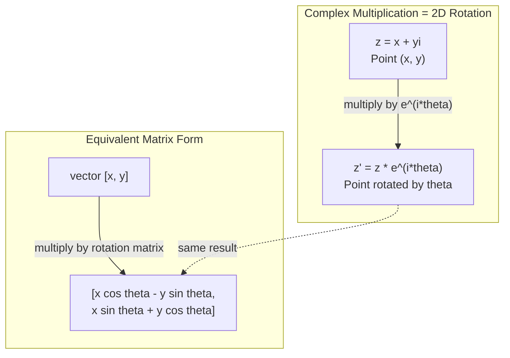
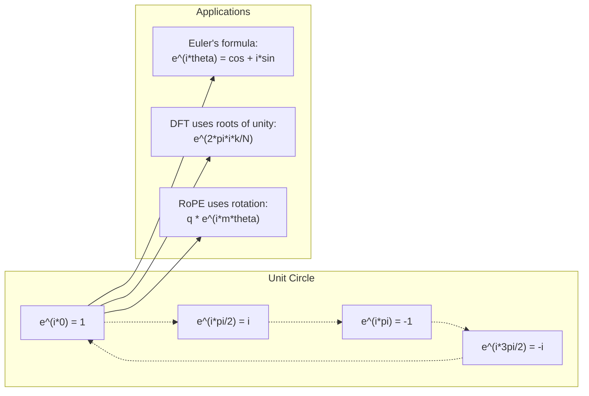

# 人工智能的复数

> -1的平方根不是虚构的。它是旋转、频率和一半信号处理的关键。

** 类型：** 学习
** 语言：** Python
** 先决条件：** 第1阶段，第01-04课（线性代数、微积分）
** 时间：** ~60分钟

## 学习目标

- 以矩形和极坐标形式执行复杂算术（加、乘、除、共乘）
- 应用欧拉公式在复指数和三角函数之间进行转换
- 使用复单位根实现离散傅里叶变换
- 解释复杂的旋转如何构成变压器中的RoPE和sin位置编码的基础

## 问题

你打开一张关于傅里叶变换的论文，到处都是“i”。您查看Transformer位置编码，会看到不同频率的“sin”和“cos”--复指数的实部和虚部。您阅读了有关量子计算的知识，发现一切都在复杂的载体空间中表达。

复数看起来很抽象。一个建立在-1的平方根上的数字系统感觉就像一个数学技巧。但这不是一个把戏。它是旋转和振荡的自然语言。每当有东西旋转、振动或振荡时，复数就是正确的工具。

如果不了解复数，就无法理解离散傅里叶变换。你无法理解快速傅立叶变换。您无法理解RoPE（旋转位置嵌入）如何在现代语言模型中工作。您无法理解为什么Transformer原始论文中的sin位置编码使用它们所使用的频率。

本课从头开始构建复杂的算术，将其与几何联系起来，并向您展示机器学习中复数出现的确切位置。

## 概念

### 什么是复数？

复数有两部分：实部和虚部。

```
z = a + bi

where:
  a is the real part
  b is the imaginary part
  i is the imaginary unit, defined by i^2 = -1
```

就是这样。你将数字线延伸到一个平面中。实际数字位于一个轴上。虚数位于另一个上。每个复数都是这个平面上的一个点。

### 复数算术

** 添加。**将真实的部分加在一起，将想象的部分加在一起。

```
(a + bi) + (c + di) = (a + c) + (b + d)i

Example: (3 + 2i) + (1 + 4i) = 4 + 6i
```

** 相乘。**使用分配定律并记住i2 =-1。

```
(a + bi)(c + di) = ac + adi + bci + bdi^2
                 = ac + adi + bci - bd
                 = (ac - bd) + (ad + bc)i

Example: (3 + 2i)(1 + 4i) = 3 + 12i + 2i + 8i^2
                            = 3 + 14i - 8
                            = -5 + 14i
```

** 结合物。**翻转虚构部分的符号。

```
conjugate of (a + bi) = a - bi
```

复数与它的共乘之积总是实的：

```
(a + bi)(a - bi) = a^2 + b^2
```

** 分裂。**将分子和分母乘以分母的共乘。

```
(a + bi) / (c + di) = (a + bi)(c - di) / (c^2 + d^2)
```

这消除了分母中的虚部，为您提供了一个干净的复数。

### 复平面

复平面将每个复数映射到2D点。水平轴是实轴，垂直轴是虚轴。

```
z = 3 + 2i  corresponds to the point (3, 2)
z = -1 + 0i corresponds to the point (-1, 0) on the real axis
z = 0 + 4i  corresponds to the point (0, 4) on the imaginary axis
```

复数同时是距离原点的一个点和一个载体。这种双重解释使得复数对几何有用。

### 极坐标形式

平面上的任何点都可以通过其与原点的距离以及与正实轴的角度来描述。

```
z = r * (cos(theta) + i*sin(theta))

where:
  r = |z| = sqrt(a^2 + b^2)     (magnitude, or modulus)
  theta = atan2(b, a)             (phase, or argument)
```

矩形形式（a + bi）适合加法。极形（r，theta）适合相乘。

** 以极形式进行相乘。**乘以幅度，加上角度。

```
z1 = r1 * e^(i*theta1)
z2 = r2 * e^(i*theta2)

z1 * z2 = (r1 * r2) * e^(i*(theta1 + theta2))
```

这就是为什么复数非常适合旋转。乘以一个数量为1的复数是纯旋转。

### 欧拉公式

复指数和三角学之间的桥梁：

```
e^(i*theta) = cos(theta) + i*sin(theta)
```

这是本课中最重要的公式。当theta = pi时：

```
e^(i*pi) = cos(pi) + i*sin(pi) = -1 + 0i = -1

Therefore: e^(i*pi) + 1 = 0
```

五个基本常数（e，i，pi，1，0）链接在一个方程中。

### 为什么欧拉公式对ML很重要

欧拉公式表明，随着theta的变化，‘e^（i*theta）’追踪单位圆。当theta = 0时，您处于（1，0）。当theta = pi/2时，您处于（0，1）。当theta = pi时，您处于（-1，0）。当theta = 3*pi/2时，您处于（0，-1）。完整旋转是theta = 2*pi。

这意味着复指数是旋转。旋转在信号处理和ML中无处不在。

### 与2D旋转的连接

将复数（x + yi）乘以e^（i*theta）会使点（x，y）绕原点旋转角度theta。

```
Rotation via complex multiplication:
  (x + yi) * (cos(theta) + i*sin(theta))
  = (x*cos(theta) - y*sin(theta)) + (x*sin(theta) + y*cos(theta))i

Rotation via matrix multiplication:
  [cos(theta)  -sin(theta)] [x]   [x*cos(theta) - y*sin(theta)]
  [sin(theta)   cos(theta)] [y] = [x*sin(theta) + y*cos(theta)]
```

它们产生相同的结果。复数相乘是2D旋转。旋转矩阵只是用矩阵表示法写成的复相乘。



### 相量和旋转信号

复指数e '（i* 欧米茄 *t）是以角频率欧米茄绕单位圆旋转的点。随着t的增加，该点沿着圆走。

这个旋转点的实部是cos（欧米茄 *t）。虚部是sin（欧米茄 *t）。sin信号是旋转复数的影子。

```
e^(i*omega*t) = cos(omega*t) + i*sin(omega*t)

Real part:      cos(omega*t)    -- a cosine wave
Imaginary part: sin(omega*t)    -- a sine wave
```

这是相量表示。您不是跟踪摇摆的长波，而是跟踪平稳旋转的箭头。移相变成角度补偿。幅度变化变成幅度变化。信号的相加变成了载体相加。

### 单位根

单位的N次根是单位圆上等距的N个点：

```
w_k = e^(2*pi*i*k/N)    for k = 0, 1, 2, ..., N-1
```

对于N = 4，根是：1，i，-1，-i（四个罗盘点）。
对于N = 8，您会得到四个罗盘点加上四个对角线。

单位根是离散傅里叶变换的基础。FT将信号分解为这N个等间隔频率的分量。

### 与FT的连接

信号x[0]、x[1]、.、的离散傅里叶变换x[N-1]是：

```
X[k] = sum_{n=0}^{N-1} x[n] * e^(-2*pi*i*k*n/N)
```

每个X[k]测量信号与第k次单位根（频率k处的复弦线）的相关程度。FT将信号分解为N个旋转相量，并告诉您每个相量的幅度和相量。

### 为什么我不是虚构的

“想象”这个词是一个历史偶然。狄更斯不屑一顾地使用了它。但我并不比人们第一次拒绝它们时的负值更想象。负值回答“3减5得到多少？“想象单位回答“你平方多少才能得到-1？”"

更有用的是：i是一个90度旋转操作符。将一个实数乘以i一次，你就可以相对于虚轴旋转90度。再次乘以i（i2），您再旋转90度--现在您指向的是负的实方向。这就是i2 =-1的原因。这并不神秘。这是由两个四分之一转弯组成的半转弯。

这就是为什么工程中复数无处不在。任何旋转的东西--电磁波、量子状态、信号振荡、位置编码--都自然地用复数来描述。

### 复指数与三角函数

在提出欧拉公式之前，工程师将信号写成A*cos（欧米茄 *t + phy）--幅度A、频率欧米茄、相差。这很有效，但会让算术变得痛苦。添加两个不同相的cos需要三角等式。

对于复指数，相同的信号是A*e^（i*（欧米茄 *t + phy））。添加两个信号只是添加两个复数。相乘（调制）只是相乘幅度和相加角度。移相变成角度添加。频移变成相量的相乘。

整个信号处理领域都改用复指数表示法，因为数学更清晰。“真实信号”始终只是复杂表示的真实部分。想象的部分作为簿记进行，使所有的代数都自然地计算出来。

### 连接变压器

** Sinusoid位置编码 **（Transformer原始论文）：

```
PE(pos, 2i) = sin(pos / 10000^(2i/d))
PE(pos, 2i+1) = cos(pos / 10000^(2i/d))
```

sin和cos对是不同频率下复指数的实部和虚部。每个频率为编码位置提供不同的“分辨率”。低频变化缓慢（位置粗糙）。高频变化很快（位置精细）。它们共同赋予每个位置一个独特的频率指纹。

**RoPE（旋转位置嵌入）** 进一步推进了这一点。它显式地将查询和关键载体乘以复杂的旋转矩阵。两个代币之间的相对位置成为旋转角。注意力是使用这些旋转的载体来计算的，使模型通过复数相乘对相对位置敏感。

| 操作 | 代数形式 | 几何意义 |
|-----------|---------------|-------------------|
| 此外 | （a+c）+（b+d）i | 平面中的载体添加 |
| 乘法 | （ac-bd）+（ad+BC）i | 旋转和缩放 |
| 缀合物 | a - bi | 反映在实轴上 |
| 幅度 | squtt（a#2 + b#2） | 距原点的距离 |
| 相 | atan 2（b，a） | 与正实轴的角度 |
| 司 | 乘上共乘 | 反向旋转和重新缩放 |
| 功率 | r ' n * e '（i*n*theta） | 旋转n次，按r ' n缩放 |



## 建设党

### 第1步：复杂课程

构建一个复数类，支持算术、幅度、相以及矩形和极坐标形式之间的转换。

```python
import math

class Complex:
    def __init__(self, real, imag=0.0):
        self.real = real
        self.imag = imag

    def __add__(self, other):
        return Complex(self.real + other.real, self.imag + other.imag)

    def __mul__(self, other):
        r = self.real * other.real - self.imag * other.imag
        i = self.real * other.imag + self.imag * other.real
        return Complex(r, i)

    def __truediv__(self, other):
        denom = other.real ** 2 + other.imag ** 2
        r = (self.real * other.real + self.imag * other.imag) / denom
        i = (self.imag * other.real - self.real * other.imag) / denom
        return Complex(r, i)

    def magnitude(self):
        return math.sqrt(self.real ** 2 + self.imag ** 2)

    def phase(self):
        return math.atan2(self.imag, self.real)

    def conjugate(self):
        return Complex(self.real, -self.imag)
```

### 第2步：极坐标转换和欧拉公式

```python
def to_polar(z):
    return z.magnitude(), z.phase()

def from_polar(r, theta):
    return Complex(r * math.cos(theta), r * math.sin(theta))

def euler(theta):
    return Complex(math.cos(theta), math.sin(theta))
```

验证：' e（theta）.幅度（）'应始终为1.0。' eSYS（0）'应该给出（1，0）。' eSYS（pi）'应该给出（-1，0）。

### 第3步：轮换

将点（x，y）旋转角度θ是一个复数乘法：

```python
point = Complex(3, 4)
rotated = point * euler(math.pi / 4)
```

震级保持不变。只是角度发生了变化。

### 第4步：从复算术中进行离散傅立叶变换

```python
def dft(signal):
    N = len(signal)
    result = []
    for k in range(N):
        total = Complex(0, 0)
        for n in range(N):
            angle = -2 * math.pi * k * n / N
            total = total + Complex(signal[n], 0) * euler(angle)
        result.append(total)
    return result
```

这是O（N2）FT。每个输出X[k]是信号样本乘以单位根的总和。

### 第5步：逆离散傅立叶变换

逆离散傅立叶变换从其频谱中重建原始信号。与正向离散傅里叶的唯一变化：翻转指数中的符号并除以N。

```python
def idft(spectrum):
    N = len(spectrum)
    result = []
    for n in range(N):
        total = Complex(0, 0)
        for k in range(N):
            angle = 2 * math.pi * k * n / N
            total = total + spectrum[k] * euler(angle)
        result.append(Complex(total.real / N, total.imag / N))
    return result
```

这为您提供完美的重建。应用FT，然后应用IDFT，即可将原始信号恢复到机器精度。没有信息丢失。

### 第六步：团结的根源

```python
def roots_of_unity(N):
    return [euler(2 * math.pi * k / N) for k in range(N)]
```

验证两个属性：
- 每个根的量级恰好为1。
- 所有N根之和为零（它们通过对称性抵消）。

这些属性是使密度函数可逆的原因。单位根形成频域的垂直基。

## 使用它

Python内置复数支持。字面上的“j”代表虚单位。

```python
z = 3 + 2j
w = 1 + 4j

print(z + w)
print(z * w)
print(abs(z))

import cmath
print(cmath.phase(z))
print(cmath.exp(1j * cmath.pi))
```

对于数组，numpy原生地处理复数：

```python
import numpy as np

z = np.array([1+2j, 3+4j, 5+6j])
print(np.abs(z))
print(np.angle(z))
print(np.conj(z))
print(np.real(z))
print(np.imag(z))

signal = np.sin(2 * np.pi * 5 * np.linspace(0, 1, 128))
spectrum = np.fft.fft(signal)
freqs = np.fft.fftfreq(128, d=1/128)
```

## 把它运

运行' code/complex_numbers.py '以生成'输出/skill-complex-arithmetic.md '。

## 演习

1. ** 手工复杂算术。**计算（2 + 3 i）*（4 - i）并使用代码验证。然后计算（5 + 2 i）/（1 - 3 i）。在复平面上绘制两个结果，并检查相乘是否旋转并缩放了第一个数字。

2. ** 旋转顺序。**从点（1，0）开始。乘以e '（i*pi/6）十二次。验证12次相乘后是否返回到（1，0）。打印每个步骤的坐标并确认它们追踪到常规的12-gon。

3. ** 已知信号的离散傅立叶变换。**创建一个信号，该信号是在32个点采样的sin（2*pi*3*t）和0.5*sin（2*pi*7*t）之和。运行您的DF。验证幅度谱在频率3和7处是否有峰值，其中7处的峰值是3处峰值高度的一半。

4. ** 团结可视化的根源。**计算统一的第八根。验证它们的总和是否为零。验证将任何根乘以原始根e^（2*pi*i/8）即可得到下一个根。

5. ** 旋转矩阵等效。**对于10个随机角度和10个随机点，验证复相乘得到的结果与使用2x 2旋转矩阵的矩阵-载体相乘相同。打印最大数字差异。

## 关键术语

| Term | 意味着什么 |
|------|---------------|
| 复数 | 数a + bi，其中a是实部，b是虚部，i2 = -1 |
| 虚数单位 | 数字i，定义为i2 =-1。不是哲学意义上的想象--它是一个旋转操作符 |
| 复平面 | x轴是实轴，y轴是虚轴。也被称为Argand飞机 |
| 幅度（模） | 到原点的距离：sqrt（a^2 + b^2）。写为\ | z\ |  |
| 阶段（论点） | 与正实轴的角度：atan 2（b，a）。写成arg（z） |
| 缀合物 | 穿过实轴的镜像：a + bi的共乘是a - bi |
| 极坐标形式 | 将z表示为r * e '（i*theta）而不是a + bi。使相乘变得简单 |
| 欧拉公式 | e^（i*theta）= cos（theta）+ i*sin（theta）。将指数与三角学连接起来 |
| 相量 | 表示曲线信号的旋转复数e '（i* 欧米茄 *t） |
| 单位根 | N个复数e '（2*pi*i*k/N），k = 0至N-1。单位圆上N个等距点 |
| DFT | 离散傅里叶变换。使用单位根将信号分解为复杂的频谱分量 |
| 绳 | 旋转位置嵌入。使用复数相乘来编码Transformer注意力中的相对位置 |

## 进一步阅读

- [欧拉公式视觉介绍]（https：//betterexplained.com/articles/intuitive-understanding-of-eulers-formula/）-构建无需沉重符号的几何直觉
- [Su等人：RoFormer（2021）]（https：//arxiv.org/ab/2104.09864）-介绍使用复杂旋转的旋转位置嵌入的论文
- [瓦斯瓦尼等人：注意力就是你所需要的一切（2017）]（https：//arxiv.org/ab/1706.03762）-具有曲线位置编码的原版Transformer论文
- [3Blue 1Brown：欧拉公式和群论入门]（https：www.youtube.com/watch? v=mvmuCPvRoWQ）-为什么e^（i*pi）= -1的视觉解释
- [李德姆：视觉复杂分析]（https：//global.oup.com/academic/product/visual-complex-Analysis-9780198534464）-复数的最佳视觉处理，充满几何洞察力
- [斯特朗：线性代数入门，第10章]（https：//math.mit.edu/guardgs/linearalegbra/）-线性代数和特征值背景下的复数
