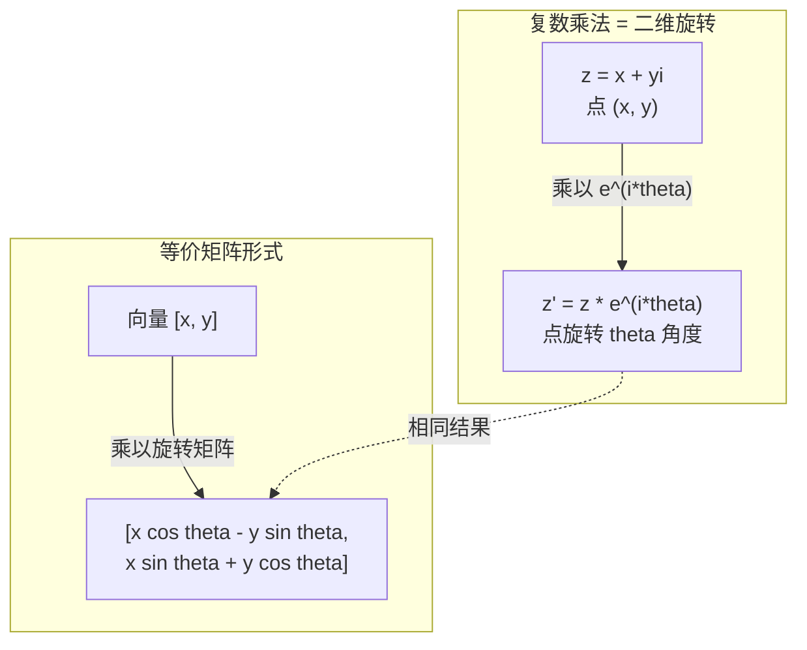
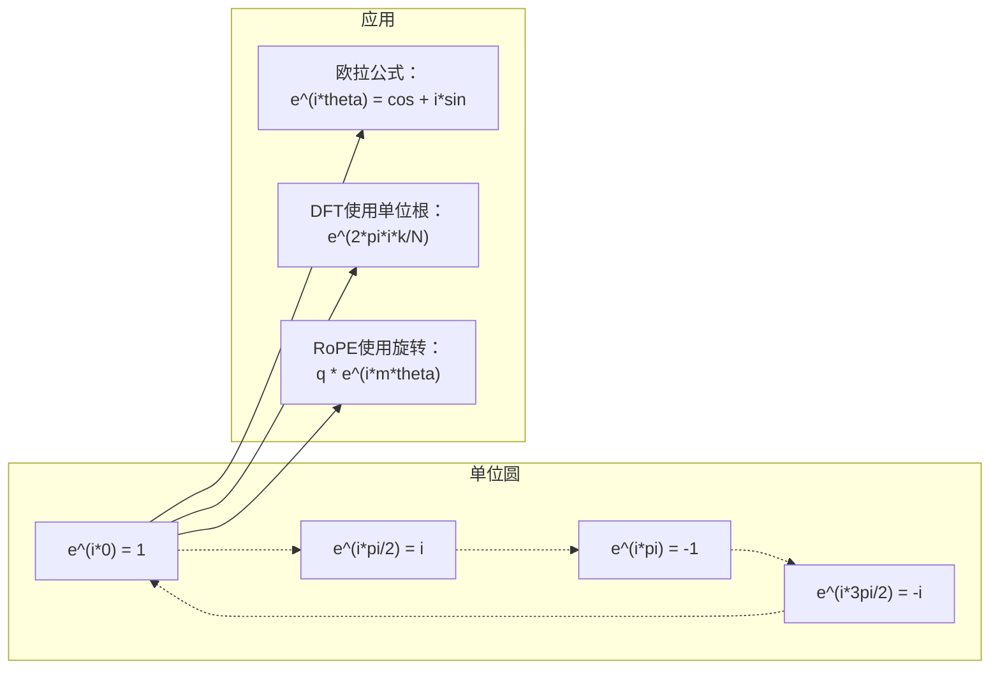

# 面向AI的复数

> -1的平方根并非虚妄。它是旋转、频率以及半个信号处理领域的关键。

**类型：** 学习
**语言：** Python
**前置知识：** 阶段1，第1-4课（线性代数，微积分）
**时间：** 约60分钟

## 学习目标

- 能执行复数算术运算（加法、乘法、除法、共轭），包括直角坐标和极坐标形式
- 应用欧拉公式在复指数与三角函数之间进行转换
- 利用复数单位根实现离散傅里叶变换
- 解释复数旋转如何构成Transformer中的RoPE（旋转位置编码）和正弦位置编码的基础

## 问题

你打开一篇关于傅里叶变换的论文，发现到处都是`i`。你看Transformer位置编码，看到不同频率下的`sin`和`cos`——它们是复指数函数的实部和虚部。你阅读量子计算时，发现一切都在复向量空间中表达。

复数看似抽象。一个建立在-1平方根基础上的数系感觉像是数学把戏。但这不是把戏。它是旋转和振荡的自然语言。每当有东西旋转、振动或振荡时，复数就是合适的工具。

不理解复数，你就无法理解离散傅里叶变换。不理解FFT。不理解RoPE（旋转位置嵌入）在现代语言模型中如何工作。不理解原始Transformer论文中的正弦位置编码为何使用那些特定频率。

本课从零开始构建复数算术，将其与几何联系起来，并确切展示复数在机器学习中出现在哪里。

## 概念

### 什么是复数？

复数有两部分：实部和虚部。

```
z = a + bi

其中：
  a 是实部
  b 是虚部
  i 是虚数单位，定义为 i^2 = -1
```

就是这样。你将数轴扩展成一个平面。实数位于一个轴上。虚数位于另一个轴上。每个复数都是这个平面上的一个点。

### 复数算术

**加法。** 实部相加，虚部相加。

```
(a + bi) + (c + di) = (a + c) + (b + d)i

示例： (3 + 2i) + (1 + 4i) = 4 + 6i
```

**乘法。** 使用分配律，并记住 i^2 = -1。

```
(a + bi)(c + di) = ac + adi + bci + bdi^2
                 = ac + adi + bci - bd
                 = (ac - bd) + (ad + bc)i

示例： (3 + 2i)(1 + 4i) = 3 + 12i + 2i + 8i^2
                         = 3 + 14i - 8
                         = -5 + 14i
```

**共轭。** 翻转虚部的符号。

```
(a + bi) 的共轭 = a - bi
```

一个复数与其共轭的乘积总是实数：

```
(a + bi)(a - bi) = a^2 + b^2
```

**除法。** 分子和分母同时乘以分母的共轭。

```
(a + bi) / (c + di) = (a + bi)(c - di) / (c^2 + d^2)
```

这消除了分母中的虚部，得到干净的复数。

### 复平面

复平面将每个复数映射到一个二维点。水平轴是实轴，垂直轴是虚轴。

```
z = 3 + 2i  对应于点 (3, 2)
z = -1 + 0i  对应于实轴上的点 (-1, 0)
z = 0 + 4i   对应于虚轴上的点 (0, 4)
```

一个复数同时是一个点和一个从原点出发的向量。这种双重解释使复数在几何中非常有用。

### 极坐标形式

平面上的任何点都可以用其到原点的距离以及与正实轴之间的夹角来描述。

```
z = r * (cos(theta) + i*sin(theta))

其中：
  r = |z| = sqrt(a^2 + b^2)     （模长，或模）
  theta = atan2(b, a)             （相位，或辐角）
```

直角坐标形式 (a + bi) 适合加法。极坐标形式 (r, theta) 适合乘法。

**极坐标形式下的乘法。** 模长相乘，角度相加。

```
z1 = r1 * e^(i*theta1)
z2 = r2 * e^(i*theta2)

z1 * z2 = (r1 * r2) * e^(i*(theta1 + theta2))
```

这就是为什么复数非常适合旋转。乘以一个模长为1的复数就是纯旋转。

### 欧拉公式

连接复指数和三角学的桥梁：

```
e^(i*theta) = cos(theta) + i*sin(theta)
```

这是本课最重要的公式。当 theta = pi 时：

```
e^(i*pi) = cos(pi) + i*sin(pi) = -1 + 0i = -1

因此： e^(i*pi) + 1 = 0
```

五个基本常数（e, i, pi, 1, 0）被连接在一个方程中。

### 欧拉公式为何对机器学习重要

欧拉公式表明，`e^(i*theta)` 随着 theta 的变化描绘单位圆。在 theta = 0 时，你在 (1, 0) 处。在 theta = pi/2 时，你在 (0, 1) 处。在 theta = pi 时，你在 (-1, 0) 处。在 theta = 3*pi/2 时，你在 (0, -1) 处。一个完整旋转是 theta = 2*pi。

这意味着复指数函数就是旋转。而旋转在信号处理和机器学习中无处不在。

### 与二维旋转的联系

将复数 (x + yi) 乘以 e^(i*theta) 可以将点 (x, y) 绕原点旋转 theta 角度。

```
通过复数乘法的旋转：
  (x + yi) * (cos(theta) + i*sin(theta))
  = (x*cos(theta) - y*sin(theta)) + (x*sin(theta) + y*cos(theta))i

通过矩阵乘法的旋转：
  [cos(theta)  -sin(theta)] [x]   [x*cos(theta) - y*sin(theta)]
  [sin(theta)   cos(theta)] [y] = [x*sin(theta) + y*cos(theta)]
```

它们产生相同的结果。复数乘法就是二维旋转。旋转矩阵只是用矩阵符号表示的复数乘法。



### 相量与旋转信号

一个复指数函数 e^(i*omega*t) 是一个以角频率 omega 绕单位圆旋转的点。随着 t 增加，该点描绘出圆形。

这个旋转点的实部是 cos(omega*t)。虚部是 sin(omega*t)。一个正弦信号就是一个旋转复数的投影。

```
e^(i*omega*t) = cos(omega*t) + i*sin(omega*t)

实部：     cos(omega*t)    -- 余弦波
虚部：     sin(omega*t)    -- 正弦波
```

这就是相量表示法。不必跟踪扭曲的正弦波，而是跟踪一个平滑旋转的箭头。相位偏移变成角度偏移。幅度变化变成模长变化。信号相加变成向量相加。

### 单位根

N次单位根是单位圆上等距分布的N个点：

```
w_k = e^(2*pi*i*k/N)    对于 k = 0, 1, 2, ..., N-1
```

对于 N = 4，根为：1, i, -1, -i（四个方位点）。
对于 N = 8，你得到四个方位点加上四个对角线点。

单位根是离散傅里叶变换的基础。DFT（离散傅里叶变换）将信号分解为这些N个等距频率的分量。

### 与DFT的联系

信号 x[0], x[1], ..., x[N-1] 的离散傅里叶变换为：

```
X[k] = sum_{n=0}^{N-1} x[n] * e^(-2*pi*i*k*n/N)
```

每个 X[k] 度量信号与第k个单位根（即频率为k的复正弦波）的相关程度。DFT将信号分解为N个旋转相量，并告诉你每个相量的幅度和相位。

### 为什么i并非虚妄

“虚数”这个词是历史偶然。笛卡尔用它表示轻蔑。但i并不比负数最初被拒绝时更“虚”。负数回答了“3减去5得什么？”虚数单位回答了“什么数平方得-1？”

更有用的是：i是一个90度旋转算子。将实数乘以i一次，你旋转90度到虚轴。再乘以i一次（i^2），你再旋转90度——现在你指向负实方向。这就是为什么 i^2 = -1。并不神秘；它是由两个四分之一转构成的半转。

这就是为什么复数在工程中无处不在。任何旋转的东西——电磁波、量子态、信号振荡、位置编码——都可以自然地用复数描述。

### 复指数函数与三角函数

在欧拉公式之前，工程师将信号写为 A*cos(omega*t + phi)——幅度A，频率omega，相位phi。这可行但算术麻烦。将两个不同相位的余弦相加需要三角恒等式。

使用复指数函数，同样的信号是 A*e^(i*(omega*t + phi))。相加两个信号就是相加两个复数。相乘（调制）就是将模长相乘并将角度相加。相位偏移变成角度加法。频率偏移变成乘以相量。

整个信号处理领域转向复指数记法，因为数学更简洁。“真实信号”始终只是复表示中的实部。虚部作为记账工具被携带，使所有代数自然展开。

### 与Transformer的联系

**正弦位置编码**（原始Transformer论文）：

```
PE(pos, 2i) = sin(pos / 10000^(2i/d))
PE(pos, 2i+1) = cos(pos / 10000^(2i/d))
```

sin和cos对是不同频率下复指数函数的实部和虚部。每个频率为编码位置提供不同的“分辨率”。低频变化缓慢（粗略位置）。高频变化迅速（精细位置）。它们共同为每个位置提供独特的频率指纹。

**RoPE（旋转位置嵌入）** 更进一步。它显式地将查询向量和键向量乘以复数旋转矩阵。两个标记之间的相对位置变成一个旋转角度。使用这些旋转后的向量计算注意力，使得模型通过复数乘法对相对位置变得敏感。

| 运算 | 代数形式 | 几何含义 |
|-----------|---------------|-------------------|
| 加法 | (a+c) + (b+d)i | 平面上的向量加法 |
| 乘法 | (ac-bd) + (ad+bc)i | 旋转并缩放 |
| 共轭 | a - bi | 关于实轴反射 |
| 模长 | sqrt(a^2 + b^2) | 到原点的距离 |
| 相位 | atan2(b, a) | 与正实轴的夹角 |
| 除法 | 乘以共轭 | 反向旋转并重缩放 |
| 幂 | r^n * e^(i*n*theta) | 旋转n次，模长缩放r^n倍 |



## 构建它

### 步骤1：复数类

构建一个支持算术运算、模长、相位以及在直角坐标和极坐标之间转换的复数类。

```python
import math

class Complex:
    def __init__(self, real, imag=0.0):
        self.real = real
        self.imag = imag

    def __add__(self, other):
        return Complex(self.real + other.real, self.imag + other.imag)

    def __mul__(self, other):
        r = self.real * other.real - self.imag * other.imag
        i = self.real * other.imag + self.imag * other.real
        return Complex(r, i)

    def __truediv__(self, other):
        denom = other.real ** 2 + other.imag ** 2
        r = (self.real * other.real + self.imag * other.imag) / denom
        i = (self.imag * other.real - self.real * other.imag) / denom
        return Complex(r, i)

    def magnitude(self):
        return math.sqrt(self.real ** 2 + self.imag ** 2)

    def phase(self):
        return math.atan2(self.imag, self.real)

    def conjugate(self):
        return Complex(self.real, -self.imag)
```

### 步骤2：极坐标转换与欧拉公式

```python
def to_polar(z):
    return z.magnitude(), z.phase()

def from_polar(r, theta):
    return Complex(r * math.cos(theta), r * math.sin(theta))

def euler(theta):
    return Complex(math.cos(theta), math.sin(theta))
```

验证：`euler(theta).magnitude()` 应该始终是1.0。`euler(0)` 应该给出 (1, 0)。`euler(pi)` 应该给出 (-1, 0)。

### 步骤3：旋转

将点 (x, y) 旋转 theta 角度只需一次复数乘法：

```python
point = Complex(3, 4)
rotated = point * euler(math.pi / 4)
```

模长保持不变。仅角度变化。

### 步骤4：基于复数算术的DFT

```python
def dft(signal):
    N = len(signal)
    result = []
    for k in range(N):
        total = Complex(0, 0)
        for n in range(N):
            angle = -2 * math.pi * k * n / N
            total = total + Complex(signal[n], 0) * euler(angle)
        result.append(total)
    return result
```

这是 O(N^2) 的DFT。每个输出 X[k] 是信号样本乘以单位根后的总和。

### 步骤5：逆DFT

逆DFT从频谱重建原始信号。与正向DFT相比唯一的变化：翻转指数中的符号并除以N。

```python
def idft(spectrum):
    N = len(spectrum)
    result = []
    for n in range(N):
        total = Complex(0, 0)
        for k in range(N):
            angle = 2 * math.pi * k * n / N
            total = total + spectrum[k] * euler(angle)
        result.append(Complex(total.real / N, total.imag / N))
    return result
```

这将实现完美重建。先应用DFT，再应用IDFT，你将得到原始信号，精度达到机器精度。没有信息丢失。

### 步骤6：单位根

```python
def roots_of_unity(N):
    return [euler(2 * math.pi * k / N) for k in range(N)]
```

验证两个性质：
- 每个根的模长恰好为1。
- 所有N个根的和为零（它们由于对称性相互抵消）。

这些性质使得DFT可逆。单位根构成了频域的一组正交基。

## 使用它

Python内置支持复数。字母`j`代表虚数单位。

```python
z = 3 + 2j
w = 1 + 4j

print(z + w)
print(z * w)
print(abs(z))

import cmath
print(cmath.phase(z))
print(cmath.exp(1j * cmath.pi))
```

对于数组，numpy原生处理复数：

```python
import numpy as np

z = np.array([1+2j, 3+4j, 5+6j])
print(np.abs(z))
print(np.angle(z))
print(np.conj(z))
print(np.real(z))
print(np.imag(z))

signal = np.sin(2 * np.pi * 5 * np.linspace(0, 1, 128))
spectrum = np.fft.fft(signal)
freqs = np.fft.fftfreq(128, d=1/128)
```

## 交付它

运行 `code/complex_numbers.py` 以生成 `outputs/skill-complex-arithmetic.md`。

## 练习

1. **手工复数算术。** 计算 (2 + 3i) * (4 - i) 并用代码验证。然后计算 (5 + 2i) / (1 - 3i)。在复平面上画出两个结果，并检查乘法是否旋转并缩放了第一个数。

2. **旋转序列。** 从点 (1, 0) 开始。乘以 e^(i*pi/6) 十二次。验证经过12次乘法后你