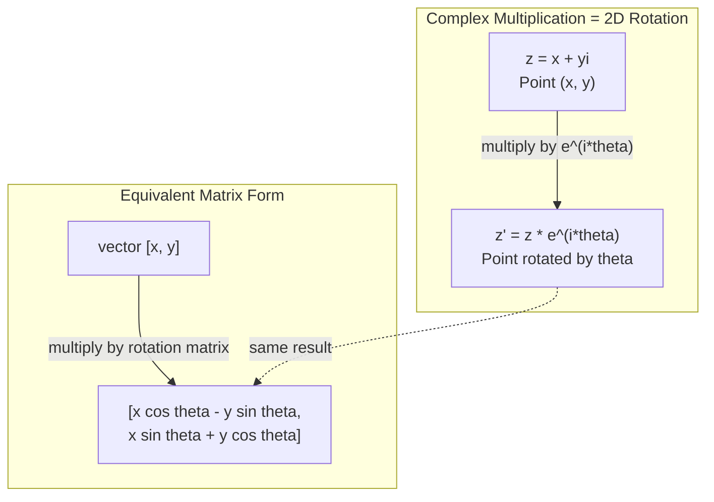
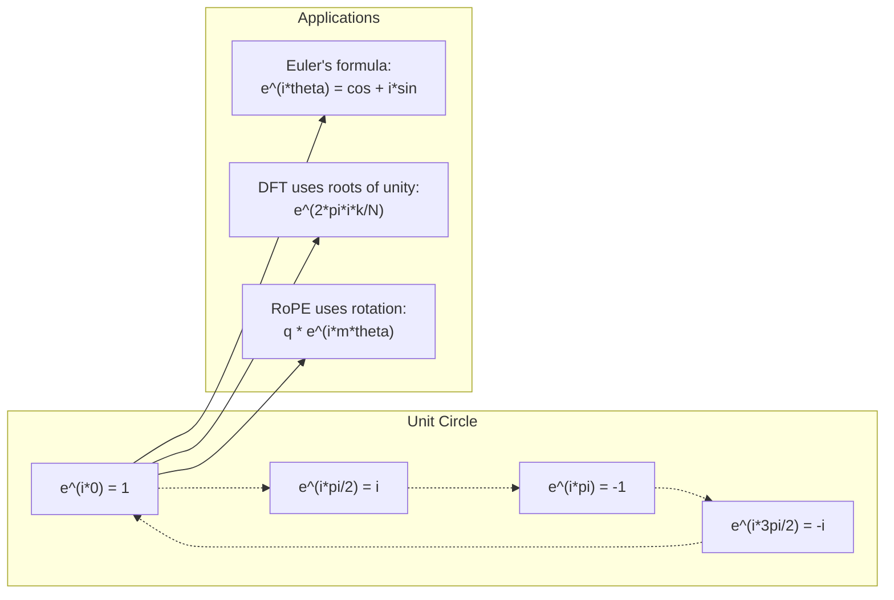

# 19 · 面向 AI 的复数

> -1 的平方根并不"虚无"。它是旋转、频率以及半部信号处理的关键。

**类型：** 学习
**语言：** Python
**前置：** 第 1 阶段，第 01-04 课（线性代数、微积分）
**时长：** 约 60 分钟

## 学习目标

- 在直角坐标形式与极坐标形式下进行复数运算（加、乘、除、共轭）
- 应用欧拉公式（Euler's formula）在复指数与三角函数之间相互转换
- 利用复数的单位根（roots of unity）实现离散傅里叶变换（Discrete Fourier Transform）
- 解释复数旋转如何支撑 transformer 中的 RoPE 与正弦位置编码

## 问题所在

你翻开一篇关于傅里叶变换（Fourier transform）的论文，满眼都是 `i`。你查看 transformer 的位置编码，看到不同频率下的 `sin` 与 `cos`——它们正是复指数的实部与虚部。你阅读量子计算的资料，发现一切都用复向量空间来表达。

复数看起来很抽象。一个建立在 -1 的平方根之上的数系，感觉像是某种数学把戏。但它并不是把戏，而是旋转与振荡的天然语言。每当某个东西在旋转、振动或摆动时，复数都是恰当的工具。

不理解复数，你就无法理解离散傅里叶变换；无法理解 FFT；无法理解现代语言模型中的 RoPE（旋转位置编码，Rotary Position Embedding）是如何工作的；也无法理解为什么最初的 Transformer 论文里的正弦位置编码会采用那样的频率。

本课从零构建复数运算，将其与几何联系起来，并向你确切地展示复数在机器学习中出现在哪些地方。

## 核心概念

### 什么是复数？

一个复数有两部分：实部和虚部。

```
z = a + bi

where:
  a is the real part
  b is the imaginary part
  i is the imaginary unit, defined by i^2 = -1
```

就这么简单。你把数轴扩展成了一个平面。实数位于一条轴上，虚数位于另一条轴上。每个复数都是这个平面中的一个点。

### 复数运算

**加法。** 实部相加，虚部相加。

```
(a + bi) + (c + di) = (a + c) + (b + d)i

Example: (3 + 2i) + (1 + 4i) = 4 + 6i
```

**乘法。** 使用分配律，并记住 i^2 = -1。

```
(a + bi)(c + di) = ac + adi + bci + bdi^2
                 = ac + adi + bci - bd
                 = (ac - bd) + (ad + bc)i

Example: (3 + 2i)(1 + 4i) = 3 + 12i + 2i + 8i^2
                            = 3 + 14i - 8
                            = -5 + 14i
```

**共轭。** 翻转虚部的符号。

```
conjugate of (a + bi) = a - bi
```

一个复数与其共轭的乘积总是实数：

```
(a + bi)(a - bi) = a^2 + b^2
```

**除法。** 分子和分母同时乘以分母的共轭。

```
(a + bi) / (c + di) = (a + bi)(c - di) / (c^2 + d^2)
```

这样就从分母中消去了虚部，得到一个干净的复数。

### 复平面

复平面（complex plane）将每个复数映射为一个二维点。水平轴是实轴，垂直轴是虚轴。

```
z = 3 + 2i  corresponds to the point (3, 2)
z = -1 + 0i corresponds to the point (-1, 0) on the real axis
z = 0 + 4i  corresponds to the point (0, 4) on the imaginary axis
```

一个复数同时是一个点，也是从原点出发的一个向量。正是这种双重解释，使复数对几何而言如此有用。

### 极坐标形式

平面中的任意一点都可以用它到原点的距离和它相对于正实轴的角度来描述。

```
z = r * (cos(theta) + i*sin(theta))

where:
  r = |z| = sqrt(a^2 + b^2)     (magnitude, or modulus)
  theta = atan2(b, a)             (phase, or argument)
```

直角坐标形式（a + bi）适合做加法。极坐标形式（r, theta）适合做乘法。

**极坐标形式下的乘法。** 模相乘，角相加。

```
z1 = r1 * e^(i*theta1)
z2 = r2 * e^(i*theta2)

z1 * z2 = (r1 * r2) * e^(i*(theta1 + theta2))
```

这就是复数非常适合表示旋转的原因。乘以一个模为 1 的复数，就是一次纯旋转。

### 欧拉公式

连接复指数与三角学的桥梁：

```
e^(i*theta) = cos(theta) + i*sin(theta)
```

这是本课中最重要的公式。当 theta = pi 时：

```
e^(i*pi) = cos(pi) + i*sin(pi) = -1 + 0i = -1

Therefore: e^(i*pi) + 1 = 0
```

五个基本常数（e、i、pi、1、0）被一个方程联系在一起。

### 为什么欧拉公式对机器学习很重要

欧拉公式表明，随着 theta 变化，`e^(i*theta)` 会描出单位圆。在 theta = 0 处，你位于 (1, 0)；在 theta = pi/2 处，你位于 (0, 1)；在 theta = pi 处，你位于 (-1, 0)；在 theta = 3*pi/2 处，你位于 (0, -1)。完整旋转一圈对应 theta = 2*pi。

这意味着复指数本身就是旋转。而旋转在信号处理和机器学习中无处不在。

### 与二维旋转的联系

将复数 (x + yi) 乘以 e^(i*theta)，相当于把点 (x, y) 绕原点旋转角度 theta。

```
Rotation via complex multiplication:
  (x + yi) * (cos(theta) + i*sin(theta))
  = (x*cos(theta) - y*sin(theta)) + (x*sin(theta) + y*cos(theta))i

Rotation via matrix multiplication:
  [cos(theta)  -sin(theta)] [x]   [x*cos(theta) - y*sin(theta)]
  [sin(theta)   cos(theta)] [y] = [x*sin(theta) + y*cos(theta)]
```

它们产生完全相同的结果。复数乘法就是二维旋转。旋转矩阵不过是用矩阵记法写出的复数乘法。



### 相量与旋转信号

复指数 e^(i*omega*t) 是一个以角频率 omega 绕单位圆旋转的点。随着 t 增大，这个点描出整个圆。

这个旋转点的实部是 cos(omega*t)，虚部是 sin(omega*t)。一个正弦信号就是一个旋转复数的"影子"。

```
e^(i*omega*t) = cos(omega*t) + i*sin(omega*t)

Real part:      cos(omega*t)    -- a cosine wave
Imaginary part: sin(omega*t)    -- a sine wave
```

这就是相量（phasor）表示法。你不再去追踪一条扭来扭去的正弦波，而是追踪一支平滑旋转的箭头。相移变成了角度偏移；幅度变化变成了模的变化；信号相加变成了向量相加。

### 单位根

N 个 N 次单位根是在单位圆上等距分布的 N 个点：

```
w_k = e^(2*pi*i*k/N)    for k = 0, 1, 2, ..., N-1
```

当 N = 4 时，这些根是：1、i、-1、-i（四个方位点）。
当 N = 8 时，你会得到这四个方位点外加四条对角线方向的点。

单位根是离散傅里叶变换的基石。DFT 将一个信号分解为这 N 个等距频率上的分量。

### 与 DFT 的联系

信号 x[0], x[1], ..., x[N-1] 的离散傅里叶变换为：

```
X[k] = sum_{n=0}^{N-1} x[n] * e^(-2*pi*i*k*n/N)
```

每个 X[k] 衡量信号与第 k 个单位根——即频率为 k 的复正弦——的相关程度。DFT 把一个信号拆解为 N 个旋转相量，并告诉你每个相量的幅度与相位。

### 为什么 i 并不"虚无"

"虚数"（imaginary）这个词是一个历史性的偶然。笛卡尔（Descartes）当年是带着轻蔑用它的。但 i 并不比当年人们最初拒绝接受的负数更"虚"。负数回答的是"3 减去多少才得到一个比它更小的结果"；而虚数单位回答的是"什么数平方后得到 -1"。

更有用的视角是：i 是一个 90 度旋转算子。把一个实数乘以 i 一次，你就把它旋转 90 度到了虚轴上。再乘一次 i（即 i^2），你又旋转 90 度——此时你指向了负实数方向。这就是为什么 i^2 = -1。它毫不神秘，只是由两个四分之一圈拼成的半圈而已。

这正是复数在工程中无处不在的原因。任何会旋转的东西——电磁波、量子态、信号振荡、位置编码——都自然地由复数来描述。

### 复指数 vs 三角函数

在欧拉公式之前，工程师们把信号写成 A*cos(omega*t + phi)——幅度 A、频率 omega、相位 phi。这种写法可行，但会让运算变得痛苦。把两个不同相位的余弦相加，需要用到三角恒等式。

而用复指数表示时，同一个信号就是 A*e^(i*(omega*t + phi))。两个信号相加只是两个复数相加；相乘（调制）只是模相乘、角相加。相移变成角度的相加；频移变成乘以相量。

整个信号处理领域都转向了复指数记法，因为这样数学更干净。"真实信号"始终只是复数表示的实部；虚部则作为记账信息被一路带着，让所有代数运算自然地成立。

### 与 transformer 的联系

**正弦位置编码**（最初的 Transformer 论文）：

```
PE(pos, 2i) = sin(pos / 10000^(2i/d))
PE(pos, 2i+1) = cos(pos / 10000^(2i/d))
```

这些 sin 与 cos 对，正是不同频率下复指数的实部与虚部。每个频率为位置编码提供了不同的"分辨率"。低频变化缓慢（粗粒度位置）；高频变化迅速（细粒度位置）。它们合在一起，为每个位置赋予了独一无二的频率指纹。

**RoPE（旋转位置编码，Rotary Position Embedding）** 把这一思路推得更远。它显式地将查询向量和键向量乘以复数旋转矩阵。两个 token 之间的相对位置变成了一个旋转角度。注意力使用这些旋转后的向量来计算，从而通过复数乘法使模型对相对位置敏感。

| 运算 | 代数形式 | 几何含义 |
|-----------|---------------|-------------------|
| 加法 | (a+c) + (b+d)i | 平面中的向量相加 |
| 乘法 | (ac-bd) + (ad+bc)i | 旋转并缩放 |
| 共轭 | a - bi | 关于实轴反射 |
| 模 | sqrt(a^2 + b^2) | 到原点的距离 |
| 相位 | atan2(b, a) | 相对于正实轴的角度 |
| 除法 | 乘以共轭 | 逆向旋转并缩放 |
| 幂 | r^n * e^(i*n*theta) | 旋转 n 次，按 r^n 缩放 |



## 动手构建

### 第 1 步：Complex 类

构建一个 Complex 复数类，支持运算、求模、求相位，以及直角坐标与极坐标形式之间的转换。

```python
import math

class Complex:
    def __init__(self, real, imag=0.0):
        self.real = real
        self.imag = imag

    def __add__(self, other):
        return Complex(self.real + other.real, self.imag + other.imag)

    def __mul__(self, other):
        r = self.real * other.real - self.imag * other.imag
        i = self.real * other.imag + self.imag * other.real
        return Complex(r, i)

    def __truediv__(self, other):
        denom = other.real ** 2 + other.imag ** 2
        r = (self.real * other.real + self.imag * other.imag) / denom
        i = (self.imag * other.real - self.real * other.imag) / denom
        return Complex(r, i)

    def magnitude(self):
        return math.sqrt(self.real ** 2 + self.imag ** 2)

    def phase(self):
        return math.atan2(self.imag, self.real)

    def conjugate(self):
        return Complex(self.real, -self.imag)
```

### 第 2 步：极坐标转换与欧拉公式

```python
def to_polar(z):
    return z.magnitude(), z.phase()

def from_polar(r, theta):
    return Complex(r * math.cos(theta), r * math.sin(theta))

def euler(theta):
    return Complex(math.cos(theta), math.sin(theta))
```

验证：`euler(theta).magnitude()` 应当始终等于 1.0；`euler(0)` 应当给出 (1, 0)；`euler(pi)` 应当给出 (-1, 0)。

### 第 3 步：旋转

将点 (x, y) 旋转角度 theta，只需一次复数乘法：

```python
point = Complex(3, 4)
rotated = point * euler(math.pi / 4)
```

模保持不变，只有角度改变。

### 第 4 步：用复数运算实现 DFT

```python
def dft(signal):
    N = len(signal)
    result = []
    for k in range(N):
        total = Complex(0, 0)
        for n in range(N):
            angle = -2 * math.pi * k * n / N
            total = total + Complex(signal[n], 0) * euler(angle)
        result.append(total)
    return result
```

这是 O(N^2) 复杂度的 DFT。每个输出 X[k] 都是信号样本与单位根相乘后求和的结果。

### 第 5 步：逆 DFT

逆 DFT 从频谱重建原始信号。相对于正向 DFT，唯一的改动是：翻转指数的符号，并除以 N。

```python
def idft(spectrum):
    N = len(spectrum)
    result = []
    for n in range(N):
        total = Complex(0, 0)
        for k in range(N):
            angle = 2 * math.pi * k * n / N
            total = total + spectrum[k] * euler(angle)
        result.append(Complex(total.real / N, total.imag / N))
    return result
```

这能实现完美重建。先做 DFT，再做 IDFT，你就能在机器精度内还原出原始信号。没有任何信息丢失。

### 第 6 步：单位根

```python
def roots_of_unity(N):
    return [euler(2 * math.pi * k / N) for k in range(N)]
```

验证两条性质：
- 每个根的模都精确为 1。
- 所有 N 个根之和为零（它们因对称性而相互抵消）。

正是这些性质使 DFT 可逆。单位根构成了频率域的一组正交基。

## 实战应用

Python 内置了复数支持。字面量 `j` 表示虚数单位。

```python
z = 3 + 2j
w = 1 + 4j

print(z + w)
print(z * w)
print(abs(z))

import cmath
print(cmath.phase(z))
print(cmath.exp(1j * cmath.pi))
```

对于数组，numpy 原生支持复数：

```python
import numpy as np

z = np.array([1+2j, 3+4j, 5+6j])
print(np.abs(z))
print(np.angle(z))
print(np.conj(z))
print(np.real(z))
print(np.imag(z))

signal = np.sin(2 * np.pi * 5 * np.linspace(0, 1, 128))
spectrum = np.fft.fft(signal)
freqs = np.fft.fftfreq(128, d=1/128)
```

## 交付上线

运行 `code/complex_numbers.py`，生成 `outputs/skill-complex-arithmetic.md`。

## 练习

1. **手算复数运算。** 计算 (2 + 3i) * (4 - i) 并用代码验证。然后计算 (5 + 2i) / (1 - 3i)。把两个结果都画在复平面上，检查乘法是否对第一个数做了旋转和缩放。

2. **旋转序列。** 从点 (1, 0) 开始。乘以 e^(i*pi/6) 十二次。验证经过 12 次乘法后你是否回到了 (1, 0)。打印每一步的坐标，确认它们描出一个正十二边形。

3. **已知信号的 DFT。** 构造一个信号，它是 sin(2*pi*3*t) 与 0.5*sin(2*pi*7*t) 之和，在 32 个点上采样。运行你的 DFT。验证幅度谱在频率 3 和 7 处出现峰值，且频率 7 处的峰高是频率 3 处峰高的一半。

4. **单位根可视化。** 计算 8 次单位根。验证它们之和为零。验证将任意一个根乘以本原根 e^(2*pi*i/8)，得到的是下一个根。

5. **旋转矩阵等价性。** 对 10 个随机角度和 10 个随机点，验证复数乘法与用 2x2 旋转矩阵做矩阵-向量乘法给出相同结果。打印出最大的数值差异。

## 关键术语

| 术语 | 含义 |
|------|---------------|
| 复数（Complex number） | 形如 a + bi 的数，其中 a 是实部，b 是虚部，且 i^2 = -1 |
| 虚数单位（Imaginary unit） | 数 i，定义为 i^2 = -1。它并非哲学意义上的"虚无"——它是一个旋转算子 |
| 复平面（Complex plane） | 二维平面，其中 x 轴为实轴，y 轴为虚轴。也称阿尔冈平面（Argand plane） |
| 模（Magnitude / modulus） | 到原点的距离：sqrt(a^2 + b^2)。记作 \|z\| |
| 相位（Phase / argument） | 相对于正实轴的角度：atan2(b, a)。记作 arg(z) |
| 共轭（Conjugate） | 关于实轴的镜像：a + bi 的共轭是 a - bi |
| 极坐标形式（Polar form） | 把 z 表示为 r * e^(i*theta) 而非 a + bi，使乘法变得简单 |
| 欧拉公式（Euler's formula） | e^(i*theta) = cos(theta) + i*sin(theta)。把指数与三角学联系起来 |
| 相量（Phasor） | 一个旋转的复数 e^(i*omega*t)，表示一个正弦信号 |
| 单位根（Roots of unity） | N 个复数 e^(2*pi*i*k/N)（k 从 0 到 N-1）。单位圆上 N 个等距点 |
| DFT | 离散傅里叶变换（Discrete Fourier Transform）。利用单位根把信号分解为复正弦分量 |
| RoPE | 旋转位置编码（Rotary Position Embedding）。利用复数乘法在 transformer 注意力中编码相对位置 |

## 延伸阅读

- [Visual Introduction to Euler's Formula](https://betterexplained.com/articles/intuitive-understanding-of-eulers-formula/) - 不依赖繁重记号，建立几何直觉
- [Su et al.: RoFormer (2021)](https://arxiv.org/abs/2104.09864) - 提出利用复数旋转的旋转位置编码的论文
- [Vaswani et al.: Attention Is All You Need (2017)](https://arxiv.org/abs/1706.03762) - 最初的 Transformer 论文，带有正弦位置编码
- [3Blue1Brown: Euler's formula with introductory group theory](https://www.youtube.com/watch?v=mvmuCPvRoWQ) - 用可视化方式解释为什么 e^(i*pi) = -1
- [Needham: Visual Complex Analysis](https://global.oup.com/academic/product/visual-complex-analysis-9780198534464) - 复数的最佳可视化讲解，充满几何洞见
- [Strang: Introduction to Linear Algebra, Ch. 10](https://math.mit.edu/~gs/linearalgebra/) - 在线性代数与特征值背景下的复数
