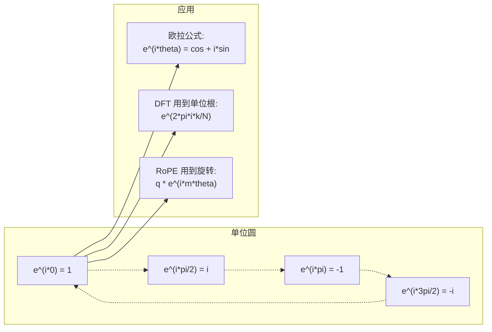

# 面向 AI 的复数（Complex Numbers for AI）

> 译注：本文译自同目录 [`en.md`](./en.md)。术语遵循仓根 [TRANSLATION_GUIDE.md](../../../../TRANSLATION_GUIDE.md)。

> -1 的平方根并不虚幻。它是旋转、频率以及半个信号处理领域的钥匙。

**Type:** Learn
**Language:** Python
**Prerequisites:** Phase 1, Lessons 01-04 (linear algebra, calculus)
**Time:** ~60 minutes

## 学习目标（Learning Objectives）

- 在直角坐标和极坐标两种形式下做复数运算（加、乘、除、共轭）
- 用欧拉公式（Euler's formula）在复指数和三角函数之间互转
- 用单位根（complex roots of unity）实现离散傅里叶变换（DFT）
- 解释复数旋转如何支撑 transformer 中的 RoPE 和正弦位置编码

## 问题（The Problem）

你打开一篇关于 Fourier 变换的论文，里面到处都是 `i`。你看 transformer 的位置编码，又看到不同频率的 `sin` 和 `cos`——它们其实是复指数的实部和虚部。你读量子计算的资料，发现一切都用复向量空间表达。

复数看上去很抽象。一个建立在 -1 的平方根上的数系，仿佛只是一种数学把戏。但它不是把戏。它就是旋转和振荡的天然语言。每当某个东西在转动、振动、震荡，复数就是合适的工具。

不懂复数，就读不懂离散傅里叶变换（DFT），读不懂 FFT，读不懂现代语言模型里 RoPE（Rotary Position Embedding）是怎么运作的，也搞不明白为什么原版 Transformer 论文里的正弦位置编码要用那些频率。

这一课从零搭起复数运算，把它和几何连起来，并且明确告诉你复数在机器学习里到底出现在哪。

## 概念（The Concept）

### 什么是复数？（What is a complex number?）

一个复数有两部分：实部和虚部。

```
z = a + bi

where:
  a is the real part
  b is the imaginary part
  i is the imaginary unit, defined by i^2 = -1
```

就这么简单。你把数轴扩展成一个平面：实数在一根轴上，虚数在另一根轴上。每个复数都是这个平面上的一个点。

### 复数运算（Complex arithmetic）

**加法。** 实部加实部，虚部加虚部。

```
(a + bi) + (c + di) = (a + c) + (b + d)i

Example: (3 + 2i) + (1 + 4i) = 4 + 6i
```

**乘法。** 用分配律展开，再记住 i^2 = -1。

```
(a + bi)(c + di) = ac + adi + bci + bdi^2
                 = ac + adi + bci - bd
                 = (ac - bd) + (ad + bc)i

Example: (3 + 2i)(1 + 4i) = 3 + 12i + 2i + 8i^2
                            = 3 + 14i - 8
                            = -5 + 14i
```

**共轭。** 把虚部翻号。

```
conjugate of (a + bi) = a - bi
```

一个复数与它的共轭相乘永远是实数：

```
(a + bi)(a - bi) = a^2 + b^2
```

**除法。** 把分子分母同时乘以分母的共轭。

```
(a + bi) / (c + di) = (a + bi)(c - di) / (c^2 + d^2)
```

这样分母里的虚部就被消掉了，剩下一个干净的复数。

### 复平面（The complex plane）

复平面把每个复数映射成 2D 的一个点。横轴是实轴，纵轴是虚轴。

```
z = 3 + 2i  corresponds to the point (3, 2)
z = -1 + 0i corresponds to the point (-1, 0) on the real axis
z = 0 + 4i  corresponds to the point (0, 4) on the imaginary axis
```

复数同时是一个点，也是一个从原点出发的向量。这种「点 / 向量」的双重身份，正是复数在几何里好用的根本原因。

### 极坐标形式（Polar form）

平面上的任意一点都可以用「到原点的距离」和「与正实轴的夹角」来描述。

```
z = r * (cos(theta) + i*sin(theta))

where:
  r = |z| = sqrt(a^2 + b^2)     (magnitude, or modulus)
  theta = atan2(b, a)             (phase, or argument)
```

直角坐标 (a + bi) 适合做加法。极坐标 (r, theta) 适合做乘法。

**极坐标下的乘法。** 模相乘，角度相加。

```
z1 = r1 * e^(i*theta1)
z2 = r2 * e^(i*theta2)

z1 * z2 = (r1 * r2) * e^(i*(theta1 + theta2))
```

这就是为什么复数特别适合表示旋转：乘以一个模为 1 的复数，等同于做纯旋转。

### 欧拉公式（Euler's formula）

复指数和三角函数之间的桥梁：

```
e^(i*theta) = cos(theta) + i*sin(theta)
```

这是这一课里最重要的公式。当 theta = pi 时：

```
e^(i*pi) = cos(pi) + i*sin(pi) = -1 + 0i = -1

Therefore: e^(i*pi) + 1 = 0
```

五个最基本的常数（e、i、pi、1、0）被一道公式串起来了。

### 欧拉公式为什么对 ML 很重要（Why Euler's formula matters for ML）

欧拉公式说的是：当 theta 变化时，`e^(i*theta)` 沿着单位圆运行。theta = 0 时在 (1, 0)；theta = pi/2 时在 (0, 1)；theta = pi 时在 (-1, 0)；theta = 3*pi/2 时在 (0, -1)；走完一整圈是 theta = 2*pi。

也就是说，复指数本身**就是**旋转。而旋转在信号处理和 ML 里到处都是。

### 与 2D 旋转的联系（Connection to 2D rotations）

把复数 (x + yi) 乘以 e^(i*theta)，相当于把点 (x, y) 绕原点旋转 theta 角。

```
Rotation via complex multiplication:
  (x + yi) * (cos(theta) + i*sin(theta))
  = (x*cos(theta) - y*sin(theta)) + (x*sin(theta) + y*cos(theta))i

Rotation via matrix multiplication:
  [cos(theta)  -sin(theta)] [x]   [x*cos(theta) - y*sin(theta)]
  [sin(theta)   cos(theta)] [y] = [x*sin(theta) + y*cos(theta)]
```

两者结果完全一致。复数乘法**就是** 2D 旋转。旋转矩阵不过是把复数乘法换成矩阵记号写出来而已。


### 相量与旋转信号（Phasors and rotating signals）

复指数 e^(i*omega*t) 是一个以角频率 omega 沿单位圆旋转的点。t 增大时，这个点就把圆描出来。

这个旋转点的实部是 cos(omega*t)，虚部是 sin(omega*t)。**正弦信号其实是一个旋转复数在轴上的影子。**

```
e^(i*omega*t) = cos(omega*t) + i*sin(omega*t)

Real part:      cos(omega*t)    -- a cosine wave
Imaginary part: sin(omega*t)    -- a sine wave
```

这就是相量（phasor）表示。与其追踪一条扭来扭去的正弦波，不如追踪一根平滑旋转的箭头。相位偏移就是角度偏移；振幅变化就是模长变化；信号叠加就变成了向量加法。

### 单位根（Roots of unity）

N 次单位根是单位圆上等间距分布的 N 个点：

```
w_k = e^(2*pi*i*k/N)    for k = 0, 1, 2, ..., N-1
```

N = 4 时，根是 1、i、-1、-i（四个方向的指南针点）。
N = 8 时，则是这四个方向再加上四条对角线方向。

单位根是离散傅里叶变换（DFT）的基石。DFT 就是把信号按这 N 个等间距频率分量拆开。

### 与 DFT 的联系（Connection to the DFT）

信号 x[0], x[1], ..., x[N-1] 的离散傅里叶变换是：

```
X[k] = sum_{n=0}^{N-1} x[n] * e^(-2*pi*i*k*n/N)
```

每个 X[k] 衡量信号与第 k 个单位根（频率为 k 的复正弦）之间的相关程度。DFT 把信号拆成 N 个旋转相量，并告诉你每一个的振幅和相位。

### i 并不虚幻（Why i is not imaginary）

「imaginary（虚的）」这个词只是历史误会。Descartes 当年用它来贬低这种数。但 i 一点也不比当初被人嫌弃的负数更虚——负数回答的是「3 减去什么得 5？」，虚数单位回答的是「什么数的平方等于 -1？」

更有用的视角是：**i 就是一个 90 度旋转算子。** 把一个实数乘以 i 一次，它就从实轴转 90 度跳到虚轴上；再乘一次（i^2），又转 90 度——现在指向负实轴方向。这就是 i^2 = -1 的来由。这一点都不神秘，无非是两次四分之一圈拼成的半圈而已。

正因如此，工程里到处都是复数。任何会旋转的东西——电磁波、量子态、信号振荡、位置编码——都自然适合用复数描述。

### 复指数 vs 三角函数（Complex exponentials vs trigonometric functions）

在欧拉公式之前，工程师把信号写成 A*cos(omega*t + phi)——振幅 A，频率 omega，相位 phi。这能用，但运算很折磨。两个不同相位的余弦相加，得搬出一堆三角恒等式。

换成复指数，同样的信号就是 A*e^(i*(omega*t + phi))。两个信号相加，就是两个复数相加。乘法（调制）就是模相乘、角度相加。相位偏移变成了角度加法；频率偏移变成了乘以一个相量。

整个信号处理领域都改用了复指数记号，因为数学干净得多。「真实信号」永远只是复数表示的实部，虚部作为账本带着走，让所有代数恰到好处地自洽。

### 与 transformer 的联系（Connection to transformers）

**正弦位置编码**（原版 Transformer 论文）：

```
PE(pos, 2i) = sin(pos / 10000^(2i/d))
PE(pos, 2i+1) = cos(pos / 10000^(2i/d))
```

这些 sin / cos 配对，正是不同频率下复指数的实部和虚部。每个频率提供一种不同「分辨率」来编码位置：低频变化慢（粗粒度位置），高频变化快（细粒度位置）。组合在一起，每个位置都获得了独一无二的频率指纹。

**RoPE（Rotary Position Embedding）** 把这件事推得更彻底。它显式地把 query 和 key 向量乘以复数旋转矩阵。两个 token 之间的相对位置变成了一个旋转角。attention 用旋转后的向量来计算，于是模型通过复数乘法对相对位置敏感。

| Operation | Algebraic Form | Geometric Meaning |
|-----------|---------------|-------------------|
| Addition | (a+c) + (b+d)i | 平面上的向量加法 |
| Multiplication | (ac-bd) + (ad+bc)i | 旋转 + 缩放 |
| Conjugate | a - bi | 关于实轴的镜像 |
| Magnitude | sqrt(a^2 + b^2) | 到原点的距离 |
| Phase | atan2(b, a) | 与正实轴的夹角 |
| Division | multiply by conjugate | 反向旋转 + 反向缩放 |
| Power | r^n * e^(i*n*theta) | 旋转 n 次，按 r^n 缩放 |



## 动手实现（Build It）

### Step 1: Complex 类（Complex class）

写一个 Complex 类，支持四则运算、模、相位以及直角 / 极坐标互转。

```python
import math

class Complex:
    def __init__(self, real, imag=0.0):
        self.real = real
        self.imag = imag

    def __add__(self, other):
        return Complex(self.real + other.real, self.imag + other.imag)

    def __mul__(self, other):
        r = self.real * other.real - self.imag * other.imag
        i = self.real * other.imag + self.imag * other.real
        return Complex(r, i)

    def __truediv__(self, other):
        denom = other.real ** 2 + other.imag ** 2
        r = (self.real * other.real + self.imag * other.imag) / denom
        i = (self.imag * other.real - self.real * other.imag) / denom
        return Complex(r, i)

    def magnitude(self):
        return math.sqrt(self.real ** 2 + self.imag ** 2)

    def phase(self):
        return math.atan2(self.imag, self.real)

    def conjugate(self):
        return Complex(self.real, -self.imag)
```

### Step 2: 极坐标转换与欧拉公式（Polar conversion and Euler's formula）

```python
def to_polar(z):
    return z.magnitude(), z.phase()

def from_polar(r, theta):
    return Complex(r * math.cos(theta), r * math.sin(theta))

def euler(theta):
    return Complex(math.cos(theta), math.sin(theta))
```

验证：`euler(theta).magnitude()` 永远应该是 1.0；`euler(0)` 应当给出 (1, 0)；`euler(pi)` 应当给出 (-1, 0)。

### Step 3: 旋转（Rotation）

把点 (x, y) 旋转 theta 角，只需要一次复数乘法：

```python
point = Complex(3, 4)
rotated = point * euler(math.pi / 4)
```

模长不变，只有角度在变。

### Step 4: 用复数运算实现 DFT（DFT from complex arithmetic）

```python
def dft(signal):
    N = len(signal)
    result = []
    for k in range(N):
        total = Complex(0, 0)
        for n in range(N):
            angle = -2 * math.pi * k * n / N
            total = total + Complex(signal[n], 0) * euler(angle)
        result.append(total)
    return result
```

这是 O(N^2) 的 DFT。每个输出 X[k] 都是信号样本与单位根相乘后的累加。

### Step 5: 反 DFT（Inverse DFT）

反 DFT 把频谱重建回原始信号。相比正向 DFT，唯一的改动是：指数符号翻一下，再除以 N。

```python
def idft(spectrum):
    N = len(spectrum)
    result = []
    for n in range(N):
        total = Complex(0, 0)
        for k in range(N):
            angle = 2 * math.pi * k * n / N
            total = total + spectrum[k] * euler(angle)
        result.append(Complex(total.real / N, total.imag / N))
    return result
```

这样能完美重建。先 DFT 再 IDFT，你能在机器精度内拿回原始信号，没有信息丢失。

### Step 6: 单位根（Roots of unity）

```python
def roots_of_unity(N):
    return [euler(2 * math.pi * k / N) for k in range(N)]
```

验证两个性质：

- 每个根的模都正好是 1。
- 所有 N 个根的和为零（由对称性彼此抵消）。

正是这两个性质让 DFT 可逆。单位根在频域里构成了一组正交基。

## 用起来（Use It）

Python 内置支持复数，字面量 `j` 表示虚数单位。

```python
z = 3 + 2j
w = 1 + 4j

print(z + w)
print(z * w)
print(abs(z))

import cmath
print(cmath.phase(z))
print(cmath.exp(1j * cmath.pi))
```

对于数组，numpy 原生支持复数：

```python
import numpy as np

z = np.array([1+2j, 3+4j, 5+6j])
print(np.abs(z))
print(np.angle(z))
print(np.conj(z))
print(np.real(z))
print(np.imag(z))

signal = np.sin(2 * np.pi * 5 * np.linspace(0, 1, 128))
spectrum = np.fft.fft(signal)
freqs = np.fft.fftfreq(128, d=1/128)
```

## 上线部署（Ship It）

运行 `code/complex_numbers.py`，会生成 `outputs/skill-complex-arithmetic.md`。

## 练习（Exercises）

1. **手算复数运算。** 计算 (2 + 3i) * (4 - i)，再用代码核对。然后计算 (5 + 2i) / (1 - 3i)。把两个结果画到复平面上，确认乘法对第一个数确实做了旋转 + 缩放。

2. **旋转序列。** 从点 (1, 0) 出发，连乘 12 次 e^(i*pi/6)。验证你在第 12 次后又回到 (1, 0)。把每一步的坐标打出来，确认它们描出一个正 12 边形。

3. **已知信号的 DFT。** 构造一个信号：在 32 个采样点上取 sin(2*pi*3*t) + 0.5*sin(2*pi*7*t)。跑一次你的 DFT。验证幅度谱在频率 3 和 7 处出现峰值，且 7 处的峰高大约是 3 处的一半。

4. **单位根可视化。** 计算 8 次单位根，验证它们的和为零；再验证任意一个根乘以原根 e^(2*pi*i/8) 后正好得到下一个根。

5. **旋转矩阵的等价性。** 取 10 个随机角度和 10 个随机点，验证复数乘法和 2x2 旋转矩阵 - 向量乘法给出一致结果。打印最大数值差。

## 关键术语（Key Terms）

| Term | What it means |
|------|---------------|
| Complex number（复数） | 形如 a + bi 的数，a 是实部，b 是虚部，i^2 = -1 |
| Imaginary unit（虚数单位） | 数 i，定义为 i^2 = -1。它并非哲学意义上的「虚」——它是个旋转算子 |
| Complex plane（复平面） | x 轴是实轴、y 轴是虚轴的 2D 平面，也叫 Argand 平面 |
| Magnitude / modulus（模 / 绝对值） | 到原点的距离 sqrt(a^2 + b^2)，记作 \|z\| |
| Phase / argument（相位 / 幅角） | 与正实轴的夹角 atan2(b, a)，记作 arg(z) |
| Conjugate（共轭） | 关于实轴的镜像：a + bi 的共轭是 a - bi |
| Polar form（极坐标形式） | 把 z 写成 r * e^(i*theta) 而不是 a + bi，使乘法更简单 |
| Euler's formula（欧拉公式） | e^(i*theta) = cos(theta) + i*sin(theta)，连接指数与三角函数 |
| Phasor（相量） | 旋转的复数 e^(i*omega*t)，代表一个正弦信号 |
| Roots of unity（单位根） | N 个复数 e^(2*pi*i*k/N)（k = 0..N-1），单位圆上等间距的 N 个点 |
| DFT（离散傅里叶变换） | 用单位根把信号分解成复正弦分量 |
| RoPE | Rotary Position Embedding（旋转位置编码），用复数乘法在 transformer attention 里编码相对位置 |

## 延伸阅读（Further Reading）

- [Visual Introduction to Euler's Formula](https://betterexplained.com/articles/intuitive-understanding-of-eulers-formula/) - 不靠繁重记号，建立几何直觉
- [Su et al.: RoFormer (2021)](https://arxiv.org/abs/2104.09864) - 用复数旋转引入 RoPE 的论文
- [Vaswani et al.: Attention Is All You Need (2017)](https://arxiv.org/abs/1706.03762) - 原版 Transformer 论文，提出正弦位置编码
- [3Blue1Brown: Euler's formula with introductory group theory](https://www.youtube.com/watch?v=mvmuCPvRoWQ) - 可视化解释为什么 e^(i*pi) = -1
- [Needham: Visual Complex Analysis](https://global.oup.com/academic/product/visual-complex-analysis-9780198534464) - 复数最好的视觉化教材，几何洞见满满
- [Strang: Introduction to Linear Algebra, Ch. 10](https://math.mit.edu/~gs/linearalgebra/) - 在线性代数与特征值的语境下讲复数
