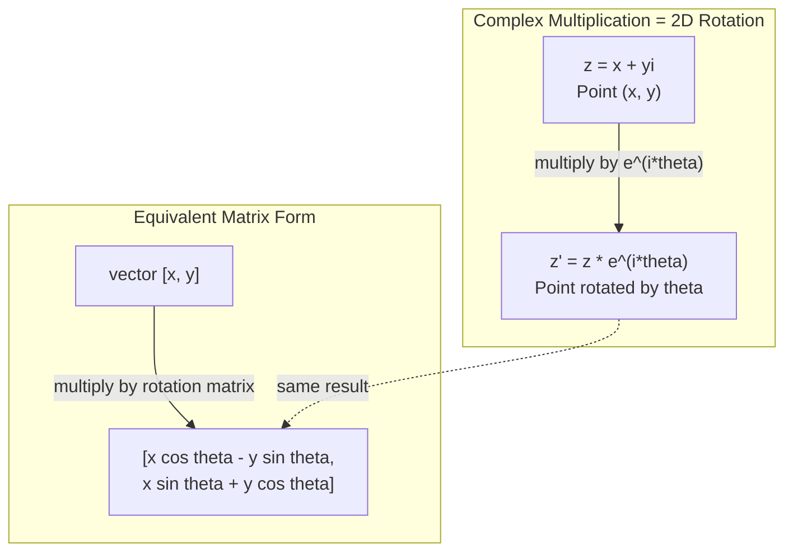
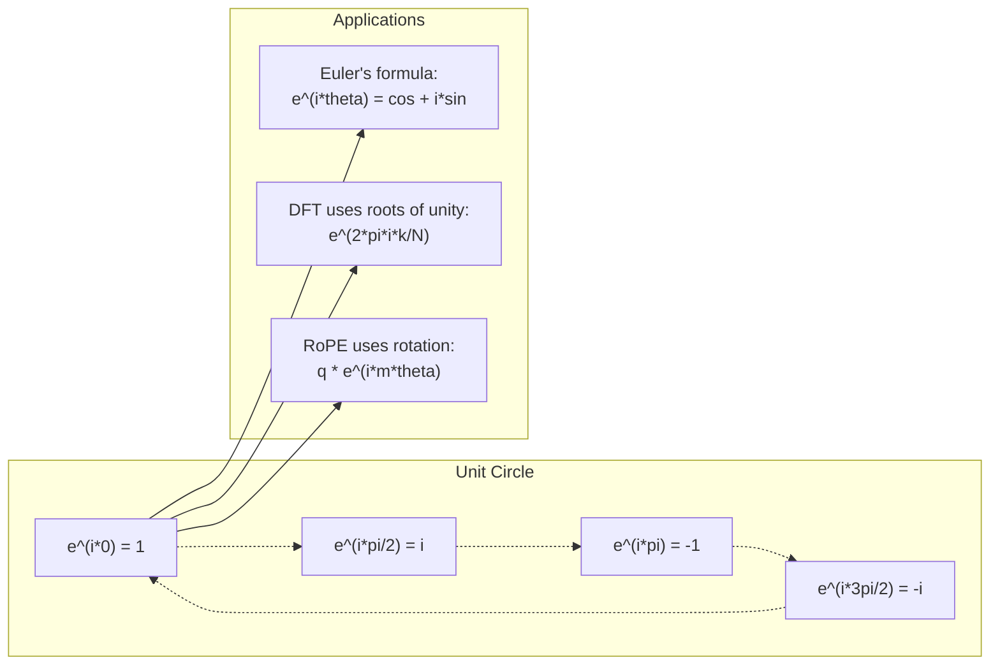

# AI 中的複數

> -1 的平方根並不虛幻。它是旋轉、頻率，以及半個訊號處理領域的關鍵。

**類型：** 學習
**程式語言：** Python
**先修單元：** 階段 1 · 單元 01-04（線性代數、微積分）
**時間：** 約 60 分鐘

## 學習目標

- 用直角座標與極座標兩種形式做複數運算（加、乘、除、共軛）
- 用歐拉公式在複指數與三角函數之間轉換
- 用複數的單位根實作離散傅立葉轉換
- 說明複數旋轉如何支撐 Transformer 裡的 RoPE 與正弦位置編碼

## 問題所在

你打開一篇講傅立葉轉換的論文，滿滿都是 `i`。你去看 Transformer 的位置編碼，看到不同頻率的 `sin` 與 `cos`——那正是複指數的實部與虛部。你讀量子計算，發現所有東西都用複向量空間表示。

複數看起來很抽象。一個建立在 -1 的平方根之上的數系，感覺像某種數學花招。但它不是花招，它是旋轉與振盪的天然語言。每當某個東西在轉、在震、在擺盪，複數就是對的工具。

不理解複數，你就無法理解離散傅立葉轉換，無法理解 FFT，無法理解 RoPE（Rotary Position Embedding）在現代語言模型裡是怎麼運作的，也無法理解為什麼原始 Transformer 論文的正弦位置編碼要用那些頻率。

這一課從零建構複數運算，把它連回幾何，並精確指出複數在機器學習裡出現在哪些地方。

## 核心概念

### 什麼是複數？

一個複數有兩個部分：實部與虛部。

```
z = a + bi

where:
  a is the real part
  b is the imaginary part
  i is the imaginary unit, defined by i^2 = -1
```

就這樣。你把數線擴展成一個平面。實數落在一個軸上，虛數落在另一個軸上。每個複數都是這個平面上的一個點。

### 複數運算

**加法。** 實部相加，虛部相加。

```
(a + bi) + (c + di) = (a + c) + (b + d)i

Example: (3 + 2i) + (1 + 4i) = 4 + 6i
```

**乘法。** 用分配律，並記得 i^2 = -1。

```
(a + bi)(c + di) = ac + adi + bci + bdi^2
                 = ac + adi + bci - bd
                 = (ac - bd) + (ad + bc)i

Example: (3 + 2i)(1 + 4i) = 3 + 12i + 2i + 8i^2
                            = 3 + 14i - 8
                            = -5 + 14i
```

**共軛。** 把虛部的符號反過來。

```
conjugate of (a + bi) = a - bi
```

一個複數與它的共軛相乘，結果永遠是實數：

```
(a + bi)(a - bi) = a^2 + b^2
```

**除法。** 分子與分母同乘分母的共軛。

```
(a + bi) / (c + di) = (a + bi)(c - di) / (c^2 + d^2)
```

這會消掉分母裡的虛部，給你一個乾淨的複數。

### 複平面

複平面把每個複數對應到一個 2D 點。水平軸是實軸，垂直軸是虛軸。

```
z = 3 + 2i  corresponds to the point (3, 2)
z = -1 + 0i corresponds to the point (-1, 0) on the real axis
z = 0 + 4i  corresponds to the point (0, 4) on the imaginary axis
```

一個複數同時是一個點，也是一個從原點出發的向量。正是這種雙重解讀，讓複數在幾何上如此好用。

### 極座標形式

平面上任何一點，都能用它到原點的距離、以及它與正實軸的夾角來描述。

```
z = r * (cos(theta) + i*sin(theta))

where:
  r = |z| = sqrt(a^2 + b^2)     (magnitude, or modulus)
  theta = atan2(b, a)             (phase, or argument)
```

直角座標形式（a + bi）適合做加法，極座標形式（r, theta）適合做乘法。

**極座標形式下的乘法。** 模相乘，角度相加。

```
z1 = r1 * e^(i*theta1)
z2 = r2 * e^(i*theta2)

z1 * z2 = (r1 * r2) * e^(i*(theta1 + theta2))
```

這就是複數為何完美適合表示旋轉的原因。乘上一個模為 1 的複數，就是一次純粹的旋轉。

### 歐拉公式

連接複指數與三角學的橋樑：

```
e^(i*theta) = cos(theta) + i*sin(theta)
```

這是這一課最重要的公式。當 theta = pi：

```
e^(i*pi) = cos(pi) + i*sin(pi) = -1 + 0i = -1

Therefore: e^(i*pi) + 1 = 0
```

五個基本常數（e、i、pi、1、0）被連在同一條方程式裡。

### 歐拉公式為什麼對 ML 重要

歐拉公式說的是，當 theta 變化時，`e^(i*theta)` 會描出單位圓。theta = 0 時你在 (1, 0)，theta = pi/2 時你在 (0, 1)，theta = pi 時你在 (-1, 0)，theta = 3*pi/2 時你在 (0, -1)。轉滿一圈是 theta = 2*pi。

這意味著複指數「就是」旋轉。而旋轉在訊號處理與 ML 裡無處不在。

### 與 2D 旋轉的關聯

把複數 (x + yi) 乘上 e^(i*theta)，就是把點 (x, y) 繞原點旋轉 theta 角。

```
Rotation via complex multiplication:
  (x + yi) * (cos(theta) + i*sin(theta))
  = (x*cos(theta) - y*sin(theta)) + (x*sin(theta) + y*cos(theta))i

Rotation via matrix multiplication:
  [cos(theta)  -sin(theta)] [x]   [x*cos(theta) - y*sin(theta)]
  [sin(theta)   cos(theta)] [y] = [x*sin(theta) + y*cos(theta)]
```

兩者結果完全相同。複數乘法「就是」2D 旋轉。旋轉矩陣只是把複數乘法用矩陣記法寫出來而已。


```mermaid
graph TD
    subgraph "Complex Multiplication = 2D Rotation"
        A["z = x + yi<br/>Point (x, y)"] -->|"multiply by e^(i*theta)"| B["z' = z * e^(i*theta)<br/>Point rotated by theta"]
    end
    subgraph "Equivalent Matrix Form"
        C["vector [x, y]"] -->|"multiply by rotation matrix"| D["[x cos theta - y sin theta,<br/> x sin theta + y cos theta]"]
    end
    B -.->|"same result"| D
```

### 相量與旋轉訊號

複指數 e^(i*omega*t) 是一個以角頻率 omega 繞著單位圓旋轉的點。隨著 t 增加，這個點就描出整個圓。

這個旋轉點的實部是 cos(omega*t)，虛部是 sin(omega*t)。一個正弦訊號，就是一個旋轉複數的影子。

```
e^(i*omega*t) = cos(omega*t) + i*sin(omega*t)

Real part:      cos(omega*t)    -- a cosine wave
Imaginary part: sin(omega*t)    -- a sine wave
```

這就是相量表示法。你不必去追一條扭來扭去的正弦波，只要追一支平順旋轉的箭頭。相位平移變成角度偏移，振幅變化變成模的變化，訊號相加變成向量相加。

### 單位根

N 次單位根是單位圓上 N 個等間距的點：

```
w_k = e^(2*pi*i*k/N)    for k = 0, 1, 2, ..., N-1
```

N = 4 時，這些根是：1、i、-1、-i（四個羅盤方位）。
N = 8 時，你會得到那四個羅盤方位，再加上四條對角線方向。

單位根是離散傅立葉轉換的基礎。DFT 把一個訊號拆解成這 N 個等間距頻率上的成分。

### 與 DFT 的關聯

訊號 x[0], x[1], ..., x[N-1] 的離散傅立葉轉換是：

```
X[k] = sum_{n=0}^{N-1} x[n] * e^(-2*pi*i*k*n/N)
```

每個 X[k] 衡量的是訊號與第 k 個單位根——也就是頻率為 k 的複正弦——相關性有多強。DFT 把一個訊號拆成 N 個旋轉相量，並告訴你每一個的振幅與相位。

### 為什麼 i 並不虛幻

「虛數」這個詞是歷史上的意外。笛卡兒當初是帶著貶意用它的。但 i 並不比負數更虛幻——當年人們也一樣拒絕接受負數。負數回答的是「3 要減掉多少才等於 5 那樣的情況？」，而虛數單位回答的是「什麼東西平方之後等於 -1？」

更有用的看法是：i 是一個 90 度旋轉運算子。把一個實數乘上 i 一次，你就旋轉 90 度到虛軸上。再乘一次 i（i^2），你又轉了 90 度——現在你指向負實數方向。這就是 i^2 = -1 的原因。它並不神秘，它就是兩個四分之一圈組成的半圈。

這就是為什麼複數在工程領域到處都是。任何會旋轉的東西——電磁波、量子態、訊號振盪、位置編碼——用複數描述都最自然。

### 複指數 vs 三角函數

在歐拉公式之前，工程師把訊號寫成 A*cos(omega*t + phi)——振幅 A、頻率 omega、相位 phi。這樣寫可以用，但運算很痛苦。把兩個相位不同的餘弦相加，得動用三角恆等式。

用複指數的話，同一個訊號就是 A*e^(i*(omega*t + phi))。兩個訊號相加只是兩個複數相加，相乘（調變）只是模相乘、角度相加。相位平移變成角度相加，頻率平移變成乘上相量。

整個訊號處理領域之所以轉向複指數記法，就是因為數學更乾淨。「實際的訊號」永遠只是複數表示的實部；虛部一路帶著走，充當記帳用，讓所有代數自然而然地成立。

### 與 Transformer 的關聯

**正弦位置編碼**（原始 Transformer 論文）：

```
PE(pos, 2i) = sin(pos / 10000^(2i/d))
PE(pos, 2i+1) = cos(pos / 10000^(2i/d))
```

這些 sin 與 cos 成對出現，正是不同頻率複指數的實部與虛部。每個頻率為編碼位置提供不同的「解析度」。低頻變化慢（粗略位置），高頻變化快（精細位置）。合在一起，就給每個位置一組獨一無二的頻率指紋。

**RoPE（Rotary Position Embedding）** 把這件事推得更遠。它明確地把 query 與 key 向量乘上複數旋轉矩陣，兩個詞元之間的相對位置就變成一個旋轉角度。注意力機制用這些旋轉過的向量來計算，於是模型透過複數乘法對相對位置變得敏感。

| 運算 | 代數形式 | 幾何意義 |
|-----------|---------------|-------------------|
| 加法 | (a+c) + (b+d)i | 平面上的向量相加 |
| 乘法 | (ac-bd) + (ad+bc)i | 旋轉並縮放 |
| 共軛 | a - bi | 對實軸鏡射 |
| 模 | sqrt(a^2 + b^2) | 到原點的距離 |
| 相位 | atan2(b, a) | 與正實軸的夾角 |
| 除法 | 乘上共軛 | 反向旋轉並反向縮放 |
| 次方 | r^n * e^(i*n*theta) | 旋轉 n 次，縮放 r^n 倍 |


```mermaid
graph LR
    subgraph "Unit Circle"
        direction TB
        U1["e^(i*0) = 1"] -.-> U2["e^(i*pi/2) = i"]
        U2 -.-> U3["e^(i*pi) = -1"]
        U3 -.-> U4["e^(i*3pi/2) = -i"]
        U4 -.-> U1
    end
    subgraph "Applications"
        A1["Euler's formula:<br/>e^(i*theta) = cos + i*sin"]
        A2["DFT uses roots of unity:<br/>e^(2*pi*i*k/N)"]
        A3["RoPE uses rotation:<br/>q * e^(i*m*theta)"]
    end
    U1 --> A1
    U1 --> A2
    U1 --> A3
```

```figure
roots-of-unity
```

## 動手實作

### 步驟 1：Complex 類別

寫一個 Complex 類別，支援四則運算、模、相位，以及直角座標與極座標形式之間的轉換。

```python
import math

class Complex:
    def __init__(self, real, imag=0.0):
        self.real = real
        self.imag = imag

    def __add__(self, other):
        return Complex(self.real + other.real, self.imag + other.imag)

    def __mul__(self, other):
        r = self.real * other.real - self.imag * other.imag
        i = self.real * other.imag + self.imag * other.real
        return Complex(r, i)

    def __truediv__(self, other):
        denom = other.real ** 2 + other.imag ** 2
        r = (self.real * other.real + self.imag * other.imag) / denom
        i = (self.imag * other.real - self.real * other.imag) / denom
        return Complex(r, i)

    def magnitude(self):
        return math.sqrt(self.real ** 2 + self.imag ** 2)

    def phase(self):
        return math.atan2(self.imag, self.real)

    def conjugate(self):
        return Complex(self.real, -self.imag)
```

### 步驟 2：極座標轉換與歐拉公式

```python
def to_polar(z):
    return z.magnitude(), z.phase()

def from_polar(r, theta):
    return Complex(r * math.cos(theta), r * math.sin(theta))

def euler(theta):
    return Complex(math.cos(theta), math.sin(theta))
```

驗證：`euler(theta).magnitude()` 應該永遠是 1.0。`euler(0)` 應該給出 (1, 0)。`euler(pi)` 應該給出 (-1, 0)。

### 步驟 3：旋轉

把點 (x, y) 旋轉 theta 角，就是一次複數乘法：

```python
point = Complex(3, 4)
rotated = point * euler(math.pi / 4)
```

模不變，只有角度改變。

### 步驟 4：用複數運算做 DFT

```python
def dft(signal):
    N = len(signal)
    result = []
    for k in range(N):
        total = Complex(0, 0)
        for n in range(N):
            angle = -2 * math.pi * k * n / N
            total = total + Complex(signal[n], 0) * euler(angle)
        result.append(total)
    return result
```

這是 O(N^2) 的 DFT。每個輸出 X[k] 都是訊號取樣值乘上單位根之後的總和。

### 步驟 5：反向 DFT

反向 DFT 從頻譜重建出原始訊號。和正向 DFT 的差別只有兩處：把指數的符號反過來，然後除以 N。

```python
def idft(spectrum):
    N = len(spectrum)
    result = []
    for n in range(N):
        total = Complex(0, 0)
        for k in range(N):
            angle = 2 * math.pi * k * n / N
            total = total + spectrum[k] * euler(angle)
        result.append(Complex(total.real / N, total.imag / N))
    return result
```

這會給你完美的重建。先做 DFT、再做 IDFT，你會在機器精度內拿回原始訊號。沒有任何資訊遺失。

### 步驟 6：單位根

```python
def roots_of_unity(N):
    return [euler(2 * math.pi * k / N) for k in range(N)]
```

驗證兩個性質：

- 每個根的模都恰好是 1。
- 全部 N 個根相加等於零（因為對稱而互相抵消）。

正是這些性質讓 DFT 可逆。單位根構成了頻域的一組正交基底。

## 框架應用

Python 內建支援複數。字面值 `j` 表示虛數單位。

```python
z = 3 + 2j
w = 1 + 4j

print(z + w)
print(z * w)
print(abs(z))

import cmath
print(cmath.phase(z))
print(cmath.exp(1j * cmath.pi))
```

對於陣列，numpy 原生支援複數：

```python
import numpy as np

z = np.array([1+2j, 3+4j, 5+6j])
print(np.abs(z))
print(np.angle(z))
print(np.conj(z))
print(np.real(z))
print(np.imag(z))

signal = np.sin(2 * np.pi * 5 * np.linspace(0, 1, 128))
spectrum = np.fft.fft(signal)
freqs = np.fft.fftfreq(128, d=1/128)
```

## 產出交付

執行 `code/complex_numbers.py` 產生 `outputs/skill-complex-arithmetic.md`。

## 練習

1. **手算複數運算。** 算出 (2 + 3i) * (4 - i)，並用程式碼驗證。接著算 (5 + 2i) / (1 - 3i)。把兩個結果畫在複平面上，確認乘法確實把第一個數旋轉並縮放了。

2. **旋轉序列。** 從點 (1, 0) 開始，連續乘上 e^(i*pi/6) 十二次。驗證 12 次乘法之後你回到了 (1, 0)。印出每一步的座標，確認它們描出一個正十二邊形。

3. **已知訊號的 DFT。** 建立一個訊號，它是 sin(2*pi*3*t) 與 0.5*sin(2*pi*7*t) 的和，取樣 32 個點。跑你的 DFT。驗證振幅頻譜在頻率 3 與 7 處有峰值，且 7 處的峰高是 3 處的一半。

4. **單位根視覺化。** 算出 8 次單位根。驗證它們相加為零。驗證任一個根乘上原根 e^(2*pi*i/8) 就會得到下一個根。

5. **旋轉矩陣等價性。** 取 10 個隨機角度與 10 個隨機點，驗證複數乘法與 2x2 旋轉矩陣的矩陣─向量乘法給出相同結果。印出最大的數值差異。

## 關鍵術語

| 術語 | 實際上是什麼 |
|------|---------------|
| 複數 | 形如 a + bi 的數，其中 a 是實部、b 是虛部，且 i^2 = -1 |
| 虛數單位 | 數 i，由 i^2 = -1 定義。它並非哲學意義上的虛幻——它是一個旋轉運算子 |
| 複平面 | x 軸為實數、y 軸為虛數的 2D 平面。也稱作阿岡平面（Argand plane） |
| 模（絕對值） | 到原點的距離：sqrt(a^2 + b^2)。寫作 \|z\| |
| 相位（輻角） | 與正實軸的夾角：atan2(b, a)。寫作 arg(z) |
| 共軛 | 對實軸的鏡像：a + bi 的共軛是 a - bi |
| 極座標形式 | 把 z 表示成 r * e^(i*theta) 而非 a + bi。讓乘法變簡單 |
| 歐拉公式 | e^(i*theta) = cos(theta) + i*sin(theta)。把指數與三角學連起來 |
| 相量 | 一個旋轉的複數 e^(i*omega*t)，用來表示一個正弦訊號 |
| 單位根 | N 個複數 e^(2*pi*i*k/N)，k 從 0 到 N-1。單位圓上 N 個等間距的點 |
| DFT | 離散傅立葉轉換。用單位根把訊號拆解成複正弦成分 |
| RoPE | Rotary Position Embedding。用複數乘法在 Transformer 注意力機制中編碼相對位置 |

## 延伸閱讀

- [Visual Introduction to Euler's Formula](https://betterexplained.com/articles/intuitive-understanding-of-eulers-formula/) —— 不靠繁重記法就能建立幾何直覺
- [Su et al.: RoFormer (2021)](https://arxiv.org/abs/2104.09864) —— 提出用複數旋轉做 Rotary Position Embedding 的論文
- [Vaswani et al.: Attention Is All You Need (2017)](https://arxiv.org/abs/1706.03762) —— 原始 Transformer 論文，內含正弦位置編碼
- [3Blue1Brown: Euler's formula with introductory group theory](https://www.youtube.com/watch?v=mvmuCPvRoWQ) —— 用視覺解釋為什麼 e^(i*pi) = -1
- [Needham: Visual Complex Analysis](https://global.oup.com/academic/product/visual-complex-analysis-9780198534464) —— 對複數最好的視覺化處理，滿是幾何洞見
- [Strang: Introduction to Linear Algebra, Ch. 10](https://math.mit.edu/~gs/linearalgebra/) —— 從線性代數與特徵值的脈絡看複數
