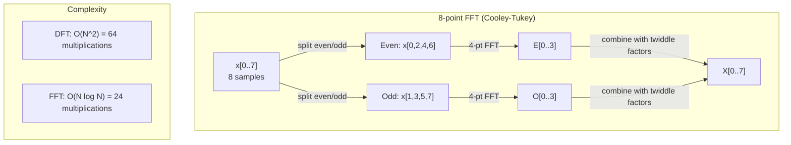
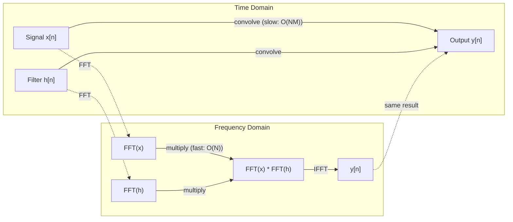

# Fourier Dönüşümü

> Her sinyal sinüs dalgalarının toplamıdır. Fourier dönüşümü size hangilerinin olduğunu söyler.

**Tür:** Yapım
**Dil:** Python
**Önkoşullar:** Aşama 1, Dersler 01-04, 19 (karmaşık sayılar)
**Süre:** ~90 dakika

## Öğrenme Hedefleri

- DFT'yi sıfırdan uygulayın ve O(N log N) Cooley-Tukey FFT'ye göre doğrulayın
- Frekans katsayılarını yorumlayın: bir sinyalden genlik, faz ve güç spektrumunu çıkarın
- FFT çarpımı yoluyla evrişimi gerçekleştirmek için evrişim teoremini uygulayın
- Fourier frekans ayrıştırmasını transformer konumsal kodlamalara ve CNN evrişim katmanlarına bağlayın

## Sorun

Ses kaydı, zaman içinde yapılan bir dizi basınç ölçümüdür. Hisse senedi fiyatı, günlere göre oluşan bir değerler dizisidir. Görüntü, uzaydaki piksel yoğunluklarının bir ızgarasıdır. Bunların hepsi zaman alanındaki (veya uzay alanındaki) verilerdir. Bazı indekslerde değerlerin değiştiğini görüyorsunuz.

Ancak zaman alanında pek çok model görünmez. Bu ses sinyali saf bir ton mu yoksa bir akor mu? Bu hisse senedi fiyatının haftalık bir döngüsü var mı? Bu görüntünün tekrarlanan bir dokusu var mı? Bu sorular frekans içeriğiyle ilgilidir ve zaman alanı bunu gizler.

Fourier dönüşümü, verileri zaman alanından frekans alanına dönüştürür. Bir sinyali alır ve onu farklı frekanslardaki sinüs dalgalarına ayrıştırır. Her sinüs dalgasının bir genliği (ne kadar güçlü olduğu) ve bir fazı (başladığı yer) vardır. Fourier dönüşümü size her ikisini de anlatır.

Bu makine öğrenimi için önemlidir çünkü frekans alanı düşüncesi her yerde ortaya çıkar. Evrişimli neural network'ler, frekans alanında çarpma olan evrişimi gerçekleştirir. Transformer konumsal kodlamalar konumu temsil etmek için frekans ayrıştırmasını kullanır. Ses modelleri (konuşma tanıma, müzik oluşturma), sesin frekans temsilleri olan spektrogramlar üzerinde çalışır. Zaman serisi modelleri periyodik kalıpları arar. Fourier dönüşümünü anlamak size tüm bunlarla çalışacak kelime dağarcığını verir.

## Konsept

### DFT tanımı

N örnek x[0], x[1], ..., x[N-1] verildiğinde, Ayrık Fourier Dönüşümü N frekans katsayısı X[0], X[1], ..., X[N-1] üretir:

```
X[k] = sum_{n=0}^{N-1} x[n] * e^(-2*pi*i*k*n/N)

for k = 0, 1, ..., N-1
```

Her X[k] karmaşık bir sayıdır. Büyüklüğü |X[k]| k frekansının genliğini söyler. Faz açısı (X[k]) size o frekansın faz kaymasını söyler.

Temel görüş: `e^(-2*pi*i*k*n/N)`, k frekansında dönen bir fazördür. DFT, sinyal ile N eşit aralıklı frekansların her biri arasındaki korelasyonu hesaplar. Eğer sinyal k frekansında enerji içeriyorsa korelasyon büyüktür. Değilse sıfıra yakındır.

### Her bir katsayı ne anlama gelir?

**X[0]: DC bileşeni.** Bu, tüm örneklerin toplamıdır; ortalamayla orantılıdır. Sinyalin sabit (sıfır frekans) ofsetini temsil eder.

```
X[0] = sum_{n=0}^{N-1} x[n] * e^0 = sum of all samples
```

**1 <= k <= N/2 için X[k]: pozitif frekanslar.** X[k], N örnek başına k döngü frekansını temsil eder. Daha yüksek k, daha yüksek frekans (daha hızlı salınım) anlamına gelir.

**X[N/2]: Nyquist frekansı.** N örnekle temsil edebileceğiniz en yüksek frekans. Bunun üzerinde, düşük frekanslar gibi görünen yüksek frekanslar gibi takma adlar elde edersiniz.

**N/2 < k < N için X[k]: negatif frekanslar.** Gerçek değerli sinyaller için, X[N-k] = bağ(X[k]). Negatif frekanslar pozitif olanların ayna görüntüleridir. Bu nedenle yararlı bilgiler ilk N/2 + 1 katsayılarındadır.

### Ters DFT

Ters DFT, orijinal sinyali frekans katsayılarından yeniden oluşturur:

```
x[n] = (1/N) * sum_{k=0}^{N-1} X[k] * e^(2*pi*i*k*n/N)

for n = 0, 1, ..., N-1
```

İleri DFT'den tek farkı: üssün işareti pozitiftir (negatif değil) ve 1/N normalizasyon faktörü vardır.

Ters DFT mükemmel bir yeniden yapılanmadır. Hiçbir bilgi kaybolmaz. Zaman alanından frekans alanına ve geriye hatasız olarak gidebilirsiniz. DFT bir temel değişikliğidir; aynı bilgiyi farklı bir koordinat sisteminde yeniden ifade eder.

### FFT: hızlandırmak

Yukarıda tanımlandığı gibi DFT O(N^2)'dir: N çıkış katsayısının her biri için N giriş örneğini toplarsınız. N = 1 milyon için bu 10^12 işlemdir.

Hızlı Fourier Dönüşümü (FFT), aynı sonucu O(N log N) cinsinden hesaplar. N = 1 milyon için bu, bir trilyon yerine yaklaşık 20 milyon işlem demektir. Frekans analizini pratik kılan da budur.

Cooley-Tukey algoritması (en yaygın FFT) böl ve yönet yöntemiyle çalışır:

1. Sinyali çift indeksli ve tek indeksli örneklere bölün.
2. Her yarının DFT'sini yinelemeli olarak hesaplayın.
3. İki yarım boyutlu DFT'yi "bükülme faktörleri" e^(-2*pi*i*k/N) kullanarak birleştirin.

```
X[k] = E[k] + e^(-2*pi*i*k/N) * O[k]          for k = 0, ..., N/2 - 1
X[k + N/2] = E[k] - e^(-2*pi*i*k/N) * O[k]    for k = 0, ..., N/2 - 1

where E = DFT of even-indexed samples
      O = DFT of odd-indexed samples
```

Simetri, her yineleme düzeyinin O(N) işi yaptığı ve log2(N) düzeylerinin olduğu anlamına gelir. Toplam: O(N log N).



FFT, sinyal uzunluğunun 2'nin katı olmasını gerektirir. Uygulamada, sinyaller 2'nin bir sonraki gücüne sıfırla doldurulur.

### Spektral analiz

**Güç spektrumu** |X[k]|^2'dir; her frekans katsayısının büyüklüğünün karesi. Her frekansta ne kadar enerji olduğunu gösterir.

**faz spektrumu** açıdır(X[k]) -- her frekansın faz kayması. Çoğu analiz görevinde güç spektrumunu önemsersiniz ve aşamayı göz ardı edersiniz.

```
Power at frequency k:  P[k] = |X[k]|^2 = X[k].real^2 + X[k].imag^2
Phase at frequency k:  phi[k] = atan2(X[k].imag, X[k].real)
```

### Frekans çözünürlüğü

DFT'nin frekans çözünürlüğü, örnek sayısına (N) ve örnekleme hızına (fs) bağlıdır.

```
Frequency of bin k:      f_k = k * fs / N
Frequency resolution:    delta_f = fs / N
Maximum frequency:       f_max = fs / 2  (Nyquist)
```

Birbirine yakın iki frekansı çözümlemek için daha fazla örneğe ihtiyacınız vardır. Yüksek frekansları yakalamak için daha yüksek örnekleme hızına ihtiyacınız vardır.

### Evrişim teoremi

Bu, sinyal işlemedeki en önemli sonuçlardan biridir ve doğrudan CNN'lerle ilgilidir.

**Zaman alanındaki evrişim, frekans alanındaki noktasal çarpmaya eşittir.**

```
x * h = IFFT(FFT(x) . FFT(h))

where * is convolution and . is element-wise multiplication
```

Bu neden önemlidir:

- N ve M uzunluğundaki iki sinyalin doğrudan evrişimi, O(N*M) işlemlerini alır.
- FFT tabanlı evrişim O(N log N) alır: her ikisini de dönüştürün, çarpın, geri dönüştürün.
- Büyük çekirdekler için FFT evrişimi önemli ölçüde daha hızlıdır.
- Bu tam olarak geniş alıcı alanlara sahip evrişimli katmanlarda olan şeydir.

Not: DFT dairesel evrişimi hesaplar (sinyal sarılır). Doğrusal evrişim için (sarma yok), hesaplamadan önce her iki sinyali de N + M - 1 uzunluğuna kadar sıfırlayın.



### Pencereleme

DFT, sinyalin periyodik olduğunu varsayar; N örneğini sonsuz tekrarlanan bir sinyalin bir periyodu olarak ele alır. Sinyal aynı değerde başlayıp bitmezse, bu durum sınırda bir süreksizlik yaratır ve bu da sahte yüksek frekanslı içerik olarak ortaya çıkar. Buna spektral sızıntı denir.

Pencereleme, DFT'yi hesaplamadan önce sinyali her iki uçta sıfıra indirerek sızıntıyı azaltır.

Ortak pencereler:

| Pencere | Şekil | Ana lob genişliği | Yan lob seviyesi | Kullanım örneği |
|--------|-------|----------------|-----------------|----------|
| Dikdörtgen | Daire (penceresiz) | En Dar | En yüksek (-13 dB) | N örnekte sinyal tam olarak periyodik olduğunda |
| Han | Yükseltilmiş kosinüs | Orta | Düşük (-31 dB) | Genel amaçlı spektral analiz |
| Hamming | Modifiye kosinüs | Orta | Daha düşük (-42 dB) | Ses işleme, konuşma analizi |
| Kara Adam | Üçlü kosinüs | Geniş | Çok düşük (-58 dB) | Yan lobun baskılanması kritik olduğunda |

```
Hann window:    w[n] = 0.5 * (1 - cos(2*pi*n / (N-1)))
Hamming window: w[n] = 0.54 - 0.46 * cos(2*pi*n / (N-1))
```

Pencereyi, DFT'den önceki sinyalle eleman bazında çarparak uygulayın: `X = DFT(x * w)`.

### DFT özellikleri

| Emlak | Zaman Alanı | Frekans Alanı |
|----------|-------------|-----------------|
| Doğrusallık | a*x + b*y | a*X + b*Y |
| Zaman kayması | x[n - k] | X[f] * e^(-2*pi*i*f*k/N) |
| Frekans kayması | x[n] * e^(2*pi*i*f0*n/N) | X[f - f0] |
| Evrişim | x * h | X * H (nokta yönünde) |
| Çarpma | x * h (nokta yönünde) | X * H (dairesel evrişim, 1/N ölçeklendirilmiş) |
| Parseval teoremi | toplam \|x[n]\|^2 | (1/N) * toplam \|X[k]\|^2 |
| Eşlenik simetri (gerçek girdi) | x[n] gerçek | X[k] = bağ(X[N-k]) |

Parseval teoremi toplam enerjinin her iki alanda da aynı olduğunu söylüyor. Enerji dönüşüm yoluyla korunur.

### Konumsal kodlamalara bağlantı

Orijinal Transformer sinüzoidal konumsal kodlamaları kullanır:

```
PE(pos, 2i)   = sin(pos / 10000^(2i/d_model))
PE(pos, 2i+1) = cos(pos / 10000^(2i/d_model))
```

Her boyut çifti (2i, 2i+1) farklı bir frekansta salınır. Frekanslar yüksekten (boyut 0,1) alçaktan (son boyutlar) geometrik olarak aralıklıdır. Bu, Fourier katsayılarının bir sinyali benzersiz şekilde tanımlamasına benzer şekilde, her konuma tüm frekans bantlarında benzersiz bir model verir.

Bunun sağladığı temel özellikler:

- **Benzersizlik:** Aynı kodlamaya sahip iki konum yoktur.
- **Sınırlı değerler:** sin ve cos her zaman [-1, 1] cinsindendir.
- **Göreceli konum:** p+k konumunun kodlanması, p konumundaki kodlamanın doğrusal bir fonksiyonu olarak ifade edilebilir. Model göreceli konumlara katılmayı öğrenebilir.

### CNN'lere bağlantı

Bir evrişim katmanı, öğrenilmiş bir filtreyi (çekirdeği) sinyal veya görüntü boyunca kaydırarak girişe uygular. Matematiksel olarak bu evrişim işlemidir.

Evrişim teoremine göre bu şuna eşdeğerdir:
1. Girişe FFT yapın
2. Çekirdeğe FFT
3. Frekans alanında çarpın
4. Sonuç IFFT

Standart CNN uygulamaları doğrudan evrişimi kullanır (küçük 3x3 çekirdekler için daha hızlı). Ancak büyük çekirdekler veya küresel evrişim için FFT tabanlı yaklaşımlar önemli ölçüde daha hızlıdır. Bazı mimariler (FNet gibi), dikkati tamamen FFT ile değiştirerek, O(N^2) karmaşıklığı yerine O(N log N) ile rekabetçi doğruluk elde eder.

### Spektrogramlar ve Kısa Zamanlı Fourier Dönüşümü

Tek bir FFT size tüm sinyalin frekans içeriğini verir, ancak bu frekansların ne zaman oluştuğu hakkında size hiçbir şey söylemez. Bir cıvıltı (frekansı zamanla artan bir sinyal) ve bir akor (tüm frekansların aynı anda mevcut olması) aynı büyüklük spektrumuna sahip olabilir.

Kısa Zamanlı Fourier Dönüşümü (STFT), sinyalin örtüşen pencerelerindeki FFT'leri hesaplayarak bu sorunu çözer. Sonuç bir spektrogramdır: bir eksende zamanın, diğerinde frekansın yer aldığı 2 boyutlu bir gösterim. Her noktadaki yoğunluk o anda o frekanstaki enerjiyi gösterir.

```
STFT procedure:
1. Choose a window size (e.g., 1024 samples)
2. Choose a hop size (e.g., 256 samples -- 75% overlap)
3. For each window position:
   a. Extract the windowed segment
   b. Apply a Hann/Hamming window
   c. Compute FFT
   d. Store the magnitude spectrum as one column of the spectrogram
```

Spektrogramlar, ses ML modelleri için standart giriş gösterimidir. Konuşma tanıma modelleri (Whisper, DeepSpeech), mel-spektrogramlar üzerinde çalışır; frekansları mel ölçeğine eşlenen, insan ses perdesi algısına daha iyi uyan spektrogramlar.

### Takma Adlandırma

Bir sinyal fs/2'nin (Nyquist frekansı) üzerinde frekanslar içeriyorsa, fs hızında örnekleme takma adlı kopyalar oluşturacaktır. 100 Hz'de örneklenen 90 Hz'lik bir sinyal, 10 Hz'lik bir sinyalle aynı görünür. Bunları tek başına örneklerden ayırmanın bir yolu yoktur.

```
Example:
  True signal: 90 Hz sine wave
  Sampling rate: 100 Hz
  Apparent frequency: 100 - 90 = 10 Hz

  The samples from the 90 Hz signal at 100 Hz sampling rate
  are identical to the samples from a 10 Hz signal.
  No amount of math can recover the original 90 Hz.
```

Bu nedenle analogdan dijitale dönüştürücüler, örneklemeden önce Nyquist'in üzerindeki frekansları ortadan kaldıran kenar yumuşatma filtreleri içerir. ML'de, özellik haritalarının uygun düşük geçişli filtreleme olmadan altörneklenmesi sırasında takma ad ortaya çıkar; bazı mimariler bunu kenar yumuşatma havuzlama katmanlarıyla ele alır.

### Sıfır doldurma çözünürlüğü artırmaz

Yaygın bir yanılgı: FFT'nin frekans çözünürlüğünü iyileştirmesinden önce bir sinyalin sıfırla doldurulması. Değil. Sıfır dolgu, mevcut frekans bölmeleri arasında enterpolasyon yaparak size daha düzgün görünümlü bir spektrum sunar. Ancak orijinal örneklerde bulunmayan frekans ayrıntılarını ortaya çıkaramaz.

Gerçek frekans çözünürlüğü yalnızca T = N / fs gözlem süresine bağlıdır. Delta_f ile ayrılan iki frekansı çözümlemek için en az T = 1 / delta_f saniyelik veriye ihtiyacınız vardır. Hiçbir sıfır dolgu miktarı bu temel sınırı değiştirmez.

```figure
fourier-synthesis
```

## İnşa Et

### Adım 1: Sıfırdan DFT

O(N^2) DFT doğrudan tanımdan gelir.

```python
import math

class Complex:
    ...

def dft(x):
    N = len(x)
    result = []
    for k in range(N):
        total = Complex(0, 0)
        for n in range(N):
            angle = -2 * math.pi * k * n / N
            w = Complex(math.cos(angle), math.sin(angle))
            xn = x[n] if isinstance(x[n], Complex) else Complex(x[n])
            total = total + xn * w
        result.append(total)
    return result
```

### Adım 2: Ters DFT

Aynı yapı, pozitif üs, N'ye bölme.

```python
def idft(X):
    N = len(X)
    result = []
    for n in range(N):
        total = Complex(0, 0)
        for k in range(N):
            angle = 2 * math.pi * k * n / N
            w = Complex(math.cos(angle), math.sin(angle))
            total = total + X[k] * w
        result.append(Complex(total.real / N, total.imag / N))
    return result
```

### Adım 3: FFT (Cooley-Tukey)

Özyinelemeli FFT, 2 uzunluğunun üssünü gerektirir. Çift ve tek olarak bölünür, yinelenir, twiddle faktörleriyle birleştirilir.

```python
def fft(x):
    N = len(x)
    if N <= 1:
        return [x[0] if isinstance(x[0], Complex) else Complex(x[0])]
    if N % 2 != 0:
        return dft(x)

    even = fft([x[i] for i in range(0, N, 2)])
    odd = fft([x[i] for i in range(1, N, 2)])

    result = [Complex(0)] * N
    for k in range(N // 2):
        angle = -2 * math.pi * k / N
        twiddle = Complex(math.cos(angle), math.sin(angle))
        t = twiddle * odd[k]
        result[k] = even[k] + t
        result[k + N // 2] = even[k] - t
    return result
```

### Adım 4: Spektral analiz yardımcıları

```python
def power_spectrum(X):
    return [xk.real ** 2 + xk.imag ** 2 for xk in X]

def convolve_fft(x, h):
    N = len(x) + len(h) - 1
    padded_N = 1
    while padded_N < N:
        padded_N *= 2

    x_padded = x + [0.0] * (padded_N - len(x))
    h_padded = h + [0.0] * (padded_N - len(h))

    X = fft(x_padded)
    H = fft(h_padded)

    Y = [xk * hk for xk, hk in zip(X, H)]

    y = idft(Y)
    return [y[n].real for n in range(N)]
```

## Kullan onu

Gerçek iş için, yüksek düzeyde optimize edilmiş C kütüphaneleri tarafından desteklenen numpy'nin FFT'sini kullanın.

```python
import numpy as np

signal = np.sin(2 * np.pi * 5 * np.arange(256) / 256)
spectrum = np.fft.fft(signal)
freqs = np.fft.fftfreq(256, d=1/256)

power = np.abs(spectrum) ** 2

positive_freqs = freqs[:len(freqs)//2]
positive_power = power[:len(power)//2]
```

Pencereleme ve daha gelişmiş spektral analiz için:

```python
from scipy.signal import windows, stft

window = windows.hann(256)
windowed = signal * window
spectrum = np.fft.fft(windowed)
```

Evrişim için:

```python
from scipy.signal import fftconvolve

result = fftconvolve(signal, kernel, mode='full')
```

Spektrogramlar için:

```python
from scipy.signal import stft

frequencies, times, Zxx = stft(signal, fs=sample_rate, nperseg=256)
spectrogram = np.abs(Zxx) ** 2
```

Spektrogram matrisinin şekli vardır (n_frekanslar, n_zaman_kareleri). Her sütun bir zaman penceresindeki güç spektrumunu temsil eder. Ses ML modellerinin girdi olarak tükettiği şey budur.

## Gönderin

`outputs/prompt-spectral-analyzer.md` oluşturmak için `code/fourier.py`'yi çalıştırın.

## Egzersizler

1. **Saf ton tanımlama.** Bilinmeyen bir frekansta (1 ile 50 Hz arasında), 1 saniye boyunca 128 Hz'de örneklenen tek sinüs dalgasına sahip bir sinyal oluşturun. Frekansı belirlemek için DFT'nizi kullanın. Yanıtın eşleştiğini doğrulayın. Şimdi standart sapması 0,5 olan Gauss gürültüsünü ekleyin ve tekrarlayın. Gürültü spektrumu nasıl etkiler?

2. **FFT ve DFT doğrulaması.** 64 uzunluğunda rastgele bir sinyal oluşturun. Hem DFT (O(N^2)) hem de FFT'yi hesaplayın. Tüm katsayıların 1e-10 dahilinde eşleştiğini doğrulayın. Zamanın her ikisi de 256, 512, 1024 ve 2048 uzunluğundaki sinyallerde çalışır. DFT süresinin FFT süresine oranını çizin.

3. **Örnek yoluyla evrişim teoremi kanıtı.** x = [1, 2, 3, 4, 0, 0, 0, 0] sinyalini oluşturun ve h = [1, 1, 1, 0, 0, 0, 0, 0] filtresini oluşturun. Dairesel evrişimlerini doğrudan hesaplayın (iç içe döngü). Daha sonra bunu FFT (dönüştürme, çarpma, ters dönüştürme) aracılığıyla hesaplayın. Sonuçların eşleştiğini doğrulayın. Şimdi uygun şekilde sıfır dolgu yaparak doğrusal evrişimi yapın.

4. **Pencereleme efektleri.** 10 Hz ve 12 Hz'deki (çok yakın) iki sinüs dalgasının toplamı olan bir sinyal oluşturun. 1 saniye boyunca 128 Hz'de örnek alın. Penceresiz, Hann pencereli ve Hamming pencereli güç spektrumunu hesaplayın. Hangi pencere iki zirveyi ayırt etmeyi en kolay hale getirir? Neden?

5. **Konumsal kodlama analizi.** d_model = 128 ve max_pos = 512 için sinüzoidal konumsal kodlamaları oluşturun. Her konum çifti (p1, p2) için, kodlamalarının nokta çarpımını hesaplayın. Nokta çarpımın mutlak konumlara değil, yalnızca |p1 - p2|'ye bağlı olduğunu gösterin. Mesafe arttıkça nokta çarpıma ne olur?

## Anahtar Terimler

| Dönem | Ne anlama geliyor |
|------|---------------|
| DFT (Ayrık Fourier Dönüşümü) | N zaman alanı örneğini N frekans alanı katsayısına dönüştürür. Her katsayı, o frekanstaki karmaşık bir sinüzoid ile korelasyondur |
| FFT (Hızlı Fourier Dönüşümü) | DFT'yi hesaplamak için bir O(N log N) algoritması. Cooley-Tukey algoritması çift/tek endeksleri yinelemeli olarak böler |
| Ters DFT | Zaman alanı sinyalini frekans katsayılarından yeniden oluşturur. Ters çevrilmiş üs işaretli ve 1/N ölçeklendirmeli DFT ile aynı formül |
| Frekans bölmesi | DFT çıkışındaki her bir k indeksi, k*fs/N Hz frekansını temsil eder. "Bölme" ayrık frekans yuvasıdır |
| DC bileşeni | X[0], sıfır frekans katsayısı. Sinyal ortalamasına orantılı |
| Nyquist frekansı | fs/2, fs örnekleme hızında temsil edilebilen maksimum frekans. Bu takma adın üzerindeki frekanslar |
| Güç spektrumu | \|X[k]\|^2, her frekans katsayısının kare büyüklüğü. Frekanslar arası enerji dağılımını gösterir |
| Faz spektrumu | açı(X[k]), her frekans bileşeninin faz kayması. Analizde sıklıkla göz ardı edilir |
| Spektral sızıntı | Periyodik olmayan bir sinyalin periyodik olarak değerlendirilmesinden kaynaklanan sahte frekans içeriği. Pencerelemeyle azaltıldı |
| Pencere işlevi | Spektral sızıntıyı azaltmak için DFT'den önce uygulanan bir daralma fonksiyonu (Hann, Hamming, Blackman) |
| Twiddle faktörü | FFT kelebek hesaplamasında alt DFT'leri birleştirmek için kullanılan karmaşık üstel e^(-2*pi*i*k/N) |
| Evrişim teoremi | Zaman alanındaki evrişim, frekans alanındaki noktasal çarpmaya eşittir. Sinyal işlemenin ve CNN'lerin temelleri |
| Dairesel evrişim | Sinyalin sarıldığı evrişim. DFT'nin doğal olarak hesapladığı şey budur |
| Doğrusal evrişim | Sarma olmadan standart evrişim. DFT'den önce sıfır doldurmayla elde edildi |
| Parseval teoremi | Toplam enerji Fourier dönüşümü ile korunur. toplam \|x[n]\|^2 = (1/N) toplam \|X[k]\|^2 |
| Takma Adlandırma | Yetersiz örnekleme oranı nedeniyle Nyquist'in üzerindeki frekanslar daha düşük frekanslar olarak göründüğünde |

## Daha Fazla Okuma

- [Cooley & Tukey: Karmaşık Fourier Serisinin Makine Hesaplaması için Bir Algoritma (1965)](https://www.ams.org/journals/mcom/1965-19-090/S0025-5718-1965-0178586-1/) - hesaplamayı değiştiren orijinal FFT makalesi
- [3Blue1Brown: Peki Fourier Dönüşümü nedir?](https://www.youtube.com/watch?v=spUNpyF58BY) - Fourier dönüşümlerine en iyi görsel giriş
- [Lee-Thorp ve diğerleri: FNet: Token'leri Fourier Dönüşümleriyle Karıştırmak (2021)](https://arxiv.org/abs/2105.03824) - transformer'lerde kişisel dikkati FFT ile değiştirir
- [Smith: The Scientist and Engineer's Guide to Digital Signal Processing](http://www.dspguide.com/) - FFT, pencereleme ve spektral analizi derinlemesine kapsayan ücretsiz çevrimiçi ders kitabı
- [Vaswani ve diğerleri: Dikkat Tüm İhtiyacınızdır (2017)](https://arxiv.org/abs/1706.03762) - Fourier frekans ayrıştırmasından türetilen sinüzoidal konumsal kodlamalar
- [Radford ve diğerleri: Whisper (2022)](https://arxiv.org/abs/2212.04356) - giriş temsili olarak mel-spektrogramlarını kullanan konuşma tanıma
