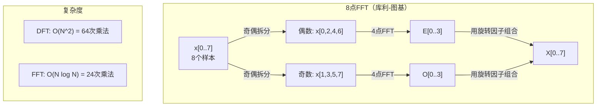
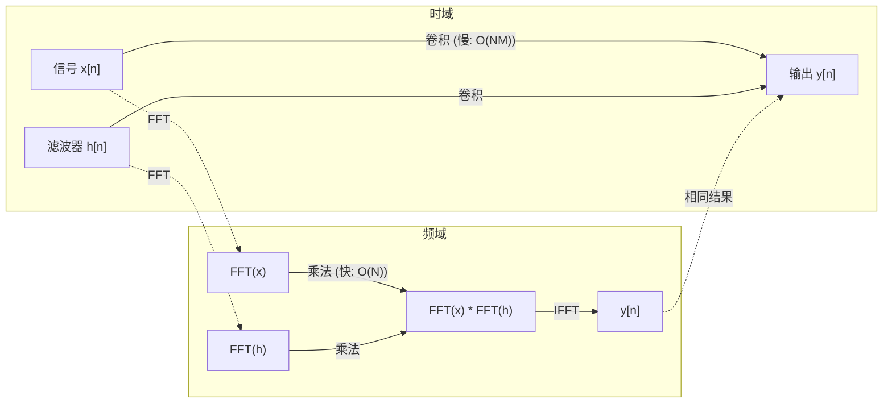

# 傅里叶变换

> 每个信号都是正弦波之和。傅里叶变换告诉你的是哪些正弦波。

**类型：** 构建
**语言：** Python
**前置知识：** 阶段1，课程01-04，19（复数）
**时间：** 约90分钟

## 学习目标

- 从零实现DFT，并与O(N log N)的库利-图基FFT进行验证
- 解析频率系数：从信号中提取幅度、相位和功率谱
- 应用卷积定理，通过FFT乘法执行卷积
- 将傅里叶频率分解与Transformer位置编码和CNN卷积层关联起来

## 问题

音频录音是随时间变化的一系列压力测量值。股票价格是随时间（以天为单位）变化的一系列数值。图像是空间上像素强度的网格。所有这些都是时域（或空域）中的数据。你看到的是值随某个索引的变化。

但许多模式在时域中是看不见的。这个音频信号是纯音还是和弦？这个股票价格是否有周周期？这个图像是否有重复纹理？这些问题涉及频率内容，而时域隐藏了它。

傅里叶变换将数据从时域转换到频域。它取一个信号并将其分解为不同频率的正弦波。每个正弦波都有一个幅度（强度）和一个相位（起始位置）。傅里叶变换同时告诉你两者。

这对机器学习很重要，因为频域思维无处不在。卷积神经网络执行卷积，而卷积在频域中是乘法。Transformer位置编码使用频率分解来表示位置。音频模型（语音识别、音乐生成）在频谱图上操作——频谱图是声音的频率表示。时间序列模型寻找周期模式。理解傅里叶变换为你提供了处理所有这些问题的词汇。

## 概念

### DFT定义

给定N个样本x[0]，x[1]，…，x[N-1]，离散傅里叶变换产生N个频率系数X[0]，X[1]，…，X[N-1]：

```
X[k] = sum_{n=0}^{N-1} x[n] * e^(-2*pi*i*k*n/N)

对于 k = 0, 1, ..., N-1
```

每个X[k]是一个复数。它的幅度|X[k]|告诉你频率k的幅度。它的相位 angle(X[k]) 告诉你该频率的相位偏移。

关键洞见：`e^(-2*pi*i*k*n/N)` 是频率k处的一个旋转向量（phasor）。DFT计算信号与N个等间距频率中每一个的相关性。如果信号在频率k处有能量，相关性会很大；如果没有，则接近零。

### 每个系数的含义

**X[0]：直流分量。** 这是所有样本的总和——与均值成正比。它代表信号的恒定（零频率）偏移。

```
X[0] = sum_{n=0}^{N-1} x[n] * e^0 = 所有样本的总和
```

**X[k]，其中1 <= k <= N/2：正频率。** X[k] 表示每N个样本的频率k次循环。更高的k意味着更高的频率（更快的振荡）。

**X[N/2]：奈奎斯特频率。** 用N个样本能表示的最高频率。高于此频率会出现混叠——高频伪装成低频。

**X[k]，其中N/2 < k < N：负频率。** 对于实值信号，X[N-k] = conj(X[k])。负频率是正频率的镜像。这就是为什么有效信息位于前N/2 + 1个系数中。

### 逆DFT

逆DFT从频率系数重建原始信号：

```
x[n] = (1/N) * sum_{k=0}^{N-1} X[k] * e^(2*pi*i*k*n/N)

对于 n = 0, 1, ..., N-1
```

与正向DFT的唯一区别：指数中的符号是正的（而不是负的），并且有1/N的归一化因子。

逆DFT是完美重建。没有信息丢失。你可以从时域到频域，再返回，没有任何误差。DFT是一种基变换——它在不同的坐标系中重新表达相同的信息。

### FFT：使其变快

如上定义的DFT是O(N^2)的：对于每个N个输出系数，你对N个输入样本求和。对于N = 100万，那就是10^12次运算。

快速傅里叶变换（FFT）以O(N log N)计算相同的结果。对于N = 100万，大约是2000万次运算，而不是一万亿次。这就是频率分析变得实用的原因。

库利-图基算法（最常见的FFT）通过分治实现：

1. 将信号拆分为偶数索引和奇数索引的样本。
2. 递归计算每一半的DFT。
3. 使用“旋转因子” e^(-2*pi*i*k/N) 组合两个半尺寸的DFT。

```
X[k] = E[k] + e^(-2*pi*i*k/N) * O[k]          对于 k = 0, ..., N/2 - 1
X[k + N/2] = E[k] - e^(-2*pi*i*k/N) * O[k]    对于 k = 0, ..., N/2 - 1

其中 E = 偶数索引样本的DFT
      O = 奇数索引样本的DFT
```

对称性意味着递归的每一层做O(N)的工作，总共有log2(N)层。总计：O(N log N)。



FFT要求信号长度为2的幂次。实践中，信号会被补零到下一个2的幂次。

### 频谱分析

**功率谱**是 |X[k]|^2 ——每个频率系数幅度的平方。它显示每个频率处有多少能量。

**相位谱**是 angle(X[k]) ——每个频率的相位偏移。对于大多数分析任务，你关心功率谱而忽略相位。

```
频率k处的功率:  P[k] = |X[k]|^2 = X[k].real^2 + X[k].imag^2
频率k处的相位:  phi[k] = atan2(X[k].imag, X[k].real)
```

### 频率分辨率

DFT的频率分辨率取决于样本数N和采样率fs。

```
第k个频点的频率:      f_k = k * fs / N
频率分辨率:    delta_f = fs / N
最大频率:       f_max = fs / 2  (奈奎斯特)
```

要分辨两个接近的频率，需要更多样本。要捕获高频，需要更高的采样率。

### 卷积定理

这是信号处理中最重要的结果之一，且直接与CNN相关。

**时域的卷积等于频域的逐点乘法。**

```
x * h = IFFT(FFT(x) . FFT(h))

其中 * 是卷积，. 是逐元素乘法
```

为什么这很重要：

- 长度为N和M的两个信号的直接卷积需要O(N*M)次运算。
- 基于FFT的卷积需要O(N log N)：变换两者，相乘，再变换回来。
- 对于大核，FFT卷积显著更快。
- 这正是在具有大感受野的卷积层中发生的事情。

注意：DFT计算的是循环卷积（信号会环绕）。对于线性卷积（无环绕），在计算前将两个信号补零到长度N + M - 1。



### 加窗

DFT假设信号是周期性的——它将N个样本视为无限重复信号的一个周期。如果信号在开始和结束处的值不相同，这会在边界处产生间断，表现为虚假的高频成分。这称为频谱泄漏。

加窗通过在进行DFT之前将信号两端逐渐衰减到零来减少泄漏。

常见窗函数：

| 窗函数 | 形状 | 主瓣宽度 | 旁瓣级别 | 用途 |
|--------|------|----------|----------|------|
| 矩形窗 | 平坦（无窗） | 最窄 | 最高（-13 dB） | 当信号恰好是N个样本内的周期信号时 |
| 汉宁窗 | 升余弦 | 适中 | 低（-31 dB） | 通用频谱分析 |
| 汉明窗 | 修正余弦 | 适中 | 更低（-42 dB） | 音频处理、语音分析 |
| 布莱克曼窗 | 三余弦 | 宽 | 非常低（-58 dB） | 当旁瓣抑制至关重要时 |

```
汉宁窗:    w[n] = 0.5 * (1 - cos(2*pi*n / (N-1)))
汉明窗:    w[n] = 0.54 - 0.46 * cos(2*pi*n / (N-1))
```

通过将窗函数与信号逐元素相乘再执行DFT来应用窗：`X = DFT(x * w)`。

### DFT性质

| 性质 | 时域 | 频域 |
|------|------|------|
| 线性 | a*x + b*y | a*X + b*Y |
| 时移 | x[n - k] | X[f] * e^(-2*pi*i*f*k/N) |
| 频移 | x[n] * e^(2*pi*i*f0*n/N) | X[f - f0] |
| 卷积 | x * h | X * H（逐点） |
| 乘法 | x * h（逐点） | X * H（循环卷积，缩放1/N） |
| 帕塞瓦尔定理 | sum \|x[n]\|^2 | (1/N) * sum \|X[k]\|^2 |
| 共轭对称（实输入） | x[n] 为实数 | X[k] = conj(X[N-k]) |

帕塞瓦尔定理说明总能量在两个域中相同。能量在变换中守恒。

### 与位置编码的联系

原始Transformer使用正弦位置编码：

```
PE(pos, 2i)   = sin(pos / 10000^(2i/d_model))
PE(pos, 2i+1) = cos(pos / 10000^(2i/d_model))
```

每个维度对（2i, 2i+1）以不同的频率振荡。频率从高（维度0,1）到低（最后维度）呈几何级数分布。这给每个位置在所有频段上赋予了独特的模式——类似于傅里叶系数唯一地标识一个信号。

这提供的关键性质：

- **唯一性：** 没有两个位置有相同的编码。
- **有界值：** sin和cos始终在[-1, 1]之间。
- **相对位置：** 位置p+k的编码可以表示为位置p处编码的线性函数。模型可以学习关注相对位置。

### 与CNN的联系

卷积层通过将学习到的滤波器（核）在信号或图像上滑动来应用于输入。数学上，这就是卷积操作。

根据卷积定理，这等价于：
1. 对输入做FFT
2. 对核做FFT
3. 在频域中相乘
4. 对结果做IFFT

标准CNN实现使用直接卷积（对于小的3x3核更快）。但对于大核或全局卷积，基于FFT的方法显著更快。一些架构（如FNet）完全用FFT替代注意力，以O(N log N)代替O(N^2)的复杂度实现了有竞争力的准确率。

### 频谱图与短时傅里叶变换

单个FFT给出整个信号的频率内容，但无法告诉我们这些频率何时出现。一个啁啾信号（频率随时间增加）和一个和弦（所有频率同时存在）可以有相同的幅度谱。

短时傅里叶变换（STFT）通过在信号的重叠窗口上计算FFT来解决这个问题。结果是一个频谱图：一个二维表示，时间在一个轴上，频率在另一个轴上。每个点的强度表示该时刻该频率的能量。

```
STFT步骤：
1. 选择窗口大小（例如1024个样本）
2. 选择步长（例如256个样本——75%重叠）
3. 对于每个窗口位置：
   a. 提取加窗后的片段
   b. 应用汉宁/汉明窗
   c. 计算FFT
   d. 将幅度谱作为频谱图的一列存储
```

频谱图是音频机器学习模型的标准输入表示。语音识别模型（Whisper、DeepSpeech）在梅尔频谱图上操作——梅尔频谱图是将频率映射到梅尔尺度的频谱图，更符合人类音高感知。

### 混叠

如果信号包含高于fs/2（奈奎斯特频率）的频率，以采样率fs采样会创建混叠副本。以100 Hz采样一个90 Hz信号看起来与一个10 Hz信号完全相同。仅从样本中无法区分它们。

```
示例：
  真实信号：90 Hz正弦波
  采样率：100 Hz
  表观频率：100 - 90 = 10 Hz

  以100 Hz采样率采样90 Hz信号所得的样本
  与10 Hz信号的样本完全相同。
  没有任何数学方法可以恢复原始的90 Hz。
```

这就是为什么模数转换器包含抗混叠滤波器，在采样前去除高于奈奎斯特的频率。在机器学习中，混叠出现在对特征图进行下采样而没有适当的低通滤波时——一些架构通过抗混叠池化层来解决这个问题。

### 补零不提高分辨率

一个常见误解：在FFT前对信号补零可以提高频率分辨率。事实并非如此。补零是在现有频率点之间插值，给出更平滑的频谱。但它不能揭示原始样本中不存在的频率细节。

真正的频率分辨率只取决于观测时间T = N / fs。要分辨间隔为delta_f的两个频率，你至少需要T = 1 / delta_f秒的数据。任何数量的补零都无法改变这个基本限制。

## 动手构建

### 步骤1：从零开始的DFT

O(N^2)的DFT直接来自定义。

```python
import math

class Complex:
    ...

def dft(x):
    N = len(x)
    result = []
    for k in range(N):
        total = Complex