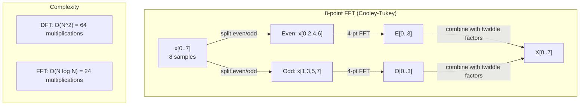
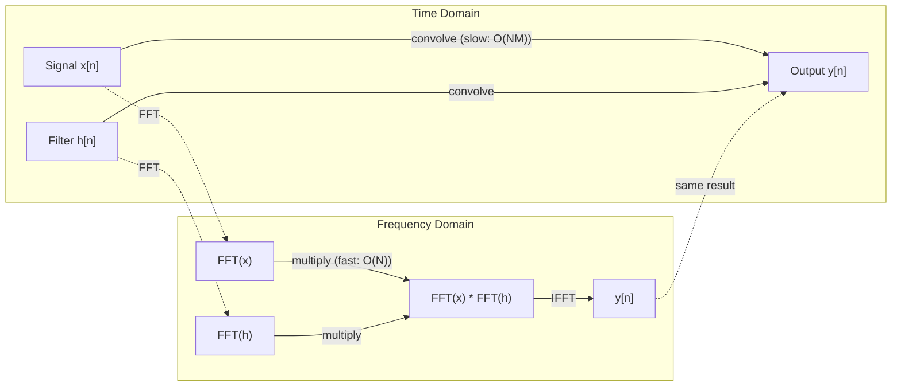

# 20 · 傅里叶变换

> 每一个信号都是正弦波之和。傅里叶变换告诉你它由哪些正弦波组成。

**类型：** 实践构建
**语言：** Python
**前置：** 第 1 阶段，第 01-04、19 课（复数）
**时长：** 约 90 分钟

## 学习目标

- 从零实现离散傅里叶变换（DFT），并与 O(N log N) 的库利-图基（Cooley-Tukey）快速傅里叶变换（FFT）相互验证
- 解读频率系数：从信号中提取幅度（amplitude）、相位（phase）和功率谱（power spectrum）
- 应用卷积定理（convolution theorem），通过 FFT 相乘来执行卷积
- 把傅里叶频率分解与 Transformer 的位置编码（positional encoding）以及 CNN 的卷积层联系起来

## 问题所在

一段音频录音是随时间变化的一系列压强测量值。股票价格是随天数变化的一系列数值。一张图像是随空间分布的像素强度网格。所有这些都是时域（time domain，或空间域）中的数据。你看到的是数值随某个索引而变化。

但许多模式在时域中是不可见的。这段音频信号是一个纯音还是一个和弦？这段股价是否存在每周一次的周期？这张图像是否有重复的纹理？这些问题都是关于频率内容的，而时域把它隐藏了起来。

傅里叶变换（Fourier transform）把数据从时域转换到频域（frequency domain）。它接收一个信号，并将其分解为不同频率的正弦波。每个正弦波都有一个幅度（它有多强）和一个相位（它从哪里开始）。傅里叶变换会同时告诉你这两者。

这对机器学习很重要，因为频域思维无处不在。卷积神经网络（CNN）执行卷积，而卷积就是频域中的乘法。Transformer 的位置编码用频率分解来表示位置。音频模型（语音识别、音乐生成）在频谱图（spectrogram）上运算——也就是声音的频率表示。时间序列模型寻找周期性模式。理解傅里叶变换为你处理所有这些任务提供了词汇与工具。

## 核心概念

### DFT 的定义

给定 N 个样本 x[0], x[1], ..., x[N-1]，离散傅里叶变换（Discrete Fourier Transform）产生 N 个频率系数 X[0], X[1], ..., X[N-1]：

```
X[k] = sum_{n=0}^{N-1} x[n] * e^(-2*pi*i*k*n/N)

for k = 0, 1, ..., N-1
```

每个 X[k] 都是一个复数。它的模 |X[k]| 告诉你频率 k 的幅度。它的相位角 angle(X[k]) 告诉你该频率的相位偏移。

关键洞见：`e^(-2*pi*i*k*n/N)` 是一个频率为 k 的旋转相量（phasor）。DFT 计算的是信号与 N 个等间距频率中每一个之间的相关性。如果信号在频率 k 上含有能量，相关性就大；否则就接近零。

### 每个系数的含义

**X[0]：直流分量（DC component）。** 这是所有样本之和——与均值成正比。它表示信号的恒定（零频率）偏移。

```
X[0] = sum_{n=0}^{N-1} x[n] * e^0 = sum of all samples
```

**X[k]，当 1 <= k <= N/2：正频率。** X[k] 表示每 N 个样本 k 个周期的频率。k 越大意味着频率越高（振荡越快）。

**X[N/2]：奈奎斯特频率（Nyquist frequency）。** 用 N 个样本所能表示的最高频率。超过此频率，你会得到混叠（aliasing）——高频伪装成低频。

**X[k]，当 N/2 < k < N：负频率。** 对于实值信号，X[N-k] = conj(X[k])。负频率是正频率的镜像。这就是为什么有用的信息都包含在前 N/2 + 1 个系数中。

### 逆 DFT

逆 DFT 从频率系数重建原始信号：

```
x[n] = (1/N) * sum_{k=0}^{N-1} X[k] * e^(2*pi*i*k*n/N)

for n = 0, 1, ..., N-1
```

它与正向 DFT 的唯一区别在于：指数中的符号为正（而非负），并且有一个 1/N 的归一化因子。

逆 DFT 是完美重建。没有信息丢失。你可以从时域到频域、再返回时域，而不产生任何误差。DFT 是一次基变换（change of basis）——它用不同的坐标系重新表达了同样的信息。

### FFT：让它变快

如上定义的 DFT 复杂度是 O(N^2)：对于 N 个输出系数中的每一个，你都要对 N 个输入样本求和。对于 N = 100 万，那是 10^12 次运算。

快速傅里叶变换（Fast Fourier Transform，FFT）以 O(N log N) 计算出相同的结果。对于 N = 100 万，那大约是 2000 万次运算，而不是一万亿次。正是这一点使频率分析变得实用。

库利-图基算法（最常见的 FFT）通过分治法工作：

1. 把信号拆分为偶数下标和奇数下标的样本。
2. 递归计算每一半的 DFT。
3. 用「旋转因子（twiddle factor）」e^(-2*pi*i*k/N) 将两个半长度的 DFT 合并。

```
X[k] = E[k] + e^(-2*pi*i*k/N) * O[k]          for k = 0, ..., N/2 - 1
X[k + N/2] = E[k] - e^(-2*pi*i*k/N) * O[k]    for k = 0, ..., N/2 - 1

where E = DFT of even-indexed samples
      O = DFT of odd-indexed samples
```

这种对称性意味着每一层递归只做 O(N) 的工作，而总共有 log2(N) 层。总计：O(N log N)。



FFT 要求信号长度为 2 的幂。在实践中，信号会被零填充（zero-pad）到下一个 2 的幂。

### 频谱分析

**功率谱（power spectrum）** 是 |X[k]|^2——每个频率系数的模的平方。它展示每个频率上有多少能量。

**相位谱（phase spectrum）** 是 angle(X[k])——每个频率的相位偏移。对于大多数分析任务，你关注的是功率谱，而忽略相位。

```
Power at frequency k:  P[k] = |X[k]|^2 = X[k].real^2 + X[k].imag^2
Phase at frequency k:  phi[k] = atan2(X[k].imag, X[k].real)
```

### 频率分辨率

DFT 的频率分辨率取决于样本数 N 和采样率 fs。

```
Frequency of bin k:      f_k = k * fs / N
Frequency resolution:    delta_f = fs / N
Maximum frequency:       f_max = fs / 2  (Nyquist)
```

要分辨两个相互接近的频率，你需要更多样本。要捕获高频，你需要更高的采样率。

### 卷积定理

这是信号处理中最重要的结论之一，且与 CNN 直接相关。

**时域中的卷积等于频域中的逐点相乘。**

```
x * h = IFFT(FFT(x) . FFT(h))

where * is convolution and . is element-wise multiplication
```

为什么这很重要：

- 对两个长度分别为 N 和 M 的信号做直接卷积需要 O(N*M) 次运算。
- 基于 FFT 的卷积需要 O(N log N)：变换两者、相乘、再变换回来。
- 对于大的卷积核，FFT 卷积要快得多。
- 这正是具有大感受野（receptive field）的卷积层中发生的事情。

注意：DFT 计算的是循环卷积（circular convolution，信号会环绕回卷）。要做线性卷积（linear convolution，无环绕），需在计算前把两个信号都零填充到长度 N + M - 1。



### 加窗

DFT 假设信号是周期性的——它把 N 个样本当作一个无限重复信号的一个周期。如果信号的起点和终点取值不同，就会在边界处产生一个不连续点，它会表现为虚假的高频内容。这被称为频谱泄漏（spectral leakage）。

加窗（windowing）通过在计算 DFT 之前让信号在两端逐渐收敛到零，来减少泄漏。

常见的窗：

| 窗 | 形状 | 主瓣宽度 | 旁瓣电平 | 适用场景 |
|--------|-------|----------------|-----------------|----------|
| 矩形窗（Rectangular） | 平直（不加窗） | 最窄 | 最高（-13 dB） | 当信号在 N 个样本内恰好是周期性的 |
| 汉宁窗（Hann） | 升余弦 | 中等 | 低（-31 dB） | 通用频谱分析 |
| 海明窗（Hamming） | 改进余弦 | 中等 | 更低（-42 dB） | 音频处理、语音分析 |
| 布莱克曼窗（Blackman） | 三重余弦 | 宽 | 极低（-58 dB） | 当旁瓣抑制至关重要时 |

```
Hann window:    w[n] = 0.5 * (1 - cos(2*pi*n / (N-1)))
Hamming window: w[n] = 0.54 - 0.46 * cos(2*pi*n / (N-1))
```

在 DFT 之前，把窗与信号逐元素相乘即可应用加窗：`X = DFT(x * w)`。

### DFT 的性质

| 性质 | 时域 | 频域 |
|----------|-------------|-----------------|
| 线性 | a*x + b*y | a*X + b*Y |
| 时移 | x[n - k] | X[f] * e^(-2*pi*i*f*k/N) |
| 频移 | x[n] * e^(2*pi*i*f0*n/N) | X[f - f0] |
| 卷积 | x * h | X * H（逐点） |
| 乘法 | x * h（逐点） | X * H（循环卷积，按 1/N 缩放） |
| 帕塞瓦尔定理（Parseval's theorem） | sum \|x[n]\|^2 | (1/N) * sum \|X[k]\|^2 |
| 共轭对称（实输入） | x[n] 为实数 | X[k] = conj(X[N-k]) |

帕塞瓦尔定理说明，在两个域中总能量是相同的。能量在变换过程中守恒。

### 与位置编码的联系

最初的 Transformer 使用正弦位置编码（sinusoidal positional encoding）：

```
PE(pos, 2i)   = sin(pos / 10000^(2i/d_model))
PE(pos, 2i+1) = cos(pos / 10000^(2i/d_model))
```

每一对维度 (2i, 2i+1) 都以不同的频率振荡。这些频率从高（维度 0、1）到低（最后几个维度）呈几何级数分布。这使每个位置在所有频带上拥有一个独特的模式——类似于傅里叶系数如何唯一地标识一个信号。

它提供的关键性质：

- **唯一性：** 没有两个位置具有相同的编码。
- **取值有界：** sin 和 cos 始终在 [-1, 1] 内。
- **相对位置：** 位置 p+k 的编码可以表示为位置 p 处编码的线性函数。模型可以学会关注相对位置。

### 与 CNN 的联系

卷积层通过在信号或图像上滑动一个学习到的滤波器（卷积核）来将其作用于输入。在数学上，这就是卷积运算。

根据卷积定理，这等价于：
1. 对输入做 FFT
2. 对卷积核做 FFT
3. 在频域中相乘
4. 对结果做 IFFT

标准的 CNN 实现使用直接卷积（对于小的 3x3 卷积核更快）。但对于大卷积核或全局卷积，基于 FFT 的方法要快得多。一些架构（如 FNet）用 FFT 完全取代了注意力机制，以 O(N log N) 而非 O(N^2) 的复杂度达到了有竞争力的准确率。

### 频谱图与短时傅里叶变换

单次 FFT 给你的是整个信号的频率内容，但完全不告诉你这些频率出现在何时。一个啁啾信号（chirp，频率随时间增加的信号）和一个和弦（所有频率同时出现）可以拥有相同的幅度谱。

短时傅里叶变换（Short-Time Fourier Transform，STFT）通过在信号的重叠窗口上计算 FFT 来解决这个问题。结果是一张频谱图（spectrogram）：一种二维表示，一个轴是时间，另一个轴是频率。每个点的强度表示该时刻该频率上的能量。

```
STFT procedure:
1. Choose a window size (e.g., 1024 samples)
2. Choose a hop size (e.g., 256 samples -- 75% overlap)
3. For each window position:
   a. Extract the windowed segment
   b. Apply a Hann/Hamming window
   c. Compute FFT
   d. Store the magnitude spectrum as one column of the spectrogram
```

频谱图是音频机器学习模型的标准输入表示。语音识别模型（Whisper、DeepSpeech）在梅尔频谱图（mel-spectrogram）上运算——即把频率映射到梅尔标度（mel scale）的频谱图，该标度更符合人类的音高感知。

### 混叠

如果一个信号含有高于 fs/2（奈奎斯特频率）的频率，以速率 fs 采样将产生混叠副本。一个以 100 Hz 采样的 90 Hz 信号看起来与一个 10 Hz 信号完全相同。仅凭样本无法区分它们。

```
Example:
  True signal: 90 Hz sine wave
  Sampling rate: 100 Hz
  Apparent frequency: 100 - 90 = 10 Hz

  The samples from the 90 Hz signal at 100 Hz sampling rate
  are identical to the samples from a 10 Hz signal.
  No amount of math can recover the original 90 Hz.
```

这就是为什么模数转换器（ADC）会包含抗混叠滤波器，在采样前去除高于奈奎斯特频率的频率。在机器学习中，混叠出现在没有适当低通滤波就对特征图下采样时——一些架构用抗混叠池化层（anti-aliased pooling layer）来解决这个问题。

### 零填充不会提高分辨率

一个常见的误解：在 FFT 之前对信号做零填充会提高频率分辨率。它不会。零填充在已有的频率 bin 之间做插值，给你一个看起来更平滑的频谱。但它无法揭示原始样本中并不存在的频率细节。

真正的频率分辨率只取决于观测时间 T = N / fs。要分辨两个相隔 delta_f 的频率，你至少需要 T = 1 / delta_f 秒的数据。再多的零填充也无法改变这一根本极限。

## 动手构建

### 第 1 步：从零实现 DFT

O(N^2) 的 DFT 直接由定义得出。

```python
import math

class Complex:
    ...

def dft(x):
    N = len(x)
    result = []
    for k in range(N):
        total = Complex(0, 0)
        for n in range(N):
            angle = -2 * math.pi * k * n / N
            w = Complex(math.cos(angle), math.sin(angle))
            xn = x[n] if isinstance(x[n], Complex) else Complex(x[n])
            total = total + xn * w
        result.append(total)
    return result
```

### 第 2 步：逆 DFT

结构相同，指数为正，并除以 N。

```python
def idft(X):
    N = len(X)
    result = []
    for n in range(N):
        total = Complex(0, 0)
        for k in range(N):
            angle = 2 * math.pi * k * n / N
            w = Complex(math.cos(angle), math.sin(angle))
            total = total + X[k] * w
        result.append(Complex(total.real / N, total.imag / N))
    return result
```

### 第 3 步：FFT（库利-图基）

递归 FFT 要求长度为 2 的幂。拆分为偶数和奇数部分，递归，再用旋转因子合并。

```python
def fft(x):
    N = len(x)
    if N <= 1:
        return [x[0] if isinstance(x[0], Complex) else Complex(x[0])]
    if N % 2 != 0:
        return dft(x)

    even = fft([x[i] for i in range(0, N, 2)])
    odd = fft([x[i] for i in range(1, N, 2)])

    result = [Complex(0)] * N
    for k in range(N // 2):
        angle = -2 * math.pi * k / N
        twiddle = Complex(math.cos(angle), math.sin(angle))
        t = twiddle * odd[k]
        result[k] = even[k] + t
        result[k + N // 2] = even[k] - t
    return result
```

### 第 4 步：频谱分析辅助函数

```python
def power_spectrum(X):
    return [xk.real ** 2 + xk.imag ** 2 for xk in X]

def convolve_fft(x, h):
    N = len(x) + len(h) - 1
    padded_N = 1
    while padded_N < N:
        padded_N *= 2

    x_padded = x + [0.0] * (padded_N - len(x))
    h_padded = h + [0.0] * (padded_N - len(h))

    X = fft(x_padded)
    H = fft(h_padded)

    Y = [xk * hk for xk, hk in zip(X, H)]

    y = idft(Y)
    return [y[n].real for n in range(N)]
```

## 在实践中使用

在实际工作中，请使用 numpy 的 FFT，它由高度优化的 C 库支撑。

```python
import numpy as np

signal = np.sin(2 * np.pi * 5 * np.arange(256) / 256)
spectrum = np.fft.fft(signal)
freqs = np.fft.fftfreq(256, d=1/256)

power = np.abs(spectrum) ** 2

positive_freqs = freqs[:len(freqs)//2]
positive_power = power[:len(power)//2]
```

用于加窗和更高级的频谱分析：

```python
from scipy.signal import windows, stft

window = windows.hann(256)
windowed = signal * window
spectrum = np.fft.fft(windowed)
```

用于卷积：

```python
from scipy.signal import fftconvolve

result = fftconvolve(signal, kernel, mode='full')
```

用于频谱图：

```python
from scipy.signal import stft

frequencies, times, Zxx = stft(signal, fs=sample_rate, nperseg=256)
spectrogram = np.abs(Zxx) ** 2
```

频谱图矩阵的形状为 (n_frequencies, n_time_frames)。每一列是一个时间窗口上的功率谱。这正是音频机器学习模型所消费的输入。

## 交付成果

运行 `code/fourier.py` 以生成 `outputs/prompt-spectral-analyzer.md`。

## 练习

1. **纯音识别。** 创建一个含有单个正弦波的信号，其频率未知（介于 1 到 50 Hz 之间），以 128 Hz 采样持续 1 秒。用你的 DFT 识别该频率。验证答案是否吻合。现在加入标准差为 0.5 的高斯噪声并重复。噪声如何影响频谱？

2. **FFT 与 DFT 的验证。** 生成一个长度为 64 的随机信号。同时计算 DFT（O(N^2)）和 FFT。验证所有系数都在 1e-10 误差内吻合。在长度为 256、512、1024 和 2048 的信号上分别对两个函数计时。绘制 DFT 时间与 FFT 时间之比。

3. **用实例证明卷积定理。** 创建信号 x = [1, 2, 3, 4, 0, 0, 0, 0] 和滤波器 h = [1, 1, 1, 0, 0, 0, 0, 0]。直接计算它们的循环卷积（嵌套循环）。然后通过 FFT 计算它（变换、相乘、逆变换）。验证结果吻合。现在通过适当的零填充来做线性卷积。

4. **加窗的效果。** 创建一个由 10 Hz 和 12 Hz（非常接近）两个正弦波之和构成的信号。以 128 Hz 采样持续 1 秒。分别在不加窗、汉宁窗和海明窗下计算功率谱。哪个窗最容易区分这两个峰？为什么？

5. **位置编码分析。** 为 d_model = 128 和 max_pos = 512 生成正弦位置编码。对每一对位置 (p1, p2)，计算它们编码的点积。证明该点积只取决于 |p1 - p2|，而不取决于绝对位置。随着距离增加，点积会发生什么变化？

## 关键术语

| 术语 | 含义 |
|------|---------------|
| DFT（离散傅里叶变换） | 将 N 个时域样本转换为 N 个频域系数。每个系数是与该频率上一个复正弦波的相关性 |
| FFT（快速傅里叶变换） | 计算 DFT 的 O(N log N) 算法。库利-图基算法递归地拆分偶/奇下标 |
| 逆 DFT | 从频率系数重建时域信号。公式与 DFT 相同，但指数符号翻转并按 1/N 缩放 |
| 频率 bin（frequency bin） | DFT 输出中的每个下标 k 表示频率 k*fs/N Hz。「bin」即离散的频率槽 |
| 直流分量（DC component） | X[0]，零频率系数。与信号均值成正比 |
| 奈奎斯特频率（Nyquist frequency） | fs/2，在采样率 fs 下可表示的最大频率。高于此频率的频率会混叠 |
| 功率谱（power spectrum） | \|X[k]\|^2，每个频率系数的模的平方。展示能量在各频率上的分布 |
| 相位谱（phase spectrum） | angle(X[k])，每个频率分量的相位偏移。在分析中常被忽略 |
| 频谱泄漏（spectral leakage） | 把非周期信号当作周期信号处理所导致的虚假频率内容。通过加窗减少 |
| 窗函数（window function） | 在 DFT 之前应用的渐缩函数（汉宁、海明、布莱克曼），用于减少频谱泄漏 |
| 旋转因子（twiddle factor） | 复指数 e^(-2*pi*i*k/N)，用于在 FFT 的蝶形运算中合并子 DFT |
| 卷积定理（convolution theorem） | 时域中的卷积等于频域中的逐点相乘。是信号处理和 CNN 的根本基础 |
| 循环卷积（circular convolution） | 信号会环绕回卷的卷积。这是 DFT 天然计算的卷积 |
| 线性卷积（linear convolution） | 无环绕的标准卷积。通过在 DFT 前零填充实现 |
| 帕塞瓦尔定理（Parseval's theorem） | 总能量在傅里叶变换中守恒。sum \|x[n]\|^2 = (1/N) sum \|X[k]\|^2 |
| 混叠（aliasing） | 当由于采样率不足，高于奈奎斯特频率的频率表现为较低频率时 |

## 延伸阅读

- [Cooley & Tukey: An Algorithm for the Machine Calculation of Complex Fourier Series (1965)](https://www.ams.org/journals/mcom/1965-19-090/S0025-5718-1965-0178586-1/) - 改变了计算的 FFT 原始论文
- [3Blue1Brown: But what is the Fourier Transform?](https://www.youtube.com/watch?v=spUNpyF58BY) - 关于傅里叶变换的最佳可视化入门
- [Lee-Thorp et al.: FNet: Mixing Tokens with Fourier Transforms (2021)](https://arxiv.org/abs/2105.03824) - 在 Transformer 中用 FFT 取代自注意力
- [Smith: The Scientist and Engineer's Guide to Digital Signal Processing](http://www.dspguide.com/) - 深入讲解 FFT、加窗和频谱分析的免费在线教科书
- [Vaswani et al.: Attention Is All You Need (2017)](https://arxiv.org/abs/1706.03762) - 源自傅里叶频率分解的正弦位置编码
- [Radford et al.: Whisper (2022)](https://arxiv.org/abs/2212.04356) - 使用梅尔频谱图作为输入表示的语音识别
