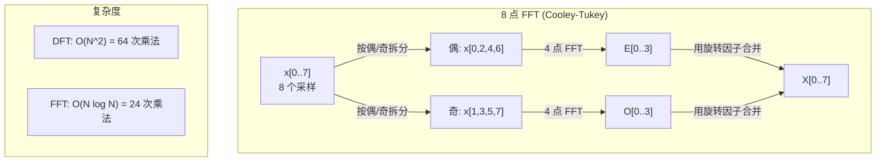
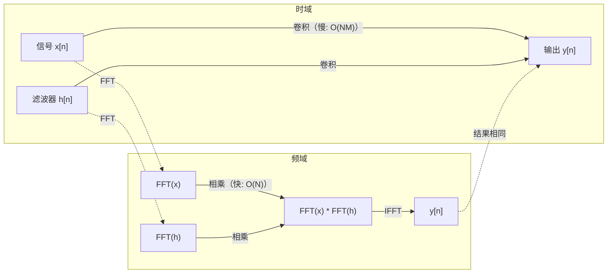

# 傅里叶变换（The Fourier Transform）

> 译注：本文译自同目录 [`en.md`](./en.md)。术语遵循仓根 [TRANSLATION_GUIDE.md](../../../../TRANSLATION_GUIDE.md)。

> 任何信号都是正弦波之和。傅里叶变换告诉你它是哪些。

**Type:** Build
**Language:** Python
**Prerequisites:** Phase 1, Lessons 01-04, 19 (complex numbers)
**Time:** ~90 minutes

## 学习目标（Learning Objectives）

- 从零实现 DFT，并与 O(N log N) 的 Cooley-Tukey FFT 互相验证
- 解读频率系数：从信号中提取幅度、相位和功率谱
- 应用卷积定理，通过 FFT 乘法完成卷积
- 把傅里叶频率分解和 transformer 位置编码、CNN 卷积层联系起来

## 问题（The Problem）

一段音频是随时间变化的气压采样序列。一只股票的价格是逐日的数值序列。一张图像是空间上的像素强度网格。这些数据都属于时域（或空间域），你看到的是值随某个索引变化。

但很多模式在时域里是看不见的。这段音频是单音还是和弦？这只股票有没有以周为单位的周期？这张图里有没有重复的纹理？这些问题问的都是频率内容，而时域把它藏起来了。

傅里叶变换把数据从时域转换到频域。它接收一个信号，把它分解成不同频率的正弦波。每个正弦波都有一个幅度（强度多大）和一个相位（从哪里开始）。傅里叶变换两者都能告诉你。

这件事对 ML 很重要，因为频域思维到处都是。卷积神经网络做的卷积，本质上就是频域里的乘法。Transformer 的位置编码用频率分解来表示位置。音频模型（语音识别、音乐生成）跑在频谱图上——也就是声音的频率表示。时间序列模型寻找的是周期性模式。理解傅里叶变换，会让你拿到打开这一切的词汇表。

## 概念（The Concept）

### DFT 定义（The DFT definition）

给定 N 个采样 x[0], x[1], ..., x[N-1]，离散傅里叶变换（Discrete Fourier Transform）会产生 N 个频率系数 X[0], X[1], ..., X[N-1]：

```
X[k] = sum_{n=0}^{N-1} x[n] * e^(-2*pi*i*k*n/N)

for k = 0, 1, ..., N-1
```

每个 X[k] 都是复数。它的模 |X[k]| 告诉你频率 k 的幅度，它的相位 angle(X[k]) 告诉你那个频率的相位偏移。

关键直觉：`e^(-2*pi*i*k*n/N)` 是一个频率为 k 的旋转相量（phasor）。DFT 计算的是信号与 N 个等间距频率每一个的相关性。如果信号在频率 k 上有能量，相关性就会很大；没有的话，就接近零。

### 每个系数的含义（What each coefficient means）

**X[0]：DC 分量。** 这是所有采样的总和——和均值成正比。它表示信号的常数（零频）偏移。

```
X[0] = sum_{n=0}^{N-1} x[n] * e^0 = sum of all samples
```

**1 <= k <= N/2 时的 X[k]：正频率。** X[k] 表示每 N 个采样里 k 个周期的频率。k 越大，频率越高（振荡越快）。

**X[N/2]：奈奎斯特（Nyquist）频率。** 用 N 个采样能表示的最高频率。再往上就会出现混叠（aliasing）——高频伪装成低频。

**N/2 < k < N 时的 X[k]：负频率。** 对于实值信号，X[N-k] = conj(X[k])。负频率是正频率的镜像。这就是为什么有用的信息都集中在前 N/2 + 1 个系数里。

### 逆 DFT（Inverse DFT）

逆 DFT 从频率系数重建原始信号：

```
x[n] = (1/N) * sum_{k=0}^{N-1} X[k] * e^(2*pi*i*k*n/N)

for n = 0, 1, ..., N-1
```

和正向 DFT 唯一的区别：指数的符号是正的（不是负的），并且多了个 1/N 归一化因子。

逆 DFT 是完美重建。没有信息损失。你可以从时域走到频域再走回来，毫无误差。DFT 是一次基变换（change of basis）——它把同一份信息换到另一个坐标系下表达。

### FFT：让它变快（The FFT: making it fast）

上面定义的 DFT 是 O(N^2)：每个输出系数都要对 N 个输入采样求和，一共 N 个系数。当 N = 100 万时，那是 10^12 次运算。

快速傅里叶变换（Fast Fourier Transform，FFT）能在 O(N log N) 内算出同样的结果。N = 100 万时，大约是 2000 万次运算，而不是一万亿次。这就是频率分析能落到工程实践的原因。

Cooley-Tukey 算法（最常见的 FFT）用分治思路：

1. 把信号分成偶索引采样和奇索引采样两半。
2. 递归计算两半各自的 DFT。
3. 用「旋转因子」（twiddle factor）e^(-2*pi*i*k/N) 把两个半长 DFT 合并起来。

```
X[k] = E[k] + e^(-2*pi*i*k/N) * O[k]          for k = 0, ..., N/2 - 1
X[k + N/2] = E[k] - e^(-2*pi*i*k/N) * O[k]    for k = 0, ..., N/2 - 1

where E = DFT of even-indexed samples
      O = DFT of odd-indexed samples
```

利用对称性，每一层递归只做 O(N) 的工作，递归深度是 log2(N) 层。总共：O(N log N)。



FFT 要求信号长度是 2 的幂。实践中，信号会被零填充（zero-pad）到下一个 2 的幂。

### 频谱分析（Spectral analysis）

**功率谱**（power spectrum）就是 |X[k]|^2——每个频率系数的模平方。它显示每个频率上的能量有多少。

**相位谱**（phase spectrum）是 angle(X[k])——每个频率的相位偏移。大多数分析任务里，你只在意功率谱，相位会被忽略。

```
Power at frequency k:  P[k] = |X[k]|^2 = X[k].real^2 + X[k].imag^2
Phase at frequency k:  phi[k] = atan2(X[k].imag, X[k].real)
```

### 频率分辨率（Frequency resolution）

DFT 的频率分辨率取决于采样数 N 和采样率 fs。

```
Frequency of bin k:      f_k = k * fs / N
Frequency resolution:    delta_f = fs / N
Maximum frequency:       f_max = fs / 2  (Nyquist)
```

要分辨两个相邻频率，你需要更多采样。要捕获高频，你需要更高的采样率。

### 卷积定理（The convolution theorem）

这是信号处理里最重要的结论之一，也直接和 CNN 相关。

**时域里的卷积，等于频域里的逐点乘法。**

```
x * h = IFFT(FFT(x) . FFT(h))

where * is convolution and . is element-wise multiplication
```

这件事为什么重要：

- 直接对长度 N 和 M 的两个信号做卷积要 O(N*M) 次运算。
- 基于 FFT 的卷积只要 O(N log N)：两边都变换、相乘、再反变换回去。
- 当卷积核很大时，FFT 卷积会快得不是一点半点。
- 这正是大感受野卷积层里发生的事。

注意：DFT 计算的是循环卷积（circular convolution，信号会绕回开头）。要做线性卷积（无绕回），先把两个信号都零填充到长度 N + M - 1 再算。



### 加窗（Windowing）

DFT 假设信号是周期的——它把这 N 个采样当作一个无限重复信号的一个周期。如果信号开头和结尾的值不一样，边界处就会出现断点，体现在频谱上就是虚假的高频成分。这叫频谱泄漏（spectral leakage）。

加窗通过在 DFT 之前把信号两端逐渐缩到零，来减小泄漏。

常见的窗：

| 窗函数 | 形状 | 主瓣宽度 | 旁瓣电平 | 使用场景 |
|--------|-------|----------------|-----------------|----------|
| Rectangular（矩形窗） | 平的（不加窗） | 最窄 | 最高（-13 dB） | 信号在 N 个采样里恰好是周期的 |
| Hann | 升余弦 | 中等 | 低（-31 dB） | 通用频谱分析 |
| Hamming | 改良余弦 | 中等 | 更低（-42 dB） | 音频处理、语音分析 |
| Blackman | 三重余弦 | 宽 | 非常低（-58 dB） | 旁瓣抑制要求很高时 |

```
Hann window:    w[n] = 0.5 * (1 - cos(2*pi*n / (N-1)))
Hamming window: w[n] = 0.54 - 0.46 * cos(2*pi*n / (N-1))
```

加窗就是在 DFT 之前把它和信号逐元素相乘：`X = DFT(x * w)`。

### DFT 性质（DFT properties）

| 性质 | 时域 | 频域 |
|----------|-------------|-----------------|
| 线性 | a*x + b*y | a*X + b*Y |
| 时移 | x[n - k] | X[f] * e^(-2*pi*i*f*k/N) |
| 频移 | x[n] * e^(2*pi*i*f0*n/N) | X[f - f0] |
| 卷积 | x * h | X * H（逐点） |
| 乘法 | x * h（逐点） | X * H（循环卷积，乘以 1/N） |
| Parseval 定理 | sum \|x[n]\|^2 | (1/N) * sum \|X[k]\|^2 |
| 共轭对称（实输入） | x[n] 实数 | X[k] = conj(X[N-k]) |

Parseval 定理说总能量在两个域里是相等的。能量在变换中是守恒的。

### 与位置编码的联系（Connection to positional encodings）

最初版本的 Transformer 用的是正弦位置编码：

```
PE(pos, 2i)   = sin(pos / 10000^(2i/d_model))
PE(pos, 2i+1) = cos(pos / 10000^(2i/d_model))
```

每一对维度 (2i, 2i+1) 都在不同的频率上振荡。频率从高（维度 0、1）到低（最后几个维度）按几何级数排布。这让每个位置都拥有跨所有频段的唯一模式——和傅里叶系数能够唯一标识一个信号是同样的道理。

由此带来的几个关键性质：

- **唯一性：** 没有两个位置共享同一个编码。
- **取值有界：** sin 和 cos 始终在 [-1, 1] 内。
- **相对位置：** 位置 p+k 的编码可以表示为位置 p 编码的线性函数，模型可以学着按相对位置去 attend。

### 与 CNN 的联系（Connection to CNNs）

卷积层把一个学到的滤波器（卷积核）在信号或图像上滑动，作用到输入上。数学上这就是卷积运算。

由卷积定理，这等价于：
1. 对输入做 FFT
2. 对卷积核做 FFT
3. 在频域里相乘
4. 对结果做 IFFT

标准 CNN 实现用的是直接卷积（对小的 3x3 核更快）。但当卷积核很大、或要做全局卷积时，基于 FFT 的方法会快很多。一些架构（比如 FNet）干脆用 FFT 完全替换 attention，以 O(N log N) 而不是 O(N^2) 的复杂度拿到了有竞争力的精度。

### 频谱图与短时傅里叶变换（Spectrograms and the Short-Time Fourier Transform）

一次 FFT 给你的是整个信号的频率内容，但完全不告诉你这些频率出现在什么时候。一段啁啾声（chirp，频率随时间增大的信号）和一个和弦（所有频率同时存在）可能拥有相同的幅度谱。

短时傅里叶变换（Short-Time Fourier Transform，STFT）通过在信号的重叠窗口上分别做 FFT 来解决这个问题。结果是一张频谱图（spectrogram）：一个二维表示，一根轴是时间，另一根是频率。每个点的强度表示那一时刻、那个频率上的能量。

```
STFT procedure:
1. Choose a window size (e.g., 1024 samples)
2. Choose a hop size (e.g., 256 samples -- 75% overlap)
3. For each window position:
   a. Extract the windowed segment
   b. Apply a Hann/Hamming window
   c. Compute FFT
   d. Store the magnitude spectrum as one column of the spectrogram
```

频谱图是音频 ML 模型的标准输入表示。语音识别模型（Whisper、DeepSpeech）跑在 mel 频谱图上——这种频谱图把频率映射到 mel 标度，更接近人类对音高的感知。

### 混叠（Aliasing）

如果信号包含高于 fs/2（奈奎斯特频率）的成分，以速率 fs 采样会产生混叠副本。一个 90 Hz 的信号以 100 Hz 采样，看上去和 10 Hz 的信号一模一样。光从采样里你没办法把它们区分开。

```
Example:
  True signal: 90 Hz sine wave
  Sampling rate: 100 Hz
  Apparent frequency: 100 - 90 = 10 Hz

  The samples from the 90 Hz signal at 100 Hz sampling rate
  are identical to the samples from a 10 Hz signal.
  No amount of math can recover the original 90 Hz.
```

这就是为什么模数转换器里都带了抗混叠滤波器：在采样之前先把奈奎斯特以上的频率削掉。在 ML 里，下采样特征图时如果没有合适的低通滤波，混叠也会冒出来——一些架构用抗混叠的池化层来对付这件事。

### 零填充并不能提升分辨率（Zero-padding does not increase resolution）

一个常见误解：在 FFT 之前给信号补零能提升频率分辨率。它不能。零填充只是在已有的频率 bin 之间插值，让频谱看起来更平滑。但它没办法揭示原本采样里就没有的频率细节。

真正的频率分辨率只取决于观测时长 T = N / fs。要分辨相距 delta_f 的两个频率，你至少需要 T = 1 / delta_f 秒的数据。无论补多少零都跨不过这条根本的下限。

## 动手实现（Build It）

### 步骤 1：从零写 DFT（Step 1: DFT from scratch）

O(N^2) 的 DFT 直接照定义来。

```python
import math

class Complex:
    ...

def dft(x):
    N = len(x)
    result = []
    for k in range(N):
        total = Complex(0, 0)
        for n in range(N):
            angle = -2 * math.pi * k * n / N
            w = Complex(math.cos(angle), math.sin(angle))
            xn = x[n] if isinstance(x[n], Complex) else Complex(x[n])
            total = total + xn * w
        result.append(total)
    return result
```

### 步骤 2：逆 DFT（Step 2: Inverse DFT）

结构一样，指数取正号，最后除以 N。

```python
def idft(X):
    N = len(X)
    result = []
    for n in range(N):
        total = Complex(0, 0)
        for k in range(N):
            angle = 2 * math.pi * k * n / N
            w = Complex(math.cos(angle), math.sin(angle))
            total = total + X[k] * w
        result.append(Complex(total.real / N, total.imag / N))
    return result
```

### 步骤 3：FFT（Cooley-Tukey）（Step 3: FFT (Cooley-Tukey)）

递归 FFT 要求长度是 2 的幂。拆成偶、奇两部分递归，再用 twiddle factor 合并。

```python
def fft(x):
    N = len(x)
    if N <= 1:
        return [x[0] if isinstance(x[0], Complex) else Complex(x[0])]
    if N % 2 != 0:
        return dft(x)

    even = fft([x[i] for i in range(0, N, 2)])
    odd = fft([x[i] for i in range(1, N, 2)])

    result = [Complex(0)] * N
    for k in range(N // 2):
        angle = -2 * math.pi * k / N
        twiddle = Complex(math.cos(angle), math.sin(angle))
        t = twiddle * odd[k]
        result[k] = even[k] + t
        result[k + N // 2] = even[k] - t
    return result
```

### 步骤 4：频谱分析的辅助函数（Step 4: Spectral analysis helpers）

```python
def power_spectrum(X):
    return [xk.real ** 2 + xk.imag ** 2 for xk in X]

def convolve_fft(x, h):
    N = len(x) + len(h) - 1
    padded_N = 1
    while padded_N < N:
        padded_N *= 2

    x_padded = x + [0.0] * (padded_N - len(x))
    h_padded = h + [0.0] * (padded_N - len(h))

    X = fft(x_padded)
    H = fft(h_padded)

    Y = [xk * hk for xk, hk in zip(X, H)]

    y = idft(Y)
    return [y[n].real for n in range(N)]
```

## 用起来（Use It）

真要干活的时候，用 numpy 的 FFT，它后面是高度优化的 C 库。

```python
import numpy as np

signal = np.sin(2 * np.pi * 5 * np.arange(256) / 256)
spectrum = np.fft.fft(signal)
freqs = np.fft.fftfreq(256, d=1/256)

power = np.abs(spectrum) ** 2

positive_freqs = freqs[:len(freqs)//2]
positive_power = power[:len(power)//2]
```

加窗和更进阶的频谱分析：

```python
from scipy.signal import windows, stft

window = windows.hann(256)
windowed = signal * window
spectrum = np.fft.fft(windowed)
```

卷积：

```python
from scipy.signal import fftconvolve

result = fftconvolve(signal, kernel, mode='full')
```

频谱图：

```python
from scipy.signal import stft

frequencies, times, Zxx = stft(signal, fs=sample_rate, nperseg=256)
spectrogram = np.abs(Zxx) ** 2
```

频谱图矩阵的形状是 (n_frequencies, n_time_frames)。每一列都是某个时间窗里的功率谱。这就是音频 ML 模型吃进去的输入。

## 上线部署（Ship It）

跑 `code/fourier.py` 来生成 `outputs/prompt-spectral-analyzer.md`。

## 练习（Exercises）

1. **纯音识别。** 构造一个信号，里面只有一个未知频率（在 1 到 50 Hz 之间）的正弦波，以 128 Hz 采样 1 秒。用你的 DFT 找出这个频率，验证答案对得上。再加上标准差 0.5 的高斯噪声重做一遍。噪声会怎么影响频谱？

2. **FFT 与 DFT 互验。** 生成长度 64 的随机信号。同时算 DFT（O(N^2)）和 FFT。验证所有系数在 1e-10 的容差内一致。在长度 256、512、1024、2048 的信号上分别给两个函数计时，画出 DFT 时间和 FFT 时间的比值。

3. **用例子证卷积定理。** 构造信号 x = [1, 2, 3, 4, 0, 0, 0, 0]、滤波器 h = [1, 1, 1, 0, 0, 0, 0, 0]。先用嵌套循环直接算它们的循环卷积。再用 FFT 算一遍（变换、相乘、反变换）。验证结果一致。然后通过适当零填充做一次线性卷积。

4. **加窗的影响。** 构造一个由两个相距很近（10 Hz 和 12 Hz）的正弦波叠加而成的信号，以 128 Hz 采样 1 秒。分别在不加窗、Hann 窗、Hamming 窗下计算功率谱。哪种窗最容易把两个峰区分开？为什么？

5. **位置编码分析。** 生成 d_model = 128、max_pos = 512 的正弦位置编码。对每对位置 (p1, p2)，计算它们编码的点积。证明这个点积只取决于 |p1 - p2|，与绝对位置无关。当距离变大时，点积会怎么变？

## 关键术语（Key Terms）

| 术语 | 含义 |
|------|---------------|
| DFT（Discrete Fourier Transform，离散傅里叶变换） | 把 N 个时域采样转换成 N 个频域系数。每个系数是与该频率上复正弦的相关性 |
| FFT（Fast Fourier Transform，快速傅里叶变换） | 在 O(N log N) 内计算 DFT 的算法。Cooley-Tukey 算法递归地按奇偶下标拆分 |
| 逆 DFT（Inverse DFT） | 从频率系数重建时域信号。公式与 DFT 相同，指数取反号、再乘 1/N |
| 频率 bin（Frequency bin） | DFT 输出里的每个下标 k 表示频率 k*fs/N Hz。「bin」就是离散的频率槽 |
| DC 分量（DC component） | X[0]，零频系数。和信号均值成正比 |
| 奈奎斯特频率（Nyquist frequency） | fs/2，采样率 fs 下能表示的最高频率。再高就会混叠 |
| 功率谱（Power spectrum） | \|X[k]\|^2，每个频率系数的模平方。展示能量在频率上的分布 |
| 相位谱（Phase spectrum） | angle(X[k])，每个频率成分的相位偏移。分析中常被忽略 |
| 频谱泄漏（Spectral leakage） | 把非周期信号当作周期信号造成的虚假频率成分。加窗能减少泄漏 |
| 窗函数（Window function） | DFT 之前应用的渐缩函数（Hann、Hamming、Blackman），用来减小频谱泄漏 |
| 旋转因子（Twiddle factor） | FFT 蝶形运算中合并子 DFT 用到的复指数 e^(-2*pi*i*k/N) |
| 卷积定理（Convolution theorem） | 时域卷积等于频域逐点乘法。是信号处理和 CNN 的根基 |
| 循环卷积（Circular convolution） | 会绕回的卷积。这是 DFT 天然计算的形式 |
| 线性卷积（Linear convolution） | 标准的不绕回卷积。在 DFT 之前零填充就能得到 |
| Parseval 定理（Parseval's theorem） | 总能量在傅里叶变换中守恒。sum \|x[n]\|^2 = (1/N) sum \|X[k]\|^2 |
| 混叠（Aliasing） | 采样率不够时，奈奎斯特以上的频率会以更低频率出现 |

## 延伸阅读（Further Reading）

- [Cooley & Tukey: An Algorithm for the Machine Calculation of Complex Fourier Series (1965)](https://www.ams.org/journals/mcom/1965-19-090/S0025-5718-1965-0178586-1/) - 改变了计算的 FFT 原始论文
- [3Blue1Brown: But what is the Fourier Transform?](https://www.youtube.com/watch?v=spUNpyF58BY) - 傅里叶变换最好的可视化入门
- [Lee-Thorp et al.: FNet: Mixing Tokens with Fourier Transforms (2021)](https://arxiv.org/abs/2105.03824) - 用 FFT 替换 transformer 中的 self-attention
- [Smith: The Scientist and Engineer's Guide to Digital Signal Processing](http://www.dspguide.com/) - 免费在线教材，深入讲 FFT、加窗与频谱分析
- [Vaswani et al.: Attention Is All You Need (2017)](https://arxiv.org/abs/1706.03762) - 由傅里叶频率分解推出的正弦位置编码
- [Radford et al.: Whisper (2022)](https://arxiv.org/abs/2212.04356) - 用 mel 频谱图作为输入表示的语音识别
