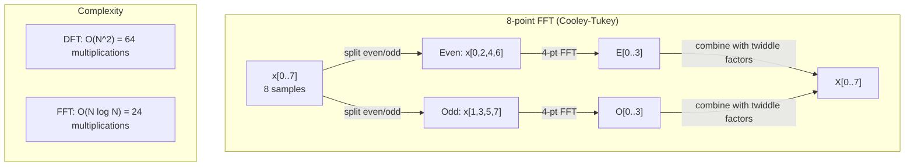
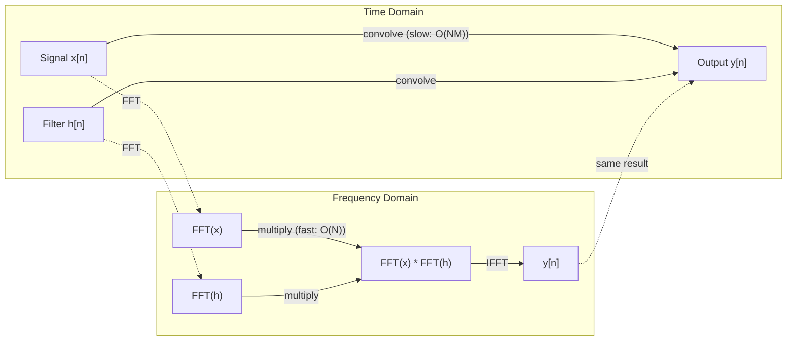

# 傅里叶变换

> 每一个信号都是长波的总和。傅里叶变换告诉您哪些。

** 类型：** 构建
** 语言：** Python
** 先决条件：** 第1阶段，课程01-04，19（复数）
** 时间：** ~90分钟

## 学习目标

- 从头开始实施离散傅立叶变换，并针对O（N log N）Cooley-Tukey快速傅立叶变换进行验证
- 解释频率系数：从信号中提取幅度、相和功率谱
- 应用卷积定理通过快速傅里叶变换进行卷积
- 将傅里叶频率分解连接到Transformer位置编码和CNN卷积层

## 问题

音频记录是一段时间内的压力测量序列。股价是几天内的价值序列。图像是空间上像素强度的网格。所有这些都是时间域（或空间域）中的数据。您会看到值随着某个指数而变化。

但许多模式在时间域中是不可见的。此音频信号是纯音调还是和弦？这个股价有周周期吗？此图像是否具有重复纹理？这些问题与频率内容有关，而时间域隐藏了它。

傅里叶变换将数据从时间域转换到频域。它获取信号并将其分解为不同频率的长波。每个长波都有一个幅度（有多强）和一个相（开始的位置）。傅里叶变换告诉您这两个。

这对ML很重要，因为频域思维无处不在。卷积神经网络执行卷积，即频域中的相乘。Transformer位置编码使用频率分解来表示位置。音频模型（语音识别、音乐生成）对频谱图（声音的频率表示）进行操作。时间序列模型寻找周期性模式。了解傅里叶变换可以为您提供处理所有这些内容的词汇。

## 概念

### FT定义

给定N个样本x[0]，x[1]，.，x[N-1]，离散傅里叶变换产生N个频率系数X[0]、X[1]、.、X[N-1]：

```
X[k] = sum_{n=0}^{N-1} x[n] * e^(-2*pi*i*k*n/N)

for k = 0, 1, ..., N-1
```

每个X[k]都是一个复数。其幅度|X[k]|告诉您频率k的幅度。其相差角（X[k]）告诉您该频率的相差。

关键见解：' e '（-2*pi*i*k*n/N）'是频率k的旋转相量。FT计算信号与N个等距频率中的每个频率之间的相关性。如果信号包含频率k的能量，则相关性很大。如果没有，则接近零。

### 每个系数意味着什么

**X[0]：DC分量。**这是所有样本的总和--与平均值成正比。它代表信号的恒定（零频率）偏差。

```
X[0] = sum_{n=0}^{N-1} x[n] * e^0 = sum of all samples
```

**X[k] for 1 <= k <= N/2：正频率。** X[k]表示每N个样本的k个频率周期。k越高意味着频率越高（振荡越快）。

**X[N/2]：奈奎斯特频率。**可以用N个样本表示的最高频率。在此之上，就会出现混叠--高频伪装成低频。

**X[k]，N/2 < k < N：负频率。**对于实值信号，X[N-k] = conj（X[k]）。负频率是正频率的镜像。这就是为什么有用信息位于前N/2 + 1个系数中。

### 逆DFT

逆离散傅立叶从其频率系数重建原始信号：

```
x[n] = (1/N) * sum_{k=0}^{N-1} X[k] * e^(2*pi*i*k*n/N)

for n = 0, 1, ..., N-1
```

与正向FT的唯一区别：指数中的符号是正的（不是负的），并且有1/N正规化因子。

逆离散傅立叶变换是完美的重建。没有信息丢失。您可以从时间域到频率域然后返回，没有任何错误。FT是基础的改变--它在不同的坐标系中重新表达相同的信息。

### 快速傅立叶变换：让它变得更快

上面定义的离散傅立叶是O（N ' 2）：对于N个输出系数中的每一个，您对N个输入样本进行总和。对于N = 100万，即10#12次操作。

快速傅里叶变换（FT）以O（N log N）计算相同的结果。对于N = 100万次，大约是2000万次操作，而不是1万亿次。这就是频率分析实用的原因。

Cooley-Tukey算法（最常见的快速傅里叶变换）的工作原理是分而治之的：

1. 将信号拆分为偶数索引样本和奇数索引样本。
2. 迭代计算每一半的FT。
3. 使用“旋转因子”e '（-2*pi*i*k/N）将两个半尺寸的FT合并。

```
X[k] = E[k] + e^(-2*pi*i*k/N) * O[k]          for k = 0, ..., N/2 - 1
X[k + N/2] = E[k] - e^(-2*pi*i*k/N) * O[k]    for k = 0, ..., N/2 - 1

where E = DFT of even-indexed samples
      O = DFT of odd-indexed samples
```

对称性意味着每个级别的迭代都进行O（N）工作，并且有log 2（N）级别。总数：O（N log N）。



FFT要求信号长度为2的幂。实际上，信号被零填充到2的下一个幂。

### 光谱分析

** 功率谱 ** 是|X[k]|#2--每个频率系数的平方幅度。它显示了每个频率下的能量。

** 相谱 ** 是角度（X[k]）--每个频率的相差。对于大多数分析任务，您关心功率谱而忽略了阶段。

```
Power at frequency k:  P[k] = |X[k]|^2 = X[k].real^2 + X[k].imag^2
Phase at frequency k:  phi[k] = atan2(X[k].imag, X[k].real)
```

### 频率分辨率

FT的频率分辨率取决于样本数量N和采样率fs。

```
Frequency of bin k:      f_k = k * fs / N
Frequency resolution:    delta_f = fs / N
Maximum frequency:       f_max = fs / 2  (Nyquist)
```

要解析两个靠近的频率，您需要更多样本。要捕获高频，您需要更高的采样率。

### 卷积定理

这是信号处理中最重要的结果之一，并且与CNN直接相关。

** 时间域中的卷积等于频域中的逐点相乘。**

```
x * h = IFFT(FFT(x) . FFT(h))

where * is convolution and . is element-wise multiplication
```

为什么这很重要：

- 两个长度为N和M的信号的直接卷积需要O（N*M）运算。
- 基于快速傅立叶变换的卷积需要O（N log N）：两者变换、相乘、变换回来。
- 对于大型内核，快速傅里叶变换卷积速度要快得多。
- 这正是具有大感受野的卷积层中发生的情况。

注意：FT计算循环卷积（信号环绕）。对于线性卷积（无迂回），在计算之前将两个信号调零至长度N + M - 1。



### 加窗

DFT假设信号是周期性的-它将N个样本视为无限重复信号的一个周期。如果信号的开始和结束值不同，则会在边界处产生不连续性，表现为杂散高频成分。这被称为频谱泄漏。

窗口通过在计算离散傅立叶之前将两端的信号逐渐缩减为零来减少泄漏。

常见窗口：

| 窗口 | 形状 | 主瓣宽度 | 旁瓣电平 | 用例 |
|--------|-------|----------------|-----------------|----------|
| 矩形 | 平（无窗） | 最窄 | 最高（-13分贝） | 当信号在N个样本中完全是周期性的时 |
| Hann | 升余弦 | 中度 | 低（-31 dB） | 通用光谱分析 |
| 汉明 | 修改的cos | 中度 | 较低（-42分贝） | 音频处理、语音分析 |
| 布莱克曼 | 三重cos | 宽 | 极低（-58分贝） | 当副瓣抑制至关重要时 |

```
Hann window:    w[n] = 0.5 * (1 - cos(2*pi*n / (N-1)))
Hamming window: w[n] = 0.54 - 0.46 * cos(2*pi*n / (N-1))
```

通过将窗口按元素乘以FT之前的信号来应用窗口：“X = FT（x * w）”。

### FT性质

| 财产 | 时域 | 频域 |
|----------|-------------|-----------------|
| 线性 | a*x + b*y | a*X + b*Y |
| 时移 | x[n-k] | X[f] * e '（-2*pi*i*f*k/N） |
| 频移 | x[n] * e_（2*pi*i*f0*n/N） | X[f - f0] |
| 卷积 | x * h | X * H（逐点） |
| 乘法 | x * h（逐点） | X * H（循环卷积，按1/N缩放） |
| 帕塞瓦尔定理 | 总和\ | x[n]\ | #2 | （1/N）* sum \ | X[k]\ | #2 |
| 偶联对称（真实输入） | x[n]真实 | X[k] = conj（X[N-k]） |

帕西瓦尔定理认为，两个域的总能量相同。能量通过转化被节约。

### 与位置编码的连接

原始的Transformer使用sin位置编码：

```
PE(pos, 2i)   = sin(pos / 10000^(2i/d_model))
PE(pos, 2i+1) = cos(pos / 10000^(2i/d_model))
```

每个维度对（2 i，2 i +1）以不同的频率振荡。频率在几何上间隔从高（维度0，1）到低（最后维度）。这为每个位置在所有频段上提供了独特的模式--类似于傅里叶系数唯一识别信号的方式。

它提供的关键属性：

- ** 唯一性：** 没有两个位置具有相同的编码。
- ** 有界值：** sin和cos始终在[-1，1]中。
- ** 相对位置：** 位置p+k的编码可以表示为位置p处编码的线性函数。模型可以学习关注相对位置。

### 连接CNN

卷积层通过在信号或图像上滑动来将学习过滤器（内核）应用于输入。从数学上讲，这是卷积运算。

根据卷积定理，这相当于：
1. 对输入进行快速傅里叶变换
2. 快速傅里叶变换核心
3. 频域相乘
4. IFS结果

标准CNN实现使用直接卷积（对于小型3x 3内核来说速度更快）。但对于大型核或全局卷积，基于快速傅里叶变换的方法要快得多。一些架构（例如FNet）完全用快速傅立叶变换取代了人们的注意力，以O（N log N）而不是O（N2）复杂性实现了有竞争力的准确性。

### 光谱图和短期傅里叶变换

单个快速傅里叶变换会为您提供整个信号的频率内容，但不会告诉您这些频率何时出现。啁啾（频率随时间增加的信号）和和弦（所有频率同时存在）可以具有相同的幅度频谱。

短期傅里叶变换（STFT）通过计算信号重叠窗口上的快速傅里叶变换来解决这个问题。结果是频谱图：一个2D表示，一个轴上是时间，另一个轴上是频率。每个点的强度显示了当时该频率下的能量。

```
STFT procedure:
1. Choose a window size (e.g., 1024 samples)
2. Choose a hop size (e.g., 256 samples -- 75% overlap)
3. For each window position:
   a. Extract the windowed segment
   b. Apply a Hann/Hamming window
   c. Compute FFT
   d. Store the magnitude spectrum as one column of the spectrogram
```

频谱图是音频ML模型的标准输入表示。语音识别模型（Whisper、DeepSpeech）在梅尔频谱图上运行--频率映射到梅尔标度的频谱图，这更好地匹配人类的音调感知。

### 混叠

如果信号包含高于fs/2（奈奎斯特频率）的频率，则以速率fs进行采样将创建混叠副本。以100 Hz采样的90 Hz信号看起来与10 Hz信号相同。无法单独将它们与样本区分开来。

```
Example:
  True signal: 90 Hz sine wave
  Sampling rate: 100 Hz
  Apparent frequency: 100 - 90 = 10 Hz

  The samples from the 90 Hz signal at 100 Hz sampling rate
  are identical to the samples from a 10 Hz signal.
  No amount of math can recover the original 90 Hz.
```

这就是为什么模/数转换器包含抗混叠过滤器，可以在采样前去除奈奎斯特以上的频率。在ML中，在没有适当低通过滤的情况下对特征地图进行下采样时会出现锯齿--一些体系结构通过抗锯齿池层来解决这个问题。

### 零填充不会提高分辨率

一个常见的误解：在快速傅里叶变换之前对信号进行零填充可以提高频率分辨率。事实并非如此。补零在现有频率段之间进行插值，为您提供看起来更平滑的频谱。但它无法揭示原始样本中不存在的频率细节。

真正的频率分辨率仅取决于观察时间T = N / fs。要解析由delta_f分开的两个频率，您至少需要T = 1 / delta_f秒的数据。再多的零填充也无法改变这一基本限制。

## 建设党

### 第1步：从头开始FT

O（N#2）DF直接源自定义。

```python
import math

class Complex:
    ...

def dft(x):
    N = len(x)
    result = []
    for k in range(N):
        total = Complex(0, 0)
        for n in range(N):
            angle = -2 * math.pi * k * n / N
            w = Complex(math.cos(angle), math.sin(angle))
            xn = x[n] if isinstance(x[n], Complex) else Complex(x[n])
            total = total + xn * w
        result.append(total)
    return result
```

### 第2步：逆离散傅立叶变换

结构相同，正指数，除以N。

```python
def idft(X):
    N = len(X)
    result = []
    for n in range(N):
        total = Complex(0, 0)
        for k in range(N):
            angle = 2 * math.pi * k * n / N
            w = Complex(math.cos(angle), math.sin(angle))
            total = total + X[k] * w
        result.append(Complex(total.real / N, total.imag / N))
    return result
```

### 步骤3：FFT（Cooley-Tukey）

循环傅立叶变换需要2的乘方长度。分裂为偶数和奇数，循环，结合旋转因子。

```python
def fft(x):
    N = len(x)
    if N <= 1:
        return [x[0] if isinstance(x[0], Complex) else Complex(x[0])]
    if N % 2 != 0:
        return dft(x)

    even = fft([x[i] for i in range(0, N, 2)])
    odd = fft([x[i] for i in range(1, N, 2)])

    result = [Complex(0)] * N
    for k in range(N // 2):
        angle = -2 * math.pi * k / N
        twiddle = Complex(math.cos(angle), math.sin(angle))
        t = twiddle * odd[k]
        result[k] = even[k] + t
        result[k + N // 2] = even[k] - t
    return result
```

### 步骤4：光谱分析助手

```python
def power_spectrum(X):
    return [xk.real ** 2 + xk.imag ** 2 for xk in X]

def convolve_fft(x, h):
    N = len(x) + len(h) - 1
    padded_N = 1
    while padded_N < N:
        padded_N *= 2

    x_padded = x + [0.0] * (padded_N - len(x))
    h_padded = h + [0.0] * (padded_N - len(h))

    X = fft(x_padded)
    H = fft(h_padded)

    Y = [xk * hk for xk, hk in zip(X, H)]

    y = idft(Y)
    return [y[n].real for n in range(N)]
```

## 使用它

对于实际工作，请使用numpy的快速傅立叶变换，该傅立叶变换由高度优化的C库支持。

```python
import numpy as np

signal = np.sin(2 * np.pi * 5 * np.arange(256) / 256)
spectrum = np.fft.fft(signal)
freqs = np.fft.fftfreq(256, d=1/256)

power = np.abs(spectrum) ** 2

positive_freqs = freqs[:len(freqs)//2]
positive_power = power[:len(power)//2]
```

对于窗口化和更高级的光谱分析：

```python
from scipy.signal import windows, stft

window = windows.hann(256)
windowed = signal * window
spectrum = np.fft.fft(windowed)
```

对于卷积：

```python
from scipy.signal import fftconvolve

result = fftconvolve(signal, kernel, mode='full')
```

对于光谱图：

```python
from scipy.signal import stft

frequencies, times, Zxx = stft(signal, fs=sample_rate, nperseg=256)
spectrogram = np.abs(Zxx) ** 2
```

频谱图矩阵具有形状（n_frequencies，n_time_frames）。每列都是一个时间窗口的功率谱。这就是音频ML模型作为输入消耗的内容。

## 把它运

运行' code/fourier.py '以生成'输出/prompt-spectral-analyzer.md '。

## 演习

1. ** 纯音识别。**用未知频率（1至50 Hz之间）的单个中频创建信号，以128 Hz采样1秒。使用您的离散傅立叶来识别频率。验证答案是否匹配。现在添加标准差0.5的高斯噪音并重复。噪音如何影响频谱？

2. ** 快速傅里叶变换与傅里叶变换验证。**生成长度为64的随机信号。计算FT（O（N^2））和FT。验证所有系数是否匹配在1 e-10内。时间都对长度为256、512、1024和2048的信号起作用。绘制DFT时间与FFT时间之比。

3. ** 通过例子证明卷积定理。**创建信号x = [1，2，3，4，0，0，0，0]和过滤器h = [1，1，1，0，0，0，0，0]。直接计算它们的循环卷积（嵌套循环）。然后通过快速傅立叶变换（变换、乘、逆变换）计算它。验证结果是否匹配。现在通过适当的零填充进行线性卷积。

4. ** 窗口效果。**创建一个10 Hz和12 Hz（非常接近）的两个长波之和的信号。以128 Hz采样1秒。计算无窗口、Hann窗口和Hamming窗口的功率谱。哪个窗口最容易区分两个峰值？为什么？

5. ** 位置编码分析。**生成d_mode = 128和max_pos = 512的sin位置编码。对于每对位置（p1，p2），计算其编码的点积。表明点积仅取决于|P1 - P2|，不是关于绝对位置。随着距离的增加，点积会发生什么？

## 关键术语

| Term | 意味着什么 |
|------|---------------|
| 离散傅里叶变换 | 将N个时间域样本初始化为N个频域系数。每个系数都是与该频率下的复中频的相关性 |
| 快速傅里叶变换 | 一种O（N log N）算法来计算离散傅立叶变换。Cooley-Tukey算法将偶数/奇数索引循环拆分 |
| 逆DFT | 根据频率系数重建时间域信号。与具有翻转指数符号和1/N缩放的FT公式相同 |
| 频率区间 | FT输出中的每个索引k表示频率k*fs/NHz。“bin”是离散频槽 |
| DC分量 | X[0]，零频率系数。与信号平均值成正比 |
| 奈奎斯特频率 | fs/2，采样率fs可表示的最大频率。此别名以上的频率 |
| 功率谱 | \ | X[k]\ | #2，每个频率系数的平方幅度。显示跨频率的能量分布 |
| 相位谱 | 角度（X[k]），即每个频率分量的相差。分析中经常被忽视 |
| 频谱泄漏 | 将非周期信号视为周期信号而引起的杂散频率内容。通过窗口减少 |
| 窗函数 | 在FT之前应用渐缩函数（Hann、Hamming、Blackman）以减少频谱泄漏 |
| 旋转因子 | 复指数e '（-2*pi*i*k/N）用于组合快速傅里叶变换器在快速傅里叶变换中 |
| 卷积定理 | 时间域中的卷积等于频域中的逐点相乘。信号处理和CNN的基础 |
| 循环卷积 | 卷积，信号环绕。这是DFT自然计算的 |
| 线性卷积 | 没有环绕的标准卷积。通过FT前补零实现 |
| 帕塞瓦尔定理 | 总能量通过傅里叶变换保存。总和\ | x[n]\ | #2 =（1/N）总和\ | X[k]\ | #2 |
| 混叠 | 当奈奎斯特以上的频率由于采样率不足而显示为较低的频率时 |

## 进一步阅读

- [库利和图基：复傅里叶数列机器计算的算法（1965）]（https：//www.ams.org/journals/mcom/1965-19-090/S0025-5718-1965-0178586-1/）-改变计算的原始快速傅里叶数列论文
- [3Blue 1 Brown：但是什么是傅里叶变换？]（https：www.youtube.com/watch? v= spUNpyF 58 BY）-傅里叶变换的最佳视觉介绍
- [Lee-Thorp等人：FNet：将令牌与傅立叶变换混合（2021）]（https：//arxiv.org/abs/2105.03824）-在变压器中用FFT取代自我注意力
- [史密斯：科学家和工程师数字信号处理指南]（http：//www.dspguide.com/）-免费在线教科书，深入涵盖了快速傅里叶变换、窗口化和频谱分析
- [瓦斯瓦尼等人：Attention Is All You Need（2017）]（https：//arxiv.org/abs/1706.03762）-从傅立叶频率分解导出的正弦位置编码
- [雷德福等人：Whisper（2022）]（https：//arxiv.org/ab/2212.04356）-使用mel频谱图作为输入表示的语音识别
