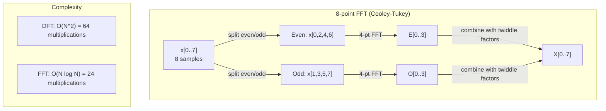
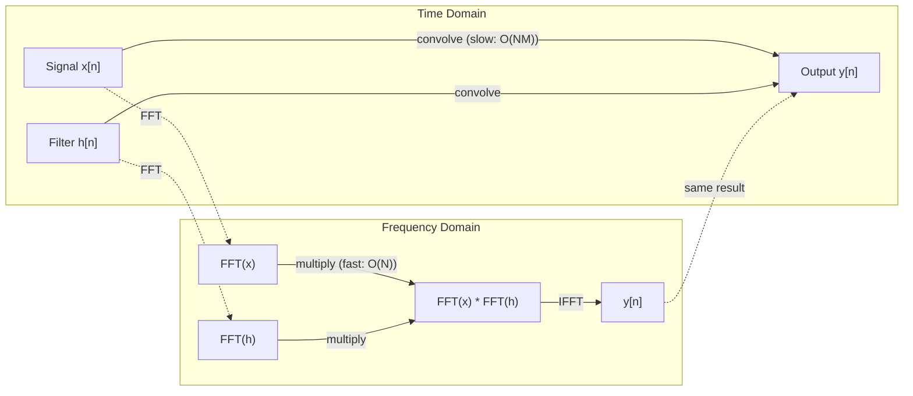

# 傅立葉轉換

> 每個訊號都是正弦波的總和。傅立葉轉換告訴你是哪些正弦波。

**類型：** 實作
**程式語言：** Python
**先修單元：** 階段 1 · 單元 01-04、19（複數）
**時間：** 約 90 分鐘

## 學習目標

- 從零實作 DFT，並拿它跟 O(N log N) 的 Cooley-Tukey FFT 對照驗證
- 解讀頻率係數：從訊號中取出振幅、相位與功率頻譜
- 運用摺積定理，改用 FFT 相乘來完成摺積
- 把傅立葉的頻率分解，連結到 Transformer 的位置編碼與 CNN 的摺積層

## 問題所在

一段錄音是隨時間變化的一連串壓力測量值。一檔股價是隨天數變化的一連串數值。一張影像是隨空間分布的像素強度網格。這些全都是時域（或空間域）的資料——你看到的是數值隨某個索引改變。

但很多樣態在時域裡是看不見的。這段音訊是單一純音還是一個和弦？這檔股價有沒有週循環？這張影像有沒有重複的紋理？這些問題問的都是頻率成分，而時域把它藏起來了。

傅立葉轉換把資料從時域轉到頻域。它接收一個訊號，把它分解成不同頻率的正弦波。每個正弦波都有振幅（有多強）和相位（從哪裡開始）。傅立葉轉換兩者都告訴你。

這對 ML 很重要，因為頻域思維到處都在。摺積神經網路做的摺積，就是頻域裡的相乘。Transformer 的位置編碼用頻率分解來表示位置。音訊模型（語音辨識、音樂生成）作用在頻譜圖上——也就是聲音的頻率表示法。時間序列模型則在找週期性的樣態。搞懂傅立葉轉換，你才有處理這一切的語彙。

## 核心概念

### DFT 的定義

給定 N 個樣本 x[0], x[1], ..., x[N-1]，離散傅立葉轉換（Discrete Fourier Transform）會產生 N 個頻率係數 X[0], X[1], ..., X[N-1]：

```
X[k] = sum_{n=0}^{N-1} x[n] * e^(-2*pi*i*k*n/N)

for k = 0, 1, ..., N-1
```

每個 X[k] 都是複數。它的大小 |X[k]| 告訴你頻率 k 的振幅，它的相位角 angle(X[k]) 則告訴你該頻率的相位偏移。

關鍵洞見：`e^(-2*pi*i*k*n/N)` 是一個以頻率 k 旋轉的相量。DFT 計算的是訊號與 N 個等間距頻率各自的相關性。訊號在頻率 k 上有能量，相關性就大；沒有的話就趨近於零。

### 每個係數代表什麼

**X[0]：DC 成分。** 這是所有樣本的總和——與平均值成正比。它代表訊號的常數（零頻率）偏移。

```
X[0] = sum_{n=0}^{N-1} x[n] * e^0 = sum of all samples
```

**1 <= k <= N/2 的 X[k]：正頻率。** X[k] 代表每 N 個樣本 k 個週期的頻率。k 越大表示頻率越高（振盪越快）。

**X[N/2]：奈奎斯特頻率。** N 個樣本能表示的最高頻率。超過這個頻率，你就會得到疊頻——高頻假冒成低頻。

**N/2 < k < N 的 X[k]：負頻率。** 對實數值訊號來說，X[N-k] = conj(X[k])。負頻率是正頻率的鏡像。這就是為什麼有用的資訊都在前 N/2 + 1 個係數裡。

### 反 DFT

反 DFT 從頻率係數重建出原始訊號：

```
x[n] = (1/N) * sum_{k=0}^{N-1} X[k] * e^(2*pi*i*k*n/N)

for n = 0, 1, ..., N-1
```

跟正向 DFT 只差兩點：指數的符號是正的（不是負的），而且多了一個 1/N 的正規化因子。

反 DFT 是完美重建，沒有任何資訊流失。你可以從時域走到頻域再走回來，過程中不產生任何誤差。DFT 是一次基底變換——它把同樣的資訊用另一個座標系統重新表達。

### FFT：讓它變快

上面定義的 DFT 是 O(N^2)：N 個輸出係數，每一個都要對 N 個輸入樣本加總。N = 100 萬時，那是 10^12 次運算。

快速傅立葉轉換（FFT）用 O(N log N) 算出一樣的結果。N = 100 萬時，那是大約 2000 萬次運算，而不是一兆次。頻率分析之所以實用，就靠這個。

Cooley-Tukey 演算法（最常見的 FFT）靠的是分而治之：

1. 把訊號拆成偶數索引與奇數索引的樣本。
2. 遞迴地各算一半的 DFT。
3. 用「旋轉因子」e^(-2*pi*i*k/N) 把兩個半長度的 DFT 合併起來。

```
X[k] = E[k] + e^(-2*pi*i*k/N) * O[k]          for k = 0, ..., N/2 - 1
X[k + N/2] = E[k] - e^(-2*pi*i*k/N) * O[k]    for k = 0, ..., N/2 - 1

where E = DFT of even-indexed samples
      O = DFT of odd-indexed samples
```

這個對稱性讓每一層遞迴只做 O(N) 的工作，而總共有 log2(N) 層。合計：O(N log N)。


```mermaid
graph TD
    subgraph "8-point FFT (Cooley-Tukey)"
        X["x[0..7]<br/>8 samples"] -->|"split even/odd"| E["Even: x[0,2,4,6]"]
        X -->|"split even/odd"| O["Odd: x[1,3,5,7]"]
        E -->|"4-pt FFT"| EK["E[0..3]"]
        O -->|"4-pt FFT"| OK["O[0..3]"]
        EK -->|"combine with twiddle factors"| XK["X[0..7]"]
        OK -->|"combine with twiddle factors"| XK
    end
    subgraph "Complexity"
        C1["DFT: O(N^2) = 64 multiplications"]
        C2["FFT: O(N log N) = 24 multiplications"]
    end
```

FFT 要求訊號長度是 2 的次方。實務上，訊號會補零到下一個 2 的次方。

### 頻譜分析

**功率頻譜**是 |X[k]|^2——每個頻率係數大小的平方。它顯示每個頻率上有多少能量。

**相位頻譜**是 angle(X[k])——每個頻率的相位偏移。大部分分析任務裡，你在意的是功率頻譜，相位可以忽略。

```
Power at frequency k:  P[k] = |X[k]|^2 = X[k].real^2 + X[k].imag^2
Phase at frequency k:  phi[k] = atan2(X[k].imag, X[k].real)
```

### 頻率解析度

DFT 的頻率解析度取決於樣本數 N 與取樣率 fs。

```
Frequency of bin k:      f_k = k * fs / N
Frequency resolution:    delta_f = fs / N
Maximum frequency:       f_max = fs / 2  (Nyquist)
```

要分辨兩個很接近的頻率，你需要更多樣本。要捕捉高頻，你需要更高的取樣率。

### 摺積定理

這是訊號處理裡最重要的結果之一，而且跟 CNN 直接相關。

**時域裡的摺積，等於頻域裡的逐點相乘。**

```
x * h = IFFT(FFT(x) . FFT(h))

where * is convolution and . is element-wise multiplication
```

為什麼這件事重要：

- 直接對長度 N 與 M 的兩個訊號做摺積要 O(N*M) 次運算。
- 基於 FFT 的摺積只要 O(N log N)：兩邊都轉換、相乘、再轉回來。
- 對大的核來說，FFT 摺積快得非常明顯。
- 這正是感受野很大的摺積層裡發生的事。

注意：DFT 算的是循環摺積（訊號會繞回來）。要做線性摺積（不繞回），先把兩個訊號都補零到長度 N + M - 1 再算。


```mermaid
graph LR
    subgraph "Time Domain"
        TA["Signal x[n]"] -->|"convolve (slow: O(NM))"| TC["Output y[n]"]
        TB["Filter h[n]"] -->|"convolve"| TC
    end
    subgraph "Frequency Domain"
        FA["FFT(x)"] -->|"multiply (fast: O(N))"| FC["FFT(x) * FFT(h)"]
        FB["FFT(h)"] -->|"multiply"| FC
        FC -->|"IFFT"| FD["y[n]"]
    end
    TA -.->|"FFT"| FA
    TB -.->|"FFT"| FB
    FD -.->|"same result"| TC
```

### 加窗

DFT 假設訊號是週期的——它把這 N 個樣本當成一個無限重複訊號的其中一個週期。如果訊號的頭尾數值不同，邊界處就會產生不連續，這會表現成假的高頻成分。這叫頻譜洩漏。

加窗的做法是在算 DFT 前，把訊號兩端漸縮到零，藉此減少洩漏。

常見的窗函數：

| 窗函數 | 形狀 | 主瓣寬度 | 側瓣大小 | 使用時機 |
|--------|-------|----------------|-----------------|----------|
| 矩形 | 平的（等於不加窗） | 最窄 | 最高（-13 dB） | 訊號在 N 個樣本內剛好是週期的 |
| Hann | 升餘弦 | 中等 | 低（-31 dB） | 通用頻譜分析 |
| Hamming | 修正餘弦 | 中等 | 更低（-42 dB） | 音訊處理、語音分析 |
| Blackman | 三重餘弦 | 寬 | 非常低（-58 dB） | 抑制側瓣特別關鍵時 |

```
Hann window:    w[n] = 0.5 * (1 - cos(2*pi*n / (N-1)))
Hamming window: w[n] = 0.54 - 0.46 * cos(2*pi*n / (N-1))
```

加窗的方式是在 DFT 之前把它跟訊號逐元素相乘：`X = DFT(x * w)`。

### DFT 的性質

| 性質 | 時域 | 頻域 |
|----------|-------------|-----------------|
| 線性 | a*x + b*y | a*X + b*Y |
| 時間位移 | x[n - k] | X[f] * e^(-2*pi*i*f*k/N) |
| 頻率位移 | x[n] * e^(2*pi*i*f0*n/N) | X[f - f0] |
| 摺積 | x * h | X * H（逐點） |
| 相乘 | x * h（逐點） | X * H（循環摺積，並以 1/N 縮放） |
| Parseval 定理 | sum \|x[n]\|^2 | (1/N) * sum \|X[k]\|^2 |
| 共軛對稱（實數輸入） | x[n] 為實數 | X[k] = conj(X[N-k]) |

Parseval 定理說的是：總能量在兩個域裡是一樣的。能量在轉換過程中守恆。

### 與位置編碼的連結

最初的 Transformer 用的是正弦式位置編碼：

```
PE(pos, 2i)   = sin(pos / 10000^(2i/d_model))
PE(pos, 2i+1) = cos(pos / 10000^(2i/d_model))
```

每一組維度對 (2i, 2i+1) 都以不同的頻率振盪。這些頻率以幾何級數排列，從高頻（維度 0,1）到低頻（最後幾個維度）。這讓每個位置在所有頻帶上都有一個獨一無二的樣態——就像傅立葉係數能唯一標識一個訊號那樣。

它提供的關鍵性質：

- **唯一性：** 沒有兩個位置的編碼會相同。
- **值域有界：** sin 與 cos 永遠落在 [-1, 1]。
- **相對位置：** 位置 p+k 的編碼可以寫成位置 p 編碼的線性函式。模型因此能學會關注相對位置。

### 與 CNN 的連結

摺積層的做法，是把一個學到的濾波器（核）沿著訊號或影像滑動，作用在輸入上。從數學上看，這就是摺積運算。

依摺積定理，這等價於：
1. 對輸入做 FFT
2. 對核做 FFT
3. 在頻域相乘
4. 對結果做 IFFT

標準的 CNN 實作用的是直接摺積（對 3x3 這種小核比較快）。但對大的核或全域摺積，基於 FFT 的做法明顯更快。有些架構（像 FNet）乾脆用 FFT 完全取代注意力機制，以 O(N log N) 而非 O(N^2) 的複雜度達到有競爭力的準確率。

### 頻譜圖與短時傅立葉轉換

單一次 FFT 給你的是整段訊號的頻率成分，卻完全沒告訴你這些頻率是何時出現的。一個掃頻訊號（頻率隨時間上升）和一個和弦（所有頻率同時出現）可以有一樣的大小頻譜。

短時傅立葉轉換（STFT）的解法，是在訊號上一段段重疊的視窗各算一次 FFT。結果就是頻譜圖：一種 2D 表示法，一軸是時間、另一軸是頻率。每個點的強度代表該時刻該頻率上的能量。

```
STFT procedure:
1. Choose a window size (e.g., 1024 samples)
2. Choose a hop size (e.g., 256 samples -- 75% overlap)
3. For each window position:
   a. Extract the windowed segment
   b. Apply a Hann/Hamming window
   c. Compute FFT
   d. Store the magnitude spectrum as one column of the spectrogram
```

頻譜圖是音訊 ML 模型的標準輸入表示法。語音辨識模型（Whisper、DeepSpeech）作用在梅爾頻譜圖上——也就是把頻率映射到梅爾刻度的頻譜圖，那更接近人類對音高的感知。

### 疊頻

如果訊號含有高於 fs/2（奈奎斯特頻率）的頻率，以 fs 取樣就會產生假訊號的副本。90 Hz 的訊號以 100 Hz 取樣，看起來和 10 Hz 的訊號一模一樣。單憑樣本，沒有辦法把它們分開。

```
Example:
  True signal: 90 Hz sine wave
  Sampling rate: 100 Hz
  Apparent frequency: 100 - 90 = 10 Hz

  The samples from the 90 Hz signal at 100 Hz sampling rate
  are identical to the samples from a 10 Hz signal.
  No amount of math can recover the original 90 Hz.
```

這就是為什麼類比數位轉換器會內建抗疊頻濾波器，在取樣前先濾掉高於奈奎斯特的頻率。在 ML 裡，對特徵圖降採樣而沒有適當低通濾波時就會出現疊頻——有些架構用抗疊頻的池化層來處理這件事。

### 補零並不會提高解析度

一個常見的誤解：FFT 前把訊號補零可以改善頻率解析度。並不會。補零只是在既有的頻率 bin 之間做內插，讓頻譜看起來比較平滑。它沒辦法揭露原始樣本裡本來就不存在的頻率細節。

真正的頻率解析度只取決於觀測時間 T = N / fs。要分辨相隔 delta_f 的兩個頻率，你至少需要 T = 1 / delta_f 秒的資料。補多少零都改變不了這個根本的極限。

```figure
fourier-synthesis
```

## 動手實作

### 步驟 1：從零寫 DFT

O(N^2) 的 DFT 直接照定義寫出來就是了。

```python
import math

class Complex:
    ...

def dft(x):
    N = len(x)
    result = []
    for k in range(N):
        total = Complex(0, 0)
        for n in range(N):
            angle = -2 * math.pi * k * n / N
            w = Complex(math.cos(angle), math.sin(angle))
            xn = x[n] if isinstance(x[n], Complex) else Complex(x[n])
            total = total + xn * w
        result.append(total)
    return result
```

### 步驟 2：反 DFT

結構一樣，指數取正，最後除以 N。

```python
def idft(X):
    N = len(X)
    result = []
    for n in range(N):
        total = Complex(0, 0)
        for k in range(N):
            angle = 2 * math.pi * k * n / N
            w = Complex(math.cos(angle), math.sin(angle))
            total = total + X[k] * w
        result.append(Complex(total.real / N, total.imag / N))
    return result
```

### 步驟 3：FFT（Cooley-Tukey）

遞迴版 FFT 要求長度是 2 的次方。拆成偶數與奇數、遞迴下去、再用旋轉因子合併。

```python
def fft(x):
    N = len(x)
    if N <= 1:
        return [x[0] if isinstance(x[0], Complex) else Complex(x[0])]
    if N % 2 != 0:
        return dft(x)

    even = fft([x[i] for i in range(0, N, 2)])
    odd = fft([x[i] for i in range(1, N, 2)])

    result = [Complex(0)] * N
    for k in range(N // 2):
        angle = -2 * math.pi * k / N
        twiddle = Complex(math.cos(angle), math.sin(angle))
        t = twiddle * odd[k]
        result[k] = even[k] + t
        result[k + N // 2] = even[k] - t
    return result
```

### 步驟 4：頻譜分析的輔助函式

```python
def power_spectrum(X):
    return [xk.real ** 2 + xk.imag ** 2 for xk in X]

def convolve_fft(x, h):
    N = len(x) + len(h) - 1
    padded_N = 1
    while padded_N < N:
        padded_N *= 2

    x_padded = x + [0.0] * (padded_N - len(x))
    h_padded = h + [0.0] * (padded_N - len(h))

    X = fft(x_padded)
    H = fft(h_padded)

    Y = [xk * hk for xk, hk in zip(X, H)]

    y = idft(Y)
    return [y[n].real for n in range(N)]
```

## 框架應用

真的要做事，就用 numpy 的 FFT，它背後是高度最佳化的 C 函式庫。

```python
import numpy as np

signal = np.sin(2 * np.pi * 5 * np.arange(256) / 256)
spectrum = np.fft.fft(signal)
freqs = np.fft.fftfreq(256, d=1/256)

power = np.abs(spectrum) ** 2

positive_freqs = freqs[:len(freqs)//2]
positive_power = power[:len(power)//2]
```

加窗與更進階的頻譜分析：

```python
from scipy.signal import windows, stft

window = windows.hann(256)
windowed = signal * window
spectrum = np.fft.fft(windowed)
```

摺積：

```python
from scipy.signal import fftconvolve

result = fftconvolve(signal, kernel, mode='full')
```

頻譜圖：

```python
from scipy.signal import stft

frequencies, times, Zxx = stft(signal, fs=sample_rate, nperseg=256)
spectrogram = np.abs(Zxx) ** 2
```

頻譜圖矩陣的形狀是 (n_frequencies, n_time_frames)。每一欄是某個時間視窗的功率頻譜。這就是音訊 ML 模型吃進去的輸入。

## 產出交付

執行 `code/fourier.py` 來產生 `outputs/prompt-spectral-analyzer.md`。

## 練習

1. **辨識純音。** 建立一個只含單一正弦波的訊號，頻率未知（在 1 到 50 Hz 之間），以 128 Hz 取樣 1 秒。用你的 DFT 找出這個頻率，並驗證答案吻合。接著加入標準差 0.5 的高斯雜訊再做一次。雜訊對頻譜有什麼影響？

2. **FFT 對 DFT 的驗證。** 產生一個長度 64 的隨機訊號。同時算 DFT（O(N^2)）與 FFT，驗證所有係數的差都在 1e-10 以內。對長度 256、512、1024、2048 的訊號各測兩個函式的執行時間，把 DFT 時間與 FFT 時間的比值畫出來。

3. **用例子證明摺積定理。** 建立訊號 x = [1, 2, 3, 4, 0, 0, 0, 0] 與濾波器 h = [1, 1, 1, 0, 0, 0, 0, 0]。先直接算它們的循環摺積（雙層迴圈），再用 FFT 算一次（轉換、相乘、反轉換），驗證結果一致。接著適當補零，做出線性摺積。

4. **加窗的效果。** 建立一個由 10 Hz 與 12 Hz（非常接近）兩個正弦波相加而成的訊號，以 128 Hz 取樣 1 秒。分別在不加窗、加 Hann 窗、加 Hamming 窗的情況下算功率頻譜。哪一個窗函數最容易分辨出兩個峰？為什麼？

5. **位置編碼分析。** 為 d_model = 128 與 max_pos = 512 產生正弦式位置編碼。對每一組位置 (p1, p2)，算它們編碼的內積。證明這個內積只取決於 |p1 - p2|，跟絕對位置無關。距離變大時，內積會怎麼變？

## 關鍵術語

| 術語 | 是什麼意思 |
|------|---------------|
| DFT（離散傅立葉轉換） | 把 N 個時域樣本轉成 N 個頻域係數。每個係數是訊號與該頻率複數正弦波的相關性 |
| FFT（快速傅立葉轉換） | 計算 DFT 的 O(N log N) 演算法。Cooley-Tukey 演算法遞迴地依偶／奇索引拆分 |
| 反 DFT | 從頻率係數重建時域訊號。公式與 DFT 相同，只是指數符號相反並加上 1/N 縮放 |
| 頻率 bin | DFT 輸出的每個索引 k 代表 k*fs/N Hz 的頻率。「bin」就是這個離散的頻率格 |
| DC 成分 | X[0]，零頻率的係數。與訊號平均值成正比 |
| 奈奎斯特頻率 | fs/2，取樣率 fs 下能表示的最高頻率。超過這個頻率就會產生疊頻 |
| 功率頻譜 | \|X[k]\|^2，每個頻率係數大小的平方。顯示能量在各頻率上的分布 |
| 相位頻譜 | angle(X[k])，各頻率成分的相位偏移。分析時常被忽略 |
| 頻譜洩漏 | 把非週期訊號當成週期訊號所造成的假頻率成分。加窗可以減少它 |
| 窗函數 | 在 DFT 前施加的漸縮函式（Hann、Hamming、Blackman），用來減少頻譜洩漏 |
| 旋轉因子 | 複指數 e^(-2*pi*i*k/N)，在 FFT 的蝴蝶運算中用來合併子 DFT |
| 摺積定理 | 時域的摺積等於頻域的逐點相乘。訊號處理與 CNN 的根本 |
| 循環摺積 | 訊號會繞回來的摺積。這是 DFT 天生算出來的那一種 |
| 線性摺積 | 不繞回的標準摺積。在 DFT 前補零就能得到 |
| Parseval 定理 | 總能量經過傅立葉轉換後保持不變。sum \|x[n]\|^2 = (1/N) sum \|X[k]\|^2 |
| 疊頻 | 取樣率不足時，高於奈奎斯特的頻率表現成較低頻率的現象 |

## 延伸閱讀

- [Cooley & Tukey: An Algorithm for the Machine Calculation of Complex Fourier Series (1965)](https://www.ams.org/journals/mcom/1965-19-090/S0025-5718-1965-0178586-1/) —— 改變了計算領域的 FFT 原始論文
- [3Blue1Brown: But what is the Fourier Transform?](https://www.youtube.com/watch?v=spUNpyF58BY) —— 傅立葉轉換最好的視覺入門
- [Lee-Thorp et al.: FNet: Mixing Tokens with Fourier Transforms (2021)](https://arxiv.org/abs/2105.03824) —— 在 Transformer 中用 FFT 取代自注意力
- [Smith: The Scientist and Engineer's Guide to Digital Signal Processing](http://www.dspguide.com/) —— 免費線上教科書，深入講 FFT、加窗與頻譜分析
- [Vaswani et al.: Attention Is All You Need (2017)](https://arxiv.org/abs/1706.03762) —— 從傅立葉頻率分解導出的正弦式位置編碼
- [Radford et al.: Whisper (2022)](https://arxiv.org/abs/2212.04356) —— 以梅爾頻譜圖為輸入表示法的語音辨識
