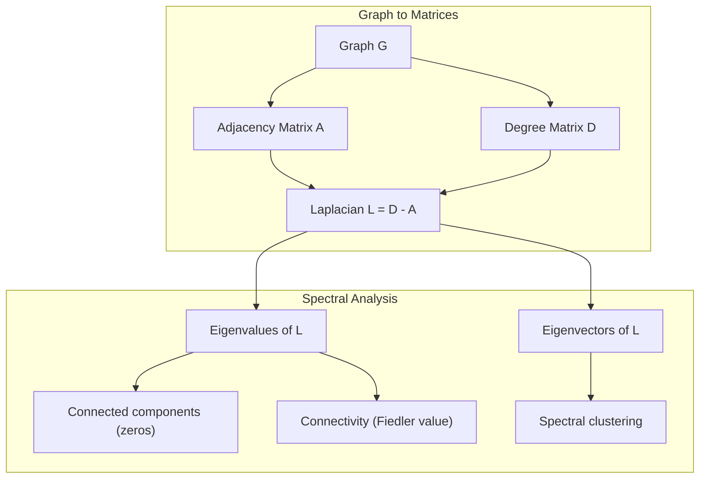
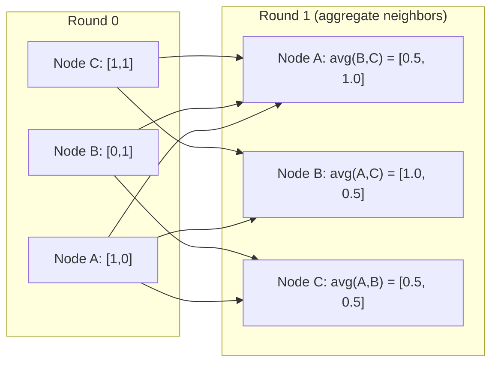

# Machine Learning için Grafik Teorisi

> Grafikler ilişkilerin veri yapısıdır. Verilerinizin bağlantıları varsa grafik teorisine ihtiyacınız vardır.

**Tür:** Yapım
**Dil:** Python
**Önkoşullar:** Aşama 1, Dersler 01-03 (doğrusal cebir, matrisler)
**Süre:** ~90 dakika

## Öğrenme Hedefleri

- Bitişiklik matrisi/liste gösterimleriyle bir grafik sınıfı oluşturun ve BFS ve DFS geçişlerini uygulayın
- Laplace grafiğini hesaplayın ve bağlı bileşenleri ve küme düğümlerini tespit etmek için özdeğerlerini kullanın
- Normalleştirilmiş bir bitişiklik matrisi çarpımı olarak geçen bir tur GNN tarzı mesaj uygulayın
- Fiedler vektörünü kullanarak bir grafiği bölmek için spektral kümeleme uygulayın

## Sorun

Sosyal ağlar, moleküller, bilgi tabanları, alıntı ağları, yol haritaları; hepsi grafiklerdir. Geleneksel ML, verileri düz tablolar olarak ele alır. Her satır bağımsızdır. Her özellik bir sütundur. Ancak bağlantıların yapısı önemli olduğunda tablolar başarısız olur.

Bir sosyal ağ düşünün. Bir kullanıcının hangi ürünü satın alacağını tahmin etmek istiyorsunuz. Satın alma geçmişleri önemlidir. Ancak arkadaşlarının satın alma geçmişi daha önemli. Bağlantılar sinyal taşır.

Veya bir molekül düşünün. Bir proteine ​​bağlanıp bağlanmadığını tahmin etmek istiyorsunuz. Atomlar önemlidir ama asıl önemli olan atomların birbirine nasıl bağlandığıdır. Yapı veridir.

Grafik Neural Network'ler (GNN'ler), deep learning'nin en hızlı büyüyen alanıdır. İlaç keşfine, sosyal öneriye, dolandırıcılık tespitine ve bilgi grafiği muhakemesine güç verirler. Her GNN aynı temel üzerine kuruludur: temel grafik teorisi.

Dört şeye ihtiyacınız var:
1. Grafikleri matris olarak temsil etmenin bir yolu (böylece bunları çarpabilirsiniz)
2. Grafik yapısını keşfetmek için geçiş algoritmaları
3. Laplacian – spektral grafik teorisindeki en önemli matris
4. Mesaj aktarma -- GNN'lerin çalışmasını sağlayan işlem

## Konsept

### Grafikler: Düğümler ve Kenarlar

Bir G = (V, E) grafiği V köşelerinden (düğümlerinden) ve E kenarlarından oluşur. Her kenar iki düğümü birbirine bağlar.

**Yönlü ve yönsüz.** Yönsüz bir grafikte kenar (u, v), u'nun v'ye VE v'nin u'ya bağlandığı anlamına gelir. Yönlendirilmiş bir grafikte (digraf), kenar (u, v), u'nun v'yi işaret ettiği anlamına gelir, ancak bunun tam tersi olması gerekmez.

**Ağırlıklı ve ağırlıksız.** Ağırlıksız bir grafikte kenarlar ya vardır ya da yoktur. Ağırlıklı bir grafikte her kenarın sayısal bir ağırlığı vardır; mesafe, maliyet, güç.

| Grafik türü | Örnek |
|-----------|---------|
| Yönlendirilmemiş, ağırlıklandırılmamış | Facebook arkadaşlık ağı |
| Yönlendirilmiş, ağırlıksız | Twitter takip ağı |
| Yönlendirilmemiş, ağırlıklı | Yol haritası (mesafeler) |
| Yönlendirilmiş, ağırlıklı | Web sayfası bağlantıları (PageRank puanları) |

### Bitişiklik Matrisi

Bitişiklik matrisi A çekirdek temsilidir. N düğümlü bir grafik için:

```
A[i][j] = 1    if there is an edge from node i to node j
A[i][j] = 0    otherwise
```

Yönsüz grafikler için A simetriktir: A[i][j] = A[j][i]. Ağırlıklı grafikler için A[i][j] = kenarın ağırlığı (i, j).

**Örnek -- bir üçgen:**

```
Nodes: 0, 1, 2
Edges: (0,1), (1,2), (0,2)

A = [[0, 1, 1],
     [1, 0, 1],
     [1, 1, 0]]
```

Bitişiklik matrisi her GNN'nin girişidir. A'daki matris işlemleri grafikteki işlemlere karşılık gelir.

### Derece

Bir düğümün derecesi ona bağlı kenarların sayısıdır. Yönlendirilmiş grafikler için, derece (içeri giren kenarlar) ve derece (kenarlar dışarı çıkan) vardır.

Derece matrisi D köşegendir:

```
D[i][i] = degree of node i
D[i][j] = 0    for i != j
```

Üçgen örneği için: D = diag(2, 2, 2) çünkü her düğüm diğer iki düğüme bağlanır.

Derece size düğümün önemini anlatır. Yüksek derece = merkez düğümü. Bir ağın derece dağılımı onun yapısını ortaya koyar. Sosyal ağlar güç yasalarına uyar (birkaç merkez, birçok yaprak düğüm). Rastgele grafikler Poisson dağılımlı derecelere sahiptir.

### BFS ve DFS

İki temel grafik geçiş algoritması. İkisine de ihtiyacın var.

**Genişlik Öncelikli Arama (BFS):** Önce tüm komşuları, ardından komşuların komşularını keşfedin. Bir kuyruk (FIFO) kullanır.

```
BFS from node 0:
  Visit 0
  Queue: [1, 2]        (neighbors of 0)
  Visit 1
  Queue: [2, 3]        (add neighbors of 1)
  Visit 2
  Queue: [3]           (neighbors of 2 already visited)
  Visit 3
  Queue: []            (done)
```

BFS, ağırlıklandırılmamış grafiklerde en kısa yolları bulur. Başlangıçtan herhangi bir düğüme olan mesafe, o düğümün ilk keşfedildiği BFS seviyesine eşittir. BFS'nin sosyal ağlarda atlama sayımı mesafeleri için kullanılmasının nedeni budur.

**Derinlik-Önce Arama (DFS):** Geriye doğru izlemeden önce mümkün olduğu kadar derine inin. Bir yığın (LIFO) veya özyineleme kullanır.

```
DFS from node 0:
  Visit 0
  Stack: [1, 2]        (neighbors of 0)
  Visit 2               (pop from stack)
  Stack: [1, 3]         (add neighbors of 2)
  Visit 3               (pop from stack)
  Stack: [1]
  Visit 1               (pop from stack)
  Stack: []             (done)
```

DFS aşağıdakiler için faydalıdır:
- Bağlı bileşenleri bulma (ziyaret edilmeyen düğümlerden DFS'yi çalıştırın)
- Döngü tespiti (DFS ağacındaki arka kenarlar)
- Topolojik sıralama (ters DFS bitiş sırası)

| Algoritma | Veri yapısı | Buluntular | Kullanım örneği |
|-----------|---------------|-------|----------|
| BFS | kuyruk | En kısa yollar | Sosyal ağ mesafesi, bilgi grafiği geçişi |
| DFS | Yığın | Bileşenler, döngüler | Bağlantı, topolojik sıralama |

### Grafik Laplace

L = D - A. Spektral grafik teorisindeki en önemli matris.

Üçgen için:

```
D = [[2, 0, 0],    A = [[0, 1, 1],    L = [[2, -1, -1],
     [0, 2, 0],         [1, 0, 1],         [-1, 2, -1],
     [0, 0, 2]]         [1, 1, 0]]         [-1, -1,  2]]
```

Laplace'ın dikkate değer özellikleri vardır:

1. **L pozitif yarı tanımlıdır.** Tüm özdeğerler >= 0'dır.

2. **Sıfır özdeğerlerin sayısı, bağlantılı bileşenlerin sayısına eşittir.** Bağlantılı bir grafiğin tam olarak bir sıfır özdeğeri vardır. Bağlantısız 3 bileşeni olan bir grafiğin üç sıfır öz değeri vardır.

3. **Sıfır olmayan en küçük özdeğer (Fiedler değeri) bağlantıyı ölçer.** Büyük bir Fiedler değeri, grafiğin iyi bağlantılı olduğu anlamına gelir. Küçük bir Fiedler değeri, grafiğin zayıf bir noktası, yani darboğaz olduğu anlamına gelir.

4. **Fiedler değerinin özvektörü (Fiedler vektörü) en iyi bölünmeyi ortaya koyar.** Pozitif değerli düğümler bir gruba, negatif değerli düğümler ise diğer gruba girer. Bu spektral kümelemedir.



### Spektral Özellikler

Bitişiklik matrisinin ve Laplacian'ın özdeğerleri, herhangi bir geçiş olmadan yapısal özellikleri ortaya çıkarır.

**Spektral kümeleme** şu şekilde çalışır:
1. Laplace L'yi hesaplayın
2. L'nin k en küçük özvektörünü bulun (bağlantılı grafikler için hepsi bir olan ilkini atlayın)
3. Bu özvektörleri her düğüm için yeni koordinatlar olarak kullanın
4. Bu koordinatlarda k-araçlarını çalıştırın

Bu neden işe yarıyor? L'nin özvektörleri grafikteki "en düzgün" fonksiyonları kodlar. İyi bağlanan düğümler benzer özvektör değerleri alır. Darboğazla ayrılan düğümler farklı değerler alır. Özvektörler doğal olarak kümeleri ayırır.

**Rastgele yürüyüş bağlantısı.** Normalleştirilmiş Laplace, grafikteki rastgele yürüyüşlerle ilgilidir. Rastgele yürüyüşün durağan dağılımı düğüm derecesi ile orantılıdır. Karıştırma süresi (yürüyüşün ne kadar hızlı yakınlaştığı) spektral boşluğa bağlıdır.

### Mesaj Aktarımı

Graph Neural Network'lerin temel işlemi. Her düğüm komşularından mesajlar toplar, bir araya getirir ve kendi durumunu günceller.

```
h_v^(k+1) = UPDATE(h_v^(k), AGGREGATE({h_u^(k) : u in neighbors(v)}))
```

En basit biçimde, AGGREGATE = ortalama ve GÜNCELLEME = doğrusal dönüşüm + aktivasyon:

```
h_v^(k+1) = sigma(W * mean({h_u^(k) : u in neighbors(v)}))
```

Bu gizlenmiş matris çarpımıdır. Eğer H tüm düğüm özelliklerinin matrisi ve A da bitişiklik matrisi ise:

```
H^(k+1) = sigma(A_norm * H^(k) * W)
```

burada A_norm normalleştirilmiş bitişiklik matrisidir (her satırın toplamı 1'dir).

Bir tur mesaj aktarımı, her düğümün yakın komşularını "görmesine" olanak tanır. İki tur, komşuların komşularını görmesine izin veriyor. K turları her düğüme kendi K-hop mahallesinden bilgi verir.



### Kavramlar ve ML Uygulamaları

| Konsept | ML Uygulaması |
|---------|---------------|
| Komşuluk matrisi | GNN giriş gösterimi |
| Grafik Laplace | Spektral kümeleme, topluluk tespiti |
| BFS/DFS | Bilgi grafiğinde geçiş, yol bulma |
| Derece dağıtımı | Düğümün önemi, özellik mühendisliği |
| Mesaj geçiyor | GNN katmanları (GCN, GAT, GraphSAGE) |
| L'nin özdeğerleri | Topluluk tespiti, grafik bölümleme |
| Spektral kümeleme | Denetimsiz düğüm gruplaması |
| Sayfa Sıralaması | Düğümün önemi, web araması |

```figure
graph-degree-distribution
```

## İnşa Et

### Adım 1: Sınıfı sıfırdan grafikleyin

```python
class Graph:
    def __init__(self, n_nodes, directed=False):
        self.n = n_nodes
        self.directed = directed
        self.adj = {i: {} for i in range(n_nodes)}

    def add_edge(self, u, v, weight=1.0):
        self.adj[u][v] = weight
        if not self.directed:
            self.adj[v][u] = weight

    def neighbors(self, node):
        return list(self.adj[node].keys())

    def degree(self, node):
        return len(self.adj[node])

    def adjacency_matrix(self):
        import numpy as np
        A = np.zeros((self.n, self.n))
        for u in range(self.n):
            for v, w in self.adj[u].items():
                A[u][v] = w
        return A

    def degree_matrix(self):
        import numpy as np
        D = np.zeros((self.n, self.n))
        for i in range(self.n):
            D[i][i] = self.degree(i)
        return D

    def laplacian(self):
        return self.degree_matrix() - self.adjacency_matrix()
```

Bitişiklik listesi (`self.adj`) komşuları verimli bir şekilde saklar. Bitişiklik matrisi dönüşümünde numpy kullanılır çünkü tüm spektral işlemler buna ihtiyaç duyar.

### Adım 2: BFS ve DFS

```python
from collections import deque

def bfs(graph, start):
    visited = set()
    order = []
    distances = {}
    queue = deque([(start, 0)])
    visited.add(start)
    while queue:
        node, dist = queue.popleft()
        order.append(node)
        distances[node] = dist
        for neighbor in graph.neighbors(node):
            if neighbor not in visited:
                visited.add(neighbor)
                queue.append((neighbor, dist + 1))
    return order, distances


def dfs(graph, start):
    visited = set()
    order = []
    stack = [start]
    while stack:
        node = stack.pop()
        if node in visited:
            continue
        visited.add(node)
        order.append(node)
        for neighbor in reversed(graph.neighbors(node)):
            if neighbor not in visited:
                stack.append(neighbor)
    return order
```

BFS, O(1) popleft için bir deque (çift uçlu kuyruk) kullanır. DFS, listeyi yığın olarak kullanır. Her ikisi de her düğümü tam olarak bir kez ziyaret eder -- O(V + E) süresi.

### Adım 3: Bağlantılı bileşenler ve Laplace özdeğerleri

```python
def connected_components(graph):
    visited = set()
    components = []
    for node in range(graph.n):
        if node not in visited:
            order, _ = bfs(graph, node)
            visited.update(order)
            components.append(order)
    return components


def laplacian_eigenvalues(graph):
    import numpy as np
    L = graph.laplacian()
    eigenvalues = np.linalg.eigvalsh(L)
    return eigenvalues
```

`eigvalsh` simetrik matrisler içindir - Laplacian yönsüz grafikler için her zaman simetriktir. Özdeğerleri artan sırada döndürür. Bağlı bileşenlerin sayısını bulmak için sıfırları sayın.

### Adım 4: Spektral kümeleme

```python
def spectral_clustering(graph, k=2):
    import numpy as np
    L = graph.laplacian()
    eigenvalues, eigenvectors = np.linalg.eigh(L)
    features = eigenvectors[:, 1:k+1]

    labels = np.zeros(graph.n, dtype=int)
    for i in range(graph.n):
        if features[i, 0] >= 0:
            labels[i] = 0
        else:
            labels[i] = 1
    return labels
```

k=2 için Fiedler vektörünün işareti grafiği iki kümeye böler. k>2 için, ilk k özvektörleri üzerinde k-ortalamalarını çalıştırırsınız (önemsiz hepsi birler özvektörü hariç).

### Adım 5: Mesajın iletilmesi

```python
def message_passing(graph, features, weight_matrix):
    import numpy as np
    A = graph.adjacency_matrix()
    row_sums = A.sum(axis=1, keepdims=True)
    row_sums[row_sums == 0] = 1
    A_norm = A / row_sums
    aggregated = A_norm @ features
    output = aggregated @ weight_matrix
    return output
```

Bu bir tur GNN mesajı geçişidir. Her düğümün yeni özellikleri, komşularının özelliklerinin ağırlık matrisi tarafından dönüştürülen ağırlıklı ortalamasıdır. Bilgiyi daha da yaymak için birden fazla turu üst üste koyun.

## Kullan onu

Networkx ve numpy ile aynı işlemler tek satırlıktır:

```python
import networkx as nx
import numpy as np

G = nx.karate_club_graph()

A = nx.adjacency_matrix(G).toarray()
L = nx.laplacian_matrix(G).toarray()

eigenvalues = np.linalg.eigvalsh(L.astype(float))
print(f"Smallest eigenvalues: {eigenvalues[:5]}")
print(f"Connected components: {nx.number_connected_components(G)}")

communities = nx.community.greedy_modularity_communities(G)
print(f"Communities found: {len(communities)}")

pr = nx.pagerank(G)
top_nodes = sorted(pr.items(), key=lambda x: x[1], reverse=True)[:5]
print(f"Top 5 PageRank nodes: {top_nodes}")
```

networkx, optimize edilmiş C arka uçlarıyla her boyuttaki grafiği yönetir. Üretimde kullanın. Ne yaptığını anlamak için sıfırdan uygulamanızı kullanın.

### numpy spektral analiz

```python
import numpy as np

A = np.array([
    [0, 1, 1, 0, 0],
    [1, 0, 1, 0, 0],
    [1, 1, 0, 1, 0],
    [0, 0, 1, 0, 1],
    [0, 0, 0, 1, 0]
])

D = np.diag(A.sum(axis=1))
L = D - A

eigenvalues, eigenvectors = np.linalg.eigh(L)
print(f"Eigenvalues: {np.round(eigenvalues, 4)}")
print(f"Fiedler value: {eigenvalues[1]:.4f}")
print(f"Fiedler vector: {np.round(eigenvectors[:, 1], 4)}")

fiedler = eigenvectors[:, 1]
group_a = np.where(fiedler >= 0)[0]
group_b = np.where(fiedler < 0)[0]
print(f"Cluster A: {group_a}")
print(f"Cluster B: {group_b}")
```

Fiedler vektörü işin ağır yükünü üstleniyor. Bir kümede pozitif girişler, diğerinde negatif girişler. Yinelemeli optimizasyona gerek yok; yalnızca bir öz bileşim.

## Gönderin

Bu ders şunları üretir:
- `outputs/skill-graph-analysis.md` -- grafik yapılı verileri analiz etmeye yönelik bir beceri referansı

## Bağlantılar

| Konsept | Nerede görünüyor |
|---------|------------------|
| Komşuluk matrisi | GCN, GAT, GraphSAGE girişi |
| Laplace | Spektral kümeleme, ChebNet filtreleri |
| BFS | Bilgi grafiği geçişi, en kısa yol sorguları |
| Mesaj geçiyor | Her GNN katmanında sinirsel mesaj geçiyor |
| Spektral boşluk | Grafik bağlantısı, rastgele yürüyüşlerin karıştırma süresi |
| Derece dağıtımı | Güç yasası ağları, düğüm özelliği mühendisliği |
| Bağlı bileşenler | Bağlantısız grafiklerin ön işlenmesi ve işlenmesi |
| Sayfa Sıralaması | Düğüm önem sıralaması, dikkatin başlatılması |

GNN'ler özel olarak anılmayı hak ediyor. GCN'deki grafik evrişim işlemi (Kipf & Welling, 2017), kendi kendine döngüler eklenen bitişiklik matrisini kullanır, A_hat = A + I:

```text
H^(l+1) = sigma(D_hat^(-1/2) * A_hat * D_hat^(-1/2) * H^(l) * W^(l))
```

burada A_hat = A + I (bitişiklik artı öz döngüler) ve D_hat, A_hat'ın derece matrisidir. Kendi kendine döngüler, toplama sırasında her düğümün kendi özelliklerini içermesini sağlar. Bu tam olarak simetrik normalizasyonla iletilen mesajdır. D_hat^(-1/2) * A_hat * D_hat^(-1/2) normalleştirilmiş bitişiklik matrisidir. Laplace ortaya çıkıyor çünkü bu normalizasyon L_sym = I - D^(-1/2) * A * D^(-1/2) ile ilgili. Laplace'ı anlamak, GCN'lerin neden çalıştığını anlamak anlamına gelir.

## Egzersizler

1. **PageRank'i sıfırdan uygulayın.** Tek tip puanlarla başlayın. Her adımda: v'yi işaret eden tüm u'lar için puan(v) = (1-d)/n + d * toplam(score(u)/out_degree(u)). d=0,85'i kullanın. Yakınsamaya kadar çalıştırın (değişim < 1e-6). Küçük bir web grafiği üzerinde test edin.

2. **Spektral kümelemeyi kullanarak toplulukları bulun.** Açıkça ayrılmış iki kümeden (e.g., tek bir kenarla birbirine bağlanan iki grup) oluşan bir grafik oluşturun. Spektral kümelemeyi çalıştırın ve doğru bölünmeyi bulduğunu doğrulayın. Daha fazla kümeler arası kenar eklediğinizde ne olur?

3. Ağırlıklı grafiklerde en kısa yollar için **Dijkstra algoritmasını uygulayın**. Sonuçları aynı grafik üzerinde tekdüze ağırlıklarla BFS ile karşılaştırın.

4. **2 katmanlı bir mesaj aktarım ağı oluşturun.** Farklı ağırlık matrisleriyle iki kez mesaj aktarımı uygulayın. 2 turdan sonra her düğümün kendi 2-atlamalı mahallesinden bilgi aldığını gösterin.

5. **Gerçek dünya grafiğini analiz edin.** Karate Kulübü grafiğini kullanın (34 düğüm, 78 kenar). Hesaplama derecesi dağılımı, Laplace özdeğerleri ve spektral kümeleme. Spektral kümeleme sonucunu bilinen temel gerçek ayrımıyla karşılaştırın.

## Anahtar Terimler

| Dönem | İnsanlar ne diyor | Aslında ne anlama geliyor |
|------|----------------|----------------------|
| Grafik | "Düğümler ve kenarlar" | İkili ilişkileri kodlayan G=(V,E) matematiksel yapısı |
| Komşuluk matrisi | "Bağlantı tablosu" | i ve j düğümleri bağlıysa A[i][j] = 1 olan bir n x n matrisi |
| Derece | "Bir düğüm ne kadar bağlantılıdır" | Bir düğüme dokunan kenar sayısı |
| Laplace | "D eksi A" | L = D - A, özdeğerleri grafik yapısını ortaya koyan matris |
| Fiedler değeri | "Cebirsel bağlantı" | Grafiğin ne kadar iyi bağlantılı olduğunu ölçen L'nin sıfır olmayan en küçük öz değeri |
| BFS | "Seviye bazında arama" | Daha derine inmeden önce tüm komşuları ziyaret eden geçiş, en kısa yolları bulur |
| DFS | "Önce derinlere inin" | Geri izlemeden önce sonuna kadar tek bir yolu izleyen geçiş |
| Mesaj geçiyor | "Düğümler komşularla konuşur" | Her düğüm, GNN'lerin çekirdeği olan komşularından bilgi toplar |
| Spektral kümeleme | "Özvektörlere göre kümeleme" | Bir grafiği Laplace'ın özvektörlerini kullanarak bölümleme |
| Bağlı bileşen | "Ayrı bir parça" | Her düğümün diğer düğümlere ulaşabileceği maksimum alt grafik |

## Daha Fazla Okuma

- **Kipf & Welling (2017)** -- "Grafik Evrişimli Ağlarla Yarı Denetimli Sınıflandırma." Modern GNN'leri başlatan makale. Spektral grafik evrişimlerinin mesaj aktarımını basitleştirdiğini gösterir.
- **Spielman (2012)** -- "Spektral Grafik Teorisi" ders notları. Laplacelılara, spektral boşluklara ve grafik bölümlemeye kesin giriş.
- **Hamilton (2020)** -- "Grafik Temsiliyle Öğrenme." Temellerden uygulamalara kadar GNN'leri kapsayan kitap.
- **Bronstein ve ark. (2021)** -- "Geometrik Deep Learning: Izgaralar, Gruplar, Grafikler, Jeodezikler ve Göstergeler." Birleştirici framework kağıdı.
- **Veličković ve diğerleri. (2018)** -- "Grafik Dikkat Ağları." attention mechanism'lerle ileti geçişini genişletir.
