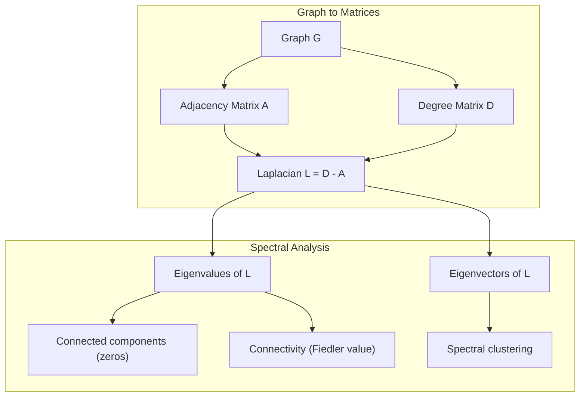
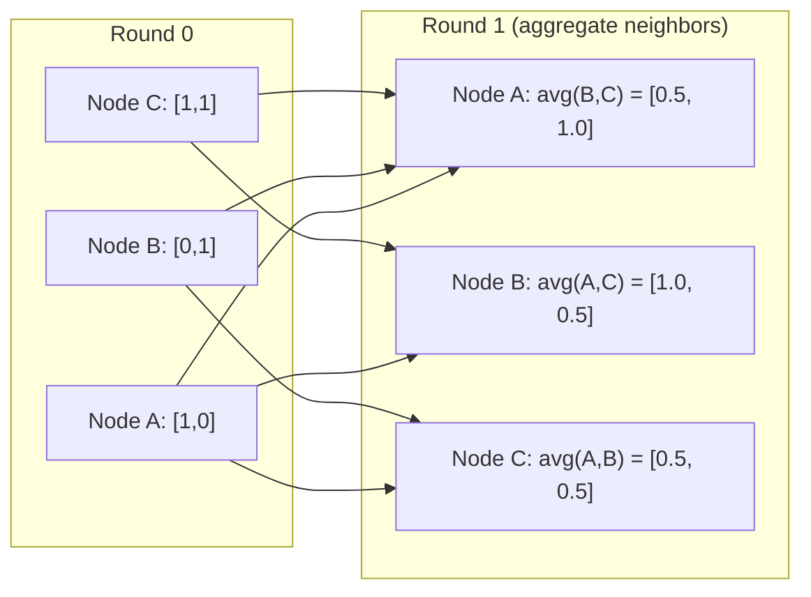

# 21 · 面向机器学习的图论

> 图（Graph）是表达关系的数据结构。如果你的数据存在连接关系，那么你就需要图论。

**类型：** 实践构建
**语言：** Python
**前置：** 阶段 1，第 01-03 课（线性代数、矩阵）
**时长：** 约 90 分钟

## 学习目标

- 构建一个图类，支持邻接矩阵 / 邻接表两种表示，并实现 BFS 和 DFS 遍历
- 计算图拉普拉斯矩阵（Graph Laplacian），并利用其特征值检测连通分量、对节点聚类
- 将一轮 GNN 风格的消息传递（Message Passing）实现为归一化邻接矩阵的乘法
- 应用谱聚类（Spectral Clustering），利用 Fiedler 向量对图进行划分

## 问题所在

社交网络、分子、知识库、引文网络、路网地图——这些全都是图。传统机器学习把数据当作扁平的表格：每一行相互独立，每个特征是一列。但当连接的结构本身至关重要时，表格就失效了。

设想一个社交网络。你想预测某个用户会购买什么产品。他自己的购买历史很重要，但他朋友们的购买历史更重要。连接关系携带着信号。

再设想一个分子。你想预测它是否会与某种蛋白质结合。原子很重要，但真正关键的是原子之间是如何成键的。结构本身就是数据。

图神经网络（Graph Neural Networks，GNN）是深度学习中增长最快的领域。它驱动着药物发现、社交推荐、欺诈检测和知识图谱推理。每一种 GNN 都建立在同一个基础之上：基本的图论。

你需要四样东西：
1. 一种把图表示为矩阵的方法（这样你才能对它做乘法）
2. 用于探索图结构的遍历算法
3. 拉普拉斯矩阵——谱图论（Spectral Graph Theory）中最重要的单个矩阵
4. 消息传递——让 GNN 得以运转的核心操作

## 核心概念

### 图：节点与边

一个图 G = (V, E) 由顶点（节点，Vertices/Nodes）集合 V 和边（Edges）集合 E 组成。每条边连接两个节点。

**有向 vs 无向。** 在无向图中，边 (u, v) 意味着 u 连接到 v *并且* v 连接到 u。在有向图（digraph）中，边 (u, v) 意味着 u 指向 v，但反向不一定成立。

**带权 vs 无权。** 在无权图中，边要么存在、要么不存在。在带权图中，每条边都有一个数值权重——可以是距离、代价或强度。

| 图类型 | 示例 |
|-----------|---------|
| 无向、无权 | Facebook 好友关系网络 |
| 有向、无权 | Twitter 关注网络 |
| 无向、带权 | 路网地图（距离） |
| 有向、带权 | 网页链接（PageRank 分数） |

### 邻接矩阵

邻接矩阵（Adjacency Matrix）A 是核心表示。对于一个有 n 个节点的图：

```
A[i][j] = 1    if there is an edge from node i to node j
A[i][j] = 0    otherwise
```

对于无向图，A 是对称的：A[i][j] = A[j][i]。对于带权图，A[i][j] = 边 (i, j) 的权重。

**示例——一个三角形：**

```
Nodes: 0, 1, 2
Edges: (0,1), (1,2), (0,2)

A = [[0, 1, 1],
     [1, 0, 1],
     [1, 1, 0]]
```

邻接矩阵是每一个 GNN 的输入。对 A 的矩阵运算对应着对图的操作。

### 度

节点的度（Degree）是与它相连的边的数量。对于有向图，你会有入度（in-degree，进来的边）和出度（out-degree，出去的边）。

度矩阵（Degree Matrix）D 是对角矩阵：

```
D[i][i] = degree of node i
D[i][j] = 0    for i != j
```

对于三角形示例：D = diag(2, 2, 2)，因为每个节点都连接到另外两个节点。

度告诉你节点的重要性。高度数 = 枢纽（hub）节点。网络的度分布揭示了它的结构。社交网络服从幂律分布（少数枢纽、大量叶子节点）。随机图的度则服从泊松分布。

### BFS 与 DFS

两种基本的图遍历算法。两者你都需要掌握。

**广度优先搜索（Breadth-First Search，BFS）：** 先探索所有邻居，再探索邻居的邻居。使用队列（FIFO，先进先出）。

```
BFS from node 0:
  Visit 0
  Queue: [1, 2]        (neighbors of 0)
  Visit 1
  Queue: [2, 3]        (add neighbors of 1)
  Visit 2
  Queue: [3]           (neighbors of 2 already visited)
  Visit 3
  Queue: []            (done)
```

BFS 能在无权图中找到最短路径。从起点到任意节点的距离，等于该节点首次被发现时所处的 BFS 层级。这就是为什么 BFS 被用于社交网络中的跳数（hop-count）距离计算。

**深度优先搜索（Depth-First Search，DFS）：** 在回溯之前尽可能地深入。使用栈（LIFO，后进先出）或递归。

```
DFS from node 0:
  Visit 0
  Stack: [1, 2]        (neighbors of 0)
  Visit 2               (pop from stack)
  Stack: [1, 3]         (add neighbors of 2)
  Visit 3               (pop from stack)
  Stack: [1]
  Visit 1               (pop from stack)
  Stack: []             (done)
```

DFS 适用于：
- 寻找连通分量（从未访问的节点运行 DFS）
- 环检测（DFS 树中的回边）
- 拓扑排序（DFS 完成顺序的逆序）

| 算法 | 数据结构 | 能找到什么 | 应用场景 |
|-----------|---------------|-------|----------|
| BFS | 队列 | 最短路径 | 社交网络距离、知识图谱遍历 |
| DFS | 栈 | 连通分量、环 | 连通性、拓扑排序 |

### 图拉普拉斯矩阵

L = D - A。谱图论中最重要的矩阵。

对于三角形：

```
D = [[2, 0, 0],    A = [[0, 1, 1],    L = [[2, -1, -1],
     [0, 2, 0],         [1, 0, 1],         [-1, 2, -1],
     [0, 0, 2]]         [1, 1, 0]]         [-1, -1,  2]]
```

拉普拉斯矩阵具有一些非凡的性质：

1. **L 是半正定的（positive semi-definite）。** 所有特征值都 >= 0。

2. **零特征值的个数等于连通分量的个数。** 连通图恰好有一个零特征值。一个有 3 个不连通分量的图则有三个零特征值。

3. **最小的非零特征值（Fiedler 值）度量连通性。** Fiedler 值大意味着图连接良好；Fiedler 值小意味着图存在薄弱点——一个瓶颈。

4. **Fiedler 值对应的特征向量（Fiedler 向量）揭示了最佳划分方式。** 值为正的节点归入一组，值为负的节点归入另一组。这就是谱聚类。



### 谱性质

邻接矩阵和拉普拉斯矩阵的特征值无需任何遍历就能揭示结构性质。

**谱聚类**的工作方式如下：
1. 计算拉普拉斯矩阵 L
2. 找出 L 的 k 个最小特征向量（跳过第一个，对连通图而言它是全 1 向量）
3. 把这些特征向量当作每个节点的新坐标
4. 在这些坐标上运行 k-means

为什么这样行得通？L 的特征向量编码了图上"最平滑"的函数。连接良好的节点会得到相近的特征向量值；被瓶颈分隔开的节点则得到不同的值。特征向量天然地把各个簇分离开来。

**与随机游走的联系。** 归一化拉普拉斯矩阵与图上的随机游走（random walk）相关。随机游走的平稳分布与节点的度成正比。混合时间（mixing time，即游走收敛的速度）取决于谱隙（spectral gap）。

### 消息传递

图神经网络的核心操作。每个节点从它的邻居那里收集消息，将这些消息聚合，然后更新自身的状态。

```
h_v^(k+1) = UPDATE(h_v^(k), AGGREGATE({h_u^(k) : u in neighbors(v)}))
```

在最简单的形式中，AGGREGATE = 求均值，UPDATE = 线性变换 + 激活：

```
h_v^(k+1) = sigma(W * mean({h_u^(k) : u in neighbors(v)}))
```

这其实是伪装成别样形态的矩阵乘法。如果 H 是所有节点特征构成的矩阵，A 是邻接矩阵：

```
H^(k+1) = sigma(A_norm * H^(k) * W)
```

其中 A_norm 是归一化邻接矩阵（每一行之和为 1）。

一轮消息传递让每个节点"看到"它的直接邻居。两轮则让它看到邻居的邻居。K 轮则让每个节点获得来自其 K 跳（K-hop）邻域的信息。



### 概念与机器学习应用

| 概念 | 机器学习应用 |
|---------|---------------|
| 邻接矩阵 | GNN 输入表示 |
| 图拉普拉斯矩阵 | 谱聚类、社区检测 |
| BFS/DFS | 知识图谱遍历、路径查找 |
| 度分布 | 节点重要性、特征工程 |
| 消息传递 | GNN 层（GCN、GAT、GraphSAGE） |
| L 的特征值 | 社区检测、图划分 |
| 谱聚类 | 无监督节点分组 |
| PageRank | 节点重要性、网络搜索 |

## 动手构建

### 第 1 步：从零实现图类

```python
class Graph:
    def __init__(self, n_nodes, directed=False):
        self.n = n_nodes
        self.directed = directed
        self.adj = {i: {} for i in range(n_nodes)}

    def add_edge(self, u, v, weight=1.0):
        self.adj[u][v] = weight
        if not self.directed:
            self.adj[v][u] = weight

    def neighbors(self, node):
        return list(self.adj[node].keys())

    def degree(self, node):
        return len(self.adj[node])

    def adjacency_matrix(self):
        import numpy as np
        A = np.zeros((self.n, self.n))
        for u in range(self.n):
            for v, w in self.adj[u].items():
                A[u][v] = w
        return A

    def degree_matrix(self):
        import numpy as np
        D = np.zeros((self.n, self.n))
        for i in range(self.n):
            D[i][i] = self.degree(i)
        return D

    def laplacian(self):
        return self.degree_matrix() - self.adjacency_matrix()
```

邻接表（`self.adj`）高效地存储邻居。转换为邻接矩阵时使用 numpy，因为所有谱运算都需要它。

### 第 2 步：BFS 与 DFS

```python
from collections import deque

def bfs(graph, start):
    visited = set()
    order = []
    distances = {}
    queue = deque([(start, 0)])
    visited.add(start)
    while queue:
        node, dist = queue.popleft()
        order.append(node)
        distances[node] = dist
        for neighbor in graph.neighbors(node):
            if neighbor not in visited:
                visited.add(neighbor)
                queue.append((neighbor, dist + 1))
    return order, distances


def dfs(graph, start):
    visited = set()
    order = []
    stack = [start]
    while stack:
        node = stack.pop()
        if node in visited:
            continue
        visited.add(node)
        order.append(node)
        for neighbor in reversed(graph.neighbors(node)):
            if neighbor not in visited:
                stack.append(neighbor)
    return order
```

BFS 使用 deque（双端队列）来实现 O(1) 的 popleft。DFS 使用列表作为栈。两者都恰好访问每个节点一次——时间复杂度为 O(V + E)。

### 第 3 步：连通分量与拉普拉斯特征值

```python
def connected_components(graph):
    visited = set()
    components = []
    for node in range(graph.n):
        if node not in visited:
            order, _ = bfs(graph, node)
            visited.update(order)
            components.append(order)
    return components


def laplacian_eigenvalues(graph):
    import numpy as np
    L = graph.laplacian()
    eigenvalues = np.linalg.eigvalsh(L)
    return eigenvalues
```

`eigvalsh` 用于对称矩阵——无向图的拉普拉斯矩阵总是对称的。它返回升序排列的特征值。数一数零特征值的个数，就能得到连通分量的数量。

### 第 4 步：谱聚类

```python
def spectral_clustering(graph, k=2):
    import numpy as np
    L = graph.laplacian()
    eigenvalues, eigenvectors = np.linalg.eigh(L)
    features = eigenvectors[:, 1:k+1]

    labels = np.zeros(graph.n, dtype=int)
    for i in range(graph.n):
        if features[i, 0] >= 0:
            labels[i] = 0
        else:
            labels[i] = 1
    return labels
```

当 k=2 时，Fiedler 向量的符号将图划分为两个簇。当 k>2 时，你需要在前 k 个特征向量（排除掉平凡的全 1 特征向量）上运行 k-means。

### 第 5 步：消息传递

```python
def message_passing(graph, features, weight_matrix):
    import numpy as np
    A = graph.adjacency_matrix()
    row_sums = A.sum(axis=1, keepdims=True)
    row_sums[row_sums == 0] = 1
    A_norm = A / row_sums
    aggregated = A_norm @ features
    output = aggregated @ weight_matrix
    return output
```

这就是一轮 GNN 消息传递。每个节点的新特征是其邻居特征的加权平均，再经过权重矩阵的变换。堆叠多轮即可将信息传播得更远。

## 实战应用

借助 networkx 和 numpy，相同的操作只需一行代码：

```python
import networkx as nx
import numpy as np

G = nx.karate_club_graph()

A = nx.adjacency_matrix(G).toarray()
L = nx.laplacian_matrix(G).toarray()

eigenvalues = np.linalg.eigvalsh(L.astype(float))
print(f"Smallest eigenvalues: {eigenvalues[:5]}")
print(f"Connected components: {nx.number_connected_components(G)}")

communities = nx.community.greedy_modularity_communities(G)
print(f"Communities found: {len(communities)}")

pr = nx.pagerank(G)
top_nodes = sorted(pr.items(), key=lambda x: x[1], reverse=True)[:5]
print(f"Top 5 PageRank nodes: {top_nodes}")
```

networkx 凭借优化过的 C 后端能处理任意规模的图。生产环境中请使用它。而你从零实现的版本，则用来理解它内部到底在做什么。

### numpy 谱分析

```python
import numpy as np

A = np.array([
    [0, 1, 1, 0, 0],
    [1, 0, 1, 0, 0],
    [1, 1, 0, 1, 0],
    [0, 0, 1, 0, 1],
    [0, 0, 0, 1, 0]
])

D = np.diag(A.sum(axis=1))
L = D - A

eigenvalues, eigenvectors = np.linalg.eigh(L)
print(f"Eigenvalues: {np.round(eigenvalues, 4)}")
print(f"Fiedler value: {eigenvalues[1]:.4f}")
print(f"Fiedler vector: {np.round(eigenvectors[:, 1], 4)}")

fiedler = eigenvectors[:, 1]
group_a = np.where(fiedler >= 0)[0]
group_b = np.where(fiedler < 0)[0]
print(f"Cluster A: {group_a}")
print(f"Cluster B: {group_b}")
```

Fiedler 向量挑起了大梁。正值项归入一个簇，负值项归入另一个簇。无需任何迭代优化——只要一次特征分解（eigendecomposition）即可。

## 成果交付

本课产出：
- `outputs/skill-graph-analysis.md`——一份用于分析图结构数据的技能参考文档

## 关联延伸

| 概念 | 出现的地方 |
|---------|------------------|
| 邻接矩阵 | GCN、GAT、GraphSAGE 的输入 |
| 拉普拉斯矩阵 | 谱聚类、ChebNet 滤波器 |
| BFS | 知识图谱遍历、最短路径查询 |
| 消息传递 | 每一个 GNN 层、神经消息传递 |
| 谱隙 | 图连通性、随机游走的混合时间 |
| 度分布 | 幂律网络、节点特征工程 |
| 连通分量 | 预处理、处理不连通的图 |
| PageRank | 节点重要性排序、注意力初始化 |

GNN 值得特别一提。GCN（Kipf & Welling, 2017）中的图卷积操作使用了加上自环（self-loops）的邻接矩阵，即 A_hat = A + I：

```text
H^(l+1) = sigma(D_hat^(-1/2) * A_hat * D_hat^(-1/2) * H^(l) * W^(l))
```

其中 A_hat = A + I（邻接矩阵加上自环），D_hat 是 A_hat 的度矩阵。自环确保每个节点在聚合时把自身特征也包含进来。这正是带对称归一化的消息传递。D_hat^(-1/2) * A_hat * D_hat^(-1/2) 就是归一化邻接矩阵。拉普拉斯矩阵之所以出现，是因为这种归一化与 L_sym = I - D^(-1/2) * A * D^(-1/2) 相关。理解了拉普拉斯矩阵，就理解了 GCN 为什么有效。

## 练习

1. **从零实现 PageRank。** 从均匀的初始分数开始。每一步：score(v) = (1-d)/n + d * sum(score(u)/out_degree(u))，对所有指向 v 的 u 求和。取 d=0.85。运行至收敛（变化量 < 1e-6）。在一个小型网页图上测试。

2. **使用谱聚类寻找社区。** 构造一个有两个明显分离的簇的图（例如，两个由单条边连接的团/clique）。运行谱聚类并验证它能找到正确的划分。当你增加更多跨簇边时会发生什么？

3. **实现 Dijkstra 算法**，用于带权图中的最短路径。在权重均匀的同一张图上，将结果与 BFS 进行比较。

4. **构建一个 2 层消息传递网络。** 用不同的权重矩阵进行两次消息传递。证明经过 2 轮后，每个节点都拥有了来自其 2 跳邻域的信息。

5. **分析一个真实世界的图。** 使用空手道俱乐部图（Karate Club graph，34 个节点，78 条边）。计算度分布、拉普拉斯特征值和谱聚类结果。把谱聚类的结果与已知的真实划分进行比较。

## 关键术语

| 术语 | 人们常说的 | 它实际的含义 |
|------|----------------|----------------------|
| 图（Graph） | "节点和边" | 一种编码成对关系的数学结构 G=(V,E) |
| 邻接矩阵（Adjacency matrix） | "连接表" | 一个 n x n 矩阵，当节点 i 和 j 相连时 A[i][j] = 1 |
| 度（Degree） | "一个节点连接得有多紧密" | 接触某个节点的边的数量 |
| 拉普拉斯矩阵（Laplacian） | "D 减 A" | L = D - A，其特征值揭示图结构的矩阵 |
| Fiedler 值 | "代数连通度" | L 的最小非零特征值，度量图连接得有多好 |
| BFS | "逐层搜索" | 在深入之前先访问所有邻居的遍历，能找到最短路径 |
| DFS | "先往深走" | 沿一条路径走到尽头再回溯的遍历 |
| 消息传递（Message passing） | "节点和邻居对话" | 每个节点从其邻居聚合信息，是 GNN 的核心 |
| 谱聚类（Spectral clustering） | "按特征向量聚类" | 利用图拉普拉斯矩阵的特征向量来划分图 |
| 连通分量（Connected component） | "一个独立的部分" | 一个极大子图，其中任意节点都能到达其他任意节点 |

## 延伸阅读

- **Kipf & Welling (2017)**——《Semi-Supervised Classification with Graph Convolutional Networks》。开启现代 GNN 的论文。证明了谱图卷积可简化为消息传递。
- **Spielman (2012)**——《Spectral Graph Theory》讲义。关于拉普拉斯矩阵、谱隙和图划分的权威入门。
- **Hamilton (2020)**——《Graph Representation Learning》。一本从基础到应用全面讲解 GNN 的书。
- **Bronstein et al. (2021)**——《Geometric Deep Learning: Grids, Groups, Graphs, Geodesics, and Gauges》。提出统一框架的论文。
- **Veličković et al. (2018)**——《Graph Attention Networks》。用注意力机制扩展了消息传递。
