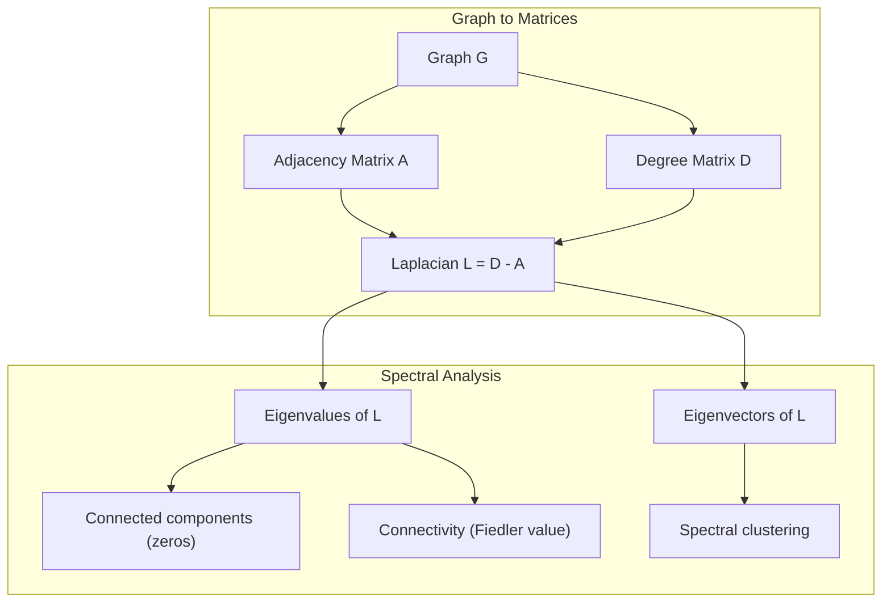
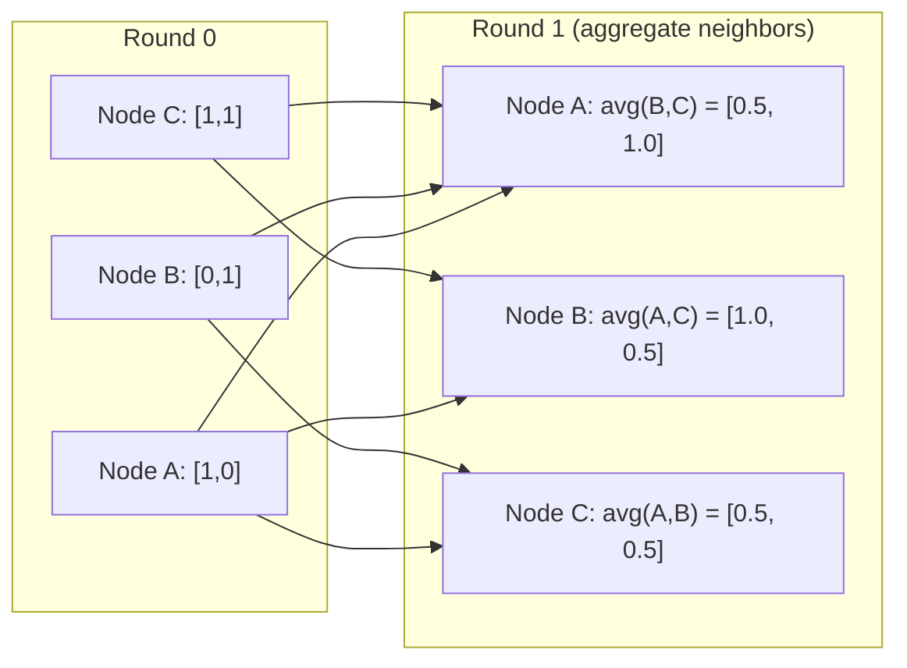

# 机器学习的图形理论

> 图形是关系的数据结构。如果你的数据有联系，你就需要图形理论。

** 类型：** 构建
** 语言：** Python
** 先决条件：** 第1阶段，第01-03课（线性代数、矩阵）
** 时间：** ~90分钟

## 学习目标

- 使用邻近矩阵/列表表示构建图形类并实现BFS和DFS穿越
- 计算拉普拉斯图并使用其特征值来检测连接的组件和集群节点
- 将一轮GNN风格的消息传递实施为规范化邻近矩阵相乘
- 使用Fiedler载体应用谱聚集来划分图

## 问题

社交网络、分子、知识库、引用网络、路线图--都是图形。传统的ML将数据视为平面表。每一行都是独立的。每个功能都是一列。但当连接结构很重要时，表格就会失败。

考虑一个社交网络。您想要预测用户将购买什么产品。他们的购买历史很重要。但他们朋友的购买历史更重要。这些连接携带信号。

或者考虑一个分子。您想要预测它是否与蛋白质结合。原子很重要，但真正重要的是原子如何相互结合。结构就是数据。

图神经网络（GNN）是深度学习中发展最快的领域。它们为药物发现、社会推荐、欺诈检测和知识图谱推理提供动力。每个GNN都建立在相同的基础上：基本图形理论。

您需要四件事：
1. 一种将图形表示为矩阵的方法（这样您就可以将它们相乘）
2. 探索图结构的穿越算法
3. 拉普拉斯--谱图理论中最重要的矩阵
4. 消息传递--使GNN发挥作用的操作

## 概念

### 图形：节点和边

图G =（V，E）由点（节点）V和边E组成。每条边连接两个节点。

** 定向vs无定向。**在无向图中，边（u，v）意味着u连接到v，v连接到u。在有向图（有向图）中，边（u，v）意味着u指向v，但不一定相反。

** 加权与未加权。**在未加权的图中，边要么存在，要么不存在。在加权图中，每条边都有一个数字权重--距离、成本、强度。

| 图表类型 | 例如 |
|-----------|---------|
| 无定向、无加权 | Facebook友谊网络 |
| 定向，未加权 | Twitter关注网络 |
| 无定向、加权 | 路线图（距离） |
| 定向、加权 | 网页链接（PageRank分数） |

### 邻接矩阵

邻近矩阵A是核心表示。对于具有n个节点的图：

```
A[i][j] = 1    if there is an edge from node i to node j
A[i][j] = 0    otherwise
```

对于无向图，A是对称的：A[i][j] = A[j][i]。对于加权图，A[i][j] =边（i，j）的权重。

** 示例--三角形：**

```
Nodes: 0, 1, 2
Edges: (0,1), (1,2), (0,2)

A = [[0, 1, 1],
     [1, 0, 1],
     [1, 1, 0]]
```

邻近矩阵是每个GNN的输入。A上的矩阵运算对应于图上的运算。

### 程度

一个节点的度是连接到它的边的数量。对于有向图，有入度（边进来）和出度（边出去）。

度矩阵D是对角线的：

```
D[i][i] = degree of node i
D[i][j] = 0    for i != j
```

对于三角形示例：D = diag（2，2，2），因为每个节点都连接到另外两个节点。

度告诉您节点的重要性。高度=中心节点。网络的度分布揭示了其结构。社交网络遵循权力定律（很少有中心，很多叶子节点）。随机图具有Poisson分布的度。

### BFS和DFS

两种基本的图穿越算法。你两者都需要。

** 广度优先搜索（BFS）：** 首先探索所有邻居，然后探索邻居的邻居。使用队列（FIFA）。

```
BFS from node 0:
  Visit 0
  Queue: [1, 2]        (neighbors of 0)
  Visit 1
  Queue: [2, 3]        (add neighbors of 1)
  Visit 2
  Queue: [3]           (neighbors of 2 already visited)
  Visit 3
  Queue: []            (done)
```

BFS在未加权图中找到最短路径。从起点到任何节点的距离等于首次发现该节点时的BFS级别。这就是为什么BFS用于社交网络中的跳数距离。

** 深度优先搜索（DFS）：** 在回溯之前尽可能深入。使用堆栈（LIFO）或回归。

```
DFS from node 0:
  Visit 0
  Stack: [1, 2]        (neighbors of 0)
  Visit 2               (pop from stack)
  Stack: [1, 3]         (add neighbors of 2)
  Visit 3               (pop from stack)
  Stack: [1]
  Visit 1               (pop from stack)
  Stack: []             (done)
```

DFS适用于：
- 查找连接的组件（从未访问的节点运行DFS）
- 循环检测（DFS树中的后边缘）
- 布局排序（反向DFS完成顺序）

| 算法 | 数据结构 | 发现 | 用例 |
|-----------|---------------|-------|----------|
| BFS | 队列 | 最短路径 | 社交网络距离、知识图谱穿越 |
| DFS | 堆叠 | 组件、周期 | 连通性，拓扑排序 |

### 图拉普拉斯

L = D-A。谱图理论中最重要的矩阵。

对于三角形：

```
D = [[2, 0, 0],    A = [[0, 1, 1],    L = [[2, -1, -1],
     [0, 2, 0],         [1, 0, 1],         [-1, 2, -1],
     [0, 0, 2]]         [1, 1, 0]]         [-1, -1,  2]]
```

拉普拉斯具有非凡的性质：

1. **L是正半定的。**所有特征值均>= 0。

2. ** 零特征值的个数等于连通分量的个数。**一个连通图恰好有一个零特征值。一个有三个不连通分支的图有三个零特征值。

3. ** 最小非零特征值（Fiedler值）衡量连通性。**一个大的Fiedler值意味着图是良好连通的。小的Fiedler值意味着图有一个弱点-瓶颈。

4. ** Fiedler值的特征载体（Fiedler vector）揭示了最佳分裂。**具有正值的节点属于一组，具有负值的节点属于另一组。这是光谱聚集。



### 光谱性质

邻近矩阵和拉普拉斯的特征值无需任何穿越即可揭示结构性质。

** 光谱集群 ** 工作原理如下：
1. 计算拉普拉斯L
2. 找到L的k个最小特征载体（跳过第一个，对于连通图来说，这是全1）
3. 使用这些特征量作为每个节点的新坐标
4. 对这些坐标运行k均值

为什么这样有效？L的特征向量编码图上的“最平滑”函数。连接良好的节点得到相似的特征向量值。由瓶颈分隔的节点获得不同的值。特征载体自然地分离了集群。

** 随机步行连接。**规范化拉普拉斯方程与图上的随机游动有关。随机游走的平稳分布与节点度成正比。混合时间（步行收敛的速度）取决于光谱间隙。

### 消息传递

图形神经网络的核心操作。每个节点收集来自其邻居的消息、聚合它们并更新其自己的状态。

```
h_v^(k+1) = UPDATE(h_v^(k), AGGREGATE({h_u^(k) : u in neighbors(v)}))
```

在最简单的形式中，AGGREGATE =平均值，而GROUP =线性变换+激活：

```
h_v^(k+1) = sigma(W * mean({h_u^(k) : u in neighbors(v)}))
```

这是变相的矩阵相乘。如果H是所有节点特征的矩阵，A是邻近矩阵：

```
H^(k+1) = sigma(A_norm * H^(k) * W)
```

其中A_norm是正规化邻近矩阵（每行总和为1）。

一轮消息传递让每个节点“看到”其近邻。两轮让它看到邻居的邻居。K轮为每个节点提供来自其K-hop邻居的信息。



### 概念和ML应用

| 概念 | ML应用程序 |
|---------|---------------|
| 邻接矩阵 | GNN输入表示 |
| 图拉普拉斯 | 光谱聚集、社区检测 |
| BFS/DFS | 知识图穿越、寻路 |
| 度分布 | 节点重要性、功能工程 |
| 消息传递 | GNN层（GCN、GAT、GraphSAGE） |
| L的特征值 | 社区检测、图形划分 |
| 谱聚类 | 无监督节点分组 |
| PageRank | 节点重要性，网络搜索 |

## 建设党

### 第1步：从头开始图形类

```python
class Graph:
    def __init__(self, n_nodes, directed=False):
        self.n = n_nodes
        self.directed = directed
        self.adj = {i: {} for i in range(n_nodes)}

    def add_edge(self, u, v, weight=1.0):
        self.adj[u][v] = weight
        if not self.directed:
            self.adj[v][u] = weight

    def neighbors(self, node):
        return list(self.adj[node].keys())

    def degree(self, node):
        return len(self.adj[node])

    def adjacency_matrix(self):
        import numpy as np
        A = np.zeros((self.n, self.n))
        for u in range(self.n):
            for v, w in self.adj[u].items():
                A[u][v] = w
        return A

    def degree_matrix(self):
        import numpy as np
        D = np.zeros((self.n, self.n))
        for i in range(self.n):
            D[i][i] = self.degree(i)
        return D

    def laplacian(self):
        return self.degree_matrix() - self.adjacency_matrix()
```

相邻列表（“self.adj”）有效地存储邻居。邻近矩阵转换使用numpy，因为所有谱操作都需要它。

### 第2步：BFS和DFS

```python
from collections import deque

def bfs(graph, start):
    visited = set()
    order = []
    distances = {}
    queue = deque([(start, 0)])
    visited.add(start)
    while queue:
        node, dist = queue.popleft()
        order.append(node)
        distances[node] = dist
        for neighbor in graph.neighbors(node):
            if neighbor not in visited:
                visited.add(neighbor)
                queue.append((neighbor, dist + 1))
    return order, distances


def dfs(graph, start):
    visited = set()
    order = []
    stack = [start]
    while stack:
        node = stack.pop()
        if node in visited:
            continue
        visited.add(node)
        order.append(node)
        for neighbor in reversed(graph.neighbors(node)):
            if neighbor not in visited:
                stack.append(neighbor)
    return order
```

BFS使用deque（双端队列）来实现O（1）Popleft。DFS使用列表作为堆栈。两者都只访问每个节点一次-- O（V + E）时间。

### 第3步：连接分量和拉普拉斯特征值

```python
def connected_components(graph):
    visited = set()
    components = []
    for node in range(graph.n):
        if node not in visited:
            order, _ = bfs(graph, node)
            visited.update(order)
            components.append(order)
    return components


def laplacian_eigenvalues(graph):
    import numpy as np
    L = graph.laplacian()
    eigenvalues = np.linalg.eigvalsh(L)
    return eigenvalues
```

“eigvalsh”代表对称矩阵--拉普拉斯方程对于无向图总是对称的。它以递减顺序返回特征值。计算零以查找连接组件的数量。

### 第4步：光谱聚集

```python
def spectral_clustering(graph, k=2):
    import numpy as np
    L = graph.laplacian()
    eigenvalues, eigenvectors = np.linalg.eigh(L)
    features = eigenvectors[:, 1:k+1]

    labels = np.zeros(graph.n, dtype=int)
    for i in range(graph.n):
        if features[i, 0] >= 0:
            labels[i] = 0
        else:
            labels[i] = 1
    return labels
```

对于k=2，Fiedler载体的符号将图分为两个簇。对于k>2，您将对前k个特征载体（不包括平凡的全1特征载体）运行k均值。

### 第5步：消息传递

```python
def message_passing(graph, features, weight_matrix):
    import numpy as np
    A = graph.adjacency_matrix()
    row_sums = A.sum(axis=1, keepdims=True)
    row_sums[row_sums == 0] = 1
    A_norm = A / row_sums
    aggregated = A_norm @ features
    output = aggregated @ weight_matrix
    return output
```

这是一轮GNN消息传递。每个节点的新特征是其邻居特征的加权平均值，并通过权重矩阵进行转换。堆叠多轮以进一步传播信息。

## 使用它

对于networkx和numpy，相同的操作都是一行程序：

```python
import networkx as nx
import numpy as np

G = nx.karate_club_graph()

A = nx.adjacency_matrix(G).toarray()
L = nx.laplacian_matrix(G).toarray()

eigenvalues = np.linalg.eigvalsh(L.astype(float))
print(f"Smallest eigenvalues: {eigenvalues[:5]}")
print(f"Connected components: {nx.number_connected_components(G)}")

communities = nx.community.greedy_modularity_communities(G)
print(f"Communities found: {len(communities)}")

pr = nx.pagerank(G)
top_nodes = sorted(pr.items(), key=lambda x: x[1], reverse=True)[:5]
print(f"Top 5 PageRank nodes: {top_nodes}")
```

networkx通过优化的C后台处理任何大小的图形。在生产中使用它。使用从头开始实现来了解它的作用。

### 麻木的光谱分析

```python
import numpy as np

A = np.array([
    [0, 1, 1, 0, 0],
    [1, 0, 1, 0, 0],
    [1, 1, 0, 1, 0],
    [0, 0, 1, 0, 1],
    [0, 0, 0, 1, 0]
])

D = np.diag(A.sum(axis=1))
L = D - A

eigenvalues, eigenvectors = np.linalg.eigh(L)
print(f"Eigenvalues: {np.round(eigenvalues, 4)}")
print(f"Fiedler value: {eigenvalues[1]:.4f}")
print(f"Fiedler vector: {np.round(eigenvectors[:, 1], 4)}")

fiedler = eigenvectors[:, 1]
group_a = np.where(fiedler >= 0)[0]
group_b = np.where(fiedler < 0)[0]
print(f"Cluster A: {group_a}")
print(f"Cluster B: {group_b}")
```

Fiedler载体承担了繁重的任务。一个集群中的正条目，另一个集群中的负条目。不需要迭代优化--只需一个特征分解。

## 把它运

本课产生：
- ' outputes/skill-graph-analysis.md '--分析图形结构数据的技能参考

## 连接

| 概念 | 它出现在哪里 |
|---------|------------------|
| 邻接矩阵 | GCN、GAT、GraphSAGE输入 |
| 拉普拉斯 | 光谱集群、ChebNet过滤器 |
| BFS | 知识图穿越、最短路径查询 |
| 消息传递 | 每个GNN层，神经消息传递 |
| 频谱间隙 | 图连通性、随机游走的混合时间 |
| 度分布 | 乘势定律网络、节点特征工程 |
| 连接分量 | 预处理、处理断开的图形 |
| PageRank | 节点重要性排名、注意力初始化 |

GNN值得特别提及。GCN中的图卷积操作（Kipf & Welling，2017）使用带有添加自循环的邻近矩阵，A_hat = A + I：

```text
H^(l+1) = sigma(D_hat^(-1/2) * A_hat * D_hat^(-1/2) * H^(l) * W^(l))
```

其中A_hat = A + I（邻近加自循环），D_hat是A_hat的度矩阵。自循环确保每个节点在聚合期间都包含自己的功能。这正是具有对称规范化的消息传递。D_hat '（-1/2）* A_hat * D_hat '（-1/2）是正规化邻近矩阵。Laplacian出现是因为这种正规化与L_sym = I - D^（-1/2）* A * D^（-1/2）相关。理解拉普拉斯方程意味着理解GCN为何工作。

## 演习

1. ** 从头开始实施PageRank。**从统一的分数开始。在每一步：对于所有指向v的u，score（v）=（1-d）/n + d * sum（score（u）/out_degree（u））。使用d=0.85。运行直至收敛（更改<1 e-6）。在小型网络图表上进行测试。

2. ** 使用谱聚类查找社区。**创建一个包含两个明显分开的聚类的图（例如，由单个边缘连接的两个集团）。运行谱聚类并验证它是否找到正确的分割。添加更多跨集群边时会发生什么？

3. ** 针对加权图中的最短路径实施Dijkstra算法 **。将结果与具有统一权重的同一图表上的BFS进行比较。

4. ** 构建2层消息传递网络。**使用不同的权重矩阵应用消息传递两次。表明2轮后，每个节点都拥有来自其2跳邻居的信息。

5. ** 分析现实世界的图表。**使用空手道俱乐部图（34个节点，78条边）。计算度分布、拉普拉斯特征值和谱聚集。将谱聚集结果与已知的地面真值分裂进行比较。

## 关键术语

| Term | 别人怎么说 | 它实际上意味着什么 |
|------|----------------|----------------------|
| 图 | “节点和边” | 数学结构G=（V，E）编码成对关系 |
| 邻接矩阵 | “连接表” | 如果节点i和j相连，则A[i][j] = 1的n x n矩阵 |
| 程度 | “一个节点的连接程度” | 接触节点的边的数量 |
| 拉普拉斯 | “D减A” | L = D-A，特征值揭示图结构的矩阵 |
| 菲德勒值 | “代数连通性” | L的最小非零特征值，测量图的连接良好程度 |
| BFS | “逐层搜索” | 悲剧在深入之前先拜访所有邻居，找到最短的路径 |
| DFS | “先深入” | 沿着一条路走到尽头然后回溯的悲剧 |
| 消息传递 | “节点与邻居交谈” | 每个节点聚合来自其邻居（GNN的核心）的信息 |
| 谱聚类 | “按特征载体进行聚集” | 使用其Laplacian的特征向图进行划分 |
| 连接分量 | “单独的一块” | 最大子图，其中每个节点都可以到达每个其他节点 |

## 进一步阅读

- **Kipf & Welling（2017）**--“使用图卷积网络的半监督分类。“推出现代GNN的论文。表明谱图卷积简化为消息传递。
- ** 斯皮尔曼（2012）**--“谱图理论”课堂笔记。拉普拉斯方程、谱间隙和图划分的最终介绍。
- **Hamilton（2020）**--“图表示学习。“这本书涵盖了GNN从基础知识到应用的内容。
- **Bronstein et al.（2021）** --“Geometric Deep Learning：Grids，Groups，Graphs，Geodesics，and Gauges.“统一框架文件。
- **Veličković等人（2018）**-“图形注意力网络。“通过注意机制延长信息传递。
