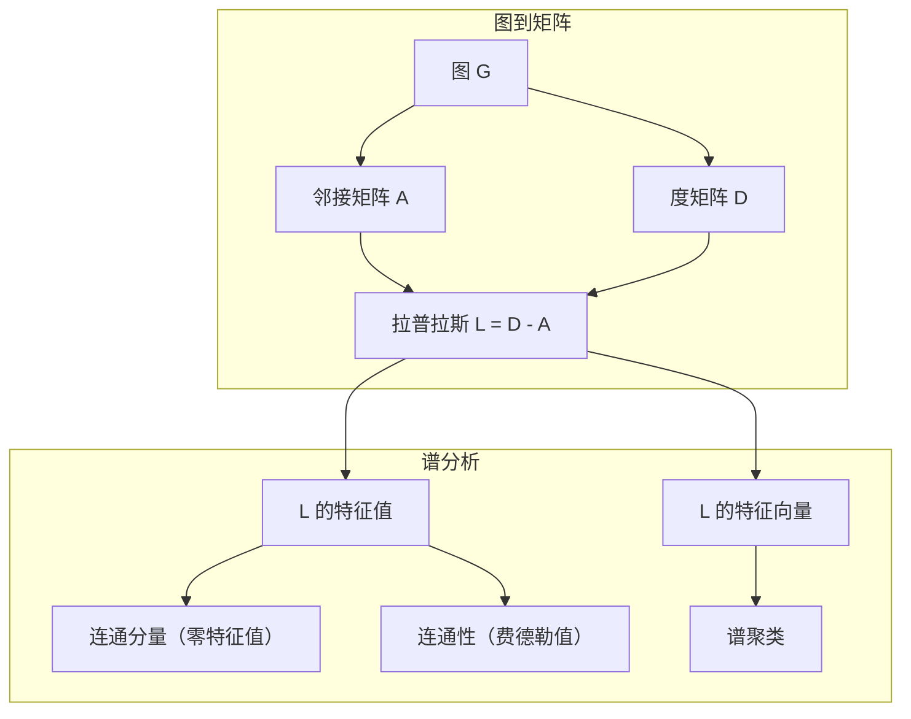
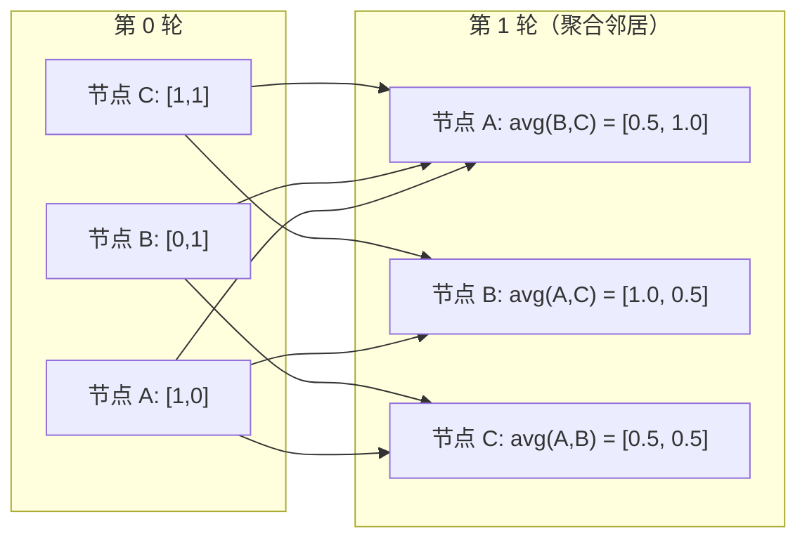

# 图论与机器学习

> 图是关系的数据结构。如果你的数据之间存在连接关系，你需要的正是图论。

**类型：** 构建  
**语言：** Python  
**前置要求：** 阶段一，第01-03课（线性代数、矩阵）  
**时间：** 约90分钟

## 学习目标

- 构建一个使用邻接矩阵/邻接表表示的图类，并实现广度优先搜索（BFS）和深度优先搜索（DFS）遍历
- 计算图拉普拉斯矩阵，并利用其特征值检测连通分量并对节点进行聚类
- 实现一轮图神经网络（GNN）风格的消息传递，即归一化邻接矩阵乘法
- 使用费德勒向量（Fiedler vector）对图进行谱聚类

## 问题背景

社交网络、分子、知识图谱、论文引用网络、道路地图——这些都是图。传统的机器学习将数据视为扁平表格：每行独立，每个特征是一列。但当连接结构很重要时，表格就失效了。

考虑一个社交网络：你想预测某个用户会购买什么产品。他们的购买历史很重要，但朋友们的购买历史更重要。连接关系承载着信号。

再考虑一个分子：你想预测它是否与某种蛋白质结合。原子很重要，但真正重要的是原子之间的键合方式。结构本身就是数据。

图神经网络（GNN）是深度学习发展最快的领域。它们驱动着药物发现、社交推荐、欺诈检测和知识图谱推理。每一个GNN都建立在相同的基础之上：基本的图论。

你需要四样东西：
1. 一种将图表示为矩阵的方法（以便进行矩阵乘法）
2. 遍历算法来探索图结构
3. 拉普拉斯矩阵（Laplacian）——谱图理论中最重要的矩阵
4. 消息传递（Message Passing）——GNN工作所依赖的核心操作

## 概念

### 图：节点与边

一个图 G = (V, E) 由顶点（节点）V 和边 E 组成。每条边连接两个节点。

**有向图与无向图。** 在无向图中，边 (u, v) 表示 u 连接到 v 且 v 也连接到 u。在有向图中，边 (u, v) 表示 u 指向 v，但不一定反过来。

**加权图与非加权图。** 在非加权图中，边要么存在要么不存在。在加权图中，每条边有一个数值权重——距离、成本、强度。

| 图类型 | 示例 |
|--------|------|
| 无向、非加权 | Facebook 好友网络 |
| 有向、非加权 | Twitter 关注网络 |
| 无向、加权 | 道路地图（距离） |
| 有向、加权 | 网页链接（PageRank 分数） |

### 邻接矩阵（Adjacency Matrix）

邻接矩阵 A 是核心表示。对于一个有 n 个节点的图：

```
A[i][j] = 1    如果存在从节点 i 到节点 j 的边
A[i][j] = 0    否则
```

对于无向图，A 是对称的：A[i][j] = A[j][i]。对于加权图，A[i][j] = 边 (i, j) 的权重。

**示例——三角形图：**

```
节点：0, 1, 2
边：(0,1), (1,2), (0,2)

A = [[0, 1, 1],
     [1, 0, 1],
     [1, 1, 0]]
```

邻接矩阵是每个 GNN 的输入。对 A 的矩阵操作对应着对图的操作。

### 度（Degree）

一个节点的度是与它相连的边的数量。对于有向图，有入度（指向该节点的边数）和出度（从该节点出发的边数）。

度矩阵 D 是对角矩阵：

```
D[i][i] = 节点 i 的度
D[i][j] = 0   对于 i != j
```

对于三角形图示例：D = diag(2, 2, 2)，因为每个节点连接其他两个节点。

度告诉你节点的重要性。高度 = 枢纽节点。网络的度分布揭示了其结构。社交网络遵循幂律分布（少数枢纽，大量叶子节点）。随机图的度服从泊松分布。

### 广度优先搜索（BFS）与深度优先搜索（DFS）

两种基本的图遍历算法。你都需要掌握。

**广度优先搜索（BFS）：** 先探索所有邻居，再探索邻居的邻居。使用队列（先进先出）。

```
从节点 0 开始 BFS：
  访问 0
  队列：[1, 2]        (0 的邻居)
  访问 1
  队列：[2, 3]        (添加 1 的邻居)
  访问 2
  队列：[3]           (2 的邻居已访问)
  访问 3
  队列：[]            (完成)
```

BFS 找到非加权图中的最短路径。从起点到任何节点的距离等于该节点首次被发现时的 BFS 层级。这就是为什么 BFS 用于社交网络中的跳数距离。

**深度优先搜索（DFS）：** 尽可能深入，然后回溯。使用栈（后进先出）或递归。

```
从节点 0 开始 DFS：
  访问 0
  栈：[1, 2]        (0 的邻居)
  访问 2            (从栈中弹出)
  栈：[1, 3]        (添加 2 的邻居)
  访问 3            (从栈中弹出)
  栈：[1]
  访问 1            (从栈中弹出)
  栈：[]            (完成)
```

DFS 用于：
- 查找连通分量（从未访问节点运行 DFS）
- 环检测（DFS 树中的回边）
- 拓扑排序（DFS 完成顺序的逆序）

| 算法 | 数据结构 | 查找 | 用例 |
|------|---------|------|------|
| BFS  | 队列    | 最短路径 | 社交网络距离、知识图谱遍历 |
| DFS  | 栈     | 连通分量、环 | 连通性、拓扑排序 |

### 图拉普拉斯矩阵（Graph Laplacian）

L = D - A。谱图理论中最重要的矩阵。

对于三角形图：

```
D = [[2, 0, 0],    A = [[0, 1, 1],    L = [[2, -1, -1],
     [0, 2, 0],         [1, 0, 1],         [-1, 2, -1],
     [0, 0, 2]]         [1, 1, 0]]         [-1, -1,  2]]
```

拉普拉斯矩阵具有显著的性质：

1. **L 是半正定矩阵。** 所有特征值 >= 0。

2. **零特征值的个数等于连通分量的个数。** 一个连通图恰好有一个零特征值。一个有3个不连通分量的图有三个零特征值。

3. **最小的非零特征值（费德勒值，Fiedler value）衡量连通性。** 大的费德勒值意味着图连接良好。小的费德勒值意味着图存在薄弱点——瓶颈。

4. **费德勒值的特征向量（费德勒向量，Fiedler vector）揭示了最佳分割。** 值为正的节点归为一组，值为负的节点归为另一组。这就是谱聚类（Spectral Clustering）。



### 谱性质

邻接矩阵和拉普拉斯矩阵的特征值无需遍历就能揭示结构性质。

**谱聚类**的工作原理如下：
1. 计算拉普拉斯矩阵 L
2. 找到 L 的 k 个最小特征向量（跳过第一个，对于连通图它是全1向量）
3. 将这些特征向量作为每个节点的新坐标
4. 在这些坐标上运行 k-means

为什么有效？L 的特征向量编码了图上“最平滑”的函数。连通良好的节点获得相似的特征向量值。被瓶颈隔开的节点获得不同的值。特征向量自然地分离出簇。

**随机游走的联系。** 归一化拉普拉斯矩阵与图上的随机游走相关。随机游走的稳态分布与节点度成正比。混合时间（游走收敛的速度）取决于谱间隙。

### 消息传递（Message Passing）

图神经网络的核心操作。每个节点从它的邻居收集消息，聚合它们，并更新自己的状态。

```
h_v^(k+1) = UPDATE(h_v^(k), AGGREGATE({h_u^(k) : u in neighbors(v)}))
```

在最简单的形式中，AGGREGATE = 均值，UPDATE = 线性变换 + 激活函数：

```
h_v^(k+1) = sigma(W * mean({h_u^(k) : u in neighbors(v)}))
```

这实际上是矩阵乘法。如果 H 是所有节点特征的矩阵，A 是邻接矩阵：

```
H^(k+1) = sigma(A_norm * H^(k) * W)
```

其中 A_norm 是归一化邻接矩阵（每行和为1）。

一轮消息传递让每个节点“看到”它的直接邻居。两轮让它看到邻居的邻居。K 轮让每个节点获得其 K 跳邻域的信息。



### 概念与机器学习应用

| 概念 | 机器学习应用 |
|------|-------------|
| 邻接矩阵 | GNN 输入表示 |
| 图拉普拉斯矩阵 | 谱聚类、社区检测 |
| BFS/DFS | 知识图谱遍历、路径查找 |
| 度分布 | 节点重要性、特征工程 |
| 消息传递 | GNN 层（GCN、GAT、GraphSAGE） |
| L 的特征值 | 社区检测、图划分 |
| 谱聚类 | 无监督节点分组 |
| PageRank | 节点重要性、网络搜索 |

## 动手构建

### 第一步：从头构建图类

```python
class Graph:
    def __init__(self, n_nodes, directed=False):
        self.n = n_nodes
        self.directed = directed
        self.adj = {i: {} for i in range(n_nodes)}

    def add_edge(self, u, v, weight=1.0):
        self.adj[u][v] = weight
        if not self.directed:
            self.adj[v][u] = weight

    def neighbors(self, node):
        return list(self.adj[node].keys())

    def degree(self, node):
        return len(self.adj[node])

    def adjacency_matrix(self):
        import numpy as np
        A = np.zeros((self.n, self.n))
        for u in range(self.n):
            for v, w in self.adj[u].items():
                A[u][v] = w
        return A

    def degree_matrix(self):
        import numpy as np
        D = np.zeros((self.n, self.n))
        for i in range(self.n):
            D[i][i] = self.degree(i)
        return D

    def laplacian(self):
        return self.degree_matrix() - self.adjacency_matrix()
```

邻接表（`self.adj`）高效存储邻居。邻接矩阵转换使用 numpy，因为所有谱操作都需要它。

### 第二步：BFS 和 DFS

```python
from collections import deque

def bfs(graph, start):
    visited = set()
    order = []
    distances = {}
    queue = deque([(start, 0)])
    visited.add(start)
    while queue:
        node, dist = queue.popleft()
        order.append(node)
        distances[node] = dist
        for neighbor in graph.neighbors(node):
            if neighbor not in visited:
                visited.add(neighbor)
                queue.append((neighbor, dist + 1))
    return order, distances


def dfs(graph, start):
    visited = set()
    order = []
    stack = [start]
    while stack:
        node = stack.pop()
        if node in visited:
            continue
        visited.add(node)
        order.append(node)
        for neighbor in reversed(graph.neighbors(node)):
            if neighbor not in visited:
                stack.append(neighbor)
    return order
```

BFS 使用双端队列（deque）来实现 O(1) 的 popleft 操作。DFS 使用列表作为栈。两者都恰好访问每个节点一次——时间复杂度 O(V + E)。

### 第三步：连通分量与拉普拉斯特征值

```python
def connected_components(graph):
    visited = set()
    components = []
    for node in range(graph.n):
        if node not in visited:
            order, _ = bfs(graph, node)
            visited.update(order)
            components.append(order)
    return components


def laplacian_eigenvalues(graph):
    import numpy as np
    L = graph.laplacian()
    eigenvalues = np.linalg.eigvalsh(L)
    return eigenvalues
```

`eigvalsh` 用于对称矩阵——对于无向图，拉普拉斯矩阵始终是对称的。它按升序返回特征值。统计零特征值的数量以找到连通分量的个数。

### 第四步：谱聚类

```python
def spectral_clustering(graph, k=2):
    import numpy as np
    L = graph.laplacian()
    eigenvalues, eigenvectors = np.linalg.eigh(L)
    features = eigenvectors[:, 1:k+1]

    labels = np.zeros(graph.n, dtype=int)
    for i in range(graph.n):
        if features[i, 0] >= 0:
            labels[i] = 0
        else:
            labels[i] = 1
    return labels
```

对于 k=2，费德勒向量的符号将图分成两个簇。对于 k>2，你需要在前 k 个特征向量（排除平凡的全1特征向量）上运行 k-means。

### 第五步：消息传递

```python
def message_passing(graph, features, weight_matrix):
    import numpy as np
    A = graph.adjacency_matrix()
    row_sums = A.sum(axis=1, keepdims=True)
    row_sums[row_sums == 0] = 1
    A_norm = A / row_sums
    aggregated = A_norm @ features
    output = aggregated @ weight_matrix
    return output
```

这是一轮 GNN 消息传递。每个节点的新特征是邻居特征的加权平均，再经权重矩阵变换。堆叠多轮可以进一步传播信息。

## 使用它

使用 networkx 和 numpy，相同的操作可以一行完成：

```python
import networkx as nx
import numpy as np

G = nx.karate_club_graph()

A = nx.adjacency_matrix(G).toarray()
L = nx.laplacian_matrix(G).toarray()

eigenvalues = np.linalg.eigvalsh(L.astype(float))
print(f"最小特征值：{eigenvalues[:5]}")
print(f"连通分量数：{nx.number_connected_components(G)}")

communities = nx.community.greedy_modularity_communities(G)
print(f"发现的社区数：{len(communities)}")

pr = nx.pagerank(G)
top_nodes = sorted(pr.items(), key=lambda x: x[1], reverse=True)[:5]
print(f"PageRank 前5节点：{top_nodes}")
```

networkx 通过优化的 C 后端处理任意大小的图。在生产环境中使用它。使用你的从头实现来理解它的原理。

### numpy 谱分析

```python
import numpy as np

A = np.array([
    [0, 1, 1, 0, 0],
    [1, 0, 1, 0, 0],
    [1, 1, 0, 1, 0],
    [0, 0, 1, 0, 1],
    [0, 0, 0, 1, 0]
])

D = np.diag(A.sum(axis=1))
L = D - A

eigenvalues, eigenvectors = np.linalg.eigh(L)
print(f"特征值：{np.round(eigenvalues, 4)}")
print(f"费德勒值：{eigenvalues[1]:.4f}")
print(f"费德勒向量：{np.round(eigenvectors[:, 1], 4)}")

fiedler = eigenvectors[:, 1]
group_a = np.where(fiedler >= 0)[0]
group_b = np.where(fiedler < 0)[0]
print(f"簇 A：{group_a}")
print(f"簇 B：{group_b}")
```

费德勒向量完成了繁重的工作。正项在一个簇，负项在另一个簇。不需要迭代优化——只需一次特征分解。

## 交付成果

本课产出：
- `outputs/skill-graph-analysis.md` —— 用于分析图结构数据的技能参考

## 关联

| 概念 | 出现场景 |
|------|---------