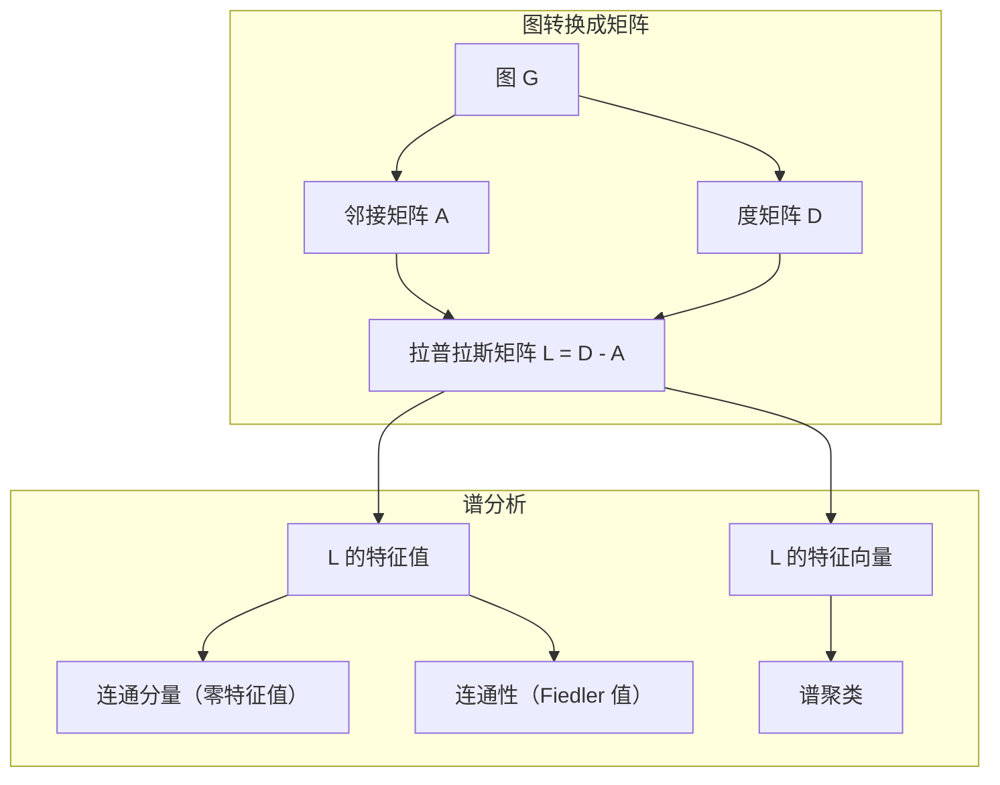
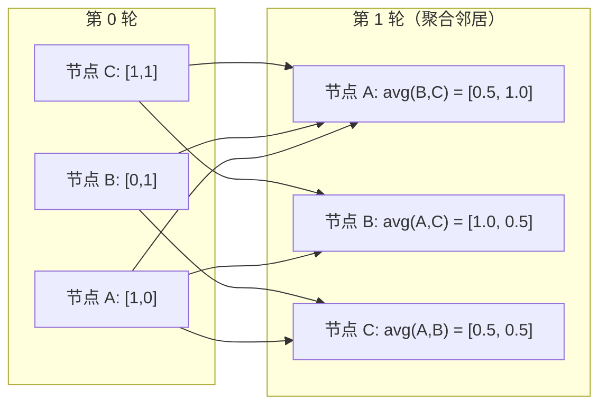

# 面向机器学习的图论

> 译注：本文译自同目录 [`en.md`](./en.md)。术语遵循仓根 [TRANSLATION_GUIDE.md](../../../../TRANSLATION_GUIDE.md)。

> 图（graph）是关系的数据结构。只要你的数据里有连接，就需要图论。

**Type:** Build
**Language:** Python
**Prerequisites:** Phase 1, Lessons 01-03 (linear algebra, matrices)
**Time:** ~90 minutes

## 学习目标（Learning Objectives）

- 实现一个 Graph 类，支持邻接矩阵 / 邻接表两种表示，并实现 BFS 和 DFS 遍历
- 计算图拉普拉斯矩阵（graph Laplacian），用它的特征值（eigenvalue）来检测连通分量并对节点聚类
- 用归一化邻接矩阵乘法实现一轮 GNN 风格的消息传递（message passing）
- 用 Fiedler 向量做谱聚类（spectral clustering），把图切成两部分

## 问题（Problem）

社交网络、分子、知识库、引文网络、道路地图——这些都是图。传统 ML 把数据当成扁平表格：每行是独立样本，每列是一个特征。可是当「连接的结构」本身就是关键信息时，表格就崩了。

想想社交网络。你想预测一个用户会买什么商品。他自己的购买历史固然重要，但他朋友的购买历史更重要。**连接本身**带有信号。

再想想一个分子。你想预测它会不会和某种蛋白结合。原子很重要，但真正决定一切的是原子之间的化学键。**结构就是数据**。

图神经网络（Graph Neural Networks，GNN）是深度学习里增长最快的方向。它驱动了药物发现、社交推荐、欺诈检测、知识图谱推理。每一个 GNN 都建立在同一个地基上：基础图论。

你需要四样东西：
1. 一种把图表示成矩阵的方式（这样才能做矩阵乘法）
2. 遍历算法，用来探索图的结构
3. 拉普拉斯矩阵——谱图论里最重要的那一个矩阵
4. 消息传递——让 GNN 真正跑起来的那个操作

## 概念（Concept）

### 图：节点和边（Graphs: Nodes and Edges）

一个图 G = (V, E) 由顶点（vertex / node）集合 V 和边（edge）集合 E 组成。每条边连接两个节点。

**有向 vs 无向。** 在无向图里，边 (u, v) 意味着 u 连到 v 并且 v 也连到 u。在有向图（digraph）里，边 (u, v) 表示 u 指向 v，但反方向不一定成立。

**带权 vs 无权。** 无权图里边要么存在要么不存在。带权图里每条边带一个数值权重——可以是距离、代价、强度。

| 图的类型 | 例子 |
|-----------|---------|
| 无向无权 | Facebook 好友网络 |
| 有向无权 | Twitter 关注网络 |
| 无向带权 | 道路地图（距离） |
| 有向带权 | 网页链接（PageRank 分数） |

### 邻接矩阵（The Adjacency Matrix）

邻接矩阵 A 是核心表示。对一个有 n 个节点的图：

```
A[i][j] = 1    if there is an edge from node i to node j
A[i][j] = 0    otherwise
```

对无向图，A 是对称的：A[i][j] = A[j][i]。对带权图，A[i][j] 等于边 (i, j) 的权重。

**例子——一个三角形：**

```
Nodes: 0, 1, 2
Edges: (0,1), (1,2), (0,2)

A = [[0, 1, 1],
     [1, 0, 1],
     [1, 1, 0]]
```

邻接矩阵是每一个 GNN 的输入。在 A 上做矩阵运算，就对应着在图上做某种操作。

### 度（Degree）

一个节点的度（degree）是连接到它的边数。对有向图，分入度（in-degree，指进来的边）和出度（out-degree，指出去的边）。

度矩阵 D 是一个对角矩阵：

```
D[i][i] = degree of node i
D[i][j] = 0    for i != j
```

三角形那个例子里 D = diag(2, 2, 2)，因为每个节点都连着另外两个。

度可以告诉你节点的重要程度。度高 = 枢纽节点。一个网络的度分布（degree distribution）会暴露它的结构：社交网络服从幂律（少量枢纽 + 大量叶子节点），随机图的度服从泊松分布。

### BFS 和 DFS（BFS and DFS）

两种最基础的图遍历算法。两个都得会。

**广度优先搜索（Breadth-First Search，BFS）：** 先访问完所有邻居，再去访问邻居的邻居。用队列（FIFO）实现。

```
BFS from node 0:
  Visit 0
  Queue: [1, 2]        (neighbors of 0)
  Visit 1
  Queue: [2, 3]        (add neighbors of 1)
  Visit 2
  Queue: [3]           (neighbors of 2 already visited)
  Visit 3
  Queue: []            (done)
```

BFS 在无权图上能找到最短路径。从起点到任意节点的距离，等于 BFS 第一次发现该节点时所在的层数。这就是为什么社交网络里算「跳数距离」要用 BFS。

**深度优先搜索（Depth-First Search，DFS）：** 一条路走到黑，再回头。用栈（LIFO）或递归实现。

```
DFS from node 0:
  Visit 0
  Stack: [1, 2]        (neighbors of 0)
  Visit 2               (pop from stack)
  Stack: [1, 3]         (add neighbors of 2)
  Visit 3               (pop from stack)
  Stack: [1]
  Visit 1               (pop from stack)
  Stack: []             (done)
```

DFS 适合用来：
- 找连通分量（从未访问过的节点出发跑 DFS）
- 检测环（DFS 树里的回边）
- 拓扑排序（DFS 完成顺序的逆序）

| 算法 | 数据结构 | 能找到什么 | 使用场景 |
|-----------|---------------|-------|----------|
| BFS | 队列 | 最短路径 | 社交网络距离、知识图谱遍历 |
| DFS | 栈 | 连通分量、环 | 连通性、拓扑排序 |

### 图拉普拉斯（The Graph Laplacian）

L = D - A。谱图论里最重要的矩阵。

对那个三角形：

```
D = [[2, 0, 0],    A = [[0, 1, 1],    L = [[2, -1, -1],
     [0, 2, 0],         [1, 0, 1],         [-1, 2, -1],
     [0, 0, 2]]         [1, 1, 0]]         [-1, -1,  2]]
```

拉普拉斯有几个非常漂亮的性质：

1. **L 是半正定的（positive semi-definite）。** 所有特征值 >= 0。

2. **零特征值的个数 = 连通分量的个数。** 一个连通图恰好有 1 个零特征值。一个有 3 个分量的图就有 3 个零特征值。

3. **最小的非零特征值（Fiedler 值）刻画连通强度。** Fiedler 值大说明图连得很紧；Fiedler 值小说明图里有薄弱点——存在瓶颈。

4. **Fiedler 值对应的特征向量（Fiedler 向量）告诉你最佳的切分方式。** 值为正的节点分一组，值为负的分另一组。这就是谱聚类。



### 谱性质（Spectral Properties）

邻接矩阵和拉普拉斯的特征值，不需要任何遍历，就能揭示图的结构性质。

**谱聚类（spectral clustering）的步骤：**
1. 计算拉普拉斯矩阵 L
2. 找出 L 的最小 k 个特征向量（跳过第一个——对连通图来说，第一个就是全 1 向量）
3. 把这些特征向量当作每个节点的新坐标
4. 在这些坐标上跑 k-means

为什么这样行得通？L 的特征向量编码了图上「最平滑」的函数。连得紧的节点拿到相近的特征向量值；被瓶颈隔开的节点拿到截然不同的值。特征向量天然把不同的簇分开。

**和随机游走的联系。** 归一化拉普拉斯和图上的随机游走（random walk）有关。随机游走的稳态分布（stationary distribution）正比于节点的度。混合时间（mixing time，也就是游走多快收敛到稳态）取决于谱间隙（spectral gap）。

### 消息传递（Message Passing）

图神经网络的核心操作。每个节点从邻居那儿收消息，聚合一下，然后更新自己的状态。

```
h_v^(k+1) = UPDATE(h_v^(k), AGGREGATE({h_u^(k) : u in neighbors(v)}))
```

最简单的形式里，AGGREGATE 用平均，UPDATE 是「线性变换 + 激活」：

```
h_v^(k+1) = sigma(W * mean({h_u^(k) : u in neighbors(v)}))
```

这其实是矩阵乘法换了个马甲。如果 H 是所有节点特征拼起来的矩阵，A 是邻接矩阵：

```
H^(k+1) = sigma(A_norm * H^(k) * W)
```

其中 A_norm 是归一化的邻接矩阵（每一行和为 1）。

跑一轮消息传递，每个节点能「看见」自己的直接邻居。两轮后能看见邻居的邻居。K 轮后每个节点拿到的信息覆盖它的 K 跳（K-hop）邻域。



### 概念与 ML 应用对照（Concepts and ML Applications）

| 概念 | ML 应用 |
|---------|---------------|
| 邻接矩阵 | GNN 的输入表示 |
| 图拉普拉斯 | 谱聚类、社区发现 |
| BFS / DFS | 知识图谱遍历、寻路 |
| 度分布 | 节点重要性、特征工程 |
| 消息传递 | GNN 的层（GCN、GAT、GraphSAGE） |
| L 的特征值 | 社区发现、图划分 |
| 谱聚类 | 无监督节点分组 |
| PageRank | 节点重要性、网页搜索 |

## 动手实现（Build It）

### 步骤 1：从零写一个 Graph 类

```python
class Graph:
    def __init__(self, n_nodes, directed=False):
        self.n = n_nodes
        self.directed = directed
        self.adj = {i: {} for i in range(n_nodes)}

    def add_edge(self, u, v, weight=1.0):
        self.adj[u][v] = weight
        if not self.directed:
            self.adj[v][u] = weight

    def neighbors(self, node):
        return list(self.adj[node].keys())

    def degree(self, node):
        return len(self.adj[node])

    def adjacency_matrix(self):
        import numpy as np
        A = np.zeros((self.n, self.n))
        for u in range(self.n):
            for v, w in self.adj[u].items():
                A[u][v] = w
        return A

    def degree_matrix(self):
        import numpy as np
        D = np.zeros((self.n, self.n))
        for i in range(self.n):
            D[i][i] = self.degree(i)
        return D

    def laplacian(self):
        return self.degree_matrix() - self.adjacency_matrix()
```

邻接表（`self.adj`）紧凑地存邻居关系。转邻接矩阵那一步用 numpy，是因为后面所有谱运算都需要 numpy。

### 步骤 2：BFS 和 DFS

```python
from collections import deque

def bfs(graph, start):
    visited = set()
    order = []
    distances = {}
    queue = deque([(start, 0)])
    visited.add(start)
    while queue:
        node, dist = queue.popleft()
        order.append(node)
        distances[node] = dist
        for neighbor in graph.neighbors(node):
            if neighbor not in visited:
                visited.add(neighbor)
                queue.append((neighbor, dist + 1))
    return order, distances


def dfs(graph, start):
    visited = set()
    order = []
    stack = [start]
    while stack:
        node = stack.pop()
        if node in visited:
            continue
        visited.add(node)
        order.append(node)
        for neighbor in reversed(graph.neighbors(node)):
            if neighbor not in visited:
                stack.append(neighbor)
    return order
```

BFS 用 deque（双端队列），popleft 是 O(1)。DFS 把 list 当栈用。两个算法都恰好访问每个节点一次——时间复杂度 O(V + E)。

### 步骤 3：连通分量与拉普拉斯特征值

```python
def connected_components(graph):
    visited = set()
    components = []
    for node in range(graph.n):
        if node not in visited:
            order, _ = bfs(graph, node)
            visited.update(order)
            components.append(order)
    return components


def laplacian_eigenvalues(graph):
    import numpy as np
    L = graph.laplacian()
    eigenvalues = np.linalg.eigvalsh(L)
    return eigenvalues
```

`eigvalsh` 是给对称矩阵用的——无向图的拉普拉斯永远对称。它返回升序的特征值数组。数一数有几个零，就知道有几个连通分量。

### 步骤 4：谱聚类

```python
def spectral_clustering(graph, k=2):
    import numpy as np
    L = graph.laplacian()
    eigenvalues, eigenvectors = np.linalg.eigh(L)
    features = eigenvectors[:, 1:k+1]

    labels = np.zeros(graph.n, dtype=int)
    for i in range(graph.n):
        if features[i, 0] >= 0:
            labels[i] = 0
        else:
            labels[i] = 1
    return labels
```

当 k=2 时，看 Fiedler 向量的正负号就能把图劈成两半。当 k>2 时，要在前 k 个特征向量（去掉那个平凡的全 1 向量）上跑 k-means。

### 步骤 5：消息传递

```python
def message_passing(graph, features, weight_matrix):
    import numpy as np
    A = graph.adjacency_matrix()
    row_sums = A.sum(axis=1, keepdims=True)
    row_sums[row_sums == 0] = 1
    A_norm = A / row_sums
    aggregated = A_norm @ features
    output = aggregated @ weight_matrix
    return output
```

这就是一轮 GNN 消息传递。每个节点的新特征 = 邻居特征的加权平均，再过一遍权重矩阵。叠几轮就能把信息传得更远。

## 用起来（Use It）

用 networkx 加 numpy，上面这些操作全是一行的事：

```python
import networkx as nx
import numpy as np

G = nx.karate_club_graph()

A = nx.adjacency_matrix(G).toarray()
L = nx.laplacian_matrix(G).toarray()

eigenvalues = np.linalg.eigvalsh(L.astype(float))
print(f"Smallest eigenvalues: {eigenvalues[:5]}")
print(f"Connected components: {nx.number_connected_components(G)}")

communities = nx.community.greedy_modularity_communities(G)
print(f"Communities found: {len(communities)}")

pr = nx.pagerank(G)
top_nodes = sorted(pr.items(), key=lambda x: x[1], reverse=True)[:5]
print(f"Top 5 PageRank nodes: {top_nodes}")
```

networkx 用优化过的 C 后端，能处理任意规模的图。生产环境用它。从零写的版本只是用来理解它在干什么。

### 用 numpy 做谱分析

```python
import numpy as np

A = np.array([
    [0, 1, 1, 0, 0],
    [1, 0, 1, 0, 0],
    [1, 1, 0, 1, 0],
    [0, 0, 1, 0, 1],
    [0, 0, 0, 1, 0]
])

D = np.diag(A.sum(axis=1))
L = D - A

eigenvalues, eigenvectors = np.linalg.eigh(L)
print(f"Eigenvalues: {np.round(eigenvalues, 4)}")
print(f"Fiedler value: {eigenvalues[1]:.4f}")
print(f"Fiedler vector: {np.round(eigenvectors[:, 1], 4)}")

fiedler = eigenvectors[:, 1]
group_a = np.where(fiedler >= 0)[0]
group_b = np.where(fiedler < 0)[0]
print(f"Cluster A: {group_a}")
print(f"Cluster B: {group_b}")
```

Fiedler 向量挑大梁：一边是正值，一边是负值。完全不需要迭代优化——一次特征分解就搞定。

## 上线部署（Ship It）

这一课的产物：
- `outputs/skill-graph-analysis.md`——一份用于分析图结构数据的 skill 参考

## 关联（Connections）

| 概念 | 出现在哪里 |
|---------|------------------|
| 邻接矩阵 | GCN、GAT、GraphSAGE 的输入 |
| 拉普拉斯 | 谱聚类、ChebNet 滤波器 |
| BFS | 知识图谱遍历、最短路径查询 |
| 消息传递 | 每一个 GNN 层、neural message passing |
| 谱间隙 | 图的连通性、随机游走的混合时间 |
| 度分布 | 幂律网络、节点特征工程 |
| 连通分量 | 数据预处理、处理非连通图 |
| PageRank | 节点重要性排序、attention 初始化 |

GNN 值得单独说一下。GCN（Kipf & Welling, 2017）里的图卷积操作用的是「加了自环的邻接矩阵」，A_hat = A + I：

```text
H^(l+1) = sigma(D_hat^(-1/2) * A_hat * D_hat^(-1/2) * H^(l) * W^(l))
```

这里 A_hat = A + I（邻接 + 自环），D_hat 是 A_hat 的度矩阵。自环保证每个节点在聚合时也把自己的特征算进去。这正是带对称归一化的消息传递。D_hat^(-1/2) * A_hat * D_hat^(-1/2) 就是归一化邻接矩阵。拉普拉斯之所以会冒出来，是因为这种归一化和 L_sym = I - D^(-1/2) * A * D^(-1/2) 直接相关。理解了拉普拉斯，就理解了 GCN 为什么能 work。

## 练习（Exercises）

1. **从零实现 PageRank。** 初始分数全部均匀。每一步：score(v) = (1-d)/n + d * sum(score(u)/out_degree(u))，其中 u 遍历所有指向 v 的节点。取 d=0.85。一直跑到收敛（变化 < 1e-6）。在一个小规模网页图上测试。

2. **用谱聚类找社区。** 构造一个包含两个明显分离的簇的图（例如两个团 / clique 用一条边相连）。跑谱聚类，验证它能找出正确的切分。如果你不断增加跨簇的边，结果会怎样？

3. **实现 Dijkstra 算法**，在带权图上求最短路径。在权重统一的图上，把它的结果和 BFS 对照一下。

4. **搭一个两层的消息传递网络。** 用两个不同的权重矩阵跑两轮消息传递。验证两轮之后每个节点确实拿到了它 2 跳邻域的信息。

5. **分析一张真实图。** 用 Karate Club 图（34 个节点、78 条边）。计算度分布、拉普拉斯特征值、谱聚类结果。把谱聚类的结果和已知的 ground-truth 划分对比一下。

## 关键术语（Key Terms）

| 术语 | 大家口头怎么说 | 实际指什么 |
|------|----------------|----------------------|
| Graph（图） | 「节点和边」 | 一个数学结构 G=(V,E)，编码两两之间的关系 |
| Adjacency matrix（邻接矩阵） | 「连接关系表」 | 一个 n × n 矩阵，A[i][j] = 1 表示节点 i 和 j 相连 |
| Degree（度） | 「这个节点连得多紧」 | 一个节点连接的边数 |
| Laplacian（拉普拉斯） | 「D 减 A」 | L = D - A，特征值揭示图结构的那个矩阵 |
| Fiedler value（Fiedler 值） | 「代数连通度」 | L 的最小非零特征值，衡量图连得有多紧 |
| BFS | 「按层搜索」 | 把所有邻居先访问完再下潜，能找到最短路径 |
| DFS | 「先一条道走到黑」 | 沿一条路径走到尽头再回溯 |
| Message passing（消息传递） | 「节点和邻居说话」 | 每个节点聚合邻居的信息——GNN 的核心 |
| Spectral clustering（谱聚类） | 「按特征向量聚类」 | 用拉普拉斯的特征向量来划分图 |
| Connected component（连通分量） | 「一块独立的部分」 | 一个极大子图，里面任意两节点都互相可达 |

## 延伸阅读（Further Reading）

- **Kipf & Welling (2017)**——《Semi-Supervised Classification with Graph Convolutional Networks》。开启现代 GNN 的论文。证明谱图卷积可以化简成消息传递。
- **Spielman (2012)**——《Spectral Graph Theory》讲义。关于拉普拉斯、谱间隙、图划分的权威入门。
- **Hamilton (2020)**——《Graph Representation Learning》。一本从基础到应用全面覆盖 GNN 的书。
- **Bronstein et al. (2021)**——《Geometric Deep Learning: Grids, Groups, Graphs, Geodesics, and Gauges》。给整个领域提供统一框架的论文。
- **Veličković et al. (2018)**——《Graph Attention Networks》。把消息传递扩展为带 attention 机制的版本。
