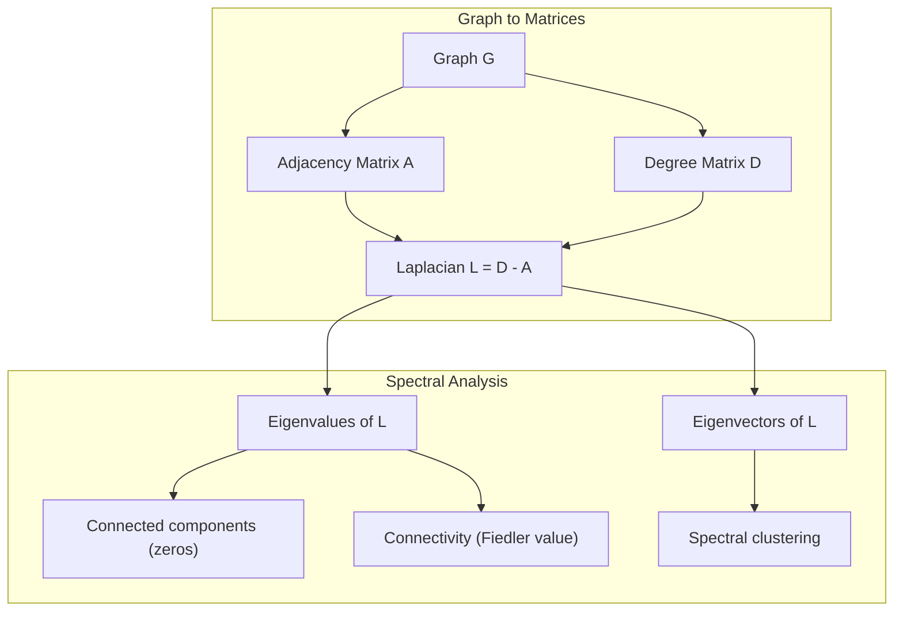
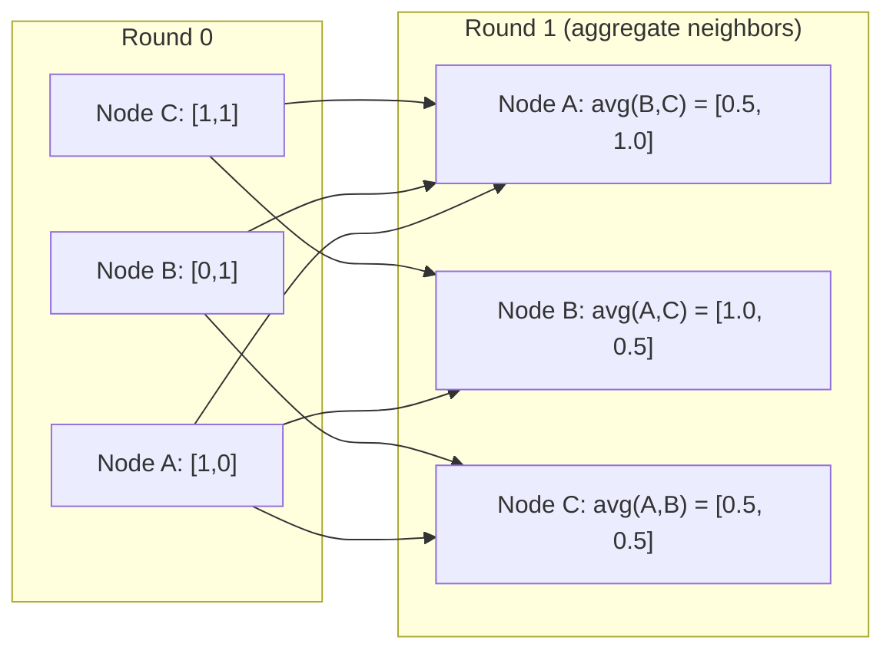

# 機器學習中的圖論

> 圖是描述「關係」的資料結構。只要你的資料有連結，你就需要圖論。

**類型：** 實作
**程式語言：** Python
**先修單元：** 階段 1 · 01-03（線性代數、矩陣）
**時間：** 約 90 分鐘

## 學習目標

- 實作一個圖類別，支援鄰接矩陣與鄰接串列兩種表示法，並實作 BFS 與 DFS 走訪
- 計算圖的拉普拉斯矩陣，並用它的特徵值找出連通元件、對節點分群
- 把一輪 GNN 式的訊息傳遞實作成一次正規化鄰接矩陣乘法
- 用 Fiedler 向量做譜分群，把一張圖切成兩塊

## 問題所在

社群網路、分子、知識庫、引用網路、道路地圖 —— 全都是圖。傳統機器學習把資料當成一張攤平的表格：每一列彼此獨立，每個特徵是一個欄位。但當「連結的結構」本身就有意義時，表格就撐不住了。

想想一個社群網路。你想預測某個使用者會買什麼產品。他自己的購買紀錄有用，但他朋友的購買紀錄更有用。連結本身就帶著訊號。

或者想想一個分子。你想預測它會不會跟某個蛋白質結合。原子有意義，但真正關鍵的是原子之間如何鍵結。結構就是資料。

圖神經網路（GNN）是深度學習裡成長最快的領域。它撐起了藥物探索、社群推薦、詐欺偵測與知識圖譜推論。而每一種 GNN 都建立在同一套基礎上：基本的圖論。

你需要四樣東西：
1. 一種把圖表示成矩陣的方式（這樣才能拿去做乘法）
2. 走訪演算法，用來探索圖的結構
3. 拉普拉斯矩陣 —— 譜圖論裡最重要的那一個矩陣
4. 訊息傳遞 —— 讓 GNN 運作起來的那個運算

## 核心概念

### 圖：節點與邊

一張圖 G = (V, E) 由頂點（節點）V 與邊 E 組成。每條邊連接兩個節點。

**有向與無向。** 在無向圖裡，邊 (u, v) 代表 u 連到 v，而且 v 也連到 u。在有向圖（digraph）裡，邊 (u, v) 代表 u 指向 v，但反方向不一定成立。

**有權重與無權重。** 在無權重圖裡，邊只有存在與不存在兩種狀態。在有權重圖裡，每條邊都帶一個數值權重 —— 可能是距離、成本，或關係的強度。

| 圖的類型 | 例子 |
|-----------|---------|
| 無向、無權重 | Facebook 好友網路 |
| 有向、無權重 | Twitter 追蹤網路 |
| 無向、有權重 | 道路地圖（距離） |
| 有向、有權重 | 網頁連結（PageRank 分數） |

### 鄰接矩陣

鄰接矩陣 A 是最核心的表示法。對一張有 n 個節點的圖：

```
A[i][j] = 1    if there is an edge from node i to node j
A[i][j] = 0    otherwise
```

對無向圖來說，A 是對稱的：A[i][j] = A[j][i]。對有權重圖來說，A[i][j] 就是邊 (i, j) 的權重。

**例子 —— 一個三角形：**

```
Nodes: 0, 1, 2
Edges: (0,1), (1,2), (0,2)

A = [[0, 1, 1],
     [1, 0, 1],
     [1, 1, 0]]
```

鄰接矩陣是每一種 GNN 的輸入。在 A 上做矩陣運算，就對應到在圖上做操作。

### 度

一個節點的度就是連到它的邊數。對有向圖，度分成入度（進來的邊）與出度（出去的邊）。

度矩陣 D 是對角矩陣：

```
D[i][i] = degree of node i
D[i][j] = 0    for i != j
```

上面那個三角形的例子：D = diag(2, 2, 2)，因為每個節點都連到另外兩個節點。

度可以告訴你節點的重要性。度很高 = 樞紐節點。而整個網路的度分布會透露它的結構：社群網路遵循冪次律（少數樞紐、大量葉節點），隨機圖的度則呈 Poisson 分布。

### BFS 與 DFS

兩個最基本的圖走訪演算法。兩個你都要會。

**廣度優先搜尋（BFS）：** 先走完所有鄰居，再走鄰居的鄰居。用佇列（FIFO）。

```
BFS from node 0:
  Visit 0
  Queue: [1, 2]        (neighbors of 0)
  Visit 1
  Queue: [2, 3]        (add neighbors of 1)
  Visit 2
  Queue: [3]           (neighbors of 2 already visited)
  Visit 3
  Queue: []            (done)
```

BFS 能在無權重圖裡找出最短路徑。從起點到任一節點的距離，就等於該節點第一次被發現時所在的 BFS 層數。這就是為什麼社群網路裡算「幾跳之遙」都用 BFS。

**深度優先搜尋（DFS）：** 能走多深就走多深，走不下去才回頭。用堆疊（LIFO）或遞迴。

```
DFS from node 0:
  Visit 0
  Stack: [1, 2]        (neighbors of 0)
  Visit 2               (pop from stack)
  Stack: [1, 3]         (add neighbors of 2)
  Visit 3               (pop from stack)
  Stack: [1]
  Visit 1               (pop from stack)
  Stack: []             (done)
```

DFS 適合用來：
- 找連通元件（從還沒走訪過的節點各跑一次 DFS）
- 偵測環（DFS 樹裡的回邊）
- 拓撲排序（把 DFS 的完成順序反過來）

| 演算法 | 資料結構 | 找得到什麼 | 使用場合 |
|-----------|---------------|-------|----------|
| BFS | 佇列 | 最短路徑 | 社群網路距離、知識圖譜走訪 |
| DFS | 堆疊 | 連通元件、環 | 連通性、拓撲排序 |

### 圖的拉普拉斯矩陣

L = D - A。譜圖論裡最重要的矩陣。

以三角形為例：

```
D = [[2, 0, 0],    A = [[0, 1, 1],    L = [[2, -1, -1],
     [0, 2, 0],         [1, 0, 1],         [-1, 2, -1],
     [0, 0, 2]]         [1, 1, 0]]         [-1, -1,  2]]
```

拉普拉斯矩陣有幾個很了不起的性質：

1. **L 是半正定的。** 所有特徵值都 >= 0。

2. **零特徵值的個數等於連通元件的個數。** 一張連通的圖恰好有一個零特徵值。有 3 個互不相連元件的圖，就有三個零特徵值。

3. **最小的非零特徵值（Fiedler 值）衡量連通程度。** Fiedler 值很大，代表這張圖連得很緊密；Fiedler 值很小，代表圖上有個脆弱處 —— 一個瓶頸。

4. **Fiedler 值對應的特徵向量（Fiedler 向量）會指出最好的切法。** 值為正的節點歸一組，值為負的節點歸另一組。這就是譜分群。


```mermaid
graph TD
    subgraph "Graph to Matrices"
        G["Graph G"] --> A["Adjacency Matrix A"]
        G --> D["Degree Matrix D"]
        A --> L["Laplacian L = D - A"]
        D --> L
    end
    subgraph "Spectral Analysis"
        L --> E["Eigenvalues of L"]
        L --> V["Eigenvectors of L"]
        E --> C["Connected components (zeros)"]
        E --> F["Connectivity (Fiedler value)"]
        V --> S["Spectral clustering"]
    end
```

### 譜性質

鄰接矩陣與拉普拉斯矩陣的特徵值，能在完全不做走訪的情況下揭露圖的結構性質。

**譜分群**的做法是這樣：
1. 算出拉普拉斯矩陣 L
2. 找出 L 最小的 k 個特徵向量（跳過第一個，對連通圖來說它是全 1 向量）
3. 把這些特徵向量當成每個節點的新座標
4. 在這些座標上跑 k-means

為什麼這樣行得通？L 的特徵向量編碼了圖上「最平滑」的那些函式。連得緊密的節點會拿到相近的特徵向量值；被瓶頸隔開的節點會拿到差很多的值。特徵向量自然就把叢集分開了。

**與隨機漫步的關聯。** 正規化的拉普拉斯矩陣跟圖上的隨機漫步有關。隨機漫步的穩態分布與節點的度成正比。混合時間（漫步收斂得多快）則取決於譜間隙。

### 訊息傳遞

圖神經網路的核心運算。每個節點從鄰居收集訊息、把它們聚合起來，然後更新自己的狀態。

```
h_v^(k+1) = UPDATE(h_v^(k), AGGREGATE({h_u^(k) : u in neighbors(v)}))
```

最簡單的形式裡，AGGREGATE = 平均，UPDATE = 線性變換 + 活化函式：

```
h_v^(k+1) = sigma(W * mean({h_u^(k) : u in neighbors(v)}))
```

這其實就是矩陣乘法換了個樣子。如果 H 是所有節點特徵組成的矩陣，A 是鄰接矩陣：

```
H^(k+1) = sigma(A_norm * H^(k) * W)
```

其中 A_norm 是正規化的鄰接矩陣（每一列加起來等於 1）。

一輪訊息傳遞讓每個節點「看見」它的直接鄰居。兩輪讓它看見鄰居的鄰居。K 輪之後，每個節點就拿到了它 K 跳鄰域內的資訊。


```mermaid
graph LR
    subgraph "Round 0"
        A0["Node A: [1,0]"]
        B0["Node B: [0,1]"]
        C0["Node C: [1,1]"]
    end
    subgraph "Round 1 (aggregate neighbors)"
        A1["Node A: avg(B,C) = [0.5, 1.0]"]
        B1["Node B: avg(A,C) = [1.0, 0.5]"]
        C1["Node C: avg(A,B) = [0.5, 0.5]"]
    end
    A0 --> A1
    B0 --> A1
    C0 --> A1
    A0 --> B1
    C0 --> B1
    A0 --> C1
    B0 --> C1
```

### 概念與機器學習應用

| 概念 | 機器學習應用 |
|---------|---------------|
| 鄰接矩陣 | GNN 的輸入表示 |
| 圖的拉普拉斯矩陣 | 譜分群、社群偵測 |
| BFS／DFS | 知識圖譜走訪、路徑搜尋 |
| 度分布 | 節點重要性、特徵工程 |
| 訊息傳遞 | GNN 層（GCN、GAT、GraphSAGE） |
| L 的特徵值 | 社群偵測、圖切割 |
| 譜分群 | 非監督式的節點分組 |
| PageRank | 節點重要性、網頁搜尋 |

```figure
graph-degree-distribution
```

## 動手實作

### 步驟 1：從零寫一個圖類別

```python
class Graph:
    def __init__(self, n_nodes, directed=False):
        self.n = n_nodes
        self.directed = directed
        self.adj = {i: {} for i in range(n_nodes)}

    def add_edge(self, u, v, weight=1.0):
        self.adj[u][v] = weight
        if not self.directed:
            self.adj[v][u] = weight

    def neighbors(self, node):
        return list(self.adj[node].keys())

    def degree(self, node):
        return len(self.adj[node])

    def adjacency_matrix(self):
        import numpy as np
        A = np.zeros((self.n, self.n))
        for u in range(self.n):
            for v, w in self.adj[u].items():
                A[u][v] = w
        return A

    def degree_matrix(self):
        import numpy as np
        D = np.zeros((self.n, self.n))
        for i in range(self.n):
            D[i][i] = self.degree(i)
        return D

    def laplacian(self):
        return self.degree_matrix() - self.adjacency_matrix()
```

鄰接串列（`self.adj`）能有效率地存放鄰居。轉成鄰接矩陣時用 numpy，因為所有譜運算都需要它。

### 步驟 2：BFS 與 DFS

```python
from collections import deque

def bfs(graph, start):
    visited = set()
    order = []
    distances = {}
    queue = deque([(start, 0)])
    visited.add(start)
    while queue:
        node, dist = queue.popleft()
        order.append(node)
        distances[node] = dist
        for neighbor in graph.neighbors(node):
            if neighbor not in visited:
                visited.add(neighbor)
                queue.append((neighbor, dist + 1))
    return order, distances


def dfs(graph, start):
    visited = set()
    order = []
    stack = [start]
    while stack:
        node = stack.pop()
        if node in visited:
            continue
        visited.add(node)
        order.append(node)
        for neighbor in reversed(graph.neighbors(node)):
            if neighbor not in visited:
                stack.append(neighbor)
    return order
```

BFS 用 deque（雙端佇列）來取得 O(1) 的 popleft。DFS 直接把 list 當堆疊用。兩者都恰好走訪每個節點一次 —— 時間複雜度 O(V + E)。

### 步驟 3：連通元件與拉普拉斯特徵值

```python
def connected_components(graph):
    visited = set()
    components = []
    for node in range(graph.n):
        if node not in visited:
            order, _ = bfs(graph, node)
            visited.update(order)
            components.append(order)
    return components


def laplacian_eigenvalues(graph):
    import numpy as np
    L = graph.laplacian()
    eigenvalues = np.linalg.eigvalsh(L)
    return eigenvalues
```

`eigvalsh` 是給對稱矩陣用的 —— 無向圖的拉普拉斯矩陣一定對稱。它回傳的特徵值由小到大排列。數一數有幾個零，就知道有幾個連通元件。

### 步驟 4：譜分群

```python
def spectral_clustering(graph, k=2):
    import numpy as np
    L = graph.laplacian()
    eigenvalues, eigenvectors = np.linalg.eigh(L)
    features = eigenvectors[:, 1:k+1]

    labels = np.zeros(graph.n, dtype=int)
    for i in range(graph.n):
        if features[i, 0] >= 0:
            labels[i] = 0
        else:
            labels[i] = 1
    return labels
```

k=2 時，Fiedler 向量的正負號就把圖切成兩個叢集。k>2 時，你會拿前 k 個特徵向量去跑 k-means（排除全 1 那個平凡特徵向量）。

### 步驟 5：訊息傳遞

```python
def message_passing(graph, features, weight_matrix):
    import numpy as np
    A = graph.adjacency_matrix()
    row_sums = A.sum(axis=1, keepdims=True)
    row_sums[row_sums == 0] = 1
    A_norm = A / row_sums
    aggregated = A_norm @ features
    output = aggregated @ weight_matrix
    return output
```

這就是一輪 GNN 訊息傳遞。每個節點的新特徵，是它鄰居特徵的加權平均，再經過權重矩陣變換。多疊幾輪，資訊就能傳得更遠。

## 框架應用

用 networkx 和 numpy，上面這些操作都是一行搞定：

```python
import networkx as nx
import numpy as np

G = nx.karate_club_graph()

A = nx.adjacency_matrix(G).toarray()
L = nx.laplacian_matrix(G).toarray()

eigenvalues = np.linalg.eigvalsh(L.astype(float))
print(f"Smallest eigenvalues: {eigenvalues[:5]}")
print(f"Connected components: {nx.number_connected_components(G)}")

communities = nx.community.greedy_modularity_communities(G)
print(f"Communities found: {len(communities)}")

pr = nx.pagerank(G)
top_nodes = sorted(pr.items(), key=lambda x: x[1], reverse=True)[:5]
print(f"Top 5 PageRank nodes: {top_nodes}")
```

networkx 靠最佳化過的 C 後端處理任何規模的圖。上線就用它。從零寫的版本，是用來搞懂它到底在做什麼。

### numpy 譜分析

```python
import numpy as np

A = np.array([
    [0, 1, 1, 0, 0],
    [1, 0, 1, 0, 0],
    [1, 1, 0, 1, 0],
    [0, 0, 1, 0, 1],
    [0, 0, 0, 1, 0]
])

D = np.diag(A.sum(axis=1))
L = D - A

eigenvalues, eigenvectors = np.linalg.eigh(L)
print(f"Eigenvalues: {np.round(eigenvalues, 4)}")
print(f"Fiedler value: {eigenvalues[1]:.4f}")
print(f"Fiedler vector: {np.round(eigenvectors[:, 1], 4)}")

fiedler = eigenvectors[:, 1]
group_a = np.where(fiedler >= 0)[0]
group_b = np.where(fiedler < 0)[0]
print(f"Cluster A: {group_a}")
print(f"Cluster B: {group_b}")
```

重活都是 Fiedler 向量幹的。正的分量歸一個叢集，負的歸另一個。不需要任何迭代最佳化 —— 只要一次特徵分解。

## 產出交付

這個單元會產出：
- `outputs/skill-graph-analysis.md` —— 一份分析圖結構資料的技能參考

## 關聯

| 概念 | 會在哪裡出現 |
|---------|------------------|
| 鄰接矩陣 | GCN、GAT、GraphSAGE 的輸入 |
| 拉普拉斯矩陣 | 譜分群、ChebNet 濾波器 |
| BFS | 知識圖譜走訪、最短路徑查詢 |
| 訊息傳遞 | 每一個 GNN 層、神經訊息傳遞 |
| 譜間隙 | 圖的連通性、隨機漫步的混合時間 |
| 度分布 | 冪次律網路、節點特徵工程 |
| 連通元件 | 前處理、處理不連通的圖 |
| PageRank | 節點重要性排序、注意力初始化 |

GNN 值得特別提一下。GCN（Kipf & Welling, 2017）裡的圖卷積運算，用的是加上自迴圈後的鄰接矩陣 A_hat = A + I：

```text
H^(l+1) = sigma(D_hat^(-1/2) * A_hat * D_hat^(-1/2) * H^(l) * W^(l))
```

其中 A_hat = A + I（鄰接矩陣加上自迴圈），D_hat 是 A_hat 的度矩陣。自迴圈確保每個節點在聚合時也算進自己的特徵。這正是帶對稱正規化的訊息傳遞。D_hat^(-1/2) * A_hat * D_hat^(-1/2) 就是正規化鄰接矩陣。拉普拉斯矩陣之所以會出現，是因為這種正規化跟 L_sym = I - D^(-1/2) * A * D^(-1/2) 有關。懂了拉普拉斯矩陣，就懂了 GCN 為什麼有效。

## 練習

1. **從零實作 PageRank。** 一開始所有分數都相同。每一步：對所有指向 v 的 u，score(v) = (1-d)/n + d * sum(score(u)/out_degree(u))。取 d=0.85。跑到收斂為止（變化 < 1e-6）。拿一個小的網頁圖來測試。

2. **用譜分群找出社群。** 造一張有兩個明顯分開的叢集的圖（例如兩個團，中間只用一條邊相連）。跑譜分群，確認它切在對的地方。當你把跨叢集的邊愈加愈多，會發生什麼事？

3. **實作 Dijkstra 演算法**，在有權重圖上找最短路徑。把結果拿去跟同一張圖（權重全部相同）上的 BFS 對照。

4. **做一個兩層的訊息傳遞網路。** 用不同的權重矩陣做兩次訊息傳遞。證明兩輪之後，每個節點都拿到了它 2 跳鄰域內的資訊。

5. **分析一張真實世界的圖。** 用 Karate Club 圖（34 個節點、78 條邊）。計算度分布、拉普拉斯特徵值，並做譜分群。把譜分群的結果跟已知的真實分組對照。

## 關鍵術語

| 術語 | 大家怎麼說 | 實際上是什麼 |
|------|----------------|----------------------|
| 圖 | 「節點和邊」 | 一種編碼兩兩關係的數學結構 G=(V,E) |
| 鄰接矩陣 | 「那張連線表」 | 一個 n x n 矩陣，節點 i 與 j 相連時 A[i][j] = 1 |
| 度 | 「一個節點連得多廣」 | 碰到某個節點的邊數 |
| 拉普拉斯矩陣 | 「D 減 A」 | L = D - A，其特徵值會揭露圖結構的那個矩陣 |
| Fiedler 值 | 「代數連通度」 | L 最小的非零特徵值，衡量這張圖連得多緊密 |
| BFS | 「一層一層搜」 | 走完所有鄰居才往下深入的走訪方式，能找出最短路徑 |
| DFS | 「先往深處走」 | 沿著一條路走到底才回頭的走訪方式 |
| 訊息傳遞 | 「節點跟鄰居講話」 | 每個節點聚合鄰居的資訊，這是 GNN 的核心 |
| 譜分群 | 「用特徵向量分群」 | 用圖的拉普拉斯矩陣特徵向量來切割圖 |
| 連通元件 | 「分開的一塊」 | 一個極大子圖，其中任一節點都能走到其他任一節點 |

## 延伸閱讀

- **Kipf & Welling (2017)** —— "Semi-Supervised Classification with Graph Convolutional Networks." 開啟現代 GNN 的那篇論文。證明譜圖卷積可以化簡成訊息傳遞。
- **Spielman (2012)** —— "Spectral Graph Theory" 講義。關於拉普拉斯矩陣、譜間隙與圖切割最權威的入門材料。
- **Hamilton (2020)** —— "Graph Representation Learning." 一本從基礎講到應用的 GNN 專書。
- **Bronstein et al. (2021)** —— "Geometric Deep Learning: Grids, Groups, Graphs, Geodesics, and Gauges." 提出統一框架的那篇論文。
- **Veličković et al. (2018)** —— "Graph Attention Networks." 把注意力機制帶進訊息傳遞。
