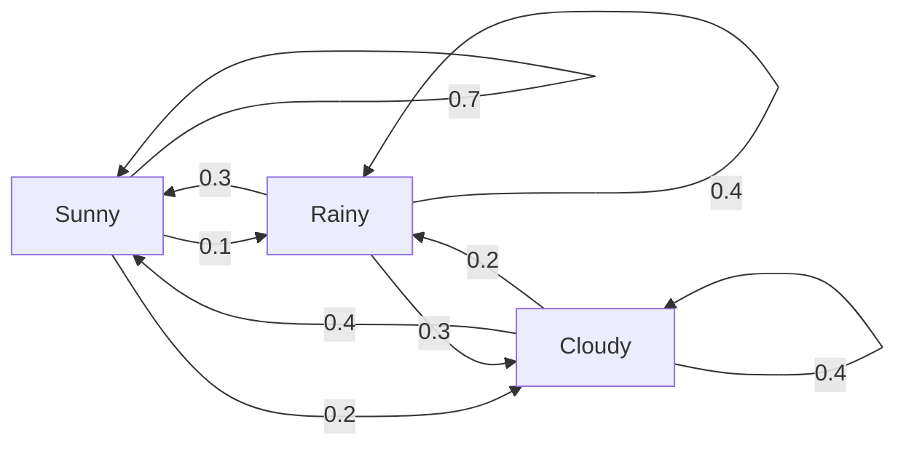
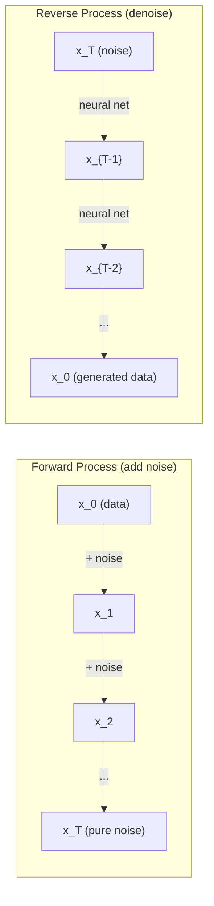

# Stokastik Süreçler

> Yapı ile rastgelelik. Rastgele yürüyüşlerin, Markov zincirlerinin ve yayılma modellerinin arkasındaki matematik.

**Tür:** Öğren
**Dil:** Python
**Önkoşullar:** Aşama 1, Dersler 06-07 (olasılık, Bayes)
**Süre:** ~75 dakika

## Öğrenme Hedefleri

- 1B ve 2B rastgele yürüyüşleri simüle edin ve yer değiştirmenin sqrt(n) ölçeklendirmesini doğrulayın
- Bir Markov zincir simülatörü oluşturun ve özbileşim yoluyla bunun durağan dağılımını hesaplayın
- Hedef dağılımlardan örnekleme için Metropolis-Hastings MCMC ve Langevin dinamiklerinin uygulanması
- İleri yayılma sürecini Brown hareketine bağlayın ve ters sürecin nasıl veri ürettiğini açıklayın

## Sorun

Birçok yapay zeka sistemi zaman içinde gelişen rastgelelik içerir. Statik rastgelelik değil; her adımın daha önce gelene bağlı olduğu yapılandırılmış, sıralı rastgelelik.

Dil modelleri token'leri birer birer oluşturur. Her token önceki bağlama bağlıdır. Model bir olasılık dağılımı çıkarır, bundan örnekler alır ve yoluna devam eder. Bu stokastik bir süreçtir.

Difüzyon modelleri, görüntü tamamen statik hale gelinceye kadar görüntüye adım adım gürültü ekler. Daha sonra süreci tersine çevirerek, yeni bir görüntü ortaya çıkana kadar adım adım gürültü çıkarırlar. İleri süreç bir Markov zinciridir. Ters süreç, geriye doğru çalışan öğrenilmiş bir Markov zinciridir.

Takviyeli öğrenme agent'ler bir ortamda eylem gerçekleştirir. Her eylem belli bir olasılıkla yeni bir duruma yol açar. agent rastgele bir dünyada rastgele bir politika izler. Her şey bir Markov karar sürecidir.

Bayesian inference'nin omurgası olan MCMC örneklemesi, örnek almak istediğiniz sonuncu sabit dağılımı olan bir Markov zinciri oluşturur.

Bunların hepsi dört temel fikir üzerine kuruludur:
1. Rastgele yürüyüşler – en basit stokastik süreç
2. Markov zincirleri – geçiş matrisi ile yapılandırılmış rastgelelik
3. Langevin dinamikleri - gradient gürültüyle iniş
4. Metropolis-Hastings - herhangi bir dağıtımdan örnekleme

## Konsept

### Rastgele Yürüyüşler

0 konumundan başlayın. Her adımda adil bir yazı tura atın. Yazılar: sağa doğru hareket edin (+1). Kuyruklar: sola git (-1).

N adımdan sonra konumunuz n rastgele +/-1 değerin toplamıdır. Beklenen konum 0'dır (yürüyüş tarafsızdır). Ancak orijinden beklenen uzaklık sqrt(n) kadar artar.

Bu mantığa aykırıdır. Yürüyüş adil; her iki yönde de kayma yok. Ancak zamanla başladığı yerden daha da uzaklaşır. N adımdan sonraki standart sapma sqrt(n)'dir.

```
Step 0:  Position = 0
Step 1:  Position = +1 or -1
Step 2:  Position = +2, 0, or -2
...
Step 100: Expected distance from origin ~ 10 (sqrt(100))
Step 10000: Expected distance from origin ~ 100 (sqrt(10000))
```

**2B**'de yürüyüş eşit olasılıkla yukarı, aşağı, sola veya sağa doğru hareket eder. Aynı sqrt(n) ölçeklendirmesi orijinden olan mesafe için de geçerlidir. Yol fraktal benzeri bir desen izliyor.

**Neden sqrt(n)?** Her adım eşit olasılıkla +1 veya -1'dir. N adımdan sonra, her X_i'nin +/-1 olduğu S_n = X_1 + X_2 + ... + X_n konumu. Her adımın varyansı 1'dir ve adımlar bağımsızdır, yani Var(S_n) = n. Standart sapma = sqrt(n). Merkezi limit teoremine göre, S_n / sqrt(n) standart bir normal dağılıma yakınsar.

Bu sqrt(n) ölçeklendirmesi ML'nin her yerinde görünür. SGD gürültüsü 1/sqrt(batch_size) olarak ölçeklenir. Embedding boyutları sqrt(d) olarak ölçeklenir. Karekök bağımsız rastgele toplamaların imzasıdır.

**Brown hareketiyle bağlantı.** Adım büyüklüğü 1/sqrt(n) olan ve birim zaman başına n adımla rastgele bir yürüyüş yapın. n sonsuza giderken, yürüyüş Brownian hareketi B(t)'ye yakınsar; bu, B(t)'nin ortalama 0 ve varyans t ile normal olarak dağıtıldığı sürekli zamanlı bir süreçtir.

Brown hareketi difüzyonun matematiksel temelidir. Bir sıvıdaki parçacıkların rastgele sallanmasını, hisse senedi fiyatlarındaki dalgalanmaları ve en önemlisi yayılma modellerindeki gürültü sürecini modeller.

**Kumarbazın yıkımı.** 0 ve N'deki engelleri absorbe eden, k konumundan başlayan rastgele bir yürüyüşçü. 0'dan önce N'ye ulaşma olasılığı nedir? Adil bir yürüyüş için: P(N'ye ulaşma) = k/N. Bu şaşırtıcı derecede basit ve zarif. Bu, martingal teorisine bağlanır - adil rastgele yürüyüş bir martingaledir (gelecekte beklenen değer = mevcut değer).

### Markov Zincirleri

Markov zinciri, sabit olasılıklara göre durumlar arasında geçiş yapan bir sistemdir. Anahtar özellik: Bir sonraki durum geçmişe değil, yalnızca mevcut duruma bağlıdır.

```
P(X_{t+1} = j | X_t = i, X_{t-1} = ...) = P(X_{t+1} = j | X_t = i)
```

Bu Markov'un mülkü. Bu, tüm dinamiği bir geçiş matrisi P ile tanımlayabileceğiniz anlamına gelir:

```
P[i][j] = probability of going from state i to state j
```

P'nin her satırının toplamı 1'dir (bir yere gitmeniz gerekir).

**Örnek -- Hava Durumu:**

```
States: Sunny (0), Rainy (1), Cloudy (2)

P = [[0.7, 0.1, 0.2],    (if sunny: 70% sunny, 10% rainy, 20% cloudy)
     [0.3, 0.4, 0.3],    (if rainy: 30% sunny, 40% rainy, 30% cloudy)
     [0.4, 0.2, 0.4]]    (if cloudy: 40% sunny, 20% rainy, 40% cloudy)
```

Herhangi bir durumda başlayın. Pek çok geçişten sonra durumların dağılımı, pi * P = pi olmak üzere sabit dağılım pi'ye yakınsar. Bu, özdeğeri 1 olan P'nin sol özvektörüdür.

Hava durumu zinciri için sabit dağılım [0,55, 0,18, 0,27]'dir; uzun vadede, başlangıç durumundan bağımsız olarak zamanın %55'i güneşlidir.



**Sabit dağılımın hesaplanması.** İki yaklaşım vardır:

1. **Güç yöntemi**: herhangi bir başlangıç dağılımını P ile tekrar tekrar çarpın. Yeterli yinelemeden sonra yakınsar.
2. **Özdeğer yöntemi**: özdeğeri 1 olan P'nin sol özvektörünü bulun. Bu, özdeğeri 1 olan P^T'nin özvektörüdür.

Her iki yaklaşım da zincirin yakınsama koşullarını karşılamasını gerektirir.

**Yakınsama koşulları.** Bir Markov zinciri aşağıdaki durumlarda benzersiz bir durağan dağılıma yakınsar:
- **İndirgenemez**: her duruma diğer tüm durumlardan ulaşılabilir
- **periyodik olmayan**: zincir sabit bir periyotta döngü yapmaz

ML'de karşılaştığınız çoğu zincir her iki koşulu da karşılar.

**Soğurucu durumlar.** Bir duruma bir kere girdiğinizde bir daha çıkamıyorsanız bu durum emicidir (P[i][i] = 1). Markov'u özümsemek, model süreçlerini terminal durumlarıyla zincirler - biten bir oyun, oyunu kaybeden bir müşteri, metnin sonuna gelen token token dizisi.

**Karıştırma süresi.** Zincirin sabit dağılıma "yakın" olması için kaç adım gerekir? Resmi olarak, durağanlıktan toplam değişim mesafesine kadar atılan adım sayısı belirli bir eşiğin altına düşer. Hızlı karıştırma = birkaç adım gerekir. P'nin spektral boşluğu (1 eksi ikinci en büyük özdeğer) karıştırma süresini kontrol eder. Daha büyük boşluk = daha hızlı karıştırma.

### Dil Modellerine Bağlantı

Bir dil modelinde Token üretimi yaklaşık olarak bir Markov sürecidir. Mevcut bağlam göz önüne alındığında, model bir sonraki token üzerinden bir dağılım çıktısı verir. Sıcaklık keskinliği kontrol eder:

```
P(token_i) = exp(logit_i / temperature) / sum(exp(logit_j / temperature))
```

- Sıcaklık = 1,0: standart dağılım
- Sıcaklık < 1,0: daha keskin (daha deterministik)
- Sıcaklık > 1,0: daha düz (daha rastgele)
- Sıcaklık -> 0: argmax (açgözlü)

En yüksek k örneklemesi en yüksek olasılıklı k token'ye kısaltılır. Üst p (çekirdek) örneklemesi, kümülatif olasılığı p'yi aşan en küçük token kümesine kısaltılır. Her ikisi de Markov geçiş olasılıklarını değiştirir.

### Brownian Hareketi

Rastgele yürüyüşün sürekli zaman sınırı. B(t) konumunun üç özelliği vardır:
1. B(0) = 0
2. B(t) - B(s), ortalaması 0 ve varyansı t - s (t > s için) ile normal dağılım gösterir
3. Üst üste binmeyen aralıklardaki artışlar bağımsızdır

Brown hareketi süreklidir ancak hiçbir yerde türevlenemez; her ölçekte titreşir. Yolun düzlemde fraktal boyutu 2'dir.

Ayrık simülasyonda Brown hareketini şu şekilde tahmin edersiniz:

```
B(t + dt) = B(t) + sqrt(dt) * z,    where z ~ N(0, 1)
```

Sqrt(dt) ölçeklendirmesi önemlidir. Rastgele yürüyüşlere uygulanan merkezi limit teoreminden gelir.

### Langevin Dinamikleri

Gradient iniş bir fonksiyonun minimumunu bulur. Langevin dinamiği, U'nun bir enerji fonksiyonu ve T'nin sıcaklık olduğu exp(-U(x)/T) ile orantılı olasılık dağılımını bulur.

```
x_{t+1} = x_t - dt * gradient(U(x_t)) + sqrt(2 * T * dt) * z_t
```

Parçacığa iki kuvvet etki eder:
1. **Gradient kuvveti** (-dt * gradient(U)): düşük enerjiye doğru iter (gradient inişi gibi)
2. **Rastgele kuvvet** (sqrt(2*T*dt) * z): rastgele yönlerde iter (keşif)

T = 0 sıcaklığında bu saf gradient inişidir. Yüksek sıcaklıkta bu neredeyse rastgele bir yürüyüştür. Doğru sıcaklıkta parçacık enerji ortamını keşfeder ve düşük enerjili bölgelerde daha fazla zaman harcar.

**Yayılma modellerine bağlantı.** Bir yayılma modelinin ileri süreci şöyledir:

```
x_t = sqrt(alpha_t) * x_{t-1} + sqrt(1 - alpha_t) * noise
```

Bu, verileri kademeli olarak gürültüyle karıştıran bir Markov zinciridir. Yeterli adımdan sonra x_T saf Gauss gürültüsüdür.

Gürültüden verilere geri giden ters süreç de bir Markov zinciridir, ancak geçiş olasılıkları bir neural network tarafından öğrenilir. Ağ, her adımda eklenen gürültüyü tahmin etmeyi öğrenir ve ardından onu çıkarır.



### MCMC: Markov Zinciri Monte Carlo

Bazen değerlendirebileceğiniz (bir sabite kadar) ancak doğrudan örnekleyemeyeceğiniz bir p(x) dağılımından örnekleme yapmanız gerekir. Bayes sonsalları klasik bir örnektir; olasılık çarpı öncekini biliyorsunuz, ancak normalleştirme sabiti kontrol edilemez.

**Metropolis-Hastings** durağan dağılımı p(x) olan bir Markov zinciri oluşturur:

1. Herhangi bir x konumundan başlayın
2. Q(x'|x) teklif dağılımından yeni bir x' konumu önerin
3. Hesaplama kabul oranı: a = p(x') * Q(x|x') / (p(x) * Q(x'|x))
4. x''i min(1, a) olasılıkla kabul edin. Aksi takdirde x'te kalın.
5. Tekrar edin.

Q simetrikse (e.g., Q(x'|x) = Q(x|x') = N(x, sigma^2)) oran a = p(x') / p(x) şeklinde basitleşir. Yalnızca olasılık oranına ihtiyacınız var; normalleştirme sabiti iptal edilir.

Zincirin ılımlı koşullar altında p(x)'e yakınsaması garanti edilir. Ancak teklif çok küçükse (rastgele yürüyüş) veya çok büyükse (yüksek ret) yakınsama yavaş olabilir. Teklifi ayarlamak MCMC'nin sanatıdır.

**Neden işe yarıyor?** Kabul oranı ayrıntılı bir denge sağlar: x'te olma ve x'e gitme olasılığı, x'de olma ve x'e gitme olasılığına eşittir. Ayrıntılı denge, p(x)'in zincirin durağan dağılımı olduğunu ima eder. Yeterli adımdan sonra örnekler p(x)'ten gelir.

**Pratik hususlar:**
- **Yanma**: ilk N numuneyi atın. Zincirin başlangıç ​​noktasından sabit dağılıma ulaşması için zamana ihtiyacı vardır.
- **İnceleme**: otokorelasyonu azaltmak için her k'inci örneği saklayın.
- **Birden fazla zincir**: farklı başlangıç noktalarından birkaç zincir çalıştırın. Eğer aynı dağılıma yakınsalarsa, yakınsamaya dair kanıtınız olur.
- **Kabul oranı**: d boyutlu Gauss önerileri için optimal kabul oranı yaklaşık %23'tür (Roberts ve Rosenthal, 2001). Çok yüksek, zincirin zar zor hareket ettiği anlamına gelir. Çok düşük olması her şeyi reddettiği anlamına gelir.

### Yapay Zekada Stokastik Süreçler

| Süreç | Yapay Zeka Uygulaması |
|---------|---------------|
| Rastgele yürüyüş | RL, Node2Vec embeddings'de keşif |
| Markov zinciri | Metin oluşturma, MCMC örnekleme |
| Brown hareketi | Difüzyon modelleri (ileri süreç) |
| Langevin dinamikleri | Puana dayalı üretken modeller, SGLD |
| Markov karar süreci | Takviyeli öğrenme |
| Metropolis-Hastings | Bayesian inference, arka örnekleme |

```figure
random-walk-diffusion
```

## İnşa Et

### Adım 1: Rastgele yürüyüş simülatörü

```python
import numpy as np

def random_walk_1d(n_steps, seed=None):
    rng = np.random.RandomState(seed)
    steps = rng.choice([-1, 1], size=n_steps)
    positions = np.concatenate([[0], np.cumsum(steps)])
    return positions


def random_walk_2d(n_steps, seed=None):
    rng = np.random.RandomState(seed)
    directions = rng.choice(4, size=n_steps)
    dx = np.zeros(n_steps)
    dy = np.zeros(n_steps)
    dx[directions == 0] = 1   # right
    dx[directions == 1] = -1  # left
    dy[directions == 2] = 1   # up
    dy[directions == 3] = -1  # down
    x = np.concatenate([[0], np.cumsum(dx)])
    y = np.concatenate([[0], np.cumsum(dy)])
    return x, y
```

1B yürüyüş kümülatif toplamları saklar. Her adım +1 veya -1'dir. N adımdan sonra konum toplamdır. Varyans n ile doğrusal olarak büyür, dolayısıyla standart sapma sqrt(n) kadar büyür.

### Adım 2: Markov zinciri

```python
class MarkovChain:
    def __init__(self, transition_matrix, state_names=None):
        self.P = np.array(transition_matrix, dtype=float)
        self.n_states = len(self.P)
        self.state_names = state_names or [str(i) for i in range(self.n_states)]

    def step(self, current_state, rng=None):
        if rng is None:
            rng = np.random.RandomState()
        probs = self.P[current_state]
        return rng.choice(self.n_states, p=probs)

    def simulate(self, start_state, n_steps, seed=None):
        rng = np.random.RandomState(seed)
        states = [start_state]
        current = start_state
        for _ in range(n_steps):
            current = self.step(current, rng)
            states.append(current)
        return states

    def stationary_distribution(self):
        eigenvalues, eigenvectors = np.linalg.eig(self.P.T)
        idx = np.argmin(np.abs(eigenvalues - 1.0))
        stationary = np.real(eigenvectors[:, idx])
        stationary = stationary / stationary.sum()
        return np.abs(stationary)
```

Sabit dağılım, P'nin özdeğeri 1 olan sol özvektörüdür. Bunu P^T'nin özvektörlerini hesaplayarak buluruz (transpozisyon, sol özvektörleri sağ özvektörlere dönüştürür).

### Adım 3: Langevin dinamikleri

```python
def langevin_dynamics(grad_U, x0, dt, temperature, n_steps, seed=None):
    rng = np.random.RandomState(seed)
    x = np.array(x0, dtype=float)
    trajectory = [x.copy()]
    for _ in range(n_steps):
        noise = rng.randn(*x.shape)
        x = x - dt * grad_U(x) + np.sqrt(2 * temperature * dt) * noise
        trajectory.append(x.copy())
    return np.array(trajectory)
```

gradient x'i düşük enerjiye doğru iter. Gürültü, sıkışmasını önler. Dengede örneklerin dağılımı exp(-U(x)/sıcaklık) ile orantılıdır.

### Adım 4: Metropolis-Hastings

```python
def metropolis_hastings(target_log_prob, proposal_std, x0, n_samples, seed=None):
    rng = np.random.RandomState(seed)
    x = np.array(x0, dtype=float)
    samples = [x.copy()]
    accepted = 0
    for _ in range(n_samples - 1):
        x_proposed = x + rng.randn(*x.shape) * proposal_std
        log_ratio = target_log_prob(x_proposed) - target_log_prob(x)
        if np.log(rng.rand()) < log_ratio:
            x = x_proposed
            accepted += 1
        samples.append(x.copy())
    acceptance_rate = accepted / (n_samples - 1)
    return np.array(samples), acceptance_rate
```

Algoritma yeni bir nokta önerir, daha yüksek olasılığa sahip olup olmadığını (veya orana orantılı olasılıkla kabul edip etmediğini) kontrol eder ve tekrar eder. İyi bir karışım için kabul oranı %23-50 civarında olmalıdır.

## Kullan onu

Uygulamada bu algoritmalar için yerleşik kütüphaneleri kullanırsınız. Ancak mekaniği anlamak hata ayıklama ve ayarlama açısından önemlidir.

```python
import numpy as np

rng = np.random.RandomState(42)
walk = np.cumsum(rng.choice([-1, 1], size=10000))
print(f"Final position: {walk[-1]}")
print(f"Expected distance: {np.sqrt(10000):.1f}")
print(f"Actual distance: {abs(walk[-1])}")
```

### geçiş matrisleri için numpy

```python
import numpy as np

P = np.array([[0.7, 0.1, 0.2],
              [0.3, 0.4, 0.3],
              [0.4, 0.2, 0.4]])

distribution = np.array([1.0, 0.0, 0.0])
for _ in range(100):
    distribution = distribution @ P

print(f"Stationary distribution: {np.round(distribution, 4)}")
```

Başlangıç dağılımını P ile tekrar tekrar çarpın. Yeterli yinelemeden sonra, nereden başladığınız dikkate alınmaksızın durağan dağılıma yakınsar. Bu baskın sol özvektörü bulmanın güç yöntemidir.

### Gerçek framework'lere bağlantılar

- **PyTorch dağıtımı:** Hugging Face `diffusers`'deki `DDPMScheduler` ileri ve geri Markov zincirlerini uygular
- **NumPyro / PyMC:** Bayesian inference için MCMC'yi (Metropolis-Hastings'i geliştiren NUTS örnekleyici) kullanın
- **Spor Salonu (RL):** Çevre adımı işlevi bir Markov karar sürecini tanımlar

### Markov zinciri yakınsamasının doğrulanması

```python
import numpy as np

P = np.array([[0.9, 0.1], [0.3, 0.7]])

eigenvalues = np.linalg.eigvals(P)
spectral_gap = 1 - sorted(np.abs(eigenvalues))[-2]
print(f"Eigenvalues: {eigenvalues}")
print(f"Spectral gap: {spectral_gap:.4f}")
print(f"Approximate mixing time: {1/spectral_gap:.1f} steps")
```

Spektral boşluk, zincirin başlangıç durumunu ne kadar hızlı unuttuğunu gösterir. 0,2'lik bir boşluk, karıştırmanın kabaca 5 adım olduğu anlamına gelir. 0,01'lik bir boşluk yaklaşık 100 adım anlamına gelir. Uzun simülasyonları çalıştırmadan önce daima bunu kontrol edin; yavaş yavaş karışan bir zincir, hesaplamayı boşa çıkarır.

## Gönderin

Bu ders şunları üretir:
- `outputs/prompt-stochastic-process-advisor.md` -- belirli bir soruna hangi stokastik sürecin (framework) uygulanacağını belirlemeye yardımcı olan bir prompt

## Bağlantılar

| Konsept | Nerede görünüyor |
|---------|------------------|
| Rastgele yürüyüş | Node2Vec grafiği embedding'ler, RL'de keşif |
| Markov zinciri | Yüksek Lisans'ta Token üretimi, MCMC örneklemesi |
| Brown hareketi | DDPM, SDE tabanlı modellerde ileri yayılma süreci |
| Langevin dinamikleri | Puana dayalı üretken modeller, stokastik gradient Langevin dinamiği (SGLD) |
| Sabit dağıtım | MCMC yakınsama hedefi, PageRank |
| Metropolis-Hastings | Bayesian arka örnekleme, simüle edilmiş tavlama |
| Sıcaklık | LLM örnekleme, RL'de Boltzmann araştırması, simüle edilmiş tavlama |
| Karıştırma süresi | MCMC'nin yakınsama hızı, spektral boşluk analizi |
| Emici durum | Sıra sonu token, RL'deki terminal durumları |
| Ayrıntılı bakiye | MCMC örnekleyiciler için doğruluk garantisi |

Difüzyon modelleri özel ilgiyi hak ediyor. DDPM (Ho ve diğerleri, 2020) ileri bir Markov zincirini tanımlar:

```
q(x_t | x_{t-1}) = N(x_t; sqrt(1-beta_t) * x_{t-1}, beta_t * I)
```

burada beta_t bir gürültü çizelgesidir. T adımından sonra x_T yaklaşık olarak N(0, I) olur. Ters işlem, gürültüyü tahmin eden bir neural network tarafından parametrelendirilir:

```
p_theta(x_{t-1} | x_t) = N(x_{t-1}; mu_theta(x_t, t), sigma_t^2 * I)
```

Üretimin her adımı öğrenilmiş bir Markov zincirindeki bir adımdır. Markov zincirlerini anlamak, yayılma modellerinin nasıl ve neden veri ürettiğini anlamak anlamına gelir.

SGLD (Stochastic Gradient Langevin Dynamics), mini toplu gradient inişini Langevin gürültüsüyle birleştirir. gradient'nin tamamını hesaplamak yerine stokastik bir tahmin kullanır ve kalibre edilmiş gürültü eklersiniz. Öğrenme hızı azaldıkça, SGLD optimizasyondan örneklemeye geçer; yaklaşık Bayesian arka örneklerine ücretsiz olarak sahip olursunuz. Bu, neural network'den belirsizlik tahminleri almanın en basit yollarından biridir.

Tüm bu bağlantılardaki temel anlayış: stokastik süreçler yalnızca teorik araçlar değildir. Bunlar modern yapay zeka sistemlerinin içindeki hesaplama mekanizmalarıdır. Bir LLM'nin sıcaklığını ayarladığınızda, bir Markov zincirini ayarlıyorsunuz. Bir yayılma modelini eğittiğinizde Brown hareketine benzer bir süreci tersine çevirmeyi öğreniyorsunuz. Bayesian inference'yi çalıştırdığınızda, posteriora yakınsayan bir zincir inşa ediyorsunuz.

## Egzersizler

1. **10000 adımlık 1000 rastgele yürüyüşü simüle edin.** Son konumların dağılımını çizin. Ortalaması 0 ve standart sapması sqrt(10000) = 100 olan yaklaşık Gaussian olduğunu doğrulayın.

2. **Markov zincirini kullanarak bir metin oluşturucu oluşturun.** Küçük bir derleme üzerinde eğitim alın: Her kelime için bir sonraki kelimeye geçişleri sayın. Geçiş matrisini oluşturun. Zincirden örnek alarak yeni cümleler oluşturun.

3. Metropolis-Hastings'i kullanarak **tavlama simülasyonunu uygulayın**. Yüksek sıcaklıkta başlayın (neredeyse her şeyi kabul edin) ve yavaş yavaş soğumaya başlayın (yalnızca iyileştirmeleri kabul edin). Birçok yerel minimuma sahip bir fonksiyonun minimumunu bulmak için bunu kullanın.

4. **Farklı sıcaklıklarda Langevin dinamiklerini karşılaştırın.** Çift kuyulu potansiyelden örnek U(x) = (x^2 - 1)^2. Düşük sıcaklıkta numuneler bir kuyucukta toplanır. Yüksek sıcaklıkta her ikisine de yayılırlar. Zincirin kuyucuklar arasında karıştığı kritik sıcaklığı bulun.

5. **İleri difüzyon işlemini uygulayın.** 1 boyutlu bir sinyalle başlayın (e.g., sinüs dalgası). Doğrusal bir gürültü programıyla 100 adımın üzerinde kademeli olarak gürültü ekleyin. Sinyalin nasıl saf gürültüye dönüştüğünü gösterin. Daha sonra süreci tersine çeviren basit bir gürültü giderici uygulayın (hatta tahmin edilen gürültüyü çıkaran saf bir yöntem bile).

## Anahtar Terimler

| Dönem | İnsanlar ne diyor | Aslında ne anlama geliyor |
|------|----------------|----------------------|
| Rastgele yürüyüş | "Yazı-tura hareketi" | Her adımda konumun rastgele artışlarla değiştiği bir süreç |
| Markov mülkü | "Hafızasız" | Gelecek, tarihe değil, yalnızca mevcut duruma bağlıdır |
| Geçiş matrisi | "Olasılık tablosu" | P[i][j] = i durumundan j durumuna geçme olasılığı |
| Sabit dağıtım | "Uzun vadeli ortalama" | Pi dağılımı, burada pi*P = pi -- zincirin dengesi |
| Brown hareketi | "Rastgele sallanma" | Rastgele yürüyüşün sürekli zaman limiti, B(t) ~ N(0, t) |
| Langevin dinamikleri | "Gradient gürültülü iniş" | Deterministik gradient ile rastgele pertürbasyonu birleştiren güncelleme kuralı |
| MCMC | "Hedefe doğru yürümek" | Sabit dağılımı istediğiniz gibi olan bir Markov zinciri oluşturmak |
| Metropolis-Hastings | "Öner ve kabul et/reddet" | Yakınsamayı sağlamak için kabul oranlarını kullanan MCMC algoritması |
| Sıcaklık | "Rastgelelik düğmesi" | Keşif ve kullanım arasındaki dengeyi kontrol eden parametre |
| Difüzyon süreci | "Gürültü içeri, gürültü dışarı" | İleri: yavaş yavaş gürültü ekleyin. Tersi: yavaş yavaş çıkarın. Veri üretir. |

## Daha Fazla Okuma

- **Ho, Jain, Abbeel (2020)** -- "Gürültüyü Azaltan Difüzyon Olasılık Modelleri." Difüzyon modeli devrimini başlatan DDPM belgesi. İleri ve geri Markov zincirlerinin net bir şekilde türetilmesi.
- **Song & Ermon (2019)** -- "Veri Dağıtımının Gradient'lerinin Tahmin Edilmesiyle Üretken Modelleme." Örnekleme için Langevin dinamiklerini kullanan puana dayalı yaklaşım.
- **Roberts ve Rosenthal (2004)** -- "Genel durum uzayı Markov zincirleri ve MCMC algoritmaları." MCMC'nin ne zaman ve neden çalıştığının ardındaki teori.
- **Norris (1997)** -- "Markov Zincirleri." Standart ders kitabı. Yakınsaklığı, durağan dağılımları ve isabet sürelerini kapsar.
- **Welling ve Teh (2011)** -- "Stokastik Gradient Langevin Dinamikleri aracılığıyla Bayesian Öğrenme." Ölçeklenebilir Bayesian inference için SGD'yi Langevin dinamikleriyle birleştirir.
