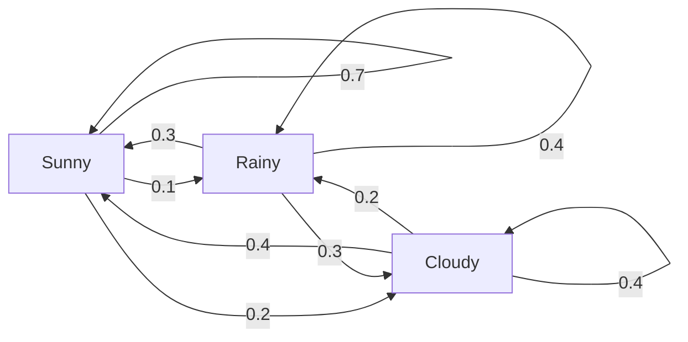
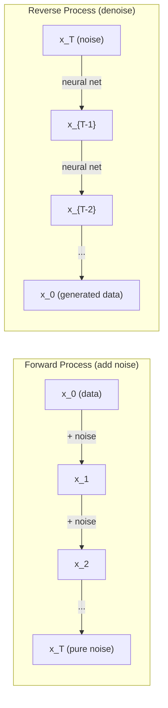

# 22 · 随机过程

> 有结构的随机性。随机游走、马尔可夫链和扩散模型背后的数学。

**类型：** 学习
**语言：** Python
**前置：** 第 1 阶段，第 06-07 课（概率、贝叶斯）
**时长：** 约 75 分钟

## 学习目标

- 模拟一维和二维「随机游走（random walk）」，并验证位移的 sqrt(n) 缩放规律
- 构建「马尔可夫链（Markov chain）」模拟器，并通过特征分解计算其「平稳分布（stationary distribution）」
- 实现「Metropolis-Hastings MCMC」和「朗之万动力学（Langevin dynamics）」，用于从目标分布中采样
- 将正向扩散过程与「布朗运动（Brownian motion）」联系起来，并解释反向过程如何生成数据

## 问题所在

许多 AI 系统涉及随时间演变的随机性。不是静态的随机性——而是有结构、有序列的随机性，其中每一步都依赖于此前发生的事情。

语言模型一次生成一个 token。每个 token 依赖于前面的上下文。模型输出一个概率分布，从中采样，然后继续往下走。这就是一个随机过程。

扩散模型逐步向图像添加噪声，直到它变成纯粹的雪花噪点。然后它反转这个过程，逐步去噪，直到一张新图像浮现出来。正向过程是一条马尔可夫链。反向过程则是一条反向运行的、学习得到的马尔可夫链。

强化学习智能体在环境中采取行动。每个动作以一定的概率引向一个新状态。智能体在一个随机的世界里遵循一个随机的策略。整体而言这就是一个「马尔可夫决策过程（Markov decision process）」。

MCMC 采样——贝叶斯推断的支柱——构建了一条马尔可夫链，其平稳分布正是你想要采样的后验分布。

所有这些都建立在四个基础思想之上：
1. 随机游走——最简单的随机过程
2. 马尔可夫链——带有转移矩阵的结构化随机性
3. 朗之万动力学——带噪声的梯度下降
4. Metropolis-Hastings——从任意分布中采样

## 核心概念

### 随机游走

从位置 0 出发。每一步抛一枚公平硬币。正面：向右移动（+1）。反面：向左移动（-1）。

走 n 步之后，你的位置是 n 个随机 +/-1 值的和。期望位置为 0（这个游走没有偏置）。但距离原点的期望距离会以 sqrt(n) 的速度增长。

这有些反直觉。游走是公平的——没有向任何方向的漂移。但随着时间推移，它会离起点越来越远。走 n 步之后的标准差是 sqrt(n)。

```
Step 0:  Position = 0
Step 1:  Position = +1 or -1
Step 2:  Position = +2, 0, or -2
...
Step 100: Expected distance from origin ~ 10 (sqrt(100))
Step 10000: Expected distance from origin ~ 100 (sqrt(10000))
```

**在二维情形下**，游走以相等的概率向上、向下、向左或向右移动。同样的 sqrt(n) 缩放规律适用于距原点的距离。其路径勾勒出类似分形的图案。

**为什么是 sqrt(n)？** 每一步以相等的概率取 +1 或 -1。走 n 步之后，位置 S_n = X_1 + X_2 + ... + X_n，其中每个 X_i 为 +/-1。每一步的方差为 1，且各步相互独立，所以 Var(S_n) = n。标准差 = sqrt(n)。根据「中心极限定理（central limit theorem）」，S_n / sqrt(n) 会收敛到标准正态分布。

这种 sqrt(n) 缩放规律在机器学习中无处不在。SGD 噪声以 1/sqrt(batch_size) 缩放。嵌入维度以 sqrt(d) 缩放。平方根是独立随机量相加的标志性特征。

**与布朗运动的联系。** 取一个步长为 1/sqrt(n)、每单位时间走 n 步的随机游走。当 n 趋于无穷时，该游走收敛到布朗运动 B(t)——一种连续时间过程，其中 B(t) 服从均值为 0、方差为 t 的正态分布。

布朗运动是扩散的数学基础。它刻画了流体中粒子的随机抖动、股票价格的波动，以及——至关重要的——扩散模型中的噪声过程。

**赌徒破产问题（Gambler's ruin）。** 一个随机游走者从位置 k 出发，在 0 和 N 处各有一个「吸收壁（absorbing barrier）」。在到达 0 之前先到达 N 的概率是多少？对于公平的游走：P(到达 N) = k/N。这个结果出人意料地简洁优雅。它与「鞅（martingale）」理论相关——公平随机游走就是一个鞅（未来值的期望 = 当前值）。

### 马尔可夫链

马尔可夫链是一个按照固定概率在各状态之间转移的系统。关键性质是：下一个状态只依赖于当前状态，而不依赖于历史。

```
P(X_{t+1} = j | X_t = i, X_{t-1} = ...) = P(X_{t+1} = j | X_t = i)
```

这就是「马尔可夫性质（Markov property）」。它意味着你可以用一个转移矩阵 P 来描述整个动力学：

```
P[i][j] = probability of going from state i to state j
```

P 的每一行之和为 1（你总得去某个地方）。

**示例——天气：**

```
States: Sunny (0), Rainy (1), Cloudy (2)

P = [[0.7, 0.1, 0.2],    (if sunny: 70% sunny, 10% rainy, 20% cloudy)
     [0.3, 0.4, 0.3],    (if rainy: 30% sunny, 40% rainy, 30% cloudy)
     [0.4, 0.2, 0.4]]    (if cloudy: 40% sunny, 20% rainy, 40% cloudy)
```

从任意状态出发。经过多次转移后，状态分布会收敛到平稳分布 pi，满足 pi * P = pi。它是 P 对应于特征值 1 的左特征向量。

对于这个天气链，平稳分布可能是 [0.53, 0.18, 0.29]——从长期来看，无论起始状态如何，有 53% 的时间是晴天。



**计算平稳分布。** 有两种方法：

1. **幂法（Power method）**：用任意初始分布反复乘以 P。经过足够多次迭代后，它会收敛。
2. **特征值法（Eigenvalue method）**：求 P 对应于特征值 1 的左特征向量。这就是 P^T 对应于特征值 1 的特征向量。

两种方法都要求该链满足收敛条件。

**收敛条件。** 一条马尔可夫链收敛到唯一平稳分布的条件是它满足：
- **不可约性（Irreducible）**：每个状态都可以从任何其他状态到达
- **非周期性（Aperiodic）**：该链不以固定周期循环

在机器学习中你遇到的大多数链都同时满足这两个条件。

**吸收态（Absorbing states）。** 如果一个状态一旦进入就再也无法离开（P[i][i] = 1），它就是吸收态。带吸收态的马尔可夫链刻画了具有终止状态的过程——一局结束的游戏、一个流失的客户，或一段碰到文本结束 token 的 token 序列。

**混合时间（Mixing time）。** 需要多少步才能让链「接近」平稳分布？严格来说，就是让与平稳分布之间的「总变差距离（total variation distance）」降到某个阈值以下所需的步数。混合得快 = 所需步数少。P 的「谱隙（spectral gap）」（1 减去第二大特征值）决定了混合时间。谱隙越大 = 混合越快。

### 与语言模型的联系

语言模型中的 token 生成近似于一个马尔可夫过程。给定当前上下文，模型输出关于下一个 token 的分布。「温度（temperature）」控制其尖锐程度：

```
P(token_i) = exp(logit_i / temperature) / sum(exp(logit_j / temperature))
```

- 温度 = 1.0：标准分布
- 温度 < 1.0：更尖锐（更确定性）
- 温度 > 1.0：更平坦（更随机）
- 温度 -> 0：argmax（贪婪）

「Top-k 采样」截断到概率最高的 k 个 token。「Top-p（核）采样（nucleus sampling）」截断到累计概率超过 p 的最小 token 集合。两者都修改了马尔可夫转移概率。

### 布朗运动

随机游走的连续时间极限。位置 B(t) 具有三个性质：
1. B(0) = 0
2. B(t) - B(s) 服从均值为 0、方差为 t - s 的正态分布（对于 t > s）
3. 不重叠区间上的增量相互独立

布朗运动连续但处处不可微——它在每个尺度上都在抖动。其路径在平面上的分形维数为 2。

在离散模拟中，你可以用以下方式近似布朗运动：

```
B(t + dt) = B(t) + sqrt(dt) * z,    where z ~ N(0, 1)
```

sqrt(dt) 的缩放很重要。它来自应用于随机游走的中心极限定理。

### 朗之万动力学

梯度下降寻找函数的最小值。朗之万动力学寻找与 exp(-U(x)/T) 成正比的概率分布，其中 U 是能量函数，T 是温度。

```
x_{t+1} = x_t - dt * gradient(U(x_t)) + sqrt(2 * T * dt) * z_t
```

有两种力作用在粒子上：
1. **梯度力**（-dt * gradient(U)）：把粒子推向低能量处（像梯度下降）
2. **随机力**（sqrt(2*T*dt) * z）：把粒子推向随机方向（探索）

当温度 T = 0 时，这就是纯粹的梯度下降。在高温下，它几乎是一个随机游走。在合适的温度下，粒子会探索能量地形，并在低能量区域停留更长的时间。

**与扩散模型的联系。** 扩散模型的正向过程是：

```
x_t = sqrt(alpha_t) * x_{t-1} + sqrt(1 - alpha_t) * noise
```

这是一条逐渐将数据与噪声混合的马尔可夫链。经过足够多步之后，x_T 就是纯高斯噪声。

反向过程——从噪声回到数据——同样是一条马尔可夫链，但其转移概率由一个神经网络学习得到。该网络学会预测每一步所添加的噪声，然后将其减去。



### MCMC：马尔可夫链蒙特卡洛

有时你需要从一个分布 p(x) 中采样，你能（在相差一个常数的意义上）对它求值，却无法直接采样。贝叶斯后验就是经典的例子——你知道似然乘以先验，但归一化常数难以计算。

**Metropolis-Hastings** 构建一条以 p(x) 为平稳分布的马尔可夫链：

1. 从某个位置 x 出发
2. 从「提议分布（proposal distribution）」Q(x'|x) 中提议一个新位置 x'
3. 计算「接受比（acceptance ratio）」：a = p(x') * Q(x|x') / (p(x) * Q(x'|x))
4. 以概率 min(1, a) 接受 x'。否则停留在 x。
5. 重复。

如果 Q 是对称的（例如 Q(x'|x) = Q(x|x') = N(x, sigma^2)），该比值简化为 a = p(x') / p(x)。你只需要概率之比——归一化常数会被抵消。

在温和的条件下，该链保证收敛到 p(x)。但如果提议步长太小（变成随机游走）或太大（高拒绝率），收敛会很慢。调好提议分布是 MCMC 的艺术。

**为什么它有效。** 接受比保证了「细致平衡（detailed balance）」：处于 x 并移动到 x' 的概率等于处于 x' 并移动到 x 的概率。细致平衡意味着 p(x) 是该链的平稳分布。所以经过足够多步之后，采样就来自 p(x)。

**实践考量：**
- **预热期（Burn-in）**：丢弃前 N 个样本。链需要一定时间才能从起始点到达平稳分布。
- **稀释（Thinning）**：每 k 个样本保留一个，以降低「自相关（autocorrelation）」。
- **多链（Multiple chains）**：从不同起始点运行多条链。如果它们收敛到同一个分布，你就有了收敛的证据。
- **接受率（Acceptance rate）**：对于 d 维空间中的高斯提议，最优接受率约为 23%（Roberts & Rosenthal, 2001）。太高意味着链几乎不动。太低意味着它什么都拒绝。

### AI 中的随机过程

| 过程 | AI 应用 |
|---------|---------------|
| 随机游走 | 强化学习中的探索、Node2Vec 嵌入 |
| 马尔可夫链 | 文本生成、MCMC 采样 |
| 布朗运动 | 扩散模型（正向过程） |
| 朗之万动力学 | 基于得分的生成模型、SGLD |
| 马尔可夫决策过程 | 强化学习 |
| Metropolis-Hastings | 贝叶斯推断、后验采样 |

## 动手构建

### 第 1 步：随机游走模拟器

```python
import numpy as np

def random_walk_1d(n_steps, seed=None):
    rng = np.random.RandomState(seed)
    steps = rng.choice([-1, 1], size=n_steps)
    positions = np.concatenate([[0], np.cumsum(steps)])
    return positions


def random_walk_2d(n_steps, seed=None):
    rng = np.random.RandomState(seed)
    directions = rng.choice(4, size=n_steps)
    dx = np.zeros(n_steps)
    dy = np.zeros(n_steps)
    dx[directions == 0] = 1   # 向右
    dx[directions == 1] = -1  # 向左
    dy[directions == 2] = 1   # 向上
    dy[directions == 3] = -1  # 向下
    x = np.concatenate([[0], np.cumsum(dx)])
    y = np.concatenate([[0], np.cumsum(dy)])
    return x, y
```

一维游走存储累计和。每一步为 +1 或 -1。走 n 步之后，位置就是这些步的总和。方差随 n 线性增长，所以标准差以 sqrt(n) 增长。

### 第 2 步：马尔可夫链

```python
class MarkovChain:
    def __init__(self, transition_matrix, state_names=None):
        self.P = np.array(transition_matrix, dtype=float)
        self.n_states = len(self.P)
        self.state_names = state_names or [str(i) for i in range(self.n_states)]

    def step(self, current_state, rng=None):
        if rng is None:
            rng = np.random.RandomState()
        probs = self.P[current_state]
        return rng.choice(self.n_states, p=probs)

    def simulate(self, start_state, n_steps, seed=None):
        rng = np.random.RandomState(seed)
        states = [start_state]
        current = start_state
        for _ in range(n_steps):
            current = self.step(current, rng)
            states.append(current)
        return states

    def stationary_distribution(self):
        eigenvalues, eigenvectors = np.linalg.eig(self.P.T)
        idx = np.argmin(np.abs(eigenvalues - 1.0))
        stationary = np.real(eigenvectors[:, idx])
        stationary = stationary / stationary.sum()
        return np.abs(stationary)
```

平稳分布是 P 对应于特征值 1 的左特征向量。我们通过计算 P^T 的特征向量来求得它（转置会把左特征向量变成右特征向量）。

### 第 3 步：朗之万动力学

```python
def langevin_dynamics(grad_U, x0, dt, temperature, n_steps, seed=None):
    rng = np.random.RandomState(seed)
    x = np.array(x0, dtype=float)
    trajectory = [x.copy()]
    for _ in range(n_steps):
        noise = rng.randn(*x.shape)
        x = x - dt * grad_U(x) + np.sqrt(2 * temperature * dt) * noise
        trajectory.append(x.copy())
    return np.array(trajectory)
```

梯度把 x 推向低能量处。噪声防止它卡住。在平衡状态下，样本的分布与 exp(-U(x)/temperature) 成正比。

### 第 4 步：Metropolis-Hastings

```python
def metropolis_hastings(target_log_prob, proposal_std, x0, n_samples, seed=None):
    rng = np.random.RandomState(seed)
    x = np.array(x0, dtype=float)
    samples = [x.copy()]
    accepted = 0
    for _ in range(n_samples - 1):
        x_proposed = x + rng.randn(*x.shape) * proposal_std
        log_ratio = target_log_prob(x_proposed) - target_log_prob(x)
        if np.log(rng.rand()) < log_ratio:
            x = x_proposed
            accepted += 1
        samples.append(x.copy())
    acceptance_rate = accepted / (n_samples - 1)
    return np.array(samples), acceptance_rate
```

该算法提议一个新点，检查它是否具有更高的概率（或以与比值成正比的概率接受它），然后重复。为了良好的混合，接受率应在 23-50% 左右。

## 实际运用

在实践中，你会使用现成的库来实现这些算法。但理解其内部机制对调试和调参很重要。

```python
import numpy as np

rng = np.random.RandomState(42)
walk = np.cumsum(rng.choice([-1, 1], size=10000))
print(f"Final position: {walk[-1]}")
print(f"Expected distance: {np.sqrt(10000):.1f}")
print(f"Actual distance: {abs(walk[-1])}")
```

### 用 numpy 处理转移矩阵

```python
import numpy as np

P = np.array([[0.7, 0.1, 0.2],
              [0.3, 0.4, 0.3],
              [0.4, 0.2, 0.4]])

distribution = np.array([1.0, 0.0, 0.0])
for _ in range(100):
    distribution = distribution @ P

print(f"Stationary distribution: {np.round(distribution, 4)}")
```

用初始分布反复乘以 P。经过足够多次迭代后，无论从哪里出发，它都会收敛到平稳分布。这就是求主导左特征向量的幂法。

### 与实际框架的联系

- **PyTorch 扩散：** Hugging Face `diffusers` 中的 `DDPMScheduler` 实现了正向和反向马尔可夫链
- **NumPyro / PyMC：** 使用 MCMC（NUTS 采样器，它是对 Metropolis-Hastings 的改进）进行贝叶斯推断
- **Gymnasium（强化学习）：** 环境的 step 函数定义了一个马尔可夫决策过程

### 验证马尔可夫链的收敛性

```python
import numpy as np

P = np.array([[0.9, 0.1], [0.3, 0.7]])

eigenvalues = np.linalg.eigvals(P)
spectral_gap = 1 - sorted(np.abs(eigenvalues))[-2]
print(f"Eigenvalues: {eigenvalues}")
print(f"Spectral gap: {spectral_gap:.4f}")
print(f"Approximate mixing time: {1/spectral_gap:.1f} steps")
```

谱隙告诉你链遗忘其初始状态的速度有多快。0.2 的谱隙意味着大约 5 步即可混合。0.01 的谱隙意味着大约 100 步。在运行长时间模拟之前一定要检查这一点——一条混合缓慢的链会浪费算力。

## 交付成果

这一课产出：
- `outputs/prompt-stochastic-process-advisor.md` —— 一个提示词，帮助识别针对给定问题应当套用哪个随机过程框架

## 关联拓展

| 概念 | 出现的场景 |
|---------|------------------|
| 随机游走 | Node2Vec 图嵌入、强化学习中的探索 |
| 马尔可夫链 | LLM 中的 token 生成、MCMC 采样 |
| 布朗运动 | DDPM 中的正向扩散过程、基于 SDE 的模型 |
| 朗之万动力学 | 基于得分的生成模型、随机梯度朗之万动力学（SGLD） |
| 平稳分布 | MCMC 的收敛目标、PageRank |
| Metropolis-Hastings | 贝叶斯后验采样、模拟退火 |
| 温度 | LLM 采样、强化学习中的玻尔兹曼探索、模拟退火 |
| 混合时间 | MCMC 的收敛速度、谱隙分析 |
| 吸收态 | 序列结束 token、强化学习中的终止状态 |
| 细致平衡 | MCMC 采样器的正确性保证 |

扩散模型值得特别关注。DDPM（Ho et al., 2020）定义了一条正向马尔可夫链：

```
q(x_t | x_{t-1}) = N(x_t; sqrt(1-beta_t) * x_{t-1}, beta_t * I)
```

其中 beta_t 是一个噪声调度。经过 T 步之后，x_T 近似于 N(0, I)。反向过程由一个神经网络参数化，该网络预测噪声：

```
p_theta(x_{t-1} | x_t) = N(x_{t-1}; mu_theta(x_t, t), sigma_t^2 * I)
```

生成的每一步都是一条学习得到的马尔可夫链中的一步。理解马尔可夫链意味着理解扩散模型如何以及为何能生成数据。

SGLD（随机梯度朗之万动力学）把小批量梯度下降与朗之万噪声结合起来。你不再计算完整梯度，而是使用一个随机估计并加入经过校准的噪声。随着学习率衰减，SGLD 从优化过渡到采样——你免费获得了近似的贝叶斯后验样本。这是从神经网络中获取不确定性估计最简单的方法之一。

贯穿所有这些关联的关键洞见是：随机过程不只是理论工具。它们是现代 AI 系统内部的计算机制。当你调节 LLM 的温度时，你是在调整一条马尔可夫链。当你训练一个扩散模型时，你是在学习反转一个类似布朗运动的过程。当你运行贝叶斯推断时，你是在构建一条收敛到后验分布的链。

## 练习

1. **模拟 1000 次、每次 10000 步的随机游走。** 绘制最终位置的分布。验证它近似为均值为 0、标准差为 sqrt(10000) = 100 的高斯分布。

2. **用马尔可夫链构建一个文本生成器。** 在一个小语料库上训练：对每个词，统计到下一个词的转移次数。构建转移矩阵。通过从链中采样来生成新句子。

3. **用 Metropolis-Hastings 实现模拟退火。** 从高温开始（几乎接受一切），逐渐降温（只接受改进）。用它来寻找一个有许多局部极小值的函数的最小值。

4. **比较不同温度下的朗之万动力学。** 从双势阱 U(x) = (x^2 - 1)^2 中采样。在低温下，样本聚集在某一个阱中。在高温下，它们分散在两个阱中。找到链在两个阱之间混合的临界温度。

5. **实现正向扩散过程。** 从一个一维信号（例如正弦波）开始。在 100 步内用线性噪声调度逐步添加噪声。展示信号如何退化为纯噪声。然后实现一个简单的去噪器来反转该过程（哪怕是只减去估计噪声的朴素版本）。

## 关键术语

| 术语 | 人们怎么说 | 它实际指什么 |
|------|----------------|----------------------|
| 随机游走 | "抛硬币式移动" | 位置在每一步按随机增量变化的过程 |
| 马尔可夫性质 | "无记忆性" | 未来只依赖于当前状态，而不依赖于历史 |
| 转移矩阵 | "那张概率表" | P[i][j] = 从状态 i 移动到状态 j 的概率 |
| 平稳分布 | "长期平均" | 满足 pi*P = pi 的分布 pi——链的平衡态 |
| 布朗运动 | "随机抖动" | 随机游走的连续时间极限，B(t) ~ N(0, t) |
| 朗之万动力学 | "带噪声的梯度下降" | 把确定性梯度和随机扰动结合起来的更新规则 |
| MCMC | "朝目标走过去" | 构建一条平稳分布正是你想要的那个分布的马尔可夫链 |
| Metropolis-Hastings | "提议并接受/拒绝" | 使用接受比来保证收敛的 MCMC 算法 |
| 温度 | "随机性旋钮" | 控制探索与利用之间权衡的参数 |
| 扩散过程 | "噪声进，噪声出" | 正向：逐步添加噪声。反向：逐步移除噪声。生成数据。 |

## 延伸阅读

- **Ho, Jain, Abbeel (2020)** —— "Denoising Diffusion Probabilistic Models." 开启扩散模型革命的 DDPM 论文。清晰地推导了正向和反向马尔可夫链。
- **Song & Ermon (2019)** —— "Generative Modeling by Estimating Gradients of the Data Distribution." 使用朗之万动力学进行采样的、基于得分的方法。
- **Roberts & Rosenthal (2004)** —— "General state space Markov chains and MCMC algorithms." MCMC 何时以及为何有效背后的理论。
- **Norris (1997)** —— "Markov Chains." 标准教科书。涵盖收敛性、平稳分布和击中时间。
- **Welling & Teh (2011)** —— "Bayesian Learning via Stochastic Gradient Langevin Dynamics." 把 SGD 与朗之万动力学结合起来，实现可扩展的贝叶斯推断。
