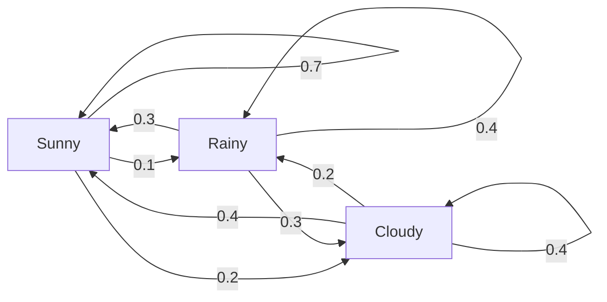
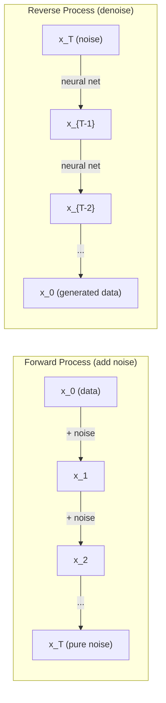

# 随机过程

> 结构的随机性。随机漫步、马尔可夫链和扩散模型背后的数学。

** 类型：** 学习
** 语言：** Python
** 先决条件：** 第1阶段，第06-07课（概率，Bayes）
** 时间：** ~75分钟

## 学习目标

- 模拟1D和2D随机游动并验证位移的sqrt（n）标度
- 构建马尔科夫链模拟器并通过特征分解计算其平稳分布
- 实施Metropolis-Hastings MCMC和Langevin动态以从目标分布中进行抽样
- 将正向扩散过程与布朗运动联系起来，并解释反向过程如何生成数据

## 问题

许多人工智能系统都涉及随时间演变的随机性。不是静态随机性--结构化的、顺序的随机性，每一步都取决于之前发生的事情。

语言模型一次生成一个令牌。每个令牌取决于之前的上下文。该模型输出一个概率分布，从中进行抽样，然后继续前进。这是一个随机过程。

扩散模型逐步向图像添加噪音，直到其变成纯静态。然后他们逆转这个过程，一步一步去噪，直到出现新的图像。向前过程是马尔科夫链。反向过程是一个向后运行的学习马尔科夫链。

强化学习代理在环境中采取行动。每个动作都有一定的可能性导致一个新的状态。代理在随机世界中遵循随机策略。整个事情是一个马尔科夫决策过程。

MCMC抽样--Bayesian推理的支柱--构建了一个Markov链，其平稳分布是您想要采样的后验分布。

所有这些都建立在四个基本理念之上：
1. 随机游走--最简单的随机过程
2. 马尔科夫链--具有转移矩阵的结构随机性
3. 朗之万动力学--带噪音的梯度下降
4. Metropolis-Hastings --从任何分布中抽样

## 概念

### 随机游动

从位置0开始。在每一步中，掷出一个公平的硬币。头部：向右移动（+1）。尾部：向左移动（-1）。

n步后，您的位置是n个随机+/-1值的和。预期位置为0（步行是无偏的）。但与原点的预期距离随着平方t（n）的增长而增长。

这是违反直觉的。步行是公平的--任何方向都没有漂移。但随着时间的推移，它离起点越来越远。n步后的标准差为squtt（n）。

```
Step 0:  Position = 0
Step 1:  Position = +1 or -1
Step 2:  Position = +2, 0, or -2
...
Step 100: Expected distance from origin ~ 10 (sqrt(100))
Step 10000: Expected distance from origin ~ 100 (sqrt(10000))
```

** 在2D中 **，步行以相等的概率向上、向下、向左或向右移动。与原点的距离也适用相同的squtt（n）缩放。该路径描绘出一种类分数形图案。

** 为什么是SQRT（n）？**每一步都是+1或-1，概率相等。n步后，位置S_n = X_1 + X_2 +. + X_n，其中每个X_i为+/-1。每个步骤的方差为1，并且步骤是独立的，因此Var（S_n）= n。标准差=平方t（n）。根据中心极限定理，S_n /平方t（n）收敛于标准正态分布。

这种squtt（n）缩放在ML中随处可见。新元噪音按1/squtt（batch_size）缩放。嵌入维度的规模为squtt（d）。平方根是独立随机添加的签名。

** 与布朗运动的联系 **随机游走，步长为1/sqrt（n），单位时间内n步。当n趋于无穷大时，行走收敛到布朗运动B（t）--一个连续时间过程，其中B（t）是均值为0、方差为t的正态分布。

布朗运动是扩散的数学基础。它模拟了流体中颗粒的随机晃动、股价的波动，以及--至关重要的--扩散模型中的噪音过程。

** 赌徒的毁灭。**随机步行者从位置k开始，吸收屏障位于0和N。0之前达到N的概率是多少？对于公平的步行：P（到达N）= k/N。这出奇地简单和优雅。它与马丁斯理论有关--公平随机游走是一个马丁斯（预期未来值=当前值）。

### 马氏链

马尔可夫链是一种根据固定概率在状态之间转换的系统。key属性：下一个状态只依赖于当前状态，而不依赖于历史。

```
P(X_{t+1} = j | X_t = i, X_{t-1} = ...) = P(X_{t+1} = j | X_t = i)
```

这就是马尔科夫性质。这意味着您可以用转移矩阵P来描述整个动态：

```
P[i][j] = probability of going from state i to state j
```

P的每一行总和为1（您必须去某个地方）。

** 示例--天气：**

```
States: Sunny (0), Rainy (1), Cloudy (2)

P = [[0.7, 0.1, 0.2],    (if sunny: 70% sunny, 10% rainy, 20% cloudy)
     [0.3, 0.4, 0.3],    (if rainy: 30% sunny, 40% rainy, 30% cloudy)
     [0.4, 0.2, 0.4]]    (if cloudy: 40% sunny, 20% rainy, 40% cloudy)
```

从任何州开始。经过多次转变后，状态分布收敛到平稳分布pi，其中pi * P = pi。这是P的左特征向量，特征值为1。

对于天气链来说，稳定分布可能是[0.53，0.18，0.29] --从长远来看，无论开始状态如何，53%的时间都是阳光明媚的。



** 计算平稳分布。**有两种方法：

1. ** 乘势法 **：将任何初始分布重复乘以P。经过足够多的迭代后，它会收敛。
2. ** 特征值方法 **：找到P的特征值为1的左特征量。这是P ' T的特征值为1的特征值。

这两种方法都要求链满足收敛条件。

** 收敛条件。**如果是这样，马尔科夫链就会收敛到唯一的平稳分布：
- ** 不可约 **：每个状态都可以从每个其他状态到达
- ** 非周期性 **：链条不以固定周期循环

您在ML中遇到的大多数链都满足这两个条件。

** 吸收状态。**如果你一旦进入，你就永远不会离开，一个状态就是吸引人的（P[i][i] = 1）。吸收具有终端状态的马尔科夫链模型流程--一个结束的游戏、一个搅拌的客户、一个到达文本结束令牌的令牌序列。

** 混合时间。**要走多少步才能“接近”固定分布？形式上，指的是与平稳性的总变化距离降至某个阈值以下之前的步骤数。快速混合=只需几个步骤。P的谱间隙（1减去第二大特征值）控制混合时间。更大的间隙=更快的混合。

### 与语言模型的连接

语言模型中的标记生成近似是一个马尔可夫过程。给定当前上下文，模型输出下一个令牌的分布。温度控制锐度：

```
P(token_i) = exp(logit_i / temperature) / sum(exp(logit_j / temperature))
```

- 温度= 1.0：标准分布
- 温度< 1.0：更尖锐（更具确定性）
- 温度> 1.0：更平坦（更随机）
- 温度-> 0：argmax（贪婪）

Top-k采样截断到k个最高可能性令牌。Top-p（核）采样截断到累积概率超过p的最小令牌集。两者都会修改马尔科夫转移概率。

### 布朗运动

随机游走的连续时间限制。位置B（t）具有三个属性：
1. B（0）= 0
2. B（t）- B（s）正态分布，平均值为0，方差为t-s（t > s）
3. 非重叠间隔上的增量是独立的

布朗运动是连续的，但无处可分--它在各个尺度上都在晃动。路径在平面上的分维为2。

在离散模拟中，您可以通过以下方式来逼近布朗运动：

```
B(t + dt) = B(t) + sqrt(dt) * z,    where z ~ N(0, 1)
```

squtt（dt）缩放很重要。它来自应用于随机游动的中心极限定理。

### Langevin动力学

梯度下降查找函数的最小值。朗之万动力学发现与BEP（-U（x）/T）成比例的概率分布，其中U是能量函数，T是温度。

```
x_{t+1} = x_t - dt * gradient(U(x_t)) + sqrt(2 * T * dt) * z_t
```

有两种力作用在粒子上：
1. ** 梯度力 **（-dt * 梯度（U））：推向低能量（如梯度下降）
2. ** 随机力 **（SQRT（2*T*dt）* z）：随机方向推动（探索）

在温度T = 0时，这是纯粹的梯度下降。在高温下，这几乎是一种随机行走。在合适的温度下，粒子探索能源格局并在低能量区域花费更多时间。

** 与扩散模型的连接。**扩散模型的正演过程是：

```
x_t = sqrt(alpha_t) * x_{t-1} + sqrt(1 - alpha_t) * noise
```

这是一个马尔科夫链，逐渐将数据与噪音混合在一起。经过足够多的步骤后，x_T是纯高斯噪音。

反向过程-从噪声返回到数据-也是马尔可夫链，但其转移概率是由神经网络学习的。网络学习预测在每一步添加的噪声，然后减去它。



### MCMC：马尔科夫链蒙特卡洛

有时，您需要从一个分布p（x）中进行抽样，您可以计算（最多为一个常数），但无法直接从该分布中进行抽样。贝氏后验是经典的例子--你知道可能性乘以先验，但正规化常数是棘手的。

**Metropolis-Hastings** 构建一个Markov链，其平稳分布为p（x）：

1. 从某个位置x开始
2. 从提案分布Q（x '提出新职位x '| x）
3. 计算接受率：a = p（x '）* Q（x| x '）/（p（x）* Q（x '| x））
4. 接受x '，概率为min（1，a）。否则留在x。
5. 重复.

如果Q对称（例如，Q（x '| x）= Q（x| x '）= N（x，西格玛' 2）），则该比率简化为a = p（x '）/ p（x）。您只需要概率比--正规化常数抵消。

保证链在温和的条件下收敛到p（x）。但如果提案太小（随机游走）或太大（高拒绝），收敛可能会很慢。调整提案是MCMC的艺术。

** 为什么它有效。**接受率确保了详细的平衡：处于x并移动到x的概率“等于处于x”并移动到x的概率。详细平衡意味着p（x）是链的平稳分布。因此，经过足够多的步骤后，样本来自p（x）。

** 实际考虑：**
- ** 老化 **：丢弃前N个样本。该链需要时间从起点到达稳定分布。
- ** 细化 **：保留每个第k个样本以减少自相关。
- ** 多条链 **：从不同的起点运行多条链。如果它们收敛到相同的分布，那么您就有收敛的证据。
- ** 接受率 **：对于d维高斯提案，最佳接受率约为23%（Roberts & Rosenthal，2001）。太高意味着链条几乎不移动。太低意味着它拒绝一切。

### 人工智能中的随机过程

| 过程 | AI应用 |
|---------|---------------|
| 随机游走 | RL、Node2Vec嵌入中的探索 |
| 马尔可夫链 | 文本生成、MCMC采样 |
| 布朗运动 | 扩散模型（正向过程） |
| Langevin动力学 | 基于分数的生成模型，SGLD |
| 马尔可夫决策过程 | 强化学习 |
| metropolis-Hastings | Bayesian推断、后验抽样 |

## 建设党

### 步骤1：随机游走模拟器

```python
import numpy as np

def random_walk_1d(n_steps, seed=None):
    rng = np.random.RandomState(seed)
    steps = rng.choice([-1, 1], size=n_steps)
    positions = np.concatenate([[0], np.cumsum(steps)])
    return positions


def random_walk_2d(n_steps, seed=None):
    rng = np.random.RandomState(seed)
    directions = rng.choice(4, size=n_steps)
    dx = np.zeros(n_steps)
    dy = np.zeros(n_steps)
    dx[directions == 0] = 1   # right
    dx[directions == 1] = -1  # left
    dy[directions == 2] = 1   # up
    dy[directions == 3] = -1  # down
    x = np.concatenate([[0], np.cumsum(dx)])
    y = np.concatenate([[0], np.cumsum(dy)])
    return x, y
```

1D步行存储累积金额。每个步骤都是+1或-1。n步后，位置就是总和。方差随n线性增长，因此标准差以平方t（n）的形式增长。

### 第2步：马尔科夫链

```python
class MarkovChain:
    def __init__(self, transition_matrix, state_names=None):
        self.P = np.array(transition_matrix, dtype=float)
        self.n_states = len(self.P)
        self.state_names = state_names or [str(i) for i in range(self.n_states)]

    def step(self, current_state, rng=None):
        if rng is None:
            rng = np.random.RandomState()
        probs = self.P[current_state]
        return rng.choice(self.n_states, p=probs)

    def simulate(self, start_state, n_steps, seed=None):
        rng = np.random.RandomState(seed)
        states = [start_state]
        current = start_state
        for _ in range(n_steps):
            current = self.step(current, rng)
            states.append(current)
        return states

    def stationary_distribution(self):
        eigenvalues, eigenvectors = np.linalg.eig(self.P.T)
        idx = np.argmin(np.abs(eigenvalues - 1.0))
        stationary = np.real(eigenvectors[:, idx])
        stationary = stationary / stationary.sum()
        return np.abs(stationary)
```

平稳分布是P的左特征向量为1。我们通过计算P ' T的特征量（转置将左特征量变成右特征量）来找到它。

### 第3步：朗之万动力学

```python
def langevin_dynamics(grad_U, x0, dt, temperature, n_steps, seed=None):
    rng = np.random.RandomState(seed)
    x = np.array(x0, dtype=float)
    trajectory = [x.copy()]
    for _ in range(n_steps):
        noise = rng.randn(*x.shape)
        x = x - dt * grad_U(x) + np.sqrt(2 * temperature * dt) * noise
        trajectory.append(x.copy())
    return np.array(trajectory)
```

梯度将x推向低能量。噪音可以防止它被卡住。在平衡时，样品的分布与BEP（-U（x）/温度）成正比。

### 第4步：大都会黑斯廷斯

```python
def metropolis_hastings(target_log_prob, proposal_std, x0, n_samples, seed=None):
    rng = np.random.RandomState(seed)
    x = np.array(x0, dtype=float)
    samples = [x.copy()]
    accepted = 0
    for _ in range(n_samples - 1):
        x_proposed = x + rng.randn(*x.shape) * proposal_std
        log_ratio = target_log_prob(x_proposed) - target_log_prob(x)
        if np.log(rng.rand()) < log_ratio:
            x = x_proposed
            accepted += 1
        samples.append(x.copy())
    acceptance_rate = accepted / (n_samples - 1)
    return np.array(samples), acceptance_rate
```

该算法提出一个新点，检查它是否具有更高的概率（或以与比率成比例的概率接受），然后重复。为了良好的混合，接受率应该在23-50%左右。

## 使用它

在实践中，您将为这些算法使用已建立的库。但了解机制对于调试和调优很重要。

```python
import numpy as np

rng = np.random.RandomState(42)
walk = np.cumsum(rng.choice([-1, 1], size=10000))
print(f"Final position: {walk[-1]}")
print(f"Expected distance: {np.sqrt(10000):.1f}")
print(f"Actual distance: {abs(walk[-1])}")
```

### 过渡矩阵麻木

```python
import numpy as np

P = np.array([[0.7, 0.1, 0.2],
              [0.3, 0.4, 0.3],
              [0.4, 0.2, 0.4]])

distribution = np.array([1.0, 0.0, 0.0])
for _ in range(100):
    distribution = distribution @ P

print(f"Stationary distribution: {np.round(distribution, 4)}")
```

将初始分布重复乘以P。经过足够多的迭代后，无论您从哪里开始，它都会收敛到平稳分布。这是寻找主左特征量的乘方法。

### 与真实框架的连接

- **PyTorch扩散：** Hugging Face“扩散器”中的“DDPMSYS”实现正向和反向Markov链
- **NumPyro / PyMC：** 使用MCMC（NUTS采样器，改进了Metropolis-Hastings）进行Bayesian推理
- ** 体育馆（RL）：** 环境阶跃函数定义了马尔科夫决策过程

### 马尔科夫链收敛

```python
import numpy as np

P = np.array([[0.9, 0.1], [0.3, 0.7]])

eigenvalues = np.linalg.eigvals(P)
spectral_gap = 1 - sorted(np.abs(eigenvalues))[-2]
print(f"Eigenvalues: {eigenvalues}")
print(f"Spectral gap: {spectral_gap:.4f}")
print(f"Approximate mixing time: {1/spectral_gap:.1f} steps")
```

光谱间隙告诉您链忘记其初始状态的速度有多快。0.2的差距意味着大约需要5个步骤混合。0.01的差距意味着大约100步。在运行长时间模拟之前请务必检查这一点--缓慢混合的链会浪费计算。

## 把它运

本课产生：
- '输出/prompt-stochastic-process-advisor.md '--一个提示，帮助识别哪个随机过程框架适用于给定问题

## 连接

| 概念 | 它出现在哪里 |
|---------|------------------|
| 随机游走 | Node2Vec图嵌入、RL中的探索 |
| 马尔可夫链 | LLM中的令牌生成、MCMC采样 |
| 布朗运动 | DDPM、基于SDP的模型中的正向扩散过程 |
| Langevin动力学 | 基于分数的生成模型、随机梯度Langevin动力学（SGLD） |
| 平稳分布 | MCMC融合目标，PageRank |
| metropolis-Hastings | Bayesian后验抽样、模拟退变 |
| 温度 | LLM采样、RL中的Boltzmann探索、模拟退变 |
| 混合时间 | MCMC的收敛速度、谱差分析 |
| 吸收状态 | 序列结束令牌，RL中的终端状态 |
| 细致平衡 | MCMC采样器的正确性保证 |

扩散模型值得特别关注。DDPM（Ho等人，2020）定义了前向马尔科夫链：

```
q(x_t | x_{t-1}) = N(x_t; sqrt(1-beta_t) * x_{t-1}, beta_t * I)
```

其中Beta_t是噪音时间表。经过T步后，x_T大约为N（0，I）。反向过程由预测噪音的神经网络参数化：

```
p_theta(x_{t-1} | x_t) = N(x_{t-1}; mu_theta(x_t, t), sigma_t^2 * I)
```

生成的每一步都是习得的马尔科夫链中的一步。理解马尔科夫链意味着理解扩散模型如何以及为什么生成数据。

SGLD（随机梯度朗之万动力学）将小批量梯度下降与朗之万噪音相结合。您不计算完整的梯度，而是使用随机估计并添加校准的噪音。随着学习率的下降，SGLD从优化过渡到抽样--您可以免费获得大约的Bayesian后验样本。这是从神经网络获取不确定性估计的最简单方法之一。

所有这些联系的关键见解：随机过程不仅仅是理论工具。它们是现代人工智能系统内部的计算机制。当您调整LLM的温度时，您正在调整马尔科夫链。当您训练扩散模型时，您正在学习逆转类似布朗运动的过程。当您运行Bayesian推理时，您正在构建一个收敛到后验的链。

## 演习

1. ** 模拟1000次随机步行10000步。**绘制最终位置的分布。验证它大致为高斯，平均值为0，标准差平方毫米（10000）= 100。

2. ** 使用马尔科夫链构建文本生成器。**在一个小文集上训练：对于每个单词，计算到下一个单词的过渡。构建过渡矩阵。通过从链中采样生成新句子。

3. ** 使用Metropolis-Hastings实现模拟从高温开始（几乎接受一切）并逐渐冷却（仅接受改进）。使用它来查找具有许多局部极小值的函数的极小值。

4. ** 比较不同温度下的朗之万动力学。**来自双势势的样本U（x）=（x#2 - 1）#2。在低温下，样本聚集在一口井中。在高温下，它们遍布两者。找到链在井之间混合的临界温度。

5. ** 执行前向扩散过程。**从1D信号开始（例如，正弦波）。使用线性噪波时间表在100步以上逐步添加噪波。展示信号如何退化为纯噪音。然后实现一个简单的去噪器来逆转这个过程（即使是一个简单的去噪器，只是减去估计的噪音）。

## 关键术语

| Term | 别人怎么说 | 它实际上意味着什么 |
|------|----------------|----------------------|
| 随机游走 | “抛硬币运动” | 位置在每一步随机增量变化的过程 |
| 马氏性 | “无记忆” | 未来只取决于现状，而不是历史 |
| 转移矩阵 | “概率表” | P[i][j] =从状态i移动到状态j的概率 |
| 平稳分布 | “长期平均值” | 分布pi，其中pi*P = pi --链的均衡 |
| 布朗运动 | “随机摇晃” | 随机游动B（t）~ N（0，t）的连续时间极限 |
| Langevin动力学 | “带噪声的梯度下降” | 更新结合确定性梯度和随机扰动的规则 |
| MCMC | “走向目标” | 构造一个马尔可夫链，其平稳分布是你想要的 |
| metropolis-Hastings | “提出并接受/拒绝” | 使用接受率来确保收敛的MCMC算法 |
| 温度 | “随机旋钮” | 控制勘探和开发之间权衡的参数 |
| 扩散过程 | “噪音进来，噪音出去” | 前进：逐渐增加噪音。反向：逐渐移除。生成数据。 |

## 进一步阅读

- **Ho，Jain，Abbeel（2020）**-“去噪扩散概率模型。“DDPM论文引发了扩散模型革命。明确推导正向和反向马尔可夫链。
- **Song & Ermon（2019）**-“通过估计数据分布的系数进行生成建模。“基于分数的方法使用Langevin动力学进行采样。
- **Roberts & Rosenthal（2004）**--“一般状态空间Markov链和MCMC算法。“MCMC何时以及为何起作用背后的理论。
- ** 诺里斯（1997）**--“马尔科夫链。“标准教科书。涵盖收敛、平稳分布和击中时间。
- **Welling & Teh（2011）**--“通过随机梯度朗之万动力学进行的Bayesian学习。“将新元与Langevin动态相结合，以实现可扩展的Bayesian推理。
