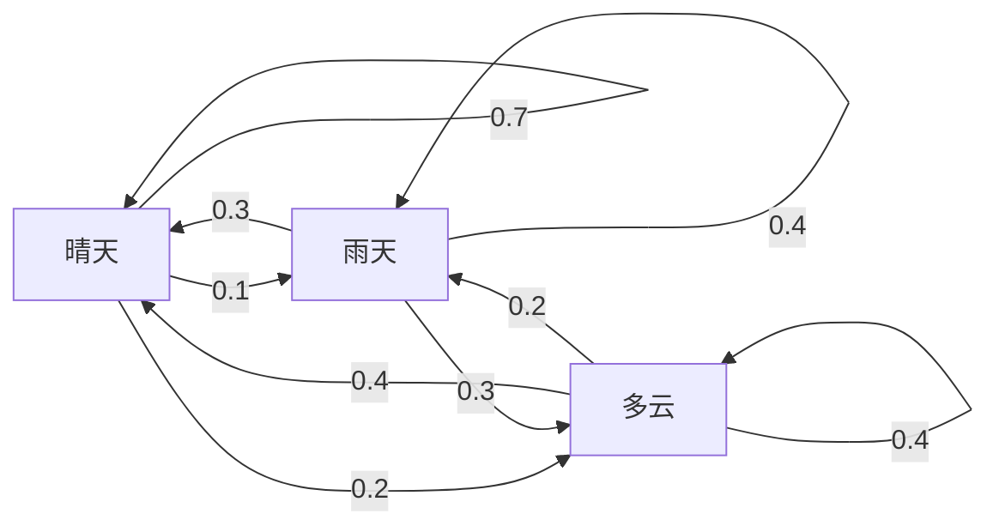
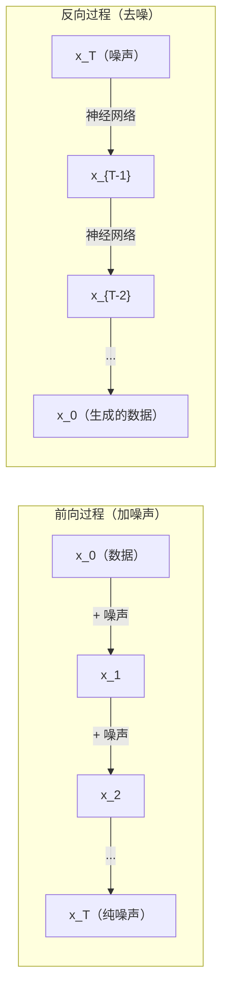

# 随机过程（Stochastic Processes）

> 译注：本文译自同目录 [`en.md`](./en.md)。术语遵循仓根 [TRANSLATION_GUIDE.md](../../../../TRANSLATION_GUIDE.md)。

> 有结构的随机性。random walk、Markov chain 与 diffusion 模型背后的数学。

**Type:** Learn
**Language:** Python
**Prerequisites:** Phase 1, Lessons 06-07 (probability, Bayes)
**Time:** ~75 minutes

## 学习目标（Learning Objectives）

- 模拟一维和二维 random walk（随机游走），并验证位移按 sqrt(n) 缩放
- 构建一个 Markov chain（马尔可夫链）模拟器，并通过特征分解（eigendecomposition）计算其平稳分布
- 实现 Metropolis-Hastings MCMC 与 Langevin dynamics（朗之万动力学），用于从目标分布采样
- 把 diffusion 的前向过程与 Brownian motion（布朗运动）联系起来，并解释逆过程如何生成数据

## 问题（The Problem）

很多 AI 系统都涉及随时间演化的随机性。不是静态的随机——而是有结构的、序列化的随机性，每一步都依赖之前发生过什么。

语言模型一次生成一个 token。每个 token 都依赖前面的上下文。模型输出一个概率分布，从中采样，然后继续。这就是一个随机过程。

Diffusion 模型一步步地往图像上加噪，直到它变成纯静电噪声。然后它逆转这个过程，一步步去噪，直到一张新图像浮现。前向过程是一条 Markov chain。逆向过程是一条由神经网络学到的、反向运行的 Markov chain。

强化学习的 agent 在环境中采取动作。每个动作以某种概率把它带到一个新状态。Agent 在一个随机的世界里执行随机的策略。这整套就是一个 Markov decision process（马尔可夫决策过程）。

MCMC 采样——贝叶斯推断的脊梁——通过构造一条 Markov chain，使其平稳分布正好是你想采样的后验分布。

所有这些都建立在四个基础概念之上：
1. Random walk —— 最简单的随机过程
2. Markov chain —— 带转移矩阵的、有结构的随机
3. Langevin dynamics —— 带噪声的梯度下降
4. Metropolis-Hastings —— 从任意分布采样

## 概念（The Concept）

### 随机游走（Random Walks）

从位置 0 出发。每一步抛一枚公平硬币。正面：右移（+1）；反面：左移（-1）。

走了 n 步之后，你的位置就是 n 个 ±1 随机值的和。期望位置是 0（这条游走没有偏置）。但离原点的期望距离按 sqrt(n) 增长。

这有点反直觉。游走是公平的——任意方向都没有 drift（漂移）。但随着时间推进，它会越走越远。n 步之后的标准差是 sqrt(n)。

```
Step 0:  Position = 0
Step 1:  Position = +1 or -1
Step 2:  Position = +2, 0, or -2
...
Step 100: Expected distance from origin ~ 10 (sqrt(100))
Step 10000: Expected distance from origin ~ 100 (sqrt(10000))
```

**二维情形**：游走以等概率向上、下、左、右移动。同样的 sqrt(n) 缩放规律对到原点的距离仍然成立。轨迹会勾勒出一种类分形的图样。

**为什么是 sqrt(n)？** 每一步以等概率取 +1 或 -1。n 步之后，位置 S_n = X_1 + X_2 + ... + X_n，其中每个 X_i ∈ {+1, -1}。每一步的方差是 1，且各步独立，所以 Var(S_n) = n，标准差为 sqrt(n)。根据中心极限定理，S_n / sqrt(n) 收敛到标准正态分布。

这种 sqrt(n) 缩放在 ML 里到处都是。SGD 噪声按 1/sqrt(batch_size) 缩放。embedding 维度按 sqrt(d) 缩放。平方根是「独立随机加和」的标志。

**与 Brownian motion 的联系。** 取一条步长为 1/sqrt(n)、单位时间内有 n 步的随机游走。当 n → ∞ 时，该游走收敛到 Brownian motion（布朗运动）B(t)——一个连续时间过程，其中 B(t) 服从均值为 0、方差为 t 的正态分布。

Brownian motion 是 diffusion 的数学基础。它建模了流体中粒子的随机抖动、股价波动，以及——最关键地——diffusion 模型中的噪声过程。

**赌徒破产（Gambler's ruin）**。一个起点为 k 的随机游走者，吸收边界设在 0 和 N。在到达 0 之前到达 N 的概率是多少？对公平游走：P(到达 N) = k/N。这个结果意外地简洁优雅。它与鞅（martingale）理论相联——公平随机游走就是一个鞅（未来期望值 = 当前值）。

### Markov 链（Markov Chains）

一条 Markov chain 是按固定概率在状态间转移的系统。关键性质：下一个状态只依赖当前状态，不依赖历史。

```
P(X_{t+1} = j | X_t = i, X_{t-1} = ...) = P(X_{t+1} = j | X_t = i)
```

这就是 Markov 性质（Markov property）。它意味着你可以用一个转移矩阵 P 描述全部动力学：

```
P[i][j] = probability of going from state i to state j
```

P 的每一行之和为 1（你总得去某个地方）。

**例子——天气：**

```
States: Sunny (0), Rainy (1), Cloudy (2)

P = [[0.7, 0.1, 0.2],    (if sunny: 70% sunny, 10% rainy, 20% cloudy)
     [0.3, 0.4, 0.3],    (if rainy: 30% sunny, 40% rainy, 30% cloudy)
     [0.4, 0.2, 0.4]]    (if cloudy: 40% sunny, 20% rainy, 40% cloudy)
```

从任何一个状态出发。经过足够多次转移之后，状态分布会收敛到平稳分布 pi，满足 pi * P = pi。它就是 P 关于特征值 1 的左特征向量。

对这个天气链，平稳分布大约是 [0.53, 0.18, 0.29]——长期来看，无论从哪个状态起步，53% 的时间是晴天。



**计算平稳分布。** 有两种方法：

1. **幂方法（Power method）**：用任意初始分布反复乘以 P。迭代足够多次就会收敛。
2. **特征值方法（Eigenvalue method）**：求 P 关于特征值 1 的左特征向量。也就是 P^T 关于特征值 1 的右特征向量。

两种方法都要求链满足收敛条件。

**收敛条件。** 一条 Markov chain 收敛到唯一平稳分布的条件是：
- **不可约（Irreducible）**：任意状态都能从其他任意状态到达
- **非周期（Aperiodic）**：链不会以固定周期循环

ML 中遇到的大多数链都满足这两条。

**吸收态（Absorbing states）**。某个状态如果一旦进入就出不来（P[i][i] = 1），就称为吸收态。带吸收态的 Markov chain 用来建模带终止状态的过程——一局会结束的游戏、一个流失的客户、一段碰到 end-of-text token 的序列。

**混合时间（Mixing time）**。需要走多少步链才能「接近」平稳分布？正式地说，是与平稳分布的全变差距离降到某个阈值以下所需的步数。混合得快 = 步数少。P 的谱隙（spectral gap，1 减去第二大特征值）控制混合时间。谱隙越大，混合越快。

### 与语言模型的联系

语言模型中的 token 生成近似一个 Markov 过程。给定当前上下文，模型输出下一个 token 的分布。temperature 控制其尖锐程度：

```
P(token_i) = exp(logit_i / temperature) / sum(exp(logit_j / temperature))
```

- temperature = 1.0：标准分布
- temperature < 1.0：更尖（更确定）
- temperature > 1.0：更平（更随机）
- temperature → 0：argmax（贪心）

top-k 采样截断到概率最高的 k 个 token。top-p（核采样）截断到累积概率超过 p 的最小 token 集合。两者都修改了 Markov 转移概率。

### Brownian 运动（Brownian Motion）

随机游走的连续时间极限。位置 B(t) 满足三个性质：
1. B(0) = 0
2. B(t) - B(s) 服从均值 0、方差 t - s 的正态分布（t > s 时）
3. 不重叠区间上的增量相互独立

Brownian motion 处处连续但处处不可微——它在每一个尺度上都在抖动。其轨迹在平面上的分形维数为 2。

在离散模拟中，可以这样近似 Brownian motion：

```
B(t + dt) = B(t) + sqrt(dt) * z,    where z ~ N(0, 1)
```

sqrt(dt) 缩放很关键。它来自把中心极限定理应用到随机游走上的结论。

### Langevin 动力学（Langevin Dynamics）

梯度下降找函数的最小值。Langevin dynamics 找的则是正比于 exp(-U(x)/T) 的概率分布，其中 U 是能量函数，T 是温度。

```
x_{t+1} = x_t - dt * gradient(U(x_t)) + sqrt(2 * T * dt) * z_t
```

粒子上有两种力：
1. **梯度力**（-dt * gradient(U)）：把粒子推向低能量区（类似梯度下降）
2. **随机力**（sqrt(2*T*dt) * z）：把粒子推向随机方向（探索）

当温度 T = 0 时，这就是纯梯度下降。当温度很高时，它几乎是随机游走。在合适的温度下，粒子会探索能量地形，并在低能量区停留更久。

**与 diffusion 模型的联系。** Diffusion 模型的前向过程是：

```
x_t = sqrt(alpha_t) * x_{t-1} + sqrt(1 - alpha_t) * noise
```

这是一条 Markov chain，逐步把数据与噪声混合。经过足够多步之后，x_T 就是纯 Gaussian noise。

逆过程——从噪声回到数据——同样是一条 Markov chain，但其转移概率由神经网络学到。网络学着预测每一步加进去的噪声，再把它减掉。



### MCMC：Markov Chain Monte Carlo

有时你需要从一个分布 p(x) 采样：你能（在常数倍意义下）求值它，但无法直接采样。贝叶斯后验是经典例子——你知道似然乘先验，但归一化常数难以计算。

**Metropolis-Hastings** 构造一条平稳分布为 p(x) 的 Markov chain：

1. 从某个位置 x 出发
2. 从一个 proposal 分布 Q(x'|x) 提议一个新位置 x'
3. 计算接受比：a = p(x') * Q(x|x') / (p(x) * Q(x'|x))
4. 以概率 min(1, a) 接受 x'，否则停留在 x
5. 重复

如果 Q 是对称的（例如 Q(x'|x) = Q(x|x') = N(x, sigma^2)），接受比就化简为 a = p(x') / p(x)。你只需要概率比——归一化常数会被消掉。

在温和条件下，该链一定会收敛到 p(x)。但如果 proposal 太小（变成随机游走）或太大（拒绝率高），收敛会很慢。调 proposal 是 MCMC 的艺术。

**为什么它有效。** 接受比保证了细致平衡（detailed balance）：处于 x 并转移到 x' 的概率，等于处于 x' 并转移到 x 的概率。细致平衡蕴含 p(x) 是该链的平稳分布。所以走够多步之后，样本就来自 p(x)。

**实务考虑：**
- **Burn-in（预热）**：丢弃前 N 个样本。链需要时间从起点走到平稳分布。
- **Thinning（稀化）**：每 k 个保留一个样本，以减少自相关。
- **多链**：从不同起点跑多条链。如果它们都收敛到同一个分布，就是收敛的一项证据。
- **接受率**：对 d 维高斯 proposal，最优接受率约为 23%（Roberts & Rosenthal, 2001）。太高意味着链几乎没动；太低意味着它什么都拒。

### AI 中的随机过程

| Process | AI Application |
|---------|---------------|
| Random walk | Exploration in RL, Node2Vec embeddings |
| Markov chain | Text generation, MCMC sampling |
| Brownian motion | Diffusion models (forward process) |
| Langevin dynamics | Score-based generative models, SGLD |
| Markov decision process | Reinforcement learning |
| Metropolis-Hastings | Bayesian inference, posterior sampling |

## 动手实现（Build It）

### Step 1: Random walk simulator

```python
import numpy as np

def random_walk_1d(n_steps, seed=None):
    rng = np.random.RandomState(seed)
    steps = rng.choice([-1, 1], size=n_steps)
    positions = np.concatenate([[0], np.cumsum(steps)])
    return positions


def random_walk_2d(n_steps, seed=None):
    rng = np.random.RandomState(seed)
    directions = rng.choice(4, size=n_steps)
    dx = np.zeros(n_steps)
    dy = np.zeros(n_steps)
    dx[directions == 0] = 1   # right
    dx[directions == 1] = -1  # left
    dy[directions == 2] = 1   # up
    dy[directions == 3] = -1  # down
    x = np.concatenate([[0], np.cumsum(dx)])
    y = np.concatenate([[0], np.cumsum(dy)])
    return x, y
```

一维游走存储的是累积和。每一步是 +1 或 -1。n 步之后位置即为求和。方差随 n 线性增长，所以标准差按 sqrt(n) 增长。

### Step 2: Markov chain

```python
class MarkovChain:
    def __init__(self, transition_matrix, state_names=None):
        self.P = np.array(transition_matrix, dtype=float)
        self.n_states = len(self.P)
        self.state_names = state_names or [str(i) for i in range(self.n_states)]

    def step(self, current_state, rng=None):
        if rng is None:
            rng = np.random.RandomState()
        probs = self.P[current_state]
        return rng.choice(self.n_states, p=probs)

    def simulate(self, start_state, n_steps, seed=None):
        rng = np.random.RandomState(seed)
        states = [start_state]
        current = start_state
        for _ in range(n_steps):
            current = self.step(current, rng)
            states.append(current)
        return states

    def stationary_distribution(self):
        eigenvalues, eigenvectors = np.linalg.eig(self.P.T)
        idx = np.argmin(np.abs(eigenvalues - 1.0))
        stationary = np.real(eigenvectors[:, idx])
        stationary = stationary / stationary.sum()
        return np.abs(stationary)
```

平稳分布是 P 关于特征值 1 的左特征向量。我们通过对 P^T 做特征分解来求它（转置把左特征向量变成右特征向量）。

### Step 3: Langevin dynamics

```python
def langevin_dynamics(grad_U, x0, dt, temperature, n_steps, seed=None):
    rng = np.random.RandomState(seed)
    x = np.array(x0, dtype=float)
    trajectory = [x.copy()]
    for _ in range(n_steps):
        noise = rng.randn(*x.shape)
        x = x - dt * grad_U(x) + np.sqrt(2 * temperature * dt) * noise
        trajectory.append(x.copy())
    return np.array(trajectory)
```

梯度把 x 推向低能量区。噪声防止它卡死。在平衡时，样本分布正比于 exp(-U(x)/temperature)。

### Step 4: Metropolis-Hastings

```python
def metropolis_hastings(target_log_prob, proposal_std, x0, n_samples, seed=None):
    rng = np.random.RandomState(seed)
    x = np.array(x0, dtype=float)
    samples = [x.copy()]
    accepted = 0
    for _ in range(n_samples - 1):
        x_proposed = x + rng.randn(*x.shape) * proposal_std
        log_ratio = target_log_prob(x_proposed) - target_log_prob(x)
        if np.log(rng.rand()) < log_ratio:
            x = x_proposed
            accepted += 1
        samples.append(x.copy())
    acceptance_rate = accepted / (n_samples - 1)
    return np.array(samples), acceptance_rate
```

算法提议一个新点，检查它是否概率更高（或以正比于比值的概率接受），然后重复。为了好的混合，接受率应在 23%-50% 左右。

## 用起来（Use It）

实践中你会用现成库来跑这些算法。但理解机制对调试和调参依然重要。

```python
import numpy as np

rng = np.random.RandomState(42)
walk = np.cumsum(rng.choice([-1, 1], size=10000))
print(f"Final position: {walk[-1]}")
print(f"Expected distance: {np.sqrt(10000):.1f}")
print(f"Actual distance: {abs(walk[-1])}")
```

### 用 numpy 处理转移矩阵

```python
import numpy as np

P = np.array([[0.7, 0.1, 0.2],
              [0.3, 0.4, 0.3],
              [0.4, 0.2, 0.4]])

distribution = np.array([1.0, 0.0, 0.0])
for _ in range(100):
    distribution = distribution @ P

print(f"Stationary distribution: {np.round(distribution, 4)}")
```

把初始分布反复乘以 P。迭代足够多次后，无论起点在哪都收敛到平稳分布。这就是用幂方法找主导左特征向量。

### 与真实框架的连接

- **PyTorch diffusion：** Hugging Face `diffusers` 中的 `DDPMScheduler` 实现了前向和逆向 Markov chain
- **NumPyro / PyMC：** 用 MCMC（NUTS 采样器，是 Metropolis-Hastings 的改进版）做贝叶斯推断
- **Gymnasium (RL)：** 环境的 step 函数定义了一个 Markov decision process

### 验证 Markov chain 的收敛

```python
import numpy as np

P = np.array([[0.9, 0.1], [0.3, 0.7]])

eigenvalues = np.linalg.eigvals(P)
spectral_gap = 1 - sorted(np.abs(eigenvalues))[-2]
print(f"Eigenvalues: {eigenvalues}")
print(f"Spectral gap: {spectral_gap:.4f}")
print(f"Approximate mixing time: {1/spectral_gap:.1f} steps")
```

谱隙告诉你链遗忘初始状态的速度。谱隙 0.2 大约 5 步就混合完；谱隙 0.01 大约要 100 步。在跑长模拟之前永远先检查这个——一条慢混合的链就是在白烧算力。

## 上线部署（Ship It）

本节产出：
- `outputs/prompt-stochastic-process-advisor.md` —— 一段 prompt，帮助识别给定问题该用哪种随机过程框架

## 关联（Connections）

| Concept | Where it shows up |
|---------|------------------|
| Random walk | Node2Vec graph embeddings, exploration in RL |
| Markov chain | Token generation in LLMs, MCMC sampling |
| Brownian motion | Forward diffusion process in DDPM, SDE-based models |
| Langevin dynamics | Score-based generative models, stochastic gradient Langevin dynamics (SGLD) |
| Stationary distribution | MCMC convergence target, PageRank |
| Metropolis-Hastings | Bayesian posterior sampling, simulated annealing |
| Temperature | LLM sampling, Boltzmann exploration in RL, simulated annealing |
| Mixing time | Convergence speed of MCMC, spectral gap analysis |
| Absorbing state | End-of-sequence token, terminal states in RL |
| Detailed balance | Correctness guarantee for MCMC samplers |

Diffusion 模型值得特别关注。DDPM（Ho et al., 2020）定义了一条前向 Markov chain：

```
q(x_t | x_{t-1}) = N(x_t; sqrt(1-beta_t) * x_{t-1}, beta_t * I)
```

其中 beta_t 是噪声调度。T 步之后，x_T 近似 N(0, I)。逆过程由神经网络参数化，预测噪声：

```
p_theta(x_{t-1} | x_t) = N(x_{t-1}; mu_theta(x_t, t), sigma_t^2 * I)
```

生成的每一步，都是在一条「学到的 Markov chain」上前进一步。理解 Markov chain，就是理解 diffusion 模型如何以及为什么能生成数据。

SGLD（Stochastic Gradient Langevin Dynamics）把 mini-batch 梯度下降和 Langevin 噪声结合在一起。你不需要算完整梯度，而是用一个随机估计加上经过校准的噪声。随着学习率衰减，SGLD 会从「优化」过渡到「采样」——你免费得到近似的贝叶斯后验样本。这是从神经网络获得不确定性估计的最简单方式之一。

贯穿这些联系的关键洞察：随机过程不仅是理论工具。它们是现代 AI 系统内部的计算机制。当你调一个 LLM 的 temperature，你是在调一条 Markov chain。当你训练 diffusion 模型，你是在学着把一个类 Brownian motion 的过程反过来。当你跑贝叶斯推断，你是在构造一条收敛到后验的链。

## 练习（Exercises）

1. **模拟 1000 条长 10000 步的 random walk。** 画出末位置的分布。验证它近似为均值 0、标准差 sqrt(10000) = 100 的高斯分布。

2. **用 Markov chain 搭一个文本生成器。** 在小语料上训练：对每个词，统计它转移到下一个词的次数。构建转移矩阵。用从该链采样的方式生成新句子。

3. **用 Metropolis-Hastings 实现模拟退火（simulated annealing）。** 从高 temperature（几乎接受一切）出发，逐渐降温（只接受改进）。用它寻找一个有许多局部极小的函数的最小值。

4. **比较不同 temperature 下的 Langevin dynamics。** 从双井势 U(x) = (x^2 - 1)^2 中采样。低温下样本聚在某一个井里；高温下样本散布在两个井之间。找到能让链在两个井之间混合的临界 temperature。

5. **实现前向 diffusion 过程。** 从一维信号（如正弦波）开始。用线性噪声调度，连续加噪 100 步。展示信号如何退化为纯噪声。然后实现一个简单的去噪器，逆转该过程（哪怕是只减去估计噪声的朴素版本）。

## 关键术语（Key Terms）

| Term | What people say | What it actually means |
|------|----------------|----------------------|
| Random walk | "Coin-flip movement" | A process where position changes by random increments at each step |
| Markov property | "Memoryless" | The future depends only on the present state, not on the history |
| Transition matrix | "The probability table" | P[i][j] = probability of moving from state i to state j |
| Stationary distribution | "The long-run average" | The distribution pi where pi*P = pi -- the chain's equilibrium |
| Brownian motion | "Random jiggling" | The continuous-time limit of a random walk, B(t) ~ N(0, t) |
| Langevin dynamics | "Gradient descent with noise" | Update rule that combines deterministic gradient and random perturbation |
| MCMC | "Walking toward the target" | Constructing a Markov chain whose stationary distribution is the one you want |
| Metropolis-Hastings | "Propose and accept/reject" | MCMC algorithm that uses acceptance ratios to ensure convergence |
| Temperature | "The randomness knob" | Parameter controlling the tradeoff between exploration and exploitation |
| Diffusion process | "Noise in, noise out" | Forward: gradually add noise. Reverse: gradually remove it. Generates data. |

## 延伸阅读（Further Reading）

- **Ho, Jain, Abbeel (2020)** —— "Denoising Diffusion Probabilistic Models." 引爆 diffusion 模型革命的 DDPM 论文。对前向和逆向 Markov chain 的推导清晰漂亮。
- **Song & Ermon (2019)** —— "Generative Modeling by Estimating Gradients of the Data Distribution." 基于 score 的方法，使用 Langevin dynamics 进行采样。
- **Roberts & Rosenthal (2004)** —— "General state space Markov chains and MCMC algorithms." MCMC 何时、为何能 work 背后的理论。
- **Norris (1997)** —— "Markov Chains." 标准教材。涵盖收敛、平稳分布与击中时间。
- **Welling & Teh (2011)** —— "Bayesian Learning via Stochastic Gradient Langevin Dynamics." 把 SGD 与 Langevin dynamics 结合，做可扩展的贝叶斯推断。
