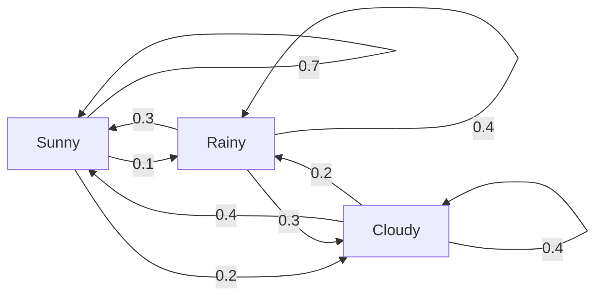
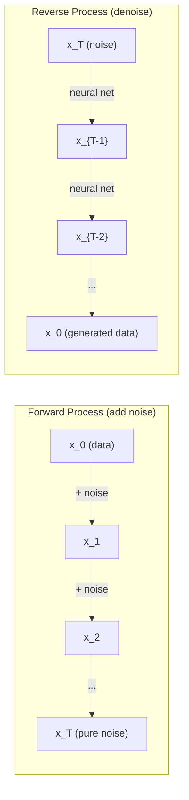

# 隨機過程

> 有結構的隨機。隨機漫步、馬可夫鏈與擴散模型背後的數學。

**類型：** 學習
**程式語言：** Python
**先修單元：** 階段 1 · 單元 06-07（機率、貝氏定理）
**時間：** 約 75 分鐘

## 學習目標

- 模擬一維與二維隨機漫步，並驗證位移的 sqrt(n) 縮放
- 打造一個馬可夫鏈模擬器，並用特徵分解計算它的穩態分布
- 實作 Metropolis-Hastings MCMC 與 Langevin 動力學，從目標分布取樣
- 把前向擴散過程跟布朗運動連起來，並說明反向過程是怎麼生成資料的

## 問題所在

很多 AI 系統都涉及隨著時間演變的隨機性。不是靜態的隨機——而是有結構、有順序的隨機，每一步都取決於前面發生過什麼。

語言模型一次生成一個詞元。每個詞元都取決於前面的上下文。模型輸出一個機率分布，從裡面取樣，然後繼續往下走。這就是一個隨機過程。

擴散模型一步一步對圖片加入雜訊，直到它變成純粹的雜點。然後再把過程反過來，一步一步去噪，直到一張新的圖片浮現出來。前向過程是一條馬可夫鏈。反向過程則是一條學出來、倒著跑的馬可夫鏈。

強化學習的代理程式在環境裡採取動作。每個動作都以某個機率導向一個新的狀態。代理程式在一個隨機的世界裡遵循一個隨機的策略。整件事就是一個馬可夫決策過程。

MCMC 取樣——貝氏推論的骨幹——建構一條馬可夫鏈，讓它的穩態分布就是你想取樣的那個後驗分布。

這些全都建立在四個基礎想法上：
1. 隨機漫步——最簡單的隨機過程
2. 馬可夫鏈——帶狀態轉移矩陣的結構化隨機
3. Langevin 動力學——加了雜訊的梯度下降
4. Metropolis-Hastings——從任何分布取樣

## 核心概念

### 隨機漫步

從位置 0 出發。每一步丟一次公正的硬幣。正面：往右走（+1）。反面：往左走（-1）。

走了 n 步之後，你的位置就是 n 個隨機 +/-1 值的總和。期望位置是 0（這個漫步沒有偏向）。但離原點的期望距離會以 sqrt(n) 成長。

這違反直覺。這個漫步是公正的——沒有任何方向的漂移。但隨著時間過去，它會離起點越來越遠。走了 n 步之後的標準差是 sqrt(n)。

```
Step 0:  Position = 0
Step 1:  Position = +1 or -1
Step 2:  Position = +2, 0, or -2
...
Step 100: Expected distance from origin ~ 10 (sqrt(100))
Step 10000: Expected distance from origin ~ 100 (sqrt(10000))
```

**在二維裡**，漫步以相同的機率往上、下、左、右移動。離原點的距離同樣遵循 sqrt(n) 縮放。路徑會描出一種類碎形的圖樣。

**為什麼是 sqrt(n)？** 每一步以相同機率是 +1 或 -1。走了 n 步之後，位置是 S_n = X_1 + X_2 + ... + X_n，其中每個 X_i 都是 +/-1。每一步的變異數是 1，而各步彼此獨立，所以 Var(S_n) = n。標準差 = sqrt(n)。根據中央極限定理，S_n / sqrt(n) 會收斂到標準常態分布。

這個 sqrt(n) 縮放在 ML 裡到處都看得到。SGD 的雜訊以 1/sqrt(batch_size) 縮放。嵌入維度以 sqrt(d) 縮放。平方根就是「獨立隨機量相加」的招牌特徵。

**跟布朗運動的關聯。** 取一個步長為 1/sqrt(n)、每單位時間走 n 步的隨機漫步。當 n 趨於無窮時，這個漫步會收斂到布朗運動 B(t)——一個連續時間的過程，其中 B(t) 服從平均 0、變異數 t 的常態分布。

布朗運動是擴散的數學基礎。它可以描述流體中粒子的隨機抖動、股價的波動，以及——最關鍵的——擴散模型裡的雜訊過程。

**賭徒破產問題。** 一個隨機漫步者從位置 k 出發，在 0 與 N 處各有一道吸收壁。在碰到 0 之前先抵達 N 的機率是多少？對公正的漫步而言：P(reach N) = k/N。這個結果簡潔得令人意外。它跟鞅的理論相通——公正的隨機漫步就是一個鞅（未來值的期望等於當前值）。

### 馬可夫鏈

馬可夫鏈是一個依照固定機率在各狀態之間轉移的系統。關鍵性質是：下一個狀態只取決於當前狀態，跟歷史無關。

```
P(X_{t+1} = j | X_t = i, X_{t-1} = ...) = P(X_{t+1} = j | X_t = i)
```

這就是馬可夫性質。它意味著你可以用一個狀態轉移矩陣 P 描述整個動態：

```
P[i][j] = probability of going from state i to state j
```

P 的每一列加起來都是 1（你總得去某個地方）。

**例子——天氣：**

```
States: Sunny (0), Rainy (1), Cloudy (2)

P = [[0.7, 0.1, 0.2],    (if sunny: 70% sunny, 10% rainy, 20% cloudy)
     [0.3, 0.4, 0.3],    (if rainy: 30% sunny, 40% rainy, 30% cloudy)
     [0.4, 0.2, 0.4]]    (if cloudy: 40% sunny, 20% rainy, 40% cloudy)
```

從任何狀態出發。經過很多次轉移之後，狀態的分布會收斂到穩態分布 pi，滿足 pi * P = pi。這就是 P 對應特徵值 1 的左特徵向量。

對這條天氣鏈來說，穩態分布是 [0.55, 0.18, 0.27]——長期而言，不管從哪個狀態出發，有 55% 的時間是晴天。


```mermaid
graph LR
    S["Sunny"] -->|0.7| S
    S -->|0.1| R["Rainy"]
    S -->|0.2| C["Cloudy"]
    R -->|0.3| S
    R -->|0.4| R
    R -->|0.3| C
    C -->|0.4| S
    C -->|0.2| R
    C -->|0.4| C
```

**計算穩態分布。** 有兩種做法：

1. **冪法**：拿任何初始分布反覆乘上 P。迭代足夠多次之後就會收斂。
2. **特徵值法**：找出 P 對應特徵值 1 的左特徵向量。它就是 P^T 對應特徵值 1 的特徵向量。

兩種做法都要求這條鏈滿足收斂條件。

**收斂條件。** 一條馬可夫鏈要收斂到唯一的穩態分布，必須是：
- **不可約（irreducible）**：每個狀態都能從其他任何狀態抵達
- **非週期（aperiodic）**：這條鏈不會以固定的週期循環

你在 ML 裡碰到的鏈大多都同時滿足這兩個條件。

**吸收狀態。** 如果一個狀態一旦進去就再也出不來（P[i][i] = 1），它就是吸收狀態。帶吸收狀態的馬可夫鏈可以描述有終止狀態的過程——一場結束的遊戲、一個流失的客戶、一段撞到 end-of-text 詞元的詞元序列。

**混合時間。** 要走多少步，這條鏈才會「接近」穩態分布？嚴格說來，就是總變異距離掉到某個閾值以下所需的步數。混合得快 = 需要的步數少。P 的譜間隙（1 減去第二大的特徵值）決定了混合時間。間隙越大 = 混合越快。

### 跟語言模型的關聯

語言模型裡的詞元生成近似是一個馬可夫過程。給定當前的上下文，模型輸出下一個詞元的分布。溫度控制的是分布的尖銳程度：

```
P(token_i) = exp(logit_i / temperature) / sum(exp(logit_j / temperature))
```

- Temperature = 1.0：標準分布
- Temperature < 1.0：更尖（更趨於決定性）
- Temperature > 1.0：更平（更隨機）
- Temperature -> 0：argmax（貪婪）

Top-k 取樣把候選截斷成機率最高的 k 個詞元。Top-p（nucleus）取樣則截斷成累積機率超過 p 的最小詞元集合。兩者都在修改馬可夫轉移機率。

### 布朗運動

隨機漫步的連續時間極限。位置 B(t) 有三個性質：
1. B(0) = 0
2. B(t) - B(s) 服從平均 0、變異數 t - s 的常態分布（當 t > s）
3. 不重疊區間上的增量彼此獨立

布朗運動處處連續、但處處不可微——它在每一個尺度上都在抖動。它的路徑在平面上的碎形維度是 2。

在離散模擬裡，你可以這樣近似布朗運動：

```
B(t + dt) = B(t) + sqrt(dt) * z,    where z ~ N(0, 1)
```

sqrt(dt) 這個縮放很重要。它來自把中央極限定理套用到隨機漫步上的結果。

### Langevin 動力學

梯度下降找的是一個函式的最小值。Langevin 動力學找的則是正比於 exp(-U(x)/T) 的機率分布，其中 U 是能量函式、T 是溫度。

```
x_{t+1} = x_t - dt * gradient(U(x_t)) + sqrt(2 * T * dt) * z_t
```

有兩股力作用在粒子上：
1. **梯度力**（-dt * gradient(U)）：把它推往低能量處（就像梯度下降）
2. **隨機力**（sqrt(2*T*dt) * z）：把它推往隨機方向（探索）

在溫度 T = 0 時，這就是純粹的梯度下降。在高溫時，它幾乎就是隨機漫步。在恰當的溫度下，粒子會探索能量地貌，並在低能量區域停留更久。

**跟擴散模型的關聯。** 擴散模型的前向過程是：

```
x_t = sqrt(alpha_t) * x_{t-1} + sqrt(1 - alpha_t) * noise
```

這是一條馬可夫鏈，逐步把資料跟雜訊混在一起。走了足夠多步之後，x_T 就是純粹的高斯雜訊。

反向過程——從雜訊回到資料——同樣是一條馬可夫鏈，只是它的轉移機率是由一個神經網路學出來的。這個網路學的是預測每一步加進去的雜訊，然後把它減掉。


```mermaid
graph LR
    subgraph "Forward Process (add noise)"
        X0["x_0 (data)"] -->|"+ noise"| X1["x_1"]
        X1 -->|"+ noise"| X2["x_2"]
        X2 -->|"..."| XT["x_T (pure noise)"]
    end
    subgraph "Reverse Process (denoise)"
        XT2["x_T (noise)"] -->|"neural net"| XR2["x_{T-1}"]
        XR2 -->|"neural net"| XR1["x_{T-2}"]
        XR1 -->|"..."| XR0["x_0 (generated data)"]
    end
```

### MCMC：馬可夫鏈蒙地卡羅

有時候你需要從一個分布 p(x) 取樣，而你只能（在差一個常數的意義下）計算它的值，沒辦法直接從它取樣。貝氏後驗分布就是最經典的例子——你知道概似乘上先驗長什麼樣，但那個正規化常數算不出來。

**Metropolis-Hastings** 建構一條穩態分布就是 p(x) 的馬可夫鏈：

1. 從某個位置 x 出發
2. 從提議分布 Q(x'|x) 提議一個新位置 x'
3. 計算接受比值：a = p(x') * Q(x|x') / (p(x) * Q(x'|x))
4. 以 min(1, a) 的機率接受 x'。否則就留在 x。
5. 重複。

如果 Q 是對稱的（例如 Q(x'|x) = Q(x|x') = N(x, sigma^2)），這個比值會簡化成 a = p(x') / p(x)。你只需要機率的比值——正規化常數會被消掉。

在一些溫和的條件下，這條鏈保證會收斂到 p(x)。但如果提議分布太小（變成隨機漫步）或太大（拒絕率太高），收斂可能會很慢。調校提議分布就是 MCMC 的藝術所在。

**它為什麼有效。** 接受比值保證了細緻平衡：待在 x 然後移動到 x' 的機率，等於待在 x' 然後移動到 x 的機率。細緻平衡意味著 p(x) 就是這條鏈的穩態分布。所以走了足夠多步之後，樣本就是從 p(x) 來的。

**實務上的考量：**
- **燒機期**：把前 N 個樣本丟掉。這條鏈需要時間才能從起點走到穩態分布。
- **稀釋（thinning）**：每 k 個樣本只留一個，以降低自相關。
- **多條鏈**：從不同的起點跑好幾條鏈。如果它們收斂到同一個分布，你就有收斂的證據。
- **接受率**：在 d 維使用高斯提議分布時，最佳接受率大約是 23%（Roberts & Rosenthal, 2001）。太高表示這條鏈幾乎沒在動。太低表示它什麼都拒絕。

### AI 裡的隨機過程

| 過程 | AI 應用 |
|---------|---------------|
| 隨機漫步 | RL 裡的探索、Node2Vec 嵌入 |
| 馬可夫鏈 | 文字生成、MCMC 取樣 |
| 布朗運動 | 擴散模型（前向過程） |
| Langevin 動力學 | score-based 生成模型、SGLD |
| 馬可夫決策過程 | 強化學習 |
| Metropolis-Hastings | 貝氏推論、後驗取樣 |

```figure
random-walk-diffusion
```

## 動手實作

### 步驟 1：隨機漫步模擬器

```python
import numpy as np

def random_walk_1d(n_steps, seed=None):
    rng = np.random.RandomState(seed)
    steps = rng.choice([-1, 1], size=n_steps)
    positions = np.concatenate([[0], np.cumsum(steps)])
    return positions


def random_walk_2d(n_steps, seed=None):
    rng = np.random.RandomState(seed)
    directions = rng.choice(4, size=n_steps)
    dx = np.zeros(n_steps)
    dy = np.zeros(n_steps)
    dx[directions == 0] = 1   # right
    dx[directions == 1] = -1  # left
    dy[directions == 2] = 1   # up
    dy[directions == 3] = -1  # down
    x = np.concatenate([[0], np.cumsum(dx)])
    y = np.concatenate([[0], np.cumsum(dy)])
    return x, y
```

一維漫步存的是累積和。每一步是 +1 或 -1。走了 n 步之後，位置就是總和。變異數隨 n 線性成長，所以標準差以 sqrt(n) 成長。

### 步驟 2：馬可夫鏈

```python
class MarkovChain:
    def __init__(self, transition_matrix, state_names=None):
        self.P = np.array(transition_matrix, dtype=float)
        self.n_states = len(self.P)
        self.state_names = state_names or [str(i) for i in range(self.n_states)]

    def step(self, current_state, rng=None):
        if rng is None:
            rng = np.random.RandomState()
        probs = self.P[current_state]
        return rng.choice(self.n_states, p=probs)

    def simulate(self, start_state, n_steps, seed=None):
        rng = np.random.RandomState(seed)
        states = [start_state]
        current = start_state
        for _ in range(n_steps):
            current = self.step(current, rng)
            states.append(current)
        return states

    def stationary_distribution(self):
        eigenvalues, eigenvectors = np.linalg.eig(self.P.T)
        idx = np.argmin(np.abs(eigenvalues - 1.0))
        stationary = np.real(eigenvectors[:, idx])
        stationary = stationary / stationary.sum()
        return np.abs(stationary)
```

穩態分布就是 P 對應特徵值 1 的左特徵向量。我們透過計算 P^T 的特徵向量來找到它（轉置會把左特徵向量變成右特徵向量）。

### 步驟 3：Langevin 動力學

```python
def langevin_dynamics(grad_U, x0, dt, temperature, n_steps, seed=None):
    rng = np.random.RandomState(seed)
    x = np.array(x0, dtype=float)
    trajectory = [x.copy()]
    for _ in range(n_steps):
        noise = rng.randn(*x.shape)
        x = x - dt * grad_U(x) + np.sqrt(2 * temperature * dt) * noise
        trajectory.append(x.copy())
    return np.array(trajectory)
```

梯度把 x 推往低能量處。雜訊則讓它不會卡住。在平衡狀態下，樣本的分布正比於 exp(-U(x)/temperature)。

### 步驟 4：Metropolis-Hastings

```python
def metropolis_hastings(target_log_prob, proposal_std, x0, n_samples, seed=None):
    rng = np.random.RandomState(seed)
    x = np.array(x0, dtype=float)
    samples = [x.copy()]
    accepted = 0
    for _ in range(n_samples - 1):
        x_proposed = x + rng.randn(*x.shape) * proposal_std
        log_ratio = target_log_prob(x_proposed) - target_log_prob(x)
        if np.log(rng.rand()) < log_ratio:
            x = x_proposed
            accepted += 1
        samples.append(x.copy())
    acceptance_rate = accepted / (n_samples - 1)
    return np.array(samples), acceptance_rate
```

這個演算法提議一個新的點，檢查它的機率是不是更高（或以正比於比值的機率接受），然後重複。要混合得好，接受率大概應該落在 23-50% 之間。

## 框架應用

實務上，這些演算法你會用現成的函式庫。但要除錯跟調校，理解背後的機制還是有差。

```python
import numpy as np

rng = np.random.RandomState(42)
walk = np.cumsum(rng.choice([-1, 1], size=10000))
print(f"Final position: {walk[-1]}")
print(f"Expected distance: {np.sqrt(10000):.1f}")
print(f"Actual distance: {abs(walk[-1])}")
```

### 用 numpy 處理狀態轉移矩陣

```python
import numpy as np

P = np.array([[0.7, 0.1, 0.2],
              [0.3, 0.4, 0.3],
              [0.4, 0.2, 0.4]])

distribution = np.array([1.0, 0.0, 0.0])
for _ in range(100):
    distribution = distribution @ P

print(f"Stationary distribution: {np.round(distribution, 4)}")
```

拿初始分布反覆乘上 P。迭代足夠多次之後，不管你從哪裡出發，它都會收斂到穩態分布。這就是找出主導左特徵向量的冪法。

### 跟真實框架的關聯

- **PyTorch 擴散模型：** Hugging Face `diffusers` 裡的 `DDPMScheduler` 實作的就是前向與反向的馬可夫鏈
- **NumPyro / PyMC：** 用 MCMC（NUTS 取樣器，它是 Metropolis-Hastings 的改良版）做貝氏推論
- **Gymnasium（RL）：** 環境的 step 函式定義的就是一個馬可夫決策過程

### 驗證馬可夫鏈的收斂

```python
import numpy as np

P = np.array([[0.9, 0.1], [0.3, 0.7]])

eigenvalues = np.linalg.eigvals(P)
spectral_gap = 1 - sorted(np.abs(eigenvalues))[-2]
print(f"Eigenvalues: {eigenvalues}")
print(f"Spectral gap: {spectral_gap:.4f}")
print(f"Approximate mixing time: {1/spectral_gap:.1f} steps")
```

譜間隙告訴你這條鏈忘掉初始狀態的速度有多快。間隙 0.2 大約表示 5 步就能混合。間隙 0.01 大約表示要 100 步。跑長時間模擬之前一定要先檢查這個——混合得慢的鏈只是在浪費算力。

## 產出交付

這個單元會產出：
- `outputs/prompt-stochastic-process-advisor.md` —— 一個能幫你判斷某個問題該套用哪種隨機過程框架的提示詞

## 關聯

| 概念 | 出現在哪裡 |
|---------|------------------|
| 隨機漫步 | Node2Vec 圖嵌入、RL 裡的探索 |
| 馬可夫鏈 | LLM 的詞元生成、MCMC 取樣 |
| 布朗運動 | DDPM 的前向擴散過程、以 SDE 為基礎的模型 |
| Langevin 動力學 | score-based 生成模型、隨機梯度 Langevin 動力學（SGLD） |
| 穩態分布 | MCMC 的收斂目標、PageRank |
| Metropolis-Hastings | 貝氏後驗取樣、模擬退火 |
| 溫度 | LLM 取樣、RL 裡的 Boltzmann 探索、模擬退火 |
| 混合時間 | MCMC 的收斂速度、譜間隙分析 |
| 吸收狀態 | 序列結束詞元、RL 裡的終止狀態 |
| 細緻平衡 | MCMC 取樣器的正確性保證 |

擴散模型值得特別留意。DDPM（Ho et al., 2020）定義了一條前向馬可夫鏈：

```
q(x_t | x_{t-1}) = N(x_t; sqrt(1-beta_t) * x_{t-1}, beta_t * I)
```

其中 beta_t 是雜訊排程。走了 T 步之後，x_T 大約就是 N(0, I)。反向過程則由一個預測雜訊的神經網路來參數化：

```
p_theta(x_{t-1} | x_t) = N(x_{t-1}; mu_theta(x_t, t), sigma_t^2 * I)
```

生成過程的每一步，都是一條學出來的馬可夫鏈上的一步。理解馬可夫鏈，就是理解擴散模型是怎麼、以及為什麼能生成資料。

SGLD（Stochastic Gradient Langevin Dynamics）把 mini-batch 梯度下降跟 Langevin 雜訊結合起來。你不去算完整的梯度，而是用一個隨機估計，再加上經過校準的雜訊。隨著學習率衰減，SGLD 會從最佳化過渡到取樣——你可以免費拿到近似的貝氏後驗樣本。這是從神經網路取得不確定性估計最簡單的方法之一。

所有這些關聯背後的核心洞見是：隨機過程不只是理論工具。它們就是現代 AI 系統內部的計算機制。當你在調 LLM 的溫度時，你調的是一條馬可夫鏈。當你在訓練擴散模型時，你學的是怎麼把一個類似布朗運動的過程倒過來走。當你在跑貝氏推論時，你建構的是一條會收斂到後驗分布的鏈。

## 練習

1. **模擬 1000 條各走 10000 步的隨機漫步。** 把最終位置的分布畫出來。驗證它近似是平均 0、標準差 sqrt(10000) = 100 的高斯分布。

2. **用馬可夫鏈打造一個文字生成器。** 在一個小語料庫上訓練：對每個詞，統計它轉移到下一個詞的次數。建出狀態轉移矩陣。再從這條鏈取樣來生成新句子。

3. **用 Metropolis-Hastings 實作模擬退火。** 從高溫出發（幾乎什麼都接受），再逐步降溫（只接受有改善的移動）。用它去找一個有很多局部極小值的函式的最小值。

4. **比較不同溫度下的 Langevin 動力學。** 從雙井位勢 U(x) = (x^2 - 1)^2 取樣。低溫時，樣本會聚在其中一個井裡。高溫時，它們會散布在兩個井之間。找出這條鏈能在兩井之間混合的臨界溫度。

5. **實作前向擴散過程。** 從一個一維訊號出發（例如一條正弦波）。用線性雜訊排程，在 100 步裡逐步加入雜訊。展示訊號是怎麼退化成純雜訊的。然後實作一個簡單的去噪器，把過程反過來走（就算只是天真地把估計出來的雜訊減掉也行）。

## 關鍵術語

| 術語 | 大家怎麼說 | 實際上是什麼 |
|------|----------------|----------------------|
| 隨機漫步 | 「丟硬幣決定怎麼走」 | 一個每步位置都以隨機增量變化的過程 |
| 馬可夫性質 | 「沒有記憶」 | 未來只取決於當下的狀態，跟歷史無關 |
| 狀態轉移矩陣 | 「機率表」 | P[i][j] = 從狀態 i 移動到狀態 j 的機率 |
| 穩態分布 | 「長期的平均」 | 滿足 pi*P = pi 的分布 pi——這條鏈的平衡狀態 |
| 布朗運動 | 「隨機抖動」 | 隨機漫步的連續時間極限，B(t) ~ N(0, t) |
| Langevin 動力學 | 「加了雜訊的梯度下降」 | 把決定性的梯度跟隨機擾動結合起來的更新規則 |
| MCMC | 「往目標走過去」 | 建構一條穩態分布就是你想要的那個分布的馬可夫鏈 |
| Metropolis-Hastings | 「提議然後接受／拒絕」 | 用接受比值來保證收斂的 MCMC 演算法 |
| 溫度 | 「隨機性旋鈕」 | 控制探索與利用之間取捨的參數 |
| 擴散過程 | 「雜訊進、雜訊出」 | 前向：逐步加入雜訊。反向：逐步移除它。這樣就能生成資料。 |

## 延伸閱讀

- **Ho, Jain, Abbeel (2020)** —— "Denoising Diffusion Probabilistic Models." 掀起擴散模型革命的 DDPM 論文。把前向與反向馬可夫鏈推導得很清楚。
- **Song & Ermon (2019)** —— "Generative Modeling by Estimating Gradients of the Data Distribution." 用 Langevin 動力學取樣的 score-based 做法。
- **Roberts & Rosenthal (2004)** —— "General state space Markov chains and MCMC algorithms." MCMC 何時有效、為什麼有效背後的理論。
- **Norris (1997)** —— "Markov Chains." 標準教科書。涵蓋收斂性、穩態分布與首達時間。
- **Welling & Teh (2011)** —— "Bayesian Learning via Stochastic Gradient Langevin Dynamics." 把 SGD 跟 Langevin 動力學結合起來，做可擴展的貝氏推論。
