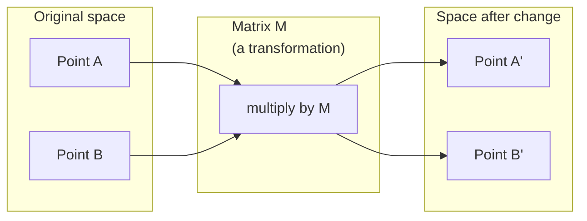
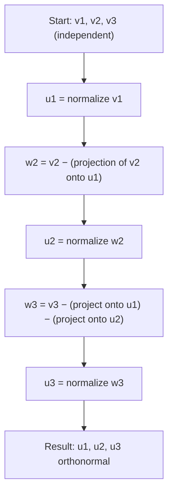
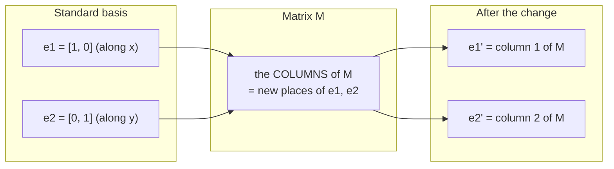
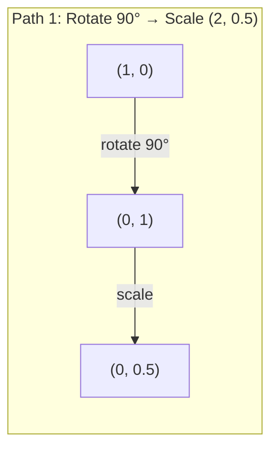
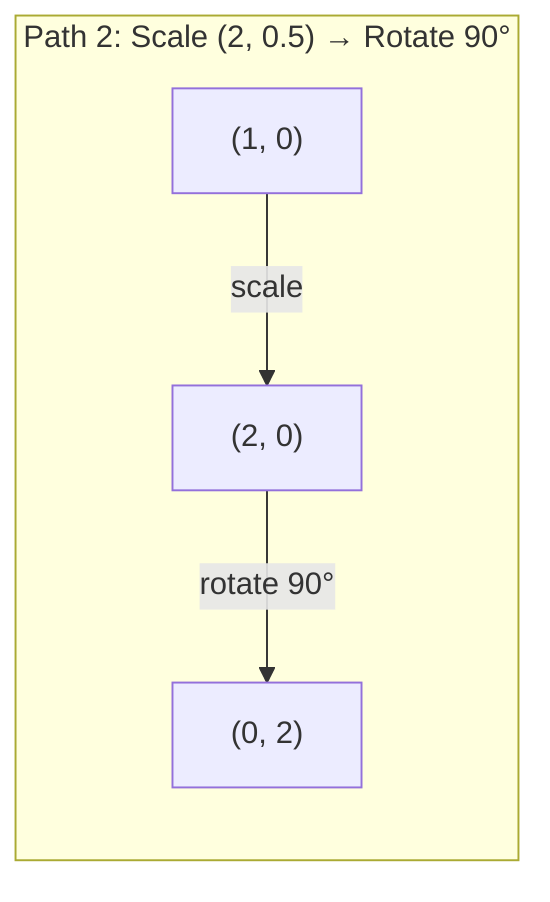
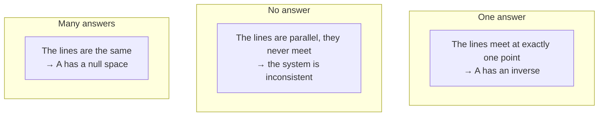
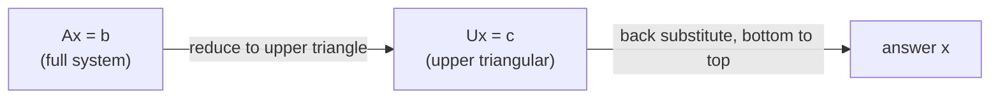
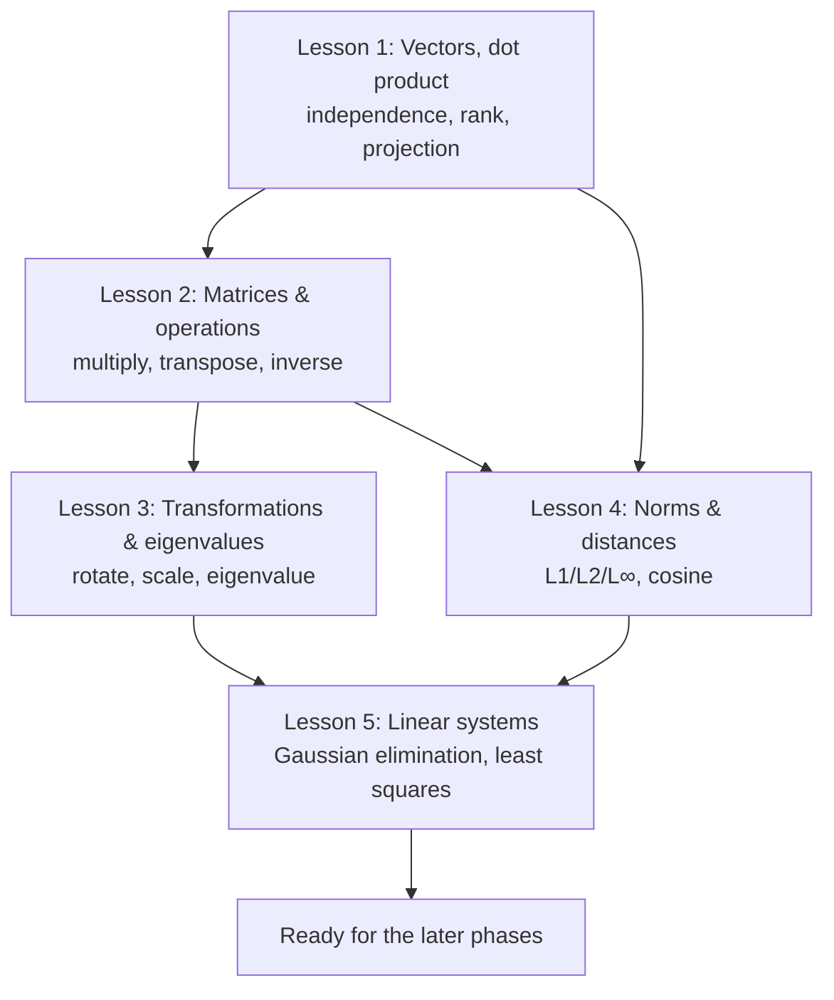

# Module A — Core Linear Algebra (Simple English)

> Every AI model is really just math on vectors and matrices. This module helps you *see* that. We use pictures, small number examples, and code you write yourself.

**Level:** Beginner. You do **not** need to know linear algebra before this.
**English level:** Simple English (CEFR B1–B2). Short sentences. Common words. Hard words are explained.
**Time:** About 5 hours for all 5 lessons.
**Code language:** Python (with NumPy when we need it).

This module is based on 5 lessons in `phases/01-math-foundations`:

| Lesson | Topic | Source lesson |
|--------|-------|---------------|
| 1 | Linear algebra intuition | `01-linear-algebra-intuition` |
| 2 | Vectors, matrices & operations | `02-vectors-matrices-operations` |
| 3 | Matrix transformations & eigenvalues | `03-matrix-transformations` |
| 4 | Norms & distances | `14-norms-and-distances` |
| 5 | Linear systems | `17-linear-systems` |

**How to study well:** Read the theory. Then redo the number examples with paper and a pen. Then type the code and run it. Then do the exercises *before* you look at the answers. Math is not a sport you learn by watching.

---

## Contents

- [Before you start — Symbols & rules](#before)
- [Lesson 1 — Linear algebra intuition](#lesson-1)
- [Lesson 2 — Vectors, matrices & operations](#lesson-2)
- [Lesson 3 — Matrix transformations & eigenvalues](#lesson-3)
- [Lesson 4 — Norms & distances](#lesson-4)
- [Lesson 5 — Linear systems](#lesson-5)
- [Module A summary](#summary)

---

<a name="before"></a>

## Before you start — Symbols & rules

If you have not done math for a while, these symbols will come up again and again. Read them once. Come back when you need them.

### Basic symbols

| Symbol | We say | It means |
|--------|--------|----------|
| $v$, $\mathbf{v}$ | "vector v" | A vector (a list of numbers). Books make it bold. |
| $A$, $M$ | "matrix A" | A matrix (a box of numbers, in rows and columns). |
| $v_1, v_2, \dots, v_n$ | "v one, v two..." | The parts (elements) of a vector. The small number is the position. |
| $A_{ij}$ | "A i j" | The number in **row i, column j** of matrix A. |
| $\sum_{i=1}^{n} x_i$ | "sum, sigma" | Add them all up: $x_1 + x_2 + \dots + x_n$. $\Sigma$ just means "add all". |
| $\|v\|$ | "norm of v" | The length (size) of vector v. |
| $a \cdot b$ | "a dot b" | The dot product of two vectors. |
| $A^T$ | "A transpose" | The transpose — flip rows into columns. |
| $A^{-1}$ | "A inverse" | The inverse matrix — the "undo" transformation. |
| $\theta$ | "theta" | Usually an angle. |
| $\lambda$ | "lambda" | Usually an eigenvalue, or a small tuning number. |
| $\approx$ | "about equal" | Almost equal (because of rounding). |

### Three important rules

**1. Where do we start counting?** In math, we usually count from 1 ($v_1$ is the first part). In Python code, we count from 0 (`v[0]` is the first part). This text uses both. Watch the context: math formulas start at 1, code starts at 0.

**2. Is a vector a column or a row?** In AI/ML, a vector is a **column vector** (written top to bottom) by default. This matters when we multiply it with a matrix. When we write `[3, 4]` sideways to save space, think of it as a column.

**3. What does "dimension" mean?** A vector with $n$ numbers "lives" in $n$-dimensional space. The vector `[3, 4]` is 2-dimensional (a point on a flat plane). A word embedding can be 768-dimensional. We cannot draw that, but the math still works the same way.

> **💡 Tip for beginners:** Do not try to "picture" 768-dimensional space. Nobody can. The trick is: understand it really well in 2D and 3D (where you can draw), then *trust* that the formula grows to higher dimensions in the same way. The computer does not care how many dimensions there are. It only adds and multiplies.

---

<a name="lesson-1"></a>

# Lesson 1 — Linear algebra intuition

> Every AI model is just matrix math wearing a fancy hat.

**Time:** About 45 minutes · **You need first:** Nothing.

## Goals

After this lesson you will:

- Understand what a vector is in a **geometric** way (not just "a list of numbers").
- Know how the dot product measures **similarity** — the base of semantic search and RAG.
- Understand "linear independence", "rank", and "basis" in plain words.
- Know what projection and the Gram-Schmidt process do.
- Connect each idea to real AI (embeddings, attention, LoRA).

## The problem

Open any AI paper. On the first page you already see vectors, matrices, dot products, and transformations. Without some intuition for linear algebra, these are just symbols. With it, you can *see* what a neural network really does: **it moves points around in space.**

You do not need to become a mathematician. You need to see what these operations *mean*, and then write them in code yourself.

## The concept

### A vector is a point (and also a direction)

A vector is just a list of numbers. But the numbers *mean* something. They are coordinates in space.

The vector `[3, 2]` points from the origin $(0, 0)$ to the point $(3, 2)$ on a flat plane.

<svg viewBox="0 0 320 260" xmlns="http://www.w3.org/2000/svg" style="max-width:100%;height:auto" role="img" aria-label="Vector [3,2] on the plane">
  <defs>
    <marker id="arrow1" markerWidth="10" markerHeight="10" refX="8" refY="3" orient="auto">
      <path d="M0,0 L8,3 L0,6 Z" fill="currentColor"/>
    </marker>
  </defs>
  <g stroke="currentColor" stroke-width="1" opacity="0.25">
    <line x1="40" y1="30" x2="40" y2="220"/>
    <line x1="40" y1="220" x2="300" y2="220"/>
    <line x1="100" y1="30" x2="100" y2="220"/>
    <line x1="160" y1="30" x2="160" y2="220"/>
    <line x1="220" y1="30" x2="220" y2="220"/>
    <line x1="280" y1="30" x2="280" y2="220"/>
    <line x1="40" y1="160" x2="300" y2="160"/>
    <line x1="40" y1="100" x2="300" y2="100"/>
    <line x1="40" y1="40" x2="300" y2="40"/>
  </g>
  <line x1="40" y1="220" x2="280" y2="100" stroke="#e8590c" stroke-width="2.5" marker-end="url(#arrow1)"/>
  <circle cx="280" cy="100" r="4" fill="#e8590c"/>
  <text x="286" y="96" font-size="13" fill="currentColor">(3, 2)</text>
  <text x="44" y="234" font-size="11" fill="currentColor" opacity="0.7">origin (0,0)</text>
  <text x="150" y="150" font-size="12" fill="#e8590c">length √13 ≈ 3.6</text>
</svg>

The length (size) of this vector uses the Pythagoras rule:

$$\|[3, 2]\| = \sqrt{3^2 + 2^2} = \sqrt{13} \approx 3.6$$

In AI, vectors stand for **everything**:

- A word → a vector of 768 numbers (this is its "meaning" in embedding space).
- An image → a vector of millions of pixel values.
- A user → a vector of their likes.

> **💡 Core idea:** When people say "AI understands language", here is what really happens. Each word becomes a point in a space with many dimensions. Words with close meaning sit close together. "king" and "emperor" are near each other. "king" and "carrot" are far apart. It is all just geometry.

### A matrix is a transformation

A matrix changes one vector into another vector. It can rotate, stretch, squeeze, or project.



In AI, the matrix **is the model**:

- The weights of a neural network → matrices that change the input into the output.
- Attention scores → matrices that decide where to "look".
- Embeddings → matrices that map words to vectors.

### The dot product measures similarity

The dot product of two vectors tells you how *similar* they are.

$$a \cdot b = a_1 b_1 + a_2 b_2 + \dots + a_n b_n$$

In words: multiply each matching pair, then add them all up.

| Case | Sign | Meaning |
|------|------|---------|
| Same direction | $a \cdot b > 0$ | Similar |
| At right angles | $a \cdot b = 0$ | Not related |
| Opposite direction | $a \cdot b < 0$ | Opposite |

**Small number example (by hand):** with $a = [1, 2]$ and $b = [3, 1]$:

$$a \cdot b = (1)(3) + (2)(1) = 3 + 2 = 5 > 0$$

The number is positive, so these two vectors point in a fairly similar direction.

This is *exactly* how search engines, recommendation systems, and RAG work — they look for vectors with a high dot product.

> **⚠️ Common mistake:** Do not mix up the dot product and the length. The dot product gives *one number* about the relation between *two* vectors. The length also gives one number, but only about *one* vector. Note this useful fact: $a \cdot a = \|a\|^2$ (the dot product of a vector with itself is its length, squared).

### Linear independence

A set of vectors is **linearly independent** if no vector in the set can be written using the others (by adding them and scaling them).

Think of it simply. If three vectors are independent, they can "cover" a full 3D space. If one vector is a mix of two others, then they really sit on one flat plane. You have three vectors but only two "free directions".

**Clear example:**

```
v1 = [1, 0, 0]
v2 = [0, 1, 0]
v3 = [2, 1, 0]   ← note: v3 = 2·v1 + 1·v2
```

$v_1$ and $v_2$ are independent. But $v_3 = 2v_1 + v_2$, so the set $\{v_1, v_2, v_3\}$ is **dependent**. All three sit in the xy-plane. However you mix them, you can never reach the point $[0, 0, 1]$.

**Why does AI care?** In a data set: if `feature_3 = 2·feature_1 + feature_2`, then adding feature 3 gives the model *no new information*. Worse, it makes the regression have no single answer. This problem is called *multicollinearity*.

### Basis and rank

A **basis** is the smallest set of independent vectors that can cover the whole space. The number of basis vectors is the number of dimensions of the space.

The standard basis of 3D space is $\{[1,0,0], [0,1,0], [0,0,1]\}$ — these are the x, y, and z axes. But *any* three independent vectors form a valid basis. Choosing a basis is like choosing a coordinate system.

The **rank** of a matrix is the number of independent columns. It is also the number of independent rows.

| Case | Rank | Meaning for ML |
|------|------|----------------|
| Full rank | Maximum | Model has one clear answer. It is stable. |
| Rank deficient | Below max | Extra features. Many answers. You need regularization. |
| Rank 1 | 1 | Every column is a scaled copy of one vector. Data sits on a line. |

> **⚠️ Common mistake:** Rank is **not** always equal to the number of columns. A $3 \times 3$ matrix can have rank 2 if one column is a mix of the other two. "Number of columns" is the *size*. "Rank" is the *real number of dimensions* the columns can cover.

### Projection

To project vector $a$ onto vector $b$ gives you the part of $a$ that goes *in the direction of* $b$:

$$\text{proj}_b(a) = \frac{a \cdot b}{b \cdot b} \, b$$

The rest, $(a - \text{proj}_b(a))$, is at a right angle to $b$. This way of splitting a vector is the base of the least-squares method.

<svg viewBox="0 0 340 220" xmlns="http://www.w3.org/2000/svg" style="max-width:100%;height:auto" role="img" aria-label="Projection of a onto b">
  <defs>
    <marker id="arrowB" markerWidth="10" markerHeight="10" refX="8" refY="3" orient="auto">
      <path d="M0,0 L8,3 L0,6 Z" fill="#1971c2"/>
    </marker>
    <marker id="arrowA" markerWidth="10" markerHeight="10" refX="8" refY="3" orient="auto">
      <path d="M0,0 L8,3 L0,6 Z" fill="#e8590c"/>
    </marker>
  </defs>
  <line x1="40" y1="180" x2="300" y2="180" stroke="#1971c2" stroke-width="2.5" marker-end="url(#arrowB)"/>
  <text x="270" y="172" font-size="13" fill="#1971c2">b</text>
  <line x1="40" y1="180" x2="200" y2="60" stroke="#e8590c" stroke-width="2.5" marker-end="url(#arrowA)"/>
  <text x="150" y="90" font-size="13" fill="#e8590c">a</text>
  <line x1="200" y1="60" x2="200" y2="180" stroke="currentColor" stroke-width="1.5" stroke-dasharray="4 3" opacity="0.7"/>
  <text x="205" y="120" font-size="11" fill="currentColor" opacity="0.8">rest (right angle)</text>
  <line x1="40" y1="180" x2="200" y2="180" stroke="#2f9e44" stroke-width="4"/>
  <text x="70" y="200" font-size="12" fill="#2f9e44">proj_b(a) — shadow of a on b</text>
  <rect x="190" y="170" width="10" height="10" fill="none" stroke="currentColor" opacity="0.6"/>
</svg>

**Number example:** $a = [3, 4]$, $b = [1, 0]$:

$$\text{proj}_b(a) = \frac{(3)(1) + (4)(0)}{(1)(1) + (0)(0)} \, [1, 0] = 3 \cdot [1, 0] = [3, 0]$$

The projection drops the y part. This is *dimensionality reduction in its simplest form* — you throw away the directions you do not care about.

Projection is everywhere in ML:
- Linear regression = projecting the data onto the column space (the answer *is* a projection).
- PCA projects data onto the direction with the most spread.
- Attention in a transformer projects a query onto a key.

### The Gram-Schmidt process

This turns *any* set of independent vectors into an **orthonormal basis**. Orthonormal means every vector has length 1, and every pair is at a right angle.



The idea, step by step:
1. Take the first vector. Normalize it (divide by its length to get length 1).
2. Take the second vector. **Subtract** its projection onto the first (so it becomes a right angle to it). Then normalize.
3. Take the third vector. Subtract its projection onto *both* earlier vectors. Then normalize.
4. Repeat.

This is how QR decomposition works inside. We use it to solve systems, find eigenvalues, and fit least-squares regression.

## Let's build it

### Step 1: A Vector class from scratch

```python
class Vector:
    def __init__(self, components):
        self.components = list(components)
        self.dim = len(self.components)

    def __add__(self, other):
        return Vector([a + b for a, b in zip(self.components, other.components)])

    def __sub__(self, other):
        return Vector([a - b for a, b in zip(self.components, other.components)])

    def dot(self, other):
        # Dot product: multiply each pair, then add them up
        return sum(a * b for a, b in zip(self.components, other.components))

    def magnitude(self):
        # Length = square root of (dot product with itself)
        return sum(x**2 for x in self.components) ** 0.5

    def normalize(self):
        # Divide by the length to get length 1
        mag = self.magnitude()
        return Vector([x / mag for x in self.components])

    def cosine_similarity(self, other):
        # Cosine similarity = dot divided by both lengths
        return self.dot(other) / (self.magnitude() * other.magnitude())

    def __repr__(self):
        return f"Vector({self.components})"


a = Vector([1, 2, 3])
b = Vector([4, 5, 6])

print(f"a + b = {a + b}")
print(f"a · b = {a.dot(b)}")               # 32
print(f"|a| = {a.magnitude():.4f}")         # 3.7417
print(f"cosine = {a.cosine_similarity(b):.4f}")  # 0.9746
```

### Step 2: Projection and Gram-Schmidt from scratch

```python
def project(a, b):
    """Project vector a onto vector b."""
    scalar = a.dot(b) / b.dot(b)
    return Vector([scalar * x for x in b.components])


def gram_schmidt(vectors):
    """Turn a set of independent vectors into an orthonormal basis."""
    orthonormal = []
    for v in vectors:
        w = v
        for u in orthonormal:          # subtract the projection onto every earlier vector
            w = w - project(w, u)
        if w.magnitude() < 1e-10:      # skip if linearly dependent
            continue
        orthonormal.append(w.normalize())
    return orthonormal


v1 = Vector([1, 0, 0])
v2 = Vector([1, 1, 0])
v3 = Vector([1, 1, 1])
basis = gram_schmidt([v1, v2, v3])

for i, u in enumerate(basis):
    print(f"u{i+1} = {u},  |u{i+1}| = {u.magnitude():.4f}")

# Check right angles: every pair must have dot ≈ 0
print(f"u1 · u2 = {basis[0].dot(basis[1]):.6f}")  # ≈ 0
```

### Step 3: The same math with NumPy (for real work)

```python
import numpy as np

a = np.array([1, 2, 3], dtype=float)
b = np.array([4, 5, 6], dtype=float)

print(f"a · b = {np.dot(a, b)}")
print(f"|a| = {np.linalg.norm(a):.4f}")
print(f"cosine = {np.dot(a, b) / (np.linalg.norm(a) * np.linalg.norm(b)):.4f}")

# Rank of a matrix
A = np.array([[1, 2], [2, 4]])          # column 2 = 2·column 1 → rank deficient
print(f"Rank: {np.linalg.matrix_rank(A)}")   # 1, not 2!

# QR decomposition (Gram-Schmidt, made fast)
Q, R = np.linalg.qr(np.random.randn(3, 3))
print(f"Q is orthogonal: {np.allclose(Q @ Q.T, np.eye(3))}")  # True
```

> **💡 Why write it "from scratch" and then use NumPy?** You write it from scratch to *understand* what happens. You use NumPy to *do real work* — it is 100 times faster because it is written in fast, low-level code. You need both: understand the idea, then use the strong tool.

## Connection to real AI

| Idea | Where it shows up in modern AI |
|------|--------------------------------|
| Dot product | Attention scores in transformers; cosine similarity in RAG |
| Matrix multiply | Every layer of every neural network |
| Linear independence | Feature selection; avoiding multicollinearity |
| Rank | LoRA (Low-Rank Adaptation) for fine-tuning LLMs |
| Projection | Linear regression, PCA |
| Gram-Schmidt / QR | Numerical solvers, orthogonal weight setup |

**LoRA is worth a special note.** It fine-tunes large language models by splitting the weight update into *low-rank* matrices. Instead of updating a $4096 \times 4096$ matrix (16 million numbers), LoRA updates two matrices, $4096 \times 16$ and $16 \times 4096$ (only 131 thousand numbers). The "rank 16" rule says the weight update lives inside a 16-dimensional space, hidden inside the full 4096-dimensional space. That is linear algebra doing real work.

## Exercises — Lesson 1

> Do them all before you look at the answers below. Do the "Basic" ones by hand, with paper and a pen.

**Exercise 1.1 (Basic).** Find the dot product and the cosine similarity of $a = [2, 0]$ and $b = [0, 5]$. What is the relation between these two vectors?

**Exercise 1.2 (Basic).** Project the vector $[1, 2, 3]$ onto $[1, 1, 1]$. What does the result mean, geometrically?

**Exercise 1.3 (Medium).** Given $v_1 = [1, 0, 0]$, $v_2 = [0, 1, 0]$, $v_3 = [3, 4, 0]$. Is this set linearly independent? If not, write $v_3$ using the other vectors. How many dimensions can these three vectors cover?

**Exercise 1.4 (Medium — code).** Write a function `angle_between(a, b)` that returns the angle (in degrees) between two vectors. Use the formula $\cos\theta = \frac{a \cdot b}{\|a\|\|b\|}$. Test it: the angle between $[1, 0]$ and $[0, 1]$ must be 90°.

**Exercise 1.5 (AI application).** Here are 4 fake "word vectors" in 3D:
`cat=[0.9, 0.1, 0.0]`, `dog=[0.8, 0.2, 0.1]`, `car=[0.0, 0.1, 0.9]`, `ship=[0.1, 0.0, 0.8]`.
Use cosine similarity. Find the *most similar* pair and the *least similar* pair. Do the results make sense for the meaning of the words?

---

### Answers — Lesson 1

**Answer 1.1.**

Dot product: $a \cdot b = (2)(0) + (0)(5) = 0$.

Because the dot product is 0, the two vectors are **at a right angle** (orthogonal). Cosine similarity $= \frac{0}{2 \times 5} = 0$, which agrees (the cosine of 90° is 0). Geometrically: $a$ is on the x-axis, $b$ is on the y-axis. They are at a right angle. In AI terms, two feature vectors at a right angle are "not related" — knowing one tells you nothing about the other.

**Answer 1.2.**

Use the formula $\text{proj}_b(a) = \frac{a \cdot b}{b \cdot b} b$ with $a = [1,2,3]$, $b = [1,1,1]$:

- Top: $a \cdot b = (1)(1) + (2)(1) + (3)(1) = 6$.
- Bottom: $b \cdot b = 1 + 1 + 1 = 3$.
- Scalar: $6 / 3 = 2$.
- Result: $2 \cdot [1, 1, 1] = [2, 2, 2]$.

**What it means:** $[2, 2, 2]$ is the point on the line in the direction $[1,1,1]$ (the main diagonal) that is closest to $[1,2,3]$. Note that $2$ is the **average** of $1, 2, 3$. Projecting onto the "all ones" vector always gives the average. This is why projection is closely tied to statistics.

**Answer 1.3.**

Check: can we write $v_3 = [3,4,0]$ as $\alpha v_1 + \beta v_2$?
$\alpha[1,0,0] + \beta[0,1,0] = [\alpha, \beta, 0]$. Set it equal to $[3,4,0]$ → $\alpha = 3$, $\beta = 4$. It fits!

So $v_3 = 3v_1 + 4v_2$ → the set is **linearly dependent** (not independent).

All three vectors have a z-part of 0, so they sit in the xy-plane. They can only cover **2 dimensions** (the plane), not 3. The rank of the matrix from these three vectors is 2.

**Answer 1.4.**

```python
import math

def angle_between(a, b):
    dot = sum(x * y for x, y in zip(a, b))
    mag_a = sum(x**2 for x in a) ** 0.5
    mag_b = sum(x**2 for x in b) ** 0.5
    cos_theta = dot / (mag_a * mag_b)
    # Clamp to [-1, 1] so a tiny rounding error does not break acos
    cos_theta = max(-1.0, min(1.0, cos_theta))
    return math.degrees(math.acos(cos_theta))

print(angle_between([1, 0], [0, 1]))   # 90.0
print(angle_between([1, 0], [1, 1]))   # 45.0
print(angle_between([1, 0], [-1, 0]))  # 180.0
```

One important detail: the line `max(-1.0, min(1.0, ...))`. Because of floating-point rounding, `cos_theta` sometimes comes out as $1.0000000002$, and `math.acos` then throws an error. Clamping the value is a standard safety trick.

**Answer 1.5.**

```python
import numpy as np

words = {
    "cat":  np.array([0.9, 0.1, 0.0]),
    "dog":  np.array([0.8, 0.2, 0.1]),
    "car":  np.array([0.0, 0.1, 0.9]),
    "ship": np.array([0.1, 0.0, 0.8]),
}

def cos_sim(a, b):
    return np.dot(a, b) / (np.linalg.norm(a) * np.linalg.norm(b))

names = list(words)
for i in range(len(names)):
    for j in range(i + 1, len(names)):
        s = cos_sim(words[names[i]], words[names[j]])
        print(f"{names[i]:4} vs {names[j]:4}: {s:.3f}")
```

Results (about):

```
cat  vs dog : 0.976   ← most similar (both are animals)
cat  vs car : 0.083
cat  vs ship: 0.135
dog  vs car : 0.213
dog  vs ship: 0.163
car  vs ship: 0.988   ← most similar (both are vehicles)
```

The most similar pairs are **cat–dog** (0.976) and **car–ship** (0.988). The least similar pair is **cat–car** (0.083).

This makes good sense for meaning: animals group with animals, vehicles group with vehicles. This is exactly what happens with real embeddings. The only difference is that real ones have many more dimensions (768, 1536...), and the model *learns* the numbers instead of us making them up.

## English–meaning glossary — Lesson 1

| Term | Simple meaning |
|------|----------------|
| Vector | A list of numbers = a point or a direction in n-dimensional space |
| Dot product | Multiply each pair, then add; it measures similarity |
| Magnitude / Norm | The "size" (length) of a vector |
| Cosine similarity | Measures the angle between two vectors; ignores length |
| Linear independence | No vector is a mix of the others |
| Rank | The real number of dimensions the columns/rows can cover |
| Basis | The smallest set of independent vectors that covers the space |
| Projection | The "shadow" of one vector onto another |
| Orthonormal | At right angles to each other, and each has length 1 |
| Embedding | A vector that stands for the meaning of a word/image/user |

---

<a name="lesson-2"></a>

# Lesson 2 — Vectors, matrices & operations

> Every neural network is just matrix multiplication with a few extra steps.

**Time:** About 75 minutes · **You need first:** Lesson 1.

## Goals

- Build a `Matrix` class with: add, element-wise multiply, matrix multiply, transpose, determinant, inverse.
- Tell apart **element-wise multiply** and **matrix multiply** — and know when to use each one.
- Build one dense neural network layer (`relu(W @ x + b)`) using only your from-scratch Matrix class.
- Understand broadcasting, and how bias addition works in frameworks.

## The problem

You want to build a neural network. You read the code and see this line:

```
output = activation(weights @ input + bias)
```

That `@` is **matrix multiplication**. `weights` is a matrix. `input` is a vector. If you do not know what these operations do, this line is magic. If you do know, it is the *whole forward pass* of a layer — packed into three operations.

Every image your model reads is a matrix of pixel values. Every word embedding is a vector. Every layer of every neural network is a matrix transformation. You cannot build AI systems without being fluent in matrix operations. It is like trying to write code without understanding variables.

## The concept

### A matrix is a grid of numbers

A matrix is a 2D grid with rows and columns. An $m \times n$ matrix has $m$ rows and $n$ columns.

$$A = \begin{bmatrix} 1 & 2 & 3 \\ 4 & 5 & 6 \end{bmatrix} \quad \text{(a } 2 \times 3 \text{ matrix: 2 rows, 3 columns)}$$

In a neural network, a weight matrix changes an input vector into an output vector. A layer with 784 inputs and 128 outputs uses a $128 \times 784$ weight matrix.

### Why "shape" matters

Matrix multiplication has one strict rule: $(m \times n) @ (n \times p) = (m \times p)$. **The two inner numbers must match.**

```
(128 × 784) @ (784 × 1) = (128 × 1)
  weights      input       output

Inner numbers: 784 = 784  → valid ✓
```

<svg viewBox="0 0 380 130" xmlns="http://www.w3.org/2000/svg" style="max-width:100%;height:auto" role="img" aria-label="The shape-match rule for matrix multiply">
  <rect x="30" y="45" width="70" height="45" fill="none" stroke="#1971c2" stroke-width="2"/>
  <text x="65" y="72" font-size="13" fill="#1971c2" text-anchor="middle">128×784</text>
  <text x="115" y="72" font-size="18" fill="currentColor" text-anchor="middle">@</text>
  <rect x="130" y="45" width="70" height="45" fill="none" stroke="#e8590c" stroke-width="2"/>
  <text x="165" y="72" font-size="13" fill="#e8590c" text-anchor="middle">784×1</text>
  <text x="215" y="72" font-size="18" fill="currentColor" text-anchor="middle">=</text>
  <rect x="230" y="45" width="70" height="45" fill="none" stroke="#2f9e44" stroke-width="2"/>
  <text x="265" y="72" font-size="13" fill="#2f9e44" text-anchor="middle">128×1</text>
  <path d="M 95 100 Q 115 118 135 100" fill="none" stroke="#d6336c" stroke-width="1.5"/>
  <text x="115" y="122" font-size="11" fill="#d6336c" text-anchor="middle">784 = 784 must match</text>
</svg>

> **⚠️ Common mistake:** A "shape mismatch" error in PyTorch/NumPy almost always means the two inner numbers do not match. When you see the error, print `A.shape` and `B.shape`. Then check: is the *last* number of A equal to the *first* number of B?

### The operations map

| Operation | What it does | Use in a neural network |
|-----------|-------------|-------------------------|
| Addition | Add each element | Adding bias to the output |
| Scalar multiply | Scale every element | learning_rate × gradient |
| Matrix multiply | Change vectors | The forward pass of a layer |
| Transpose | Flip rows ↔ columns | Backpropagation |
| Determinant | Sum up in one number | Check if a matrix has an inverse |
| Inverse | Undo a transformation | Solving linear systems |
| Identity matrix | The "do nothing" matrix | Setup, residual connections |

### Element-wise multiply ≠ matrix multiply

This is where beginners get confused, again and again.

**Element-wise multiply:** multiply matching positions. Both matrices must have the **same shape**.

$$\begin{bmatrix} 1 & 2 \\ 3 & 4 \end{bmatrix} * \begin{bmatrix} 5 & 6 \\ 7 & 8 \end{bmatrix} = \begin{bmatrix} 5 & 12 \\ 21 & 32 \end{bmatrix}$$

**Matrix multiply:** dot products of rows and columns. The inner numbers must match.

$$\begin{bmatrix} 1 & 2 \\ 3 & 4 \end{bmatrix} @ \begin{bmatrix} 5 & 6 \\ 7 & 8 \end{bmatrix} = \begin{bmatrix} 1{\cdot}5{+}2{\cdot}7 & 1{\cdot}6{+}2{\cdot}8 \\ 3{\cdot}5{+}4{\cdot}7 & 3{\cdot}6{+}4{\cdot}8 \end{bmatrix} = \begin{bmatrix} 19 & 22 \\ 43 & 50 \end{bmatrix}$$

Different operation, different result, different rule. Here is how we find the top-left number of the matrix multiply:

<svg viewBox="0 0 400 150" xmlns="http://www.w3.org/2000/svg" style="max-width:100%;height:auto" role="img" aria-label="How to multiply a row by a column">
  <text x="20" y="30" font-size="12" fill="currentColor">Row 1 of A:</text>
  <rect x="110" y="18" width="30" height="24" fill="#1971c2" opacity="0.25" stroke="#1971c2"/>
  <text x="125" y="35" font-size="13" text-anchor="middle" fill="currentColor">1</text>
  <rect x="140" y="18" width="30" height="24" fill="#1971c2" opacity="0.25" stroke="#1971c2"/>
  <text x="155" y="35" font-size="13" text-anchor="middle" fill="currentColor">2</text>
  <text x="20" y="75" font-size="12" fill="currentColor">Col 1 of B:</text>
  <rect x="110" y="63" width="30" height="24" fill="#e8590c" opacity="0.25" stroke="#e8590c"/>
  <text x="125" y="80" font-size="13" text-anchor="middle" fill="currentColor">5</text>
  <rect x="140" y="63" width="30" height="24" fill="#e8590c" opacity="0.25" stroke="#e8590c"/>
  <text x="155" y="80" font-size="13" text-anchor="middle" fill="currentColor">7</text>
  <text x="20" y="120" font-size="13" fill="#2f9e44">Result[1,1] = 1×5 + 2×7 = 5 + 14 = 19</text>
</svg>

### Broadcasting (the shape fixes itself)

When you add a bias vector to a matrix of outputs, the shapes do not match. Broadcasting "stretches" the smaller array so it fits.

$$\begin{bmatrix} 1 & 2 & 3 \\ 4 & 5 & 6 \end{bmatrix} + \begin{bmatrix} 10 & 20 & 30 \end{bmatrix} = \begin{bmatrix} 11 & 22 & 33 \\ 14 & 25 & 36 \end{bmatrix}$$

The bias vector is copied down each row, automatically. Every modern framework does this. Understanding it stops you from panicking when "the shapes look wrong but the code runs".

## Let's build it

### Step 1: A Matrix class with core operations

```python
class Matrix:
    def __init__(self, data):
        self.data = [list(row) for row in data]
        self.rows = len(self.data)
        self.cols = len(self.data[0])
        self.shape = (self.rows, self.cols)

    def __repr__(self):
        rows_str = "\n  ".join(str(row) for row in self.data)
        return f"Matrix{self.shape}:\n  {rows_str}"

    def __add__(self, other):
        return Matrix([
            [self.data[i][j] + other.data[i][j] for j in range(self.cols)]
            for i in range(self.rows)
        ])

    def element_wise_multiply(self, other):
        # Multiply EACH POSITION (same shape)
        return Matrix([
            [self.data[i][j] * other.data[i][j] for j in range(self.cols)]
            for i in range(self.rows)
        ])

    def matmul(self, other):
        # Matrix multiply: dot product of row × column
        return Matrix([
            [
                sum(self.data[i][k] * other.data[k][j] for k in range(self.cols))
                for j in range(other.cols)
            ]
            for i in range(self.rows)
        ])

    def transpose(self):
        # Flip rows into columns
        return Matrix([
            [self.data[j][i] for j in range(self.rows)]
            for i in range(self.cols)
        ])

    def determinant(self):
        # Simple case for 1×1 and 2×2; bigger sizes use recursion
        if self.shape == (1, 1):
            return self.data[0][0]
        if self.shape == (2, 2):
            return self.data[0][0]*self.data[1][1] - self.data[0][1]*self.data[1][0]
        det = 0
        for j in range(self.cols):
            minor = Matrix([
                [self.data[i][k] for k in range(self.cols) if k != j]
                for i in range(1, self.rows)
            ])
            det += ((-1) ** j) * self.data[0][j] * minor.determinant()
        return det

    def inverse_2x2(self):
        det = self.determinant()
        if det == 0:
            raise ValueError("Matrix is singular, it has no inverse")
        return Matrix([
            [ self.data[1][1] / det, -self.data[0][1] / det],
            [-self.data[1][0] / det,  self.data[0][0] / det]
        ])

    @staticmethod
    def identity(n):
        return Matrix([[1 if i == j else 0 for j in range(n)] for i in range(n)])
```

### Step 2: See it run

```python
A = Matrix([[1, 2], [3, 4]])
B = Matrix([[5, 6], [7, 8]])

print("A @ B =", A.matmul(B).data)      # [[19, 22], [43, 50]]
print("A^T   =", A.transpose().data)    # [[1, 3], [2, 4]]
print("det(A)=", A.determinant())       # -2
print("A^-1  =", A.inverse_2x2().data)  # [[-2.0, 1.0], [1.5, -0.5]]

I = Matrix.identity(2)
# A times its inverse must give the identity matrix
print("A @ A^-1 =", A.matmul(A.inverse_2x2()).data)  # ≈ [[1, 0], [0, 1]]
```

### Step 3: Connect it to a neural network — one dense layer

```python
import random

inputs = Matrix([[0.5], [0.8], [0.2]])   # a 3D input vector (as a column)
weights = Matrix([
    [random.uniform(-1, 1) for _ in range(3)]
    for _ in range(2)
])                                        # a 2×3 weight matrix
bias = Matrix([[0.1], [0.1]])

def relu_matrix(m):
    # ReLU: keep positive numbers, turn negative numbers into 0
    return Matrix([[max(0, val) for val in row] for row in m.data])

pre_activation = weights.matmul(inputs) + bias   # W @ x + b
output = relu_matrix(pre_activation)             # relu(...)

print(f"Input:   {inputs.shape}")   # (3, 1)
print(f"Weights: {weights.shape}")  # (2, 3)
print(f"Output:  {output.shape}")   # (2, 1)
```

This is **one dense layer**: `output = relu(W @ x + b)`. Every dense layer in every neural network does exactly this. Stack many of them, add a way to learn the weights, and you get deep learning.

### Step 4: NumPy does it all, 100 times faster

```python
import numpy as np

A = np.array([[1, 2], [3, 4]])
B = np.array([[5, 6], [7, 8]])

print("A * B (element-wise):\n", A * B)   # [[5, 12], [21, 32]]
print("A @ B (matrix multiply):\n", A @ B)   # [[19, 22], [43, 50]]
print("A^T:\n", A.T)
print("det(A) =", np.linalg.det(A))
print("A^-1:\n", np.linalg.inv(A))

# One neural network layer, the real way
inputs  = np.random.randn(3, 1)
weights = np.random.randn(2, 3)
bias    = np.array([[0.1], [0.1]])
output  = np.maximum(0, weights @ inputs + bias)   # relu(W@x + b)
print("Layer:", weights.shape, "@", inputs.shape, "=", output.shape)

# Broadcasting: a 1D bias is copied down every row, automatically
matrix = np.array([[1, 2, 3], [4, 5, 6]])
bias1d = np.array([10, 20, 30])
print(matrix + bias1d)   # [[11, 22, 33], [14, 25, 36]]
```

> **💡 Important note:** In NumPy, `*` is **element-wise** multiply, and `@` is **matrix** multiply. This is a classic source of bugs for beginners. `A * B` and `A @ B` give totally different results. Remember: star = each element, at-sign = matrix.

## Connection to real AI

The `Matrix` class you just built is the base for the mini neural network framework in **Phase 3, Lesson 10**. All of deep learning is really just:

1. Stack `relu(W @ x + b)` layers.
2. Use transpose during backpropagation to find the gradient.
3. Update `W` with `W = W - learning_rate * gradient` (scalar multiply + matrix subtract).

The three operations in this lesson repeat billions of times when you train a model.

## Exercises — Lesson 2

**Exercise 2.1 (Basic).** By hand, find both: $A * B$ (element-wise) and $A @ B$ (matrix multiply), with
$A = \begin{bmatrix} 2 & 0 \\ 1 & 3 \end{bmatrix}$, $B = \begin{bmatrix} 1 & 4 \\ 2 & 1 \end{bmatrix}$.

**Exercise 2.2 (Basic).** Find the determinant of $\begin{bmatrix} 3 & 2 \\ 6 & 4 \end{bmatrix}$. Does this matrix have an inverse? Why or why not?

**Exercise 2.3 (Medium).** Check the inverse: take $A = \begin{bmatrix} 4 & 3 \\ 6 & 3 \end{bmatrix}$, find $A^{-1}$ with the 2×2 formula, then check that $A @ A^{-1}$ gives the identity matrix. What happens if the determinant is 0?

**Exercise 2.4 (Medium — shapes).** You have `x` of shape $(5, 1)$. You want to pass it through two layers: layer 1 has 8 neurons, layer 2 has 3 neurons. What shapes must the weight matrices $W_1$ and $W_2$ have so that `W2 @ (W1 @ x)` works? What is the shape of the final output?

**Exercise 2.5 (AI application — code).** Using only your from-scratch `Matrix` class (no NumPy), build a two-layer network: input (3) → hidden (4) → output (2). Set random weights, run one forward pass with ReLU, and print the shape at each step to check that everything fits.

---

### Answers — Lesson 2

**Answer 2.1.**

*Element-wise multiply* (multiply each cell in the same position):
$$A * B = \begin{bmatrix} 2{\cdot}1 & 0{\cdot}4 \\ 1{\cdot}2 & 3{\cdot}1 \end{bmatrix} = \begin{bmatrix} 2 & 0 \\ 2 & 3 \end{bmatrix}$$

*Matrix multiply* (row × column):
- Cell [1,1]: $(2)(1) + (0)(2) = 2$
- Cell [1,2]: $(2)(4) + (0)(1) = 8$
- Cell [2,1]: $(1)(1) + (3)(2) = 7$
- Cell [2,2]: $(1)(4) + (3)(1) = 7$

$$A @ B = \begin{bmatrix} 2 & 8 \\ 7 & 7 \end{bmatrix}$$

The two results are totally different. That is why you must keep the two operations apart.

**Answer 2.2.**

$\det = (3)(4) - (2)(6) = 12 - 12 = 0$.

The determinant is 0 → the matrix is **singular** → it has **no inverse**. Look closely: row 2 $= 2 \times$ row 1, so the two rows are linearly dependent. Geometrically, this transformation squashes the plane down to a line, and there is no way to "un-squash" it — the information is lost.

**Answer 2.3.**

$\det(A) = (4)(3) - (3)(6) = 12 - 18 = -6$.

The 2×2 inverse formula: $A^{-1} = \frac{1}{\det}\begin{bmatrix} d & -b \\ -c & a \end{bmatrix}$ with $A = \begin{bmatrix} a & b \\ c & d \end{bmatrix}$.

$$A^{-1} = \frac{1}{-6}\begin{bmatrix} 3 & -3 \\ -6 & 4 \end{bmatrix} = \begin{bmatrix} -0.5 & 0.5 \\ 1 & -0.667 \end{bmatrix}$$

Check $A @ A^{-1}$:
- Cell [1,1]: $(4)(-0.5) + (3)(1) = -2 + 3 = 1$ ✓
- Cell [1,2]: $(4)(0.5) + (3)(-0.667) = 2 - 2 = 0$ ✓
- Cell [2,1]: $(6)(-0.5) + (3)(1) = -3 + 3 = 0$ ✓
- Cell [2,2]: $(6)(0.5) + (3)(-0.667) = 3 - 2 = 1$ ✓

We get the identity matrix $\begin{bmatrix} 1 & 0 \\ 0 & 1 \end{bmatrix}$. If the determinant were 0, we would have to divide by 0 → we cannot compute it → there is no inverse (just like Exercise 2.2).

**Answer 2.4.**

Remember the rule: for `W @ x` to work with `x` of shape $(5, 1)$, $W_1$ must have 5 columns. Layer 1 has 8 neurons → 8 rows. So:

- $W_1$ is $(8, 5)$ → $W_1 @ x$ gives $(8, 1)$.
- $W_2$ takes the $(8, 1)$ input, so it must have 8 columns; layer 2 has 3 neurons → 3 rows. So $W_2$ is $(3, 8)$.
- $W_2 @ (W_1 @ x)$: $(3, 8) @ (8, 1) = (3, 1)$.

The **final output is $(3, 1)$** — the same as the number of neurons in the last layer. The general rule: a layer's weight matrix has shape (number_of_output_neurons × number_of_inputs).

**Answer 2.5.**

```python
import random
random.seed(0)

# (reuse the Matrix class and relu_matrix from the "Let's build it" section)

def random_matrix(rows, cols):
    return Matrix([[random.uniform(-0.5, 0.5) for _ in range(cols)]
                   for _ in range(rows)])

x  = Matrix([[0.5], [0.8], [0.2]])   # (3, 1)
W1 = random_matrix(4, 3)             # hidden layer: 4 neurons, 3 inputs
b1 = random_matrix(4, 1)
W2 = random_matrix(2, 4)             # output layer: 2 neurons, 4 inputs
b2 = random_matrix(2, 1)

print(f"input x:        {x.shape}")            # (3, 1)

h = relu_matrix(W1.matmul(x) + b1)             # hidden layer
print(f"after hidden:   {h.shape}")            # (4, 1)

y = W2.matmul(h) + b2                          # output layer (no activation)
print(f"output y:       {y.shape}")            # (2, 1)
print(f"output values:  {y.data}")
```

The key point: the shapes must "fit" through each layer — $(3,1) \to (4,1) \to (2,1)$. If you set a wrong weight-matrix size, `matmul` throws an error right away. This is how you check a network's design before you train it.

## English–meaning glossary — Lesson 2

| Term | Simple meaning |
|------|----------------|
| Matrix | A 2D grid of numbers = a linear transformation |
| Shape | The size (rows, columns) of a matrix |
| Matrix multiplication | Dot product of row × column; order matters |
| Element-wise | Multiply/add each matching position |
| Transpose | Flip rows into columns ($m{\times}n \to n{\times}m$) |
| Determinant | A number for area scaling; 0 means singular |
| Inverse | The matrix that undoes a transformation; exists only when det ≠ 0 |
| Identity matrix | The "multiply by 1" matrix; the diagonal is all 1s |
| Broadcasting | Stretch a small array to fit a big one |
| Dense layer | A `relu(W @ x + b)` layer — the basic unit of a neural network |
| Bias | A vector added after the weight multiply |

---

<a name="lesson-3"></a>

# Lesson 3 — Matrix transformations & eigenvalues

> A matrix is a machine that reshapes space. Learn what it does to *each point*, and you understand the whole transformation.

**Time:** About 75 minutes · **You need first:** Lesson 1, Lesson 2.

## Goals

- Build rotation, scaling, shearing, and reflection matrices, and apply them to 2D/3D points.
- Chain several transformations with matrix multiply, and see why *order matters*.
- Find eigenvalues and eigenvectors of a 2×2 matrix from the characteristic equation.
- Understand why eigenvalues decide the direction of PCA, the stability of an RNN, and the behavior of spectral clustering.

## The problem

You read about PCA and see "find the eigenvectors of the covariance matrix". You read about model stability and see "check if all eigenvalues have a size below 1". You read about data augmentation and see "apply a random rotation". None of this makes sense until you understand what a matrix does to space *in a geometric way*.

A matrix is not just a grid of numbers. It is a **space machine**. A rotation matrix spins points. A scaling matrix stretches them. A shearing matrix tilts them. Every transformation a neural network puts on data is one of these, or a mix of them.

## The concept

### A transformation = a matrix

Every linear transformation in 2D can be written as a $2 \times 2$ matrix. The matrix tells you exactly where the two basis vectors $[1, 0]$ and $[0, 1]$ go. Everything else follows from that.



> **💡 Golden idea:** Want to know what a matrix does? Just look at **its columns**. Column 1 tells you where the x-axis goes. Column 2 tells you where the y-axis goes. That is the whole secret.

### Rotation matrix

Rotating by an angle $\theta$ in 2D keeps distances and angles the same. Every point moves along a circle.

$$R(\theta) = \begin{bmatrix} \cos\theta & -\sin\theta \\ \sin\theta & \cos\theta \end{bmatrix}$$

<svg viewBox="0 0 300 210" xmlns="http://www.w3.org/2000/svg" style="max-width:100%;height:auto" role="img" aria-label="Rotate a point 45 degrees">
  <defs>
    <marker id="a3a" markerWidth="9" markerHeight="9" refX="7" refY="3" orient="auto"><path d="M0,0 L7,3 L0,6 Z" fill="#1971c2"/></marker>
    <marker id="a3b" markerWidth="9" markerHeight="9" refX="7" refY="3" orient="auto"><path d="M0,0 L7,3 L0,6 Z" fill="#e8590c"/></marker>
  </defs>
  <line x1="30" y1="180" x2="280" y2="180" stroke="currentColor" opacity="0.3"/>
  <line x1="30" y1="180" x2="30" y2="20" stroke="currentColor" opacity="0.3"/>
  <path d="M 130 180 A 100 100 0 0 0 100 110" fill="none" stroke="currentColor" stroke-dasharray="3 3" opacity="0.5"/>
  <line x1="30" y1="180" x2="130" y2="180" stroke="#1971c2" stroke-width="2.5" marker-end="url(#a3a)"/>
  <text x="135" y="185" font-size="12" fill="#1971c2">start (1,0)</text>
  <line x1="30" y1="180" x2="101" y2="109" stroke="#e8590c" stroke-width="2.5" marker-end="url(#a3b)"/>
  <text x="90" y="100" font-size="12" fill="#e8590c">after 45° turn</text>
  <text x="70" y="165" font-size="11" fill="currentColor" opacity="0.7">θ=45°</text>
</svg>

The determinant of a rotation matrix is **always 1** — a rotation does not change the area.

### Scaling and shearing and reflection

**Scaling** stretches or squeezes along each axis on its own: $S = \begin{bmatrix} s_x & 0 \\ 0 & s_y \end{bmatrix}$. For example, $S = \begin{bmatrix} 2 & 0 \\ 0 & 0.5 \end{bmatrix}$ turns the point $(2, 1)$ into $(4, 0.5)$. The determinant is $s_x \cdot s_y$.

**Shearing** tilts one axis while keeping the other fixed. It turns a rectangle into a parallelogram: $Sh_x = \begin{bmatrix} 1 & k \\ 0 & 1 \end{bmatrix}$.

**Reflection** flips space across an axis. Across the y-axis: $\begin{bmatrix} -1 & 0 \\ 0 & 1 \end{bmatrix}$ turns $(2,1)$ into $(-2,1)$. Its determinant is $-1$ (area stays the same, but the orientation flips).

### Chaining transformations: order matters

Apply transformation $A$, *then* $B$. This is the same as matrix multiply: `result = B @ A @ point`. Note that $B$ comes *first*, even though we apply it *last*.

**Order matters** — rotate then scale is not the same as scale then rotate:





The results are different: $(0, 0.5)$ versus $(0, 2)$. **Matrix multiplication is not commutative** — in general, $AB \neq BA$.

> **⚠️ Common mistake:** `B @ A` means "apply A *first*, then B". Read it from right to left, like the function $f(g(x))$ — $g$ runs first. Many people chain the wrong way and do not understand why their image looks different from what they expected.

### Eigenvalues and eigenvectors — the heart of this lesson

Most vectors *change direction* when a matrix hits them. An **eigenvector** is special: the matrix only *scales* it, never turns it. That scaling number is the **eigenvalue**.

$$A \, v = \lambda \, v$$

- $v$ is the eigenvector (the direction that "survives", it does not turn).
- $\lambda$ (lambda) is the eigenvalue (how much it stretches along that direction).

**Clear example:** $A = \begin{bmatrix} 2 & 1 \\ 1 & 2 \end{bmatrix}$

<svg viewBox="0 0 340 200" xmlns="http://www.w3.org/2000/svg" style="max-width:100%;height:auto" role="img" aria-label="An eigenvector does not change direction">
  <defs>
    <marker id="ev1" markerWidth="9" markerHeight="9" refX="7" refY="3" orient="auto"><path d="M0,0 L7,3 L0,6 Z" fill="#2f9e44"/></marker>
  </defs>
  <line x1="30" y1="170" x2="320" y2="170" stroke="currentColor" opacity="0.3"/>
  <line x1="30" y1="170" x2="30" y2="20" stroke="currentColor" opacity="0.3"/>
  <line x1="30" y1="170" x2="90" y2="110" stroke="#2f9e44" stroke-width="2" marker-end="url(#ev1)"/>
  <text x="55" y="105" font-size="11" fill="#2f9e44">v=[1,1]</text>
  <line x1="30" y1="170" x2="210" y2="-10" stroke="#2f9e44" stroke-width="3" stroke-dasharray="5 3" marker-end="url(#ev1)" opacity="0.6"/>
  <text x="150" y="45" font-size="11" fill="#2f9e44">A·v = 3·v (same direction, 3× longer)</text>
  <text x="120" y="195" font-size="11" fill="#e8590c">Direction [1,−1]: A·v = 1·v (no change)</text>
</svg>

- Eigenvector $[1, 1]$ with eigenvalue $3$: $A[1,1] = [3, 3] = 3 \cdot [1,1]$ (same direction, 3 times longer).
- Eigenvector $[1, -1]$ with eigenvalue $1$: $A[1,-1] = [1, -1] = 1 \cdot [1,-1]$ (no change at all).

This matrix stretches space 3 times along the $[1,1]$ direction and keeps the $[1,-1]$ direction the same. Every other direction is a mix of these two.

### Finding eigenvalues: the characteristic equation

For a $2 \times 2$ matrix $\begin{bmatrix} a & b \\ c & d \end{bmatrix}$, the eigenvalues are the answers to the **characteristic equation**:

$$\lambda^2 - (a + d)\lambda + (ad - bc) = 0$$

Here $(a+d)$ is the **trace** and $(ad - bc)$ is the **determinant**. This is just the familiar quadratic equation — solve it with the quadratic formula.

### Why eigenvalues matter

**PCA.** The eigenvectors of the covariance matrix *are* the principal components. The eigenvalues tell you how much spread each component keeps. Sort by eigenvalue, keep the top $k$, and you have dimensionality reduction.

**Stability.** In recurrent networks (RNNs) and dynamic systems, an eigenvalue with size $> 1$ makes the output *explode*; size $< 1$ makes it *vanish*. This is the exploding/vanishing gradient problem in one sentence.

**Spectral methods.** Graph neural networks use the eigenvalues of the adjacency matrix. Spectral clustering uses the eigenvalues of the Laplacian matrix. The eigenvectors show the structure of the graph.

### The determinant = the area scaling factor

The determinant of a transformation matrix tells you how much it scales area (2D) or volume (3D):

| Determinant | Meaning |
|-------------|---------|
| $= 1$ | Area stays the same (rotation) |
| $= 2$ | Area doubles |
| $= 0$ | Space is squashed to a lower dimension (singular) |
| $= -1$ | Area stays the same but orientation flips (reflection) |

## Let's build it

### Step 1: The transformation matrices from scratch

```python
import math

def rotation_2d(theta):
    c, s = math.cos(theta), math.sin(theta)
    return [[c, -s], [s, c]]

def scaling_2d(sx, sy):
    return [[sx, 0], [0, sy]]

def shearing_2d(kx, ky):
    return [[1, kx], [ky, 1]]

def reflection_y():   # reflect across the y-axis
    return [[-1, 0], [0, 1]]

def mat_vec_mul(M, v):
    return [sum(M[i][j] * v[j] for j in range(len(v))) for i in range(len(M))]

def mat_mul(A, B):
    return [[sum(A[i][k] * B[k][j] for k in range(len(A[0])))
             for j in range(len(B[0]))] for i in range(len(A))]

# Rotate the point (1,0) by 45 degrees
r = mat_vec_mul(rotation_2d(math.pi / 4), [1.0, 0.0])
print(f"Rotate 45°: ({r[0]:.3f}, {r[1]:.3f})")   # (0.707, 0.707)
```

### Step 2: Chaining transformations — prove that order matters

```python
R = rotation_2d(math.pi / 2)   # rotate 90°
S = scaling_2d(2, 0.5)

rotate_then_scale = mat_mul(S, R)   # apply R first, S second  → S @ R
scale_then_rotate = mat_mul(R, S)   # apply S first, R second  → R @ S

p = [1.0, 0.0]
print("Rotate then scale:", mat_vec_mul(rotate_then_scale, p))  # [0.0, 0.5]
print("Scale then rotate:", mat_vec_mul(scale_then_rotate, p))  # [0.0, 2.0]
```

### Step 3: Eigenvalues from scratch (2×2)

```python
def eigenvalues_2x2(M):
    a, b = M[0]
    c, d = M[1]
    trace = a + d
    det = a * d - b * c
    disc = trace**2 - 4 * det          # the discriminant of the characteristic equation
    if disc < 0:                        # complex eigenvalues (a rotation)
        real, imag = trace / 2, (-disc)**0.5 / 2
        return complex(real, imag), complex(real, -imag)
    root = disc**0.5
    return (trace + root) / 2, (trace - root) / 2

def eigenvector_2x2(M, eigenvalue):
    a, b = M[0]
    c, d = M[1]
    if abs(b) > 1e-10:
        v = [b, eigenvalue - a]
    elif abs(c) > 1e-10:
        v = [eigenvalue - d, c]
    else:
        v = [1, 0] if abs(a - eigenvalue) < 1e-10 else [0, 1]
    mag = (v[0]**2 + v[1]**2)**0.5
    return [v[0] / mag, v[1] / mag]

A = [[2, 1], [1, 2]]
vals = eigenvalues_2x2(A)
print(f"Eigenvalues: {vals[0]:.1f}, {vals[1]:.1f}")   # 3.0, 1.0

for val in vals:
    vec = eigenvector_2x2(A, val)
    Av = mat_vec_mul(A, vec)
    lv = [val * vec[0], val * vec[1]]
    print(f"  λ={val:.1f}: A·v={[round(x,3) for x in Av]}, λ·v={[round(x,3) for x in lv]}")
    # The two sides must be equal → this confirms it is an eigenvector
```

### Step 4: NumPy — for real work

```python
import numpy as np

A = np.array([[2, 1], [1, 2]], dtype=float)
eigenvalues, eigenvectors = np.linalg.eig(A)
print("Eigenvalues:", eigenvalues)             # [3. 1.]
print("Eigenvectors (as columns):\n", eigenvectors)

# The determinant = the area scaling factor
theta = np.pi / 4
R = np.array([[np.cos(theta), -np.sin(theta)], [np.sin(theta), np.cos(theta)]])
print("det(rotation) =", round(np.linalg.det(R), 4))   # 1.0
print("det(scale 2,3) =", np.linalg.det(np.diag([2.0, 3.0])))  # 6.0
```

## Connection to real AI

The eigenvalue/eigenvector code here *is* the algorithm behind:

- **PCA & dimensionality reduction** — find the direction with the most spread.
- **Spectral clustering** — use the eigenvectors of the Laplacian to split groups.
- **Stability analysis** — check the eigenvalues of an RNN's weight matrix to find exploding gradients.

When you call `PCA(n_components=2).fit(X)` in scikit-learn, inside it computes the eigenvalues of the covariance matrix — the exact algorithm you just wrote by hand.

## Exercises — Lesson 3

**Exercise 3.1 (Basic).** Apply the 90° rotation matrix $\begin{bmatrix} 0 & -1 \\ 1 & 0 \end{bmatrix}$ to the four corners of the unit square: $(0,0), (1,0), (1,1), (0,1)$. Where is the square after the turn?

**Exercise 3.2 (Medium — by hand).** Find the eigenvalues of $\begin{bmatrix} 4 & 2 \\ 1 & 3 \end{bmatrix}$ using the characteristic equation. Show each step.

**Exercise 3.3 (Medium).** What is the determinant of $\begin{bmatrix} 1 & 2 \\ 2 & 4 \end{bmatrix}$? What shape does it turn the unit square into? What is its smaller eigenvalue, and how does that relate to the determinant?

**Exercise 3.4 (AI application).** In an RNN, the recurrent weight matrix has a largest eigenvalue (by size) of $1.5$. After 20 time steps, a starting signal of size 1 along that eigenvector will have a size of about how much? What problem does this show?

**Exercise 3.5 (AI application — code).** Chain three transformations (rotate 30°, scale $[1.5, 0.8]$, shear $k_x=0.3$) and apply them to 8 points on a circle. Print the coordinates before and after. Find the determinant of the chained matrix and check that it equals the product of the single determinants.

---

### Answers — Lesson 3

**Answer 3.1.**

The 90° rotation matrix turns $[x, y]$ into $[-y, x]$. Apply it to each corner:
- $(0,0) \to (0, 0)$ — the origin stays still.
- $(1,0) \to (0, 1)$
- $(1,1) \to (-1, 1)$
- $(0,1) \to (-1, 0)$

The square is still a unit square, but it has turned 90° counter-clockwise. It now sits in the second quadrant (upper-left). The distances between corners stay the same (a rotation keeps distances), which fits with the determinant being $1$.

**Answer 3.2.**

For $\begin{bmatrix} 4 & 2 \\ 1 & 3 \end{bmatrix}$: $a=4, b=2, c=1, d=3$.

- Trace: $a + d = 4 + 3 = 7$.
- Determinant: $ad - bc = (4)(3) - (2)(1) = 12 - 2 = 10$.
- Characteristic equation: $\lambda^2 - 7\lambda + 10 = 0$.
- Factor: $(\lambda - 5)(\lambda - 2) = 0$.
- Answers: $\lambda_1 = 5$, $\lambda_2 = 2$.

Cross-check: the sum of the eigenvalues $= 5 + 2 = 7 =$ the trace ✓; the product $= 5 \times 2 = 10 =$ the determinant ✓. These two facts are always true, and they are a fast way to check your work.

**Answer 3.3.**

$\det = (1)(4) - (2)(2) = 4 - 4 = 0$.

The determinant is 0 → the matrix is singular → it **squashes** the unit square down to a *line segment* (area 0). Look closely: column 2 $= 2 \times$ column 1, so every point is projected onto the line in the direction $[1, 2]$.

Eigenvalues: trace $= 1 + 4 = 5$, determinant $= 0$. The equation: $\lambda^2 - 5\lambda + 0 = 0 \Rightarrow \lambda(\lambda - 5) = 0$, giving $\lambda = 0$ and $\lambda = 5$. The smaller eigenvalue is **0**. This links straight to the determinant: the determinant = the product of the eigenvalues, and one eigenvalue is 0, so the product is 0. An eigenvalue of 0 means there is a direction that is fully squashed to the origin — this is the direction that gets "squashed" flat.

**Answer 3.4.**

At each time step, the signal along the eigenvector is multiplied by the eigenvalue $1.5$. After 20 steps: $1.5^{20}$.

$$1.5^{20} \approx 3325$$

The starting signal of size 1 grows to about **3325** — more than three thousand times bigger! This is the **exploding gradient problem**: when the largest eigenvalue is $> 1$, the signal (and the gradient during backpropagation) grows exponentially over time steps. Training becomes unstable (NaN values, the loss jumps around). This is why people invented LSTMs, GRUs, gradient clipping, and careful weight setup. The opposite case: if the eigenvalue is $< 1$ (say 0.5), then $0.5^{20} \approx 0.000001$ — the signal vanishes (vanishing gradient), and the network "forgets" far-away information.

**Answer 3.5.**

```python
import math
import numpy as np

theta = math.radians(30)
R = np.array([[math.cos(theta), -math.sin(theta)],
              [math.sin(theta),  math.cos(theta)]])
S = np.array([[1.5, 0.0], [0.0, 0.8]])
Sh = np.array([[1.0, 0.3], [0.0, 1.0]])

# Chain: apply R first, then S, then Sh  →  M = Sh @ S @ R
M = Sh @ S @ R

# 8 points on the unit circle
angles = np.linspace(0, 2*np.pi, 8, endpoint=False)
points = np.array([[math.cos(a), math.sin(a)] for a in angles])

transformed = (M @ points.T).T
for p, q in zip(points, transformed):
    print(f"({p[0]:+.2f}, {p[1]:+.2f}) -> ({q[0]:+.2f}, {q[1]:+.2f})")

# Check: det(chain) = product of the single dets
det_M = np.linalg.det(M)
det_product = np.linalg.det(R) * np.linalg.det(S) * np.linalg.det(Sh)
print(f"\ndet(M)          = {det_M:.4f}")
print(f"det(R)·det(S)·det(Sh) = {det_product:.4f}")   # must be equal
```

The result shows that `det(M) ≈ 1.2`, and it equals the product $\det(R) \cdot \det(S) \cdot \det(Sh) = 1 \times 1.2 \times 1 = 1.2$. This is a beautiful general fact: **the determinant of a product of matrices = the product of the determinants**, $\det(AB) = \det(A)\det(B)$. Geometrically: when you chain transformations, the total area scaling = the product of the single area scalings. The starting circle becomes a tilted ellipse, and the area of that ellipse is 1.2 times the area of the original circle.

## English–meaning glossary — Lesson 3

| Term | Simple meaning |
|------|----------------|
| Rotation matrix | Turns points along a circle; det = 1 |
| Scaling matrix | Stretch/squeeze on each axis on its own |
| Shearing matrix | Tilts one axis; turns a rectangle into a parallelogram |
| Reflection | Flips space across an axis; det = −1 |
| Composition | Chaining transformations by matrix multiply; order matters |
| Eigenvector | A direction the matrix only scales, never turns |
| Eigenvalue | The scaling number along the eigenvector |
| Characteristic equation | $\det(A - \lambda I) = 0$; its answers are the eigenvalues |
| Trace | The sum of the diagonal = the sum of the eigenvalues |
| Determinant | The area scaling factor = the product of the eigenvalues |

---

<a name="lesson-4"></a>

# Lesson 4 — Norms & distances

> Your distance function *defines* what "similar" means. Choose the wrong one, and everything after it breaks.

**Time:** About 45 minutes · **You need first:** Lesson 1, Lesson 2.

## Goals

- Write the L1, L2, L∞, and cosine distances from scratch.
- Choose the right distance for an ML task, and explain why the other choices fail.
- Connect the L1 and L2 norms to LASSO and Ridge regularization, and to their geometric shapes.
- See that the same data gives different nearest neighbors under different distances.

## The problem

You have two vectors. Maybe they are word embeddings, user profiles, or pixel arrays. You need to know: how *close* are they?

The answer depends fully on the distance function you choose. Two points can be nearest neighbors under one distance but far apart under another. Your KNN classifier, your recommendation system, your vector database, your clustering, your loss function — they all depend on this choice. Choose wrong, and the model works toward *the wrong goal*.

There is no single "best" distance for every case. L2 fits spatial data. Cosine rules NLP. Each distance encodes a different *assumption* about what "similar" means.

## The concept

### A norm: measuring the size of a vector

A norm measures the "size" of a vector. Every distance between two vectors can be written as the norm of their difference: $d(a, b) = \|a - b\|$. So understanding norms is understanding distances.

### The L1 norm (Manhattan distance)

The L1 norm adds up the absolute values of all parts.

$$\|x\|_1 = |x_1| + |x_2| + \dots + |x_n|$$

It is called "Manhattan distance" because it measures how far you walk on a grid of city blocks, where you can only move along the streets — no diagonals.

$$\text{L1}\big((1,1), (4,5)\big) = |4-1| + |5-1| = 3 + 4 = 7$$

On a grid, you walk 3 blocks east and 4 blocks north.

**When to use L1:** sparse high-dimensional data (text features, one-hot); when you want it to be robust to outliers (one huge difference does not take over); feature selection (L1 regularization makes things sparse).

### The L2 norm (Euclidean distance)

The L2 norm is the straight-line distance — the square root of the sum of squares.

$$\|x\|_2 = \sqrt{x_1^2 + x_2^2 + \dots + x_n^2}$$

This is the distance you learned in school. Pythagoras, in $n$ dimensions.

$$\text{L2}\big((1,1), (4,5)\big) = \sqrt{(4-1)^2 + (5-1)^2} = \sqrt{9 + 16} = \sqrt{25} = 5$$

The straight line, cutting across the grid.

**When to use L2:** continuous data in low-to-medium dimensions; when the features share the same scale; physical distances (space, sensors).

### The L∞ norm (Chebyshev distance)

As $p$ grows to infinity, the L$p$ norm goes to the largest single part (by absolute value).

$$\|x\|_\infty = \max(|x_1|, |x_2|, \dots, |x_n|)$$

$$\text{L}\infty\big((1,1), (4,5)\big) = \max(|4-1|, |5-1|) = \max(3, 4) = 4$$

Only the part with the biggest gap decides the distance; every other part is ignored. (A king in chess moves in L∞: one step in any direction costs 1.)

### The "unit ball" — the nicest geometric view

The set of all points at distance 1 from the origin is called the "unit ball". Its shape is *different* for each norm. This is the best way to feel the difference:

<svg viewBox="0 0 460 180" xmlns="http://www.w3.org/2000/svg" style="max-width:100%;height:auto" role="img" aria-label="Unit balls of L1, L2, and L-infinity">
  <g>
    <line x1="20" y1="90" x2="140" y2="90" stroke="currentColor" opacity="0.25"/>
    <line x1="80" y1="30" x2="80" y2="150" stroke="currentColor" opacity="0.25"/>
    <polygon points="80,40 130,90 80,140 30,90" fill="#1971c2" opacity="0.15" stroke="#1971c2" stroke-width="2"/>
    <text x="80" y="172" font-size="13" fill="#1971c2" text-anchor="middle">L1 — a diamond</text>
  </g>
  <g>
    <line x1="170" y1="90" x2="290" y2="90" stroke="currentColor" opacity="0.25"/>
    <line x1="230" y1="30" x2="230" y2="150" stroke="currentColor" opacity="0.25"/>
    <circle cx="230" cy="90" r="50" fill="#2f9e44" opacity="0.15" stroke="#2f9e44" stroke-width="2"/>
    <text x="230" y="172" font-size="13" fill="#2f9e44" text-anchor="middle">L2 — a circle</text>
  </g>
  <g>
    <line x1="320" y1="90" x2="440" y2="90" stroke="currentColor" opacity="0.25"/>
    <line x1="380" y1="30" x2="380" y2="150" stroke="currentColor" opacity="0.25"/>
    <rect x="330" y="40" width="100" height="100" fill="#e8590c" opacity="0.15" stroke="#e8590c" stroke-width="2"/>
    <text x="380" y="172" font-size="13" fill="#e8590c" text-anchor="middle">L∞ — a square</text>
  </g>
</svg>

- **L1** gives a diamond (the sharp corners sit on the axes — this is what creates *sparsity* in LASSO).
- **L2** gives a circle (smooth on every side).
- **L∞** gives a square (flat sides along the axes).

> **💡 Why does this shape matter for AI?** The sharp corners of the L1 diamond sit right on the axes, where some coordinates are *zero*. When regularization pulls the answer toward this shape, it tends to "stick" to the corners → many weights get pushed to exactly 0 → automatic feature selection. The L2 circle has no corners → weights get small but rarely become exactly 0.

### Cosine similarity — the king of NLP and embeddings

Cosine measures the *angle* between two vectors and ignores their size.

$$\cos\_sim(a, b) = \frac{a \cdot b}{\|a\|_2 \, \|b\|_2}$$

The value goes from $-1$ (opposite) to $+1$ (same direction). At a right angle it is 0. Cosine distance $= 1 - \cos\_sim$.

**Why cosine rules NLP:** in text, the length of a document should not change the similarity. An article about cats that is twice as long as another article about cats should still be "similar". Cosine ignores size (length) and only cares about *direction*. Two documents with the same word mix but different lengths point the same way → cosine = 1.

> **⚠️ Common mistake:** Do not mix up cosine and the plain dot product. The dot product $a \cdot b = \|a\|\|b\|\cos\theta$ *includes* size information. If your embeddings are already L2-normalized (length = 1), then the dot product and cosine are *the same*. If not, they differ — and many vector databases let you choose between the two.

### Choosing a distance by task

| Task | Best distance | Why |
|------|---------------|-----|
| Text similarity | Cosine | Size is noise, direction is meaning |
| Image compare by pixel | L2 | Space relations matter; features share a scale |
| Sparse high-dim features | L1 | Robust; does not blow up rare gaps |
| Embedding search (vector DB) | Cosine or dot product | Embeddings store meaning in direction |
| Recommendation | Dot product | Size can store popularity |
| Manufacturing QC | L∞ | The worst gap in any single dimension matters |

### Connection to regularization

Regularization adds a *norm penalty* on the weights to the loss function:

$$\text{L1 (Lasso): } \text{loss} + \lambda\|w\|_1 \quad\Rightarrow\quad \text{sparse weights (some become exactly 0)}$$
$$\text{L2 (Ridge): } \text{loss} + \lambda\|w\|_2^2 \quad\Rightarrow\quad \text{all weights shrink, but not to 0}$$

## Let's build it

```python
import numpy as np

def l1_distance(a, b):
    return np.sum(np.abs(a - b))

def l2_distance(a, b):
    return np.sqrt(np.sum((a - b) ** 2))

def linf_distance(a, b):
    return np.max(np.abs(a - b))

def cosine_similarity(a, b):
    return np.dot(a, b) / (np.linalg.norm(a) * np.linalg.norm(b))

a = np.array([1, 1])
b = np.array([4, 5])
print(f"L1  = {l1_distance(a, b)}")     # 7
print(f"L2  = {l2_distance(a, b)}")     # 5.0
print(f"L∞  = {linf_distance(a, b)}")   # 4

# Same data, but the nearest neighbor CHANGES with the distance
query = np.array([2.0, 2.0])
data = {
    "P (far, even)":    np.array([5.0, 5.0]),
    "Q (off on 1 axis)": np.array([2.0, 8.0]),
    "R (close on both)": np.array([3.0, 3.0]),
}
for metric_name, fn in [("L1", l1_distance), ("L2", l2_distance), ("L∞", linf_distance)]:
    nearest = min(data, key=lambda k: fn(query, data[k]))
    print(f"Nearest by {metric_name}: {nearest}")
```

```python
# Embedding similarity search — what a vector DB does inside
def cosine_similarity_matrix(X):
    norms = np.linalg.norm(X, axis=1, keepdims=True)
    norms = np.where(norms == 0, 1, norms)
    X_norm = X / norms
    return X_norm @ X_norm.T

embeddings = np.random.randn(1000, 768)      # 1000 "documents", each 768-dim
sim = cosine_similarity_matrix(embeddings)
top5 = np.argsort(sim[0])[::-1][1:6]         # 5 documents most similar to document 0
print(f"Top 5 similar to document 0: {top5}")
```

When you call `model.encode(text)` and then search a vector database, this is what happens under the hood: the embedding model maps text to a vector, then the database computes the cosine between your query vector and every stored vector.

## Exercises — Lesson 4

**Exercise 4.1 (Basic).** Find L1, L2, and L∞ between $(1, 2, 3)$ and $(4, 0, 6)$. Check that $\text{L}\infty \le \text{L2} \le \text{L1}$ (this order is always true).

**Exercise 4.2 (Medium).** Make two vectors with a high cosine similarity ($> 0.9$) but a large L2 distance ($> 10$). Explain, in a geometric way, what is happening.

**Exercise 4.3 (Medium).** You build a document search system. One document is long (many words) and one is short, both on the same topic. Should you use cosine or L2? Why does the other one fail?

**Exercise 4.4 (AI application).** Explain why L1 regularization (LASSO) pushes some weights to exactly 0, but L2 (Ridge) does not. Use the unit ball shape to explain.

---

### Answers — Lesson 4

**Answer 4.1.**

The difference of the two vectors: $(4-1, 0-2, 6-3) = (3, -2, 3)$.

- L1 $= |3| + |-2| + |3| = 3 + 2 + 3 = 8$.
- L2 $= \sqrt{3^2 + (-2)^2 + 3^2} = \sqrt{9 + 4 + 9} = \sqrt{22} \approx 4.69$.
- L∞ $= \max(3, 2, 3) = 3$.

Check the order: $3 \le 4.69 \le 8$, so $\text{L}\infty \le \text{L2} \le \text{L1}$ ✓.

*Why is this always true?* L∞ takes only the one largest part; L1 adds up *all* parts → L1 is always ≥ L∞. L2 sits in the middle, because squaring and then taking the root "smooths" it: it is bigger than the single max but smaller than the raw sum.

**Answer 4.2.**

```python
import numpy as np
a = np.array([1.0, 1.0])
b = np.array([10.0, 10.0])
print("cosine:", np.dot(a,b)/(np.linalg.norm(a)*np.linalg.norm(b)))  # 1.0
print("L2:", np.linalg.norm(a-b))                                     # 12.73
```

$a = [1, 1]$ and $b = [10, 10]$: cosine $= 1.0$ (perfect), but L2 $= \sqrt{81 + 81} \approx 12.7$ (very large).

**Geometry:** both vectors point in *exactly the same direction* (along the 45° diagonal), so the angle between them is 0 → perfect cosine. But $b$ is *much* farther out along that direction, so the straight-line L2 distance is big. Cosine only cares about direction; L2 cares about position too. This is exactly why NLP uses cosine: a long document (a "long" vector) on the same topic as a short one should still count as similar.

**Answer 4.3.**

You should use **cosine**. A long document has more words → its feature vector has a bigger size, even though the *mix* of topics is the same as the short document. L2 would call these two "far apart" just because of the length gap — a wrong signal. Cosine removes the size and compares only *direction* (the topic mix), so it sees that the two documents share a topic no matter the length. L2 fails because it mixes "document length" (noise) into "topic" (signal).

**Answer 4.4.**

Picture the optimization problem: we want weights $w$ that both lower the loss and stay inside the shape of the norm penalty. The contour lines of the loss are ellipses; the answer is the point where an ellipse *first touches* the shape.

- **L1** gives a **diamond** shape, with sharp corners *on the axes* (where some weights are 0). The loss ellipse is more likely to touch a *corner* of the diamond → at that corner, one weight is exactly 0 → sparsity, automatic feature selection.
- **L2** gives a **circle** shape, with no corners. The ellipse touches a *smooth* point on the circle, where both weights are non-zero → weights shrink but rarely become exactly 0.

The "corners on the axes" of the L1 shape is what creates sparsity. This is one of the nicest uses of norm geometry in real ML.

## English–meaning glossary — Lesson 4

| Term | Simple meaning |
|------|----------------|
| Norm | A function that measures the "size" of a vector |
| L1 norm / Manhattan | Sum of absolute values; creates sparsity |
| L2 norm / Euclidean | The straight-line distance |
| L∞ norm / Chebyshev | The largest single part |
| Unit ball | The set of points exactly distance 1 from the origin |
| Cosine similarity | Measures the angle; ignores size |
| Regularization | Adding a norm penalty to fight overfitting |
| LASSO (L1) | L1 regularization → sparse weights |
| Ridge (L2) | L2 regularization → shrinks the weights |
| Sparsity | Many weights are exactly 0 |

---

<a name="lesson-5"></a>

# Lesson 5 — Linear systems

> Solving $Ax = b$ is the oldest problem in math, and it still runs your neural network today.

**Time:** About 75 minutes · **You need first:** Lesson 1, Lesson 2, Lesson 3.

## Goals

- Solve $Ax = b$ with Gaussian elimination (with partial pivoting) and back substitution.
- Understand LU and Cholesky decomposition, and know when to use each.
- Get the normal equations for least squares, and connect them to linear and Ridge regression.
- Spot an "ill-conditioned" system using the condition number, and make it stable with regularization.

## The problem

Every time you train a linear regression, you solve a linear system. Every time a neural network layer computes $y = Wx + b$, it is computing one side of a linear system. The equation $Ax = b$ is everywhere:

- $A$ is a matrix of known numbers.
- $b$ is a vector of known outputs.
- $x$ is the vector of unknowns you want to find.

In linear regression: $A$ is your data matrix, $b$ is your target vector, $x$ is your weight vector. The whole model reduces to: **find $x$ so that $Ax$ is as close to $b$ as possible.**

## The concept

### What $Ax = b$ means geometrically

Each equation defines a line (in 2D) or a plane (in 3D). The answer is the point where they all *meet*.

$$2x + y = 5 \qquad x - y = 1 \qquad \Rightarrow \qquad \text{they meet at } (2, 1)$$

<svg viewBox="0 0 260 220" xmlns="http://www.w3.org/2000/svg" style="max-width:100%;height:auto" role="img" aria-label="Two lines meet at the answer">
  <line x1="30" y1="190" x2="240" y2="190" stroke="currentColor" opacity="0.3"/>
  <line x1="30" y1="190" x2="30" y2="20" stroke="currentColor" opacity="0.3"/>
  <line x1="30" y1="90" x2="240" y2="200" stroke="#1971c2" stroke-width="2"/>
  <text x="180" y="185" font-size="11" fill="#1971c2">2x+y=5</text>
  <line x1="30" y1="200" x2="220" y2="40" stroke="#e8590c" stroke-width="2"/>
  <text x="180" y="55" font-size="11" fill="#e8590c">x−y=1</text>
  <circle cx="130" cy="150" r="5" fill="#2f9e44"/>
  <text x="138" y="145" font-size="12" fill="#2f9e44">(2, 1)</text>
</svg>

Three things can happen:



> **💡 Key point for ML:** Most ML problems fall into the "no exact answer" case, because you have *more equations* (data points) than *unknowns* (parameters). This is when **least squares** comes in — it finds the *closest* answer.

### Gaussian elimination

Gaussian elimination turns $Ax = b$ into an upper-triangular system $Ux = c$, which you solve by *back substitution*. The idea: use row operations to make zeros below the diagonal.



**Example, by hand:**

```
| 2  1  1 |  8 |    R2−2·R1    | 2  1   1 |  8 |    R3−2·R2   | 2  1   1 |  8 |
| 4  3  3 | 20 |  --------->   | 0  1   1 |  4 |  --------->  | 0  1   1 |  4 |
| 2  3  1 | 12 |    R3−1·R1    | 0  2   0 |  4 |              | 0  0  −2 | −4 |

Back substitution (bottom to top):
  −2·x3 = −4          → x3 = 2
  x2 + x3 = 4         → x2 = 2
  2·x1 + x2 + x3 = 8  → x1 = 2
```

The answer: $x = (2, 2, 2)$. Gaussian elimination costs about $O(n^3)$ operations.

### Why we need partial pivoting

If the pivot (the number we divide by) is very small, we make rounding errors much bigger and may get "garbage". Partial pivoting means: before each step, swap rows so the *largest* number in the column goes to the pivot position. This keeps the multipliers small, so the math stays stable.

> **⚠️ Common mistake:** Beginners often skip pivoting because "the math is still correct". In theory, yes. But on a computer with floating-point numbers, dividing by a very small number (like 0.0001) loses important digits. Pivoting is a required step in every real solver.

### LU and Cholesky decomposition (making it faster)

**LU:** split $A = LU$, where $L$ is lower-triangular and $U$ is upper-triangular. The benefit: when you need to solve $Ax = b$ for *many* different $b$ (with the same $A$), you pay the $O(n^3)$ cost *once* to split it, and each later solve costs only $O(n^2)$.

**Cholesky:** when $A$ is *symmetric* and *positive definite* (all eigenvalues positive), split it as $A = LL^T$. This is twice as fast as LU and uses half the memory. Symmetric positive definite matrices show up all the time: covariance matrices, kernel matrices in Gaussian Processes, and $X^T X$ in regression.

### Least squares = linear regression

When $A$ has size $m \times n$ with $m > n$ (more equations than unknowns), the system is *overdetermined* — there is no exact answer. Instead, we make the *squared error* as small as possible:

$$\min_x \|Ax - b\|^2$$

The answer satisfies the **normal equations**:

$$A^T A \, x = A^T b$$

This *is* linear regression. With a data matrix $X$ and a target $y$, the closed-form answer is:

$$w = (X^T X)^{-1} X^T y$$

Every time you call `LinearRegression().fit()` in scikit-learn, it computes this (or the same thing via QR/SVD).

Add a regularization term $\lambda I$ to the matrix, and you get **Ridge regression**:

$$w = (X^T X + \lambda I)^{-1} X^T y$$

The regularization makes the matrix "better conditioned" (its inverse is more accurate) and fights overfitting by shrinking the weights toward 0.

### The condition number

The condition number measures how *sensitive* the answer is to a small change in the input:

$$\kappa(A) = \frac{\sigma_{\max}}{\sigma_{\min}}$$

(the ratio of the largest singular value to the smallest one).

| $\kappa$ | Meaning |
|----------|---------|
| $< 100$ | Safe, the answer is accurate |
| $\sim 10^k$ | You lose about $k$ digits of accuracy |
| $\sim 10^{16}$ (for float64) | The answer is meaningless; the matrix is almost singular |

In ML, ill-conditioning happens when features are nearly collinear. Regularization (adding $\lambda I$) improves the condition number from $\frac{\sigma_{\max}}{\sigma_{\min}}$ to $\frac{\sigma_{\max} + \lambda}{\sigma_{\min} + \lambda}$ — one more reason regularization helps.

## Let's build it

### Step 1: Gaussian elimination with partial pivoting

```python
import numpy as np

def gaussian_elimination(A, b):
    n = len(b)
    Ab = np.hstack([A.astype(float), b.reshape(-1, 1).astype(float)])
    for k in range(n):
        # Pivoting: bring the largest number in the column to the pivot spot
        max_row = k + np.argmax(np.abs(Ab[k:, k]))
        Ab[[k, max_row]] = Ab[[max_row, k]]
        if abs(Ab[k, k]) < 1e-12:
            raise ValueError(f"Matrix is singular at pivot {k}")
        # Eliminate the rows below
        for i in range(k + 1, n):
            m = Ab[i, k] / Ab[k, k]
            Ab[i, k:] -= m * Ab[k, k:]
    # Back substitution
    x = np.zeros(n)
    for i in range(n - 1, -1, -1):
        x[i] = (Ab[i, -1] - Ab[i, i+1:n] @ x[i+1:n]) / Ab[i, i]
    return x

A = np.array([[2, 1, 1], [4, 3, 3], [2, 3, 1]], dtype=float)
b = np.array([8, 20, 12], dtype=float)
print("Answer:", gaussian_elimination(A, b))   # [2. 2. 2.]
```

### Step 2: Least squares = linear regression

```python
def least_squares_normal(A, b):
    # Solve the normal equations AᵀA x = Aᵀb
    return gaussian_elimination(A.T @ A, A.T @ b)

# Make fake data: y = 2·x1 − 1·x2 + 0.5·x3 + noise
np.random.seed(42)
X_raw = np.random.randn(100, 3)
w_true = np.array([2.0, -1.0, 0.5])
y = X_raw @ w_true + np.random.randn(100) * 0.1

X = np.column_stack([np.ones(100), X_raw])   # add a column of 1s for the intercept
w = least_squares_normal(X, y)
print("Weights we learned:", np.round(w, 3))

# Compare with NumPy
w_np = np.linalg.lstsq(X, y, rcond=None)[0]
print("Weights (NumPy):   ", np.round(w_np, 3))
print("Max difference:", np.max(np.abs(w - w_np)))   # ~1e-14, they match!
```

### Step 3: The condition number — a collinearity warning

```python
def condition_number(A):
    S = np.linalg.svd(A, compute_uv=False)
    return S[0] / S[-1]

# An almost-singular matrix: column 2 is almost the same as column 1
bad = np.array([[1.0, 1.0], [1.0, 1.0 + 1e-8]])
print("Condition number:", condition_number(bad))   # ~10^8, very bad!
print("→ The answer will be very sensitive to noise. Use regularization or drop a feature.")
```

## Connection to real AI

Every method in this lesson shows up in production ML:

- **Linear regression** solves the normal equations via Cholesky/QR/SVD.
- **Ridge regression** adds $\lambda I$; it can always be solved with Cholesky because $X^T X + \lambda I$ is symmetric positive definite.
- **Gaussian Processes** use a Cholesky split of the kernel matrix to predict.
- **Orthogonal weight setup** uses QR decomposition so deep networks do not lose the signal.
- **Feature engineering** uses the condition number of $X^T X$ to find collinear features.

## Exercises — Lesson 5

**Exercise 5.1 (Basic — by hand).** Solve the system $\begin{cases} x + y = 5 \\ 2x - y = 1 \end{cases}$ with Gaussian elimination. Show each step.

**Exercise 5.2 (Medium).** Solve `[[1,2,3],[4,5,6],[7,8,10]] x = [6, 15, 27]` with your Gaussian elimination function and with `np.linalg.solve`. Check that the two answers match.

**Exercise 5.3 (Medium).** You have a data matrix $X$ where column 2 = column 1 + a tiny noise ($10^{-10}$). Find the condition number. Solve $Xw = y$ with and without regularization ($+0.01 I$). Compare, and explain why regularization helps.

**Exercise 5.4 (AI application).** Why can Ridge regression $(X^T X + \lambda I)$ always be solved with Cholesky, while plain regression $(X^T X)$ sometimes cannot? Connect it to the idea of "positive definite".

---

### Answers — Lesson 5

**Answer 5.1.**

Write the augmented matrix:
```
| 1   1 | 5 |
| 2  −1 | 1 |
```
Eliminate: $R2 \leftarrow R2 - 2 \cdot R1$:
```
| 1   1 |  5 |
| 0  −3 | −9 |
```
Back substitution:
- From row 2: $-3y = -9 \Rightarrow y = 3$.
- From row 1: $x + y = 5 \Rightarrow x = 5 - 3 = 2$.

Answer: $(x, y) = (2, 3)$. Check: $2 + 3 = 5$ ✓ and $2(2) - 3 = 1$ ✓.

**Answer 5.2.**

```python
import numpy as np
A = np.array([[1, 2, 3], [4, 5, 6], [7, 8, 10]], dtype=float)
b = np.array([6, 15, 27], dtype=float)

x_ours = gaussian_elimination(A, b)      # use the function from the code section
x_np = np.linalg.solve(A, b)
print("Ours: ", np.round(x_ours, 6))     # [1. 1. 1.]
print("NumPy:", np.round(x_np, 6))       # [1. 1. 1.]
print("Match:", np.allclose(x_ours, x_np))  # True
```

The answer is $(1, 1, 1)$: check row 1: $1 + 2 + 3 = 6$ ✓. Both methods match within floating-point error. Note that this matrix is *full rank* (its determinant is not 0), so it has one unique answer. If row 3 were a mix of the first two rows, `np.linalg.solve` would raise a singular-matrix error.

**Answer 5.3.**

```python
import numpy as np
np.random.seed(0)
n = 50
col1 = np.random.randn(n)
col2 = col1 + 1e-10 * np.random.randn(n)   # almost the same as column 1
X = np.column_stack([col1, col2])
w_true = np.array([1.0, 2.0])
y = X @ w_true + 0.01 * np.random.randn(n)

def cond(A):
    S = np.linalg.svd(A, compute_uv=False)
    return S[0] / S[-1]

print("Condition number of XᵀX:", cond(X.T @ X))   # very large (~10^18)

# Without regularization — a garbage answer
w_plain = np.linalg.lstsq(X, y, rcond=None)[0]
# With regularization (Ridge)
lam = 0.01
w_ridge = np.linalg.solve(X.T @ X + lam*np.eye(2), X.T @ y)

print("Without regularization:", np.round(w_plain, 3))   # big swings, meaningless
print("With regularization:   ", np.round(w_ridge, 3))   # stable, reasonable
```

Because the two columns are almost the same, $X^T X$ is almost singular → a huge condition number → the non-regularized answer is very sensitive to noise (the weights can jump to thousands, split unevenly, or flip sign). Adding $\lambda I$ raises the tiny singular values (from $\sigma_{\min}$ to $\sigma_{\min} + \lambda$), pulls the condition number down, and gives a stable, reasonable answer. This is a real-world example of why regularization is a must when features are collinear.

**Answer 5.4.**

Cholesky *only* works with a **symmetric positive definite** matrix (all eigenvalues $> 0$).

- $X^T X$ is always symmetric and *positive semi-definite* (eigenvalues $\ge 0$). But if $X$ has linearly dependent columns (collinear features), $X^T X$ has an eigenvalue of 0 → it is *only* positive semi-definite, not positive definite → Cholesky fails (it has to take the square root of 0, or it meets a negative number).
- $X^T X + \lambda I$ with $\lambda > 0$: this adds $\lambda$ to *every* eigenvalue, pushing them from $\ge 0$ up to $\ge \lambda > 0$. Now the matrix is *surely* positive definite → Cholesky always runs.

This is the deep math reason why Ridge is both numerically stable and always solvable, while plain regression can "break" when the data has extra features.

## English–meaning glossary — Lesson 5

| Term | Simple meaning |
|------|----------------|
| Linear system | A set of equations $Ax = b$ |
| Gaussian elimination | Reduce to an upper triangle, then back substitute |
| Partial pivoting | Swap rows so the pivot is largest; keeps the math stable |
| LU decomposition | $A = LU$; makes solving many $b$ faster |
| Cholesky | $A = LL^T$ for a symmetric positive definite matrix |
| Least squares | Minimize $\|Ax - b\|^2$ when overdetermined |
| Normal equations | $A^T A x = A^T b$; the closed-form answer of regression |
| Condition number | $\sigma_{\max}/\sigma_{\min}$; measures how sensitive the answer is |
| Ridge regression | Least squares with L2 regularization |
| Positive definite | All eigenvalues positive; the condition for Cholesky |
| Overdetermined | More equations than unknowns (every regression problem) |

---

<a name="summary"></a>

# Module A summary

You have just gone through the linear algebra base that *every* AI system stands on. Let's look at the big picture:



## Where Module A knowledge is used later

| Idea (lesson) | Later phase / topic |
|---------------|---------------------|
| Dot product, cosine (L1, L4) | Phase 7 (transformer attention), Phase 11 (RAG retrieval), vector databases |
| Matrix multiply, dense layer (L2) | Phase 3 (deep learning core), every neural network forward pass |
| Low rank (L1) | Phase 11 (LoRA fine-tuning of LLMs) |
| Eigenvalues, eigenvectors (L3) | Phase 2 (PCA), Phase 3 (RNN gradient stability), spectral clustering |
| L1/L2 norms (L4) | Phase 2 (LASSO/Ridge regularization), every loss function |
| Least squares (L5) | Phase 2 (linear regression), the base of supervised learning |
| Condition number (L5) | Phase 1 (Lesson 13: numerical stability), Phase 17 (production model checks) |

## Checklist before you move to Module B

You should be able to answer these with confidence:

- [ ] I know what the dot product measures, and why cosine is used for embeddings.
- [ ] I can tell apart element-wise multiply (`*`) and matrix multiply (`@`).
- [ ] I understand the shape-match rule for matrix multiply, and I can read a shape-mismatch error.
- [ ] I can find the eigenvalues of a 2×2 matrix by hand.
- [ ] I can explain why L1 creates sparsity but L2 does not.
- [ ] I understand that linear regression *is* solving the normal equations.
- [ ] I know what a large condition number warns about, and how regularization helps.

If any box is not clear, go back to that part and redo the exercises. After that, you can use the `check-understanding` skill to test yourself, and then move on to **Module B — Calculus & Optimization**.

## Extra resources

- [3Blue1Brown — Essence of Linear Algebra](https://www.3blue1brown.com/topics/linear-algebra) — great visual intuition for every idea in this module.
- [MIT 18.06 Linear Algebra (Gilbert Strang)](https://ocw.mit.edu/courses/18-06-linear-algebra-spring-2010/) — the classic course on linear systems and matrix decompositions.
- [Stanford CS229 Linear Algebra Review](http://cs229.stanford.edu/section/cs229-linalg.pdf) — a short reference, focused on ML.

---

*This document is Module A of the Maths for AI path (Simple English version), based on and expanded from `phases/01-math-foundations`. Next modules: B (Calculus & Optimization), C (Probability & Statistics), D (Structure & Dimensionality Reduction), E (Special Math).*

