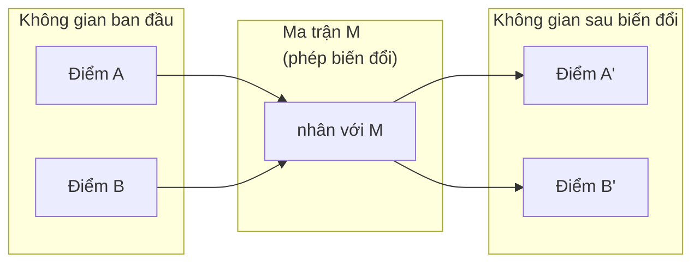
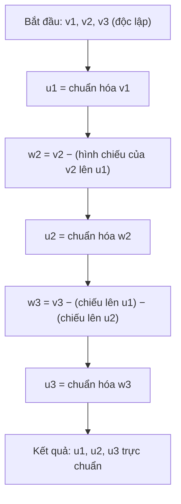
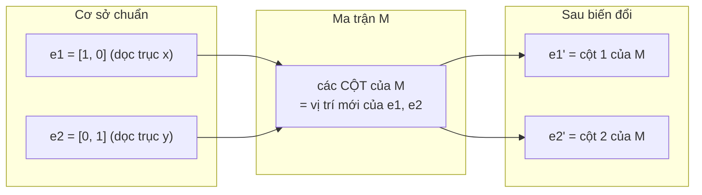
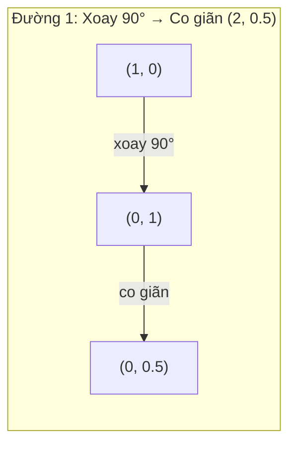
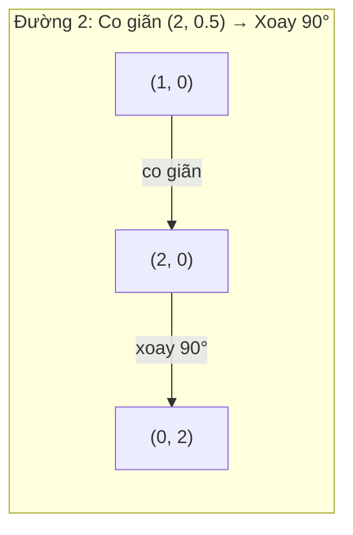
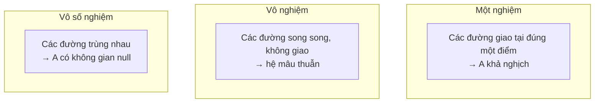
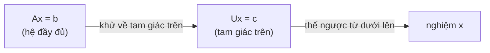
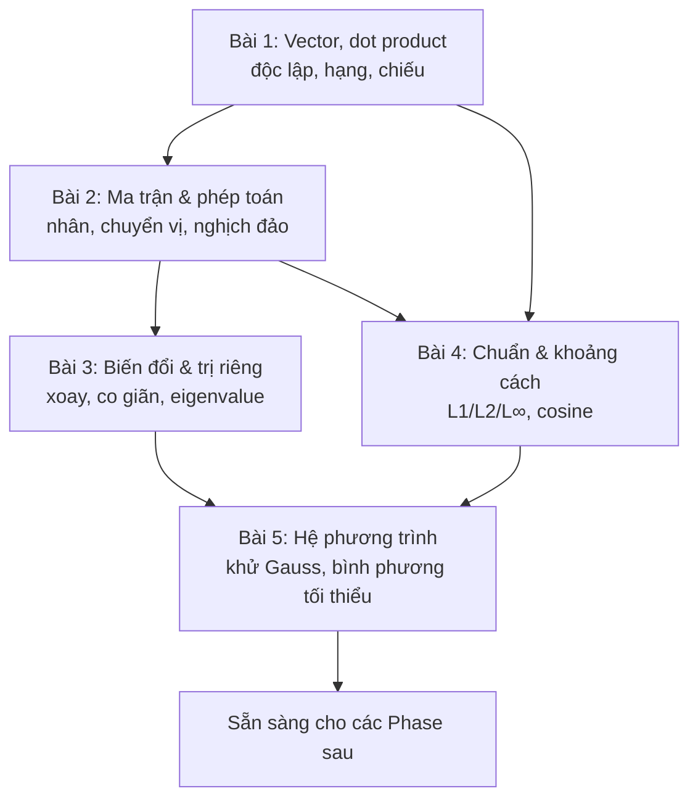

# Module A — Đại số tuyến tính cốt lõi (Tiếng Việt)

> Mọi mô hình AI, khi bóc hết lớp vỏ, chỉ là phép toán trên vector và ma trận. Module này dạy bạn *nhìn thấy* điều đó — bằng hình học, bằng ví dụ số tính tay, và bằng code viết từ đầu.

**Trình độ:** Người mới bắt đầu (beginner) — không cần biết trước đại số tuyến tính.
**Thời lượng ước tính:** ~5 giờ cho cả 5 bài.
**Ngôn ngữ code:** Python (kèm NumPy khi cần).

Tài liệu này biên soạn lại và mở rộng từ 5 bài học gốc trong `phases/01-math-foundations`:

| Bài | Chủ đề                          | Bài gốc                          |
| --- | ------------------------------- | -------------------------------- |
| 1   | Trực giác đại số tuyến tính     | `01-linear-algebra-intuition`    |
| 2   | Vector, ma trận & các phép toán | `02-vectors-matrices-operations` |
| 3   | Biến đổi ma trận & trị riêng    | `03-matrix-transformations`      |
| 4   | Chuẩn (norm) & khoảng cách      | `14-norms-and-distances`         |
| 5   | Hệ phương trình tuyến tính      | `17-linear-systems`              |

**Cách học hiệu quả:** Đọc phần lý thuyết → tự tính lại ví dụ số bằng giấy bút → gõ lại code và chạy thử → làm bài tập *trước khi* xem lời giải. Toán học không phải môn thể thao xem người khác chơi.

---

## Mục lục

- [Trước khi bắt đầu — Ký hiệu & quy ước](#truoc-khi-bat-dau)
- [Bài 1 — Trực giác đại số tuyến tính](#bai-1)
- [Bài 2 — Vector, ma trận & các phép toán](#bai-2)
- [Bài 3 — Biến đổi ma trận & trị riêng](#bai-3)
- [Bài 4 — Chuẩn (norm) & khoảng cách](#bai-4)
- [Bài 5 — Hệ phương trình tuyến tính](#bai-5)
- [Tổng kết Module A](#tong-ket)

---

<a name="truoc-khi-bat-dau"></a>

## Trước khi bắt đầu — Ký hiệu & quy ước

Nếu bạn lâu rồi không đụng đến toán, những ký hiệu dưới đây sẽ xuất hiện xuyên suốt. Đọc lướt một lượt, rồi quay lại tra khi cần.

### Các ký hiệu cơ bản

| Ký hiệu                | Đọc là            | Nghĩa                                                                        |
| ---------------------- | ----------------- | ---------------------------------------------------------------------------- |
| $v$, $\mathbf{v}$      | "vector v"        | Một vector (danh sách số). Sách thường in đậm; ở đây ta viết thường cho gọn. |
| $A$, $M$               | "ma trận A"       | Một ma trận (bảng số hình chữ nhật).                                         |
| $v_1, v_2, \dots, v_n$ | "v một, v hai..." | Các thành phần (phần tử) của vector. Chỉ số dưới = vị trí.                   |
| $A_{ij}$               | "A i j"           | Phần tử ở **hàng i, cột j** của ma trận A.                                   |
| $\sum_{i=1}^{n} x_i$   | "tổng sigma"      | Cộng dồn: $x_1 + x_2 + \dots + x_n$. $\Sigma$ chỉ là "cộng tất cả lại".      |
| $\|v\|$                | "chuẩn của v"     | Độ dài (magnitude) của vector v.                                             |
| $a \cdot b$            | "a chấm b"        | Tích vô hướng (dot product) của hai vector.                                  |
| $A^T$                  | "A chuyển vị"     | Ma trận chuyển vị — lật hàng thành cột.                                      |
| $A^{-1}$               | "A nghịch đảo"    | Ma trận nghịch đảo — phép biến đổi ngược.                                    |
| $\theta$               | "theta"           | Thường ký hiệu một góc.                                                      |
| $\lambda$              | "lambda"          | Thường ký hiệu trị riêng (eigenvalue) hoặc hệ số điều chuẩn.                 |
| $\approx$              | "xấp xỉ"          | Gần bằng (do làm tròn).                                                      |

### Ba quy ước quan trọng

**1. Đếm từ đâu?** Trong toán, ta thường đếm từ 1 ($v_1$ là phần tử đầu). Trong code Python, ta đếm từ 0 (`v[0]` là phần tử đầu). Tài liệu này dùng cả hai — chú ý ngữ cảnh: công thức toán đếm từ 1, code đếm từ 0.

**2. Vector là cột hay hàng?** Theo mặc định trong AI/ML, vector được coi là **vector cột** (viết dọc). Điều này quan trọng khi nhân với ma trận. Khi viết ngang `[3, 4]` cho gọn, hãy ngầm hiểu đó là một cột.

**3. "Chiều" (dimension) nghĩa là gì?** Một vector có $n$ số thì nó "sống" trong không gian $n$ chiều. Vector `[3, 4]` là 2 chiều (một điểm trên mặt phẳng). Một embedding từ (word embedding) có thể là 768 chiều — ta không vẽ ra được, nhưng toán học vẫn hoạt động y hệt.

> **💡 Mẹo cho người mới:** Đừng cố "hình dung" không gian 768 chiều. Không ai làm được. Bí quyết là: hiểu thật kỹ trong 2D và 3D (vẽ được), rồi *tin tưởng* rằng công thức mở rộng lên chiều cao hơn theo đúng quy luật. Máy tính không quan tâm có bao nhiêu chiều — nó chỉ cộng và nhân.

---

# Bài 1 — Trực giác đại số tuyến tính

> Mọi mô hình AI chỉ là phép toán ma trận đội một chiếc mũ hào nhoáng.

**Thời lượng:** ~45 phút · **Yêu cầu trước:** Không có.

## Mục tiêu

Sau bài này bạn sẽ:

- Hiểu vector là gì về mặt **hình học** (không chỉ là "danh sách số").
- Biết tích vô hướng (dot product) đo **độ tương đồng** như thế nào — nền tảng của tìm kiếm ngữ nghĩa và RAG.
- Hiểu "độc lập tuyến tính", "hạng (rank)", "cơ sở (basis)" bằng ngôn ngữ đời thường.
- Biết phép chiếu (projection) và quy trình Gram-Schmidt làm gì.
- Nối được từng khái niệm với ứng dụng AI thực tế (embeddings, attention, LoRA).

## Vấn đề đặt ra

Mở bất kỳ bài báo AI nào ra. Chỉ trong trang đầu, bạn sẽ thấy vector, ma trận, tích vô hướng, phép biến đổi. Nếu không có trực giác đại số tuyến tính, đó chỉ là những ký hiệu vô nghĩa. Có nó, bạn sẽ *nhìn thấy* mạng nơ-ron thực chất đang làm gì: **di chuyển các điểm trong không gian**.

Bạn không cần trở thành nhà toán học. Bạn cần thấy các phép toán này *nghĩa là gì* về mặt hình học, rồi tự tay code lại chúng.

## Khái niệm

### Vector là điểm (và cũng là hướng)

Một vector chỉ là một danh sách số. Nhưng những con số đó *có nghĩa* — chúng là tọa độ trong không gian.

Vector `[3, 2]` trỏ từ gốc tọa độ $(0, 0)$ đến điểm $(3, 2)$ trên mặt phẳng.

<svg viewBox="0 0 320 260" xmlns="http://www.w3.org/2000/svg" style="max-width:100%;height:auto" role="img" aria-label="Vector [3,2] trên mặt phẳng tọa độ">
  <defs>
    <marker id="arrow1" markerWidth="10" markerHeight="10" refX="8" refY="3" orient="auto">
      <path d="M0,0 L8,3 L0,6 Z" fill="currentColor"/>
    </marker>
  </defs>
  <g stroke="currentColor" stroke-width="1" opacity="0.25">
    <line x1="40" y1="30" x2="40" y2="220"/>
    <line x1="40" y1="220" x2="300" y2="220"/>
    <line x1="100" y1="30" x2="100" y2="220"/>
    <line x1="160" y1="30" x2="160" y2="220"/>
    <line x1="220" y1="30" x2="220" y2="220"/>
    <line x1="280" y1="30" x2="280" y2="220"/>
    <line x1="40" y1="160" x2="300" y2="160"/>
    <line x1="40" y1="100" x2="300" y2="100"/>
    <line x1="40" y1="40" x2="300" y2="40"/>
  </g>
  <line x1="40" y1="220" x2="280" y2="100" stroke="#e8590c" stroke-width="2.5" marker-end="url(#arrow1)"/>
  <circle cx="280" cy="100" r="4" fill="#e8590c"/>
  <text x="286" y="96" font-size="13" fill="currentColor">(3, 2)</text>
  <text x="44" y="234" font-size="11" fill="currentColor" opacity="0.7">gốc (0,0)</text>
  <text x="150" y="150" font-size="12" fill="#e8590c">độ dài √13 ≈ 3.6</text>
</svg>

Độ dài (magnitude) của vector này tính bằng định lý Pythagoras:

$$\|[3, 2]\| = \sqrt{3^2 + 2^2} = \sqrt{13} \approx 3.6$$

Trong AI, vector biểu diễn **mọi thứ**:

- Một từ → vector 768 số (chính là "nghĩa" của nó trong không gian embedding).
- Một tấm ảnh → vector hàng triệu giá trị pixel.
- Một người dùng → vector các sở thích.

> **💡 Trực giác cốt lõi:** Khi bạn nghe "AI hiểu ngôn ngữ", điều thực sự xảy ra là: mỗi từ được biến thành một điểm trong không gian nhiều chiều, và những từ có nghĩa gần nhau thì nằm gần nhau. "vua" và "hoàng đế" ở cạnh nhau; "vua" và "cà rốt" ở xa. Tất cả chỉ là hình học.

### Ma trận là phép biến đổi

Một ma trận biến đổi một vector thành vector khác. Nó có thể xoay, co giãn, kéo méo, hoặc chiếu.



Trong AI, ma trận **chính là mô hình**:

- Trọng số (weights) của mạng nơ-ron → những ma trận biến đổi đầu vào thành đầu ra.
- Điểm attention → ma trận quyết định "chú ý" vào đâu.
- Embeddings → ma trận ánh xạ từ ngữ sang vector.

### Tích vô hướng đo độ tương đồng

Tích vô hướng (dot product) của hai vector cho biết chúng *giống nhau* đến mức nào.

$$a \cdot b = a_1 b_1 + a_2 b_2 + \dots + a_n b_n$$

Nghĩa là: nhân từng cặp thành phần tương ứng, rồi cộng tất cả lại.

| Trường hợp  | Dấu             | Ý nghĩa         |
| ----------- | --------------- | --------------- |
| Cùng hướng  | $a \cdot b > 0$ | Giống nhau      |
| Vuông góc   | $a \cdot b = 0$ | Không liên quan |
| Ngược hướng | $a \cdot b < 0$ | Trái ngược      |

**Ví dụ số nhỏ (tính tay):** với $a = [1, 2]$ và $b = [3, 1]$:

$$a \cdot b = (1)(3) + (2)(1) = 3 + 2 = 5 > 0$$

Số dương → hai vector này khá "cùng hướng".

Đây **chính xác** là cách máy tìm kiếm, hệ gợi ý, và RAG hoạt động — tìm những vector có tích vô hướng cao.

> **⚠️ Sai lầm thường gặp:** Đừng nhầm tích vô hướng với độ dài. Tích vô hướng cho ra *một số* (đo quan hệ giữa hai vector). Độ dài cũng cho ra một số nhưng chỉ liên quan đến *một* vector. Lưu ý: $a \cdot a = \|a\|^2$ (tích vô hướng của một vector với chính nó = bình phương độ dài của nó).

### Độc lập tuyến tính

Một tập vector gọi là **độc lập tuyến tính** nếu không vector nào trong tập có thể viết được như tổ hợp (cộng và nhân hệ số) của các vector còn lại.

Hãy nghĩ đơn giản: nếu ba vector độc lập, chúng "phủ" được cả không gian 3 chiều. Nếu một vector là tổ hợp của hai vector kia, thì thực ra chúng chỉ nằm trên một mặt phẳng — bạn có ba vector nhưng chỉ có hai "hướng tự do".

**Ví dụ cụ thể:**

```
v1 = [1, 0, 0]
v2 = [0, 1, 0]
v3 = [2, 1, 0]   ← chú ý: v3 = 2·v1 + 1·v2
```

$v_1$ và $v_2$ độc lập với nhau. Nhưng $v_3 = 2v_1 + v_2$, nên tập $\{v_1, v_2, v_3\}$ là **phụ thuộc**. Cả ba đều nằm trong mặt phẳng xy. Dù bạn kết hợp thế nào, không bao giờ chạm tới điểm $[0, 0, 1]$.

**Tại sao AI quan tâm?** Trong một bộ dữ liệu: nếu `đặc_trưng_3 = 2·đặc_trưng_1 + đặc_trưng_2`, thì thêm đặc trưng 3 cho mô hình *không thông tin gì mới*. Tệ hơn, nó khiến mô hình hồi quy không có nghiệm duy nhất (hiện tượng đa cộng tuyến — multicollinearity).

### Cơ sở (basis) và hạng (rank)

**Cơ sở** là một tập tối thiểu các vector độc lập tuyến tính "phủ" được toàn bộ không gian. Số vector trong cơ sở = số chiều của không gian.

Cơ sở chuẩn của không gian 3D là $\{[1,0,0], [0,1,0], [0,0,1]\}$ — chính là ba trục x, y, z. Nhưng *bất kỳ* ba vector độc lập nào cũng tạo thành một cơ sở hợp lệ. Chọn cơ sở = chọn hệ tọa độ.

**Hạng (rank)** của một ma trận = số cột độc lập tuyến tính = số hàng độc lập tuyến tính.

| Tình huống                  | Hạng        | Ý nghĩa cho ML                                                                   |
| --------------------------- | ----------- | -------------------------------------------------------------------------------- |
| Đủ hạng (full rank)         | Tối đa      | Mô hình có nghiệm duy nhất, ổn định.                                             |
| Thiếu hạng (rank deficient) | Dưới tối đa | Đặc trưng thừa. Vô số nghiệm. Cần điều chuẩn (regularization).                   |
| Hạng 1                      | 1           | Mọi cột đều là bản sao co giãn của một vector. Dữ liệu nằm trên một đường thẳng. |

> **⚠️ Sai lầm thường gặp:** Hạng **không** phải lúc nào cũng bằng số cột. Một ma trận $3 \times 3$ có thể có hạng 2 nếu một cột là tổ hợp của hai cột kia. "Số cột" là *kích thước*; "hạng" là *số chiều thực sự* mà các cột phủ được.

### Phép chiếu (projection)

Chiếu vector $a$ lên vector $b$ cho ta thành phần của $a$ nằm *theo hướng* của $b$:

$$\text{proj}_b(a) = \frac{a \cdot b}{b \cdot b} \, b$$

Phần còn lại $(a - \text{proj}_b(a))$ vuông góc với $b$. Cách "tách" này là nền tảng của phương pháp bình phương tối thiểu (least-squares).

<svg viewBox="0 0 340 220" xmlns="http://www.w3.org/2000/svg" style="max-width:100%;height:auto" role="img" aria-label="Phép chiếu vector a lên vector b">
  <defs>
    <marker id="arrow2" markerWidth="10" markerHeight="10" refX="8" refY="3" orient="auto">
      <path d="M0,0 L8,3 L0,6 Z" fill="currentColor"/>
    </marker>
    <marker id="arrowB" markerWidth="10" markerHeight="10" refX="8" refY="3" orient="auto">
      <path d="M0,0 L8,3 L0,6 Z" fill="#1971c2"/>
    </marker>
    <marker id="arrowA" markerWidth="10" markerHeight="10" refX="8" refY="3" orient="auto">
      <path d="M0,0 L8,3 L0,6 Z" fill="#e8590c"/>
    </marker>
  </defs>
  <line x1="40" y1="180" x2="300" y2="180" stroke="#1971c2" stroke-width="2.5" marker-end="url(#arrowB)"/>
  <text x="270" y="172" font-size="13" fill="#1971c2">b</text>
  <line x1="40" y1="180" x2="200" y2="60" stroke="#e8590c" stroke-width="2.5" marker-end="url(#arrowA)"/>
  <text x="150" y="90" font-size="13" fill="#e8590c">a</text>
  <line x1="200" y1="60" x2="200" y2="180" stroke="currentColor" stroke-width="1.5" stroke-dasharray="4 3" opacity="0.7"/>
  <text x="205" y="120" font-size="11" fill="currentColor" opacity="0.8">phần dư<br/>(vuông góc)</text>
  <line x1="40" y1="180" x2="200" y2="180" stroke="#2f9e44" stroke-width="4"/>
  <text x="90" y="200" font-size="12" fill="#2f9e44">proj_b(a) — bóng của a trên b</text>
  <rect x="190" y="170" width="10" height="10" fill="none" stroke="currentColor" opacity="0.6"/>
</svg>

**Ví dụ số:** $a = [3, 4]$, $b = [1, 0]$:

$$\text{proj}_b(a) = \frac{(3)(1) + (4)(0)}{(1)(1) + (0)(0)} \, [1, 0] = 3 \cdot [1, 0] = [3, 0]$$

Phép chiếu bỏ đi thành phần y. Đây là *giảm chiều dữ liệu ở dạng đơn giản nhất* — vứt bỏ những hướng bạn không quan tâm.

Phép chiếu có mặt khắp nơi trong ML:

- Hồi quy tuyến tính = chiếu quan sát lên không gian cột (nghiệm *chính là* một phép chiếu).
- PCA chiếu dữ liệu lên hướng có phương sai lớn nhất.
- Attention trong transformer tính phép chiếu của query lên key.

### Quy trình Gram-Schmidt

Đây là cách biến *bất kỳ* tập vector độc lập nào thành một **cơ sở trực chuẩn** (orthonormal) — nghĩa là mọi vector có độ dài 1 và đôi một vuông góc.



Ý tưởng từng bước:

1. Lấy vector đầu, chuẩn hóa (chia cho độ dài để được độ dài 1).
2. Lấy vector thứ hai, **trừ đi** phần chiếu lên vector đầu (để nó vuông góc), rồi chuẩn hóa.
3. Lấy vector thứ ba, trừ đi phần chiếu lên *cả hai* vector trước, rồi chuẩn hóa.
4. Lặp lại.

Đây chính là cách phân rã QR hoạt động bên trong — dùng trong giải hệ phương trình, tính trị riêng, và hồi quy bình phương tối thiểu.

## Bắt tay vào code

### Bước 1: Lớp Vector từ đầu

```python
class Vector:
    def __init__(self, components):
        self.components = list(components)
        self.dim = len(self.components)

    def __add__(self, other):
        return Vector([a + b for a, b in zip(self.components, other.components)])

    def __sub__(self, other):
        return Vector([a - b for a, b in zip(self.components, other.components)])

    def dot(self, other):
        # Tích vô hướng: nhân từng cặp rồi cộng lại
        return sum(a * b for a, b in zip(self.components, other.components))

    def magnitude(self):
        # Độ dài = căn bậc hai của (tích vô hướng với chính nó)
        return sum(x**2 for x in self.components) ** 0.5

    def normalize(self):
        # Chia cho độ dài để được vector độ dài 1
        mag = self.magnitude()
        return Vector([x / mag for x in self.components])

    def cosine_similarity(self, other):
        # Độ tương đồng cosine = dot chia cho tích hai độ dài
        return self.dot(other) / (self.magnitude() * other.magnitude())

    def __repr__(self):
        return f"Vector({self.components})"


a = Vector([1, 2, 3])
b = Vector([4, 5, 6])

print(f"a + b = {a + b}")
print(f"a · b = {a.dot(b)}")               # 32
print(f"|a| = {a.magnitude():.4f}")         # 3.7417
print(f"cosine = {a.cosine_similarity(b):.4f}")  # 0.9746
```

### Bước 2: Phép chiếu và Gram-Schmidt từ đầu

```python
def project(a, b):
    """Chiếu vector a lên vector b."""
    scalar = a.dot(b) / b.dot(b)
    return Vector([scalar * x for x in b.components])


def gram_schmidt(vectors):
    """Biến tập vector độc lập thành cơ sở trực chuẩn."""
    orthonormal = []
    for v in vectors:
        w = v
        for u in orthonormal:          # trừ đi hình chiếu lên mọi vector đã có
            w = w - project(w, u)
        if w.magnitude() < 1e-10:      # bỏ qua nếu phụ thuộc tuyến tính
            continue
        orthonormal.append(w.normalize())
    return orthonormal


v1 = Vector([1, 0, 0])
v2 = Vector([1, 1, 0])
v3 = Vector([1, 1, 1])
basis = gram_schmidt([v1, v2, v3])

for i, u in enumerate(basis):
    print(f"u{i+1} = {u},  |u{i+1}| = {u.magnitude():.4f}")

# Kiểm tra vuông góc: mọi cặp phải có dot ≈ 0
print(f"u1 · u2 = {basis[0].dot(basis[1]):.6f}")  # ≈ 0
```

### Bước 3: Cùng phép toán đó với NumPy (dùng thực tế)

```python
import numpy as np

a = np.array([1, 2, 3], dtype=float)
b = np.array([4, 5, 6], dtype=float)

print(f"a · b = {np.dot(a, b)}")
print(f"|a| = {np.linalg.norm(a):.4f}")
print(f"cosine = {np.dot(a, b) / (np.linalg.norm(a) * np.linalg.norm(b)):.4f}")

# Hạng của ma trận
A = np.array([[1, 2], [2, 4]])          # cột 2 = 2·cột 1 → thiếu hạng
print(f"Hạng: {np.linalg.matrix_rank(A)}")   # 1, không phải 2!

# Phân rã QR (Gram-Schmidt được tối ưu hóa)
Q, R = np.linalg.qr(np.random.randn(3, 3))
print(f"Q trực giao: {np.allclose(Q @ Q.T, np.eye(3))}")  # True
```

> **💡 Tại sao code "từ đầu" rồi lại dùng NumPy?** Viết từ đầu để *hiểu* cái gì đang xảy ra. Dùng NumPy để *làm việc thực tế* — nó nhanh hơn 100 lần vì viết bằng C/Fortran tối ưu. Bạn cần cả hai: hiểu bản chất, rồi dùng công cụ mạnh.

## Kết nối với AI thực tế

| Khái niệm          | Xuất hiện ở đâu trong AI hiện đại                             |
| ------------------ | ------------------------------------------------------------- |
| Tích vô hướng      | Điểm attention trong transformer; cosine similarity trong RAG |
| Nhân ma trận       | Mọi tầng của mọi mạng nơ-ron                                  |
| Độc lập tuyến tính | Chọn đặc trưng, tránh đa cộng tuyến                           |
| Hạng (rank)        | LoRA (Low-Rank Adaptation) để tinh chỉnh LLM                  |
| Phép chiếu         | Hồi quy tuyến tính, PCA                                       |
| Gram-Schmidt / QR  | Bộ giải số, khởi tạo trọng số trực giao                       |

**LoRA đáng nói riêng.** Nó tinh chỉnh các mô hình ngôn ngữ lớn bằng cách phân rã cập nhật trọng số thành các ma trận *hạng thấp*. Thay vì cập nhật ma trận $4096 \times 4096$ (16 triệu tham số), LoRA cập nhật hai ma trận $4096 \times 16$ và $16 \times 4096$ (chỉ 131 nghìn tham số). Ràng buộc "hạng 16" giả định rằng cập nhật trọng số nằm trong một không gian con 16 chiều của không gian 4096 chiều đầy đủ. Đó là đại số tuyến tính làm việc thật.

## Bài tập — Bài 1

> Làm hết trước khi xem lời giải bên dưới. Tự tính tay các bài "Cơ bản" bằng giấy bút.

**Bài 1.1 (Cơ bản).** Tính tích vô hướng và độ tương đồng cosine của $a = [2, 0]$ và $b = [0, 5]$. Hai vector này có quan hệ gì?

**Bài 1.2 (Cơ bản).** Chiếu vector $[1, 2, 3]$ lên $[1, 1, 1]$. Kết quả biểu diễn điều gì về mặt hình học?

**Bài 1.3 (Trung bình).** Cho $v_1 = [1, 0, 0]$, $v_2 = [0, 1, 0]$, $v_3 = [3, 4, 0]$. Tập này có độc lập tuyến tính không? Nếu không, viết $v_3$ như tổ hợp của các vector kia. Ba vector này phủ được không gian mấy chiều?

**Bài 1.4 (Trung bình — code).** Viết hàm `angle_between(a, b)` trả về góc (theo độ) giữa hai vector, dùng công thức $\cos\theta = \frac{a \cdot b}{\|a\|\|b\|}$. Kiểm tra: góc giữa $[1, 0]$ và $[0, 1]$ phải là 90°.

**Bài 1.5 (Ứng dụng AI).** Cho 4 "vector từ" giả lập 3 chiều:
`mèo=[0.9, 0.1, 0.0]`, `chó=[0.8, 0.2, 0.1]`, `xe=[0.0, 0.1, 0.9]`, `tàu=[0.1, 0.0, 0.8]`.
Dùng cosine similarity, tìm cặp từ *giống nhau nhất* và cặp *khác nhau nhất*. Kết quả có hợp lý về mặt ngữ nghĩa không?

---

### Lời giải — Bài 1

**Giải 1.1.**

Tích vô hướng: $a \cdot b = (2)(0) + (0)(5) = 0$.

Vì tích vô hướng bằng 0, hai vector **vuông góc** (trực giao). Cosine similarity $= \frac{0}{2 \times 5} = 0$, xác nhận điều đó (cosine của góc 90° = 0). Về mặt hình học: $a$ nằm trên trục x, $b$ nằm trên trục y — chúng vuông góc nhau. Trong ngữ cảnh AI, hai vector đặc trưng vuông góc nghĩa là chúng "không liên quan" — biết cái này không cho thông tin gì về cái kia.

**Giải 1.2.**

Áp dụng công thức $\text{proj}_b(a) = \frac{a \cdot b}{b \cdot b} b$ với $a = [1,2,3]$, $b = [1,1,1]$:

- Tử số: $a \cdot b = (1)(1) + (2)(1) + (3)(1) = 6$.
- Mẫu số: $b \cdot b = 1 + 1 + 1 = 3$.
- Hệ số: $6 / 3 = 2$.
- Kết quả: $2 \cdot [1, 1, 1] = [2, 2, 2]$.

**Ý nghĩa hình học:** $[2, 2, 2]$ là điểm trên đường thẳng theo hướng $[1,1,1]$ (đường chéo chính) gần với $[1,2,3]$ nhất. Chú ý $2$ chính là **trung bình cộng** của $1, 2, 3$ — chiếu lên vector "toàn số 1" luôn cho ra trung bình. Đây là lý do phép chiếu liên hệ chặt với thống kê.

**Giải 1.3.**

Kiểm tra: liệu $v_3 = [3,4,0]$ có viết được như $\alpha v_1 + \beta v_2$ không?
$\alpha[1,0,0] + \beta[0,1,0] = [\alpha, \beta, 0]$. Đặt bằng $[3,4,0]$ → $\alpha = 3$, $\beta = 4$. Khớp!

Vậy $v_3 = 3v_1 + 4v_2$ → tập **phụ thuộc tuyến tính** (không độc lập).

Cả ba vector đều có thành phần z bằng 0, nên chúng nằm trong mặt phẳng xy. Chúng chỉ phủ được **2 chiều** (mặt phẳng), không phải 3. Hạng của ma trận tạo bởi ba vector này là 2.

**Giải 1.4.**

```python
import math

def angle_between(a, b):
    dot = sum(x * y for x, y in zip(a, b))
    mag_a = sum(x**2 for x in a) ** 0.5
    mag_b = sum(x**2 for x in b) ** 0.5
    cos_theta = dot / (mag_a * mag_b)
    # Kẹp giá trị vào [-1, 1] để tránh lỗi làm tròn khiến acos báo lỗi
    cos_theta = max(-1.0, min(1.0, cos_theta))
    return math.degrees(math.acos(cos_theta))

print(angle_between([1, 0], [0, 1]))   # 90.0
print(angle_between([1, 0], [1, 1]))   # 45.0
print(angle_between([1, 0], [-1, 0]))  # 180.0
```

Chi tiết quan trọng: dòng `max(-1.0, min(1.0, ...))`. Do sai số làm tròn dấu phẩy động, `cos_theta` đôi khi ra $1.0000000002$, khiến `math.acos` báo lỗi. Kẹp giá trị lại là mẹo phòng thủ chuẩn.

**Giải 1.5.**

```python
import numpy as np

words = {
    "mèo":  np.array([0.9, 0.1, 0.0]),
    "chó":  np.array([0.8, 0.2, 0.1]),
    "xe":   np.array([0.0, 0.1, 0.9]),
    "tàu":  np.array([0.1, 0.0, 0.8]),
}

def cos_sim(a, b):
    return np.dot(a, b) / (np.linalg.norm(a) * np.linalg.norm(b))

names = list(words)
for i in range(len(names)):
    for j in range(i + 1, len(names)):
        s = cos_sim(words[names[i]], words[names[j]])
        print(f"{names[i]:4} vs {names[j]:4}: {s:.3f}")
```

Kết quả (xấp xỉ):

```
mèo  vs chó : 0.976   ← giống nhau nhất (cả hai là động vật)
mèo  vs xe  : 0.083
mèo  vs tàu : 0.135
chó  vs xe  : 0.213
chó  vs tàu : 0.163
xe   vs tàu : 0.988   ← giống nhau nhất (cả hai là phương tiện)
```

Cặp giống nhau nhất: **mèo–chó** (0.976) và **xe–tàu** (0.988). Cặp khác nhau nhất: **mèo–xe** (0.083).

Rất hợp lý về ngữ nghĩa: động vật gom nhóm với động vật, phương tiện gom nhóm với phương tiện. Đây chính xác là điều xảy ra với embedding thật, chỉ khác là số chiều lớn hơn nhiều (768, 1536...) và các con số do mô hình học ra chứ không phải ta bịa.

## Thuật ngữ Anh–Việt — Bài 1

| Tiếng Anh           | Tiếng Việt               | Nghĩa ngắn gọn                                     |
| ------------------- | ------------------------ | -------------------------------------------------- |
| Vector              | Vector                   | Danh sách số = điểm/hướng trong không gian n chiều |
| Dot product         | Tích vô hướng            | Nhân từng cặp rồi cộng; đo độ tương đồng           |
| Magnitude / Norm    | Độ dài / Chuẩn           | "Kích thước" của vector                            |
| Cosine similarity   | Độ tương đồng cosine     | Đo góc giữa hai vector, bỏ qua độ dài              |
| Linear independence | Độc lập tuyến tính       | Không vector nào là tổ hợp của các vector khác     |
| Rank                | Hạng                     | Số chiều thực sự mà các cột/hàng phủ được          |
| Basis               | Cơ sở                    | Tập tối thiểu vector độc lập phủ toàn không gian   |
| Projection          | Phép chiếu               | "Bóng" của vector này lên vector kia               |
| Orthonormal         | Trực chuẩn               | Vuông góc đôi một và mỗi vector có độ dài 1        |
| Embedding           | Embedding (vector nhúng) | Vector biểu diễn ý nghĩa của từ/ảnh/người dùng     |

---

<a name="bai-2"></a>

# Bài 2 — Vector, ma trận & các phép toán

> Mọi mạng nơ-ron chỉ là phép nhân ma trận với vài bước phụ.

**Thời lượng:** ~75 phút · **Yêu cầu trước:** Bài 1.

## Mục tiêu

- Xây một lớp `Matrix` với: cộng, nhân theo phần tử, nhân ma trận, chuyển vị, định thức, nghịch đảo.
- Phân biệt **nhân theo phần tử** với **nhân ma trận** — và biết khi nào dùng cái nào.
- Tự tay dựng một tầng mạng nơ-ron dày đặc (`relu(W @ x + b)`) chỉ bằng lớp Matrix viết từ đầu.
- Hiểu quy tắc broadcasting và cách cộng bias hoạt động trong các framework.

## Vấn đề đặt ra

Bạn muốn xây một mạng nơ-ron. Bạn đọc code và thấy dòng này:

```
output = activation(weights @ input + bias)
```

Dấu `@` đó là **nhân ma trận**. `weights` là một ma trận. `input` là một vector. Nếu không biết các phép toán này làm gì, dòng lệnh trên là phép thuật. Nếu biết, nó chính là *toàn bộ quá trình lan truyền tiến* (forward pass) của một tầng — gói gọn trong ba phép toán.

Mọi tấm ảnh mô hình xử lý là một ma trận giá trị pixel. Mọi word embedding là một vector. Mọi tầng của mọi mạng nơ-ron là một phép biến đổi ma trận. Bạn không thể xây hệ thống AI mà không thành thạo phép toán ma trận, giống như không thể lập trình mà không hiểu biến.

## Khái niệm

### Ma trận là lưới số

Một ma trận là lưới 2 chiều gồm hàng và cột. Ma trận cỡ $m \times n$ có $m$ hàng và $n$ cột.

$$A = \begin{bmatrix} 1 & 2 & 3 \\ 4 & 5 & 6 \end{bmatrix} \quad \text{(ma trận } 2 \times 3\text{: 2 hàng, 3 cột)}$$

Trong mạng nơ-ron, ma trận trọng số biến vector đầu vào thành vector đầu ra. Một tầng có 784 đầu vào và 128 đầu ra dùng ma trận trọng số cỡ $128 \times 784$.

### Tại sao "hình dạng" (shape) lại quan trọng

Nhân ma trận có một quy tắc nghiêm ngặt: $(m \times n) @ (n \times p) = (m \times p)$. **Hai chiều bên trong phải khớp nhau.**

```
(128 × 784) @ (784 × 1) = (128 × 1)
  trọng số     đầu vào      đầu ra

Chiều bên trong: 784 = 784  → hợp lệ ✓
```

<svg viewBox="0 0 380 130" xmlns="http://www.w3.org/2000/svg" style="max-width:100%;height:auto" role="img" aria-label="Quy tắc khớp chiều khi nhân ma trận">
  <rect x="30" y="45" width="70" height="45" fill="none" stroke="#1971c2" stroke-width="2"/>
  <text x="65" y="72" font-size="13" fill="#1971c2" text-anchor="middle">128×784</text>
  <text x="115" y="72" font-size="18" fill="currentColor" text-anchor="middle">@</text>
  <rect x="130" y="45" width="70" height="45" fill="none" stroke="#e8590c" stroke-width="2"/>
  <text x="165" y="72" font-size="13" fill="#e8590c" text-anchor="middle">784×1</text>
  <text x="215" y="72" font-size="18" fill="currentColor" text-anchor="middle">=</text>
  <rect x="230" y="45" width="70" height="45" fill="none" stroke="#2f9e44" stroke-width="2"/>
  <text x="265" y="72" font-size="13" fill="#2f9e44" text-anchor="middle">128×1</text>
  <path d="M 95 100 Q 115 118 135 100" fill="none" stroke="#d6336c" stroke-width="1.5"/>
  <text x="115" y="122" font-size="11" fill="#d6336c" text-anchor="middle">784 = 784 phải khớp</text>
  <text x="65" y="35" font-size="10" fill="currentColor" opacity="0.7" text-anchor="middle">↑ ra</text>
  <text x="265" y="35" font-size="10" fill="currentColor" opacity="0.7" text-anchor="middle">↑ ra</text>
</svg>

> **⚠️ Sai lầm thường gặp:** Lỗi "shape mismatch" trong PyTorch/NumPy gần như luôn là do hai chiều bên trong không khớp. Khi gặp lỗi, hãy in `A.shape` và `B.shape` ra, rồi kiểm tra: chiều *cuối* của A có bằng chiều *đầu* của B không?

### Bản đồ các phép toán

| Phép toán      | Làm gì                 | Dùng trong mạng nơ-ron           |
| -------------- | ---------------------- | -------------------------------- |
| Cộng           | Cộng theo từng phần tử | Cộng bias vào đầu ra             |
| Nhân vô hướng  | Co giãn mọi phần tử    | learning_rate × gradient         |
| Nhân ma trận   | Biến đổi vector        | Forward pass của một tầng        |
| Chuyển vị      | Lật hàng ↔ cột         | Lan truyền ngược (backprop)      |
| Định thức      | Tóm tắt bằng một số    | Kiểm tra khả nghịch              |
| Nghịch đảo     | Đảo ngược biến đổi     | Giải hệ phương trình             |
| Ma trận đơn vị | Ma trận "không làm gì" | Khởi tạo, kết nối tắt (residual) |

### Nhân theo phần tử ≠ Nhân ma trận

Đây là chỗ người mới nhầm lẫn liên tục.

**Nhân theo phần tử (element-wise):** nhân các vị trí tương ứng. Hai ma trận phải **cùng hình dạng**.

$$\begin{bmatrix} 1 & 2 \\ 3 & 4 \end{bmatrix} * \begin{bmatrix} 5 & 6 \\ 7 & 8 \end{bmatrix} = \begin{bmatrix} 5 & 12 \\ 21 & 32 \end{bmatrix}$$

**Nhân ma trận (matrix multiply):** tích vô hướng giữa hàng và cột. Chiều bên trong phải khớp.

$$\begin{bmatrix} 1 & 2 \\ 3 & 4 \end{bmatrix} @ \begin{bmatrix} 5 & 6 \\ 7 & 8 \end{bmatrix} = \begin{bmatrix} 1{\cdot}5{+}2{\cdot}7 & 1{\cdot}6{+}2{\cdot}8 \\ 3{\cdot}5{+}4{\cdot}7 & 3{\cdot}6{+}4{\cdot}8 \end{bmatrix} = \begin{bmatrix} 19 & 22 \\ 43 & 50 \end{bmatrix}$$

Phép toán khác nhau, kết quả khác nhau, quy tắc khác nhau. Hãy xem cách tính phần tử góc trên-trái của nhân ma trận:

<svg viewBox="0 0 400 150" xmlns="http://www.w3.org/2000/svg" style="max-width:100%;height:auto" role="img" aria-label="Cách nhân hàng với cột">
  <text x="20" y="30" font-size="12" fill="currentColor">Hàng 1 của A:</text>
  <rect x="120" y="18" width="30" height="24" fill="#1971c2" opacity="0.25" stroke="#1971c2"/>
  <text x="135" y="35" font-size="13" text-anchor="middle" fill="currentColor">1</text>
  <rect x="150" y="18" width="30" height="24" fill="#1971c2" opacity="0.25" stroke="#1971c2"/>
  <text x="165" y="35" font-size="13" text-anchor="middle" fill="currentColor">2</text>
  <text x="20" y="75" font-size="12" fill="currentColor">Cột 1 của B:</text>
  <rect x="120" y="63" width="30" height="24" fill="#e8590c" opacity="0.25" stroke="#e8590c"/>
  <text x="135" y="80" font-size="13" text-anchor="middle" fill="currentColor">5</text>
  <rect x="150" y="63" width="30" height="24" fill="#e8590c" opacity="0.25" stroke="#e8590c"/>
  <text x="165" y="80" font-size="13" text-anchor="middle" fill="currentColor">7</text>
  <text x="20" y="120" font-size="13" fill="#2f9e44">Kết quả[1,1] = 1×5 + 2×7 = 5 + 14 = 19</text>
</svg>

### Broadcasting (tự động khớp hình dạng)

Khi bạn cộng một vector bias vào ma trận đầu ra, hình dạng không khớp. Broadcasting "kéo giãn" mảng nhỏ hơn cho vừa.

$$\begin{bmatrix} 1 & 2 & 3 \\ 4 & 5 & 6 \end{bmatrix} + \begin{bmatrix} 10 & 20 & 30 \end{bmatrix} = \begin{bmatrix} 11 & 22 & 33 \\ 14 & 25 & 36 \end{bmatrix}$$

Vector bias được lặp lại xuống từng hàng một cách tự động. Mọi framework hiện đại làm điều này. Hiểu nó giúp bạn không hoảng khi "hình dạng có vẻ sai nhưng code vẫn chạy".

## Bắt tay vào code

### Bước 1: Lớp Matrix với các phép toán cốt lõi

```python
class Matrix:
    def __init__(self, data):
        self.data = [list(row) for row in data]
        self.rows = len(self.data)
        self.cols = len(self.data[0])
        self.shape = (self.rows, self.cols)

    def __repr__(self):
        rows_str = "\n  ".join(str(row) for row in self.data)
        return f"Matrix{self.shape}:\n  {rows_str}"

    def __add__(self, other):
        return Matrix([
            [self.data[i][j] + other.data[i][j] for j in range(self.cols)]
            for i in range(self.rows)
        ])

    def element_wise_multiply(self, other):
        # Nhân TỪNG VỊ TRÍ (cùng hình dạng)
        return Matrix([
            [self.data[i][j] * other.data[i][j] for j in range(self.cols)]
            for i in range(self.rows)
        ])

    def matmul(self, other):
        # Nhân MA TRẬN: tích vô hướng hàng × cột
        return Matrix([
            [
                sum(self.data[i][k] * other.data[k][j] for k in range(self.cols))
                for j in range(other.cols)
            ]
            for i in range(self.rows)
        ])

    def transpose(self):
        # Lật hàng thành cột
        return Matrix([
            [self.data[j][i] for j in range(self.rows)]
            for i in range(self.cols)
        ])

    def determinant(self):
        # Chỉ minh họa cho 1×1 và 2×2; cỡ lớn hơn dùng khai triển đệ quy
        if self.shape == (1, 1):
            return self.data[0][0]
        if self.shape == (2, 2):
            return self.data[0][0]*self.data[1][1] - self.data[0][1]*self.data[1][0]
        det = 0
        for j in range(self.cols):
            minor = Matrix([
                [self.data[i][k] for k in range(self.cols) if k != j]
                for i in range(1, self.rows)
            ])
            det += ((-1) ** j) * self.data[0][j] * minor.determinant()
        return det

    def inverse_2x2(self):
        det = self.determinant()
        if det == 0:
            raise ValueError("Ma trận suy biến, không có nghịch đảo")
        return Matrix([
            [ self.data[1][1] / det, -self.data[0][1] / det],
            [-self.data[1][0] / det,  self.data[0][0] / det]
        ])

    @staticmethod
    def identity(n):
        return Matrix([[1 if i == j else 0 for j in range(n)] for i in range(n)])
```

### Bước 2: Xem nó chạy

```python
A = Matrix([[1, 2], [3, 4]])
B = Matrix([[5, 6], [7, 8]])

print("A @ B =", A.matmul(B).data)      # [[19, 22], [43, 50]]
print("A^T   =", A.transpose().data)    # [[1, 3], [2, 4]]
print("det(A)=", A.determinant())       # -2
print("A^-1  =", A.inverse_2x2().data)  # [[-2.0, 1.0], [1.5, -0.5]]

I = Matrix.identity(2)
# Nhân A với nghịch đảo của nó phải ra ma trận đơn vị
print("A @ A^-1 =", A.matmul(A.inverse_2x2()).data)  # ≈ [[1, 0], [0, 1]]
```

### Bước 3: Nối với mạng nơ-ron — một tầng dày đặc

```python
import random

inputs = Matrix([[0.5], [0.8], [0.2]])   # vector đầu vào 3 chiều (dạng cột)
weights = Matrix([
    [random.uniform(-1, 1) for _ in range(3)]
    for _ in range(2)
])                                        # ma trận trọng số 2×3
bias = Matrix([[0.1], [0.1]])

def relu_matrix(m):
    # ReLU: giữ số dương, đưa số âm về 0
    return Matrix([[max(0, val) for val in row] for row in m.data])

pre_activation = weights.matmul(inputs) + bias   # W @ x + b
output = relu_matrix(pre_activation)             # relu(...)

print(f"Đầu vào:  {inputs.shape}")   # (3, 1)
print(f"Trọng số: {weights.shape}")  # (2, 3)
print(f"Đầu ra:   {output.shape}")   # (2, 1)
```

Đây là **một tầng dày đặc (dense layer)**: `output = relu(W @ x + b)`. Mọi tầng dày đặc trong mọi mạng nơ-ron làm chính xác điều này. Xếp chồng nhiều tầng như vậy lại, thêm cách học trọng số, và bạn có mạng học sâu.

### Bước 4: NumPy làm mọi thứ trên nhanh hơn 100 lần

```python
import numpy as np

A = np.array([[1, 2], [3, 4]])
B = np.array([[5, 6], [7, 8]])

print("A * B (theo phần tử):\n", A * B)   # [[5, 12], [21, 32]]
print("A @ B (nhân ma trận):\n", A @ B)   # [[19, 22], [43, 50]]
print("A^T:\n", A.T)
print("det(A) =", np.linalg.det(A))
print("A^-1:\n", np.linalg.inv(A))

# Một tầng mạng nơ-ron, kiểu thực tế
inputs  = np.random.randn(3, 1)
weights = np.random.randn(2, 3)
bias    = np.array([[0.1], [0.1]])
output  = np.maximum(0, weights @ inputs + bias)   # relu(W@x + b)
print("Tầng:", weights.shape, "@", inputs.shape, "=", output.shape)

# Broadcasting: bias 1 chiều tự động lặp xuống mọi hàng
matrix = np.array([[1, 2, 3], [4, 5, 6]])
bias1d = np.array([10, 20, 30])
print(matrix + bias1d)   # [[11, 22, 33], [14, 25, 36]]
```

> **💡 Chú ý quan trọng:** Trong NumPy, `*` là nhân **theo phần tử**, còn `@` là nhân **ma trận**. Đây là nguồn lỗi kinh điển của người mới. `A * B` và `A @ B` cho kết quả hoàn toàn khác nhau. Ghi nhớ: dấu sao = từng phần tử, dấu a-còng = ma trận.

## Kết nối với AI thực tế

Lớp `Matrix` bạn vừa xây là nền tảng cho mini-framework mạng nơ-ron được dựng ở **Phase 3, Bài 10**. Toàn bộ học sâu chỉ là:

1. Xếp chồng các tầng `relu(W @ x + b)`.
2. Dùng chuyển vị (`transpose`) khi lan truyền ngược để tính gradient.
3. Cập nhật `W` bằng `W = W - learning_rate * gradient` (nhân vô hướng + trừ ma trận).

Ba phép toán trong bài này lặp lại hàng tỉ lần khi huấn luyện một mô hình.

## Bài tập — Bài 2

**Bài 2.1 (Cơ bản).** Tính bằng tay cả hai: $A * B$ (theo phần tử) và $A @ B$ (nhân ma trận) với
$A = \begin{bmatrix} 2 & 0 \\ 1 & 3 \end{bmatrix}$, $B = \begin{bmatrix} 1 & 4 \\ 2 & 1 \end{bmatrix}$.

**Bài 2.2 (Cơ bản).** Tính định thức của $\begin{bmatrix} 3 & 2 \\ 6 & 4 \end{bmatrix}$. Ma trận này có nghịch đảo không? Vì sao?

**Bài 2.3 (Trung bình).** Kiểm tra nghịch đảo: chọn $A = \begin{bmatrix} 4 & 3 \\ 6 & 3 \end{bmatrix}$, tính $A^{-1}$ bằng công thức 2×2, rồi xác minh $A @ A^{-1}$ ra ma trận đơn vị. Điều gì xảy ra nếu định thức bằng 0?

**Bài 2.4 (Trung bình — shape).** Bạn có `x` cỡ $(5, 1)$ và muốn qua hai tầng: tầng 1 có 8 nơ-ron, tầng 2 có 3 nơ-ron. Ma trận trọng số $W_1$ và $W_2$ phải có hình dạng gì để `W2 @ (W1 @ x)` chạy được? Đầu ra cuối cỡ bao nhiêu?

**Bài 2.5 (Ứng dụng AI — code).** Chỉ dùng lớp `Matrix` viết từ đầu (không NumPy), dựng mạng hai tầng: đầu vào (3) → ẩn (4) → ra (2). Khởi tạo trọng số ngẫu nhiên, chạy một forward pass với ReLU, và in hình dạng ở mỗi bước để xác minh tất cả khớp.

---

### Lời giải — Bài 2

**Giải 2.1.**

*Nhân theo phần tử* (nhân từng ô cùng vị trí):
$$A * B = \begin{bmatrix} 2{\cdot}1 & 0{\cdot}4 \\ 1{\cdot}2 & 3{\cdot}1 \end{bmatrix} = \begin{bmatrix} 2 & 0 \\ 2 & 3 \end{bmatrix}$$

*Nhân ma trận* (hàng × cột):

- Ô [1,1]: $(2)(1) + (0)(2) = 2$
- Ô [1,2]: $(2)(4) + (0)(1) = 8$
- Ô [2,1]: $(1)(1) + (3)(2) = 7$
- Ô [2,2]: $(1)(4) + (3)(1) = 7$

$$A @ B = \begin{bmatrix} 2 & 8 \\ 7 & 7 \end{bmatrix}$$

Hai kết quả hoàn toàn khác nhau — đó là lý do phải phân biệt rõ hai phép toán.

**Giải 2.2.**

$\det = (3)(4) - (2)(6) = 12 - 12 = 0$.

Định thức bằng 0 → ma trận **suy biến (singular)** → **không có nghịch đảo**. Nhìn kỹ: hàng 2 $= 2 \times$ hàng 1, nên hai hàng phụ thuộc tuyến tính. Về hình học, phép biến đổi này "đè bẹp" mặt phẳng xuống một đường thẳng, và không có cách nào "bung" lại — thông tin đã mất.

**Giải 2.3.**

$\det(A) = (4)(3) - (3)(6) = 12 - 18 = -6$.

Công thức nghịch đảo 2×2: $A^{-1} = \frac{1}{\det}\begin{bmatrix} d & -b \\ -c & a \end{bmatrix}$ với $A = \begin{bmatrix} a & b \\ c & d \end{bmatrix}$.

$$A^{-1} = \frac{1}{-6}\begin{bmatrix} 3 & -3 \\ -6 & 4 \end{bmatrix} = \begin{bmatrix} -0.5 & 0.5 \\ 1 & -0.667 \end{bmatrix}$$

Kiểm tra $A @ A^{-1}$:

- Ô [1,1]: $(4)(-0.5) + (3)(1) = -2 + 3 = 1$ ✓
- Ô [1,2]: $(4)(0.5) + (3)(-0.667) = 2 - 2 = 0$ ✓
- Ô [2,1]: $(6)(-0.5) + (3)(1) = -3 + 3 = 0$ ✓
- Ô [2,2]: $(6)(0.5) + (3)(-0.667) = 3 - 2 = 1$ ✓

Ra ma trận đơn vị $\begin{bmatrix} 1 & 0 \\ 0 & 1 \end{bmatrix}$. Nếu định thức bằng 0, ta phải chia cho 0 → không tính được → không tồn tại nghịch đảo (đúng như Bài 2.2).

**Giải 2.4.**

Nhớ quy tắc: để `W @ x` chạy được với `x` cỡ $(5, 1)$, $W_1$ phải có 5 cột. Tầng 1 có 8 nơ-ron → 8 hàng. Vậy:

- $W_1$ cỡ $(8, 5)$ → $W_1 @ x$ cho ra $(8, 1)$.
- $W_2$ nhận đầu vào $(8, 1)$ nên phải có 8 cột; tầng 2 có 3 nơ-ron → 3 hàng. Vậy $W_2$ cỡ $(3, 8)$.
- $W_2 @ (W_1 @ x)$: $(3, 8) @ (8, 1) = (3, 1)$.

**Đầu ra cuối cỡ $(3, 1)$** — đúng bằng số nơ-ron của tầng cuối. Quy tắc tổng quát: ma trận trọng số của một tầng có cỡ (số_nơ-ron_ra × số_đầu_vào).

**Giải 2.5.**

```python
import random
random.seed(0)

# (dùng lại lớp Matrix và relu_matrix ở phần "Bắt tay vào code")

def random_matrix(rows, cols):
    return Matrix([[random.uniform(-0.5, 0.5) for _ in range(cols)]
                   for _ in range(rows)])

x  = Matrix([[0.5], [0.8], [0.2]])   # (3, 1)
W1 = random_matrix(4, 3)             # tầng ẩn: 4 nơ-ron, 3 đầu vào
b1 = random_matrix(4, 1)
W2 = random_matrix(2, 4)             # tầng ra: 2 nơ-ron, 4 đầu vào
b2 = random_matrix(2, 1)

print(f"đầu vào x:      {x.shape}")            # (3, 1)

h = relu_matrix(W1.matmul(x) + b1)             # tầng ẩn
print(f"sau tầng ẩn:    {h.shape}")            # (4, 1)

y = W2.matmul(h) + b2                          # tầng ra (không kích hoạt)
print(f"đầu ra y:       {y.shape}")            # (2, 1)
print(f"giá trị đầu ra: {y.data}")
```

Điểm mấu chốt: hình dạng phải "ăn khớp" qua từng tầng — $(3,1) \to (4,1) \to (2,1)$. Nếu bạn đặt sai cỡ ma trận trọng số, `matmul` sẽ báo lỗi ngay. Đây chính là cách kiểm tra kiến trúc mạng trước khi huấn luyện.

## Thuật ngữ Anh–Việt — Bài 2

| Tiếng Anh             | Tiếng Việt            | Nghĩa ngắn gọn                                           |
| --------------------- | --------------------- | -------------------------------------------------------- |
| Matrix                | Ma trận               | Lưới số 2 chiều = một phép biến đổi tuyến tính           |
| Shape                 | Hình dạng             | Cỡ (số hàng, số cột) của ma trận                         |
| Matrix multiplication | Nhân ma trận          | Tích vô hướng hàng × cột; thứ tự quan trọng              |
| Element-wise          | Theo phần tử          | Nhân/cộng từng vị trí tương ứng                          |
| Transpose             | Chuyển vị             | Lật hàng thành cột ($m{\times}n \to n{\times}m$)         |
| Determinant           | Định thức             | Một số đo mức co giãn diện tích; bằng 0 = suy biến       |
| Inverse               | Nghịch đảo            | Ma trận đảo ngược phép biến đổi; chỉ tồn tại khi det ≠ 0 |
| Identity matrix       | Ma trận đơn vị        | Ma trận "nhân với 1"; đường chéo toàn 1                  |
| Broadcasting          | Quảng bá / tự khớp cỡ | Kéo giãn mảng nhỏ cho vừa mảng lớn                       |
| Dense layer           | Tầng dày đặc          | Tầng `relu(W @ x + b)` — đơn vị cơ bản của mạng nơ-ron   |
| Bias                  | Độ chệch / bias       | Vector cộng thêm sau khi nhân trọng số                   |

---

<a name="bai-3"></a>

# Bài 3 — Biến đổi ma trận & trị riêng

> Ma trận là một cỗ máy nhào nặn không gian. Hiểu nó làm gì với *mỗi điểm*, bạn hiểu cả phép biến đổi.

**Thời lượng:** ~75 phút · **Yêu cầu trước:** Bài 1, Bài 2.

## Mục tiêu

- Dựng ma trận xoay, co giãn, kéo méo, phản chiếu và áp dụng lên điểm 2D/3D.
- Ghép nhiều phép biến đổi bằng nhân ma trận, và hiểu vì sao *thứ tự quan trọng*.
- Tính trị riêng (eigenvalue) và vector riêng (eigenvector) của ma trận 2×2 từ phương trình đặc trưng.
- Hiểu vì sao trị riêng quyết định hướng của PCA, độ ổn định của RNN, và hành vi của phân cụm phổ.

## Vấn đề đặt ra

Bạn đọc về PCA và thấy "tìm vector riêng của ma trận hiệp phương sai". Bạn đọc về độ ổn định mô hình và thấy "kiểm tra xem mọi trị riêng có độ lớn nhỏ hơn 1 không". Bạn đọc về tăng cường dữ liệu và thấy "áp dụng phép xoay ngẫu nhiên". Không câu nào có nghĩa cho đến khi bạn hiểu ma trận làm gì với không gian *về mặt hình học*.

Ma trận không chỉ là lưới số. Chúng là **cỗ máy không gian**. Ma trận xoay thì quay điểm. Ma trận co giãn thì kéo dãn. Ma trận kéo méo thì nghiêng. Mọi phép biến đổi mà mạng nơ-ron áp lên dữ liệu đều là một trong những phép này, hoặc là tổ hợp của chúng.

## Khái niệm

### Phép biến đổi = ma trận

Mọi phép biến đổi tuyến tính trong 2D đều viết được thành một ma trận $2 \times 2$. Ma trận cho biết chính xác hai vector cơ sở $[1, 0]$ và $[0, 1]$ đi về đâu. Mọi thứ khác suy ra từ đó.



> **💡 Trực giác vàng:** Muốn biết một ma trận làm gì? Chỉ cần xem **các cột của nó**. Cột 1 cho biết trục x đi về đâu, cột 2 cho biết trục y đi về đâu. Đó là toàn bộ bí mật.

### Ma trận xoay (rotation)

Xoay 2D một góc $\theta$ giữ nguyên khoảng cách và góc. Mọi điểm di chuyển theo cung tròn.

$$R(\theta) = \begin{bmatrix} \cos\theta & -\sin\theta \\ \sin\theta & \cos\theta \end{bmatrix}$$

<svg viewBox="0 0 300 210" xmlns="http://www.w3.org/2000/svg" style="max-width:100%;height:auto" role="img" aria-label="Xoay điểm 45 độ">
  <defs>
    <marker id="a3a" markerWidth="9" markerHeight="9" refX="7" refY="3" orient="auto"><path d="M0,0 L7,3 L0,6 Z" fill="#1971c2"/></marker>
    <marker id="a3b" markerWidth="9" markerHeight="9" refX="7" refY="3" orient="auto"><path d="M0,0 L7,3 L0,6 Z" fill="#e8590c"/></marker>
  </defs>
  <line x1="30" y1="180" x2="280" y2="180" stroke="currentColor" opacity="0.3"/>
  <line x1="30" y1="180" x2="30" y2="20" stroke="currentColor" opacity="0.3"/>
  <path d="M 130 180 A 100 100 0 0 0 100 110" fill="none" stroke="currentColor" stroke-dasharray="3 3" opacity="0.5"/>
  <line x1="30" y1="180" x2="130" y2="180" stroke="#1971c2" stroke-width="2.5" marker-end="url(#a3a)"/>
  <text x="135" y="185" font-size="12" fill="#1971c2">gốc (1,0)</text>
  <line x1="30" y1="180" x2="101" y2="109" stroke="#e8590c" stroke-width="2.5" marker-end="url(#a3b)"/>
  <text x="95" y="100" font-size="12" fill="#e8590c">sau xoay 45°</text>
  <text x="70" y="165" font-size="11" fill="currentColor" opacity="0.7">θ=45°</text>
</svg>

Định thức của ma trận xoay **luôn bằng 1** — xoay không làm thay đổi diện tích.

### Ma trận co giãn (scaling)

Co giãn kéo/nén dọc theo mỗi trục một cách độc lập.

$$S = \begin{bmatrix} s_x & 0 \\ 0 & s_y \end{bmatrix}$$

Ví dụ $S = \begin{bmatrix} 2 & 0 \\ 0 & 0.5 \end{bmatrix}$ biến điểm $(2, 1)$ thành $(4, 0.5)$ — kéo x gấp đôi, nén y một nửa. Định thức $= s_x \cdot s_y = 1$ ở đây (diện tích giữ nguyên vì kéo bằng nén).

### Ma trận kéo méo (shearing) và phản chiếu (reflection)

**Kéo méo** nghiêng một trục trong khi giữ trục kia cố định, biến hình chữ nhật thành hình bình hành:

- $Sh_x = \begin{bmatrix} 1 & k \\ 0 & 1 \end{bmatrix}$ dịch x một lượng $k \cdot y$.

**Phản chiếu** lật không gian qua một trục:

- Qua trục y: $\begin{bmatrix} -1 & 0 \\ 0 & 1 \end{bmatrix}$ (biến $(2,1) \to (-2,1)$). Định thức $= -1$ (diện tích giữ nguyên nhưng *đảo hướng*).

### Ghép biến đổi: thứ tự quan trọng

Áp dụng phép $A$ *rồi* phép $B$ tương đương nhân ma trận: `kết_quả = B @ A @ điểm`. Chú ý $B$ đứng *trước* dù áp dụng *sau*.

**Thứ tự quan trọng** — xoay rồi co giãn khác co giãn rồi xoay:





Kết quả khác nhau: $(0, 0.5)$ so với $(0, 2)$. **Nhân ma trận không giao hoán** — $AB \neq BA$ nói chung.

> **⚠️ Sai lầm thường gặp:** `B @ A` nghĩa là "áp dụng A *trước*, rồi B". Đọc từ phải sang trái, như hàm hợp $f(g(x))$ — $g$ chạy trước. Rất nhiều người ghép sai thứ tự và không hiểu vì sao ảnh bị biến dạng khác dự kiến.

### Trị riêng và vector riêng — trái tim của bài này

Hầu hết vector *đổi hướng* khi bị ma trận tác động. **Vector riêng** thì đặc biệt: ma trận chỉ *co giãn* nó, không bao giờ xoay. Hệ số co giãn đó là **trị riêng**.

$$A \, v = \lambda \, v$$

- $v$ là vector riêng (hướng "sống sót", không đổi hướng).
- $\lambda$ (lambda) là trị riêng (mức co giãn theo hướng đó).

**Ví dụ cụ thể:** $A = \begin{bmatrix} 2 & 1 \\ 1 & 2 \end{bmatrix}$

<svg viewBox="0 0 340 200" xmlns="http://www.w3.org/2000/svg" style="max-width:100%;height:auto" role="img" aria-label="Vector riêng không đổi hướng">
  <defs>
    <marker id="ev1" markerWidth="9" markerHeight="9" refX="7" refY="3" orient="auto"><path d="M0,0 L7,3 L0,6 Z" fill="#2f9e44"/></marker>
    <marker id="ev2" markerWidth="9" markerHeight="9" refX="7" refY="3" orient="auto"><path d="M0,0 L7,3 L0,6 Z" fill="#e8590c"/></marker>
  </defs>
  <line x1="30" y1="170" x2="320" y2="170" stroke="currentColor" opacity="0.3"/>
  <line x1="30" y1="170" x2="30" y2="20" stroke="currentColor" opacity="0.3"/>
  <line x1="30" y1="170" x2="90" y2="110" stroke="#2f9e44" stroke-width="2" marker-end="url(#ev1)"/>
  <text x="55" y="105" font-size="11" fill="#2f9e44">v=[1,1]</text>
  <line x1="30" y1="170" x2="210" y2="-10" stroke="#2f9e44" stroke-width="3" stroke-dasharray="5 3" marker-end="url(#ev1)" opacity="0.6"/>
  <text x="150" y="45" font-size="11" fill="#2f9e44">A·v = 3·v (cùng hướng, dài gấp 3)</text>
  <text x="120" y="195" font-size="11" fill="#e8590c">Hướng [1,−1]: A·v = 1·v (không đổi gì)</text>
</svg>

- Vector riêng $[1, 1]$ với trị riêng $3$: $A[1,1] = [3, 3] = 3 \cdot [1,1]$ (cùng hướng, dài gấp 3).
- Vector riêng $[1, -1]$ với trị riêng $1$: $A[1,-1] = [1, -1] = 1 \cdot [1,-1]$ (giữ nguyên).

Ma trận này kéo dãn không gian gấp 3 lần theo hướng $[1,1]$ và giữ nguyên hướng $[1,-1]$. Mọi hướng khác là pha trộn của hai hướng này.

### Tìm trị riêng: phương trình đặc trưng

Với ma trận $2 \times 2$ là $\begin{bmatrix} a & b \\ c & d \end{bmatrix}$, trị riêng là nghiệm của **phương trình đặc trưng**:

$$\lambda^2 - (a + d)\lambda + (ad - bc) = 0$$

Trong đó $(a+d)$ là **vết (trace)** và $(ad - bc)$ là **định thức**. Đây chỉ là phương trình bậc hai quen thuộc — giải bằng công thức nghiệm.

### Vì sao trị riêng quan trọng

**PCA.** Vector riêng của ma trận hiệp phương sai *chính là* các thành phần chính. Trị riêng cho biết mỗi thành phần giữ được bao nhiêu phương sai. Sắp xếp theo trị riêng, giữ top $k$ → bạn có giảm chiều dữ liệu.

**Độ ổn định.** Trong mạng hồi tiếp (RNN) và hệ động lực, trị riêng có độ lớn $> 1$ khiến đầu ra *bùng nổ*; $< 1$ khiến nó *tiêu biến*. Đây chính là bài toán gradient bùng nổ/tiêu biến (exploding/vanishing gradient) gói trong một câu.

**Phương pháp phổ (spectral).** Mạng nơ-ron đồ thị dùng trị riêng của ma trận kề. Phân cụm phổ dùng trị riêng của ma trận Laplace. Vector riêng tiết lộ cấu trúc của đồ thị.

### Định thức = hệ số co giãn diện tích

Định thức của ma trận biến đổi cho biết nó co giãn diện tích (2D) hay thể tích (3D) bao nhiêu lần:

| Định thức | Ý nghĩa                                              |
| --------- | ---------------------------------------------------- |
| $= 1$     | Giữ nguyên diện tích (xoay)                          |
| $= 2$     | Diện tích tăng gấp đôi                               |
| $= 0$     | Không gian bị đè bẹp xuống chiều thấp hơn (suy biến) |
| $= -1$    | Giữ diện tích nhưng đảo hướng (phản chiếu)           |

## Bắt tay vào code

### Bước 1: Các ma trận biến đổi từ đầu

```python
import math

def rotation_2d(theta):
    c, s = math.cos(theta), math.sin(theta)
    return [[c, -s], [s, c]]

def scaling_2d(sx, sy):
    return [[sx, 0], [0, sy]]

def shearing_2d(kx, ky):
    return [[1, kx], [ky, 1]]

def reflection_y():   # phản chiếu qua trục y
    return [[-1, 0], [0, 1]]

def mat_vec_mul(M, v):
    return [sum(M[i][j] * v[j] for j in range(len(v))) for i in range(len(M))]

def mat_mul(A, B):
    return [[sum(A[i][k] * B[k][j] for k in range(len(A[0])))
             for j in range(len(B[0]))] for i in range(len(A))]

# Xoay điểm (1,0) đi 45 độ
r = mat_vec_mul(rotation_2d(math.pi / 4), [1.0, 0.0])
print(f"Xoay 45°: ({r[0]:.3f}, {r[1]:.3f})")   # (0.707, 0.707)
```

### Bước 2: Ghép biến đổi — chứng minh thứ tự quan trọng

```python
R = rotation_2d(math.pi / 2)   # xoay 90°
S = scaling_2d(2, 0.5)

rotate_then_scale = mat_mul(S, R)   # áp R trước, S sau  → S @ R
scale_then_rotate = mat_mul(R, S)   # áp S trước, R sau  → R @ S

p = [1.0, 0.0]
print("Xoay rồi co giãn:", mat_vec_mul(rotate_then_scale, p))  # [0.0, 0.5]
print("Co giãn rồi xoay:", mat_vec_mul(scale_then_rotate, p))  # [0.0, 2.0]
```

### Bước 3: Trị riêng từ đầu (2×2)

```python
def eigenvalues_2x2(M):
    a, b = M[0]
    c, d = M[1]
    trace = a + d
    det = a * d - b * c
    disc = trace**2 - 4 * det          # biệt thức của phương trình đặc trưng
    if disc < 0:                        # trị riêng phức (ma trận xoay)
        real, imag = trace / 2, (-disc)**0.5 / 2
        return complex(real, imag), complex(real, -imag)
    root = disc**0.5
    return (trace + root) / 2, (trace - root) / 2

def eigenvector_2x2(M, eigenvalue):
    a, b = M[0]
    c, d = M[1]
    if abs(b) > 1e-10:
        v = [b, eigenvalue - a]
    elif abs(c) > 1e-10:
        v = [eigenvalue - d, c]
    else:
        v = [1, 0] if abs(a - eigenvalue) < 1e-10 else [0, 1]
    mag = (v[0]**2 + v[1]**2)**0.5
    return [v[0] / mag, v[1] / mag]

A = [[2, 1], [1, 2]]
vals = eigenvalues_2x2(A)
print(f"Trị riêng: {vals[0]:.1f}, {vals[1]:.1f}")   # 3.0, 1.0

for val in vals:
    vec = eigenvector_2x2(A, val)
    Av = mat_vec_mul(A, vec)
    lv = [val * vec[0], val * vec[1]]
    print(f"  λ={val:.1f}: A·v={[round(x,3) for x in Av]}, λ·v={[round(x,3) for x in lv]}")
    # Hai vế phải bằng nhau → xác nhận đúng là vector riêng
```

### Bước 4: NumPy — dùng thực tế

```python
import numpy as np

A = np.array([[2, 1], [1, 2]], dtype=float)
eigenvalues, eigenvectors = np.linalg.eig(A)
print("Trị riêng:", eigenvalues)             # [3. 1.]
print("Vector riêng (theo cột):\n", eigenvectors)

# Định thức = hệ số co giãn diện tích
theta = np.pi / 4
R = np.array([[np.cos(theta), -np.sin(theta)], [np.sin(theta), np.cos(theta)]])
print("det(xoay) =", round(np.linalg.det(R), 4))   # 1.0
print("det(co giãn 2,3) =", np.linalg.det(np.diag([2.0, 3.0])))  # 6.0
```

## Kết nối với AI thực tế

Đoạn code tính trị riêng/vector riêng ở đây *chính là* thuật toán đằng sau:

- **PCA & giảm chiều** — tìm hướng phương sai lớn nhất.
- **Phân cụm phổ** — dùng vector riêng của ma trận Laplace để chia nhóm.
- **Phân tích ổn định** — kiểm tra trị riêng của ma trận trọng số RNN để phát hiện gradient bùng nổ.

Khi bạn gọi `PCA(n_components=2).fit(X)` trong scikit-learn, bên trong nó tính trị riêng của ma trận hiệp phương sai — đúng thuật toán bạn vừa viết tay.

## Bài tập — Bài 3

**Bài 3.1 (Cơ bản).** Áp ma trận xoay 90° $\begin{bmatrix} 0 & -1 \\ 1 & 0 \end{bmatrix}$ lên bốn góc của hình vuông đơn vị: $(0,0), (1,0), (1,1), (0,1)$. Hình vuông sau khi xoay nằm ở đâu?

**Bài 3.2 (Trung bình — tính tay).** Tìm trị riêng của $\begin{bmatrix} 4 & 2 \\ 1 & 3 \end{bmatrix}$ bằng phương trình đặc trưng. Trình bày từng bước.

**Bài 3.3 (Trung bình).** Ma trận $\begin{bmatrix} 1 & 2 \\ 2 & 4 \end{bmatrix}$ có định thức bằng bao nhiêu? Nó biến hình vuông đơn vị thành hình gì? Trị riêng nhỏ hơn của nó là bao nhiêu và điều đó liên hệ ra sao với định thức?

**Bài 3.4 (Ứng dụng AI).** Trong một RNN, ma trận trọng số hồi tiếp có trị riêng lớn nhất (về độ lớn) là $1.5$. Sau 20 bước thời gian, một tín hiệu ban đầu độ lớn 1 dọc theo vector riêng đó sẽ có độ lớn khoảng bao nhiêu? Điều này minh họa vấn đề gì?

**Bài 3.5 (Ứng dụng AI — code).** Ghép ba phép biến đổi (xoay 30°, co giãn $[1.5, 0.8]$, kéo méo $k_x=0.3$) và áp lên 8 điểm nằm trên một đường tròn. In tọa độ trước/sau. Tính định thức của ma trận ghép và xác minh nó bằng tích các định thức riêng lẻ.

---

### Lời giải — Bài 3

**Giải 3.1.**

Ma trận xoay 90° biến $[x, y] \to [-y, x]$. Áp lên từng góc:

- $(0,0) \to (0, 0)$ — gốc tọa độ đứng yên.
- $(1,0) \to (0, 1)$
- $(1,1) \to (-1, 1)$
- $(0,1) \to (-1, 0)$

Hình vuông vẫn là hình vuông đơn vị, nhưng đã xoay 90° ngược chiều kim đồng hồ — giờ nằm ở góc phần tư thứ hai (phía trên-trái). Khoảng cách giữa các góc giữ nguyên (xoay bảo toàn khoảng cách), khớp với định thức $= 1$.

**Giải 3.2.**

Với $\begin{bmatrix} 4 & 2 \\ 1 & 3 \end{bmatrix}$: $a=4, b=2, c=1, d=3$.

- Vết: $a + d = 4 + 3 = 7$.
- Định thức: $ad - bc = (4)(3) - (2)(1) = 12 - 2 = 10$.
- Phương trình đặc trưng: $\lambda^2 - 7\lambda + 10 = 0$.
- Phân tích: $(\lambda - 5)(\lambda - 2) = 0$.
- Nghiệm: $\lambda_1 = 5$, $\lambda_2 = 2$.

Kiểm tra chéo: tổng trị riêng $= 5 + 2 = 7 =$ vết ✓; tích trị riêng $= 5 \times 2 = 10 =$ định thức ✓. Hai đẳng thức này luôn đúng và là cách kiểm tra nhanh rất tiện.

**Giải 3.3.**

$\det = (1)(4) - (2)(2) = 4 - 4 = 0$.

Định thức bằng 0 → ma trận suy biến → nó **đè bẹp** hình vuông đơn vị xuống một *đoạn thẳng* (diện tích 0). Nhìn kỹ: cột 2 $= 2 \times$ cột 1, nên mọi điểm bị chiếu lên đường thẳng theo hướng $[1, 2]$.

Trị riêng: vết $= 1 + 4 = 5$, định thức $= 0$. Phương trình: $\lambda^2 - 5\lambda + 0 = 0 \Rightarrow \lambda(\lambda - 5) = 0$, cho $\lambda = 0$ và $\lambda = 5$. Trị riêng nhỏ hơn là **0**. Điều này liên hệ trực tiếp với định thức: định thức = tích các trị riêng, mà có một trị riêng bằng 0 nên tích bằng 0. Trị riêng 0 nghĩa là có một hướng bị nén hoàn toàn về gốc — chính là hướng bị "đè bẹp".

**Giải 3.4.**

Mỗi bước thời gian, tín hiệu dọc theo vector riêng bị nhân với trị riêng $1.5$. Sau 20 bước: $1.5^{20}$.

$$1.5^{20} \approx 3325$$

Tín hiệu ban đầu độ lớn 1 phình lên khoảng **3325** — tăng hơn ba nghìn lần! Đây là **vấn đề gradient bùng nổ (exploding gradient)**: khi trị riêng lớn nhất $> 1$, tín hiệu (và gradient khi lan truyền ngược) tăng theo hàm mũ qua các bước thời gian, khiến việc huấn luyện mất ổn định (giá trị NaN, loss nhảy vọt). Đây là lý do người ta phát minh ra LSTM, GRU, gradient clipping, và khởi tạo trọng số cẩn thận. Ngược lại, nếu trị riêng $< 1$ (ví dụ 0.5), $0.5^{20} \approx 0.000001$ — tín hiệu tiêu biến (vanishing gradient), mạng "quên" thông tin xa.

**Giải 3.5.**

```python
import math
import numpy as np

theta = math.radians(30)
R = np.array([[math.cos(theta), -math.sin(theta)],
              [math.sin(theta),  math.cos(theta)]])
S = np.array([[1.5, 0.0], [0.0, 0.8]])
Sh = np.array([[1.0, 0.3], [0.0, 1.0]])

# Ghép: áp R trước, rồi S, rồi Sh  →  M = Sh @ S @ R
M = Sh @ S @ R

# 8 điểm trên đường tròn đơn vị
angles = np.linspace(0, 2*np.pi, 8, endpoint=False)
points = np.array([[math.cos(a), math.sin(a)] for a in angles])

transformed = (M @ points.T).T
for p, q in zip(points, transformed):
    print(f"({p[0]:+.2f}, {p[1]:+.2f}) -> ({q[0]:+.2f}, {q[1]:+.2f})")

# Xác minh: det(ghép) = tích các det riêng lẻ
det_M = np.linalg.det(M)
det_product = np.linalg.det(R) * np.linalg.det(S) * np.linalg.det(Sh)
print(f"\ndet(M)          = {det_M:.4f}")
print(f"det(R)·det(S)·det(Sh) = {det_product:.4f}")   # phải bằng nhau
```

Kết quả cho thấy `det(M) ≈ 1.2` và bằng tích $\det(R) \cdot \det(S) \cdot \det(Sh) = 1 \times 1.2 \times 1 = 1.2$. Đây là một tính chất tổng quát rất đẹp: **định thức của tích ma trận = tích các định thức**, $\det(AB) = \det(A)\det(B)$. Về hình học: khi ghép nhiều phép biến đổi, hệ số co giãn diện tích tổng = tích các hệ số co giãn. Đường tròn ban đầu bị biến thành một hình elip nghiêng, và diện tích elip đó gấp 1.2 lần đường tròn gốc.

## Thuật ngữ Anh–Việt — Bài 3

| Tiếng Anh               | Tiếng Việt             | Nghĩa ngắn gọn                                  |
| ----------------------- | ---------------------- | ----------------------------------------------- |
| Rotation matrix         | Ma trận xoay           | Xoay điểm theo cung tròn; det = 1               |
| Scaling matrix          | Ma trận co giãn        | Kéo/nén độc lập theo mỗi trục                   |
| Shearing matrix         | Ma trận kéo méo        | Nghiêng một trục; biến chữ nhật thành bình hành |
| Reflection              | Phản chiếu             | Lật không gian qua một trục; det = −1           |
| Composition             | Ghép (biến đổi)        | Nhân ma trận để nối các phép; thứ tự quan trọng |
| Eigenvector             | Vector riêng           | Hướng mà ma trận chỉ co giãn, không xoay        |
| Eigenvalue              | Trị riêng              | Hệ số co giãn dọc theo vector riêng             |
| Characteristic equation | Phương trình đặc trưng | $\det(A - \lambda I) = 0$; nghiệm là trị riêng  |
| Trace                   | Vết                    | Tổng đường chéo = tổng các trị riêng            |
| Determinant             | Định thức              | Hệ số co giãn diện tích = tích các trị riêng    |

---

<a name="bai-4"></a>

# Bài 4 — Chuẩn (norm) & khoảng cách

> Hàm khoảng cách của bạn *định nghĩa* thế nào là "giống nhau". Chọn sai, mọi thứ phía sau sụp đổ.

**Thời lượng:** ~45 phút · **Yêu cầu trước:** Bài 1, Bài 2.

## Mục tiêu

- Cài đặt các khoảng cách L1, L2, L∞, cosine từ đầu.
- Chọn đúng hàm khoảng cách cho một bài toán ML cụ thể và giải thích vì sao lựa chọn khác thất bại.
- Nối chuẩn L1 và L2 với điều chuẩn LASSO và Ridge cùng vùng ràng buộc hình học của chúng.
- Thấy cùng một bộ dữ liệu cho ra hàng xóm gần nhất khác nhau dưới các thước đo khác nhau.

## Vấn đề đặt ra

Bạn có hai vector. Có thể là word embedding, hồ sơ người dùng, hay mảng pixel. Bạn cần biết: chúng *gần nhau* đến mức nào?

Câu trả lời phụ thuộc hoàn toàn vào hàm khoảng cách bạn chọn. Hai điểm có thể là hàng xóm gần nhất dưới thước đo này nhưng lại xa nhau dưới thước đo khác. Bộ phân loại KNN, hệ gợi ý, cơ sở dữ liệu vector, thuật toán phân cụm, hàm mất mát — tất cả đều phụ thuộc vào lựa chọn này. Chọn sai, mô hình tối ưu cho *sai mục tiêu*.

Không có khoảng cách "tốt nhất" cho mọi trường hợp. L2 hợp với dữ liệu không gian. Cosine thống trị NLP. Mỗi thước đo mã hóa một *giả định* khác nhau về "giống nhau" nghĩa là gì.

## Khái niệm

### Chuẩn (norm): đo độ lớn của vector

Một chuẩn đo "kích thước" của vector. Mọi khoảng cách giữa hai vector đều viết được thành chuẩn của hiệu của chúng: $d(a, b) = \|a - b\|$. Nên hiểu chuẩn là hiểu khoảng cách.

### Chuẩn L1 (khoảng cách Manhattan)

Chuẩn L1 cộng trị tuyệt đối của mọi thành phần.

$$\|x\|_1 = |x_1| + |x_2| + \dots + |x_n|$$

Gọi là "khoảng cách Manhattan" vì nó đo quãng đường bạn đi trên lưới ô phố nơi chỉ được đi dọc theo trục — không đi chéo.

$$\text{L1}\big((1,1), (4,5)\big) = |4-1| + |5-1| = 3 + 4 = 7$$

Trên lưới phố, bạn đi 3 ô về đông và 4 ô về bắc.

**Khi nào dùng L1:** dữ liệu thưa nhiều chiều (đặc trưng văn bản, one-hot); khi cần bền vững với ngoại lai (một chênh lệch khổng lồ không lấn át); bài toán chọn đặc trưng (điều chuẩn L1 tạo tính thưa).

### Chuẩn L2 (khoảng cách Euclid)

Chuẩn L2 là khoảng cách đường thẳng — căn bậc hai của tổng bình phương.

$$\|x\|_2 = \sqrt{x_1^2 + x_2^2 + \dots + x_n^2}$$

Đây là khoảng cách bạn học ở hình học phổ thông. Pythagoras trong $n$ chiều.

$$\text{L2}\big((1,1), (4,5)\big) = \sqrt{(4-1)^2 + (5-1)^2} = \sqrt{9 + 16} = \sqrt{25} = 5$$

Đường thẳng, cắt chéo qua lưới.

**Khi nào dùng L2:** dữ liệu liên tục ít-đến-trung chiều; khi các đặc trưng cùng thang đo; khoảng cách vật lý (không gian, cảm biến).

### Chuẩn L∞ (khoảng cách Chebyshev)

Khi $p \to \infty$, chuẩn L$p$ hội tụ về thành phần lớn nhất theo trị tuyệt đối.

$$\|x\|_\infty = \max(|x_1|, |x_2|, \dots, |x_n|)$$

$$\text{L}\infty\big((1,1), (4,5)\big) = \max(|4-1|, |5-1|) = \max(3, 4) = 4$$

Chỉ chiều nào chênh lệch nhiều nhất mới quyết định khoảng cách; mọi chiều khác bị bỏ qua. (Vua trong cờ vua di chuyển theo L∞: một bước theo hướng nào cũng tốn 1.)

### "Quả cầu đơn vị" — cách nhìn hình học đẹp nhất

Tập hợp mọi điểm có khoảng cách 1 tới gốc gọi là "quả cầu đơn vị". Hình dạng của nó *khác nhau* tùy chuẩn — đây là cách trực quan nhất để cảm nhận sự khác biệt:

<svg viewBox="0 0 460 180" xmlns="http://www.w3.org/2000/svg" style="max-width:100%;height:auto" role="img" aria-label="Quả cầu đơn vị của L1, L2, L-vô cực">
  <!-- L1: diamond -->
  <g>
    <line x1="20" y1="90" x2="140" y2="90" stroke="currentColor" opacity="0.25"/>
    <line x1="80" y1="30" x2="80" y2="150" stroke="currentColor" opacity="0.25"/>
    <polygon points="80,40 130,90 80,140 30,90" fill="#1971c2" opacity="0.15" stroke="#1971c2" stroke-width="2"/>
    <text x="80" y="172" font-size="13" fill="#1971c2" text-anchor="middle">L1 — hình thoi</text>
  </g>
  <!-- L2: circle -->
  <g>
    <line x1="170" y1="90" x2="290" y2="90" stroke="currentColor" opacity="0.25"/>
    <line x1="230" y1="30" x2="230" y2="150" stroke="currentColor" opacity="0.25"/>
    <circle cx="230" cy="90" r="50" fill="#2f9e44" opacity="0.15" stroke="#2f9e44" stroke-width="2"/>
    <text x="230" y="172" font-size="13" fill="#2f9e44" text-anchor="middle">L2 — hình tròn</text>
  </g>
  <!-- Linf: square -->
  <g>
    <line x1="320" y1="90" x2="440" y2="90" stroke="currentColor" opacity="0.25"/>
    <line x1="380" y1="30" x2="380" y2="150" stroke="currentColor" opacity="0.25"/>
    <rect x="330" y="40" width="100" height="100" fill="#e8590c" opacity="0.15" stroke="#e8590c" stroke-width="2"/>
    <text x="380" y="172" font-size="13" fill="#e8590c" text-anchor="middle">L∞ — hình vuông</text>
  </g>
</svg>

- **L1** cho hình thoi (góc nhọn nằm trên các trục — chính điều này tạo ra *tính thưa* trong LASSO).
- **L2** cho hình tròn (mượt mọi phía).
- **L∞** cho hình vuông (cạnh phẳng dọc theo trục).

> **💡 Vì sao hình dạng này quan trọng cho AI?** Các góc nhọn của hình thoi L1 nằm ngay trên trục, nơi một số tọa độ *bằng 0*. Khi điều chuẩn kéo nghiệm về phía vùng ràng buộc này, nó có xu hướng "dính" vào các góc → nhiều trọng số bị đẩy về đúng 0 → tự động chọn đặc trưng. Hình tròn L2 không có góc → trọng số nhỏ dần nhưng hiếm khi đúng bằng 0.

### Độ tương đồng cosine — vua của NLP và embeddings

Cosine đo *góc* giữa hai vector, bỏ qua độ lớn của chúng.

$$\cos\_sim(a, b) = \frac{a \cdot b}{\|a\|_2 \, \|b\|_2}$$

Giá trị từ $-1$ (ngược hướng) đến $+1$ (cùng hướng). Vuông góc = 0. Khoảng cách cosine $= 1 - \cos\_sim$.

**Vì sao cosine thống trị NLP:** trong văn bản, độ dài tài liệu không nên ảnh hưởng độ tương đồng. Một bài về mèo dài gấp đôi bài khác cũng về mèo vẫn phải "giống". Cosine bỏ qua độ lớn (độ dài), chỉ quan tâm *hướng*. Hai tài liệu cùng phân bố từ nhưng khác độ dài trỏ cùng hướng → cosine = 1.

> **⚠️ Sai lầm thường gặp:** Đừng nhầm cosine với tích vô hướng thuần. Tích vô hướng $a \cdot b = \|a\|\|b\|\cos\theta$ *có* chứa thông tin độ lớn. Nếu embeddings đã được chuẩn hóa L2 (độ dài = 1), thì tích vô hướng và cosine *bằng nhau*. Nếu chưa, chúng khác nhau — và nhiều cơ sở dữ liệu vector cho bạn chọn giữa hai loại.

### Chọn khoảng cách theo bài toán

| Bài toán                       | Khoảng cách tốt nhất    | Vì sao                                              |
| ------------------------------ | ----------------------- | --------------------------------------------------- |
| Tương đồng văn bản             | Cosine                  | Độ lớn là nhiễu, hướng là ý nghĩa                   |
| So sánh ảnh theo pixel         | L2                      | Quan hệ không gian quan trọng, đặc trưng cùng thang |
| Đặc trưng thưa nhiều chiều     | L1                      | Bền vững, không khuếch đại chênh lệch hiếm          |
| Tìm kiếm embedding (vector DB) | Cosine hoặc dot product | Embedding mã hóa ý nghĩa trong hướng                |
| Gợi ý                          | Dot product             | Độ lớn có thể mã hóa độ phổ biến                    |
| QC sản xuất                    | L∞                      | Sai lệch tệ nhất ở bất kỳ chiều nào cũng quan trọng |

### Nối với điều chuẩn (regularization)

Điều chuẩn thêm một *phạt chuẩn* lên trọng số vào hàm mất mát:

$$\text{L1 (Lasso): } \text{loss} + \lambda\|w\|_1 \quad\Rightarrow\quad \text{trọng số thưa (một số đúng bằng 0)}$$
$$\text{L2 (Ridge): } \text{loss} + \lambda\|w\|_2^2 \quad\Rightarrow\quad \text{mọi trọng số co nhỏ, không về 0}$$

## Bắt tay vào code

```python
import numpy as np

def l1_distance(a, b):
    return np.sum(np.abs(a - b))

def l2_distance(a, b):
    return np.sqrt(np.sum((a - b) ** 2))

def linf_distance(a, b):
    return np.max(np.abs(a - b))

def cosine_similarity(a, b):
    return np.dot(a, b) / (np.linalg.norm(a) * np.linalg.norm(b))

a = np.array([1, 1])
b = np.array([4, 5])
print(f"L1  = {l1_distance(a, b)}")     # 7
print(f"L2  = {l2_distance(a, b)}")     # 5.0
print(f"L∞  = {linf_distance(a, b)}")   # 4

# Cùng dữ liệu, hàng xóm gần nhất KHÁC nhau tùy thước đo
query = np.array([2.0, 2.0])
data = {
    "P (xa đều)":    np.array([5.0, 5.0]),
    "Q (lệch 1 trục)": np.array([2.0, 8.0]),
    "R (gần cả hai)":  np.array([3.0, 3.0]),
}
for metric_name, fn in [("L1", l1_distance), ("L2", l2_distance), ("L∞", linf_distance)]:
    nearest = min(data, key=lambda k: fn(query, data[k]))
    print(f"Gần nhất theo {metric_name}: {nearest}")
```

```python
# Tìm kiếm tương đồng embedding — cái vector DB làm bên trong
def cosine_similarity_matrix(X):
    norms = np.linalg.norm(X, axis=1, keepdims=True)
    norms = np.where(norms == 0, 1, norms)
    X_norm = X / norms
    return X_norm @ X_norm.T

embeddings = np.random.randn(1000, 768)      # 1000 "tài liệu", mỗi cái 768 chiều
sim = cosine_similarity_matrix(embeddings)
top5 = np.argsort(sim[0])[::-1][1:6]         # 5 tài liệu giống tài liệu 0 nhất
print(f"Top 5 giống tài liệu 0: {top5}")
```

Khi bạn gọi `model.encode(text)` rồi tìm trong cơ sở dữ liệu vector, đây chính là điều xảy ra bên dưới: mô hình embedding ánh xạ văn bản thành vector, rồi cơ sở dữ liệu tính cosine giữa vector truy vấn và mọi vector đã lưu.

## Bài tập — Bài 4

**Bài 4.1 (Cơ bản).** Tính L1, L2, và L∞ giữa $(1, 2, 3)$ và $(4, 0, 6)$. Xác minh rằng $\text{L}\infty \le \text{L2} \le \text{L1}$ (bất đẳng thức này luôn đúng).

**Bài 4.2 (Trung bình).** Tạo hai vector có cosine similarity cao ($> 0.9$) nhưng khoảng cách L2 lớn ($> 10$). Giải thích về mặt hình học điều gì đang xảy ra.

**Bài 4.3 (Trung bình).** Bạn xây một hệ tìm kiếm tài liệu. Một tài liệu dài (nhiều từ) và một tài liệu ngắn cùng chủ đề. Nên dùng cosine hay L2? Vì sao lựa chọn kia thất bại?

**Bài 4.4 (Ứng dụng AI).** Giải thích vì sao điều chuẩn L1 (LASSO) đẩy một số trọng số về đúng 0, còn L2 (Ridge) thì không — dùng hình dạng quả cầu đơn vị để lý giải.

---

### Lời giải — Bài 4

**Giải 4.1.**

Hiệu hai vector: $(4-1, 0-2, 6-3) = (3, -2, 3)$.

- L1 $= |3| + |-2| + |3| = 3 + 2 + 3 = 8$.
- L2 $= \sqrt{3^2 + (-2)^2 + 3^2} = \sqrt{9 + 4 + 9} = \sqrt{22} \approx 4.69$.
- L∞ $= \max(3, 2, 3) = 3$.

Kiểm tra thứ tự: $3 \le 4.69 \le 8$, tức $\text{L}\infty \le \text{L2} \le \text{L1}$ ✓.

*Vì sao luôn đúng?* L∞ chỉ lấy một thành phần lớn nhất; L1 cộng *tất cả* → L1 luôn ≥ L∞. Còn L2 nằm giữa vì bình phương rồi khai căn "làm mượt": nó lớn hơn giá trị max đơn lẻ nhưng nhỏ hơn tổng thô, do bất đẳng thức tam giác.

**Giải 4.2.**

```python
import numpy as np
a = np.array([1.0, 1.0])
b = np.array([10.0, 10.0])
print("cosine:", np.dot(a,b)/(np.linalg.norm(a)*np.linalg.norm(b)))  # 1.0
print("L2:", np.linalg.norm(a-b))                                     # 12.73
```

$a = [1, 1]$ và $b = [10, 10]$: cosine $= 1.0$ (hoàn hảo), nhưng L2 $= \sqrt{81 + 81} \approx 12.7$ (rất lớn).

**Hình học:** cả hai vector trỏ *chính xác cùng hướng* (dọc đường chéo 45°), nên góc giữa chúng bằng 0 → cosine hoàn hảo. Nhưng $b$ nằm xa hơn *rất nhiều* dọc theo hướng đó, nên khoảng cách đường thẳng L2 lớn. Cosine chỉ quan tâm hướng; L2 quan tâm cả vị trí. Đây chính là lý do trong NLP ta dùng cosine: một tài liệu dài (vector "dài") cùng chủ đề với tài liệu ngắn vẫn phải được coi là giống.

**Giải 4.3.**

Nên dùng **cosine**. Tài liệu dài có nhiều từ hơn → vector đặc trưng có độ lớn lớn hơn, dù *tỷ lệ* các chủ đề giống hệt tài liệu ngắn. L2 sẽ báo hai tài liệu này "xa nhau" chỉ vì chênh lệch độ dài — một tín hiệu sai. Cosine chuẩn hóa độ lớn đi, chỉ so sánh *hướng* (phân bố chủ đề), nên nó nhận ra hai tài liệu cùng chủ đề bất kể độ dài. L2 thất bại vì nó lẫn "độ dài tài liệu" (nhiễu) vào "chủ đề" (tín hiệu).

**Giải 4.4.**

Hình dung bài toán tối ưu: ta muốn tìm trọng số $w$ vừa giảm mất mát vừa nằm trong vùng ràng buộc của phạt chuẩn. Các đường đồng mức của hàm mất mát là những hình elip; nghiệm là điểm elip *chạm* vào vùng ràng buộc lần đầu.

- **L1** cho vùng ràng buộc hình **thoi** với các góc nhọn *nằm trên trục* (nơi một số trọng số = 0). Elip mất mát nhiều khả năng chạm vào *góc* của hình thoi → tại đó một trọng số đúng bằng 0 → tính thưa, tự động chọn đặc trưng.
- **L2** cho vùng ràng buộc hình **tròn**, không có góc. Elip chạm vào một điểm *mượt* trên đường tròn, nơi cả hai trọng số đều khác 0 → trọng số co nhỏ nhưng hiếm khi đúng bằng 0.

Chính hình dạng "có góc trên trục" của L1 tạo ra tính thưa. Đây là một trong những ứng dụng đẹp nhất của hình học chuẩn vào ML thực tế.

## Thuật ngữ Anh–Việt — Bài 4

| Tiếng Anh           | Tiếng Việt           | Nghĩa ngắn gọn                    |
| ------------------- | -------------------- | --------------------------------- |
| Norm                | Chuẩn                | Hàm đo "kích thước" của vector    |
| L1 norm / Manhattan | Chuẩn L1             | Tổng trị tuyệt đối; tạo tính thưa |
| L2 norm / Euclidean | Chuẩn L2             | Khoảng cách đường thẳng           |
| L∞ norm / Chebyshev | Chuẩn L vô cực       | Thành phần lớn nhất               |
| Unit ball           | Quả cầu đơn vị       | Tập điểm cách gốc đúng 1          |
| Cosine similarity   | Độ tương đồng cosine | Đo góc, bỏ qua độ lớn             |
| Regularization      | Điều chuẩn           | Thêm phạt chuẩn để chống quá khớp |
| LASSO (L1)          | LASSO                | Điều chuẩn L1 → trọng số thưa     |
| Ridge (L2)          | Ridge                | Điều chuẩn L2 → co nhỏ trọng số   |
| Sparsity            | Tính thưa            | Nhiều trọng số bằng đúng 0        |

---

<a name="bai-5"></a>

# Bài 5 — Hệ phương trình tuyến tính

> Giải $Ax = b$ là bài toán cổ nhất trong toán học mà đến nay vẫn đang chạy mạng nơ-ron của bạn.

**Thời lượng:** ~75 phút · **Yêu cầu trước:** Bài 1, Bài 2, Bài 3.

## Mục tiêu

- Giải $Ax = b$ bằng khử Gauss có chọn trụ (partial pivoting) và thế ngược.
- Hiểu phân rã LU và Cholesky, biết khi nào dùng cái nào.
- Suy ra phương trình chuẩn (normal equations) cho bình phương tối thiểu và nối chúng với hồi quy tuyến tính & Ridge.
- Chẩn đoán hệ "khó điều kiện" (ill-conditioned) bằng số điều kiện (condition number) và ổn định hóa bằng điều chuẩn.

## Vấn đề đặt ра

Mỗi lần bạn huấn luyện hồi quy tuyến tính, bạn giải một hệ phương trình. Mỗi lần một tầng mạng nơ-ron tính $y = Wx + b$, nó đang tính một vế của hệ phương trình. Phương trình $Ax = b$ có mặt khắp nơi:

- $A$ là ma trận hệ số đã biết.
- $b$ là vector đầu ra đã biết.
- $x$ là vector ẩn số bạn muốn tìm.

Trong hồi quy tuyến tính: $A$ là ma trận dữ liệu, $b$ là vector mục tiêu, $x$ là vector trọng số. Toàn bộ mô hình rút gọn thành: **tìm $x$ sao cho $Ax$ gần $b$ nhất có thể**.

## Khái niệm

### $Ax = b$ nghĩa là gì về mặt hình học

Mỗi phương trình định nghĩa một đường thẳng (2D) hay mặt phẳng (3D). Nghiệm là điểm nơi tất cả *giao nhau*.

$$2x + y = 5 \qquad x - y = 1 \qquad \Rightarrow \qquad \text{giao tại } (2, 1)$$

<svg viewBox="0 0 260 220" xmlns="http://www.w3.org/2000/svg" style="max-width:100%;height:auto" role="img" aria-label="Hai đường thẳng giao nhau tại nghiệm">
  <line x1="30" y1="190" x2="240" y2="190" stroke="currentColor" opacity="0.3"/>
  <line x1="30" y1="190" x2="30" y2="20" stroke="currentColor" opacity="0.3"/>
  <line x1="30" y1="90" x2="240" y2="200" stroke="#1971c2" stroke-width="2"/>
  <text x="180" y="185" font-size="11" fill="#1971c2">2x+y=5</text>
  <line x1="30" y1="200" x2="220" y2="40" stroke="#e8590c" stroke-width="2"/>
  <text x="180" y="55" font-size="11" fill="#e8590c">x−y=1</text>
  <circle cx="130" cy="150" r="5" fill="#2f9e44"/>
  <text x="138" y="145" font-size="12" fill="#2f9e44">(2, 1)</text>
</svg>

Ba khả năng có thể xảy ra:



> **💡 Điểm mấu chốt cho ML:** Hầu hết bài toán ML rơi vào trường hợp "không có nghiệm chính xác", vì bạn có *nhiều phương trình* (điểm dữ liệu) hơn *ẩn số* (tham số). Đó là lúc **bình phương tối thiểu** vào cuộc — tìm nghiệm *gần đúng nhất*.

### Khử Gauss (Gaussian elimination)

Khử Gauss biến $Ax = b$ thành hệ tam giác trên $Ux = c$ mà bạn giải bằng *thế ngược*. Ý tưởng: dùng phép biến đổi hàng để tạo số 0 bên dưới đường chéo.



**Ví dụ tính tay:**

```
| 2  1  1 |  8 |    R2−2·R1    | 2  1   1 |  8 |    R3−2·R2   | 2  1   1 |  8 |
| 4  3  3 | 20 |  --------->   | 0  1   1 |  4 |  --------->  | 0  1   1 |  4 |
| 2  3  1 | 12 |    R3−1·R1    | 0  2   0 |  4 |              | 0  0  −2 | −4 |

Thế ngược (từ dưới lên):
  −2·x3 = −4          → x3 = 2
  x2 + x3 = 4         → x2 = 2
  2·x1 + x2 + x3 = 8  → x1 = 2
```

Nghiệm: $x = (2, 2, 2)$. Khử Gauss tốn $O(n^3)$ phép tính.

### Vì sao cần chọn trụ (partial pivoting)

Nếu phần tử trụ (số ta chia cho) quá nhỏ, ta khuếch đại sai số làm tròn và có thể nhận về "rác". Chọn trụ = trước mỗi bước, hoán đổi để đưa phần tử *lớn nhất* của cột lên vị trí trụ. Điều này giữ các bội số nhân nhỏ, ổn định về mặt số học.

> **⚠️ Sai lầm thường gặp:** Người mới hay bỏ qua chọn trụ vì "toán vẫn đúng mà". Về mặt lý thuyết thì đúng, nhưng trên máy tính dùng số dấu phẩy động, chia cho một số cực nhỏ (như 0.0001) làm mất chữ số có nghĩa. Chọn trụ là bước bắt buộc trong mọi bộ giải thực tế.

### Phân rã LU và Cholesky (tăng tốc)

**LU:** phân tích $A = LU$ với $L$ tam giác dưới, $U$ tam giác trên. Lợi ích: khi cần giải $Ax = b$ cho *nhiều* $b$ khác nhau (cùng $A$), bạn chỉ trả $O(n^3)$ *một lần* để phân rã, mỗi lần giải sau chỉ tốn $O(n^2)$.

**Cholesky:** khi $A$ *đối xứng* và *xác định dương* (mọi trị riêng dương), phân tích $A = LL^T$. Nhanh gấp đôi LU, dùng nửa bộ nhớ. Các ma trận đối xứng xác định dương xuất hiện liên tục: ma trận hiệp phương sai, ma trận nhân (kernel) trong Gaussian Process, và $X^T X$ trong hồi quy.

### Bình phương tối thiểu = hồi quy tuyến tính

Khi $A$ có kích thước $m \times n$ với $m > n$ (nhiều phương trình hơn ẩn số), hệ *quá xác định* — không có nghiệm chính xác. Thay vào đó, ta cực tiểu hóa *sai số bình phương*:

$$\min_x \|Ax - b\|^2$$

Nghiệm cực tiểu thỏa mãn **phương trình chuẩn**:

$$A^T A \, x = A^T b$$

Đây *chính là* hồi quy tuyến tính. Với ma trận dữ liệu $X$ và mục tiêu $y$, nghiệm dạng đóng là:

$$w = (X^T X)^{-1} X^T y$$

Mỗi lần bạn gọi `LinearRegression().fit()` trong scikit-learn, nó tính điều này (hoặc tương đương qua QR/SVD).

Thêm số hạng điều chuẩn $\lambda I$ vào ma trận, bạn có **hồi quy Ridge**:

$$w = (X^T X + \lambda I)^{-1} X^T y$$

Điều chuẩn làm ma trận "dễ điều kiện" hơn (nghịch đảo chính xác hơn) và chống quá khớp bằng cách co trọng số về 0.

### Số điều kiện (condition number)

Số điều kiện đo độ *nhạy* của nghiệm với thay đổi nhỏ ở đầu vào:

$$\kappa(A) = \frac{\sigma_{\max}}{\sigma_{\min}}$$

(tỷ số giữa giá trị kỳ dị lớn nhất và nhỏ nhất).

| $\kappa$                     | Ý nghĩa                                   |
| ---------------------------- | ----------------------------------------- |
| $< 100$                      | An toàn, nghiệm chính xác                 |
| $\sim 10^k$                  | Mất khoảng $k$ chữ số chính xác           |
| $\sim 10^{16}$ (với float64) | Nghiệm vô nghĩa, ma trận gần như suy biến |

Trong ML, khó điều kiện xảy ra khi các đặc trưng gần cộng tuyến. Điều chuẩn (thêm $\lambda I$) cải thiện số điều kiện từ $\frac{\sigma_{\max}}{\sigma_{\min}}$ thành $\frac{\sigma_{\max} + \lambda}{\sigma_{\min} + \lambda}$ — một lý do nữa vì sao điều chuẩn giúp ích.

## Bắt tay vào code

### Bước 1: Khử Gauss có chọn trụ

```python
import numpy as np

def gaussian_elimination(A, b):
    n = len(b)
    Ab = np.hstack([A.astype(float), b.reshape(-1, 1).astype(float)])
    for k in range(n):
        # Chọn trụ: đưa phần tử lớn nhất của cột lên vị trí trụ
        max_row = k + np.argmax(np.abs(Ab[k:, k]))
        Ab[[k, max_row]] = Ab[[max_row, k]]
        if abs(Ab[k, k]) < 1e-12:
            raise ValueError(f"Ma trận suy biến tại trụ {k}")
        # Khử các hàng bên dưới
        for i in range(k + 1, n):
            m = Ab[i, k] / Ab[k, k]
            Ab[i, k:] -= m * Ab[k, k:]
    # Thế ngược
    x = np.zeros(n)
    for i in range(n - 1, -1, -1):
        x[i] = (Ab[i, -1] - Ab[i, i+1:n] @ x[i+1:n]) / Ab[i, i]
    return x

A = np.array([[2, 1, 1], [4, 3, 3], [2, 3, 1]], dtype=float)
b = np.array([8, 20, 12], dtype=float)
print("Nghiệm:", gaussian_elimination(A, b))   # [2. 2. 2.]
```

### Bước 2: Bình phương tối thiểu = hồi quy tuyến tính

```python
def least_squares_normal(A, b):
    # Giải phương trình chuẩn AᵀA x = Aᵀb
    return gaussian_elimination(A.T @ A, A.T @ b)

# Sinh dữ liệu giả: y = 2·x1 − 1·x2 + 0.5·x3 + nhiễu
np.random.seed(42)
X_raw = np.random.randn(100, 3)
w_true = np.array([2.0, -1.0, 0.5])
y = X_raw @ w_true + np.random.randn(100) * 0.1

X = np.column_stack([np.ones(100), X_raw])   # thêm cột 1 cho hệ số chặn
w = least_squares_normal(X, y)
print("Trọng số học được (của ta):", np.round(w, 3))

# So với NumPy
w_np = np.linalg.lstsq(X, y, rcond=None)[0]
print("Trọng số (NumPy):        ", np.round(w_np, 3))
print("Chênh lệch tối đa:", np.max(np.abs(w - w_np)))   # ~1e-14, khớp!
```

### Bước 3: Số điều kiện — cảnh báo cộng tuyến

```python
def condition_number(A):
    S = np.linalg.svd(A, compute_uv=False)
    return S[0] / S[-1]

# Ma trận gần suy biến: cột 2 gần trùng cột 1
bad = np.array([[1.0, 1.0], [1.0, 1.0 + 1e-8]])
print("Số điều kiện:", condition_number(bad))   # ~10^8, rất tệ!
print("→ Nghiệm sẽ cực nhạy với nhiễu. Cần điều chuẩn hoặc bỏ bớt đặc trưng.")
```

## Kết nối với AI thực tế

Mọi phương pháp trong bài này xuất hiện trong ML sản xuất:

- **Hồi quy tuyến tính** giải phương trình chuẩn qua Cholesky/QR/SVD.
- **Hồi quy Ridge** thêm $\lambda I$; luôn giải được bằng Cholesky vì $X^T X + \lambda I$ đối xứng xác định dương.
- **Gaussian Process** phân rã Cholesky ma trận nhân để dự đoán.
- **Khởi tạo trọng số trực giao** dùng phân rã QR để mạng sâu không bị sụp tín hiệu.
- **Kỹ thuật đặc trưng** dùng số điều kiện của $X^T X$ để phát hiện đặc trưng cộng tuyến.

## Bài tập — Bài 5

**Bài 5.1 (Cơ bản — tính tay).** Giải hệ $\begin{cases} x + y = 5 \\ 2x - y = 1 \end{cases}$ bằng khử Gauss. Trình bày từng bước.

**Bài 5.2 (Trung bình).** Giải hệ `[[1,2,3],[4,5,6],[7,8,10]] x = [6, 15, 27]` bằng hàm khử Gauss của bạn và bằng `np.linalg.solve`. Xác minh hai kết quả khớp nhau.

**Bài 5.3 (Trung bình).** Cho ma trận dữ liệu $X$ có cột 2 = cột 1 + nhiễu cực nhỏ ($10^{-10}$). Tính số điều kiện. Giải $Xw = y$ có và không có điều chuẩn ($+0.01 I$). So sánh và giải thích vì sao điều chuẩn giúp ích.

**Bài 5.4 (Ứng dụng AI).** Vì sao hồi quy Ridge $(X^T X + \lambda I)$ luôn giải được bằng Cholesky, còn hồi quy thường $(X^T X)$ thì có thể không? Liên hệ với khái niệm "xác định dương".

---

### Lời giải — Bài 5

**Giải 5.1.**

Viết dạng ma trận mở rộng:

```
| 1   1 | 5 |
| 2  −1 | 1 |
```

Khử: $R2 \leftarrow R2 - 2 \cdot R1$:

```
| 1   1 |  5 |
| 0  −3 | −9 |
```

Thế ngược:

- Từ hàng 2: $-3y = -9 \Rightarrow y = 3$.
- Từ hàng 1: $x + y = 5 \Rightarrow x = 5 - 3 = 2$.

Nghiệm: $(x, y) = (2, 3)$. Kiểm tra: $2 + 3 = 5$ ✓ và $2(2) - 3 = 1$ ✓.

**Giải 5.2.**

```python
import numpy as np
A = np.array([[1, 2, 3], [4, 5, 6], [7, 8, 10]], dtype=float)
b = np.array([6, 15, 27], dtype=float)

x_ours = gaussian_elimination(A, b)      # dùng hàm ở phần code
x_np = np.linalg.solve(A, b)
print("Của ta:", np.round(x_ours, 6))    # [1. 1. 1.]
print("NumPy: ", np.round(x_np, 6))      # [1. 1. 1.]
print("Khớp:", np.allclose(x_ours, x_np))  # True
```

Nghiệm là $(1, 1, 1)$: kiểm tra hàng 1: $1 + 2 + 3 = 6$ ✓. Cả hai phương pháp khớp trong sai số dấu phẩy động. Chú ý ma trận này *đủ hạng* (định thức khác 0) nên có nghiệm duy nhất — nếu hàng 3 là tổ hợp của hai hàng đầu thì `np.linalg.solve` đã báo lỗi suy biến.

**Giải 5.3.**

```python
import numpy as np
np.random.seed(0)
n = 50
col1 = np.random.randn(n)
col2 = col1 + 1e-10 * np.random.randn(n)   # gần trùng cột 1
X = np.column_stack([col1, col2])
w_true = np.array([1.0, 2.0])
y = X @ w_true + 0.01 * np.random.randn(n)

def cond(A):
    S = np.linalg.svd(A, compute_uv=False)
    return S[0] / S[-1]

print("Số điều kiện của XᵀX:", cond(X.T @ X))   # cực lớn (~10^18)

# Không điều chuẩn — nghiệm rác
w_plain = np.linalg.lstsq(X, y, rcond=None)[0]
# Có điều chuẩn (Ridge)
lam = 0.01
w_ridge = np.linalg.solve(X.T @ X + lam*np.eye(2), X.T @ y)

print("Không điều chuẩn:", np.round(w_plain, 3))   # dao động lớn, vô nghĩa
print("Có điều chuẩn:   ", np.round(w_ridge, 3))   # ổn định, hợp lý
```

Vì hai cột gần như trùng nhau, $X^T X$ gần suy biến → số điều kiện khổng lồ → nghiệm không điều chuẩn cực nhạy với nhiễu (các trọng số có thể nhảy lên hàng nghìn, chia lệch nhau, hoặc đổi dấu bất thường). Thêm $\lambda I$ đẩy các giá trị kỳ dị nhỏ lên (từ $\sigma_{\min}$ thành $\sigma_{\min} + \lambda$), kéo số điều kiện xuống, cho nghiệm ổn định và hợp lý. Đây là minh họa thực tế vì sao khi đặc trưng cộng tuyến, điều chuẩn là bắt buộc.

**Giải 5.4.**

Cholesky *chỉ* hoạt động với ma trận **đối xứng xác định dương** (mọi trị riêng $> 0$).

- $X^T X$ luôn đối xứng và *nửa* xác định dương (trị riêng $\ge 0$). Nhưng nếu $X$ có cột phụ thuộc tuyến tính (đặc trưng cộng tuyến), $X^T X$ có trị riêng bằng 0 → *chỉ* nửa xác định dương, không xác định dương → Cholesky thất bại (phải khai căn của 0 hoặc gặp số âm).
- $X^T X + \lambda I$ với $\lambda > 0$: cộng $\lambda$ vào *mọi* trị riêng, đẩy chúng từ $\ge 0$ thành $\ge \lambda > 0$. Giờ ma trận *chắc chắn* xác định dương → Cholesky luôn chạy được.

Đây là lý do toán học sâu xa vì sao Ridge vừa ổn định về số học vừa luôn giải được, trong khi hồi quy thường có thể "gãy" khi dữ liệu có đặc trưng thừa.

## Thuật ngữ Anh–Việt — Bài 5

| Tiếng Anh            | Tiếng Việt                 | Nghĩa ngắn gọn                                       |
| -------------------- | -------------------------- | ---------------------------------------------------- |
| Linear system        | Hệ phương trình tuyến tính | Tập phương trình $Ax = b$                            |
| Gaussian elimination | Khử Gauss                  | Biến đổi hàng về tam giác trên rồi thế ngược         |
| Partial pivoting     | Chọn trụ từng phần         | Hoán đổi hàng để trụ lớn nhất, ổn định số học        |
| LU decomposition     | Phân rã LU                 | $A = LU$; tăng tốc khi giải nhiều $b$                |
| Cholesky             | Phân rã Cholesky           | $A = LL^T$ cho ma trận đối xứng xác định dương       |
| Least squares        | Bình phương tối thiểu      | Cực tiểu $\|Ax - b\|^2$ khi quá xác định             |
| Normal equations     | Phương trình chuẩn         | $A^T A x = A^T b$; nghiệm dạng đóng của hồi quy      |
| Condition number     | Số điều kiện               | $\sigma_{\max}/\sigma_{\min}$; đo độ nhạy của nghiệm |
| Ridge regression     | Hồi quy Ridge              | Bình phương tối thiểu có điều chuẩn L2               |
| Positive definite    | Xác định dương             | Mọi trị riêng dương; điều kiện cho Cholesky          |
| Overdetermined       | Quá xác định               | Nhiều phương trình hơn ẩn số (mọi bài hồi quy)       |

---

<a name="tong-ket"></a>

# Tổng kết Module A

Bạn vừa đi qua nền tảng đại số tuyến tính mà *mọi* hệ thống AI dựa trên. Nhìn lại bức tranh lớn:



## Bảng liên hệ: kiến thức Module A dùng ở đâu

| Khái niệm (bài)                 | Xuất hiện ở Phase / chủ đề sau                                                  |
| ------------------------------- | ------------------------------------------------------------------------------- |
| Dot product, cosine (B1, B4)    | Phase 7 (attention transformer), Phase 11 (RAG retrieval), cơ sở dữ liệu vector |
| Nhân ma trận, tầng dày đặc (B2) | Phase 3 (deep learning core), mọi forward pass mạng nơ-ron                      |
| Hạng thấp (B1)                  | Phase 11 (LoRA fine-tuning LLM)                                                 |
| Trị riêng, vector riêng (B3)    | Phase 2 (PCA), Phase 3 (ổn định gradient RNN), phân cụm phổ                     |
| Chuẩn L1/L2 (B4)                | Phase 2 (điều chuẩn LASSO/Ridge), mọi hàm mất mát                               |
| Bình phương tối thiểu (B5)      | Phase 2 (hồi quy tuyến tính), nền tảng của học có giám sát                      |
| Số điều kiện (B5)               | Phase 1 (bài 13: ổn định số học), Phase 17 (chẩn đoán mô hình production)       |

## Danh sách kiểm tra (checklist) trước khi sang Module B

Bạn nên tự tin trả lời được:

- [ ] Tôi biết dot product đo gì và vì sao cosine dùng cho embeddings.
- [ ] Tôi phân biệt được nhân theo phần tử (`*`) và nhân ma trận (`@`).
- [ ] Tôi hiểu quy tắc khớp chiều khi nhân ma trận, và biết đọc lỗi shape mismatch.
- [ ] Tôi tính được trị riêng của ma trận 2×2 bằng tay.
- [ ] Tôi giải thích được vì sao L1 tạo tính thưa còn L2 thì không.
- [ ] Tôi hiểu hồi quy tuyến tính *chính là* giải phương trình chuẩn.
- [ ] Tôi biết số điều kiện lớn cảnh báo điều gì và cách điều chuẩn giúp ích.

Nếu còn ô nào chưa chắc, quay lại phần tương ứng và làm lại bài tập. Sau đó bạn có thể dùng skill `check-understanding` để tự kiểm tra, rồi tiến tới **Module B — Giải tích & Tối ưu**.

## Nguồn học thêm

- [3Blue1Brown — Essence of Linear Algebra](https://www.3blue1brown.com/topics/linear-algebra) — trực giác hình ảnh tuyệt vời cho mọi khái niệm trong module này.
- [MIT 18.06 Linear Algebra (Gilbert Strang)](https://ocw.mit.edu/courses/18-06-linear-algebra-spring-2010/) — khóa học kinh điển về hệ tuyến tính và phân rã ma trận.
- [Stanford CS229 Linear Algebra Review](http://cs229.stanford.edu/section/cs229-linalg.pdf) — tài liệu tham khảo ngắn gọn, tập trung vào ML.

---

*Tài liệu này thuộc Module A của lộ trình Maths for AI (tiếng Việt), biên soạn mở rộng từ `phases/01-math-foundations`. Các module tiếp theo: B (Giải tích & Tối ưu), C (Xác suất & Thống kê), D (Cấu trúc & Giảm chiều), E (Toán chuyên biệt).*
