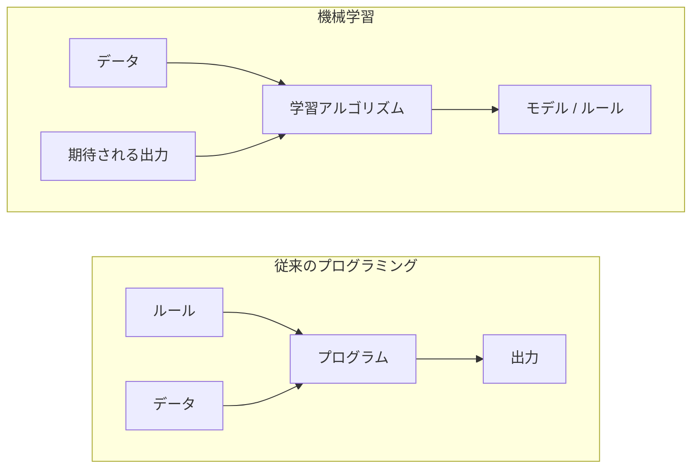
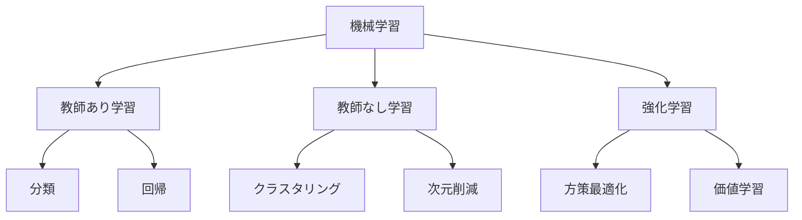
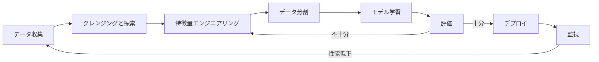
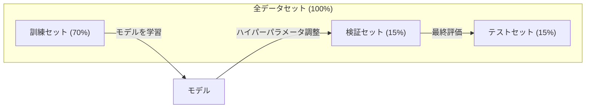
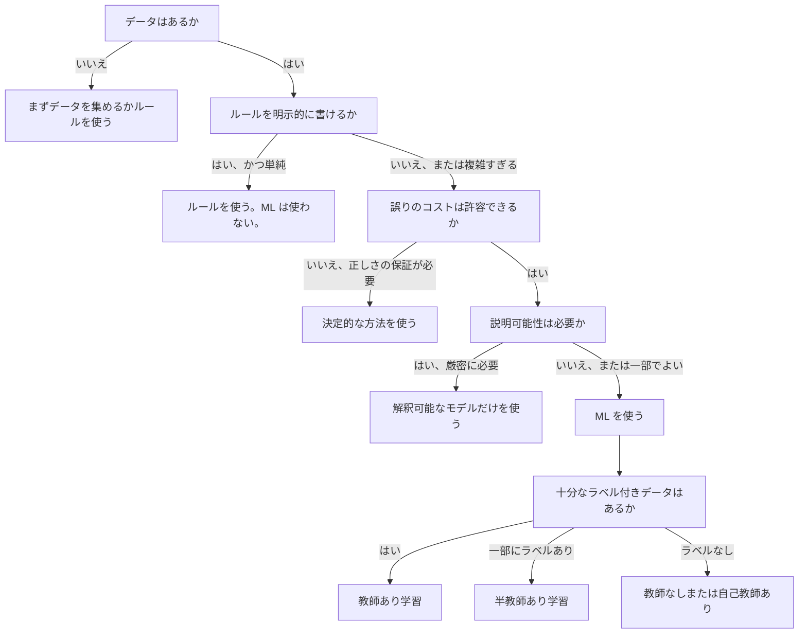

# 機械学習とは

> 機械学習とは、手作業でルールを書く代わりに、コンピュータへデータ内のパターンを見つけさせることです。

**種類:** 学習
**言語:** Python
**前提条件:** Phase 1（数学基礎）
**所要時間:** 約 45 分

## 学習目標

- 教師あり学習、教師なし学習、強化学習の違いを説明し、与えられた問題にどの種類が当てはまるかを判断できる
- 最近傍重心分類器をゼロから実装し、ランダムベースラインと比較して評価できる
- 分類タスクと回帰タスクを区別し、それぞれに適切な損失関数を選択できる
- あるビジネス課題が ML に適しているか、決定的なルールで解くべきかを評価できる

## 問題

スパムフィルタを作りたいとします。従来のやり方は、腰を据えて何百ものルールを書くことです。「メールに 'FREE MONEY' が含まれていたらスパムにする。感嘆符が 3 個を超えたらスパムにする。」何週間もかけてルールを書きます。するとスパマーは言い回しを変えます。ルールは壊れます。さらにルールを書きます。このサイクルは終わりません。

機械学習はこれを反転させます。ルールを書く代わりに、何千通ものラベル付きメール（「スパム」または「スパムでない」）をコンピュータに与え、ルールを自分で見つけさせます。コンピュータは、人間が思いつかなかったパターンを見つけます。スパマーが戦術を変えたら、コードを書き直す代わりに新しいデータで再学習します。

「ルールをプログラムする」から「データから学習する」へのこの転換が、機械学習の核心です。推薦エンジン、音声アシスタント、自動運転車、言語モデルはすべてこの仕組みで動いています。

## 概念

### ルールではなくデータから学習する

従来のプログラミングと機械学習は、逆方向から問題を解きます。



従来のプログラミングでは、あなたがルールを書きます。プログラムはそのルールをデータに適用し、出力を生成します。

機械学習では、データと期待される出力を与えます。アルゴリズムがルールを発見します。

学習から得られる「モデル」こそが、数値（重み、パラメータ）として符号化されたルールです。モデルは見たことのある例から汎化し、見たことのないデータに対して予測します。

### 機械学習の 3 つの種類



**教師あり学習**: 入力と出力のペアがあります。モデルは入力を出力へ対応づける方法を学びます。
- 「猫または犬とラベル付けされた写真が 10,000 枚あります。見分けられるように学習してください。」
- 「住宅の特徴量と価格があります。価格を予測する方法を学習してください。」

**教師なし学習**: 入力だけがあります。ラベルはありません。モデルは自分で構造を見つけます。
- 「顧客の購入履歴が 10,000 件あります。自然なまとまりを見つけてください。」
- 「1,000 次元のデータ点があります。構造を保ったまま 2 次元へ削減してください。」

**強化学習**: エージェントが環境内で行動し、報酬または罰を受け取ります。総報酬を最大化する戦略（方策）を学びます。
- 「このゲームをプレイしてください。勝てば +1、負ければ -1。戦略を見つけてください。」
- 「このロボットアームを制御してください。物体を持ち上げたら +1、無駄にした 1 秒ごとに -0.01。」

実務で作るものの大半は教師あり学習を使います。教師なし学習は前処理や探索でよく使われます。強化学習はゲーム AI、ロボティクス、言語モデルの RLHF を支えています。

### 3 大分類の先へ

上の 3 つの分類は整理しやすいものですが、現実世界の ML では境界がよく曖昧になります。

**半教師あり学習**は、少量のラベル付きデータと大量のラベルなしデータを使います。ラベル付き医療画像が 100 枚、ラベルなし画像が 100,000 枚あるような場合です。代表的な手法は次のとおりです。

- **ラベル伝播:** 似ているデータ点を結ぶグラフを作ります。ラベルはグラフを通じて、ラベル付きノードからラベルなしの近傍へ広がります。
- **疑似ラベリング:** ラベル付きデータでモデルを学習し、そのモデルでラベルなしデータのラベルを予測してから、すべてのデータで再学習します。モデルが自分自身の訓練セットを拡張します。
- **一貫性正則化:** 入力と、その入力を少し摂動させたものに対して、モデルが同じ予測を返すべきだとする手法です。ラベルがなくても機能します。

**自己教師あり学習**は、データそのものから教師信号を作ります。人間によるラベルはまったく不要です。モデルはデータ構造から自分自身の予測タスクを作ります。

- **マスク言語モデリング（BERT）:** 文中の 15% の単語を隠し、欠けた単語を予測するようにモデルを学習します。「ラベル」は元のテキストから得られます。
- **対照学習（SimCLR）:** 画像を 1 枚取り、拡張版を 2 つ作ります。それらが同じ画像から来たことを認識しつつ、他の画像の拡張版と区別できるようにモデルを学習します。
- **次トークン予測（GPT）:** それまでのすべての単語から次の単語を予測します。あらゆるテキスト文書が訓練例になります。

これらは 3 大分類とは別のカテゴリではありません。教師ありと教師なしの考え方を組み合わせる戦略です。自己教師あり学習は技術的には教師ありです（モデルが何かを予測するため）。ただしラベルは人間ではなく自動的に生成されます。

### 分類と回帰

これらは教師あり学習の 2 つの主要タスクです。

| 観点 | 分類 | 回帰 |
|--------|---------------|------------|
| 出力 | 離散カテゴリ | 連続値 |
| 例 | 「このメールはスパムか？」 | 「住宅価格はいくらになるか？」 |
| 出力空間 | {cat, dog, bird} | 任意の実数 |
| 損失関数 | 交差エントロピー、accuracy | 平均二乗誤差、MAE |
| 判断 | クラス間の境界 | データに適合する曲線 |

分類は「どのカテゴリか？」に答えます。回帰は「どれくらいか？」に答えます。

問題によっては、どちらとしても定式化できます。株価が上がるか下がるかを予測するなら分類です。正確な価格を予測するなら回帰です。

### ML ワークフロー

機械学習プロジェクトは、アルゴリズムに関係なく同じパイプラインに従います。



**データ収集**: 生データを集めます。ほとんどの場合、データは多いほどよいですが、量より品質が重要です。

**クレンジングと探索**: 欠損値を処理し、重複を削除し、分布を可視化し、異常を見つけます。このステップはプロジェクト全体の 60-80% を占めることがよくあります。

**特徴量エンジニアリング**: 生データをモデルが使える特徴量へ変換します。日付を曜日に変換する。数値列を正規化する。カテゴリ変数をエンコードする。優れた特徴量は、凝ったアルゴリズムより重要です。

**データ分割**: 訓練セット、検証セット、テストセットに分けます。モデルは訓練データで学習し、検証データでハイパーパラメータを調整し、テストデータで最終性能を報告します。

**モデル学習**: 訓練データをアルゴリズムへ入力します。アルゴリズムは損失関数を最小化するように内部パラメータを調整します。

**評価**: 検証/テストデータで性能を測ります。性能が許容できなければ戻って、別の特徴量、アルゴリズム、ハイパーパラメータを試します。

**デプロイ**: 新しいデータに対して予測できるよう、モデルを本番環境へ配置します。

**監視**: 時間とともに性能を追跡します。データ分布は変化し（データドリフト）、モデルは劣化します。性能が落ちたら再学習します。

### 訓練・検証・テスト分割

これは初心者が最も誤解しやすい重要概念です。モデルは学習中に見ていないデータで評価しなければなりません。そうしないと、学習ではなく暗記を測っていることになります。



| 分割 | 目的 | 使うタイミング | 典型的なサイズ |
|-------|---------|-----------|-------------|
| 訓練 | モデルがこのデータから学習する | 学習中 | 60-80% |
| 検証 | ハイパーパラメータ調整、モデル比較 | 各学習実行の後 | 10-20% |
| テスト | 最終的な偏りのない性能推定 | 最後に一度だけ | 10-20% |

テストセットは神聖なものです。見るのは正確に一度だけです。テスト性能にもとづいてモデルを調整し続けると、実質的にテストセットで学習していることになり、報告する数値は意味を失います。

小さなデータセットでは k-fold 交差検証を使います。データを k 個に分け、k-1 個で学習し、残り 1 個で検証し、これをローテーションして結果を平均します。

### 過学習と過小適合


**過小適合**: モデルが単純すぎて、データ内のパターンを捉えられない状態です。曲線関係に直線を当てはめようとしているようなものです。訓練誤差は高く、テスト誤差も高くなります。

**過学習**: モデルが複雑すぎて、ノイズを含めた訓練データを暗記してしまう状態です。すべての訓練点を通る曲がりくねった曲線が、新しいデータでは失敗するようなものです。訓練誤差は低く、テスト誤差は高くなります。

**良い適合**: モデルがノイズを暗記せず、実際のパターンを捉えている状態です。訓練誤差とテスト誤差の両方が十分に低くなります。

過学習の兆候:
- 訓練精度が検証精度よりかなり高い
- モデルは訓練データではよく動くが、新しいデータでは悪い
- 訓練データを増やすと性能が改善する（モデルは学習ではなく暗記していた）

過学習への対策:
- 訓練データを増やす
- モデルの複雑さを下げる（パラメータを減らす、より単純なアーキテクチャにする）
- 正則化（大きな重みに罰則を追加する）
- ドロップアウト（学習中にニューロンをランダムにゼロ化する）
- 早期終了（検証誤差が増え始めたら学習を止める）

過小適合への対策:
- より複雑なモデルを使う
- 特徴量を増やす
- 正則化を弱める
- より長く学習する

### バイアスとバリアンスのトレードオフ

これは過学習と過小適合の背後にある数学的枠組みです。

**バイアス**: モデルの誤った仮定による誤差です。真の関係が非線形なのに線形モデルを使うと、バイアスが高くなります。高バイアスは過小適合につながります。

**バリアンス**: 訓練データの小さな揺らぎに敏感であることによる誤差です。高バリアンスのモデルは、異なるデータ部分集合で学習すると大きく異なる予測を出します。高バリアンスは過学習につながります。

| モデルの複雑さ | バイアス | バリアンス | 結果 |
|-----------------|------|----------|--------|
| 低すぎる（曲線データに線形モデル） | 高 | 低 | 過小適合 |
| ちょうどよい | 中 | 中 | 良い汎化 |
| 高すぎる（10 点に 20 次多項式） | 低 | 高 | 過学習 |

総誤差 = バイアス^2 + バリアンス + 既約ノイズ

既約ノイズは減らせません（データそのものに含まれるランダム性です）。目指すのは bias^2 + variance が最小になるちょうどよい点を見つけることです。

### ノーフリーランチ定理

すべての問題に対して最もよく機能する単一のアルゴリズムはありません。ある種類の問題で高性能なアルゴリズムは、別の種類の問題では低性能になります。だからデータサイエンティストは複数のアルゴリズムを試し、結果を比較します。

実務では、選択は次の要因に依存します。
- データ量
- 特徴量の数
- 関係が線形か非線形か
- 解釈性が必要か
- 使える計算資源の量

### 機械学習を使うべきでない場合

ML は強力ですが、常に正しい道具とは限りません。モデルに手を伸ばす前に、本当に必要かを確認してください。

**次の場合は ML を使わないでください。**

- **ルールが単純で明確に定義されている。** 税額計算、ソートアルゴリズム、単位変換などです。数個の if 文でロジックを書けるなら、モデルは利点なしに複雑さを増やすだけです。
- **データがない、または非常に少ない。** ML には学習するための例が必要です。データ点が 10 個では、意味のあるものは学習できません。まずデータを集めます。
- **間違いのコストが壊滅的で、正しさを保証する必要がある。** 医療投与量計算、原子炉制御、暗号検証などです。ML モデルは確率的です。ときどき間違えます。「ときどき間違える」ことが許容できないなら、決定的な方法を使います。
- **ルックアップテーブルやヒューリスティックで解ける。** 単純なしきい値や表で 99% のケースをカバーできるなら、ML を追加しても意味のある改善なしに保守コストが増えます。
- **判断を説明できず、説明可能性が必須である。** 規制産業（融資、保険、刑事司法）では、すべての判断が完全に説明可能であることを求められる場合があります。一部の ML モデル（線形回帰、小さな決定木）は解釈可能ですが、多くはそうではありません。
- **問題の変化が再学習より速い。** ルールが毎日変わり、再学習に 1 週間かかるなら、モデルは常に古くなります。

この判断フローチャートを使ってください。



## 作ってみる

`code/ml_intro.py` のコードは、最も単純な ML アルゴリズムである最近傍重心分類器をゼロから実装しています。中心となる考え方、つまりデータから学習し、新しいデータを予測することを示します。

### ステップ 1: 最近傍重心分類器をゼロから作る

最近傍重心分類器は、訓練データ内の各クラスの中心（平均）を計算します。予測時には、新しい点を最も近い中心を持つクラスに割り当てます。

```python
class NearestCentroid:
    def fit(self, X, y):
        self.classes = np.unique(y)
        self.centroids = np.array([
            X[y == c].mean(axis=0) for c in self.classes
        ])

    def predict(self, X):
        distances = np.array([
            np.sqrt(((X - c) ** 2).sum(axis=1))
            for c in self.centroids
        ])
        return self.classes[distances.argmin(axis=0)]
```

これがアルゴリズム全体です。fit は 2 つの平均を計算します。predict は距離を計算します。勾配降下法も反復もハイパーパラメータもありません。

### ステップ 2: 合成データで学習する

少し重なり合う 2 クラスの 2 次元分類データセットを生成します。重心分類器はクラス中心の間に線形の決定境界を引きます。

```python
rng = np.random.RandomState(42)
X_class0 = rng.randn(100, 2) + np.array([1.0, 1.0])
X_class1 = rng.randn(100, 2) + np.array([-1.0, -1.0])
X = np.vstack([X_class0, X_class1])
y = np.array([0] * 100 + [1] * 100)
```

### ステップ 3: ベースラインと比較する

すべての ML モデルは単純なベースラインと比較すべきです。ここでは、ベースラインはランダムなクラスを予測します。ML モデルがランダム推測に勝てないなら、何かが間違っています。

```python
baseline_preds = rng.choice([0, 1], size=len(y_test))
baseline_acc = np.mean(baseline_preds == y_test)
```

このきれいなデータセットでは、重心分類器はおよそ 90% 以上の精度になるはずです。ランダムベースラインはおよそ 50% です。

### なぜこれが重要か

最近傍重心分類器は極めて単純です。ハイパーパラメータも、反復も、勾配降下法もありません。それでも、ML の基本パターンを捉えています。

1. 訓練データから表現を**学習**する（重心）
2. その表現を使って新しいデータを**予測**する（最近距離）
3. ベースラインと比較して**評価**する（ランダム推測）

ロジスティック回帰から Transformer まで、すべての ML アルゴリズムはこの同じ 3 ステップのパターンに従います。表現はより複雑になりますが、ワークフローは同じです。

### ステップ 4: 重心分類器にできないこと

最近傍重心分類器は、各クラスが 1 つの塊を作ると仮定します。線形の決定境界を引きます。次の場合には失敗します。

- クラスが複数のクラスタを持つ（例: 数字の「1」はいくつもの書き方がある）
- 決定境界が非線形である（例: 一方のクラスが別のクラスを囲んでいる）
- 特徴量のスケールが大きく異なる（距離が最大スケールの特徴量に支配される）

これらの制約が、これから学ぶ他のすべてのアルゴリズムの動機になります。K 近傍法は複数クラスタを扱えます。決定木は非線形境界を扱えます。特徴量スケーリングはスケール問題を修正します。各レッスンは前のレッスンの制約の上に積み上がります。

## 使ってみる

sklearn は `NearestCentroid` と合成データ生成器を提供しています。

```python
from sklearn.neighbors import NearestCentroid
from sklearn.datasets import make_classification
from sklearn.model_selection import train_test_split

X, y = make_classification(
    n_samples=500, n_features=2, n_redundant=0,
    n_clusters_per_class=1, random_state=42
)
X_train, X_test, y_train, y_test = train_test_split(X, y, test_size=0.3)

clf = NearestCentroid()
clf.fit(X_train, y_train)
print(f"Accuracy: {clf.score(X_test, y_test):.3f}")
```

## 仕上げる

このレッスンでは `outputs/prompt-ml-problem-framer.md` を作成します。これは、あいまいなビジネス課題を具体的な ML タスクへ変換するプロンプトです。問題説明（「解約を減らしたい」「次の四半期の需要を予測したい」など）を与えると、学習タイプを特定し、予測対象を定義し、候補特徴量を列挙し、成功指標を選び、ベースラインを設定し、データリークやクラス不均衡などの落とし穴を指摘します。間違ったものを作らないよう、あらゆる ML プロジェクトの開始時に使ってください。

## 重要用語

| 用語 | よくある言い方 | 実際の意味 |
|------|----------------|----------------------|
| Model | 「AI」 | 入力を出力へ写像する、学習可能なパラメータを持つ数学的関数 |
| Training | 「AI に教える」 | 予測が既知の出力に合うよう、最適化アルゴリズムでモデルパラメータを調整すること |
| Feature | 「入力列」 | モデルが予測に使う、データの測定可能な性質 |
| Label | 「答え」 | 訓練例に対する既知の出力。誤差信号の計算に使う |
| Hyperparameter | 「調整する設定」 | 学習プロセスを制御する、学習前に設定するパラメータ（学習率、層数など） |
| Loss function | 「モデルがどれくらい間違っているか」 | 予測出力と実際の出力の差を測る関数。学習ではこれを最小化しようとする |
| Overfitting | 「テストを暗記した」 | モデルが一般的なパターンではなく訓練固有のノイズを学習し、新しいデータで失敗すること |
| Underfitting | 「何も学習していない」 | モデルが単純すぎて、データ内の実際のパターンを捉えられないこと |
| Generalization | 「新しいデータでも動く」 | 学習していないデータに対して正確な予測を行うモデルの能力 |
| Cross-validation | 「別々の塊でテストする」 | データを訓練/テスト fold に繰り返し分割して結果を平均し、より頑健な性能推定を得ること |
| Regularization | 「重みを小さく保つ」 | 過度に複雑なモデルを抑えるため、損失関数へ罰則項を追加すること |
| Data drift | 「世界が変わった」 | 入ってくるデータの統計分布が時間とともに変化し、モデル性能が劣化すること |

## 演習

1. 任意のデータセット（例: Iris、Titanic）を取り、train/validation/test に 70/15/15 で分割してください。テストセットでハイパーパラメータを調整すべきでない理由を説明してください。
2. 現実世界の問題を 3 つ挙げてください。それぞれについて、分類、回帰、クラスタリングのどれか、また教師ありか教師なしかを特定してください。
3. あるモデルが訓練データで 99% の精度、テストデータで 60% の精度でした。問題を診断し、それを修正するために試すことを 3 つ挙げてください。

## 参考文献

- [An Introduction to Statistical Learning](https://www.statlearning.com/) - 古典的 ML 手法全般を実践例とともに扱う無料教科書
- [Google's Machine Learning Crash Course](https://developers.google.com/machine-learning/crash-course) - ML 概念を簡潔かつ視覚的に紹介する教材
- [Scikit-learn User Guide](https://scikit-learn.org/stable/user_guide.html) - Python で ML を実装するための実用的なリファレンス
