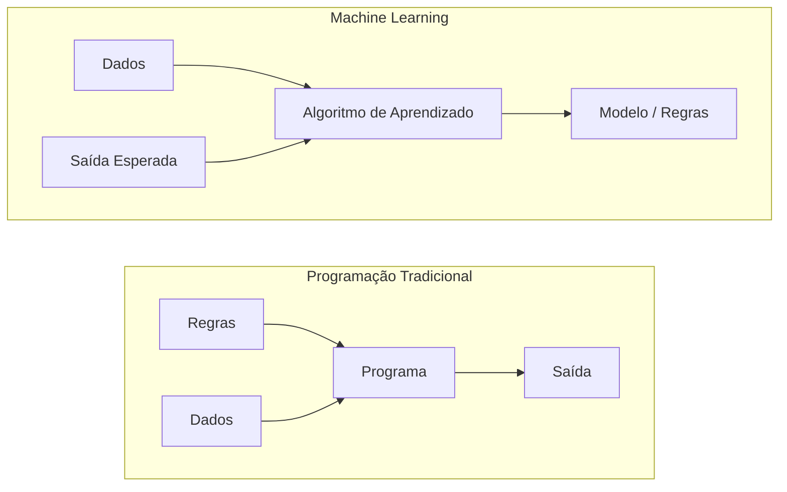
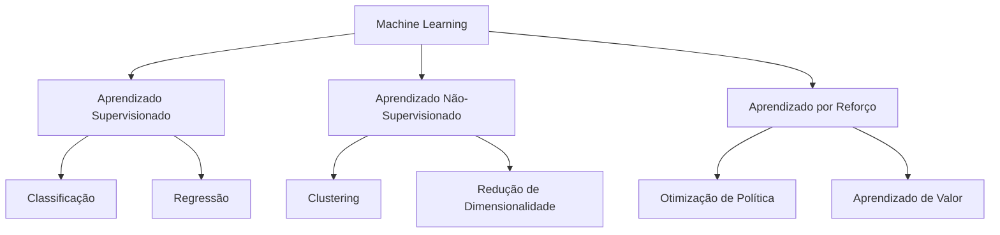
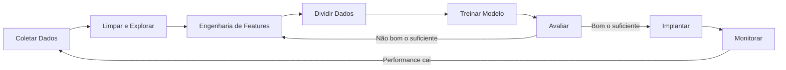

# O Que É Machine Learning

> Machine learning é ensinar computadores a encontrar padrões em dados em vez de escrever regras na mão.

**Tipo:** Learn
**Linguagens:** Python
**Pré-requisitos:** Fase 1 (Base Matemática)
**Tempo:** ~45 minutos

## Objetivos de Aprendizado

- Explicar a diferença entre aprendizado supervisionado, não-supervisionado e por reforço e identificar qual tipo se aplica a um problema dado
- Implementar um classificador por centroide mais próximo do zero e avaliá-lo contra um baseline aleatório
- Distinguir entre tarefas de classificação e regressão e selecionar a função de perda adequada para cada uma
- Avaliar se um problema de negócio é adequado para ML ou melhor resolvido com regras determinísticas

## O Problema

Você quer construir um filtro de spam. A abordagem tradicional: sentar e escrever centenas de regras. "Se o email contém 'DINHEIRO GRÁTIS', marque como spam. Se tiver mais de 3 pontos de exclamação, marque como spam." Você gasta semanas escrevendo regras. Aí os spammers mudam o texto. Suas regras quebram. Você escreve mais regras. O ciclo nunca termina.

Machine learning inverte isso. Em vez de escrever regras, você dá ao computador milhares de emails rotulados ("spam" ou "não spam") e deixa ele descobrir as regras sozinho. O computador encontra padrões que você nunca pensaria. Quando os spammers mudam de tática, você retreina com novos dados em vez de reescrever código.

Essa transição de "programar regras" para "aprender com dados" é o coração do machine learning. Todo motor de recomendação, assistente de voz, carro autônomo e modelo de linguagem funciona assim.

## O Conceito

### Aprendendo dos Dados, Não das Regras



Programação tradicional: você escreve as regras. O programa aplica nos dados pra produzir saída.
Machine learning: você fornece dados e saídas esperadas. O algoritmo descobre as regras.

### Os Três Tipos de Machine Learning



**Aprendizado Supervisionado**: Você tem pares entrada-saída. O modelo aprende a mapear entradas pra saídas.

**Aprendizado Não-Supervisionado**: Você tem só entradas. Sem rótulos. O modelo encontra estrutura sozinho.

**Aprendizado por Reforço**: Um agente toma ações em um ambiente e recebe recompensas ou punições. Aprende uma estratégia (política) pra maximizar recompensa total.

### Classificação vs Regressão

| Aespecificaçãoto | Classificação | Regressão |
|---------|---------------|-----------|
| Saída | Categorias discretas | Números contínuos |
| Exemplo | "Esse email é spam?" | "Qual será o preço da casa?" |
| Espaço de saída | {gato, cachorro, pássaro} | Qualquer número real |
| Função de perda | Entropia cruzada, accuracy | Erro quadrático médio, MAE |
| Decisão | Fronteiras entre classes | Uma curva que ajusta os dados |

### O Fluxo de Trabalho de ML



### Divisões de Treino, Validação e Teste

Esta é a aula mais importante que iniciantes erram. Você **deve** avaliar seu modelo em dados que ele nunca viu durante o treino. Caso contrário, está medindo memorização, não aprendizado.

| Divisão | Propósito | Quando usado | Tamanho típico |
|---------|-----------|-------------|----------------|
| Treino | Modelo aprende destes dados | Durante treino | 60-80% |
| Validação | Ajustar hiperparâmetros, comparar modelos | Após cada run de treino | 10-20% |
| Teste | Estimativa final imparcial de performance | Uma vez, no final | 10-20% |

O conjunto de teste é sagrado. Você olha exatamente uma vez. Se ficar ajustando seu modelo baseado no performance de teste, está treinando no teste e os números que reporta são inúteis.

### Overajuste vs Subajuste

**Subajuste**: O modelo é simples demais pra capturar os padrões nos dados. Uma reta tentando ajustar uma relação curva. Erro de treino alto. Erro de teste alto.

**Overajuste**: O modelo é complexo demais e memoriza os dados de treino, incluindo o ruído. Uma curva sinuosa que passa por cada ponto de treino mas falha em dados novos. Erro de treino baixo. Erro de teste alto.

**Bom ajuste**: O modelo captura padrões reais sem memorizar ruído. Erro de treino e teste estão ambos razoavelmente baixos.

### O Tradeoff Viés-Variância

Esta é a framework matemática por trás de overajuste e subajuste.

**Viés**: Erro de premissas erradas no modelo. Um modelo linear tem viés alto quando a relação verdadeira é não-linear. Viés alto leva a subajuste.

**Variância**: Erro de sensibilidade a flutuações pequenas nos dados de treino. Um modelo com variância alta dá previsões muito diferentes quando treinado em subsets diferentes dos dados. Variância alta leva a overajuste.

| Complexidade do Modelo | Viés | Variância | Resultado |
|-----------------------|------|-----------|-----------|
| Muito baixo (modelo linear pra dados curvos) | Alto | Baixo | Subajuste |
| Justo | Médio | Médio | Boa generalização |
| Muito alto (polinômio grau 20 pra 10 pontos) | Baixo | Alto | Overajuste |

### Quando NÃO Usar Machine Learning

ML é poderoso mas nem sempre é a ferramenta certa.

- **Regras são simples e bem definidas.** Cálculo de imposto, algoritmos de ordenação, conversões de unidade.
- **Você não tem dados ou tem muito poucos.** ML precisa de exemplos pra aprender.
- **O custo de errar é catastrófico e você precisa de correção garantida.** Dosagem médica, controle de reator nuclear, verificação criptográfica.
- **Uma tabela de consulta ou heurística resolve o problema.** Se um limiar simples cobre 99% dos casos, adicionar ML aumenta custo de manutenção sem melhoria significativa.

## Construa

O código em `code/ml_intro.py` implementa um classificador por centroide mais próximo do zero, o algoritmo de ML mais simples possível. Demonstra a ideia central: aprender dos dados, depois prever em dados novos.

### Passo 1: Classificador por Centroide Mais Próximo Do Zero

```python
class NearestCentroid:
    def fit(self, X, y):
        self.classes = np.unique(y)
        self.centroids = np.array([
            X[y == c].mean(axis=0) for c in self.classes
        ])

    def predict(self, X):
        distances = np.array([
            np.sqrt(((X - c) ** 2).sum(axis=1))
            for c in self.centroids
        ])
        return self.classes[distances.argmin(axis=0)]
```

Esse é o algoritmo inteiro. Fit calcula duas médias. Predict calcula distâncias. Sem descida de gradiente, sem iteração, sem hiperparâmetros.

### Passo 2: Treine em Dados Sintéticos

```python
rng = np.random.RandomState(42)
X_class0 = rng.randn(100, 2) + np.array([1.0, 1.0])
X_class1 = rng.randn(100, 2) + np.array([-1.0, -1.0])
X = np.vstack([X_class0, X_class1])
y = np.array([0] * 100 + [1] * 100)
```

### Passo 3: Compare com um Baseline

Todo modelo de ML deve ser comparado com um baseline trivial. Aqui, o baseline prevê uma classe aleatória. Se seu modelo de ML não supera chute aleatório, algo está errado.

### Por Que Isso Importa

O classificador por centroide mais próximo é trivialmente simples. Não tem hiperparâmetros, não tem iteração, não tem descida de gradiente. Mas captura o padrão fundamental de ML:

1. **Aprenda** uma representação dos dados de treino (os centroides)
2. **Preveja** em dados novos usando essa representação (distância mais próxima)
3. **Avalie** contra um baseline (chute aleatório)

Todo algoritmo de ML, da regressão logística a transformers, segue esse mesmo padrão de três passos.

## Use

sklearn fornece `NearestCentroid` e geradores de dados sintéticos:

```python
from sklearn.neighbors import NearestCentroid
from sklearn.datasets import make_classification
from sklearn.model_selection import train_test_split

X, y = make_classification(
    n_samples=500, n_features=2, n_redundant=0,
    n_clusters_per_class=1, random_state=42
)
X_train, X_test, y_train, y_test = train_test_split(X, y, test_size=0.3)

clf = NearestCentroid()
clf.fit(X_train, y_train)
print(f"Accuracy: {clf.score(X_test, y_test):.3f}")
```

## Exercícios

1. Pegue qualquer dataset (ex: Iris, Titanic). Divida 70/15/15 em treino/validação/teste. Explique por que não deve ajustar hiperparâmetros no conjunto de teste.
2. Liste três problemas reais. Para cada um, identifique se é classificação, regressão ou clustering, e se é supervisionado ou não-supervisionado.
3. Um modelo pega 99% de accuracy nos dados de treino mas 60% nos dados de teste. Diagnóstique o problema e liste três coisas que você tentaria para corrigir.
