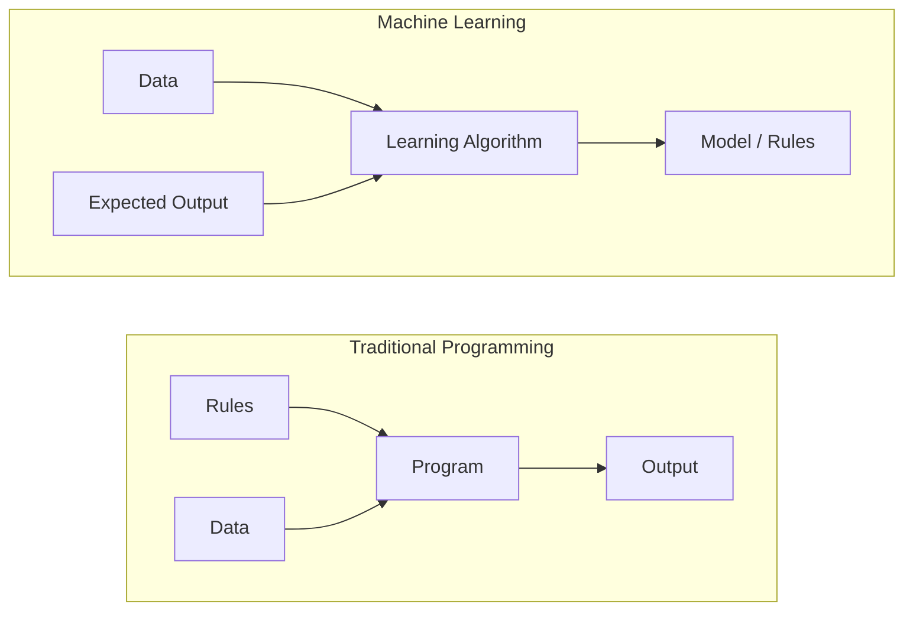
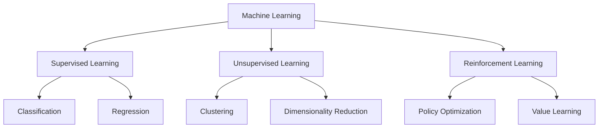
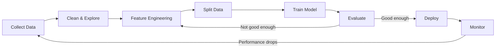
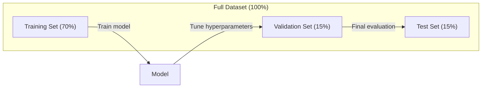
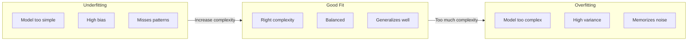
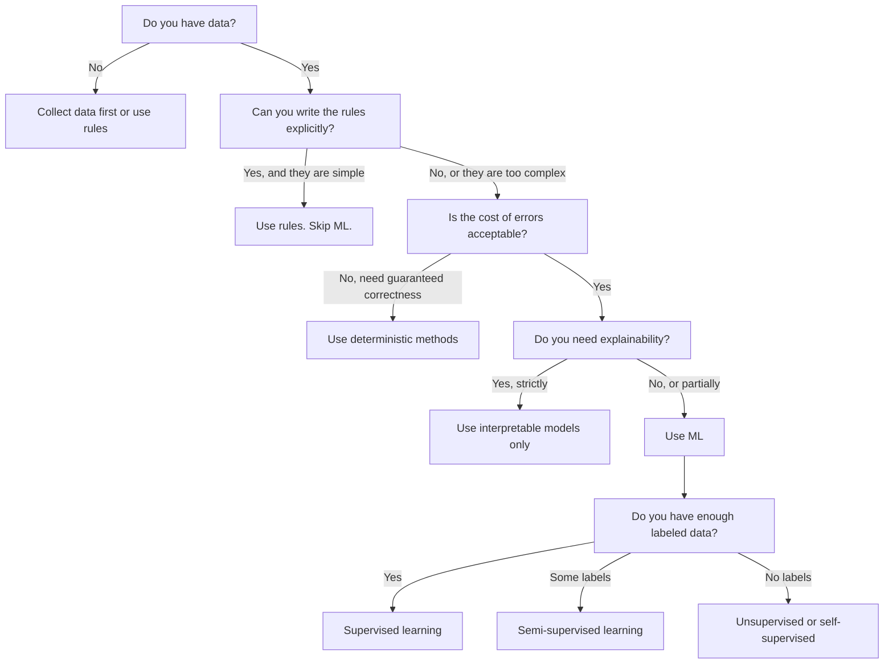

# Machine Learning Nedir?

> Machine learning, elle kural yazmak yerine bilgisayarlara verilerdeki kalıpları bulmayı öğretiyor.

**Tür:** Öğren
**Diller:** Python
**Önkoşullar:** Aşama 1 (Matematik Temelleri)
**Süre:** ~45 dakika

## Öğrenme Hedefleri

- Denetimli, denetimsiz ve takviyeli öğrenme arasındaki farkı açıklayın ve belirli bir soruna hangi türün uygulanacağını belirleyin
- En yakın ağırlık merkezi sınıflandırıcısını sıfırdan uygulayın ve bunu rastgele bir taban çizgisine göre değerlendirin
- Sınıflandırma ve regresyon görevlerini ayırt edin ve her biri için uygun loss function'yi seçin
- Belirli bir iş probleminin makine öğrenimi için uygun olup olmadığını veya deterministik kurallarla daha iyi çözülüp çözülmediğini değerlendirin

## Sorun

Bir spam filtresi oluşturmak istiyorsunuz. Geleneksel yaklaşım: oturun ve yüzlerce kural yazın. "E-posta 'ÜCRETSİZ PARA' içeriyorsa spam olarak işaretleyin. 3'ten fazla ünlem işareti varsa spam olarak işaretleyin." Kuralları yazmak için haftalar harcıyorsunuz. Daha sonra spam gönderenler ifadelerini değiştirir. Kurallarınız çiğneniyor. Daha fazla kural yazarsın. Döngü asla bitmez.

Machine learning bunu tersine çevirir. Kural yazmak yerine, bilgisayara binlerce etiketli e-posta ("spam" veya "spam değil") verirsiniz ve kuralları kendi başına çözmesine izin verirsiniz. Bilgisayar asla aklınıza gelmeyecek desenleri bulur. Spam gönderenler taktiklerini değiştirdiğinde, kodu yeniden yazmak yerine yeni veriler üzerinde yeniden eğitim alırsınız.

"Programlama kurallarından" "verilerden öğrenmeye" geçiş machine learning'nin temelini oluşturur. Her öneri motoru, sesli asistan, sürücüsüz araba ve dil modeli bu şekilde çalışır.

## Konsept

### Kurallardan Değil Verilerden Öğrenin

Geleneksel programlama ve machine learning, sorunları zıt yönlerde çözer.



Geleneksel programlama: kuralları siz yazarsınız. Program çıktı üretmek için bunları verilere uygular.

Machine learning: verileri ve beklenen çıktıları sağlarsınız. Algoritma kuralları keşfeder.

Eğitimden çıkan "model" sayılar (ağırlıklar, parametreler) olarak kodlanmış kurallardır. Gördüğü örneklerden genellemeler yaparak hiç görmediği veriler üzerinde tahminlerde bulunur.

### Machine Learning'nin Üç Türü



**Denetimli Öğrenme**: Giriş-çıkış çiftleriniz var. Model, girdileri çıktılarla eşleştirmeyi öğrenir.
- "İşte kedi veya köpek etiketli 10.000 fotoğraf. Onları ayırmayı öğrenin."
- "İşte evin özellikleri ve fiyatları. Fiyatı tahmin etmeyi öğrenin."

**Denetimsiz Öğrenme**: Yalnızca girişleriniz vardır. Etiket yok. Model kendi kendine yapı bulur.
- "İşte 10.000 müşteri satın alma geçmişi. Doğal gruplamaları bulun."
- "İşte 1000 boyutlu veri noktası. Yapıyı korurken 2 boyuta düşürün."

**Takviyeli Öğrenme**: Bir agent, bir ortamda eylemler gerçekleştirir ve ödüller veya cezalar alır. Toplam ödülü en üst düzeye çıkarmak için bir strateji (politika) öğrenir.
- "Bu oyunu oynayın. Kazanmak için +1, kaybetmek için -1. Bir strateji belirleyin."
- "Bu robot kolunu kontrol edin. Nesneyi almak için +1, boşa harcanan her saniye için -0,01."

Uygulamada oluşturacağınız şeylerin çoğu denetimli öğrenmeyi kullanır. Denetimsiz öğrenme, ön işleme ve keşif için yaygındır. Takviyeli öğrenme, dil modelleri için oyun yapay zekasını, robot bilimini ve RLHF'yi destekler.

### Üç Büyüklerin Ötesinde

Yukarıdaki üç kategori temizdir ancak gerçek dünyadaki makine öğrenimi çoğu zaman çizgileri bulanıklaştırır.

**Yarı denetimli öğrenme**, küçük bir etiketli veri kümesi ve büyük bir etiketlenmemiş veri kümesi kullanır. 100 etiketli tıbbi görseliniz ve 100.000 etiketsiz tıbbi görseliniz olabilir. Teknikler şunları içerir:

- **Etiket yayılımı:** Benzer veri noktalarını birbirine bağlayan bir grafik oluşturun. Etiketler, etiketli düğümlerden etiketlenmemiş komşulara grafik aracılığıyla yayılır.
- **Sözde etiketleme:** Etiketli veriler üzerinde bir model eğitin, bunu etiketlenmemiş veriler için etiketleri tahmin etmek için kullanın ve ardından her şeyi yeniden eğitin. Model kendi eğitim setini önyükler.
- **Tutarlılık düzenlemesi:** Model, bir girdi için aynı tahmini ve bu girdinin biraz bozulmuş bir versiyonunu vermelidir. Bu, etiketler olmadan bile çalışır.

**Kendi kendini denetleyen öğrenme**, verilerin kendisinden denetim oluşturur. İnsan etiketlerine hiç gerek yok. Model, verinin yapısından kendi tahmin görevini oluşturur.

- **Maskeli dil modelleme (BERT):** Bir cümledeki kelimelerin %15'ini gizleyin, modeli eksik kelimeleri tahmin edecek şekilde eğitin. "Etiketler" orijinal metinden gelir.
- **Karşılaştırmalı öğrenme (SimCLR):** Bir resim çekin, iki artırılmış versiyon oluşturun. Modeli, aynı görüntüden geldiklerini tanıyacak ve diğer görüntülerin genişletilmiş versiyonlarından ayıracak şekilde eğitin.
- **Sonraki-token tahmini (GPT):** Önceki tüm kelimelere göre sonraki kelimeyi tahmin edin. Her metin belgesi bir eğitim örneği haline gelir.

Bunlar büyük üçten ayrı kategoriler değil. Denetimli ve denetimsiz fikirleri birleştiren stratejilerdir. Kendi kendini denetleyen öğrenme teknik olarak denetlenir (model bir şeyi tahmin eder), ancak etiketler insanlar tarafından değil otomatik olarak oluşturulur.

### Sınıflandırma ve Regresyon

Bunlar iki ana denetimli öğrenme görevidir.

| Görünüş | Sınıflandırma | Regresyon |
|--------|---------------|------------|
| Çıkış | Ayrık kategoriler | Sürekli sayılar |
| Örnek | "Bu e-posta spam mi?" | "Evin fiyatı ne olacak?" |
| Çıkış alanı | {kedi, köpek, kuş} | Herhangi bir gerçek sayı |
| Loss function | Çapraz entropi, doğruluk | Ortalama kare hatası, MAE |
| Karar | Sınıflar Arasındaki Sınırlar | Verilere uyan bir eğri |

Sınıflandırma "hangi kategori?" sorusunu yanıtlar. Regresyon "ne kadar?" sorusunu yanıtlar.

Bazı sorunlar her iki şekilde de çerçevelenebilir. Bir hisse senedinin yükseleceğini veya düşeceğini tahmin etmek sınıflandırmadır. Kesin fiyatı tahmin etmek regresyondur.

### ML İş Akışı

Her machine learning projesi, algoritmadan bağımsız olarak aynı hattı takip eder.



**Veri Toplayın**: Ham verileri toplayın. Daha fazla veri neredeyse her zaman daha iyidir, ancak nitelik nicelikten daha önemlidir.

**Temizle ve Keşfet**: Eksik değerleri işleyin, kopyaları kaldırın, dağıtımları görselleştirin, anormallikleri tespit edin. Bu adım genellikle toplam proje süresinin %60-80'ini alır.

**Özellik Mühendisliği**: Ham verileri modelin kullanabileceği özelliklere dönüştürün. Tarihleri ​​haftanın gününe dönüştürün. Sayısal sütunları normalleştirin. Kategorik değişkenleri kodlayın. İyi özellikler süslü algoritmalardan daha önemlidir.

**Verileri Böl**: Eğitim, doğrulama ve test kümelerine bölün. Model eğitim verilerini eğitir, siz hiperparametreleri doğrulama verilerinde ayarlarsınız ve son performansı test verileriyle raporlarsınız.

**Eğitim Modeli**: Eğitim verilerini bir algoritmaya besleyin. Algoritma, loss function değerini en aza indirecek şekilde dahili parametreleri ayarlar.

**Değerlendir**: Doğrulama/test verilerinin performansını ölçün. Performans kabul edilebilir değilse geri dönün ve farklı özellikleri, algoritmaları veya hiperparametreleri deneyin.

**Dağıt**: Modeli, yeni verilerle ilgili tahminlerde bulunacağı üretime geçirin.

**Monitör**: Zaman içindeki performansı izleyin. Veri dağılımları değişir (veri kayması) ve modeller bozulur. Performans düştüğünde yeniden eğitim alın.

### Eğitim, Doğrulama ve Test Bölümleri

Yeni başlayanların yanlış anladığı en önemli kavram budur. Modelinizi eğitim sırasında hiç görmediği veriler üzerinde değerlendirmelisiniz. Aksi takdirde öğrenmeyi değil ezberlemeyi ölçersiniz.



| Bölünmüş | Amaç | Kullanıldığında | Tipik boyut |
|-------|---------|-----------|-------------|
| Eğitim | Model bu verilerden öğrenir | Eğitim sırasında | %60-80 |
| Doğrulama | Hiperparametreleri ayarlayın, modelleri karşılaştırın | Her antrenman koşusundan sonra | %10-20 |
| Testi | Nihai tarafsız performans tahmini | Bir kez, en sonunda | %10-20 |

Test seti kutsaldır. Tam olarak bir kez bakıyorsun. Modelinizi test performansına göre ayarlamaya devam ederseniz, test seti üzerinde etkili bir şekilde eğitim almış olursunuz ve raporladığınız sayılar anlamsızdır.

Küçük dataset'ler için k-katlı çapraz doğrulamayı kullanın: verileri k parçaya bölün, k-1 parça üzerinde eğitim yapın, kalan parçayı doğrulayın, döndürün ve sonuçların ortalamasını alın.

### Aşırı Uyum ve Yetersiz Uyum



**Yetersiz uyum**: Model, verilerdeki kalıpları yakalayamayacak kadar basittir. Kavisli bir ilişkiye uymaya çalışan düz bir çizgi. Eğitim hatası yüksektir. Test hatası yüksektir.

**Fazla uyum**: Model çok karmaşıktır ve gürültü dahil eğitim verilerini ezberler. Her eğitim noktasından geçen ancak yeni verilerde başarısız olan dalgalı bir eğri. Eğitim hatası azdır. Test hatası yüksektir.

**İyi uyum**: Model, gürültüyü ezberlemeden gerçek desenleri yakalar. Eğitim hatası ve test hatası oldukça düşüktür.

Aşırı uyum belirtileri:
- Eğitim doğruluğu doğrulama doğruluğundan çok daha yüksektir
- Model eğitim verilerinde iyi performans gösterirken yeni verilerde zayıf performans sergiliyor
- Daha fazla eğitim verisi eklemek performansı artırır (model öğrenmiyor, ezberliyordu)

Aşırı uyum için düzeltmeler:
- Daha fazla eğitim verisi alın
- Model karmaşıklığını azaltın (daha az parametre, daha basit mimari)
- Düzenleme (büyük ağırlıklar için ceza ekleyin)
- Bırakma (eğitim sırasında nöronların rastgele sıfırlanması)
- Erken durdurma (doğrulama hatası artmaya başladığında eğitimi durdurun)

Yetersiz uyum için düzeltmeler:
- Daha karmaşık bir model kullanın
- Daha fazla özellik ekleyin
- Düzenlemeyi azaltın
- Daha uzun süre antrenman yapın

### Önyargı-Varyans Dengesi

Bu, aşırı uyum ve yetersiz uyumun ardındaki matematiksel framework'dir.

**Önyargı**: Modeldeki yanlış varsayımlardan kaynaklanan hata. Doğrusal bir model, gerçek ilişki doğrusal olmadığında yüksek önyargıya sahiptir. Yüksek önyargı, yetersiz uyumun ortaya çıkmasına neden olur.

**Varyans**: Eğitim verilerindeki küçük dalgalanmalara karşı hassasiyetten kaynaklanan hata. Yüksek varyansa sahip bir model, farklı veri alt kümeleri üzerinde eğitildiğinde çok farklı tahminler verir. Yüksek varyans aşırı uyuma yol açar.

| Model karmaşıklığı | Önyargı | Varyans | Sonuç |
|-----------------|------|----------|--------|
| Çok düşük (kavisli veriler için doğrusal model) | Yüksek | Düşük | Yetersiz uyum |
| Tam olarak | Orta | Orta | İyi genelleme |
| Çok yüksek (10 puan için derece-20 polinomu) | Düşük | Yüksek | Aşırı uyum |

Toplam hata = Önyargı^2 + Varyans + İndirgenemez gürültü

İndirgenemez gürültüyü azaltamazsınız (bu, verinin kendisindeki rastgeleliktir). Önyargı^2 + varyansın en aza indirildiği tatlı noktayı bulmak istiyorsunuz.

### Bedava Öğle Yemeği Yok Teoremi

Her problem için en iyi sonucu veren tek bir algoritma yoktur. Bir problem sınıfında iyi performans gösteren bir algoritma, diğer bir problem sınıfında kötü performans gösterecektir. Bu nedenle veri bilimcileri birden fazla algoritma deneyip sonuçları karşılaştırır.

Uygulamada seçim şunlara bağlıdır:
- Ne kadar veriniz var
- Kaç tane özellik var
- İlişkinin doğrusal mı yoksa doğrusal olmayan mı olduğu
- Yorumlanabilirliğe ihtiyacınız olup olmadığı
- Ne kadar bilgi işlem gücünüzün yettiği

### Machine Learning Ne Zaman Kullanılmamalı

Makine öğrenimi güçlüdür ancak her zaman doğru araç değildir. Bir modele ulaşmadan önce gerçekten ihtiyacınız olup olmadığını sorun.

**ML'yi şu durumlarda kullanmayın:**

- **Kurallar basit ve iyi tanımlanmıştır.** Vergi hesaplaması, sıralama algoritmaları, birim dönüşümleri. Mantığı birkaç if ifadesiyle yazabiliyorsanız, model hiçbir fayda sağlamadan karmaşıklık katar.
- **Hiç veriniz yok veya çok az veriniz var.** Makine öğreniminin öğrenilecek örneklere ihtiyacı var. 10 veri noktasıyla anlamlı hiçbir şeyi eğitemezsiniz. Önce verileri toplayın.
- **Yanlış olmanın maliyeti felakettir ve garantili doğruluğa ihtiyacınız vardır.** Tıbbi dozaj hesaplaması, nükleer reaktör kontrolü, kriptografik doğrulama. ML modelleri olasılıksaldır. Bazen yanılacaklar. Eğer "bazen yanlış" kabul edilemezse deterministik yöntemleri kullanın.
- **Bir arama tablosu veya buluşsal yöntem sorunu çözer.** Basit bir eşik veya tablo vakaların %99'unu kapsıyorsa ML'nin eklenmesi, anlamlı bir iyileştirme olmaksızın bakım maliyetini artırır.
- **Kararınızı açıklayamazsınız ve açıklanabilirlik gereklidir.** Düzenlemeye tabi sektörler (kredi verme, sigorta, ceza adaleti) bazen her kararın tamamen açıklanabilir olmasını gerektirir. Bazı ML modelleri yorumlanabilir (doğrusal regresyon, küçük karar ağaçları). Çoğu değil.
- **Sorun, yeniden eğitebileceğinizden daha hızlı değişir.** Kurallar her gün değişirse ve yeniden eğitim bir hafta sürerse, model her zaman eski olur.

Bu karar akış şemasını kullanın:



## İnşa Et

`code/ml_intro.py`'deki kod, mümkün olan en basit ML algoritması olan en yakın ağırlık merkezi sınıflandırıcısını sıfırdan uygular. Temel fikri ortaya koyuyor: Verilerden öğrenin, ardından yeni veriler üzerinde tahmin yapın.

### Adım 1: Sıfırdan En Yakın Centroid Sınıflandırıcı

En yakın ağırlık merkezi sınıflandırıcısı, eğitim verilerindeki her sınıfın merkezini (ortalamasını) hesaplar. Tahmin etmek için her yeni noktayı, merkezine en yakın olan sınıfa atar.

```python
class NearestCentroid:
    def fit(self, X, y):
        self.classes = np.unique(y)
        self.centroids = np.array([
            X[y == c].mean(axis=0) for c in self.classes
        ])

    def predict(self, X):
        distances = np.array([
            np.sqrt(((X - c) ** 2).sum(axis=1))
            for c in self.centroids
        ])
        return self.classes[distances.argmin(axis=0)]
```

Tüm algoritma budur. Fit iki ortalamayı hesaplar. Tahmin mesafeleri hesaplar. gradient iniş yok, yineleme yok, hiperparametre yok.

### Adım 2: Sentetik Veriler Üzerinde Eğitim Yapın

Hafifçe örtüşen iki sınıfa sahip bir 2B sınıflandırma dataset oluşturuyoruz. Centroid sınıflandırıcı, sınıf merkezleri arasında doğrusal bir karar sınırı çizer.

```python
rng = np.random.RandomState(42)
X_class0 = rng.randn(100, 2) + np.array([1.0, 1.0])
X_class1 = rng.randn(100, 2) + np.array([-1.0, -1.0])
X = np.vstack([X_class0, X_class1])
y = np.array([0] * 100 + [1] * 100)
```

### 3. Adım: Bir Temel Çizgiyle Karşılaştırın

Her ML modeli önemsiz bir temel ile karşılaştırılmalıdır. Burada taban çizgisi rastgele bir sınıfı tahmin eder. ML modeliniz rastgele tahminde bulunamıyorsa bir şeyler ters gidiyor demektir.

```python
baseline_preds = rng.choice([0, 1], size=len(y_test))
baseline_acc = np.mean(baseline_preds == y_test)
```

Centroid sınıflandırıcının bu temiz dataset üzerinde yaklaşık %90+ doğruluk elde etmesi gerekir. Rastgele taban çizgisi yaklaşık %50 alır.

### Bu Neden Önemli?

En yakın ağırlık merkezi sınıflandırıcısı son derece basittir. Hiperparametresi yok, yineleme yok, gradient inişi yok. Yine de temel makine öğrenimi modelini yakalıyor:

1. **Öğrenin** eğitim verilerinden (merkez merkezleri) bir temsili öğrenin
2. Bu temsili (en yakın mesafe) kullanarak yeni veriler hakkında **tahmin** yapın
3. Temel değere göre **değerlendirin** (rastgele tahmin)

Lojistik regresyondan transformer'lere kadar her makine öğrenimi algoritması aynı üç adımlı modeli izler. Temsil daha karmaşık hale gelir ancak iş akışı aynı kalır.

### Adım 4: Centroid Sınıflandırıcının Yapamayacağı Şeyler

En yakın centroid sınıflandırıcı, her sınıfın tek bir blob oluşturduğunu varsayar. Doğrusal karar sınırlarını çizer. Şu durumlarda başarısız olur:

- Sınıfların birden fazla kümesi vardır (e.g., "1" rakamı birkaç farklı şekilde yazılabilir)
- Karar sınırı doğrusal değildir (e.g., bir sınıf diğerinin etrafını sarar)
- Özellikler çok farklı ölçeklere sahiptir (mesafe, en büyük ölçekli özelliğin hakimiyetindedir)

Bu sınırlamalar öğreneceğiniz diğer tüm algoritmaları motive eder. K-en yakın komşular birden fazla kümeyi yönetir. Karar ağaçları doğrusal olmayan sınırları ele alır. Özellik ölçeklendirme, ölçek sorununu düzeltir. Her ders bir öncekinin sınırlamaları üzerine inşa edilir.

## Kullan onu

sklearn, `NearestCentroid` ve sentetik veri oluşturucuları sağlar:

```python
from sklearn.neighbors import NearestCentroid
from sklearn.datasets import make_classification
from sklearn.model_selection import train_test_split

X, y = make_classification(
    n_samples=500, n_features=2, n_redundant=0,
    n_clusters_per_class=1, random_state=42
)
X_train, X_test, y_train, y_test = train_test_split(X, y, test_size=0.3)

clf = NearestCentroid()
clf.fit(X_train, y_train)
print(f"Accuracy: {clf.score(X_test, y_test):.3f}")
```

## Gönderin

Bu ders, belirsiz iş sorunlarını somut makine öğrenimi görevlerine dönüştüren bir prompt olan `outputs/prompt-ml-problem-framer.md`'yi üretir. Ona bir sorun açıklaması verin ("kaybı azaltmak istiyoruz" veya "gelecek çeyrek için talebi tahmin edin") ve o da öğrenme türünü tanımlar, tahmin hedefini tanımlar, aday özellikleri listeler, bir başarı ölçüsü seçer, bir temel oluşturur ve veri sızıntısı veya sınıf dengesizliği gibi tuzakları işaretler. Yanlış bir şey oluşturmaktan kaçınmak için herhangi bir makine öğrenimi projesinin başlangıcında bunu kullanın.

## Anahtar Terimler

| Dönem | İnsanlar ne diyor | Aslında ne anlama geliyor |
|------|----------------|----------------------|
| Modeli | "Yapay Zeka" | Girdileri çıktılarla eşleyen, öğrenilebilir parametrelere sahip bir matematiksel fonksiyon |
| Eğitim | "Yapay Zekayı Öğretmek" | Tahminlerin bilinen çıktılarla eşleşmesini sağlayacak şekilde model parametrelerini ayarlamak için bir optimizasyon algoritması çalıştırma |
| Özellik | "Bir giriş sütunu" | Modelin tahminlerde bulunmak için kullandığı verilerin ölçülebilir bir özelliği |
| Etiket | "Cevap" | Hata sinyalini hesaplamak için kullanılan bir eğitim örneği için bilinen çıktı |
| Hiperparametre | "Yaptığınız bir ayar" | Eğitimden önce öğrenme sürecini kontrol eden bir parametre seti (öğrenme oranı, katman sayısı) |
| Loss function | "Model ne kadar yanlış" | Eğitimin en aza indirmeye çalıştığı, tahmin edilen ve gerçek çıktılar arasındaki boşluğu ölçen bir işlev |
| Aşırı uyum | "Testi ezberledi" | Model, genel kalıplar yerine eğitime özel gürültüyü öğrendiğinden yeni verilerde başarısız oluyor |
| Yetersiz uyum | "Hiçbir şey öğrenmedi" | Model, verilerdeki gerçek kalıpları yakalayamayacak kadar basit |
| Genelleme | "Yeni veriler üzerinde çalışıyor" | Modelin, üzerinde eğitim almadığı veriler üzerinde doğru tahminler yapabilme yeteneği |
| Çapraz doğrulama | "Farklı parçalar üzerinde test etme" | Verileri tekrar tekrar eğitim/test katlamalarına bölme ve sonuçların ortalamasını alarak daha sağlam bir performans tahmini sağlama |
| Düzenleme | "Ağırlıkları küçük tutmak" | Aşırı karmaşık modelleri caydıracak şekilde loss function'ye bir ceza şartı eklenmesi |
| Veri kayması | "Dünya değişti" | Gelen verilerin istatistiksel dağılımı zamanla değişerek model performansını düşürür |

## Egzersizler

1. Herhangi bir dataset (e.g., Iris, Titanic) alın. 70/15/15'i eğitim/doğrulama/test olarak bölün. Test setindeki hiperparametreleri neden ayarlamamanız gerektiğini açıklayın.
2. Gerçek dünyadaki üç problemi listeleyin. Her biri için sınıflandırma mı, regresyon mu yoksa kümeleme mi olduğunu ve denetimli mi yoksa denetimsiz mi olduğunu belirleyin.
3. Bir model, eğitim verilerinde %99, test verilerinde ise %60 doğruluk elde eder. Sorunu teşhis edin ve düzeltmeye çalışacağınız üç şeyi listeleyin.

## Daha Fazla Okuma

- [İstatistiksel Öğrenime Giriş](https://www.statlearning.com/) - pratik örneklerle tüm klasik makine öğrenimi yöntemlerini kapsayan ücretsiz ders kitabı
- [Google'ın Machine Learning Hızlandırılmış Kursu](https://developers.google.com/machine-learning/crash-course) - Makine öğrenimi kavramlarına kısa ve görsel bir giriş
- [Scikit-learn Kullanıcı Kılavuzu](https://scikit-learn.org/stable/user_guide.html) - Python'da makine öğrenimi uygulamaya yönelik pratik referans
