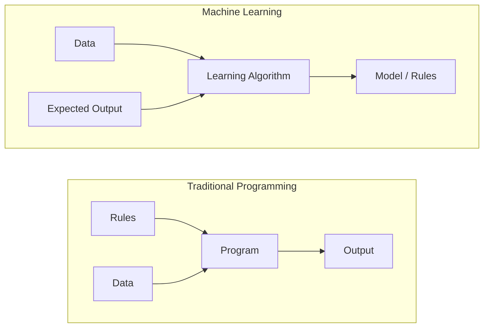
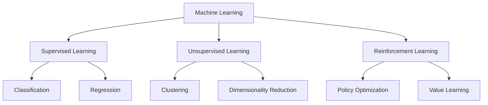
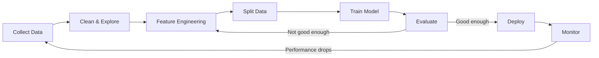
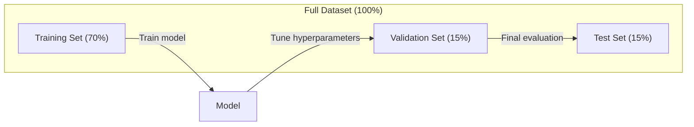
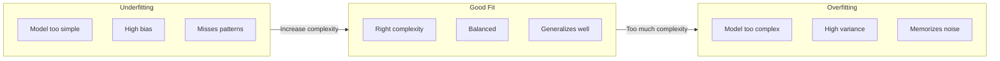
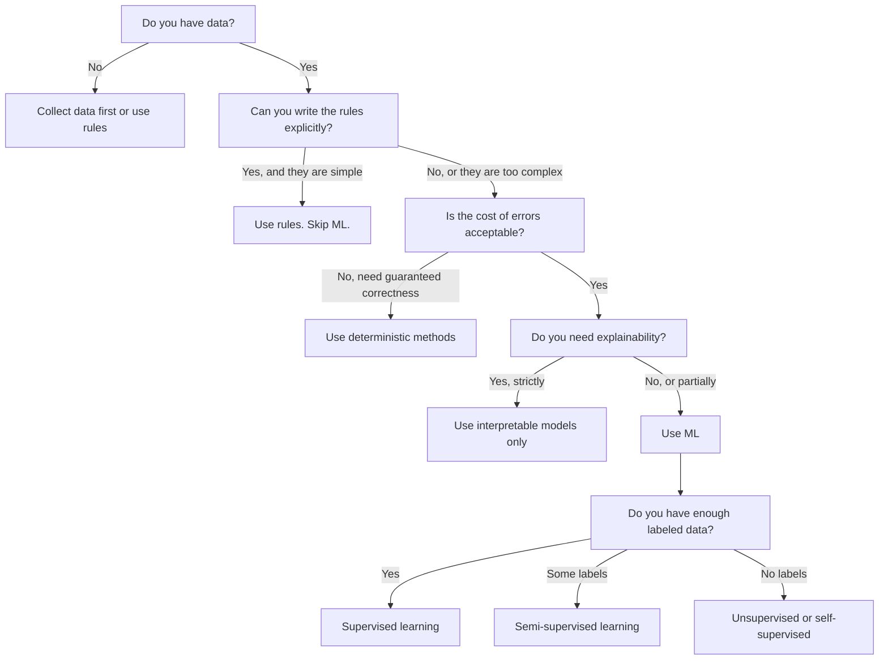

# 01 · 什么是机器学习

> 机器学习是教会计算机从数据中发现规律，而不是靠人手工编写规则。

**类型：** 学习
**语言：** Python
**前置：** 阶段 1（数学基础）
**时长：** 约 45 分钟

## 学习目标

- 解释「监督学习（supervised learning）」「无监督学习（unsupervised learning）」与「强化学习（reinforcement learning）」之间的区别，并判断给定问题适用哪一类
- 从零实现一个「最近质心分类器（nearest centroid classifier）」，并与随机基线进行对比评估
- 区分「分类（classification）」与「回归（regression）」任务，并为每类任务选择合适的损失函数
- 评估某个业务问题究竟适合用 ML 解决，还是用确定性规则解决更好

## 问题所在

你想做一个垃圾邮件过滤器。传统做法是：坐下来手写几百条规则。「如果邮件里包含 'FREE MONEY'，标记为垃圾邮件。如果有超过 3 个感叹号，标记为垃圾邮件。」你花了几周写规则。然后垃圾邮件发送者换了措辞。你的规则失效了。你又写更多规则。这个循环永无止境。

机器学习把这个思路反了过来。你不再编写规则，而是给计算机成千上万封带标签的邮件（「垃圾」或「非垃圾」），让它自己找出规则。计算机能发现你根本想不到的规律。当垃圾邮件发送者改变手法时，你只需在新数据上重新训练，而不是重写代码。

从「编程定规则」到「从数据中学习」的这一转变，正是机器学习的核心。每一个推荐引擎、语音助手、自动驾驶汽车和语言模型，都是这样工作的。

## 核心概念

### 从数据中学习，而非从规则中学习

传统编程和机器学习解决问题的方向恰好相反。



传统编程：你编写规则，程序把规则应用到数据上以产生输出。

机器学习：你提供数据和期望的输出，算法自己发现规则。

训练得到的「模型（model）」本身就是规则，只不过被编码成了数字（权重、参数）。它从见过的样本中泛化，从而对从未见过的数据做出预测。

### 机器学习的三种类型



**监督学习**：你拥有输入-输出成对的数据。模型学习把输入映射到输出。
- 「这里有 10000 张标注了猫或狗的照片，学会区分它们。」
- 「这里有房屋特征和价格，学会预测价格。」

**无监督学习**：你只有输入，没有标签。模型自己发现数据中的结构。
- 「这里有 10000 条客户购买记录，找出其中自然存在的分组。」
- 「这里有 1000 维的数据点，在保留结构的同时把它降到 2 维。」

**强化学习**：一个智能体（agent）在环境中采取动作，并获得奖励或惩罚。它学习一种策略（policy），以最大化总奖励。
- 「玩这个游戏。赢了 +1，输了 -1，自己琢磨出一套策略。」
- 「控制这只机械臂。抓起物体 +1，每浪费 1 秒 -0.01。」

实践中你将构建的大多数系统使用监督学习。无监督学习常用于预处理和探索性分析。强化学习则驱动着游戏 AI、机器人，以及用于语言模型的 RLHF。

### 超越三大类型

上面三个类别划分得很干净，但现实世界的 ML 常常会模糊这些界限。

**半监督学习（semi-supervised learning）** 同时使用少量带标签数据和大量无标签数据。比如你可能有 100 张带标签的医学影像和 100000 张无标签的。常见技术包括：

- **标签传播（label propagation）：** 构建一张连接相似数据点的图，标签沿着图从带标签的节点扩散到相邻的无标签节点。
- **伪标签（pseudo-labeling）：** 先在带标签数据上训练一个模型，用它为无标签数据预测标签，然后在全部数据上重新训练。模型自举出自己的训练集。
- **一致性正则化（consistency regularization）：** 模型对一个输入及其经过轻微扰动的版本应当给出相同的预测。即使没有标签，这一原则也成立。

**自监督学习（self-supervised learning）** 从数据本身创造监督信号，完全不需要人工标注。模型从数据的结构中为自己创造出一个预测任务。

- **掩码语言建模（masked language modeling，BERT）：** 遮住句子中 15% 的单词，训练模型预测被遮住的词。「标签」来自原始文本本身。
- **对比学习（contrastive learning，SimCLR）：** 取一张图像，创造两个增强版本。训练模型识别出它们来自同一张图像，同时把它们与其他图像的增强版本区分开。
- **下一词元预测（next-token prediction，GPT）：** 给定之前所有的词，预测下一个词。每一篇文本文档都成为一个训练样本。

这些并不是独立于三大类型之外的新类别。它们是结合了监督与无监督思想的策略。自监督学习从技术上讲属于监督学习（模型在预测某样东西），只不过标签是自动生成的，而非由人工提供。

### 分类 vs 回归

这是监督学习的两大主要任务。

| 方面 | 分类 | 回归 |
|--------|---------------|------------|
| 输出 | 离散类别 | 连续数值 |
| 示例 | 「这封邮件是垃圾邮件吗？」 | 「房价会是多少？」 |
| 输出空间 | {cat, dog, bird} | 任意实数 |
| 损失函数 | 交叉熵、准确率 | 均方误差、MAE |
| 决策 | 类别之间的边界 | 一条拟合数据的曲线 |

分类回答「属于哪个类别？」回归回答「是多少？」

有些问题两种方式都能套用。预测股票涨还是跌是分类，预测确切价格则是回归。

### 机器学习工作流

无论使用何种算法，每一个机器学习项目都遵循相同的流程。



**收集数据**：采集原始数据。数据越多几乎总是越好，但质量比数量更重要。

**清洗与探索**：处理缺失值、去除重复项、可视化分布、发现异常。这一步通常占整个项目时间的 60%-80%。

**特征工程**：把原始数据转换为模型可用的特征。把日期转成星期几，对数值列做归一化，对类别变量做编码。好的特征比花哨的算法更重要。

**划分数据**：拆分为训练集、验证集和测试集。模型在训练数据上训练，你在验证数据上调超参数，并在测试数据上报告最终性能。

**训练模型**：把训练数据喂给算法。算法调整内部参数，以最小化损失函数。

**评估**：在验证/测试数据上衡量性能。如果性能不达标，就回头尝试不同的特征、算法或超参数。

**部署**：把模型投入生产环境，让它对新数据做出预测。

**监控**：持续跟踪性能。数据分布会变化（数据漂移），模型会退化。当性能下降时，重新训练。

### 训练集、验证集与测试集的划分

这是初学者最容易搞错的概念。你必须在模型训练期间从未见过的数据上评估它，否则你衡量的是记忆能力，而不是学习能力。



| 划分 | 用途 | 何时使用 | 典型占比 |
|-------|---------|-----------|-------------|
| 训练集 | 模型从这部分数据中学习 | 训练期间 | 60-80% |
| 验证集 | 调超参数、比较模型 | 每次训练之后 | 10-20% |
| 测试集 | 最终的无偏性能估计 | 仅一次，在最后阶段 | 10-20% |

测试集是神圣不可侵犯的。你只能看它一次。如果你不断根据测试性能来调整模型，那实际上就是在测试集上训练，你报告的数字也就毫无意义了。

对于小数据集，可使用「k 折交叉验证（k-fold cross-validation）」：把数据分成 k 份，在其中 k-1 份上训练，在剩下的一份上验证，轮换进行，最后取结果的平均值。

### 过拟合 vs 欠拟合



**欠拟合（underfitting）**：模型太简单，无法捕捉数据中的规律。就像用一条直线去拟合一种弯曲的关系。训练误差高，测试误差也高。

**过拟合（overfitting）**：模型太复杂，把训练数据连同其中的噪声一起记了下来。就像一条蜿蜒曲折的曲线穿过了每一个训练点，却在新数据上失效。训练误差低，测试误差高。

**良好拟合（good fit）**：模型捕捉到了真实的规律，又没有记住噪声。训练误差和测试误差都相当低。

过拟合的征兆：
- 训练准确率远高于验证准确率
- 模型在训练数据上表现很好，但在新数据上表现很差
- 增加更多训练数据能提升性能（说明模型之前是在记忆，而不是在学习）

过拟合的修复办法：
- 获取更多训练数据
- 降低模型复杂度（更少的参数、更简单的架构）
- 正则化（对过大的权重施加惩罚）
- Dropout（训练期间随机将一部分神经元置零）
- 早停（early stopping，当验证误差开始上升时停止训练）

欠拟合的修复办法：
- 使用更复杂的模型
- 增加更多特征
- 减弱正则化
- 训练更久

### 偏差-方差权衡

这是过拟合与欠拟合背后的数学框架。

**偏差（bias）**：源于模型中错误假设的误差。当真实关系是非线性时，线性模型就具有高偏差。高偏差导致欠拟合。

**方差（variance）**：源于对训练数据中微小波动的敏感性的误差。一个高方差的模型，在不同的数据子集上训练时会给出差异很大的预测。高方差导致过拟合。

| 模型复杂度 | 偏差 | 方差 | 结果 |
|-----------------|------|----------|--------|
| 太低（用线性模型拟合弯曲数据） | 高 | 低 | 欠拟合 |
| 恰到好处 | 中 | 中 | 良好泛化 |
| 太高（用 20 次多项式拟合 10 个点） | 低 | 高 | 过拟合 |

总误差 = 偏差^2 + 方差 + 不可约噪声

你无法降低不可约噪声（它是数据本身的随机性）。你要做的是找到那个甜蜜点，使得 偏差^2 + 方差 最小。

### 没有免费午餐定理

不存在一种对所有问题都表现最佳的单一算法。在某一类问题上表现优异的算法，在另一类问题上会表现糟糕。这正是数据科学家会尝试多种算法并比较结果的原因。

实践中，选择取决于：
- 你有多少数据
- 有多少特征
- 关系是线性的还是非线性的
- 你是否需要可解释性
- 你能承担多少算力

### 什么时候不该用机器学习

ML 很强大，但并不总是正确的工具。在动手用模型之前，先问问你是否真的需要它。

**以下情况不要用 ML：**

- **规则简单且定义明确。** 税费计算、排序算法、单位换算。如果你能用几条 if 语句写出逻辑，那么用模型只会增加复杂度，毫无好处。
- **你没有数据，或数据极少。** ML 需要可供学习的样本。只有 10 个数据点，你训练不出任何有意义的东西。先去收集数据。
- **出错的代价是灾难性的，而你需要保证正确。** 医疗剂量计算、核反应堆控制、密码学校验。ML 模型是概率性的，它有时会出错。如果「有时出错」是不可接受的，请使用确定性方法。
- **一张查找表或一条启发式规则就能解决问题。** 如果一个简单的阈值或表格能覆盖 99% 的情况，那么引入 ML 只会增加维护成本，却带不来有意义的改进。
- **你无法解释决策，而可解释性又是必需的。** 受监管的行业（借贷、保险、刑事司法）有时要求每一个决策都能被完全解释。有些 ML 模型是可解释的（线性回归、小型决策树），但大多数不是。
- **问题变化得比你重新训练还快。** 如果规则每天都在变，而重新训练需要一周，那模型永远是过时的。

使用下面这张决策流程图：



## 动手构建

`code/ml_intro.py` 中的代码从零实现了一个「最近质心分类器」——可能是最简单的 ML 算法。它演示了核心思想：从数据中学习，然后对新数据进行预测。

### 第 1 步：从零实现最近质心分类器

最近质心分类器会计算训练数据中每个类别的中心（均值）。预测时，它把每个新数据点归到中心离它最近的那个类别。

```python
class NearestCentroid:
    def fit(self, X, y):
        self.classes = np.unique(y)
        self.centroids = np.array([
            X[y == c].mean(axis=0) for c in self.classes
        ])

    def predict(self, X):
        distances = np.array([
            np.sqrt(((X - c) ** 2).sum(axis=1))
            for c in self.centroids
        ])
        return self.classes[distances.argmin(axis=0)]
```

这就是整个算法。fit 计算两个均值，predict 计算距离。没有梯度下降，没有迭代，没有超参数。

### 第 2 步：在合成数据上训练

我们生成一个二维分类数据集，包含两个略有重叠的类别。质心分类器会在两个类别中心之间画出一条线性决策边界。

```python
rng = np.random.RandomState(42)
X_class0 = rng.randn(100, 2) + np.array([1.0, 1.0])
X_class1 = rng.randn(100, 2) + np.array([-1.0, -1.0])
X = np.vstack([X_class0, X_class1])
y = np.array([0] * 100 + [1] * 100)
```

### 第 3 步：与基线对比

每一个 ML 模型都应该与一个平凡的基线进行对比。这里，基线随机预测一个类别。如果你的 ML 模型连随机猜测都赢不了，那一定哪里出了问题。

```python
baseline_preds = rng.choice([0, 1], size=len(y_test))
baseline_acc = np.mean(baseline_preds == y_test)
```

在这个干净的数据集上，质心分类器应当能达到 90% 以上的准确率，而随机基线只有大约 50%。

### 为什么这很重要

最近质心分类器极其简单。它没有超参数、没有迭代、没有梯度下降。然而它却抓住了 ML 的根本范式：

1. 从训练数据中**学习**出一种表示（即质心）
2. 用这种表示对新数据进行**预测**（最近距离）
3. 与基线**评估**对比（随机猜测）

从逻辑回归到 Transformer，每一种 ML 算法都遵循这三步范式。表示会变得越来越复杂，但工作流始终不变。

### 第 4 步：质心分类器做不到什么

最近质心分类器假设每个类别都构成一个单一的团块。它画出的是线性决策边界。在以下情况下它会失效：

- 类别由多个簇构成（例如，数字「1」可以有好几种不同的写法）
- 决策边界是非线性的（例如，一个类别环绕在另一个类别外面）
- 各特征的尺度差异很大（距离会被尺度最大的特征所主导）

这些局限正是你将要学习的所有其他算法的动机所在。K 近邻能处理多个簇，决策树能处理非线性边界，特征缩放能解决尺度问题。每一课都建立在前一课的局限之上。

## 实际运用

sklearn 提供了 `NearestCentroid` 以及合成数据生成器：

```python
from sklearn.neighbors import NearestCentroid
from sklearn.datasets import make_classification
from sklearn.model_selection import train_test_split

X, y = make_classification(
    n_samples=500, n_features=2, n_redundant=0,
    n_clusters_per_class=1, random_state=42
)
X_train, X_test, y_train, y_test = train_test_split(X, y, test_size=0.3)

clf = NearestCentroid()
clf.fit(X_train, y_train)
print(f"Accuracy: {clf.score(X_test, y_test):.3f}")
```

## 交付成果

本课产出 `outputs/prompt-ml-problem-framer.md`——一个能把模糊的业务问题转化为具体 ML 任务的提示词。给它一段问题描述（「我们想降低客户流失」或「预测下季度的需求」），它就会识别出学习类型、定义预测目标、列出候选特征、挑选成功指标、确立基线，并标记出诸如数据泄漏或类别不平衡之类的陷阱。在任何 ML 项目开始时使用它，可以避免做出错误的东西。

## 关键术语

| 术语 | 人们口中的说法 | 它实际的含义 |
|------|----------------|----------------------|
| 模型（Model） | 「那个 AI」 | 一个带有可学习参数、把输入映射到输出的数学函数 |
| 训练（Training） | 「教 AI」 | 运行一个优化算法来调整模型参数，使预测匹配已知的输出 |
| 特征（Feature） | 「一个输入列」 | 数据中一个可度量的属性，模型用它来做预测 |
| 标签（Label） | 「答案」 | 训练样本的已知输出，用于计算误差信号 |
| 超参数（Hyperparameter） | 「一个你能调的设置」 | 在训练之前设定的参数，用于控制学习过程（学习率、层数） |
| 损失函数（Loss function） | 「模型错得有多离谱」 | 衡量预测输出与实际输出之间差距的函数，训练的目标就是最小化它 |
| 过拟合（Overfitting） | 「它把测试题背下来了」 | 模型学到的是训练数据特有的噪声而非通用规律，因此在新数据上失效 |
| 欠拟合（Underfitting） | 「它啥也没学到」 | 模型太简单，无法捕捉数据中真实的规律 |
| 泛化（Generalization） | 「它在新数据上也好使」 | 模型对其未曾训练过的数据做出准确预测的能力 |
| 交叉验证（Cross-validation） | 「在不同的数据块上测试」 | 反复把数据划分成训练/测试折并取平均结果，给出更稳健的性能估计 |
| 正则化（Regularization） | 「让权重保持小一点」 | 在损失函数中加入一个惩罚项，抑制过于复杂的模型 |
| 数据漂移（Data drift） | 「世界变了」 | 进入系统的数据的统计分布随时间发生变化，导致模型性能退化 |

## 练习

1. 选取任意一个数据集（例如 Iris、Titanic）。按 70/15/15 划分为训练/验证/测试集。解释为什么你不应该在测试集上调超参数。
2. 列出三个现实世界中的问题。对每一个，判断它属于分类、回归还是聚类，以及它是监督的还是无监督的。
3. 某个模型在训练数据上达到 99% 准确率，但在测试数据上只有 60%。诊断问题所在，并列出你会尝试的三种修复办法。

## 延伸阅读

- [An Introduction to Statistical Learning](https://www.statlearning.com/) - 免费教材，用实用示例涵盖了所有经典 ML 方法
- [Google's Machine Learning Crash Course](https://developers.google.com/machine-learning/crash-course) - 简洁、可视化的 ML 概念入门
- [Scikit-learn User Guide](https://scikit-learn.org/stable/user_guide.html) - 用 Python 实现 ML 的实用参考手册
