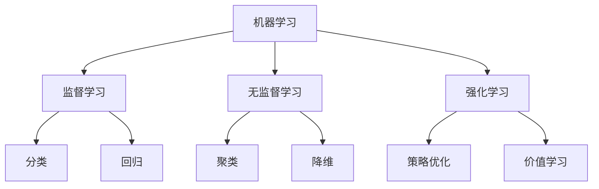
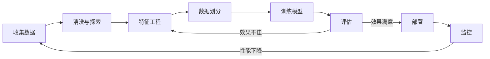
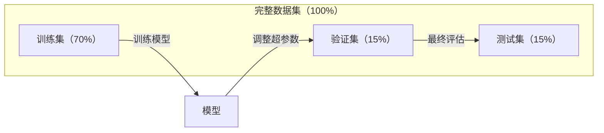
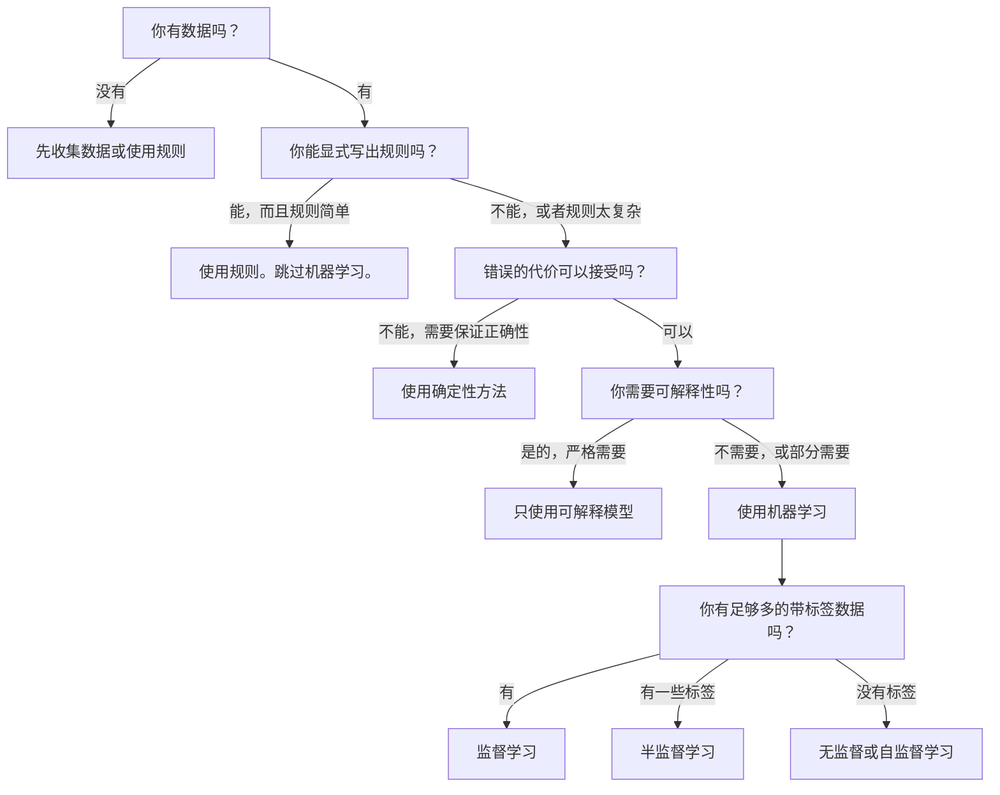

# 什么是机器学习

> 机器学习是教会计算机从数据中发现模式，而不是手动编写规则。

**类型:** 学习
**语言:** Python
**先修知识:** 阶段1（数学基础）
**时间:** 约45分钟

## 学习目标

- 解释监督学习、无监督学习和强化学习之间的区别，并识别给定问题属于哪种类型
- 从头实现一个最近质心分类器，并对照随机基线进行评估
- 区分分类任务和回归任务，并为每种任务选择适当的损失函数
- 评估给定的业务问题是否适合使用机器学习，还是用确定性规则解决更好

## 问题

你想构建一个垃圾邮件过滤器。传统方法是坐下来编写数百条规则："如果邮件包含'免费赚钱'，标记为垃圾邮件。如果感叹号超过3个，标记为垃圾邮件。"你花几周时间写规则。然后垃圾邮件发送者改变了措辞。你的规则失效了。你编写更多规则。这个循环永无止境。

机器学习扭转了这一局面。你不再编写规则，而是给计算机数千封带标签的邮件（"垃圾"或"非垃圾"），让它自己找出规则。计算机会发现你从未想过的模式。当垃圾邮件发送者改变策略时，你用新数据重新训练模型，而不是重写代码。

这种从"编程规则"到"从数据中学习"的转变是机器学习的核心。每一个推荐引擎、语音助手、自动驾驶汽车和语言模型都是这样工作的。

## 概念

### 从数据中学习，而非规则

传统编程和机器学习以相反的方向解决问题。


传统编程：你编写规则。程序将这些规则应用于数据以产生输出。

机器学习：你提供数据和预期输出。算法发现规则。

训练完成后得到的"模型"就是规则，以数字（权重、参数）形式编码。模型从见过的例子中泛化，对从未见过的数据进行预测。

### 三种机器学习类型



**监督学习（Supervised Learning）**：你有输入-输出对。模型学习如何将输入映射到输出。
- "这里有10,000张标有猫或狗的照片。学会区分它们。"
- "这里有房子的特征和价格。学会预测价格。"

**无监督学习（Unsupervised Learning）**：你只有输入，没有标签。模型自行发现结构。
- "这里有10,000条客户购买历史记录。找到自然的群组。"
- "这里有1000维的数据点。在保持结构的同时降到2维。"

**强化学习（Reinforcement Learning）**：智能体（Agent）在环境中执行动作并接收奖励或惩罚。它学习一种策略（Policy）以最大化总奖励。
- "玩这个游戏。赢了+1分，输了-1分。找出一套策略。"
- "控制这个机械臂。拿起物体+1分，每浪费一秒-0.01分。"

你在实践中构建的大多数东西都使用监督学习。无监督学习常用于预处理和探索。强化学习为游戏AI、机器人学和语言模型的RLHF提供动力。

### 三大类之外的扩展

上述三类很清晰，但现实中的机器学习常常模糊了界限。

**半监督学习（Semi-supervised learning）** 使用少量带标签数据和大量无标签数据。你可能拥有100张带标签的医学图像和100,000张无标签图像。技术包括：

- **标签传播（Label propagation）：** 构建一个连接相似数据点的图。标签通过图从带标签节点传播到无标签邻居。
- **伪标签（Pseudo-labeling）：** 在带标签数据上训练模型，用它预测无标签数据的标签，然后在所有数据上重新训练。模型自举自己的训练集。
- **一致性正则化（Consistency regularization）：** 模型应该对输入及其轻微扰动版本给出相同的预测。这在没有标签的情况下也有效。

**自监督学习（Self-supervised learning）** 从数据本身创建监督信号，根本不需要人工标签。模型从数据的结构中创建自己的预测任务。

- **掩码语言建模（Masked language modeling，BERT）：** 隐藏句子中15%的词，训练模型预测缺失的词。"标签"来自原始文本。
- **对比学习（Contrastive learning，SimCLR）：** 取一张图像，创建两个增强版本。训练模型识别它们来自同一图像，同时将它们与其他图像的增强版本区分开。
- **下一个词预测（Next-token prediction，GPT）：** 给定所有之前的词，预测下一个词。每一个文本文档都成为一个训练示例。

这些并不是独立于三大类之外的分类。它们是结合监督和无监督思想的策略。自监督学习在技术上是监督学习（模型预测某个东西），但标签是自动生成的，而不是由人创建的。

### 分类 vs 回归

这是两个主要的监督学习任务。

| 方面 | 分类 | 回归 |
|--------|---------------|------------|
| 输出 | 离散类别 | 连续数值 |
| 示例 | "这封邮件是垃圾邮件吗？" | "房价会是多少？" |
| 输出空间 | {猫, 狗, 鸟} | 任意实数 |
| 损失函数 | 交叉熵、准确率 | 均方误差、MAE |
| 决策 | 类之间的边界 | 拟合数据的曲线 |

分类回答"属于哪个类别？"回归回答"多少？"

有些问题可以用两种方式来框架化。预测股票是涨还是跌是分类。预测确切价格是回归。

### 机器学习工作流程

每个机器学习项目都遵循相同的流水线，无论算法如何。



**收集数据（Collect Data）**：收集原始数据。数据越多通常越好，但质量比数量更重要。

**清洗与探索（Clean & Explore）**：处理缺失值、删除重复项、可视化分布、发现异常。这一步通常占项目总时间的60-80%。

**特征工程（Feature Engineering）**：将原始数据转换为模型可以使用的特征。将日期转换为星期几。归一化数值列。编码分类变量。好的特征比花哨的算法更重要。

**数据划分（Split Data）**：划分为训练集、验证集和测试集。模型在训练集上训练，你在验证集上调整超参数，在测试集上报告最终性能。

**训练模型（Train Model）**：将训练数据输入算法。算法调整内部参数以最小化损失函数。

**评估（Evaluate）**：在验证/测试集上测量性能。如果性能不可接受，返回并尝试不同的特征、算法或超参数。

**部署（Deploy）**：将模型投入生产环境，对新数据进行预测。

**监控（Monitor）**：随时间跟踪性能。数据分布会变化（数据漂移），模型会退化。当性能下降时，重新训练。

### 训练集、验证集和测试集的划分

这是初学者最容易搞错的最重要概念。你必须用训练过程中从未见过的数据来评估模型。否则你测量的是记忆而非学习。



| 划分 | 目的 | 何时使用 | 典型大小 |
|-------|---------|-----------|-------------|
| 训练集 | 模型从这些数据中学习 | 训练期间 | 60-80% |
| 验证集 | 调整超参数、比较模型 | 每次训练后 | 10-20% |
| 测试集 | 最终无偏性能估计 | 仅一次，在最后 | 10-20% |

测试集是神圣的。你只能看它一次。如果你根据测试性能不断调整模型，你实际上是在测试集上进行训练，你报告的数字将毫无意义。

对于小数据集，使用k折交叉验证：将数据分成k份，在k-1份上训练，在剩下的一份上验证，轮换并平均结果。

### 过拟合 vs 欠拟合


**欠拟合（Underfitting）**：模型过于简单，无法捕捉数据中的模式。一条直线试图拟合一个曲线关系。训练误差高，测试误差高。

**过拟合（Overfitting）**：模型过于复杂，记忆了训练数据及其噪声。一条曲折的曲线穿过了每个训练点，但在新数据上失败。训练误差低，测试误差高。

**良好拟合（Good fit）**：模型捕捉了真实的模式，没有记忆噪声。训练误差和测试误差都相当低。

过拟合的迹象：
- 训练准确率远高于验证准确率
- 模型在训练数据上表现良好，但在新数据上表现差
- 增加更多训练数据会提升性能（模型在记忆而非学习）

过拟合的解决方案：
- 获取更多训练数据
- 降低模型复杂度（更少的参数、更简单的架构）
- 正则化（为大权重添加惩罚）
- Dropout（在训练期间随机将神经元置零）
- 早停（当验证误差开始增大时停止训练）

欠拟合的解决方案：
- 使用更复杂的模型
- 添加更多特征
- 减少正则化
- 训练更长时间

### 偏差-方差权衡

这是过拟合和欠拟合背后的数学框架。

**偏差（Bias）**：由模型中的错误假设引起的误差。当真实关系是非线性时，线性模型具有高偏差。高偏差导致欠拟合。

**方差（Variance）**：由对训练数据微小波动的敏感性引起的误差。高方差模型在不同数据子集上训练时会给出差异很大的预测。高方差导致过拟合。

| 模型复杂度 | 偏差 | 方差 | 结果 |
|-----------------|------|----------|--------|
| 太低（用线性模型拟合曲线数据） | 高 | 低 | 欠拟合 |
| 恰到好处 | 中等 | 中等 | 良好泛化 |
| 太高（用20次多项式拟合10个点） | 低 | 高 | 过拟合 |

总误差 = 偏差² + 方差 + 不可约噪声

你无法减少不可约噪声（它是数据本身的随机性）。你需要找到偏差² + 方差最小化的最佳点。

### 没有免费午餐定理

没有一个算法对所有问题都工作得最好。在一个问题类别上表现好的算法在另一个类别上可能表现差。这就是为什么数据科学家会尝试多种算法并比较结果。

在实践中，选择取决于：
- 你拥有多少数据
- 有多少个特征
- 关系是线性还是非线性
- 你是否需要可解释性
- 你可以承担多少计算量

### 何时不使用机器学习

机器学习很强大，但并非总是合适的工具。在使用模型之前，先问问你是否真的需要它。

**在以下情况下不要使用机器学习：**

- **规则简单且定义明确。** 税收计算、排序算法、单位换算。如果你能用几个if语句写出逻辑，模型只会增加复杂性而无益处。
- **你没有数据或数据极少。** 机器学习需要例子来学习。只有10个数据点，你无法训练任何有意义的东西。先收集数据。
- **错误的代价是灾难性的，且需要保证正确性。** 医疗剂量计算、核反应堆控制、密码验证。机器学习模型是概率性的，有时会出错。如果"偶尔出错"不可接受，请使用确定性方法。
- **查找表或启发式方法就能解决问题。** 如果简单的阈值或表覆盖了99%的情况，添加机器学习会增加维护成本而没有实质性的改进。
- **你无法解释决策，且可解释性是必需的。** 受监管行业（贷款、保险、刑事司法）有时要求每个决策都能完全解释。一些机器学习模型是可解释的（线性回归、小型决策树），但大多数不是。
- **问题变化的速度快于你重新训练的速度。** 如果规则每天改变，而重新训练需要一周，模型总是过时的。

使用这个决策流程图：



## 动手构建

`code/ml_intro.py` 中的代码从头实现了一个最近质心分类器，这是最简单的机器学习算法。它演示了核心思想：从数据中学习，然后在新数据上进行预测。

### 第一步：从头实现最近质心分类器

最近质心分类器计算训练数据中每个类别的中心（均值）。预测时，它将每个新点分配给中心最近的类别。

```python
class NearestCentroid:
    def fit(self, X, y):
        self.classes = np.unique(y)
        self.centroids = np.array([
            X[y == c].mean(axis=0) for c in self.classes
        ])

    def predict(self, X):
        distances = np.array([
            np.sqrt(((X - c) ** 2).sum(axis=1))
            for c in self.centroids
        ])
        return self.classes[distances.argmin(axis=0)]
```

这就是整个算法。`fit` 计算两个均值，`predict` 计算距离。没有梯度下降，没有迭代，没有超参数。

### 第二步：在合成数据上训练

我们生成一个二维分类数据集，有两个略有重叠的类别。质心分类器在类别中心之间画出一条线性决策边界。

```python
rng = np.random.RandomState(42)
X_class0 = rng.randn(100, 2) + np.array([1.0, 1.0])
X_class1 = rng.randn(100, 2) + np.array([-1.0, -1.0])
X = np.vstack([X_class0, X_class1])
y = np.array([0] * 100 + [1] * 100)
```

### 第三步：与基线比较

每个机器学习模型都应该与一个简单的基线进行比较。这里基线随机预测一个类别。如果你的机器学习模型没有超过随机猜测，那么有问题。

```python
baseline_preds = rng.choice([0, 1], size=len(y_test))
baseline_acc = np.mean(baseline_preds == y_test)
```

在这个干净的数据集上，质心分类器应该达到90%以上的准确率。随机基线大约50%。

### 为什么这很重要

最近质心分类器非常简单。它没有超参数、没有迭代、没有梯度下降。但它捕捉了机器学习的基本模式：

1. **学习**从训练数据中得到的表示（质心）
2. **预测**使用该表示的新数据（最近距离）
3. **评估**与基线比较（随机猜测）

从逻辑回归到Transformer，每一个机器学习算法都遵循这个三步模式。表示变得越来越复杂，但工作流程保持不变。

### 第四步：质心分类器不能做什么

最近质心分类器假设每个类别形成一个单一的团块。它画出线性决策边界。当以下情况时它失效：

- 类别有多个簇（例如，数字"1"可以有多种写法）
- 决策边界是非线性的（例如，一个类别包裹着另一个类别）
- 特征具有非常不同的尺度（距离被最大尺度的特征主导）

这些局限性推动了你会学到的其他每一个算法。K近邻处理多个簇，决策树处理非线性边界，特征缩放解决尺度问题。每节课都建立在前一