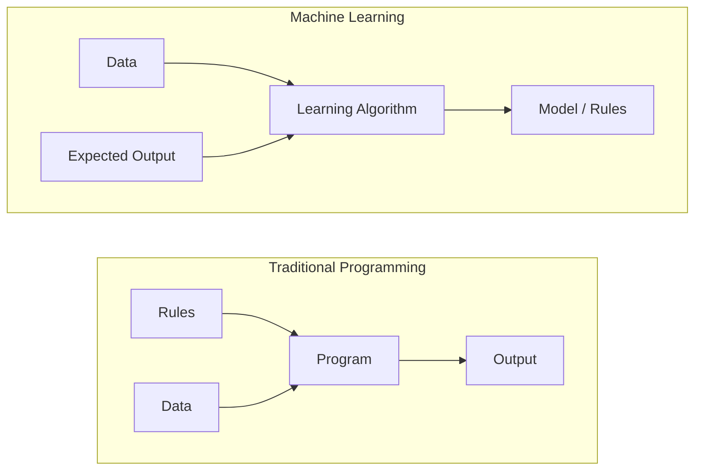
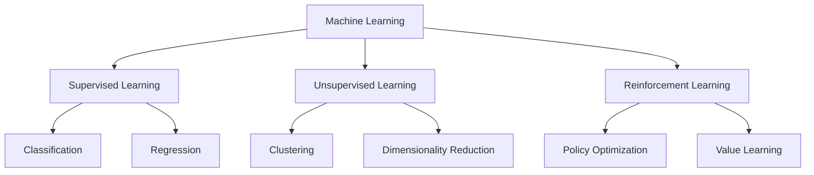
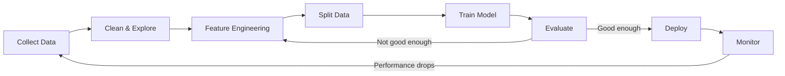
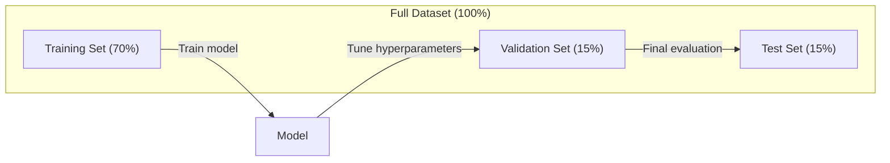
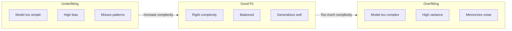
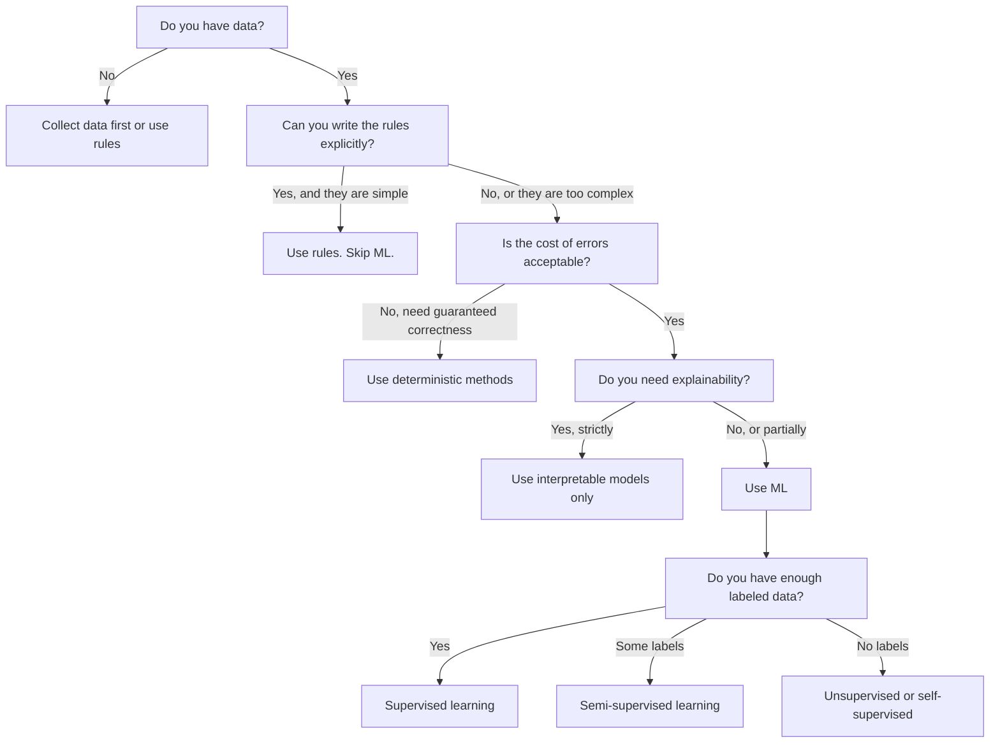

# What Is Machine Learning

> 机器学习正在教计算机在数据中找到模式，而不是手工编写规则。

** 类型：** 学习
** 语言：** Python
** 先决条件：** 第一阶段（数学基础）
** 时间：** ~45分钟

## Learning Objectives

- 解释有监督、无监督和强化学习之间的区别，并确定哪种类型适用于给定问题
- 从头开始实施最近的重心分类器，并根据随机基线对其进行评估
- 区分分类任务和回归任务，并为每个任务选择适当的损失函数
- 评估给定的业务问题是否适合ML或使用确定性规则更好地解决

## The Problem

你想建立一个垃圾邮件过滤器。传统的方法是：坐下来写几百条规则。“如果邮件包含'免费'，标记为垃圾邮件。如果它有3个以上的感叹号，标记为垃圾邮件。“你花了几周的时间写规则。然后垃圾邮件发送者改变措辞。你的规则被打破了。你写更多规则。循环永远不会结束。

机器学习颠覆了这一点。您没有编写规则，而是向计算机提供数千封贴有标签的电子邮件（“垃圾邮件”或“非垃圾邮件”），然后让它自己弄清楚规则。计算机会找到您从未想过的模式。当垃圾邮件发送者改变策略时，您会重新训练新数据，而不是重写代码。

这种从“编程规则”到“从数据中学习”的转变是机器学习的核心。每个推荐引擎、语音助手、自动驾驶汽车和语言模型都是这样工作的。

## The Concept

### Learning From Data, Not Rules

传统编程和机器学习解决相反方向的问题。



传统编程：你编写规则。该程序将它们应用于数据以产生输出。

机器学习：您提供数据和预期输出。算法发现规则。

训练产生的“模型”是规则，编码为数字（权重、参数）。它根据所见过的例子进行概括，对从未见过的数据进行预测。

### The Three Types of Machine Learning



** 监督学习 **：您有输入-输出对。该模型学会将输入映射到输出。
- “这里有10，000张贴上猫或狗标签的照片。学会区分它们。"
- “这是房子的特点和价格。学会预测价格。"

** 无监督学习 **：您只有输入。没有标签。该模型自己发现结构。
- “这里有10，000个客户购买历史记录。找到自然分组。"
- “这里有1，000个维度数据点。在保持结构的同时减少到2维。"

** 强化学习 **：代理在环境中采取行动并接受奖励或惩罚。它学习最大化总回报的策略（政策）。
- “玩这个游戏。+1代表获胜，-1代表失败。制定一个策略。"
- “控制这个机器人手臂。+1用于拾取物体，浪费每一秒-0.01。"

您在实践中构建的大部分内容都使用监督学习。无监督学习在预处理和探索中很常见。强化学习为游戏人工智能、机器人和RL HF语言模型提供动力。

### Beyond the Big Three

上面的三个类别很干净，但现实世界的ML经常模糊界限。

** 半监督学习 ** 使用一小组标记数据和一大组未标记数据。您可能有100张已标记的医学图像和100，000张未标记的医学图像。技术包括：

- ** 标签传播：** 构建连接相似数据点的图表。标签通过图从已标记的节点传播到未标记的邻居。
- ** 伪标签：** 在已标记的数据上训练模型，使用它来预测未标记数据的标签，然后对所有内容进行重新训练。该模型引导自己的训练集。
- ** 一致性正规化：** 模型应该为输入和该输入的轻微扰动版本给出相同的预测。即使没有标签，这也有效。

** 自我监督学习 ** 从数据本身创建监督。根本不需要人类标签。该模型根据数据结构创建自己的预测任务。

- ** 掩蔽语言建模（BERT）：** 隐藏句子中15%的单词，训练模型以预测缺失的单词。“标签”来自原文。
- ** 对比学习（Simpson）：** 拍摄一张图像，创建两个增强版本。训练模型识别它们来自同一图像，同时将它们与其他图像的增强版本区分开来。
- ** 下一个令牌预测（GPT）：** 给定所有之前的单词，预测下一个单词。每个文本文档都成为一个训练示例。

这些并不是与三大类分开的类别。它们是结合有监督和无监督想法的策略。自我监督学习在技术上是监督的（模型预测某些东西），但标签是自动生成的，而不是由人类生成的。

### Classification vs Regression

这是两个主要的监督学习任务。

| 方面 | 分类 | 回归 |
|--------|---------------|------------|
| 输出 | 离散类别 | 连续数目 |
| 例如 | “这是垃圾邮件吗？" | “房价会是多少？" |
| 输出空间 | {cat，狗，鸟} | 任意实数 |
| 损失函数 | 交叉信息、准确性 | 均方误差，MAE |
| 决定 | 班级之间的界限 | 符合数据的曲线 |

分类回答“哪个类别？“回归回答”多少？"

有些问题可以用任何一种方式来界定。预测股票上涨或下跌属于分类。预测确切的价格是回归。

### The ML Workflow

无论算法如何，每个机器学习项目都遵循相同的管道。



** 收集数据 **：收集原始数据。更多的数据几乎总是更好，但质量比数量更重要。

** 清理和探索 **：处理缺失值、删除重复项、可视化分布、发现异常。此步骤通常占用项目总时间的60-80%。

** 特征工程 **：将原始数据转换为模型可以使用的特征。将日期变成一周中的一天。规范数字列。编码类别变量。好的功能比花哨的算法更重要。

** 拆分数据 **：分为训练集、验证集和测试集。该模型根据训练数据进行训练，调整验证数据上的超参数，然后报告测试数据上的最终性能。

** 训练模型 **：将训练数据输入算法。该算法调整内部参数以最小化损失函数。

** 评估 **：衡量验证/测试数据的性能。如果性能不可接受，请返回并尝试不同的功能、算法或超参数。

** 部署 **：将模型投入生产，对新数据进行预测。

** 监视器 **：跟踪一段时间内的表现。数据分布发生变化（数据漂移），模型退化。当表现下降时，重新培训。

### Training, Validation, and Test Splits

这是初学者犯错误的最重要的概念。您必须根据训练期间从未见过的数据来评估您的模型。否则，你测量的是记忆，而不是学习。



| 分裂 | 目的 | 使用时 | 典型尺寸 |
|-------|---------|-----------|-------------|
| 培训 | 模型从这些数据中学习 | 在训练期间 | 60-80% |
| 验证 | 调整超参数、比较模型 | 每次训练跑后 | 10-20% |
| 测试 | 最终无偏见的性能估计 | 曾经，在最后 | 10-20% |

测试集是神圣的。你只看一次。如果您不断根据测试性能调整模型，那么您就有效地在测试集上进行训练，并且您报告的数字毫无意义。

对于小型数据集，请使用k重交叉验证：将数据拆分为k个部分，训练k-1个部分，验证剩余部分，旋转和平均结果。

### Overfitting vs Underfitting



** 不足 **：模型太简单，无法捕捉数据中的模式。一条试图适应曲线关系的直线。训练误差很高。测试误差很高。

** 过度fitting **：模型太复杂并且记忆训练数据，包括其噪音。一条蜿蜒的曲线，经过每个训练点，但在新数据上失败。训练误差较低。测试误差很高。

** 很适合 **：该模型在不记住噪音的情况下捕捉真实的模式。训练误差和测试误差都相当低。

过度贴合的迹象：
- 训练准确率远高于验证准确率
- 该模型在训练数据上表现良好，但在新数据上表现不佳
- 添加更多的训练数据可以提高性能（模型是记忆，而不是学习）

修复过度贴合：
- 获取更多训练数据
- 降低模型复杂性（参数更少，架构更简单）
- 正规化（对大权重添加处罚）
- 辍学（训练期间随机将神经元归零）
- 提前停止（当验证错误开始增加时停止训练）

修复不足：
- 使用更复杂的模型
- 添加更多的功能
- 减少正规化
- 训练时间更长

### The Bias-Variance Tradeoff

这是过度配合和不足配合背后的数学框架。

** 偏差 **：模型中错误假设造成的错误。当真实关系是非线性时，线性模型具有高偏差。高度偏见导致不适合。

** 方差 **：训练数据中微小波动的敏感性误差。当在不同的数据子集上训练时，具有高方差的模型会给出非常不同的预测。高方差会导致过度适应。

| 模型复杂性 | 偏置 | 方差 | 结果 |
|-----------------|------|----------|--------|
| 太低（曲线数据的线性模型） | 高 | 低 | 欠拟合 |
| 恰到好处 | 介质 | 介质 | 良好的泛化 |
| 太高（10个点的20次多项式） | 低 | 高 | 过拟合 |

总误差=偏差' 2+方差+不可约噪音

您无法减少不可约的噪音（它是数据本身的随机性）。您想要找到最小化偏差' 2+方差的最佳点。

### No Free Lunch Theorem

没有一种算法可以最好地解决每个问题。在一类问题上表现良好的算法在另一类问题上表现不佳。这就是数据科学家尝试多种算法并比较结果的原因。

在实践中，选择取决于：
- 您有多少数据
- 有多少功能
- 关系是线性还是非线性
- 是否需要可解释性
- 您可以负担多少计算费用

### When NOT to Use Machine Learning

ML很强大，但并不总是正确的工具。在寻找模型之前，请询问您是否真的需要一个。

** 在以下情况下请勿使用ML：**

- ** 规则简单且定义明确。**税收计算、排序算法、单位转换。如果您可以用几个if-陈述来编写逻辑，那么模型就会增加复杂性，而没有任何好处。
- ** 您没有数据或数据很少。** ML需要例子来学习。有了10个数据点，您无法训练任何有意义的东西。先收集数据。
- ** 错误的代价是灾难性的，您需要保证正确性。**医疗剂量计算、核反应堆控制、密码验证。ML模型是概率的。他们有时会错。如果“有时是错误的”是不可接受的，请使用确定性方法。
- ** 查找表或启发式解决问题。**如果简单的阈值或表涵盖99%的情况，则添加ML会增加维护成本，而不会有意义的改进。
- ** 您无法解释该决定，需要解释性。**受监管的行业（贷款、保险、刑事司法）有时要求每一个决定都可以完全解释。一些ML模型是可解释的（线性回归、小决策树）。大多数不是。
- ** 问题的变化速度比您重新培训的速度还要快。**如果规则每天都在变化，再培训需要一周的时间，那么模型总是陈旧的。

使用此决策流程图：



## Build It

' code/ml_intro.py '中的代码从头开始实现最接近的重心分类器，这是最简单的ML算法。它展示了核心理念：从数据中学习，然后根据新数据进行预测。

### Step 1: Nearest Centroid Classifier from Scratch

最近的重心分类器计算训练数据中每个类别的中心（平均值）。为了进行预测，它将每个新点分配给中心最近的类。

```python
class NearestCentroid:
    def fit(self, X, y):
        self.classes = np.unique(y)
        self.centroids = np.array([
            X[y == c].mean(axis=0) for c in self.classes
        ])

    def predict(self, X):
        distances = np.array([
            np.sqrt(((X - c) ** 2).sum(axis=1))
            for c in self.centroids
        ])
        return self.classes[distances.argmin(axis=0)]
```

这就是整个算法。Fit计算两种平均值。预测计算距离。没有梯度下降、没有迭代、没有超参数。

### Step 2: Train on Synthetic Data

我们生成一个2D分类数据集，其中两个类略有重叠。质心分类器在类中心之间绘制线性决策边界。

```python
rng = np.random.RandomState(42)
X_class0 = rng.randn(100, 2) + np.array([1.0, 1.0])
X_class1 = rng.randn(100, 2) + np.array([-1.0, -1.0])
X = np.vstack([X_class0, X_class1])
y = np.array([0] * 100 + [1] * 100)
```

### Step 3: Compare Against a Baseline

每个ML模型都应该与微不足道的基线进行比较。在这里，基线预测随机类别。如果您的ML模型无法击败随机猜测，那么就出了问题。

```python
baseline_preds = rng.choice([0, 1], size=len(y_test))
baseline_acc = np.mean(baseline_preds == y_test)
```

重心分类器在这个干净的数据集上的准确性应该达到90%以上。随机基线达到50%左右。

### Why This Matters

最近的重心分类器非常简单。它没有超参数、没有迭代、没有梯度下降。然而它捕捉到了基本的ML模式：

1. ** 学习 ** 来自训练数据的表示（重心）
2. ** 使用该表示法（最近距离）预测 ** 新数据
3. ** 对照基线评估 **（随机猜测）

从逻辑回归到变换器，每个ML算法都遵循相同的三步模式。表示变得更加复杂，但工作流程保持不变。

### Step 4: What the Centroid Classifier Cannot Do

最近的重心分类器假设每个类形成一个斑点。它划定了线性决策边界。当以下情况时，它就会失败：

- 类具有多个集群（例如，数字“1”可以用几种不同的方式写成）
- 决策边界是非线性的（例如，一个班级包裹着另一个班级）
- 要素的比例非常不同（距离由最大比例的要素决定）

这些限制激励您将学习的所有其他算法。K近邻处理多个集群。决策树处理非线性边界。特征缩放解决了缩放问题。每一课都建立在前一课的局限性之上。

## Use It

sklearn提供“NearestCentroid”和合成数据生成器：

```python
from sklearn.neighbors import NearestCentroid
from sklearn.datasets import make_classification
from sklearn.model_selection import train_test_split

X, y = make_classification(
    n_samples=500, n_features=2, n_redundant=0,
    n_clusters_per_class=1, random_state=42
)
X_train, X_test, y_train, y_test = train_test_split(X, y, test_size=0.3)

clf = NearestCentroid()
clf.fit(X_train, y_train)
print(f"Accuracy: {clf.score(X_test, y_test):.3f}")
```

## Ship It

本课将生成“oututs/prompt-ml-problem-framer.md”--一个将模糊的业务问题转化为具体的ML任务的提示。为它提供问题描述（“我们希望减少流失”或“预测下一季度的需求”），它就会识别学习类型、定义预测目标、列出候选功能、选择成功指标、建立基线并标记数据泄露或类别失衡等陷阱。在任何ML项目的开始时使用它，以避免构建错误的东西。

## Key Terms

| Term | 别人怎么说 | 它实际上意味着什么 |
|------|----------------|----------------------|
| 模型 | “人工智能” | 具有可学习参数的数学函数，将输入映射到输出 |
| 培训 | “教人工智能” | 运行优化算法来调整模型参数，使预测与已知输出相匹配 |
| 特征 | “输入列” | 模型用于进行预测的数据的可测量属性 |
| 标签 | “答案” | 训练示例的已知输出，用于计算误差信号 |
| 超参数 | “你调整的设置” | 训练前设置的控制学习过程的参数（学习率、层数） |
| 损失函数 | “这个模型有多错误” | 测量预测输出和实际输出之间差距的函数，培训试图将其最小化 |
| 过拟合 | “它记住了考试” | 该模型学习的是训练特定的噪音，而不是一般模式，因此在新数据上失败 |
| 欠拟合 | “它什么也没学到” | 该模型过于简单，无法捕捉数据中的真实模式 |
| 泛化 | “它适用于新数据” | 该模型能够对未训练的数据进行准确预测 |
| 交叉验证 | “在不同的块上进行测试” | 重复将数据拆分为训练/测试折叠并求平均结果，从而提供更稳健的性能估计 |
| 正则化 | “保持体重较小” | 在损失函数中添加惩罚项，阻止过于复杂的模型 |
| 数据漂移 | “世界改变了” | 输入数据的统计分布会随着时间的推移而变化，从而降低模型性能 |

## Exercises

1. 取任何数据集（例如，艾里斯，泰坦尼克号）。将其70/15/15分为训练/验证/测试。解释为什么不应该在测试集中调整超参数。
2. 列出三个现实世界的问题。对于每一个，确定它是分类、回归还是集群，以及它是有监督的还是无监督的。
3. 模型在训练数据上的准确率为99%，但在测试数据上的准确率为60%。诊断问题并列出您试图解决的三件事。

## Further Reading

- [An统计学习简介]（https：//www.statlearning.com/）-免费教科书，涵盖所有经典ML方法和实际示例
- [Google的机器学习速成课程]（https：//developers.google.com/machine-learning/crash-course）-ML概念的简洁视觉介绍
- [Scikit-learn用户指南]（https：//scikit-learn.org/stable/user_guide.html）-在Python中实现ML的实用参考
