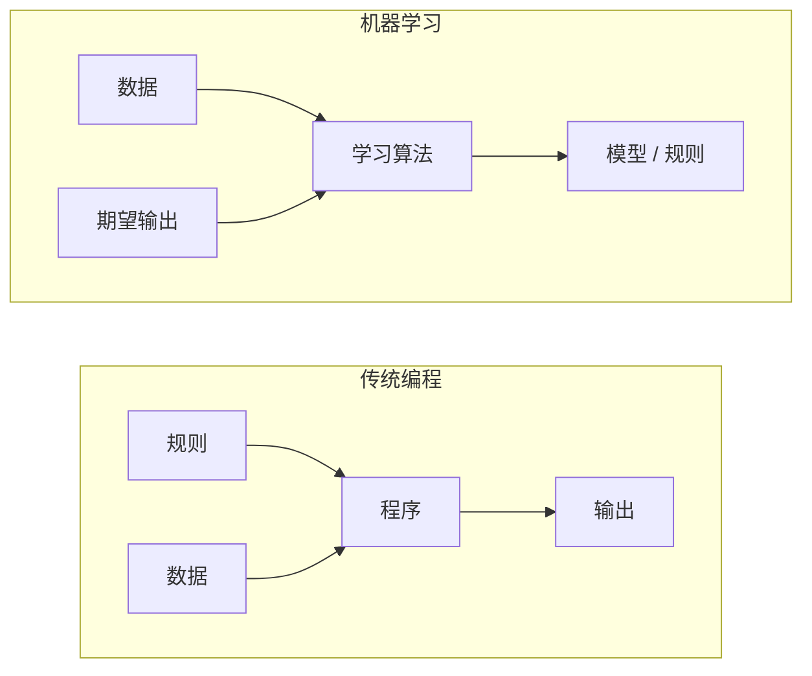
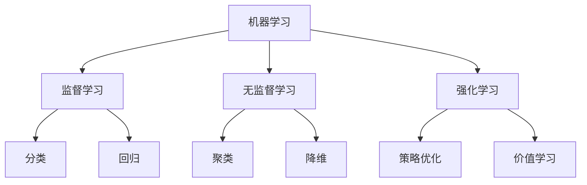
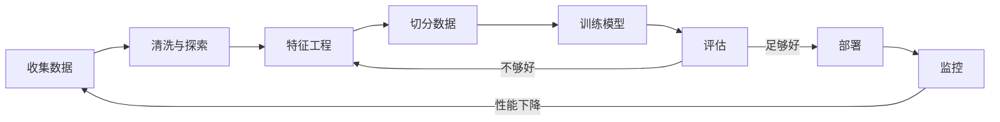
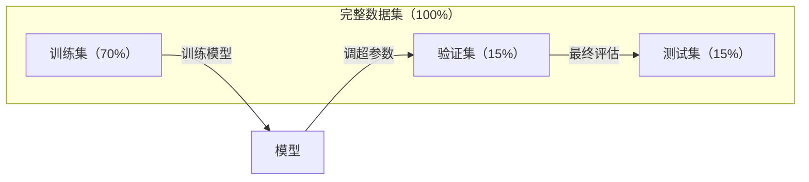
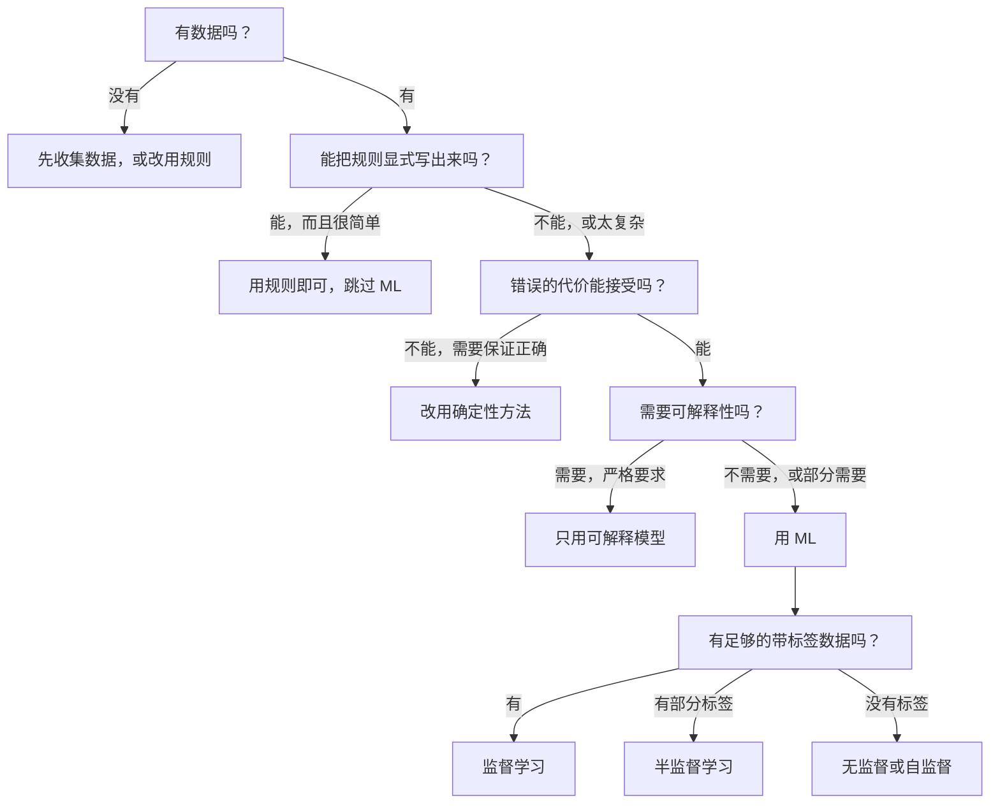

# 什么是机器学习

> 译注：本文译自同目录 [`en.md`](./en.md)。术语遵循仓根 [TRANSLATION_GUIDE.md](../../../../TRANSLATION_GUIDE.md)。

> 机器学习就是教计算机从数据里找规律，而不是靠人手写规则。

**Type:** Learn
**Languages:** Python
**Prerequisites:** Phase 1 (Math Foundations)
**Time:** ~45 minutes

## 学习目标（Learning Objectives）

- 解释监督学习、无监督学习与强化学习的区别，并能判断给定问题该归到哪一类
- 从零实现一个最近质心分类器（nearest centroid classifier），并与随机基准（baseline）对比评估
- 区分分类（classification）任务与回归（regression）任务，并为各自挑选合适的损失函数（loss function）
- 评估某个业务问题到底适不适合用 ML 解决，还是用确定性规则更稳妥

## 问题（The Problem）

你想做一个垃圾邮件过滤器。传统做法：坐下来手写几百条规则。「邮件里包含 'FREE MONEY' 就标垃圾。感叹号超过 3 个就标垃圾。」你花几周写规则。然后垃圾邮件发送者换措辞。规则失效。你再写更多规则。无限循环。

机器学习把这件事翻转过来。你不再写规则，而是给计算机几千封带标签（spam / not spam）的邮件，让它自己琢磨规则。计算机会找到你压根想不到的模式。垃圾邮件方换打法时，你只需用新数据重训，不用重写代码。

从「编程写规则」到「从数据中学习」的这个转变，就是机器学习的内核。所有推荐引擎、语音助手、自动驾驶汽车和语言模型都是这么工作的。

## 概念（The Concept）

### 从数据中学，而不是从规则中学（Learning From Data, Not Rules）

传统编程和机器学习解决问题的方向恰好相反。



传统编程：你写规则。程序把规则套到数据上，产出结果。

机器学习：你提供数据和期望输出。算法自己发现规则。

训练出来的「模型」本身就是规则，只不过被编码成一堆数字（权重、参数）。它从见过的样本里泛化出能力，对从没见过的新数据做预测。

### 机器学习的三种类型（The Three Types of Machine Learning）



**监督学习（Supervised Learning）**：你手上有「输入 - 输出」配对。模型学会把输入映射到输出。
- 「这有 10000 张猫狗照片，每张都标好了。学会区分它们。」
- 「这有房屋特征和成交价。学会预测价格。」

**无监督学习（Unsupervised Learning）**：你只有输入，没有标签。模型自己发现结构。
- 「这有 10000 条用户购买记录。找出自然分群。」
- 「这有 1000 维的数据点。降到 2 维同时保留结构。」

**强化学习（Reinforcement Learning）**：一个 agent 在环境中采取动作，收到奖励或惩罚。它学一个策略（policy）来最大化累积奖励。
- 「玩这个游戏。赢 +1，输 -1。自己摸索策略。」
- 「控制这个机械臂。抓起物体 +1，每浪费一秒 -0.01。」

实际工作中绝大部分场景都用监督学习。无监督学习常用于预处理和数据探索。强化学习则驱动游戏 AI、机器人控制，以及语言模型上的 RLHF。

### 三大类之外（Beyond the Big Three）

上面那三类划分干净利落，但现实里 ML 经常模糊边界。

**半监督学习（Semi-supervised learning）** 用一小批带标签数据加一大堆无标签数据。比如你可能只有 100 张标了的医学影像和 100000 张没标的。常见技术包括：

- **标签传播（Label propagation）**：构造一张连接相似数据点的图，让标签从已标记的节点沿图扩散到未标记的邻居。
- **伪标签（Pseudo-labeling）**：先在已标注数据上训一个模型，用它给未标注数据打预测标签，然后在全部数据上重训。模型自己 bootstrap 出训练集。
- **一致性正则化（Consistency regularization）**：对同一个输入和它的轻微扰动版本，模型应给出相同预测。这招连标签都不需要。

**自监督学习（Self-supervised learning）** 直接从数据本身造监督信号。完全不需要人工标签。模型从数据结构中给自己造一个预测任务。

- **掩码语言建模 / Masked language modeling（BERT）**：把句子里 15% 的词遮掉，让模型去预测被遮的词。「标签」就来自原文。
- **对比学习 / Contrastive learning（SimCLR）**：拿一张图，做两种不同的增广。训练模型识别它们来自同一张图，同时与其他图的增广版本区分开。
- **下一个 token 预测 / Next-token prediction（GPT）**：给定前面所有词，预测下一个词。每一篇文档都成了训练样本。

它们并不是和三大类并列的新分类，而是把监督和无监督的思路结合起来的策略。自监督学习从技术上讲也是监督学习（模型在预测某个目标），只不过标签是自动生成的，不是人标的。

### 分类 vs 回归（Classification vs Regression）

这是监督学习的两大核心任务。

| 维度 | 分类（Classification） | 回归（Regression） |
|--------|---------------|------------|
| 输出 | 离散类别 | 连续数值 |
| 例子 | 「这封邮件是垃圾邮件吗？」 | 「这套房子会卖多少钱？」 |
| 输出空间 | {cat, dog, bird} | 任意实数 |
| 损失函数 | Cross-entropy、accuracy | 均方误差（MSE）、MAE |
| 决策 | 类别之间的边界 | 一条拟合数据的曲线 |

分类回答的是「属于哪一类？」回归回答的是「值是多少？」

有些问题两种框架都能用。预测股票涨跌是分类。预测确切价格是回归。

### ML 工作流（The ML Workflow）

每个机器学习项目都遵循同一条流水线（pipeline），不管用的是什么算法。



**收集数据（Collect Data）**：拿到原始数据。数据多几乎总是更好，但质量比数量更重要。

**清洗与探索（Clean & Explore）**：处理缺失值，去重，画分布图，找异常值。这一步往往要花掉项目 60–80% 的时间。

**特征工程（Feature Engineering）**：把原始数据变成模型能用的特征。日期变成「星期几」。数值列做归一化。类别变量编码。好的特征比花哨的算法更重要。

**切分数据（Split Data）**：分成训练集（training）、验证集（validation）和测试集（test）。模型在训练数据上训练，你在验证数据上调超参数（hyperparameter），最后在测试数据上报告性能。

**训练模型（Train Model）**：把训练数据喂给算法。算法调整内部参数以最小化某个损失函数。

**评估（Evaluate）**：在验证 / 测试数据上测性能。如果不行，回头试不同的特征、算法或超参数。

**部署（Deploy）**：把模型放到生产环境，对新数据做预测。

**监控（Monitor）**：跟踪性能随时间变化。数据分布会漂移（data drift），模型会衰减。性能掉下来时，重训。

### 训练 / 验证 / 测试集划分（Training, Validation, and Test Splits）

这是初学者最容易搞错的一个概念。你必须在模型训练时**没见过**的数据上评估它。否则你测的是「记忆能力」，不是「学习能力」。



| 切分 | 用途 | 何时用 | 典型占比 |
|-------|---------|-----------|-------------|
| Training | 模型从中学习 | 训练阶段 | 60–80% |
| Validation | 调超参数、对比模型 | 每轮训练后 | 10–20% |
| Test | 最终的无偏性能估计 | 项目最末尾，只看一次 | 10–20% |

测试集是神圣的。你只看它一次。如果你不停地根据测试集表现去调模型，那就等于变相地在测试集上训练，报出来的指标就毫无意义了。

数据量小的时候，用 k 折交叉验证（k-fold cross-validation）：把数据切成 k 份，用 k-1 份训练，剩下 1 份做验证，轮换一遍，结果取平均。

### 过拟合 vs 欠拟合（Overfitting vs Underfitting）


**欠拟合（Underfitting）**：模型太简单，抓不住数据里的规律。一条直线想去拟合一段曲线关系。训练误差高，测试误差也高。

**过拟合（Overfitting）**：模型太复杂，把训练数据连同噪声一起背了下来。一条扭曲的曲线穿过每一个训练点，但在新数据上一塌糊涂。训练误差低，测试误差高。

**良好拟合（Good fit）**：模型抓住真实规律但没去记忆噪声。训练误差和测试误差都比较低。

过拟合的迹象：
- 训练准确率远高于验证准确率
- 模型在训练数据上表现很好，但在新数据上很差
- 加更多训练数据能提升性能（说明之前是在背，不是在学）

过拟合的解决办法：
- 找更多训练数据
- 降低模型复杂度（更少的参数、更简单的架构）
- 正则化（对大权重加惩罚项）
- dropout（训练时随机把神经元置零）
- 早停 / early stopping（验证误差开始上升就停止训练）

欠拟合的解决办法：
- 用更复杂的模型
- 加更多特征
- 减少正则化
- 训练更久

### 偏差 - 方差权衡（The Bias-Variance Tradeoff）

这是过拟合 / 欠拟合背后的数学框架。

**偏差（Bias）**：来自模型错误假设的误差。真实关系是非线性的时候，线性模型就有高偏差。高偏差导致欠拟合。

**方差（Variance）**：来自模型对训练数据微小波动的敏感度。高方差的模型在不同的训练子集上会给出非常不同的预测。高方差导致过拟合。

| 模型复杂度 | 偏差（Bias） | 方差（Variance） | 结果 |
|-----------------|------|----------|--------|
| 太低（线性模型拟合曲线数据） | 高 | 低 | 欠拟合 |
| 刚刚好 | 中 | 中 | 泛化良好 |
| 太高（10 个点上跑 20 阶多项式） | 低 | 高 | 过拟合 |

总误差 = Bias² + Variance + 不可约噪声

不可约噪声你减不了（它就是数据本身的随机性）。你要找的是 bias² + variance 最小的甜蜜点。

### 没有免费午餐定理（No Free Lunch Theorem）

不存在一种对所有问题都最优的算法。在某类问题上表现好的算法，在另一类问题上必然表现差。这就是为什么数据科学家总要试多种算法、对比结果。

实践中，选哪种取决于：
- 数据有多少
- 特征有多少
- 关系是线性还是非线性
- 你需不需要可解释性
- 你能负担多少算力

### 什么时候**不**该用机器学习（When NOT to Use Machine Learning）

ML 很强，但不一定总是合适。在伸手抓模型之前，先问问自己是不是真的需要它。

**不要用 ML 的情况：**

- **规则简单且定义清晰。** 税务计算、排序算法、单位换算。如果用几个 if 就能写清楚的逻辑，套个模型只会徒增复杂度。
- **没数据或数据极少。** ML 需要样本来学。10 个数据点你训不出任何有意义的东西。先去收集数据。
- **错误代价灾难性、且必须保证正确性。** 医疗剂量计算、核反应堆控制、密码学验证。ML 模型是概率性的，它会偶尔出错。如果「偶尔出错」不可接受，就用确定性方法。
- **查表或启发式就能解决。** 如果一个简单阈值或一张表就能覆盖 99% 的情况，再加 ML 只会增加维护成本，没有实质提升。
- **你解释不了决策、但又被要求可解释。** 受监管行业（贷款、保险、刑事司法）有时要求每一个决策都能完整解释。有些 ML 模型是可解释的（线性回归、小决策树），但大多数不是。
- **问题变化比你重训还快。** 如果规则每天都变、而重训要花一周，那模型永远是过时的。

可以参考下面这张决策流程图：



## 动手实现（Build It）

`code/ml_intro.py` 里的代码从零实现了一个最近质心分类器（nearest centroid classifier），这是最简单的 ML 算法。它演示了核心思想：从数据中学，再在新数据上做预测。

### 第 1 步：从零写一个最近质心分类器（Step 1: Nearest Centroid Classifier from Scratch）

最近质心分类器在训练数据上算出每个类别的中心（均值）。预测时，它把每个新点划归到中心最近的那个类。

```python
class NearestCentroid:
    def fit(self, X, y):
        self.classes = np.unique(y)
        self.centroids = np.array([
            X[y == c].mean(axis=0) for c in self.classes
        ])

    def predict(self, X):
        distances = np.array([
            np.sqrt(((X - c) ** 2).sum(axis=1))
            for c in self.centroids
        ])
        return self.classes[distances.argmin(axis=0)]
```

整个算法就这么多。fit 算两个均值。predict 算距离。没有梯度下降，没有迭代，没有超参数。

### 第 2 步：在合成数据上训练（Step 2: Train on Synthetic Data）

我们生成一个二维的二分类数据集，两个类略有重叠。质心分类器在两个类中心之间画一条线性决策边界。

```python
rng = np.random.RandomState(42)
X_class0 = rng.randn(100, 2) + np.array([1.0, 1.0])
X_class1 = rng.randn(100, 2) + np.array([-1.0, -1.0])
X = np.vstack([X_class0, X_class1])
y = np.array([0] * 100 + [1] * 100)
```

### 第 3 步：与基准对比（Step 3: Compare Against a Baseline）

每一个 ML 模型都应当与一个朴素的基准（baseline）对比。这里基准就是随机猜一个类。如果你的 ML 模型连随机猜都赢不了，那肯定哪儿出问题了。

```python
baseline_preds = rng.choice([0, 1], size=len(y_test))
baseline_acc = np.mean(baseline_preds == y_test)
```

在这个干净的数据集上，质心分类器准确率应该能到 90% 以上。随机基准大概 50%。

### 为什么这件事重要（Why This Matters）

最近质心分类器简单到爆。没有超参数，没有迭代，没有梯度下降。但它把 ML 的根本套路抓住了：

1. 从训练数据中**学**出一种表示（centroid）
2. 用这种表示在新数据上**预测**（最近距离）
3. 与基准（随机猜）对比**评估**

每一个 ML 算法，从逻辑回归到 transformer，都遵循这同样的三步套路。表示越来越复杂，但工作流不变。

### 第 4 步：质心分类器搞不定的事（Step 4: What the Centroid Classifier Cannot Do）

最近质心分类器假设每个类只是一个团块。它画的是线性决策边界。它在以下情况会失败：

- 一个类有多个簇（比如数字「1」可以有好几种写法）
- 决策边界是非线性的（比如一个类把另一个类包在中间）
- 特征尺度差异极大（距离会被尺度最大的那个特征主导）

这些局限正是后面所有算法存在的理由。K 近邻处理多簇问题。决策树处理非线性边界。特征缩放（feature scaling）解决尺度问题。每节课都建立在前一节的局限之上。

## 用起来（Use It）

sklearn 提供了 `NearestCentroid` 和合成数据生成器：

```python
from sklearn.neighbors import NearestCentroid
from sklearn.datasets import make_classification
from sklearn.model_selection import train_test_split

X, y = make_classification(
    n_samples=500, n_features=2, n_redundant=0,
    n_clusters_per_class=1, random_state=42
)
X_train, X_test, y_train, y_test = train_test_split(X, y, test_size=0.3)

clf = NearestCentroid()
clf.fit(X_train, y_train)
print(f"Accuracy: {clf.score(X_test, y_test):.3f}")
```

## 上线部署（Ship It）

本节课会产出 `outputs/prompt-ml-problem-framer.md` —— 一个把模糊业务问题转化为具体 ML 任务的 prompt。给它一段问题描述（「我们想降低用户流失率」或「预测下季度的需求」），它会识别学习类型、定义预测目标、列出候选特征、挑选成功指标、确立基准，并标记出诸如数据泄漏（data leakage）或类别不平衡之类的坑。在任何一个 ML 项目开头都用一下，能避免做错方向。

## 关键术语（Key Terms）

| 术语 | 大家常这么说 | 它实际意思 |
|------|----------------|----------------------|
| Model（模型） | 「那个 AI」 | 一个带可学习参数的数学函数，把输入映射到输出 |
| Training（训练） | 「教 AI」 | 跑一个优化算法去调模型参数，让预测匹配已知输出 |
| Feature（特征） | 「输入的某一列」 | 数据里某个可度量的属性，模型用它来做预测 |
| Label（标签） | 「答案」 | 训练样本对应的已知输出，用来计算误差信号 |
| Hyperparameter（超参数） | 「你能调的设置」 | 训练前就设好的参数，控制学习过程（学习率、层数等） |
| Loss function（损失函数） | 「模型错得有多离谱」 | 度量预测与真实输出差距的函数，训练就是去最小化它 |
| Overfitting（过拟合） | 「它把测试题背下来了」 | 模型学到的是训练专属的噪声而非通用规律，新数据上就崩了 |
| Underfitting（欠拟合） | 「它根本没学到东西」 | 模型太简单，抓不住数据里真正的规律 |
| Generalization（泛化） | 「它在新数据上也能用」 | 模型在没参与训练的数据上做出准确预测的能力 |
| Cross-validation（交叉验证） | 「在不同切片上测一遍」 | 反复地把数据切成训练 / 测试折，平均结果，得到更稳健的性能估计 |
| Regularization（正则化） | 「让权重小一点」 | 给损失函数加惩罚项，抑制过于复杂的模型 |
| Data drift（数据漂移） | 「世界变了」 | 输入数据的统计分布随时间变化，模型性能因此衰减 |

## 练习（Exercises）

1. 拿任意一个数据集（比如 Iris、Titanic）。按 70/15/15 切成 train / validation / test。解释为什么不能在 test 集上调超参数。
2. 列出三个真实世界的问题。判断每一个分别是分类、回归还是聚类，以及是监督还是无监督。
3. 一个模型在训练数据上 99% 准确率，但测试数据上只有 60%。诊断问题，并列出你会尝试的三种修复方法。

## 延伸阅读（Further Reading）

- [An Introduction to Statistical Learning](https://www.statlearning.com/) - 免费教材，覆盖所有经典 ML 方法，附带实操示例
- [Google's Machine Learning Crash Course](https://developers.google.com/machine-learning/crash-course) - 简洁的可视化 ML 概念入门
- [Scikit-learn User Guide](https://scikit-learn.org/stable/user_guide.html) - 用 Python 做 ML 的实战参考
