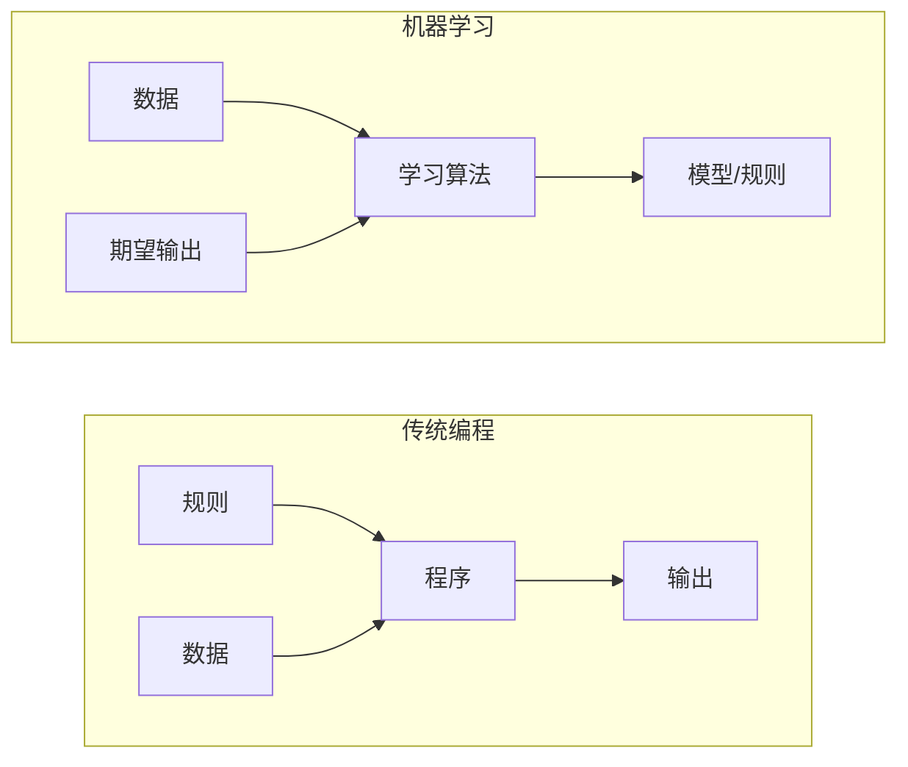
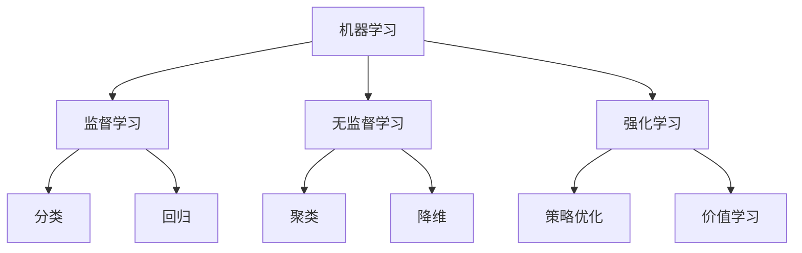
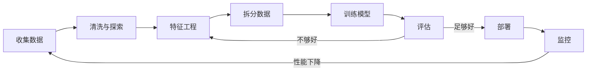
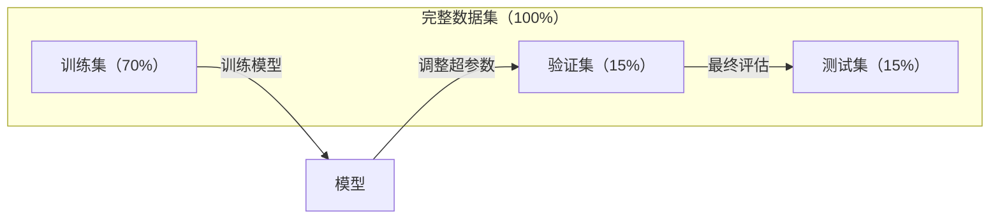
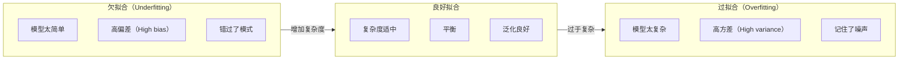
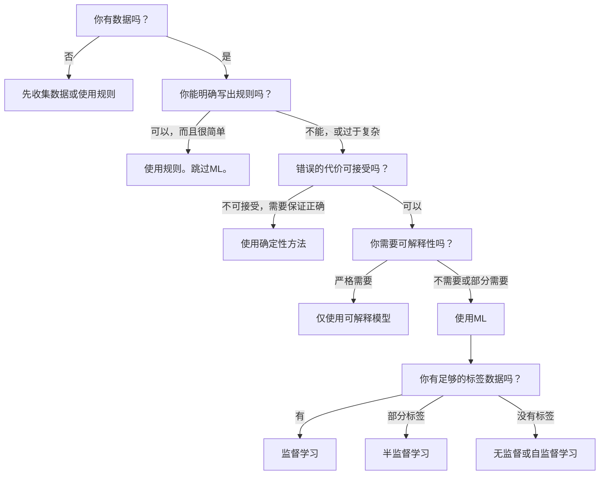

# 什么是机器学习

> 机器学习是教会计算机从数据中发现模式，而不是手动编写规则。

**类型：** 学习
**语言：** Python
**前置要求：** 第一阶段（数学基础）
**时间：** ~45分钟

## 学习目标

- 解释监督学习、无监督学习和强化学习之间的区别，并判断给定问题适用哪种类型
- 从头实现一个最近质心分类器，并与随机基线进行对比评估
- 区分分类和回归任务，并为每种任务选择合适的损失函数
- 判断给定业务问题是否适合用机器学习解决，还是更适合用确定性规则

## 问题

你想构建一个垃圾邮件过滤器。传统方法：坐下来编写几百条规则。"如果邮件包含'免费赚钱'，标记为垃圾邮件。如果超过3个感叹号，标记为垃圾邮件。"你花数周写规则。然后垃圾邮件发送者改变措辞。你的规则失效。你再写更多规则。这个循环永无止境。

机器学习则反过来。你不用编写规则，而是给计算机成千上万封带标签的邮件（"垃圾邮件"或"非垃圾邮件"），让它自己找出规则。计算机能发现你从未想到过的模式。当垃圾邮件发送者改变策略时，你只需用新数据重新训练，而不是重写代码。

这种从"编程规则"到"从数据中学习"的转变，就是机器学习的核心。每一个推荐引擎、语音助手、自动驾驶汽车和语言模型都是这样工作的。

## 概念

### 从数据中学习，而非从规则

传统编程和机器学习以相反的方向解决问题。


```mermaid
flowchart LR
    subgraph Traditional["传统编程"]
        direction LR
        R[规则] --> P1[程序]
        D1[数据] --> P1
        P1 --> O1[输出]
    end

    subgraph ML["机器学习"]
        direction LR
        D2[数据] --> P2[学习算法]
        O2[期望输出] --> P2
        P2 --> M[模型/规则]
    end
```

传统编程：你编写规则。程序将规则应用于数据以产生输出。

机器学习：你提供数据和期望输出。算法自行发现规则。

训练后得到的"模型"就是规则，以数字（权重、参数）的形式编码。它从见过的例子中泛化，对从未见过的数据进行预测。

### 三种机器学习类型


```mermaid
flowchart TD
    ML[机器学习] --> SL[监督学习]
    ML --> UL[无监督学习]
    ML --> RL[强化学习]

    SL --> C[分类]
    SL --> R[回归]

    UL --> CL[聚类]
    UL --> DR[降维]

    RL --> PO[策略优化]
    RL --> VL[价值学习]
```

**监督学习（Supervised Learning）**：你有输入-输出对。模型学习将输入映射到输出。
- "这里有10,000张标有猫或狗的照片。学会区分它们。"
- "这里有房屋特征和价格。学会预测价格。"

**无监督学习（Unsupervised Learning）**：你只有输入，没有标签。模型自行发现结构。
- "这里有10,000个客户购买历史。找到自然分组。"
- "这里有1,000维的数据点。降维到2维同时保持结构。"

**强化学习（Reinforcement Learning）**：智能体在环境中执行动作并获得奖励或惩罚。它学习一种策略（policy）以最大化总奖励。
- "玩这个游戏。赢+1，输-1。找出策略。"
- "控制这个机械臂。拿起物体+1，每浪费一秒-0.01。"

在实践中，你构建的大部分内容都使用监督学习。无监督学习常见于预处理和探索阶段。强化学习为游戏 AI、机器人技术和语言模型的 RLHF 提供动力。

### 三大类之外

以上三个类别是清晰的，但现实中的机器学习常常模糊这些界限。

**半监督学习（Semi-supervised learning）** 使用少量标签数据和大量无标签数据。你可能只有100张带标签的医学图像和100,000张无标签图像。技术包括：

- **标签传播（Label propagation）：** 构建一个连接相似数据点的图。标签通过图从已标记节点传播到未标记的邻居。
- **伪标签（Pseudo-labeling）：** 在标签数据上训练模型，用它预测无标签数据的标签，然后对所有数据重新训练。模型自举自己的训练集。
- **一致性正则化（Consistency regularization）：** 模型应对输入及其轻微扰动版本给出相同的预测。这在没有标签的情况下也能工作。

**自监督学习（Self-supervised learning）** 从数据自身创建监督信号。完全不需要人工标签。模型从数据的结构中创建自己的预测任务。

- **掩码语言建模（BERT）：** 隐藏句子中15%的单词，训练模型预测缺失的单词。"标签"来自原始文本。
- **对比学习（SimCLR）：** 取一张图片，创建两个增强版本。训练模型识别它们来自同一张图片，同时与其它图片的增强版本区分开。
- **下一个 token 预测（GPT）：** 根据所有前面的词预测下一个词。每个文本文档都成为一个训练样本。

这些并不是三大类之外的独立类别。它们是结合了监督和无监督思想的策略。自监督学习在技术上是监督学习（模型预测某个东西），但标签是自动生成的，而不是由人工提供的。

### 分类 vs 回归

这是两个主要的监督学习任务。

| 方面 | 分类（Classification） | 回归（Regression） |
|--------|---------------|------------|
| 输出 | 离散类别 | 连续数值 |
| 示例 | "这封邮件是垃圾邮件吗？" | "房价会是多少？" |
| 输出空间 | {猫, 狗, 鸟} | 任意实数 |
| 损失函数 | 交叉熵（Cross-entropy）、准确率 | 均方误差（Mean squared error）、MAE |
| 决策 | 类别之间的边界 | 拟合数据的曲线 |

分类回答"是哪个类别？"回归回答"有多少？"

有些问题可以用两种方式定义。预测股票涨跌是分类。预测确切价格是回归。

### 机器学习工作流

每一个机器学习项目都遵循相同的 pipeline，无论使用什么算法。


```mermaid
flowchart LR
    A[收集数据] --> B[清洗与探索]
    B --> C[特征工程]
    C --> D[拆分数据]
    D --> E[训练模型]
    E --> F[评估]
    F -->|不够好| C
    F -->|足够好| G[部署]
    G --> H[监控]
    H -->|性能下降| A
```

**收集数据（Collect Data）**：收集原始数据。数据越多通常越好，但质量比数量更重要。

**清洗与探索（Clean & Explore）**：处理缺失值、删除重复项、可视化分布、发现异常。这一步通常占用项目总时间的60-80%。

**特征工程（Feature Engineering）**：将原始数据转换为模型可以使用的特征。将日期转换为星期几。归一化数值列。对分类变量进行编码。好的特征比花哨的算法更重要。

**拆分数据（Split Data）**：划分为训练集、验证集和测试集。模型在训练集上训练，在验证集上调整超参数，在测试集上报告最终性能。

**训练模型（Train Model）**：将训练数据送入算法。算法调整内部参数以最小化损失函数。

**评估（Evaluate）**：在验证/测试数据上测量性能。如果性能不可接受，返回并尝试不同的特征、算法或超参数。

**部署（Deploy）**：将模型投入生产，使其对新数据进行预测。

**监控（Monitor）**：跟踪随时间变化的性能。数据分布会发生变化（数据漂移），模型会退化。当性能下降时，重新训练。

### 训练集、验证集和测试集拆分

这是初学者最容易搞错的最重要概念。你必须在模型训练过程中从未见过的数据上评估模型。否则你衡量的是记忆能力，而不是学习能力。


```mermaid
flowchart LR
    subgraph Dataset["完整数据集（100%）"]
        direction LR
        TR["训练集（70%）"]
        VA["验证集（15%）"]
        TE["测试集（15%）"]
    end

    TR -->|训练模型| M[模型]
    M -->|调整超参数| VA
    VA -->|最终评估| TE
```

| 数据划分 | 用途 | 何时使用 | 典型大小 |
|-------|---------|-----------|-------------|
| 训练集 | 模型从此数据学习 | 训练期间 | 60-80% |
| 验证集 | 调整超参数、比较模型 | 每次训练运行后 | 10-20% |
| 测试集 | 最终无偏性能估计 | 一次，在最后 | 10-20% |

测试集是神圣的。你只能看它一次。如果你根据测试性能反复调整模型，你实际上是在测试集上训练，你报告的数值将毫无意义。

对于小数据集，使用 k 折交叉验证（k-fold cross-validation）：将数据分成 k 份，在 k-1 份上训练，在剩余的一份上验证，轮换并平均结果。

### 过拟合 vs 欠拟合


```mermaid
flowchart LR
    subgraph UF["欠拟合（Underfitting）"]
        U1["模型太简单"]
        U2["高偏差（High bias）"]
        U3["错过了模式"]
    end

    subgraph GF["良好拟合"]
        G1["复杂度适中"]
        G2["平衡"]
        G3["泛化良好"]
    end

    subgraph OF["过拟合（Overfitting）"]
        O1["模型太复杂"]
        O2["高方差（High variance）"]
        O3["记住了噪声"]
    end

    UF -->|增加复杂度| GF
    GF -->|过于复杂| OF
```

**欠拟合（Underfitting）**：模型太简单，无法捕捉数据中的模式。一条直线试图拟合曲线关系。训练误差高。测试误差高。

**过拟合（Overfitting）**：模型过于复杂，记住了训练数据及其噪声。一条弯曲的曲线穿过每个训练点，但在新数据上失效。训练误差低。测试误差高。

**良好拟合（Good fit）**：模型捕捉到真实模式，没有记住噪声。训练误差和测试误差都合理较低。

过拟合的迹象：
- 训练准确率远高于验证准确率
- 模型在训练数据上表现良好，但在新数据上表现差
- 添加更多训练数据能改善性能（模型之前是在记忆，而非学习）

过拟合的修复方法：
- 获取更多训练数据
- 降低模型复杂度（更少的参数、更简单的架构）
- 正则化（Regularization）（对大权重添加惩罚）
- Dropout（训练期间随机将神经元置零）
- 早停（Early stopping）（当验证误差开始上升时停止训练）

欠拟合的修复方法：
- 使用更复杂的模型
- 添加更多特征
- 减少正则化
- 更长时间地训练

### 偏差-方差权衡（Bias-Variance Tradeoff）

这是过拟合和欠拟合背后的数学框架。

**偏差（Bias）**：由于模型中的错误假设而产生的误差。当真实关系是非线性时，线性模型具有高偏差。高偏差导致欠拟合。

**方差（Variance）**：由于对训练数据中的小波动敏感而产生的误差。高方差模型在不同数据子集上训练时会产生非常不同的预测。高方差导致过拟合。

| 模型复杂度 | 偏差 | 方差 | 结果 |
|-----------------|------|----------|--------|
| 太低（对弯曲数据用线性模型） | 高 | 低 | 欠拟合 |
| 恰到好处 | 中 | 中 | 良好泛化 |
| 太高（对10个点用20次多项式） | 低 | 高 | 过拟合 |

总误差 = 偏差² + 方差 + 不可约噪声

你无法减少不可约噪声（它是数据本身的随机性）。你要找到偏差² + 方差最小化的最佳点。

### 没有免费的午餐定理（No Free Lunch Theorem）

不存在对每个问题都最优的单一算法。在一类问题上表现良好的算法在另一类问题上可能表现糟糕。这就是为什么数据科学家会尝试多种算法并比较结果。

在实践中，选择取决于：
- 你有多少数据
- 有多少个特征
- 关系是线性还是非线性
- 你是否需要可解释性
- 你可以负担多少计算资源

### 何时不使用机器学习

ML 很强大，但并非总是正确的工具。在选用模型之前，先问自己是否真的需要。

**以下情况不要使用 ML：**

- **规则简单且定义明确。** 税收计算、排序算法、单位转换。如果你能用几个 if 语句写出逻辑，模型只会增加复杂度而没有任何好处。
- **你没有数据或数据非常少。** ML 需要样本才能学习。只有10个数据点，你无法训练出任何有意义的东西。先收集数据。
- **错误的代价是灾难性的，且你需要保证正确性。** 医疗剂量计算、核反应堆控制、密码验证。ML 模型是概率性的。它们有时会出错。如果"有时出错"不可接受，请使用确定性方法。
- **查表或启发式方法能解决问题。** 如果简单的阈值或表格能覆盖99%的情况，添加 ML 只会增加维护成本而没有实质性改进。
- **你无法解释决策，且可解释性是必须的。** 受监管行业（贷款、保险、刑事司法）有时要求每个决策都能完全解释。有些 ML 模型是可解释的（线性回归、小型决策树）。大多数则不是。
- **问题的变化速度超过你重新训练的速度。** 如果规则每天变化而重新训练需要一周，模型永远是过时的。

使用这个决策流程图：


```mermaid
flowchart TD
    A["你有数据吗？"] -->|否| B["先收集数据或使用规则"]
    A -->|是| C["你能明确写出规则吗？"]
    C -->|"可以，而且很简单"| D["使用规则。跳过ML。"]
    C -->|"不能，或过于复杂"| E["错误的代价可接受吗？"]
    E -->|"不可接受，需要保证正确"| F["使用确定性方法"]
    E -->|可以| G["你需要可解释性吗？"]
    G -->|"严格需要"| H["仅使用可解释模型"]
    G -->|"不需要或部分需要"| I["使用ML"]
    I --> J["你有足够的标签数据吗？"]
    J -->|有| K["监督学习"]
    J -->|"部分标签"| L["半监督学习"]
    J -->|"没有标签"| M["无监督或自监督学习"]
```

## 动手实现

`code/ml_intro.py` 中的代码从头实现了一个最近质心分类器（nearest centroid classifier），这是最简单的 ML 算法。它展示了核心思想：从数据中学习，然后对新数据进行预测。

### 第1步：从头实现最近质心分类器

最近质心分类器计算训练数据中每个类别的中心（均值）。预测时，它将每个新点分配给中心最近的类别。

```python
class NearestCentroid:
    def fit(self, X, y):
        self.classes = np.unique(y)
        self.centroids = np.array([
            X[y == c].mean(axis=0) for c in self.classes
        ])

    def predict(self, X):
        distances = np.array([
            np.sqrt(((X - c) ** 2).sum(axis=1))
            for c in self.centroids
        ])
        return self.classes[distances.argmin(axis=0)]
```

这就是完整的算法。Fit 计算两个均值。Predict 计算距离。没有梯度下降，没有迭代，没有超参数。

### 第2步：在合成数据上训练

我们生成一个二维分类数据集，两个类别略有重叠。质心分类器在类别中心之间画出一条线性决策边界。

```python
rng = np.random.RandomState(42)
X_class0 = rng.randn(100, 2) + np.array([1.0, 1.0])
X_class1 = rng.randn(100, 2) + np.array([-1.0, -1.0])
X = np.vstack([X_class0, X_class1])
y = np.array([0] * 100 + [1] * 100)
```

### 第3步：与基线比较

每一个 ML 模型都应该与一个简单基线进行比较。这里，基线随机预测一个类别。如果你的 ML 模型没有超过随机猜测，说明有问题。

```python
baseline_preds = rng.choice([0, 1], size=len(y_test))
baseline_acc = np.mean(baseline_preds == y_test)
```

在这个干净的数据集上，质心分类器应该能达到约90%以上的准确率。随机基线约为50%。

### 为什么这很重要

最近质心分类器非常简单。它没有超参数，没有迭代，没有梯度下降。但它捕捉到了 ML 的基本模式：

1. **学习**：从训练数据中学习一个表示（质心）
2. **预测**：使用该表示对新数据进行预测（最近距离）
3. **评估**：与基线比较（随机猜测）

从逻辑回归到 transformer 的每一个 ML 算法都遵循这个三步模式。表示方式变得越来越复杂，但工作流保持不变。

### 第4步：质心分类器做不到什么

最近质心分类器假设每个类别形成一个单一的簇。它画出线性决策边界。在以下情况下它会失败：

- 类别有多个簇（例如，数字"1"可以有几种不同的写法）
- 决策边界是非线性的（例如，一个类别环绕着另一个类别）
- 特征具有非常不同的尺度（距离被最大尺度的特征主导）

这些局限性推动了你将学习的每一个其他算法。K 近邻处理多个簇。决策树处理非线性边界。特征缩放解决尺度问题。每节课都建立在上一节课的局限性之上。

## 使用它

sklearn 提供了 `NearestCentroid` 和合成数据生成器：

```python
from sklearn.neighbors import NearestCentroid
from sklearn.datasets import make_classification
from sklearn.model_selection import train_test_split

X, y = make_classification(
    n_samples=500, n_features=2, n_redundant=0,
    n_clusters_per_class=1, random_state=42
)
X_train, X_test, y_train, y_test = train_test_split(X, y, test_size=0.3)

clf = NearestCentroid()
clf.fit(X_train, y_train)
print(f"Accuracy: {clf.score(X_test, y_test):.3f}")
```

## 交付使用

本课程产出 `outputs/prompt-ml-problem-framer.md` -- 一个将模糊的业务问题转化为具体 ML 任务的提示词。给它一个问题描述（"我们想减少客户流失"或"预测下季度需求"），它就能识别学习类型、定义预测目标、列出候选特征、选择成功指标、建立基线，并指出数据泄露或类别不平衡等陷阱。在任何 ML 项目开始时使用它，避免构建错误的东西。

## 关键术语

| 术语 | 人们怎么说 | 实际含义 |
|------|----------------|----------------------|
| 模型（Model） | "这个 AI" | 一个具有可学习参数的数学函数，将输入映射到输出 |
| 训练（Training） | "教 AI" | 运行优化算法来调整模型参数，使预测与已知输出匹配 |
| 特征（Feature） | "一个输入列" | 数据的一个可测量属性，模型用来进行预测 |
| 标签（Label） | "答案" | 训练样本的已知输出，用于计算误差信号 |
| 超参数（Hyperparameter） | "你调整的设置" | 训练前设置的参数，控制学习过程（学习率、层数） |
| 损失函数（Loss function） | "模型错得有多离谱" | 衡量预测输出与实际输出之间差距的函数，训练的目标是最小化它 |
| 过拟合（Overfitting） | "它记住了考试答案" | 模型学到了训练集特有的噪声而非通用模式，因此在新数据上失败 |
| 欠拟合（Underfitting） | "它什么也没学到" | 模型太简单，无法捕捉数据中的真实模式 |
| 泛化（Generalization） | "它在新数据上也能工作" | 模型对未训练过的数据进行准确预测的能力 |
| 交叉验证（Cross-validation） | "在不同数据块上测试" | 反复将数据拆分为训练/测试折并平均结果，给出更稳健的性能估计 |
| 正则化（Regularization） | "保持权重小" | 在损失函数中添加惩罚项，阻止过于复杂的模型 |
| 数据漂移（Data drift） | "世界变了" | 输入数据的统计分布随时间变化，导致模型性能下降 |

## 练习题

1. 选取任意数据集（如 Iris、Titanic），按 70/15/15 拆分为训练/验证/测试集。解释为什么不应该在测试集上调整超参数。
2. 列出三个现实世界问题。对每个问题，判断它是分类、回归还是聚类，以及它是监督还是无监督的。
3. 一个模型在训练数据上达到99%的准确率，但在测试数据上只有60%。诊断问题并列出三种你尝试修复的方法。

## 延伸阅读

- [An Introduction to Statistical Learning](https://www.statlearning.com/) - 免费教材，涵盖所有经典 ML 方法的实践示例
- [Google's Machine Learning Crash Course](https://developers.google.com/machine-learning/crash-course) - 简洁直观的 ML 概念介绍
- [Scikit-learn User Guide](https://scikit-learn.org/stable/user_guide.html) - 在 Python 中实现 ML 的实用参考
