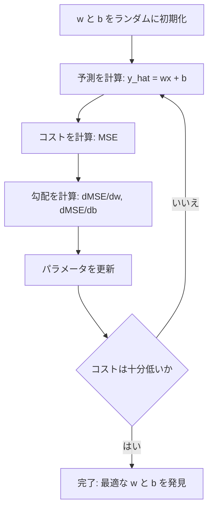

# 線形回帰

> 線形回帰は、データを最もよく通る直線を引きます。機械学習における "hello world" です。

**種類:** 構築
**言語:** Python
**前提条件:** Phase 1（線形代数、微積分、最適化）、Phase 2 Lesson 1
**所要時間:** 約 90 分

## 学習目標

- 平均二乗誤差に対する勾配降下法の更新式を導出し、線形回帰をゼロから実装できる
- 勾配降下法と正規方程式を、計算量と使いどころの観点から比較できる
- 特徴量標準化を含む重回帰モデルを構築し、学習された重みを解釈できる
- Ridge 回帰（L2 正則化）が大きな重みに罰則を与えることで過学習を防ぐ仕組みを説明できる

## 問題

住宅の広さと販売価格のデータがあるとします。新しい住宅の広さから価格を予測したい。散布図を見て目分量で判断することもできますが、必要なのは数式です。任意の広さを入力すれば価格予測が得られるように、データに最もよく適合する直線が必要です。

線形回帰はその直線を与えてくれます。さらに重要なのは、ML の学習ループ全体を導入してくれることです。モデルを定義し、コスト関数を定義し、パラメータを最適化する。すべての ML アルゴリズムは同じパターンに従います。最も単純なケースでここを身につければ、どこでも同じ構造に気づけるようになります。

これは単純な問題だけのものではありません。線形回帰は、需要予測、A/B テスト分析、金融モデリング、そしてあらゆる回帰タスクのベースラインとして本番システムで使われています。

## 概念

### モデル

線形回帰は、入力（x）と出力（y）の間に線形関係があると仮定します。

```
y = wx + b
```

- `w`（重み/傾き）: x が 1 増えたときに y がどれだけ変化するか
- `b`（バイアス/切片）: x = 0 のときの y の値

複数の入力（特徴量）がある場合は、次のように拡張されます。

```
y = w1*x1 + w2*x2 + ... + wn*xn + b
```

ベクトル形式では `y = w^T * x + b` です。

目標は、すべての訓練例において、予測された y が実際の y にできるだけ近くなるような w と b の値を見つけることです。

### コスト関数（平均二乗誤差）

「できるだけ近い」をどう測ればよいでしょうか。予測がどれだけ間違っているかを表す単一の数値が必要です。最も一般的な選択肢は平均二乗誤差（MSE）です。

```
MSE = (1/n) * sum((y_predicted - y_actual)^2)
```

なぜ二乗するのでしょうか。理由は 2 つあります。第一に、大きな誤差を小さな誤差より強く罰します（誤差 10 は誤差 1 の 10 倍ではなく 100 倍悪い）。第二に、二乗関数は滑らかでどこでも微分可能なので、最適化が扱いやすくなります。

コスト関数は曲面を作ります。重み w とバイアス b が 1 つずつの場合、MSE の曲面はお椀のような形（凸放物面）になります。その底が MSE を最小にする場所です。学習とは、その底を見つけることです。

### 勾配降下法

勾配降下法は、下り坂へ一歩ずつ進むことで曲面の底を見つけます。



勾配は 2 つのことを教えてくれます。各パラメータをどちらの方向へ動かすべきか、そしてどれだけ動かすべきかです。

y_hat = wx + b の MSE では次のようになります。

```
dMSE/dw = (2/n) * sum((y_hat - y) * x)
dMSE/db = (2/n) * sum(y_hat - y)
```

更新式は次のとおりです。

```
w = w - learning_rate * dMSE/dw
b = b - learning_rate * dMSE/db
```

学習率はステップサイズを制御します。大きすぎると最小値を飛び越えて発散します。小さすぎると学習に非常に時間がかかります。典型的な初期値は 0.01、0.001、0.0001 です。

### 正規方程式（閉形式解）

線形回帰に限ると、反復なしで最適な重みを直接与える数式があります。

```
w = (X^T * X)^(-1) * X^T * y
```

これは行列を反転し、1 ステップで w を解きます。小さなデータセットでは非常によく機能します。大きなデータセット（数百万行、または数千特徴量）では、行列反転が特徴量数に対して O(n^3) になるため、勾配降下法が好まれます。

### 重回帰

複数の特徴量がある場合、モデルは次のようになります。

```
y = w1*x1 + w2*x2 + ... + wn*xn + b
```

仕組みは同じです。MSE がコスト関数で、勾配降下法がすべての重みを同時に更新します。唯一の違いは、直線ではなく超平面を当てはめていることです。

ここでは特徴量スケーリングが重要です。一方の特徴量が 0 から 1、別の特徴量が 0 から 1,000,000 の範囲を取ると、コスト面が細長くなるため、勾配降下法は苦労します。学習前に特徴量を標準化（平均を引き、標準偏差で割る）してください。

### 多項式回帰

関係が線形でない場合はどうすればよいでしょうか。多項式特徴量を作れば、それでも線形回帰を使えます。

```
y = w1*x + w2*x^2 + w3*x^3 + b
```

これはまだ「線形」回帰です。モデルが重み（w1, w2, w3）に関して線形だからです。単に x の非線形特徴量を使っているだけです。

高次の多項式はより複雑な曲線に適合できますが、過学習のリスクがあります。10 点のデータセットに 10 次多項式を使うと、すべての点を通る一方で新しいデータへの予測は悪くなります。

### R-squared スコア

MSE はどれだけ間違っているかを示しますが、その数値は y のスケールに依存します。R-squared（R^2）はスケールに依存しない指標を与えます。

```
R^2 = 1 - (残差平方和) / (平均との差の平方和)
    = 1 - SS_res / SS_tot
```

- R^2 = 1.0: 完全な予測
- R^2 = 0.0: 毎回平均を予測する場合と変わらない
- R^2 < 0.0: 平均を予測するより悪い

### 正則化の予告（Ridge 回帰）

特徴量が多いと、モデルは大きな重みを割り当てることで過学習することがあります。Ridge 回帰（L2 正則化）は罰則を追加します。

```
Cost = MSE + lambda * sum(w_i^2)
```

罰則項は大きな重みを抑制します。ハイパーパラメータ lambda はトレードオフを制御します。lambda が高いほど重みは小さくなり、正則化は強くなります。これは後のレッスンで詳しく扱います。今は、それが存在し、なぜ役に立つのかを理解しておけば十分です。

## 作ってみる

### ステップ 1: サンプルデータを生成する

```python
import random
import math

random.seed(42)

TRUE_W = 3.0
TRUE_B = 7.0
N_SAMPLES = 100

X = [random.uniform(0, 10) for _ in range(N_SAMPLES)]
y = [TRUE_W * x + TRUE_B + random.gauss(0, 2.0) for x in X]

print(f"Generated {N_SAMPLES} samples")
print(f"True relationship: y = {TRUE_W}x + {TRUE_B} (+ noise)")
print(f"First 5 points: {[(round(X[i], 2), round(y[i], 2)) for i in range(5)]}")
```

### ステップ 2: 勾配降下法で線形回帰をゼロから実装する

```python
class LinearRegression:
    def __init__(self, learning_rate=0.01):
        self.w = 0.0
        self.b = 0.0
        self.lr = learning_rate
        self.cost_history = []

    def predict(self, X):
        return [self.w * x + self.b for x in X]

    def compute_cost(self, X, y):
        predictions = self.predict(X)
        n = len(y)
        cost = sum((pred - actual) ** 2 for pred, actual in zip(predictions, y)) / n
        return cost

    def compute_gradients(self, X, y):
        predictions = self.predict(X)
        n = len(y)
        dw = (2 / n) * sum((pred - actual) * x for pred, actual, x in zip(predictions, y, X))
        db = (2 / n) * sum(pred - actual for pred, actual in zip(predictions, y))
        return dw, db

    def fit(self, X, y, epochs=1000, print_every=200):
        for epoch in range(epochs):
            dw, db = self.compute_gradients(X, y)
            self.w -= self.lr * dw
            self.b -= self.lr * db
            cost = self.compute_cost(X, y)
            self.cost_history.append(cost)
            if epoch % print_every == 0:
                print(f"  Epoch {epoch:4d} | Cost: {cost:.4f} | w: {self.w:.4f} | b: {self.b:.4f}")
        return self

    def r_squared(self, X, y):
        predictions = self.predict(X)
        y_mean = sum(y) / len(y)
        ss_res = sum((actual - pred) ** 2 for actual, pred in zip(y, predictions))
        ss_tot = sum((actual - y_mean) ** 2 for actual in y)
        return 1 - (ss_res / ss_tot)


print("=== Training Linear Regression (Gradient Descent) ===")
model = LinearRegression(learning_rate=0.005)
model.fit(X, y, epochs=1000, print_every=200)
print(f"\nLearned: y = {model.w:.4f}x + {model.b:.4f}")
print(f"True:    y = {TRUE_W}x + {TRUE_B}")
print(f"R-squared: {model.r_squared(X, y):.4f}")
```

### ステップ 3: 正規方程式（閉形式解）

```python
class LinearRegressionNormal:
    def __init__(self):
        self.w = 0.0
        self.b = 0.0

    def fit(self, X, y):
        n = len(X)
        x_mean = sum(X) / n
        y_mean = sum(y) / n
        numerator = sum((X[i] - x_mean) * (y[i] - y_mean) for i in range(n))
        denominator = sum((X[i] - x_mean) ** 2 for i in range(n))
        self.w = numerator / denominator
        self.b = y_mean - self.w * x_mean
        return self

    def predict(self, X):
        return [self.w * x + self.b for x in X]

    def r_squared(self, X, y):
        predictions = self.predict(X)
        y_mean = sum(y) / len(y)
        ss_res = sum((actual - pred) ** 2 for actual, pred in zip(y, predictions))
        ss_tot = sum((actual - y_mean) ** 2 for actual in y)
        return 1 - (ss_res / ss_tot)


print("\n=== Normal Equation (Closed-Form) ===")
model_normal = LinearRegressionNormal()
model_normal.fit(X, y)
print(f"Learned: y = {model_normal.w:.4f}x + {model_normal.b:.4f}")
print(f"R-squared: {model_normal.r_squared(X, y):.4f}")
```

### ステップ 4: 重回帰

```python
class MultipleLinearRegression:
    def __init__(self, n_features, learning_rate=0.01):
        self.weights = [0.0] * n_features
        self.bias = 0.0
        self.lr = learning_rate
        self.cost_history = []

    def predict_single(self, x):
        return sum(w * xi for w, xi in zip(self.weights, x)) + self.bias

    def predict(self, X):
        return [self.predict_single(x) for x in X]

    def compute_cost(self, X, y):
        predictions = self.predict(X)
        n = len(y)
        return sum((pred - actual) ** 2 for pred, actual in zip(predictions, y)) / n

    def fit(self, X, y, epochs=1000, print_every=200):
        n = len(y)
        n_features = len(X[0])
        for epoch in range(epochs):
            predictions = self.predict(X)
            errors = [pred - actual for pred, actual in zip(predictions, y)]
            for j in range(n_features):
                grad = (2 / n) * sum(errors[i] * X[i][j] for i in range(n))
                self.weights[j] -= self.lr * grad
            grad_b = (2 / n) * sum(errors)
            self.bias -= self.lr * grad_b
            cost = self.compute_cost(X, y)
            self.cost_history.append(cost)
            if epoch % print_every == 0:
                print(f"  Epoch {epoch:4d} | Cost: {cost:.4f}")
        return self

    def r_squared(self, X, y):
        predictions = self.predict(X)
        y_mean = sum(y) / len(y)
        ss_res = sum((actual - pred) ** 2 for actual, pred in zip(y, predictions))
        ss_tot = sum((actual - y_mean) ** 2 for actual in y)
        return 1 - (ss_res / ss_tot)


random.seed(42)
N = 100
X_multi = []
y_multi = []
for _ in range(N):
    size = random.uniform(500, 3000)
    bedrooms = random.randint(1, 5)
    age = random.uniform(0, 50)
    price = 50 * size + 10000 * bedrooms - 1000 * age + 50000 + random.gauss(0, 20000)
    X_multi.append([size, bedrooms, age])
    y_multi.append(price)


def standardize(X):
    n_features = len(X[0])
    means = [sum(X[i][j] for i in range(len(X))) / len(X) for j in range(n_features)]
    stds = []
    for j in range(n_features):
        variance = sum((X[i][j] - means[j]) ** 2 for i in range(len(X))) / len(X)
        stds.append(variance ** 0.5)
    X_scaled = []
    for i in range(len(X)):
        row = [(X[i][j] - means[j]) / stds[j] if stds[j] > 0 else 0 for j in range(n_features)]
        X_scaled.append(row)
    return X_scaled, means, stds


y_mean_val = sum(y_multi) / len(y_multi)
y_std_val = (sum((yi - y_mean_val) ** 2 for yi in y_multi) / len(y_multi)) ** 0.5
y_scaled = [(yi - y_mean_val) / y_std_val for yi in y_multi]

X_scaled, x_means, x_stds = standardize(X_multi)

print("\n=== Multiple Linear Regression (3 features) ===")
print("Features: house size, bedrooms, age")
multi_model = MultipleLinearRegression(n_features=3, learning_rate=0.01)
multi_model.fit(X_scaled, y_scaled, epochs=1000, print_every=200)

print(f"\nWeights (standardized): {[round(w, 4) for w in multi_model.weights]}")
print(f"Bias (standardized): {multi_model.bias:.4f}")
print(f"R-squared: {multi_model.r_squared(X_scaled, y_scaled):.4f}")
```

### ステップ 5: 多項式回帰

```python
class PolynomialRegression:
    def __init__(self, degree, learning_rate=0.01):
        self.degree = degree
        self.weights = [0.0] * degree
        self.bias = 0.0
        self.lr = learning_rate

    def make_features(self, X):
        return [[x ** (d + 1) for d in range(self.degree)] for x in X]

    def predict(self, X):
        features = self.make_features(X)
        return [sum(w * f for w, f in zip(self.weights, row)) + self.bias for row in features]

    def fit(self, X, y, epochs=1000, print_every=200):
        features = self.make_features(X)
        n = len(y)
        for epoch in range(epochs):
            predictions = [sum(w * f for w, f in zip(self.weights, row)) + self.bias for row in features]
            errors = [pred - actual for pred, actual in zip(predictions, y)]
            for j in range(self.degree):
                grad = (2 / n) * sum(errors[i] * features[i][j] for i in range(n))
                self.weights[j] -= self.lr * grad
            grad_b = (2 / n) * sum(errors)
            self.bias -= self.lr * grad_b
            if epoch % print_every == 0:
                cost = sum(e ** 2 for e in errors) / n
                print(f"  Epoch {epoch:4d} | Cost: {cost:.6f}")
        return self

    def r_squared(self, X, y):
        predictions = self.predict(X)
        y_mean = sum(y) / len(y)
        ss_res = sum((actual - pred) ** 2 for actual, pred in zip(y, predictions))
        ss_tot = sum((actual - y_mean) ** 2 for actual in y)
        return 1 - (ss_res / ss_tot)


random.seed(42)
X_poly = [x / 10.0 for x in range(0, 50)]
y_poly = [0.5 * x ** 2 - 2 * x + 3 + random.gauss(0, 1.0) for x in X_poly]

x_max = max(abs(x) for x in X_poly)
X_poly_norm = [x / x_max for x in X_poly]
y_poly_mean = sum(y_poly) / len(y_poly)
y_poly_std = (sum((yi - y_poly_mean) ** 2 for yi in y_poly) / len(y_poly)) ** 0.5
y_poly_norm = [(yi - y_poly_mean) / y_poly_std for yi in y_poly]

print("\n=== Polynomial Regression (degree 2 vs degree 5) ===")
print("True relationship: y = 0.5x^2 - 2x + 3")

print("\nDegree 2:")
poly2 = PolynomialRegression(degree=2, learning_rate=0.1)
poly2.fit(X_poly_norm, y_poly_norm, epochs=2000, print_every=500)
print(f"  R-squared: {poly2.r_squared(X_poly_norm, y_poly_norm):.4f}")

print("\nDegree 5:")
poly5 = PolynomialRegression(degree=5, learning_rate=0.1)
poly5.fit(X_poly_norm, y_poly_norm, epochs=2000, print_every=500)
print(f"  R-squared: {poly5.r_squared(X_poly_norm, y_poly_norm):.4f}")

print("\nDegree 2 fits the true curve well. Degree 5 fits training data slightly better")
print("but risks overfitting on new data.")
```

### ステップ 6: Ridge 回帰（L2 正則化）

```python
class RidgeRegression:
    def __init__(self, n_features, learning_rate=0.01, alpha=1.0):
        self.weights = [0.0] * n_features
        self.bias = 0.0
        self.lr = learning_rate
        self.alpha = alpha

    def predict_single(self, x):
        return sum(w * xi for w, xi in zip(self.weights, x)) + self.bias

    def predict(self, X):
        return [self.predict_single(x) for x in X]

    def fit(self, X, y, epochs=1000, print_every=200):
        n = len(y)
        n_features = len(X[0])
        for epoch in range(epochs):
            predictions = self.predict(X)
            errors = [pred - actual for pred, actual in zip(predictions, y)]
            mse = sum(e ** 2 for e in errors) / n
            reg_term = self.alpha * sum(w ** 2 for w in self.weights)
            cost = mse + reg_term
            for j in range(n_features):
                grad = (2 / n) * sum(errors[i] * X[i][j] for i in range(n))
                grad += 2 * self.alpha * self.weights[j]
                self.weights[j] -= self.lr * grad
            grad_b = (2 / n) * sum(errors)
            self.bias -= self.lr * grad_b
            if epoch % print_every == 0:
                print(f"  Epoch {epoch:4d} | Cost: {cost:.4f} | L2 penalty: {reg_term:.4f}")
        return self


print("\n=== Ridge Regression (L2 Regularization) ===")
print("Same data as multiple regression, with alpha=0.1")
ridge = RidgeRegression(n_features=3, learning_rate=0.01, alpha=0.1)
ridge.fit(X_scaled, y_scaled, epochs=1000, print_every=200)
print(f"\nRidge weights: {[round(w, 4) for w in ridge.weights]}")
print(f"Plain weights: {[round(w, 4) for w in multi_model.weights]}")
print("Ridge weights are smaller (shrunk toward zero) due to the L2 penalty.")
```

## 使ってみる

次は、本番で実際に使うことになる scikit-learn で同じことを行います。

```python
from sklearn.linear_model import LinearRegression as SklearnLR
from sklearn.linear_model import Ridge
from sklearn.preprocessing import PolynomialFeatures, StandardScaler
from sklearn.model_selection import train_test_split
from sklearn.metrics import mean_squared_error, r2_score
import numpy as np

np.random.seed(42)
X_sk = np.random.uniform(0, 10, (100, 1))
y_sk = 3.0 * X_sk.squeeze() + 7.0 + np.random.normal(0, 2.0, 100)

X_train, X_test, y_train, y_test = train_test_split(X_sk, y_sk, test_size=0.2, random_state=42)

lr = SklearnLR()
lr.fit(X_train, y_train)
y_pred = lr.predict(X_test)

print("=== Scikit-learn Linear Regression ===")
print(f"Coefficient (w): {lr.coef_[0]:.4f}")
print(f"Intercept (b): {lr.intercept_:.4f}")
print(f"R-squared (test): {r2_score(y_test, y_pred):.4f}")
print(f"MSE (test): {mean_squared_error(y_test, y_pred):.4f}")

poly = PolynomialFeatures(degree=2, include_bias=False)
X_poly_sk = poly.fit_transform(X_train)
X_poly_test = poly.transform(X_test)

lr_poly = SklearnLR()
lr_poly.fit(X_poly_sk, y_train)
print(f"\nPolynomial degree 2 R-squared: {r2_score(y_test, lr_poly.predict(X_poly_test)):.4f}")

scaler = StandardScaler()
X_train_scaled = scaler.fit_transform(X_train)
X_test_scaled = scaler.transform(X_test)

ridge = Ridge(alpha=1.0)
ridge.fit(X_train_scaled, y_train)
print(f"Ridge R-squared: {r2_score(y_test, ridge.predict(X_test_scaled)):.4f}")
print(f"Ridge coefficient: {ridge.coef_[0]:.4f}")
```

ゼロから実装したものと scikit-learn は同じ結果を出します。違いは、scikit-learn がエッジケース、数値安定性、性能最適化を扱ってくれることです。本番ではライブラリを使ってください。何が起きているかを理解するために、ゼロからの実装を使ってください。

## 仕上げる

このレッスンでは次を作成します。
- `outputs/skill-regression.md` - 問題に応じて適切な回帰手法を選ぶためのスキル

## 演習

1. バッチ勾配降下法、確率的勾配降下法（SGD）、ミニバッチ勾配降下法を実装してください。同じデータセットで収束速度を比較してください。どれが最も速く収束しますか。どれが最も滑らかなコスト曲線になりますか。
2. 3 次関数（y = ax^3 + bx^2 + cx + d + noise）からデータを生成してください。1 次、3 次、10 次の多項式を当てはめ、訓練 R^2 とテスト R^2 を比較してください。どの次数で過学習が明らかになりますか。
3. Lasso 回帰（L1 正則化: penalty = alpha * sum(|w_i|)）を実装してください。複数特徴量の住宅データで学習し、Ridge と比べてどの重みがゼロになるかを比較してください。L1 はなぜスパースな解を作り、L2 はそうならないのでしょうか。

## 重要用語

| 用語 | よくある言い方 | 実際の意味 |
|------|----------------|----------------------|
| Linear regression | 「データに直線を引く」 | wx+b と実際の y 値の二乗差の合計を最小化する重み w とバイアス b を見つけること |
| Cost function | 「モデルがどれくらい悪いか」 | モデルパラメータを、予測誤差を表す単一の数値に写像する関数。最適化はこれを最小化する |
| Mean squared error | 「二乗誤差の平均」 | (1/n) * sum of (predicted - actual)^2。大きな誤差を不釣り合いに強く罰する |
| Gradient descent | 「下り坂を歩く」 | 偏微分を使い、コスト関数を減らす方向へパラメータを反復的に調整すること |
| Learning rate | 「ステップサイズ」 | 勾配降下法の 1 ステップごとにパラメータをどれだけ変化させるかを制御するスカラー |
| Normal equation | 「直接解く」 | 反復なしで最適な重みを与える閉形式解 w = (X^T X)^-1 X^T y |
| R-squared | 「適合の良さ」 | y の分散のうちモデルが説明する割合。負の無限大から 1.0 までの範囲を取る |
| Feature scaling | 「特徴量を比較可能にする」 | 勾配降下法がより速く収束するよう、特徴量を似た範囲（例: 平均 0、分散 1）へ変換すること |
| Regularization | 「複雑さを罰する」 | 過学習を防ぐため、重みを縮小する項をコスト関数へ追加すること |
| Ridge regression | 「L2 正則化」 | MSE に lambda * sum(w_i^2) の罰則を追加した線形回帰 |
| Polynomial regression | 「線形の数学で曲線を当てはめる」 | 多項式特徴量（x, x^2, x^3, ...）に対する線形回帰。重みに関しては依然として線形 |
| Overfitting | 「訓練データを暗記する」 | 訓練データのノイズまで適合するほど複雑なモデルを使い、新しいデータで失敗すること |

## 参考文献

- [An Introduction to Statistical Learning (ISLR)](https://www.statlearning.com/) -- 無料 PDF。第 3 章と第 6 章で、線形回帰と正則化を実践的な R の例とともに扱う
- [The Elements of Statistical Learning (ESL)](https://hastie.su.domains/ElemStatLearn/) -- 無料 PDF。ISLR のより数学的な姉妹編で、ridge と lasso をより深く扱う
- [Stanford CS229 Lecture Notes on Linear Regression](https://cs229.stanford.edu/main_notes.pdf) -- Andrew Ng による、正規方程式と勾配降下法を第一原理から導出するノート
- [scikit-learn LinearRegression documentation](https://scikit-learn.org/stable/modules/linear_model.html) -- LinearRegression、Ridge、Lasso、ElasticNet をコード例とともに扱う実用的リファレンス
