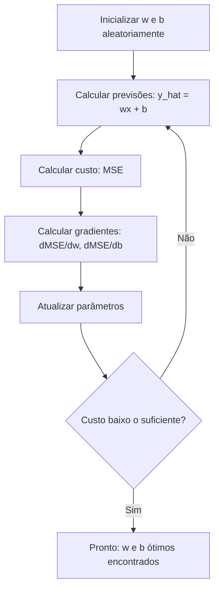

# Regressão Linear

> Regressão linear desenha a melhor reta através dos seus dados. É o "hello world" do machine learning.

**Tipo:** Build
**Linguagens:** Python
**Pré-requisitos:** Fase 1 (Álgebra Linear, Cálculo, Otimização), Fase 2 Aula 1
**Tempo:** ~90 minutos

## Objetivos de Aprendizado

- Derivar as regras de atualização da descida do gradiente para erro quadrático médio e implementar regressão linear do zero
- Comparar descida do gradiente e equação normal em termos de complexidade computacional e quando usar cada uma
- Construir um modelo de regressão linear múltipla com padronização de features e interpretar os pesos aprendidos
- Explicar como a regressão Ridge (regularização L2) previne overajuste penalizando pesos grandes

## O Problema

Você tem dados: tamanhos de casas e seus preços de venda. Quer prever o preço de uma nova casa dado o tamanho. Poderia estimar visualmente num gráfico de dispersão, mas precisa de uma fórmula. Precisa de uma reta que melhor se ajusta aos dados pra poder colocar qualquer tamanho e ter uma previsão de preço.

Regressão linear te dá essa reta. Mais importante, introduz o ciclo completo de treino de ML: definir um modelo, definir uma função de custo, otimizar os parâmetros. Todo algoritmo de ML segue esse mesmo padrão. Domine aqui com o caso mais simples e você o reconhecerá em todo lugar.

## O Conceito

### O Modelo

Regressão linear assume uma relação linear entre entrada (x) e saída (y):

```
y = wx + b
```

- `w` (peso/inclinação): quanto y muda quando x aumenta em 1
- `b` (viés/intercepto): o valor de y quando x = 0

Para múltiplas entradas (features), isso se estende para:
```
y = w1*x1 + w2*x2 + ... + wn*xn + b
```

Ou em forma vetorial: `y = w^T * x + b`

O objetivo: encontrar os valores de w e b que tornam o y previsto o mais próximo possível do y real em todos os exemplos de treino.

### A Função de Custo (Erro Quadrático Médio)

```
MSE = (1/n) * sum((y_previsto - y_real)^2)
```

Por que ao quadrado? Duas razões. Primeiro, penaliza erros grandes mais que erros pequenos. Segundo, a função ao quadrada é suave e diferenciável em todo lugar, o que torna a otimização direta.

### Descida do Gradiente



Os gradientes te dizem duas coisas: que direção mover cada parâmetro e quanto mover.

A regra de atualização:
```
w = w - learning_rate * dMSE/dw
b = b - learning_rate * dMSE/db
```

O learning rate controla o tamanho do passo. Muito grande: você ultrapassa o mínimo e diverge. Muito pequeno: treino demora pra sempre. Valores típicos iniciais: 0.01, 0.001 ou 0.0001.

### Equação Normal (Solução Fechada)

Para regressão linear especificamente, existe uma fórmula direta:
```
w = (X^T * X)^(-1) * X^T * y
```

Isso inverte uma matriz pra resolver w em um passo. Funciona perfeitamente para datasets pequenos. Para grandes datasets, descida do gradiente é preferida porque inversão de matriz é O(n^3) no número de features.

## Construa

### Passo 1: Gere dados de exemplo

```python
import random
import math

random.seed(42)

TRUE_W = 3.0
TRUE_B = 7.0
N_SAMPLES = 100

X = [random.uniform(0, 10) for _ in range(N_SAMPLES)]
y = [TRUE_W * x + TRUE_B + random.gauss(0, 2.0) for x in X]

print(f"Gerados {N_SAMPLES} amostras")
print(f"Relação verdadeira: y = {TRUE_W}x + {TRUE_B} (+ ruído)")
```

### Passo 2: Regressão linear do zero com descida do gradiente

```python
class LinearRegression:
    def __init__(self, learning_rate=0.01):
        self.w = 0.0
        self.b = 0.0
        self.lr = learning_rate
        self.cost_history = []

    def predict(self, X):
        return [self.w * x + self.b for x in X]

    def compute_cost(self, X, y):
        predictions = self.predict(X)
        n = len(y)
        cost = sum((pred - actual) ** 2 for pred, actual in zip(predictions, y)) / n
        return cost

    def compute_gradients(self, X, y):
        predictions = self.predict(X)
        n = len(y)
        dw = (2 / n) * sum((pred - actual) * x for pred, actual, x in zip(predictions, y, X))
        db = (2 / n) * sum(pred - actual for pred, actual in zip(predictions, y))
        return dw, db

    def fit(self, X, y, epochs=1000, print_every=200):
        for epoch in range(epochs):
            dw, db = self.compute_gradients(X, y)
            self.w -= self.lr * dw
            self.b -= self.lr * db
            cost = self.compute_cost(X, y)
            self.cost_history.append(cost)
            if epoch % print_every == 0:
                print(f"  Epoch {epoch:4d} | Cost: {cost:.4f} | w: {self.w:.4f} | b: {self.b:.4f}")
        return self

print("=== Treinando Regressão Linear (Descida do Gradiente) ===")
model = LinearRegression(learning_rate=0.005)
model.fit(X, y, epochs=1000, print_every=200)
print(f"\nAprendido: y = {model.w:.4f}x + {model.b:.4f}")
print(f"Verdadeiro: y = {TRUE_W}x + {TRUE_B}")
```

### Passo 3: Equação normal (solução fechada)

```python
class LinearRegressionNormal:
    def __init__(self):
        self.w = 0.0
        self.b = 0.0

    def fit(self, X, y):
        n = len(X)
        x_mean = sum(X) / n
        y_mean = sum(y) / n
        numerator = sum((X[i] - x_mean) * (y[i] - y_mean) for i in range(n))
        denominator = sum((X[i] - x_mean) ** 2 for i in range(n))
        self.w = numerator / denominator
        self.b = y_mean - self.w * x_mean
        return self
```

### Passo 4: Regressão linear múltipla

```python
class MultipleLinearRegression:
    def __init__(self, n_features, learning_rate=0.01):
        self.weights = [0.0] * n_features
        self.bias = 0.0
        self.lr = learning_rate

    def predict_single(self, x):
        return sum(w * xi for w, xi in zip(self.weights, x)) + self.bias

    def predict(self, X):
        return [self.predict_single(x) for x in X]
```

### Passo 5: Regressão polinomial

```python
class PolynomialRegression:
    def __init__(self, degree, learning_rate=0.01):
        self.degree = degree
        self.weights = [0.0] * degree
        self.bias = 0.0
        self.lr = learning_rate

    def make_features(self, X):
        return [[x ** (d + 1) for d in range(self.degree)] for x in X]
```

### Passo 6: Regressão Ridge (Regularização L2)

```python
class RidgeRegression:
    def __init__(self, n_features, learning_rate=0.01, alpha=1.0):
        self.weights = [0.0] * n_features
        self.bias = 0.0
        self.lr = learning_rate
        self.alpha = alpha
```

## Use

Agora com scikit-learn:

```python
from sklearn.linear_model import LinearRegression as SklearnLR
from sklearn.linear_model import Ridge
from sklearn.preprocessing import PolynomialFeatures, StandardScaler
from sklearn.model_selection import train_test_split
from sklearn.metrics import mean_squared_error, r2_score
import numpy as np

np.random.seed(42)
X_sk = np.random.uniform(0, 10, (100, 1))
y_sk = 3.0 * X_sk.squeeze() + 7.0 + np.random.normal(0, 2.0, 100)

X_train, X_test, y_train, y_test = train_test_split(X_sk, y_sk, test_size=0.2, random_state=42)

lr = SklearnLR()
lr.fit(X_train, y_train)
y_pred = lr.predict(X_test)

print(f"Coeficiente (w): {lr.coef_[0]:.4f}")
print(f"Intercepto (b): {lr.intercept_:.4f}")
print(f"R-squared (teste): {r2_score(y_test, y_pred):.4f}")
```

## Exercícios

1. Gere um dataset com uma relação quadrática. Treine regressão linear e polinomial (grau 2 e 5). Compare os R-squared.
2. Implemente a regressão Ridge do zero. Treine no mesmo dataset com diferentes valores de alpha. Plote os pesos vs alpha.
3. Compare a equação normal com a descida do gradiente em termos de velocidade e precisão.
4. Gere dados com outliers e compare regressão linear com e sem regularização Ridge.
