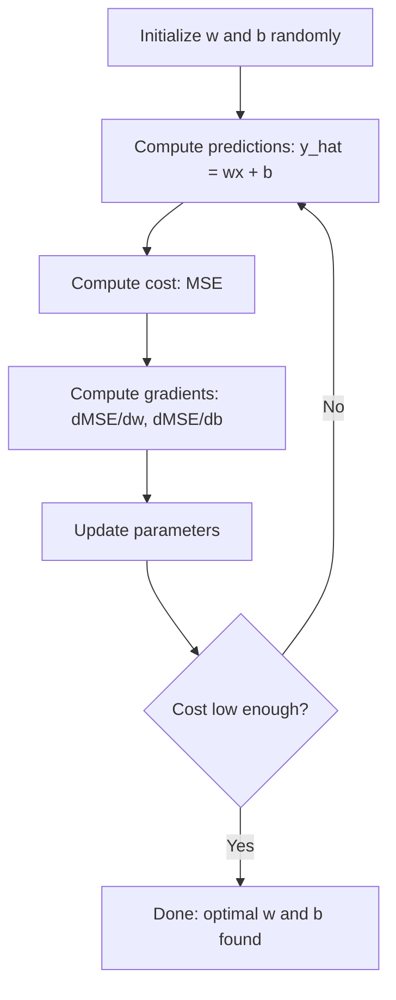

# Doğrusal Regresyon

> Doğrusal regresyon, verileriniz boyunca en iyi düz çizgiyi çizer. machine learning'nin "merhaba dünyası"dır.

**Tür:** Yapım
**Diller:** Python
**Önkoşullar:** Aşama 1 (Doğrusal Cebir, Matematik, Optimizasyon), Aşama 2 Ders 1
**Süre:** ~90 dakika

## Öğrenme Hedefleri

- Ortalama karesel hata için gradient iniş güncelleme kurallarını türetin ve doğrusal regresyonu sıfırdan uygulayın
- gradient inişini ve normal denklemi hesaplama karmaşıklığı ve her birinin ne zaman kullanılacağı açısından karşılaştırın
- Özellik standardizasyonuyla çoklu doğrusal regresyon modeli oluşturun ve öğrenilen ağırlıkları yorumlayın
- Ridge regresyonunun (L2 düzenlemesi) büyük ağırlıkları cezalandırarak aşırı uyumu nasıl önlediğini açıklayın

## Sorun

Elinizde veriler var: ev büyüklükleri ve satış fiyatları. Büyüklüğüne göre yeni bir evin fiyatını tahmin etmek istiyorsunuz. Bunu bir dağılım grafiği üzerinde göz küresi olarak görebilirsiniz, ancak bir formüle ihtiyacınız var. Herhangi bir boyutu bağlayıp fiyat tahmini alabilmeniz için verilere en iyi uyan bir çizgiye ihtiyacınız vardır.

Doğrusal regresyon size bu çizgiyi verir. Daha da önemlisi, makine öğrenimi eğitim döngüsünün tamamını tanıtıyor: bir model tanımlayın, bir maliyet fonksiyonu tanımlayın, parametreleri optimize edin. Her makine öğrenimi algoritması aynı modeli izler. Burada en basit vakayla ustalaşın; onu her yerde tanıyacaksınız.

Bu sadece basit problemler için geçerli değil. Doğrusal regresyon, üretim sistemlerinde talep tahmini, A/B testi analizi, finansal modelleme için ve her regresyon görevi için temel olarak kullanılır.

## Konsept

### Model

Doğrusal regresyon, girdi (x) ile çıktı (y) arasında doğrusal bir ilişki olduğunu varsayar:

```
y = wx + b
```

- `w` (ağırlık/eğim): x 1 arttığında y ne kadar değişir?
- `b` (sapma/kesme noktası): x = 0 olduğunda y'nin değeri

Çoklu girişler (özellikler) için bu aşağıdakileri kapsar:

```
y = w1*x1 + w2*x2 + ... + wn*xn + b
```

Veya vektör biçiminde: `y = w^T * x + b`

Amaç: tüm eğitim örneklerinde tahmin edilen y'yi gerçek y'ye mümkün olduğunca yakın hale getiren w ve b değerlerini bulmak.

### Maliyet Fonksiyonu (Ortalama Karesel Hata)

"Mümkün olduğu kadar yakın"ı nasıl ölçersiniz? Tahminlerinizin ne kadar yanlış olduğunu gösteren tek bir sayıya ihtiyacınız var. En yaygın seçenek Ortalama Karesel Hatadır (MSE):

```
MSE = (1/n) * sum((y_predicted - y_actual)^2)
```

Neden kare? İki sebep. Birincisi, büyük hataları küçük hatalardan daha fazla cezalandırır (10'luk bir hata, 1'lik bir hatadan 100 kat daha kötüdür, 10x değil). İkincisi, kare fonksiyonu düzgündür ve her yerde türevi alınabilir, bu da optimizasyonu basit hale getirir.

Maliyet fonksiyonu bir yüzey oluşturur. Tek ağırlık w ve önyargı b için, MSE yüzeyi bir kaseye (dışbükey bir paraboloit) benzer. Kasenin tabanı MSE'nin en aza indirildiği yerdir. Eğitim demek dibi bulmak demektir.

### Gradient İniş

Gradient iniş, yokuş aşağı adımlar atarak kasenin dibini bulur.



gradient'ler size iki şeyi söyler: her parametrenin hangi yöne taşınacağı ve ne kadar hareket edileceği.

y_hat = wx + b olan MSE için:

```
dMSE/dw = (2/n) * sum((y_hat - y) * x)
dMSE/db = (2/n) * sum(y_hat - y)
```

Güncelleme kuralı:

```
w = w - learning_rate * dMSE/dw
b = b - learning_rate * dMSE/db
```

Öğrenme oranı adım boyutunu kontrol eder. Çok büyük: minimumu aşarsınız ve uzaklaşırsınız. Çok küçük: Eğitim sonsuza kadar sürer. Tipik başlangıç ​​değerleri: 0,01, 0,001 veya 0,0001.

### Normal Denklem (Kapalı Form Çözümü)

Özellikle doğrusal regresyon için, herhangi bir yineleme olmaksızın en uygun ağırlıkları veren doğrudan bir formül vardır:

```
w = (X^T * X)^(-1) * X^T * y
```

Bu, w'yi tek adımda çözecek matrisi tersine çevirir. Küçük dataset'ler için mükemmel çalışır. Büyük dataset'ler (milyonlarca satır veya binlerce özellik) için, özellik sayısında matris ters çevirme O(n^3) olduğundan gradient iniş tercih edilir.

### Çoklu Doğrusal Regresyon

Çoklu özelliklerle model şu hale gelir:

```
y = w1*x1 + w2*x2 + ... + wn*xn + b
```

Her şey aynı şekilde çalışır: MSE maliyet fonksiyonudur, gradient iniş tüm ağırlıkları aynı anda günceller. Tek fark, çizgi yerine hiperdüzlem yerleştirmenizdir.

Özellik ölçeklendirme burada önemlidir. Bir özellik 0'dan 1'e ve diğeri 0'dan 1.000.000'e kadar değişiyorsa, gradient'nin düşüşü, maliyet yüzeyi uzadığı için zorlanacaktır. Eğitimden önce özellikleri standartlaştırın (ortalamayı çıkarın, standart sapmaya bölün).

### Polinom Regresyon

Ya ilişki doğrusal değilse? Polinom özellikleri oluşturarak doğrusal regresyonu kullanmaya devam edebilirsiniz:

```
y = w1*x + w2*x^2 + w3*x^3 + b
```

Bu hala "doğrusal" regresyondur çünkü model ağırlıklarda (w1, w2, w3) doğrusaldır. Sadece x'in doğrusal olmayan özelliklerini kullanıyorsunuz.

Daha yüksek dereceli polinomlar daha karmaşık eğrilere uyabilir ancak aşırı uyum riski taşır. 10 derecelik bir polinom, 10 noktalı dataset'deki her noktadan geçecek, ancak yeni veriler üzerinde kötü tahminde bulunacaktır.

### R-Kare Puanı

MSE size ne kadar hatalı olduğunuzu söyler ancak bu sayı y ölçeğine bağlıdır. R-kare (R^2) ölçekten bağımsız bir ölçü verir:

```
R^2 = 1 - (sum of squared residuals) / (sum of squared deviations from mean)
    = 1 - SS_res / SS_tot
```

- R^2 = 1,0: mükemmel tahminler
- R^2 = 0,0: model her seferinde ortalamayı tahmin etmekten daha iyi değil
- R^2 < 0,0: model ortalamayı tahmin etmekten daha kötü

### Düzenlileştirme Önizlemesi (Ridge Regresyon)

Çok sayıda özelliğe sahip olduğunuzda, modele büyük ağırlıklar atayarak fazla sığdırabilirsiniz. Ridge regresyonu (L2 düzenlileştirmesi) bir ceza ekler:

```
Cost = MSE + lambda * sum(w_i^2)
```

Ceza terimi büyük ağırlıkları caydırır. Hiperparametre lambda, dengeyi kontrol eder: daha yüksek lambda, daha küçük ağırlıklar ve daha fazla düzenleme anlamına gelir. Bu konu daha sonraki bir derste ayrıntılı olarak ele alınacaktır. Şimdilik bunun var olduğunu ve neden yardımcı olduğunu bilin.

```figure
linear-regression-fit
```

## İnşa Et

### Adım 1: Örnek veriler oluşturun

```python
import random
import math

random.seed(42)

TRUE_W = 3.0
TRUE_B = 7.0
N_SAMPLES = 100

X = [random.uniform(0, 10) for _ in range(N_SAMPLES)]
y = [TRUE_W * x + TRUE_B + random.gauss(0, 2.0) for x in X]

print(f"Generated {N_SAMPLES} samples")
print(f"True relationship: y = {TRUE_W}x + {TRUE_B} (+ noise)")
print(f"First 5 points: {[(round(X[i], 2), round(y[i], 2)) for i in range(5)]}")
```

### Adım 2: gradient inişiyle sıfırdan doğrusal regresyon

```python
class LinearRegression:
    def __init__(self, learning_rate=0.01):
        self.w = 0.0
        self.b = 0.0
        self.lr = learning_rate
        self.cost_history = []

    def predict(self, X):
        return [self.w * x + self.b for x in X]

    def compute_cost(self, X, y):
        predictions = self.predict(X)
        n = len(y)
        cost = sum((pred - actual) ** 2 for pred, actual in zip(predictions, y)) / n
        return cost

    def compute_gradients(self, X, y):
        predictions = self.predict(X)
        n = len(y)
        dw = (2 / n) * sum((pred - actual) * x for pred, actual, x in zip(predictions, y, X))
        db = (2 / n) * sum(pred - actual for pred, actual in zip(predictions, y))
        return dw, db

    def fit(self, X, y, epochs=1000, print_every=200):
        for epoch in range(epochs):
            dw, db = self.compute_gradients(X, y)
            self.w -= self.lr * dw
            self.b -= self.lr * db
            cost = self.compute_cost(X, y)
            self.cost_history.append(cost)
            if epoch % print_every == 0:
                print(f"  Epoch {epoch:4d} | Cost: {cost:.4f} | w: {self.w:.4f} | b: {self.b:.4f}")
        return self

    def r_squared(self, X, y):
        predictions = self.predict(X)
        y_mean = sum(y) / len(y)
        ss_res = sum((actual - pred) ** 2 for actual, pred in zip(y, predictions))
        ss_tot = sum((actual - y_mean) ** 2 for actual in y)
        return 1 - (ss_res / ss_tot)


print("=== Training Linear Regression (Gradient Descent) ===")
model = LinearRegression(learning_rate=0.005)
model.fit(X, y, epochs=1000, print_every=200)
print(f"\nLearned: y = {model.w:.4f}x + {model.b:.4f}")
print(f"True:    y = {TRUE_W}x + {TRUE_B}")
print(f"R-squared: {model.r_squared(X, y):.4f}")
```

### Adım 3: Normal denklem (kapalı form çözümü)

```python
class LinearRegressionNormal:
    def __init__(self):
        self.w = 0.0
        self.b = 0.0

    def fit(self, X, y):
        n = len(X)
        x_mean = sum(X) / n
        y_mean = sum(y) / n
        numerator = sum((X[i] - x_mean) * (y[i] - y_mean) for i in range(n))
        denominator = sum((X[i] - x_mean) ** 2 for i in range(n))
        self.w = numerator / denominator
        self.b = y_mean - self.w * x_mean
        return self

    def predict(self, X):
        return [self.w * x + self.b for x in X]

    def r_squared(self, X, y):
        predictions = self.predict(X)
        y_mean = sum(y) / len(y)
        ss_res = sum((actual - pred) ** 2 for actual, pred in zip(y, predictions))
        ss_tot = sum((actual - y_mean) ** 2 for actual in y)
        return 1 - (ss_res / ss_tot)


print("\n=== Normal Equation (Closed-Form) ===")
model_normal = LinearRegressionNormal()
model_normal.fit(X, y)
print(f"Learned: y = {model_normal.w:.4f}x + {model_normal.b:.4f}")
print(f"R-squared: {model_normal.r_squared(X, y):.4f}")
```

### Adım 4: Çoklu doğrusal regresyon

```python
class MultipleLinearRegression:
    def __init__(self, n_features, learning_rate=0.01):
        self.weights = [0.0] * n_features
        self.bias = 0.0
        self.lr = learning_rate
        self.cost_history = []

    def predict_single(self, x):
        return sum(w * xi for w, xi in zip(self.weights, x)) + self.bias

    def predict(self, X):
        return [self.predict_single(x) for x in X]

    def compute_cost(self, X, y):
        predictions = self.predict(X)
        n = len(y)
        return sum((pred - actual) ** 2 for pred, actual in zip(predictions, y)) / n

    def fit(self, X, y, epochs=1000, print_every=200):
        n = len(y)
        n_features = len(X[0])
        for epoch in range(epochs):
            predictions = self.predict(X)
            errors = [pred - actual for pred, actual in zip(predictions, y)]
            for j in range(n_features):
                grad = (2 / n) * sum(errors[i] * X[i][j] for i in range(n))
                self.weights[j] -= self.lr * grad
            grad_b = (2 / n) * sum(errors)
            self.bias -= self.lr * grad_b
            cost = self.compute_cost(X, y)
            self.cost_history.append(cost)
            if epoch % print_every == 0:
                print(f"  Epoch {epoch:4d} | Cost: {cost:.4f}")
        return self

    def r_squared(self, X, y):
        predictions = self.predict(X)
        y_mean = sum(y) / len(y)
        ss_res = sum((actual - pred) ** 2 for actual, pred in zip(y, predictions))
        ss_tot = sum((actual - y_mean) ** 2 for actual in y)
        return 1 - (ss_res / ss_tot)


random.seed(42)
N = 100
X_multi = []
y_multi = []
for _ in range(N):
    size = random.uniform(500, 3000)
    bedrooms = random.randint(1, 5)
    age = random.uniform(0, 50)
    price = 50 * size + 10000 * bedrooms - 1000 * age + 50000 + random.gauss(0, 20000)
    X_multi.append([size, bedrooms, age])
    y_multi.append(price)


def standardize(X):
    n_features = len(X[0])
    means = [sum(X[i][j] for i in range(len(X))) / len(X) for j in range(n_features)]
    stds = []
    for j in range(n_features):
        variance = sum((X[i][j] - means[j]) ** 2 for i in range(len(X))) / len(X)
        stds.append(variance ** 0.5)
    X_scaled = []
    for i in range(len(X)):
        row = [(X[i][j] - means[j]) / stds[j] if stds[j] > 0 else 0 for j in range(n_features)]
        X_scaled.append(row)
    return X_scaled, means, stds


y_mean_val = sum(y_multi) / len(y_multi)
y_std_val = (sum((yi - y_mean_val) ** 2 for yi in y_multi) / len(y_multi)) ** 0.5
y_scaled = [(yi - y_mean_val) / y_std_val for yi in y_multi]

X_scaled, x_means, x_stds = standardize(X_multi)

print("\n=== Multiple Linear Regression (3 features) ===")
print("Features: house size, bedrooms, age")
multi_model = MultipleLinearRegression(n_features=3, learning_rate=0.01)
multi_model.fit(X_scaled, y_scaled, epochs=1000, print_every=200)

print(f"\nWeights (standardized): {[round(w, 4) for w in multi_model.weights]}")
print(f"Bias (standardized): {multi_model.bias:.4f}")
print(f"R-squared: {multi_model.r_squared(X_scaled, y_scaled):.4f}")
```

### Adım 5: Polinom regresyonu

```python
class PolynomialRegression:
    def __init__(self, degree, learning_rate=0.01):
        self.degree = degree
        self.weights = [0.0] * degree
        self.bias = 0.0
        self.lr = learning_rate

    def make_features(self, X):
        return [[x ** (d + 1) for d in range(self.degree)] for x in X]

    def predict(self, X):
        features = self.make_features(X)
        return [sum(w * f for w, f in zip(self.weights, row)) + self.bias for row in features]

    def fit(self, X, y, epochs=1000, print_every=200):
        features = self.make_features(X)
        n = len(y)
        for epoch in range(epochs):
            predictions = [sum(w * f for w, f in zip(self.weights, row)) + self.bias for row in features]
            errors = [pred - actual for pred, actual in zip(predictions, y)]
            for j in range(self.degree):
                grad = (2 / n) * sum(errors[i] * features[i][j] for i in range(n))
                self.weights[j] -= self.lr * grad
            grad_b = (2 / n) * sum(errors)
            self.bias -= self.lr * grad_b
            if epoch % print_every == 0:
                cost = sum(e ** 2 for e in errors) / n
                print(f"  Epoch {epoch:4d} | Cost: {cost:.6f}")
        return self

    def r_squared(self, X, y):
        predictions = self.predict(X)
        y_mean = sum(y) / len(y)
        ss_res = sum((actual - pred) ** 2 for actual, pred in zip(y, predictions))
        ss_tot = sum((actual - y_mean) ** 2 for actual in y)
        return 1 - (ss_res / ss_tot)


random.seed(42)
X_poly = [x / 10.0 for x in range(0, 50)]
y_poly = [0.5 * x ** 2 - 2 * x + 3 + random.gauss(0, 1.0) for x in X_poly]

x_max = max(abs(x) for x in X_poly)
X_poly_norm = [x / x_max for x in X_poly]
y_poly_mean = sum(y_poly) / len(y_poly)
y_poly_std = (sum((yi - y_poly_mean) ** 2 for yi in y_poly) / len(y_poly)) ** 0.5
y_poly_norm = [(yi - y_poly_mean) / y_poly_std for yi in y_poly]

print("\n=== Polynomial Regression (degree 2 vs degree 5) ===")
print("True relationship: y = 0.5x^2 - 2x + 3")

print("\nDegree 2:")
poly2 = PolynomialRegression(degree=2, learning_rate=0.1)
poly2.fit(X_poly_norm, y_poly_norm, epochs=2000, print_every=500)
print(f"  R-squared: {poly2.r_squared(X_poly_norm, y_poly_norm):.4f}")

print("\nDegree 5:")
poly5 = PolynomialRegression(degree=5, learning_rate=0.1)
poly5.fit(X_poly_norm, y_poly_norm, epochs=2000, print_every=500)
print(f"  R-squared: {poly5.r_squared(X_poly_norm, y_poly_norm):.4f}")

print("\nDegree 2 fits the true curve well. Degree 5 fits training data slightly better")
print("but risks overfitting on new data.")
```

### Adım 6: Ridge regresyonu (L2 düzenlileştirmesi)

```python
class RidgeRegression:
    def __init__(self, n_features, learning_rate=0.01, alpha=1.0):
        self.weights = [0.0] * n_features
        self.bias = 0.0
        self.lr = learning_rate
        self.alpha = alpha

    def predict_single(self, x):
        return sum(w * xi for w, xi in zip(self.weights, x)) + self.bias

    def predict(self, X):
        return [self.predict_single(x) for x in X]

    def fit(self, X, y, epochs=1000, print_every=200):
        n = len(y)
        n_features = len(X[0])
        for epoch in range(epochs):
            predictions = self.predict(X)
            errors = [pred - actual for pred, actual in zip(predictions, y)]
            mse = sum(e ** 2 for e in errors) / n
            reg_term = self.alpha * sum(w ** 2 for w in self.weights)
            cost = mse + reg_term
            for j in range(n_features):
                grad = (2 / n) * sum(errors[i] * X[i][j] for i in range(n))
                grad += 2 * self.alpha * self.weights[j]
                self.weights[j] -= self.lr * grad
            grad_b = (2 / n) * sum(errors)
            self.bias -= self.lr * grad_b
            if epoch % print_every == 0:
                print(f"  Epoch {epoch:4d} | Cost: {cost:.4f} | L2 penalty: {reg_term:.4f}")
        return self


print("\n=== Ridge Regression (L2 Regularization) ===")
print("Same data as multiple regression, with alpha=0.1")
ridge = RidgeRegression(n_features=3, learning_rate=0.01, alpha=0.1)
ridge.fit(X_scaled, y_scaled, epochs=1000, print_every=200)
print(f"\nRidge weights: {[round(w, 4) for w in ridge.weights]}")
print(f"Plain weights: {[round(w, 4) for w in multi_model.weights]}")
print("Ridge weights are smaller (shrunk toward zero) due to the L2 penalty.")
```

## Kullan onu

Şimdi aynı şey aslında üretimde kullanacağınız scikit-learn için de geçerli.

```python
from sklearn.linear_model import LinearRegression as SklearnLR
from sklearn.linear_model import Ridge
from sklearn.preprocessing import PolynomialFeatures, StandardScaler
from sklearn.model_selection import train_test_split
from sklearn.metrics import mean_squared_error, r2_score
import numpy as np

np.random.seed(42)
X_sk = np.random.uniform(0, 10, (100, 1))
y_sk = 3.0 * X_sk.squeeze() + 7.0 + np.random.normal(0, 2.0, 100)

X_train, X_test, y_train, y_test = train_test_split(X_sk, y_sk, test_size=0.2, random_state=42)

lr = SklearnLR()
lr.fit(X_train, y_train)
y_pred = lr.predict(X_test)

print("=== Scikit-learn Linear Regression ===")
print(f"Coefficient (w): {lr.coef_[0]:.4f}")
print(f"Intercept (b): {lr.intercept_:.4f}")
print(f"R-squared (test): {r2_score(y_test, y_pred):.4f}")
print(f"MSE (test): {mean_squared_error(y_test, y_pred):.4f}")

poly = PolynomialFeatures(degree=2, include_bias=False)
X_poly_sk = poly.fit_transform(X_train)
X_poly_test = poly.transform(X_test)

lr_poly = SklearnLR()
lr_poly.fit(X_poly_sk, y_train)
print(f"\nPolynomial degree 2 R-squared: {r2_score(y_test, lr_poly.predict(X_poly_test)):.4f}")

scaler = StandardScaler()
X_train_scaled = scaler.fit_transform(X_train)
X_test_scaled = scaler.transform(X_test)

ridge = Ridge(alpha=1.0)
ridge.fit(X_train_scaled, y_train)
print(f"Ridge R-squared: {r2_score(y_test, ridge.predict(X_test_scaled)):.4f}")
print(f"Ridge coefficient: {ridge.coef_[0]:.4f}")
```

Sıfırdan uygulamanız ve scikit-learn'iniz aynı sonuçları üretir. Aradaki fark: scikit-learn uç durumları, sayısal kararlılığı ve performans optimizasyonlarını ele alır. Kütüphaneyi üretim için kullanın. Neler olduğunu anlamak için sıfırdan sürümü kullanın.

## Gönderin

Bu ders şunları üretir:
- `outputs/skill-regression.md` - soruna dayalı olarak doğru regresyon yaklaşımını seçme becerisi

## Egzersizler

1. Toplu gradient inişini, stokastik gradient inişini (SGD) ve mini toplu gradient inişini uygulayın. Aynı dataset üzerinde yakınsama hızını karşılaştırın. Hangisi en hızlı birleşir? Hangisi en düzgün maliyet eğrisine sahiptir?
2. Kübik fonksiyondan veri oluşturun (y = ax^3 + bx^2 + cx + d + gürültü). 1, 3 ve 10. derece polinomları yerleştirin. R^2 eğitimini ve R^2'yi test edin. Aşırı uyum ne ölçüde belirgin hale gelir?
3. Kement regresyonunu uygulayın (L1 düzenlemesi: penaltı = alfa * toplam(|w_i|)). Çok özellikli konut verileri konusunda eğitim alın. Ridge ile hangi ağırlıkların sıfıra gittiğini karşılaştırın. L1 neden seyrek çözümler üretirken L2 neden üretmiyor?

## Anahtar Terimler

| Dönem | İnsanlar ne diyor | Aslında ne anlama geliyor |
|------|----------------|----------------------|
| Doğrusal regresyon | "Verilere bir çizgi çizin" | wx+b ile gerçek y değerleri arasındaki kare farkların toplamını en aza indiren w ağırlığını ve önyargı b'yi bulun |
| Maliyet işlevi | "Model ne kadar kötü" | Model parametrelerini, optimizasyonun en aza indirdiği tek sayı ölçüm tahmin hatasıyla eşleştiren bir işlev |
| Ortalama kare hatası | "Hataların karelerinin ortalaması" | (1/n) * (tahmin edilen - gerçek)^2 toplamı, büyük hataları orantısız bir şekilde cezalandırma |
| Gradient iniş | "Yokuş aşağı yürü" | Kısmi türevler kullanarak parametreleri maliyet fonksiyonunu azaltacak yönde yinelemeli olarak ayarlayın |
| Öğrenme oranı | "Adım boyutu" | gradient iniş adımı başına ne kadar parametrenin değiştiğini kontrol eden bir skaler |
| Normal denklem | "Doğrudan çöz" | Yineleme olmadan optimum ağırlıklar veren kapalı form çözümü w = (X^T X)^-1 X^T y |
| R-kare | "Uyum ne kadar iyi" | Negatif sonsuzdan 1,0 |'a kadar değişen, model tarafından açıklanan y'deki varyansın oranı.
| Özellik ölçeklendirme | "Özellikleri karşılaştırılabilir hale getirin" | gradient inişinin daha hızlı yakınsaması için özellikleri benzer aralıklara (e.g., sıfır ortalama, birim varyans) dönüştürme |
| Düzenleme | "Karmaşıklığı cezalandırın" | Maliyet fonksiyonuna ağırlıkları azaltan ve aşırı uyumu önleyen bir terim ekleme |
| Sırt regresyonu | "L2 düzenlemesi" | MSE'ye lambda * sum(w_i^2) cezasıyla doğrusal regresyon eklendi |
| Polinom regresyon | "Eğrileri doğrusal matematikle uydurma" | Polinom özelliklerinde (x, x^2, x^3, ...) doğrusal regresyon, ağırlıklarda hala doğrusal |
| Aşırı uyum | "Eğitim verilerinin ezberlenmesi" | Eğitim verilerinde gürültüye uyum sağlayacak ve yeni verilerde başarısız olacak kadar karmaşık bir model kullanmak |

## Daha Fazla Okuma

- [İstatistiksel Öğrenime Giriş (ISLR)](https://www.statlearning.com/) -- ücretsiz PDF, 3. ve 6. bölümler pratik R örnekleriyle doğrusal regresyon ve düzenlileştirmeyi kapsar
- [İstatistiksel Öğrenmenin Unsurları (ESL)](https://hastie.su.domains/ElemStatLearn/) -- ücretsiz PDF, sırt ve kementin daha derinlemesine ele alınmasıyla ISLR'nin daha matematiksel bir tamamlayıcısı
- [Stanford CS229 Doğrusal Regresyon Üzerine Ders Notları](https://cs229.stanford.edu/main_notes.pdf) -- Andrew Ng'nin normal denklemi ve ilk ilkelerden gradient inişini türeten notları
- [scikit-learn LinearRegression belgeleri](https://scikit-learn.org/stable/modules/linear_model.html) -- LinearRegression, Ridge, Lasso ve ElasticNet için kod örnekleriyle pratik referans
