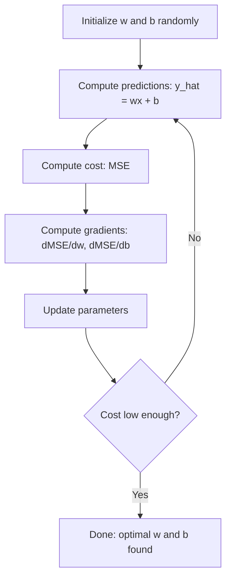

# 线性回归

> 线性回归通过数据绘制最佳直线。这是机器学习的“你好世界”。

** 类型：** 构建
** 语言：** Python
** 课程：** 第1阶段（线性代数，微积分，优化），第2阶段第1课
** 时间：** ~90分钟

## 学习目标

- 推导均方误差的梯度下降更新规则并从头开始实施线性回归
- 比较梯度下降和正规方程的计算复杂性以及何时使用
- 通过特征标准化构建多元线性回归模型并解释学习的权重
- 解释岭回归（L2正规化）如何通过惩罚大权重来防止过拟

## 问题

你有数据：房子的大小和它们的销售价格。你想预测一个给定大小的新房子的价格。你可以在散点图上观察它，但你需要一个公式。你需要一条最适合数据的线，这样你就可以插入任何大小的数据并得到价格预测。

线性回归给你这条线。更重要的是，它引入了整个ML训练循环：定义模型、定义成本函数、优化参数。每个ML算法都遵循相同的模式。在这里用最简单的案例掌握它，你就会到处都能认出它。

这不仅仅是针对简单的问题。线性回归用于生产系统中，用于需求预测、A/B测试分析、财务建模，并作为每个回归任务的基线。

## 概念

### 模型

线性回归假设输入（x）和输出（y）之间存在线性关系：

```
y = wx + b
```

- ' w '（权重/斜坡）：x增加1时y变化多少
- ' b '（偏差/截取）：x = 0时y的值

对于多个输入（功能），这扩展到：

```
y = w1*x1 + w2*x2 + ... + wn*xn + b
```

或采用载体形式：' y = w ' T * x + b '

目标：找到w和b的值，使所有训练示例中的预测y尽可能接近实际y。

### 成本函数（均方误差）

如何衡量“尽可能接近”？你需要一个数字来说明你的预测有多错误。最常见的选择是均方误差（MSE）：

```
MSE = (1/n) * sum((y_predicted - y_actual)^2)
```

为什么平方？两个原因第首先，它对大错误的惩罚大于对小错误的惩罚（10的错误比1的错误严重100倍，而不是10倍）。其次，平方函数在任何地方都是光滑的且可微的，这使得优化变得简单。

成本函数创造了一个表面。对于单个权重w和偏差b，SSE表面看起来像一个碗（凸的椭圆形）。碗的底部是SSE最小化的地方。训练意味着找到底部。

### 梯度下降

梯度下降通过向下的步骤找到碗的底部。



梯度告诉您两件事：每个参数向哪个方向移动，以及移动多少。

对于y_hat = wx + b的SSE：

```
dMSE/dw = (2/n) * sum((y_hat - y) * x)
dMSE/db = (2/n) * sum(y_hat - y)
```

更新规则：

```
w = w - learning_rate * dMSE/dw
b = b - learning_rate * dMSE/db
```

学习率控制步进大小。太大：你超出了最低限度并偏离了。太小：训练需要永远的时间。典型起始值：0.01、0.001或0.0001。

### 正规方程（封闭式解）

具体来说，对于线性回归来说，有一个直接公式可以在无需任何迭代的情况下给出最佳权重：

```
w = (X^T * X)^(-1) * X^T * y
```

这将一个矩阵求逆以一步求出w。它非常适合小型数据集。对于大型数据集（数百万行或数千个特征），首选梯度下降，因为矩阵求逆的特征数量为O（n ' 3）。

### 多元线性回归

该模型具有多个功能，成为：

```
y = w1*x1 + w2*x2 + ... + wn*xn + b
```

一切工作原理相同：SSE是成本函数，梯度下降同时更新所有权重。唯一的区别是您正在适应超平面而不是直线。

功能缩放在这里很重要。如果一个特征的范围从0到1，另一个特征的范围从0到1，000，000，则梯度下降将困难，因为成本表面变得拉长。训练前标准化特征（减去平均值，除以标准差）。

### 多项式回归

如果关系不是线性的怎么办？您仍然可以通过创建多项特征来使用线性回归：

```
y = w1*x + w2*x^2 + w3*x^3 + b
```

这仍然是“线性”回归，因为模型在权重（w1，w2，w3）上是线性的。你只是在使用x的非线性特征。

更高次的多元性可以适应更复杂的曲线，但存在过度适应的风险。10次的多项项将穿过10点数据集中的每个点，但对新数据的预测很差。

### R平方分数

SSE告诉您您错得有多严重，但数字取决于y的规模。R平方（R#2）给出了一个与尺度无关的测量：

```
R^2 = 1 - (sum of squared residuals) / (sum of squared deviations from mean)
    = 1 - SS_res / SS_tot
```

- R2 = 1.0：完美预测
- R#2 = 0.0：模型并不比每次预测平均值更好
- R^2 < 0.0：模型比预测平均值差

### 正规化预览（岭回归）

当您有很多特征时，模型可以通过分配较大的权重来过适应。岭回归（L2正规化）增加了一个惩罚：

```
Cost = MSE + lambda * sum(w_i^2)
```

惩罚项不鼓励大权重。超参数lambda控制着权衡：更高的lambda意味着更小的权重和更多的正则化。这将在后面的课程中深入介绍。现在，知道它的存在以及它为什么有帮助。

## 建设党

### 第1步：生成样本数据

```python
import random
import math

random.seed(42)

TRUE_W = 3.0
TRUE_B = 7.0
N_SAMPLES = 100

X = [random.uniform(0, 10) for _ in range(N_SAMPLES)]
y = [TRUE_W * x + TRUE_B + random.gauss(0, 2.0) for x in X]

print(f"Generated {N_SAMPLES} samples")
print(f"True relationship: y = {TRUE_W}x + {TRUE_B} (+ noise)")
print(f"First 5 points: {[(round(X[i], 2), round(y[i], 2)) for i in range(5)]}")
```

### 第2步：从头开始线性回归，采用梯度下降

```python
class LinearRegression:
    def __init__(self, learning_rate=0.01):
        self.w = 0.0
        self.b = 0.0
        self.lr = learning_rate
        self.cost_history = []

    def predict(self, X):
        return [self.w * x + self.b for x in X]

    def compute_cost(self, X, y):
        predictions = self.predict(X)
        n = len(y)
        cost = sum((pred - actual) ** 2 for pred, actual in zip(predictions, y)) / n
        return cost

    def compute_gradients(self, X, y):
        predictions = self.predict(X)
        n = len(y)
        dw = (2 / n) * sum((pred - actual) * x for pred, actual, x in zip(predictions, y, X))
        db = (2 / n) * sum(pred - actual for pred, actual in zip(predictions, y))
        return dw, db

    def fit(self, X, y, epochs=1000, print_every=200):
        for epoch in range(epochs):
            dw, db = self.compute_gradients(X, y)
            self.w -= self.lr * dw
            self.b -= self.lr * db
            cost = self.compute_cost(X, y)
            self.cost_history.append(cost)
            if epoch % print_every == 0:
                print(f"  Epoch {epoch:4d} | Cost: {cost:.4f} | w: {self.w:.4f} | b: {self.b:.4f}")
        return self

    def r_squared(self, X, y):
        predictions = self.predict(X)
        y_mean = sum(y) / len(y)
        ss_res = sum((actual - pred) ** 2 for actual, pred in zip(y, predictions))
        ss_tot = sum((actual - y_mean) ** 2 for actual in y)
        return 1 - (ss_res / ss_tot)


print("=== Training Linear Regression (Gradient Descent) ===")
model = LinearRegression(learning_rate=0.005)
model.fit(X, y, epochs=1000, print_every=200)
print(f"\nLearned: y = {model.w:.4f}x + {model.b:.4f}")
print(f"True:    y = {TRUE_W}x + {TRUE_B}")
print(f"R-squared: {model.r_squared(X, y):.4f}")
```

### 第3步：正规方程（封闭式解）

```python
class LinearRegressionNormal:
    def __init__(self):
        self.w = 0.0
        self.b = 0.0

    def fit(self, X, y):
        n = len(X)
        x_mean = sum(X) / n
        y_mean = sum(y) / n
        numerator = sum((X[i] - x_mean) * (y[i] - y_mean) for i in range(n))
        denominator = sum((X[i] - x_mean) ** 2 for i in range(n))
        self.w = numerator / denominator
        self.b = y_mean - self.w * x_mean
        return self

    def predict(self, X):
        return [self.w * x + self.b for x in X]

    def r_squared(self, X, y):
        predictions = self.predict(X)
        y_mean = sum(y) / len(y)
        ss_res = sum((actual - pred) ** 2 for actual, pred in zip(y, predictions))
        ss_tot = sum((actual - y_mean) ** 2 for actual in y)
        return 1 - (ss_res / ss_tot)


print("\n=== Normal Equation (Closed-Form) ===")
model_normal = LinearRegressionNormal()
model_normal.fit(X, y)
print(f"Learned: y = {model_normal.w:.4f}x + {model_normal.b:.4f}")
print(f"R-squared: {model_normal.r_squared(X, y):.4f}")
```

### 第4步：多元线性回归

```python
class MultipleLinearRegression:
    def __init__(self, n_features, learning_rate=0.01):
        self.weights = [0.0] * n_features
        self.bias = 0.0
        self.lr = learning_rate
        self.cost_history = []

    def predict_single(self, x):
        return sum(w * xi for w, xi in zip(self.weights, x)) + self.bias

    def predict(self, X):
        return [self.predict_single(x) for x in X]

    def compute_cost(self, X, y):
        predictions = self.predict(X)
        n = len(y)
        return sum((pred - actual) ** 2 for pred, actual in zip(predictions, y)) / n

    def fit(self, X, y, epochs=1000, print_every=200):
        n = len(y)
        n_features = len(X[0])
        for epoch in range(epochs):
            predictions = self.predict(X)
            errors = [pred - actual for pred, actual in zip(predictions, y)]
            for j in range(n_features):
                grad = (2 / n) * sum(errors[i] * X[i][j] for i in range(n))
                self.weights[j] -= self.lr * grad
            grad_b = (2 / n) * sum(errors)
            self.bias -= self.lr * grad_b
            cost = self.compute_cost(X, y)
            self.cost_history.append(cost)
            if epoch % print_every == 0:
                print(f"  Epoch {epoch:4d} | Cost: {cost:.4f}")
        return self

    def r_squared(self, X, y):
        predictions = self.predict(X)
        y_mean = sum(y) / len(y)
        ss_res = sum((actual - pred) ** 2 for actual, pred in zip(y, predictions))
        ss_tot = sum((actual - y_mean) ** 2 for actual in y)
        return 1 - (ss_res / ss_tot)


random.seed(42)
N = 100
X_multi = []
y_multi = []
for _ in range(N):
    size = random.uniform(500, 3000)
    bedrooms = random.randint(1, 5)
    age = random.uniform(0, 50)
    price = 50 * size + 10000 * bedrooms - 1000 * age + 50000 + random.gauss(0, 20000)
    X_multi.append([size, bedrooms, age])
    y_multi.append(price)


def standardize(X):
    n_features = len(X[0])
    means = [sum(X[i][j] for i in range(len(X))) / len(X) for j in range(n_features)]
    stds = []
    for j in range(n_features):
        variance = sum((X[i][j] - means[j]) ** 2 for i in range(len(X))) / len(X)
        stds.append(variance ** 0.5)
    X_scaled = []
    for i in range(len(X)):
        row = [(X[i][j] - means[j]) / stds[j] if stds[j] > 0 else 0 for j in range(n_features)]
        X_scaled.append(row)
    return X_scaled, means, stds


y_mean_val = sum(y_multi) / len(y_multi)
y_std_val = (sum((yi - y_mean_val) ** 2 for yi in y_multi) / len(y_multi)) ** 0.5
y_scaled = [(yi - y_mean_val) / y_std_val for yi in y_multi]

X_scaled, x_means, x_stds = standardize(X_multi)

print("\n=== Multiple Linear Regression (3 features) ===")
print("Features: house size, bedrooms, age")
multi_model = MultipleLinearRegression(n_features=3, learning_rate=0.01)
multi_model.fit(X_scaled, y_scaled, epochs=1000, print_every=200)

print(f"\nWeights (standardized): {[round(w, 4) for w in multi_model.weights]}")
print(f"Bias (standardized): {multi_model.bias:.4f}")
print(f"R-squared: {multi_model.r_squared(X_scaled, y_scaled):.4f}")
```

### 第5步：多元回归

```python
class PolynomialRegression:
    def __init__(self, degree, learning_rate=0.01):
        self.degree = degree
        self.weights = [0.0] * degree
        self.bias = 0.0
        self.lr = learning_rate

    def make_features(self, X):
        return [[x ** (d + 1) for d in range(self.degree)] for x in X]

    def predict(self, X):
        features = self.make_features(X)
        return [sum(w * f for w, f in zip(self.weights, row)) + self.bias for row in features]

    def fit(self, X, y, epochs=1000, print_every=200):
        features = self.make_features(X)
        n = len(y)
        for epoch in range(epochs):
            predictions = [sum(w * f for w, f in zip(self.weights, row)) + self.bias for row in features]
            errors = [pred - actual for pred, actual in zip(predictions, y)]
            for j in range(self.degree):
                grad = (2 / n) * sum(errors[i] * features[i][j] for i in range(n))
                self.weights[j] -= self.lr * grad
            grad_b = (2 / n) * sum(errors)
            self.bias -= self.lr * grad_b
            if epoch % print_every == 0:
                cost = sum(e ** 2 for e in errors) / n
                print(f"  Epoch {epoch:4d} | Cost: {cost:.6f}")
        return self

    def r_squared(self, X, y):
        predictions = self.predict(X)
        y_mean = sum(y) / len(y)
        ss_res = sum((actual - pred) ** 2 for actual, pred in zip(y, predictions))
        ss_tot = sum((actual - y_mean) ** 2 for actual in y)
        return 1 - (ss_res / ss_tot)


random.seed(42)
X_poly = [x / 10.0 for x in range(0, 50)]
y_poly = [0.5 * x ** 2 - 2 * x + 3 + random.gauss(0, 1.0) for x in X_poly]

x_max = max(abs(x) for x in X_poly)
X_poly_norm = [x / x_max for x in X_poly]
y_poly_mean = sum(y_poly) / len(y_poly)
y_poly_std = (sum((yi - y_poly_mean) ** 2 for yi in y_poly) / len(y_poly)) ** 0.5
y_poly_norm = [(yi - y_poly_mean) / y_poly_std for yi in y_poly]

print("\n=== Polynomial Regression (degree 2 vs degree 5) ===")
print("True relationship: y = 0.5x^2 - 2x + 3")

print("\nDegree 2:")
poly2 = PolynomialRegression(degree=2, learning_rate=0.1)
poly2.fit(X_poly_norm, y_poly_norm, epochs=2000, print_every=500)
print(f"  R-squared: {poly2.r_squared(X_poly_norm, y_poly_norm):.4f}")

print("\nDegree 5:")
poly5 = PolynomialRegression(degree=5, learning_rate=0.1)
poly5.fit(X_poly_norm, y_poly_norm, epochs=2000, print_every=500)
print(f"  R-squared: {poly5.r_squared(X_poly_norm, y_poly_norm):.4f}")

print("\nDegree 2 fits the true curve well. Degree 5 fits training data slightly better")
print("but risks overfitting on new data.")
```

### 第6步：岭回归（L2正规化）

```python
class RidgeRegression:
    def __init__(self, n_features, learning_rate=0.01, alpha=1.0):
        self.weights = [0.0] * n_features
        self.bias = 0.0
        self.lr = learning_rate
        self.alpha = alpha

    def predict_single(self, x):
        return sum(w * xi for w, xi in zip(self.weights, x)) + self.bias

    def predict(self, X):
        return [self.predict_single(x) for x in X]

    def fit(self, X, y, epochs=1000, print_every=200):
        n = len(y)
        n_features = len(X[0])
        for epoch in range(epochs):
            predictions = self.predict(X)
            errors = [pred - actual for pred, actual in zip(predictions, y)]
            mse = sum(e ** 2 for e in errors) / n
            reg_term = self.alpha * sum(w ** 2 for w in self.weights)
            cost = mse + reg_term
            for j in range(n_features):
                grad = (2 / n) * sum(errors[i] * X[i][j] for i in range(n))
                grad += 2 * self.alpha * self.weights[j]
                self.weights[j] -= self.lr * grad
            grad_b = (2 / n) * sum(errors)
            self.bias -= self.lr * grad_b
            if epoch % print_every == 0:
                print(f"  Epoch {epoch:4d} | Cost: {cost:.4f} | L2 penalty: {reg_term:.4f}")
        return self


print("\n=== Ridge Regression (L2 Regularization) ===")
print("Same data as multiple regression, with alpha=0.1")
ridge = RidgeRegression(n_features=3, learning_rate=0.01, alpha=0.1)
ridge.fit(X_scaled, y_scaled, epochs=1000, print_every=200)
print(f"\nRidge weights: {[round(w, 4) for w in ridge.weights]}")
print(f"Plain weights: {[round(w, 4) for w in multi_model.weights]}")
print("Ridge weights are smaller (shrunk toward zero) due to the L2 penalty.")
```

## 使用它

现在scikit-learn也是同样的事情，这是您将在生产中实际使用的东西。

```python
from sklearn.linear_model import LinearRegression as SklearnLR
from sklearn.linear_model import Ridge
from sklearn.preprocessing import PolynomialFeatures, StandardScaler
from sklearn.model_selection import train_test_split
from sklearn.metrics import mean_squared_error, r2_score
import numpy as np

np.random.seed(42)
X_sk = np.random.uniform(0, 10, (100, 1))
y_sk = 3.0 * X_sk.squeeze() + 7.0 + np.random.normal(0, 2.0, 100)

X_train, X_test, y_train, y_test = train_test_split(X_sk, y_sk, test_size=0.2, random_state=42)

lr = SklearnLR()
lr.fit(X_train, y_train)
y_pred = lr.predict(X_test)

print("=== Scikit-learn Linear Regression ===")
print(f"Coefficient (w): {lr.coef_[0]:.4f}")
print(f"Intercept (b): {lr.intercept_:.4f}")
print(f"R-squared (test): {r2_score(y_test, y_pred):.4f}")
print(f"MSE (test): {mean_squared_error(y_test, y_pred):.4f}")

poly = PolynomialFeatures(degree=2, include_bias=False)
X_poly_sk = poly.fit_transform(X_train)
X_poly_test = poly.transform(X_test)

lr_poly = SklearnLR()
lr_poly.fit(X_poly_sk, y_train)
print(f"\nPolynomial degree 2 R-squared: {r2_score(y_test, lr_poly.predict(X_poly_test)):.4f}")

scaler = StandardScaler()
X_train_scaled = scaler.fit_transform(X_train)
X_test_scaled = scaler.transform(X_test)

ridge = Ridge(alpha=1.0)
ridge.fit(X_train_scaled, y_train)
print(f"Ridge R-squared: {r2_score(y_test, ridge.predict(X_test_scaled)):.4f}")
print(f"Ridge coefficient: {ridge.coef_[0]:.4f}")
```

从头开始实施和scikit-learn会产生相同的结果。区别在于：scikit-learn处理边缘情况、数值稳定性和性能优化。使用库进行生产。使用从头开始的版本来了解正在发生的事情。

## 把它运

本课产生：
- `outputs/skill-regression.md` -根据问题选择正确回归方法的技能

## 演习

1. 实现批量梯度下降、随机梯度下降（BCD）和迷你批量梯度下降。比较同一数据集上的收敛速度。哪个收敛得最快？哪个成本曲线最平稳？
2. 从三次函数（y = ax ' 3 + bx ' 2 + cx + d + noise）生成数据。匹配1、3和10次的多项项。比较训练R#2和测试R#2。过度配合在多大程度上变得明显？
3. 实现Lasso回归（L1正规化：罚分= Alpha * sum（|w_i|)).利用多功能住房数据进行培训。比较哪些权重变为零与Ridge。为什么L1产生稀疏解，而L2不产生？

## 关键术语

| Term | 别人怎么说 | 它实际上意味着什么 |
|------|----------------|----------------------|
| 线性回归 | “通过数据划清界限” | 找到最小化wx+b与实际y值之间的平方差和的和的权重w和偏差b |
| 成本函数 | “这个模型有多糟糕” | 将模型参数映射到测量预测误差的单个数字的功能，优化最小化了该数字 |
| 均方误差 | “误差平方平均值” | （1/n）*（预测-实际）' 2的和，对大错误的惩罚不成比例 |
| 梯度下降 | “走下坡路” | 使用偏求导沿着降低成本函数的方向迭代调整参数 |
| 学习率 | “步骤大小” | 控制每个梯度下降步骤参数变化多少的纯量 |
| 正规方程 | “直接解决” | 封闭形式的解w =（X ' T ' X ' T '，无需迭代即可给出最佳权重 |
| r平方 | “合身有多好” | 模型解释的y方差分数，范围从负无穷大到1.0 |
| 特征缩放 | “使功能具有可比性” | 将功能转换到相似的范围（例如，零均值，单位方差），因此梯度下降收敛得更快 |
| 正则化 | “惩罚复杂性” | 在成本函数中添加一个项来缩小权重，防止过度匹配 |
| 岭回归 | “L2正规化” | 线性回归，罚值为ambda * sum（w_i ' 2）添加到SSE |
| 多项式回归 | “用线性数学来匹配曲线” | 关于多项特征（x，x#2，x#3，..）的线性回归，重量仍然呈线性 |
| 过拟合 | “简化训练数据” | 使用一个如此复杂的模型，以至于它适合训练数据中的噪音，但在新数据上失败 |

## 进一步阅读

- [An统计学习简介（ISLR）]（https：//www.statlearning.com/）--免费PDF，第3章和第6章涵盖线性回归和正规化以及实用的R示例
- [The统计学习要素（ESL）]（https：//hastie.su.domains/ElemStatLearn/）--免费PDF，ISLR的数学伴侣，对山脊和套索进行了更深入的处理
- [斯坦福CS 229线性回归讲座笔记]（https：//cs229.stanford.edu/main_notes.pdf）-- Andrew Ng的笔记从第一性原理推导正规方程和梯度下降
- [scikit-learn LinearRegulation文档]（https：//scikit-learn.org/stable/modules/linear_model.html）--LinearRegulation、Ridge、Lasso和ElasticNet的实用参考代码示例
