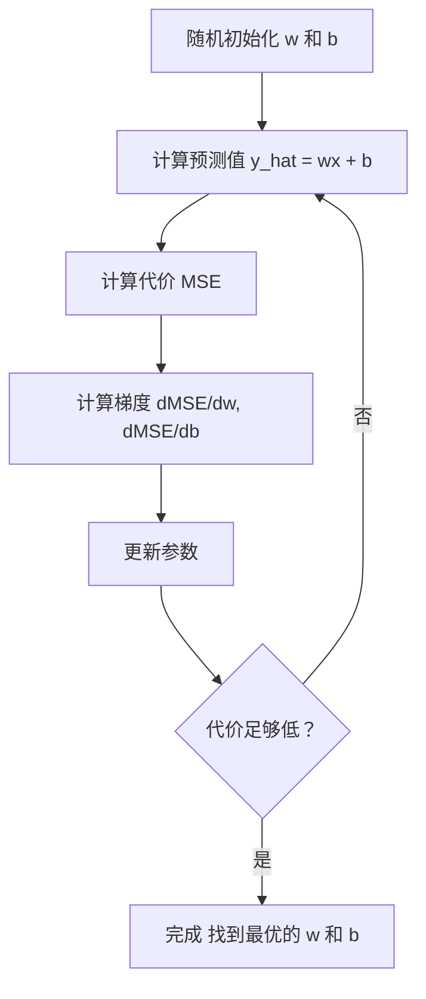

# 线性回归（Linear Regression）

> 译注：本文译自同目录 [`en.md`](./en.md)。术语遵循仓根 [TRANSLATION_GUIDE.md](../../../../TRANSLATION_GUIDE.md)。

> 线性回归就是给你的数据画一条最贴合的直线。它是机器学习的「hello world」。

**Type:** Build
**Languages:** Python
**Prerequisites:** Phase 1（线性代数、微积分、优化）, Phase 2 Lesson 1
**Time:** ~90 minutes

## 学习目标（Learning Objectives）

- 推导出针对均方误差（mean squared error）的梯度下降更新规则，并从零实现线性回归
- 在计算复杂度层面比较梯度下降与 normal equation（正规方程），并判断什么场景该用哪个
- 构建带特征标准化的多元线性回归模型，并解释学到的权重含义
- 解释 Ridge 回归（L2 正则化）如何通过惩罚过大的权重来防止过拟合

## 问题（The Problem）

你手上有一批数据：房子的面积和成交价格。你想根据面积预测一套新房子的价格。靠肉眼在散点图上比划当然也行，但你需要一个公式——一条尽可能贴合数据的直线，这样任何面积塞进去都能给出价格预测。

线性回归就给你这条线。但更重要的是，它把整个 ML 训练循环走了一遍：定义模型、定义代价函数、优化参数。每一种 ML 算法都遵循这一套流程。在这里用最简单的场景把它吃透，之后你到哪都认得出来。

这玩意可不止用于玩具问题。线性回归在生产系统中真用：需求预测、A/B 测试分析、金融建模，以及作为所有回归任务的基线（baseline）。

## 概念（The Concept）

### 模型（The Model）

线性回归假设输入（x）和输出（y）之间是线性关系：

```
y = wx + b
```

- `w`（权重 / 斜率）：x 增加 1 时，y 变化多少
- `b`（偏置 / 截距）：当 x = 0 时 y 的值

对多个输入（特征）的情况，扩展为：

```
y = w1*x1 + w2*x2 + ... + wn*xn + b
```

或者写成向量形式：`y = w^T * x + b`

目标：找到一组 w 和 b，让所有训练样本上预测的 y 都尽可能接近实际的 y。

### 代价函数（均方误差，Mean Squared Error）

那「尽可能接近」该怎么量化？你需要一个数字来概括「预测错得多离谱」。最常用的选择就是均方误差（Mean Squared Error，MSE）：

```
MSE = (1/n) * sum((y_predicted - y_actual)^2)
```

为什么平方？两个原因。其一，它对大误差的惩罚比小误差更狠（误差为 10 时是误差为 1 的 100 倍糟，而不是 10 倍）。其二，平方函数处处光滑、处处可导，让优化变得直截了当。

代价函数会构成一个曲面。对单一权重 w 和偏置 b 来说，MSE 曲面长得像个碗（一个凸的抛物面）。碗底就是 MSE 取最小值的地方。所谓训练，就是找这个碗底。

### 梯度下降（Gradient Descent）

梯度下降通过一步步往下走来寻找碗底。



梯度告诉你两件事：每个参数该往哪个方向走，以及走多大步。

对 y_hat = wx + b 的 MSE 来说：

```
dMSE/dw = (2/n) * sum((y_hat - y) * x)
dMSE/db = (2/n) * sum(y_hat - y)
```

更新规则：

```
w = w - learning_rate * dMSE/dw
b = b - learning_rate * dMSE/db
```

学习率（learning rate）控制步长。太大：你会冲过最小值并发散。太小：训练慢得离谱。常见的起始值：0.01、0.001 或 0.0001。

### Normal Equation（正规方程，闭式解）

仅就线性回归而言，存在一个直接给出最优权重的公式，连迭代都不用：

```
w = (X^T * X)^(-1) * X^T * y
```

它通过一次矩阵求逆就解出了 w。在小数据集上效果完美。但对于大数据集（数百万行或数千个特征），还是更倾向于梯度下降，因为矩阵求逆在特征数上是 O(n^3) 的复杂度。

### 多元线性回归（Multiple Linear Regression）

特征数变多以后，模型变成：

```
y = w1*x1 + w2*x2 + ... + wn*xn + b
```

其它一切照旧：MSE 仍然是代价函数，梯度下降同时更新所有权重。唯一的区别是，你现在拟合的是一个超平面而不是一条直线。

特征缩放在这里很关键。如果一个特征的范围是 0 到 1，另一个是 0 到 1,000,000，梯度下降会很难受，因为代价曲面会被严重拉长。训练前先把特征标准化（减均值、除以标准差）。

### 多项式回归（Polynomial Regression）

如果关系不是线性的怎么办？你仍然可以用线性回归——只要构造多项式特征即可：

```
y = w1*x + w2*x^2 + w3*x^3 + b
```

它仍然属于「线性」回归，因为模型对权重（w1、w2、w3）是线性的。你只是在用 x 的非线性特征罢了。

更高次的多项式可以拟合更复杂的曲线，但有过拟合的风险。一个 10 次多项式能完美穿过 10 个点的数据集中的每一个点，但在新数据上预测得稀烂。

### R 方分数（R-Squared Score）

MSE 告诉你错得多严重，但这个数字依赖于 y 的尺度。R 方（R^2）给出一个与尺度无关的度量：

```
R^2 = 1 - (sum of squared residuals) / (sum of squared deviations from mean)
    = 1 - SS_res / SS_tot
```

- R^2 = 1.0：预测完美
- R^2 = 0.0：模型并不比每次都预测平均值更好
- R^2 < 0.0：模型比直接预测平均值还烂

### 正则化预告（Ridge 回归）

特征一多，模型就可能给出超大的权重，导致过拟合。Ridge 回归（L2 正则化）会加上一项惩罚：

```
Cost = MSE + lambda * sum(w_i^2)
```

惩罚项不鼓励权重过大。超参数 lambda 控制权衡：lambda 越大，权重越小，正则化越强。这部分会在后面的课里深入讲。现在你只要知道它存在、为什么有用就行。

## 动手实现（Build It）

### Step 1: Generate sample data

```python
import random
import math

random.seed(42)

TRUE_W = 3.0
TRUE_B = 7.0
N_SAMPLES = 100

X = [random.uniform(0, 10) for _ in range(N_SAMPLES)]
y = [TRUE_W * x + TRUE_B + random.gauss(0, 2.0) for x in X]

print(f"Generated {N_SAMPLES} samples")
print(f"True relationship: y = {TRUE_W}x + {TRUE_B} (+ noise)")
print(f"First 5 points: {[(round(X[i], 2), round(y[i], 2)) for i in range(5)]}")
```

### Step 2: Linear regression from scratch with gradient descent

```python
class LinearRegression:
    def __init__(self, learning_rate=0.01):
        self.w = 0.0
        self.b = 0.0
        self.lr = learning_rate
        self.cost_history = []

    def predict(self, X):
        return [self.w * x + self.b for x in X]

    def compute_cost(self, X, y):
        predictions = self.predict(X)
        n = len(y)
        cost = sum((pred - actual) ** 2 for pred, actual in zip(predictions, y)) / n
        return cost

    def compute_gradients(self, X, y):
        predictions = self.predict(X)
        n = len(y)
        dw = (2 / n) * sum((pred - actual) * x for pred, actual, x in zip(predictions, y, X))
        db = (2 / n) * sum(pred - actual for pred, actual in zip(predictions, y))
        return dw, db

    def fit(self, X, y, epochs=1000, print_every=200):
        for epoch in range(epochs):
            dw, db = self.compute_gradients(X, y)
            self.w -= self.lr * dw
            self.b -= self.lr * db
            cost = self.compute_cost(X, y)
            self.cost_history.append(cost)
            if epoch % print_every == 0:
                print(f"  Epoch {epoch:4d} | Cost: {cost:.4f} | w: {self.w:.4f} | b: {self.b:.4f}")
        return self

    def r_squared(self, X, y):
        predictions = self.predict(X)
        y_mean = sum(y) / len(y)
        ss_res = sum((actual - pred) ** 2 for actual, pred in zip(y, predictions))
        ss_tot = sum((actual - y_mean) ** 2 for actual in y)
        return 1 - (ss_res / ss_tot)


print("=== Training Linear Regression (Gradient Descent) ===")
model = LinearRegression(learning_rate=0.005)
model.fit(X, y, epochs=1000, print_every=200)
print(f"\nLearned: y = {model.w:.4f}x + {model.b:.4f}")
print(f"True:    y = {TRUE_W}x + {TRUE_B}")
print(f"R-squared: {model.r_squared(X, y):.4f}")
```

### Step 3: Normal equation (closed-form solution)

```python
class LinearRegressionNormal:
    def __init__(self):
        self.w = 0.0
        self.b = 0.0

    def fit(self, X, y):
        n = len(X)
        x_mean = sum(X) / n
        y_mean = sum(y) / n
        numerator = sum((X[i] - x_mean) * (y[i] - y_mean) for i in range(n))
        denominator = sum((X[i] - x_mean) ** 2 for i in range(n))
        self.w = numerator / denominator
        self.b = y_mean - self.w * x_mean
        return self

    def predict(self, X):
        return [self.w * x + self.b for x in X]

    def r_squared(self, X, y):
        predictions = self.predict(X)
        y_mean = sum(y) / len(y)
        ss_res = sum((actual - pred) ** 2 for actual, pred in zip(y, predictions))
        ss_tot = sum((actual - y_mean) ** 2 for actual in y)
        return 1 - (ss_res / ss_tot)


print("\n=== Normal Equation (Closed-Form) ===")
model_normal = LinearRegressionNormal()
model_normal.fit(X, y)
print(f"Learned: y = {model_normal.w:.4f}x + {model_normal.b:.4f}")
print(f"R-squared: {model_normal.r_squared(X, y):.4f}")
```

### Step 4: Multiple linear regression

```python
class MultipleLinearRegression:
    def __init__(self, n_features, learning_rate=0.01):
        self.weights = [0.0] * n_features
        self.bias = 0.0
        self.lr = learning_rate
        self.cost_history = []

    def predict_single(self, x):
        return sum(w * xi for w, xi in zip(self.weights, x)) + self.bias

    def predict(self, X):
        return [self.predict_single(x) for x in X]

    def compute_cost(self, X, y):
        predictions = self.predict(X)
        n = len(y)
        return sum((pred - actual) ** 2 for pred, actual in zip(predictions, y)) / n

    def fit(self, X, y, epochs=1000, print_every=200):
        n = len(y)
        n_features = len(X[0])
        for epoch in range(epochs):
            predictions = self.predict(X)
            errors = [pred - actual for pred, actual in zip(predictions, y)]
            for j in range(n_features):
                grad = (2 / n) * sum(errors[i] * X[i][j] for i in range(n))
                self.weights[j] -= self.lr * grad
            grad_b = (2 / n) * sum(errors)
            self.bias -= self.lr * grad_b
            cost = self.compute_cost(X, y)
            self.cost_history.append(cost)
            if epoch % print_every == 0:
                print(f"  Epoch {epoch:4d} | Cost: {cost:.4f}")
        return self

    def r_squared(self, X, y):
        predictions = self.predict(X)
        y_mean = sum(y) / len(y)
        ss_res = sum((actual - pred) ** 2 for actual, pred in zip(y, predictions))
        ss_tot = sum((actual - y_mean) ** 2 for actual in y)
        return 1 - (ss_res / ss_tot)


random.seed(42)
N = 100
X_multi = []
y_multi = []
for _ in range(N):
    size = random.uniform(500, 3000)
    bedrooms = random.randint(1, 5)
    age = random.uniform(0, 50)
    price = 50 * size + 10000 * bedrooms - 1000 * age + 50000 + random.gauss(0, 20000)
    X_multi.append([size, bedrooms, age])
    y_multi.append(price)


def standardize(X):
    n_features = len(X[0])
    means = [sum(X[i][j] for i in range(len(X))) / len(X) for j in range(n_features)]
    stds = []
    for j in range(n_features):
        variance = sum((X[i][j] - means[j]) ** 2 for i in range(len(X))) / len(X)
        stds.append(variance ** 0.5)
    X_scaled = []
    for i in range(len(X)):
        row = [(X[i][j] - means[j]) / stds[j] if stds[j] > 0 else 0 for j in range(n_features)]
        X_scaled.append(row)
    return X_scaled, means, stds


y_mean_val = sum(y_multi) / len(y_multi)
y_std_val = (sum((yi - y_mean_val) ** 2 for yi in y_multi) / len(y_multi)) ** 0.5
y_scaled = [(yi - y_mean_val) / y_std_val for yi in y_multi]

X_scaled, x_means, x_stds = standardize(X_multi)

print("\n=== Multiple Linear Regression (3 features) ===")
print("Features: house size, bedrooms, age")
multi_model = MultipleLinearRegression(n_features=3, learning_rate=0.01)
multi_model.fit(X_scaled, y_scaled, epochs=1000, print_every=200)

print(f"\nWeights (standardized): {[round(w, 4) for w in multi_model.weights]}")
print(f"Bias (standardized): {multi_model.bias:.4f}")
print(f"R-squared: {multi_model.r_squared(X_scaled, y_scaled):.4f}")
```

### Step 5: Polynomial regression

```python
class PolynomialRegression:
    def __init__(self, degree, learning_rate=0.01):
        self.degree = degree
        self.weights = [0.0] * degree
        self.bias = 0.0
        self.lr = learning_rate

    def make_features(self, X):
        return [[x ** (d + 1) for d in range(self.degree)] for x in X]

    def predict(self, X):
        features = self.make_features(X)
        return [sum(w * f for w, f in zip(self.weights, row)) + self.bias for row in features]

    def fit(self, X, y, epochs=1000, print_every=200):
        features = self.make_features(X)
        n = len(y)
        for epoch in range(epochs):
            predictions = [sum(w * f for w, f in zip(self.weights, row)) + self.bias for row in features]
            errors = [pred - actual for pred, actual in zip(predictions, y)]
            for j in range(self.degree):
                grad = (2 / n) * sum(errors[i] * features[i][j] for i in range(n))
                self.weights[j] -= self.lr * grad
            grad_b = (2 / n) * sum(errors)
            self.bias -= self.lr * grad_b
            if epoch % print_every == 0:
                cost = sum(e ** 2 for e in errors) / n
                print(f"  Epoch {epoch:4d} | Cost: {cost:.6f}")
        return self

    def r_squared(self, X, y):
        predictions = self.predict(X)
        y_mean = sum(y) / len(y)
        ss_res = sum((actual - pred) ** 2 for actual, pred in zip(y, predictions))
        ss_tot = sum((actual - y_mean) ** 2 for actual in y)
        return 1 - (ss_res / ss_tot)


random.seed(42)
X_poly = [x / 10.0 for x in range(0, 50)]
y_poly = [0.5 * x ** 2 - 2 * x + 3 + random.gauss(0, 1.0) for x in X_poly]

x_max = max(abs(x) for x in X_poly)
X_poly_norm = [x / x_max for x in X_poly]
y_poly_mean = sum(y_poly) / len(y_poly)
y_poly_std = (sum((yi - y_poly_mean) ** 2 for yi in y_poly) / len(y_poly)) ** 0.5
y_poly_norm = [(yi - y_poly_mean) / y_poly_std for yi in y_poly]

print("\n=== Polynomial Regression (degree 2 vs degree 5) ===")
print("True relationship: y = 0.5x^2 - 2x + 3")

print("\nDegree 2:")
poly2 = PolynomialRegression(degree=2, learning_rate=0.1)
poly2.fit(X_poly_norm, y_poly_norm, epochs=2000, print_every=500)
print(f"  R-squared: {poly2.r_squared(X_poly_norm, y_poly_norm):.4f}")

print("\nDegree 5:")
poly5 = PolynomialRegression(degree=5, learning_rate=0.1)
poly5.fit(X_poly_norm, y_poly_norm, epochs=2000, print_every=500)
print(f"  R-squared: {poly5.r_squared(X_poly_norm, y_poly_norm):.4f}")

print("\nDegree 2 fits the true curve well. Degree 5 fits training data slightly better")
print("but risks overfitting on new data.")
```

### Step 6: Ridge regression (L2 regularization)

```python
class RidgeRegression:
    def __init__(self, n_features, learning_rate=0.01, alpha=1.0):
        self.weights = [0.0] * n_features
        self.bias = 0.0
        self.lr = learning_rate
        self.alpha = alpha

    def predict_single(self, x):
        return sum(w * xi for w, xi in zip(self.weights, x)) + self.bias

    def predict(self, X):
        return [self.predict_single(x) for x in X]

    def fit(self, X, y, epochs=1000, print_every=200):
        n = len(y)
        n_features = len(X[0])
        for epoch in range(epochs):
            predictions = self.predict(X)
            errors = [pred - actual for pred, actual in zip(predictions, y)]
            mse = sum(e ** 2 for e in errors) / n
            reg_term = self.alpha * sum(w ** 2 for w in self.weights)
            cost = mse + reg_term
            for j in range(n_features):
                grad = (2 / n) * sum(errors[i] * X[i][j] for i in range(n))
                grad += 2 * self.alpha * self.weights[j]
                self.weights[j] -= self.lr * grad
            grad_b = (2 / n) * sum(errors)
            self.bias -= self.lr * grad_b
            if epoch % print_every == 0:
                print(f"  Epoch {epoch:4d} | Cost: {cost:.4f} | L2 penalty: {reg_term:.4f}")
        return self


print("\n=== Ridge Regression (L2 Regularization) ===")
print("Same data as multiple regression, with alpha=0.1")
ridge = RidgeRegression(n_features=3, learning_rate=0.01, alpha=0.1)
ridge.fit(X_scaled, y_scaled, epochs=1000, print_every=200)
print(f"\nRidge weights: {[round(w, 4) for w in ridge.weights]}")
print(f"Plain weights: {[round(w, 4) for w in multi_model.weights]}")
print("Ridge weights are smaller (shrunk toward zero) due to the L2 penalty.")
```

## 用起来（Use It）

接下来用 scikit-learn 干同样的事——这才是你在生产里真正会用的东西。

```python
from sklearn.linear_model import LinearRegression as SklearnLR
from sklearn.linear_model import Ridge
from sklearn.preprocessing import PolynomialFeatures, StandardScaler
from sklearn.model_selection import train_test_split
from sklearn.metrics import mean_squared_error, r2_score
import numpy as np

np.random.seed(42)
X_sk = np.random.uniform(0, 10, (100, 1))
y_sk = 3.0 * X_sk.squeeze() + 7.0 + np.random.normal(0, 2.0, 100)

X_train, X_test, y_train, y_test = train_test_split(X_sk, y_sk, test_size=0.2, random_state=42)

lr = SklearnLR()
lr.fit(X_train, y_train)
y_pred = lr.predict(X_test)

print("=== Scikit-learn Linear Regression ===")
print(f"Coefficient (w): {lr.coef_[0]:.4f}")
print(f"Intercept (b): {lr.intercept_:.4f}")
print(f"R-squared (test): {r2_score(y_test, y_pred):.4f}")
print(f"MSE (test): {mean_squared_error(y_test, y_pred):.4f}")

poly = PolynomialFeatures(degree=2, include_bias=False)
X_poly_sk = poly.fit_transform(X_train)
X_poly_test = poly.transform(X_test)

lr_poly = SklearnLR()
lr_poly.fit(X_poly_sk, y_train)
print(f"\nPolynomial degree 2 R-squared: {r2_score(y_test, lr_poly.predict(X_poly_test)):.4f}")

scaler = StandardScaler()
X_train_scaled = scaler.fit_transform(X_train)
X_test_scaled = scaler.transform(X_test)

ridge = Ridge(alpha=1.0)
ridge.fit(X_train_scaled, y_train)
print(f"Ridge R-squared: {r2_score(y_test, ridge.predict(X_test_scaled)):.4f}")
print(f"Ridge coefficient: {ridge.coef_[0]:.4f}")
```

你的从零实现和 scikit-learn 给出的结果是一样的。区别在于：scikit-learn 处理了边界情况、数值稳定性以及性能优化。生产里用库；从零写的版本用来理解里面到底在干什么。

## 上线部署（Ship It）

本课产出：
- `outputs/skill-regression.md` —— 一份用来根据问题选择合适回归方法的 skill

## 练习（Exercises）

1. 实现 batch 梯度下降、随机梯度下降（SGD）以及 mini-batch 梯度下降。在同一个数据集上比较收敛速度。哪个收敛最快？哪个的代价曲线最平滑？
2. 用一个三次函数生成数据（y = ax^3 + bx^2 + cx + d + 噪声）。分别拟合 1 次、3 次、10 次多项式。比较训练 R^2 和测试 R^2。在哪个次数上过拟合开始变得明显？
3. 实现 Lasso 回归（L1 正则化：penalty = alpha * sum(|w_i|)）。用多特征的房价数据训练。和 Ridge 比较，哪些权重被压成了零？为什么 L1 会产生稀疏解，而 L2 不会？

## 关键术语（Key Terms）

| 术语 | 大家通常怎么说 | 它实际上是什么 |
|------|----------------|----------------------|
| 线性回归（Linear regression） | "在数据里画一条线" | 找到权重 w 和偏置 b，使得 wx+b 与实际 y 值之间的平方差之和最小 |
| 代价函数（Cost function） | "模型有多烂" | 一个把模型参数映射成单一数字的函数，用来度量预测误差，优化要最小化它 |
| 均方误差（Mean squared error） | "误差平方的平均" | (1/n) * sum((predicted - actual)^2)，对大误差的惩罚是不成比例的 |
| 梯度下降（Gradient descent） | "往山下走" | 利用偏导数，沿着减小代价函数的方向迭代调整参数 |
| 学习率（Learning rate） | "步长" | 控制每一步梯度下降参数变化幅度的标量 |
| Normal equation（正规方程） | "直接解出来" | 闭式解 w = (X^T X)^-1 X^T y，不用迭代就能给出最优权重 |
| R 方（R-squared） | "拟合得有多好" | 模型解释 y 中方差的比例，取值范围从负无穷到 1.0 |
| 特征缩放（Feature scaling） | "让特征可比" | 把特征变换到相近的尺度（例如零均值、单位方差），让梯度下降收敛更快 |
| 正则化（Regularization） | "惩罚复杂度" | 在代价函数里加一项来收缩权重，防止过拟合 |
| Ridge 回归（Ridge regression） | "L2 正则化" | 在 MSE 上加上 lambda * sum(w_i^2) 的惩罚的线性回归 |
| 多项式回归（Polynomial regression） | "用线性数学去拟合曲线" | 在多项式特征（x、x^2、x^3、...）上做线性回归，对权重仍然是线性的 |
| 过拟合（Overfitting） | "把训练数据背下来了" | 模型复杂到把训练数据中的噪声也拟合进去，结果在新数据上失败 |

## 延伸阅读（Further Reading）

- [An Introduction to Statistical Learning (ISLR)](https://www.statlearning.com/) —— 免费 PDF，第 3 章和第 6 章覆盖线性回归和正则化，有可上手的 R 实例
- [The Elements of Statistical Learning (ESL)](https://hastie.su.domains/ElemStatLearn/) —— 免费 PDF，ISLR 的数学加强版，对 ridge 和 lasso 有更深入的处理
- [Stanford CS229 Lecture Notes on Linear Regression](https://cs229.stanford.edu/main_notes.pdf) —— Andrew Ng 的讲义，从第一性原理推导 normal equation 和梯度下降
- [scikit-learn LinearRegression documentation](https://scikit-learn.org/stable/modules/linear_model.html) —— LinearRegression、Ridge、Lasso、ElasticNet 的实操参考，附代码示例
