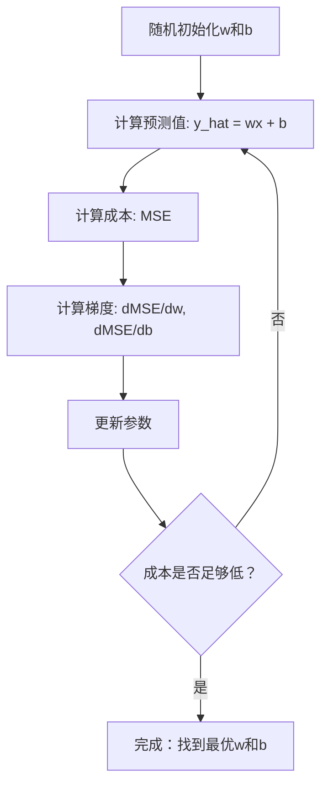

# 线性回归（Linear Regression）

> 线性回归会通过你的数据绘制出最佳直线。它是机器学习的“Hello World”。

**类型：** 构建
**语言：** Python
**前置要求：** 第一阶段（线性代数、微积分、优化）、第二阶段第1课
**时间：** 约90分钟

## 学习目标

- 推导均方误差（Mean Squared Error，MSE）的梯度下降（Gradient Descent）更新规则，并从零实现线性回归
- 在计算复杂度上比较梯度下降与正规方程（Normal Equation），并理解何时使用哪种方法
- 构建带有特征标准化的多元线性回归模型，并解读学习到的权重
- 解释岭回归（Ridge Regression）（L2正则化）如何通过惩罚大权重来防止过拟合

## 问题

你有数据：房屋面积和售价。你想根据面积预测新房价格。你可以在散点图上目测，但你需要一个公式。你需要一条最佳拟合数据的直线，这样你就可以输入任意面积并获得价格预测。

线性回归给了你这条直线。更重要的是，它引入了整个机器学习训练循环：定义模型、定义成本函数（Cost Function）、优化参数。所有机器学习算法都遵循这一模式。在这里通过最简单的情况掌握它，你将在任何地方识别出它。

这不仅适用于简单问题。线性回归在生产系统中用于需求预测、A/B测试分析、金融建模，以及作为所有回归任务的基线。

## 概念

### 模型

线性回归假设输入（x）和输出（y）之间存在线性关系：

```
y = wx + b
```

- `w`（权重/斜率）：x增加1时y的变化量
- `b`（偏置/截距）：x = 0时的y值

对于多个输入（特征），这扩展到：

```
y = w1*x1 + w2*x2 + ... + wn*xn + b
```

或用向量形式：`y = w^T * x + b`

目标：找到w和b的值，使得所有训练样本上的预测y尽可能接近实际y。

### 成本函数（均方误差）

如何衡量“尽可能接近”？你需要一个单一数字来捕捉预测的错误程度。最常用的选择是均方误差（Mean Squared Error，MSE）：

```
MSE = (1/n) * sum((y_predicted - y_actual)^2)
```

为什么用平方？两个原因。首先，它对大错误的惩罚比小错误更严重（误差10比误差1糟糕100倍，而不是10倍）。其次，平方函数处处光滑可微，这使得优化变得简单。

成本函数创建了一个曲面。对于单个权重w和偏置b，MSE曲面看起来像一个碗（凸抛物面）。碗底是MSE最小化的地方。训练就是找到这个碗底。

### 梯度下降（Gradient Descent）

梯度下降通过沿下坡方向迈步来找到碗底。



梯度告诉你两件事：每个参数的移动方向和移动量。

对于均方误差且y_hat = wx + b：

```
dMSE/dw = (2/n) * sum((y_hat - y) * x)
dMSE/db = (2/n) * sum(y_hat - y)
```

更新规则：

```
w = w - learning_rate * dMSE/dw
b = b - learning_rate * dMSE/db
```

学习率（Learning Rate）控制步长。太大：你会越过最小值并发散。太小：训练将花费很长时间。典型起始值：0.01、0.001或0.0001。

### 正规方程（Normal Equation）（闭式解）

对于线性回归，有一个直接公式可以一次性给出最优权重，无需迭代：

```
w = (X^T * X)^(-1) * X^T * y
```

它通过求逆矩阵一步求解w。对于小数据集来说效果完美。对于大数据集（数百万行或数千个特征），梯度下降更受青睐，因为矩阵求逆在特征数量上是O(n^3)的。

### 多元线性回归（Multiple Linear Regression）

使用多个特征时，模型变为：

```
y = w1*x1 + w2*x2 + ... + wn*xn + b
```

一切工作方式相同：MSE是成本函数，梯度下降同时更新所有权重。唯一的区别是你拟合的是一个超平面而不是一条直线。

特征缩放（Feature Scaling）在这里很重要。如果一个特征范围从0到1，另一个从0到1,000,000，梯度下降将难以收敛，因为成本曲面会变得细长。在训练前要将特征标准化（减去均值，除以标准差）。

### 多项式回归（Polynomial Regression）

如果关系不是线性的怎么办？你仍然可以通过创建多项式特征来使用线性回归：

```
y = w1*x + w2*x^2 + w3*x^3 + b
```

这仍然是“线性”回归，因为模型在权重（w1, w2, w3）上是线性的。你只是使用了x的非线性特征。

更高次多项式可以拟合更复杂的曲线，但存在过拟合（Overfitting）风险。一个10次多项式将穿过10个数据点中的每一个，但在新数据上预测效果很差。

### R平方得分（R-Squared Score）

MSE告诉你错误有多大，但数值取决于y的尺度。R平方（R^2）提供了一个与尺度无关的度量：

```
R^2 = 1 - (残差平方和) / (与均值偏差的平方和)
    = 1 - SS_res / SS_tot
```

- R^2 = 1.0：完美预测
- R^2 = 0.0：模型不比每次都预测均值更好
- R^2 < 0.0：模型比预测均值更差

### 正则化（Regularization）预览（岭回归）

当你有很多特征时，模型可能会通过分配大的权重而过拟合。岭回归（Ridge Regression）（L2正则化）添加了一个惩罚项：

```
Cost = MSE + lambda * sum(w_i^2)
```

惩罚项会抑制大权重。超参数lambda控制权衡：lambda越大，权重越小，正则化越强。这将在后面的课程中深入讨论。现在，只要知道它的存在以及它为什么有用就够了。

## 构建它

### 步骤1：生成样本数据

```python
import random
import math

random.seed(42)

TRUE_W = 3.0
TRUE_B = 7.0
N_SAMPLES = 100

X = [random.uniform(0, 10) for _ in range(N_SAMPLES)]
y = [TRUE_W * x + TRUE_B + random.gauss(0, 2.0) for x in X]

print(f"生成了 {N_SAMPLES} 个样本")
print(f"真实关系: y = {TRUE_W}x + {TRUE_B} (+ 噪声)")
print(f"前5个点: {[(round(X[i], 2), round(y[i], 2)) for i in range(5)]}")
```

### 步骤2：从零开始的线性回归（使用梯度下降）

```python
class LinearRegression:
    def __init__(self, learning_rate=0.01):
        self.w = 0.0
        self.b = 0.0
        self.lr = learning_rate
        self.cost_history = []

    def predict(self, X):
        return [self.w * x + self.b for x in X]

    def compute_cost(self, X, y):
        predictions = self.predict(X)
        n = len(y)
        cost = sum((pred - actual) ** 2 for pred, actual in zip(predictions, y)) / n
        return cost

    def compute_gradients(self, X, y):
        predictions = self.predict(X)
        n = len(y)
        dw = (2 / n) * sum((pred - actual) * x for pred, actual, x in zip(predictions, y, X))
        db = (2 / n) * sum(pred - actual for pred, actual in zip(predictions, y))
        return dw, db

    def fit(self, X, y, epochs=1000, print_every=200):
        for epoch in range(epochs):
            dw, db = self.compute_gradients(X, y)
            self.w -= self.lr * dw
            self.b -= self.lr * db
            cost = self.compute_cost(X, y)
            self.cost_history.append(cost)
            if epoch % print_every == 0:
                print(f"  轮次 {epoch:4d} | 成本: {cost:.4f} | w: {self.w:.4f} | b: {self.b:.4f}")
        return self

    def r_squared(self, X, y):
        predictions = self.predict(X)
        y_mean = sum(y) / len(y)
        ss_res = sum((actual - pred) ** 2 for actual, pred in zip(y, predictions))
        ss_tot = sum((actual - y_mean) ** 2 for actual in y)
        return 1 - (ss_res / ss_tot)


print("=== 训练线性回归（梯度下降） ===")
model = LinearRegression(learning_rate=0.005)
model.fit(X, y, epochs=1000, print_every=200)
print(f"\n学习到的结果: y = {model.w:.4f}x + {model.b:.4f}")
print(f"真实值:    y = {TRUE_W}x + {TRUE_B}")
print(f"R平方: {model.r_squared(X, y):.4f}")
```

### 步骤3：正规方程（闭式解）

```python
class LinearRegressionNormal:
    def __init__(self):
        self.w = 0.0
        self.b = 0.0

    def fit(self, X, y):
        n = len(X)
        x_mean = sum(X) / n
        y_mean = sum(y) / n
        numerator = sum((X[i] - x_mean) * (y[i] - y_mean) for i in range(n))
        denominator = sum((X[i] - x_mean) ** 2 for i in range(n))
        self.w = numerator / denominator
        self.b = y_mean - self.w * x_mean
        return self

    def predict(self, X):
        return [self.w * x + self.b for x in X]

    def r_squared(self, X, y):
        predictions = self.predict(X)
        y_mean = sum(y) / len(y)
        ss_res = sum((actual - pred) ** 2 for actual, pred in zip(y, predictions))
        ss_tot = sum((actual - y_mean) ** 2 for actual in y)
        return 1 - (ss_res / ss_tot)


print("\n=== 正规方程（闭式解） ===")
model_normal = LinearRegressionNormal()
model_normal.fit(X, y)
print(f"学习到的结果: y = {model_normal.w:.4f}x + {model_normal.b:.4f}")
print(f"R平方: {model_normal.r_squared(X, y):.4f}")
```

### 步骤4：多元线性回归

```python
class MultipleLinearRegression:
    def __init__(self, n_features, learning_rate=0.01):
        self.weights = [0.0] * n_features
        self.bias = 0.0
        self.lr = learning_rate
        self.cost_history = []

    def predict_single(self, x):
        return sum(w * xi for w, xi in zip(self.weights, x)) + self.bias

    def predict(self, X):
        return [self.predict_single(x) for x in X]

    def compute_cost(self, X, y):
        predictions = self.predict(X)
        n = len(y)
        return sum((pred - actual) ** 2 for pred, actual in zip(predictions, y)) / n

    def fit(self, X, y, epochs=1000, print_every=200):
        n = len(y)
        n_features = len(X[0])
        for epoch in range(epochs):
            predictions = self.predict(X)
            errors = [pred - actual for pred, actual in zip(predictions, y)]
            for j in range(n_features):
                grad = (2 / n) * sum(errors[i] * X[i][j] for i in range(n))
                self.weights[j] -= self.lr * grad
            grad_b = (2 / n) * sum(errors)
            self.bias -= self.lr * grad_b
            cost = self.compute_cost(X, y)
            self.cost_history.append(cost)
            if epoch % print_every == 0:
                print(f"  轮次 {epoch:4d} | 成本: {cost:.4f}")
        return self

    def r_squared(self, X, y):
        predictions = self.predict(X)
        y_mean = sum(y) / len(y)
        ss_res = sum((actual - pred) ** 2 for actual, pred in zip(y, predictions))
        ss_tot = sum((actual - y_mean) ** 2 for actual in y)
        return 1 - (ss_res / ss_tot)


random.seed(42)
N = 100
X_multi = []
y_multi = []
for _ in range(N):
    size = random.uniform(500, 3000)
    bedrooms = random.randint(1, 5)
    age = random.uniform(0, 50)
    price = 50 * size + 10000 * bedrooms - 1000 * age + 50000 + random.gauss(0, 20000)
    X_multi.append([size, bedrooms, age])
    y_multi.append(price)


def standardize(X):
    n_features = len(X[0])
    means = [sum(X[i][j] for i in range(len(X))) / len(X) for j in range(n_features)]
    stds = []
    for j in range(n_features):
        variance = sum((X[i][j] - means[j]) ** 2 for i in range(len(X))) / len(X)
        stds.append(variance ** 0.5)
    X_scaled = []
    for i in range(len(X)):
        row = [(X[i][j] - means[j]) / stds[j] if stds[j] > 0 else 0 for j in range(n_features)]
        X_scaled.append(row)
    return X_scaled, means, stds


y_mean_val = sum(y_multi) / len(y_multi)
y_std_val = (sum((yi - y_mean_val) ** 2 for yi in y_multi) / len(y_multi)) ** 0.5
y_scaled = [(yi - y_mean_val) / y_std_val for yi in y_multi]

X_scaled, x_means, x_stds = standardize(X_multi)

print("\n=== 多元线性回归（3个特征） ===")
print("特征：房屋面积、卧室数、房龄")
multi_model = MultipleLinearRegression(n_features=3, learning_rate=0.01)
multi_model.fit(X_scaled, y_scaled, epochs=1000, print_every=200)

print(f"\n权重（标准化后）：{[round(w, 4) for w in multi_model.weights]}")
print(f"偏置（标准化后）：{multi_model.bias:.4f}")
print(f"R平方：{multi_model.r_squared(X_scaled, y_scaled):.4f}")
```

### 步骤5：多项式回归

```python
class PolynomialRegression:
    def __init__(self, degree, learning_rate=0.01):
        self.degree = degree
        self.weights = [0.0] * degree
        self.bias = 0.0
        self.lr = learning_rate

    def make_features(self, X):
        return [[x ** (d + 1) for d in range(self.degree)] for x in X]

    def predict(self, X):
        features = self.make_features(X)
        return [sum(w * f for w, f in zip(self.weights, row)) + self.bias for row in features]

    def fit(self, X, y, epochs=1000, print_every=200):
        features = self.make_features(X)
        n = len(y)
        for epoch in range(epochs):
            predictions = [sum(w * f for w, f in zip(self.weights, row)) + self.bias for row in features]
            errors = [pred - actual for pred, actual in zip(predictions, y)]
            for j in range(self.degree):
                grad = (2 / n) * sum(errors[i] * features[i][j] for i in range(n))
                self.weights[j] -= self.lr *