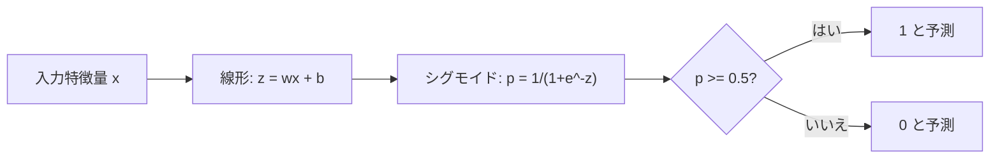
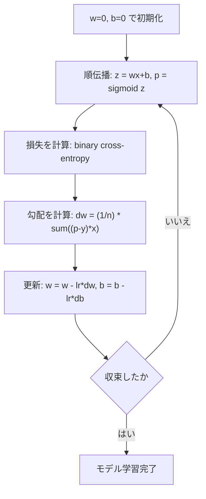

# ロジスティック回帰

> ロジスティック回帰は、直線を S 字カーブに曲げ、はい/いいえの問いに確率で答えます。

**種類:** 構築
**言語:** Python
**前提条件:** Phase 2 Lesson 1-2（機械学習とは、線形回帰）
**所要時間:** 約 90 分

## 学習目標

- シグモイド関数と二値交差エントロピー損失を使って、ロジスティック回帰をゼロから実装できる
- 二値分類における precision、recall、F1 score、混同行列を計算し解釈できる
- 分類で MSE がうまくいかない理由と、二値交差エントロピーが凸のコスト面を作る理由を説明できる
- 多クラス分類のためのソフトマックス回帰モデルを構築し、しきい値調整のトレードオフを評価できる

## 問題

腫瘍の大きさから、それが悪性か良性かを予測したいとします。線形回帰を試すと、0.3、1.7、-0.5 のような数値が出力されます。これは何を意味するのでしょうか。1.7 は「とても悪性」でしょうか。-0.5 は「とても良性」でしょうか。線形回帰の出力は範囲に制限がありません。分類には 0 から 1 の範囲に収まる確率と、はい/いいえの明確な判断が必要です。

ロジスティック回帰はこれを解決します。同じ線形結合（wx + b）を取り、それをシグモイド関数に通します。シグモイド関数は任意の数値を (0, 1) の範囲に押し込みます。出力は確率です。しきい値（通常は 0.5）を設定し、判断を下します。

これは実務で最も広く使われているアルゴリズムの 1 つです。名前に反して、ロジスティック回帰は回帰アルゴリズムではなく分類アルゴリズムです。名前は、使っているロジスティック（シグモイド）関数に由来します。

## 概念

### 線形回帰が分類で失敗する理由

勉強時間から合格/不合格（1/0）を予測するとします。線形回帰はデータに直線を当てはめます。

```
hours:  1   2   3   4   5   6   7   8   9   10
actual: 0   0   0   0   1   1   1   1   1   1
```

線形の当てはめでは、1 時間で -0.2、10 時間で 1.3 のような予測が出るかもしれません。これらの値は確率ではありません。0 を下回ったり 1 を上回ったりします。さらに悪いことに、外れ値が 1 つ（50 時間勉強した人など）あるだけで直線全体が引っ張られ、全員の予測が変わってしまいます。

分類には次のような関数が必要です。
- 0 から 1 の値（確率）を出力する
- 鋭い遷移（決定境界）を作る
- 境界から遠い外れ値に歪められにくい

### シグモイド関数

シグモイド関数はまさにこれを行います。

```
sigmoid(z) = 1 / (1 + e^(-z))
```

性質:
- z が大きな正の値のとき、sigmoid(z) は 1 に近づく
- z が大きな負の値のとき、sigmoid(z) は 0 に近づく
- z = 0 のとき、sigmoid(z) = 0.5
- 出力は常に 0 から 1 の間
- 関数は滑らかで、どこでも微分可能

導関数は便利な形になります。sigmoid'(z) = sigmoid(z) * (1 - sigmoid(z)) です。これにより勾配計算が効率的になります。

### ロジスティック回帰 = 線形モデル + シグモイド

モデルは z = wx + b（線形回帰と同じ）を計算し、その後シグモイドを適用します。



出力 p は P(y=1 | x)、つまり入力がクラス 1 に属する確率として解釈されます。決定境界は wx + b = 0 となる場所で、このときシグモイド出力はちょうど 0.5 になります。

### 二値交差エントロピー損失

ロジスティック回帰に MSE は使えません。シグモイドと組み合わせた MSE は、多くの局所最小値を持つ非凸のコスト面を作ります。代わりに、二値交差エントロピー（log loss）を使います。

```
Loss = -(1/n) * sum(y * log(p) + (1-y) * log(1-p))
```

これが機能する理由:
- y=1 で p が 1 に近い: log(1) = 0 なので損失は 0 に近い（正しい、低コスト）
- y=1 で p が 0 に近い: log(0) は負の無限大に近づくので損失は非常に大きい（間違い、高コスト）
- y=0 で p が 0 に近い: log(1) = 0 なので損失は 0 に近い（正しい、低コスト）
- y=0 で p が 1 に近い: log(0) は負の無限大に近づくので損失は非常に大きい（間違い、高コスト）

この損失関数はロジスティック回帰では凸であり、単一の大域的最小値を保証します。

### ロジスティック回帰の勾配降下法

シグモイドと二値交差エントロピーの勾配は、すっきりした形になります。

```
dL/dw = (1/n) * sum((p - y) * x)
dL/db = (1/n) * sum(p - y)
```

これは線形回帰の勾配と同じ形に見えます。違いは、p = wx + b ではなく p = sigmoid(wx + b) であることです。シグモイドが非線形性を導入しますが、勾配の更新式は同じです。



### 決定境界

2 次元入力（2 つの特徴量）の場合、決定境界は次の線です。

```
w1*x1 + w2*x2 + b = 0
```

片側の点は 1 に分類され、反対側の点は 0 に分類されます。ロジスティック回帰は常に線形の決定境界を作ります。曲線の境界が必要な場合は、多項式特徴量を追加するか、非線形モデルを使います。

### ソフトマックスによる多クラス分類

二値ロジスティック回帰は 2 クラスを扱います。k クラスの場合はソフトマックス関数を使います。

```
softmax(z_i) = e^(z_i) / sum(e^(z_j) for all j)
```

各クラスは独自の重みベクトルを持ちます。モデルは各クラスのスコア z_i を計算し、softmax がスコアを合計 1 の確率へ変換します。予測クラスは、最も確率が高いクラスです。

損失関数はカテゴリ交差エントロピーになります。

```
Loss = -(1/n) * sum(sum(y_k * log(p_k)))
```

ここで y_k は真のクラスでは 1、それ以外では 0 です（one-hot encoding）。

### 評価指標

accuracy だけでは不十分です。95% が陰性、5% が陽性のデータセットでは、常に陰性と予測するモデルは 95% の accuracy を得ますが、役に立ちません。

**混同行列**:

| | 予測 Positive | 予測 Negative |
|---|---|---|
| 実際に Positive | 真陽性 (TP) | 偽陰性 (FN) |
| 実際に Negative | 偽陽性 (FP) | 真陰性 (TN) |

**Precision**: positive と予測されたもののうち、実際に positive だったものはどれだけか。
```
Precision = TP / (TP + FP)
```

**Recall**（感度）: 実際の positive のうち、どれだけを捕捉できたか。
```
Recall = TP / (TP + FN)
```

**F1 Score**: precision と recall の調和平均。両方の指標のバランスを取ります。
```
F1 = 2 * (Precision * Recall) / (Precision + Recall)
```

優先する場面:
- **Precision**: 偽陽性のコストが高い場合（スパムフィルタで、正当なメールをブロックしたくない）
- **Recall**: 偽陰性のコストが高い場合（がん検診で、腫瘍を見逃したくない）
- **F1**: バランスの取れた単一指標が必要な場合

## 作ってみる

### ステップ 1: シグモイド関数とデータ生成

```python
import random
import math

def sigmoid(z):
    z = max(-500, min(500, z))
    return 1.0 / (1.0 + math.exp(-z))


random.seed(42)
N = 200
X = []
y = []

for _ in range(N // 2):
    X.append([random.gauss(2, 1), random.gauss(2, 1)])
    y.append(0)

for _ in range(N // 2):
    X.append([random.gauss(5, 1), random.gauss(5, 1)])
    y.append(1)

combined = list(zip(X, y))
random.shuffle(combined)
X, y = zip(*combined)
X = list(X)
y = list(y)

print(f"Generated {N} samples (2 classes, 2 features)")
print(f"Class 0 center: (2, 2), Class 1 center: (5, 5)")
print(f"First 5 samples:")
for i in range(5):
    print(f"  Features: [{X[i][0]:.2f}, {X[i][1]:.2f}], Label: {y[i]}")
```

### ステップ 2: ロジスティック回帰をゼロから実装する

```python
class LogisticRegression:
    def __init__(self, n_features, learning_rate=0.01):
        self.weights = [0.0] * n_features
        self.bias = 0.0
        self.lr = learning_rate
        self.loss_history = []

    def predict_proba(self, x):
        z = sum(w * xi for w, xi in zip(self.weights, x)) + self.bias
        return sigmoid(z)

    def predict(self, x, threshold=0.5):
        return 1 if self.predict_proba(x) >= threshold else 0

    def compute_loss(self, X, y):
        n = len(y)
        total = 0.0
        for i in range(n):
            p = self.predict_proba(X[i])
            p = max(1e-15, min(1 - 1e-15, p))
            total += y[i] * math.log(p) + (1 - y[i]) * math.log(1 - p)
        return -total / n

    def fit(self, X, y, epochs=1000, print_every=200):
        n = len(y)
        n_features = len(X[0])
        for epoch in range(epochs):
            dw = [0.0] * n_features
            db = 0.0
            for i in range(n):
                p = self.predict_proba(X[i])
                error = p - y[i]
                for j in range(n_features):
                    dw[j] += error * X[i][j]
                db += error
            for j in range(n_features):
                self.weights[j] -= self.lr * (dw[j] / n)
            self.bias -= self.lr * (db / n)
            loss = self.compute_loss(X, y)
            self.loss_history.append(loss)
            if epoch % print_every == 0:
                print(f"  Epoch {epoch:4d} | Loss: {loss:.4f} | w: [{self.weights[0]:.3f}, {self.weights[1]:.3f}] | b: {self.bias:.3f}")
        return self

    def accuracy(self, X, y):
        correct = sum(1 for i in range(len(y)) if self.predict(X[i]) == y[i])
        return correct / len(y)


split = int(0.8 * N)
X_train, X_test = X[:split], X[split:]
y_train, y_test = y[:split], y[split:]

print("\n=== Training Logistic Regression ===")
model = LogisticRegression(n_features=2, learning_rate=0.1)
model.fit(X_train, y_train, epochs=1000, print_every=200)

print(f"\nTrain accuracy: {model.accuracy(X_train, y_train):.4f}")
print(f"Test accuracy:  {model.accuracy(X_test, y_test):.4f}")
print(f"Weights: [{model.weights[0]:.4f}, {model.weights[1]:.4f}]")
print(f"Bias: {model.bias:.4f}")
```

### ステップ 3: 混同行列と指標をゼロから実装する

```python
class ClassificationMetrics:
    def __init__(self, y_true, y_pred):
        self.tp = sum(1 for t, p in zip(y_true, y_pred) if t == 1 and p == 1)
        self.tn = sum(1 for t, p in zip(y_true, y_pred) if t == 0 and p == 0)
        self.fp = sum(1 for t, p in zip(y_true, y_pred) if t == 0 and p == 1)
        self.fn = sum(1 for t, p in zip(y_true, y_pred) if t == 1 and p == 0)

    def accuracy(self):
        total = self.tp + self.tn + self.fp + self.fn
        return (self.tp + self.tn) / total if total > 0 else 0

    def precision(self):
        denom = self.tp + self.fp
        return self.tp / denom if denom > 0 else 0

    def recall(self):
        denom = self.tp + self.fn
        return self.tp / denom if denom > 0 else 0

    def f1(self):
        p = self.precision()
        r = self.recall()
        return 2 * p * r / (p + r) if (p + r) > 0 else 0

    def print_confusion_matrix(self):
        print(f"\n  Confusion Matrix:")
        print(f"                  Predicted")
        print(f"                  Pos   Neg")
        print(f"  Actual Pos     {self.tp:4d}  {self.fn:4d}")
        print(f"  Actual Neg     {self.fp:4d}  {self.tn:4d}")

    def print_report(self):
        self.print_confusion_matrix()
        print(f"\n  Accuracy:  {self.accuracy():.4f}")
        print(f"  Precision: {self.precision():.4f}")
        print(f"  Recall:    {self.recall():.4f}")
        print(f"  F1 Score:  {self.f1():.4f}")


y_pred_test = [model.predict(x) for x in X_test]
print("\n=== Classification Report (Test Set) ===")
metrics = ClassificationMetrics(y_test, y_pred_test)
metrics.print_report()
```

### ステップ 4: 決定境界の分析

```python
print("\n=== Decision Boundary ===")
w1, w2 = model.weights
b = model.bias
print(f"Decision boundary: {w1:.4f}*x1 + {w2:.4f}*x2 + {b:.4f} = 0")
if abs(w2) > 1e-10:
    print(f"Solved for x2:     x2 = {-w1/w2:.4f}*x1 + {-b/w2:.4f}")

print("\nSample predictions near the boundary:")
test_points = [
    [3.0, 3.0],
    [3.5, 3.5],
    [4.0, 4.0],
    [2.5, 2.5],
    [5.0, 5.0],
]
for point in test_points:
    prob = model.predict_proba(point)
    pred = model.predict(point)
    print(f"  [{point[0]}, {point[1]}] -> prob={prob:.4f}, class={pred}")
```

### ステップ 5: ソフトマックスによる多クラス分類

```python
class SoftmaxRegression:
    def __init__(self, n_features, n_classes, learning_rate=0.01):
        self.n_features = n_features
        self.n_classes = n_classes
        self.lr = learning_rate
        self.weights = [[0.0] * n_features for _ in range(n_classes)]
        self.biases = [0.0] * n_classes

    def softmax(self, scores):
        max_score = max(scores)
        exp_scores = [math.exp(s - max_score) for s in scores]
        total = sum(exp_scores)
        return [e / total for e in exp_scores]

    def predict_proba(self, x):
        scores = [
            sum(self.weights[k][j] * x[j] for j in range(self.n_features)) + self.biases[k]
            for k in range(self.n_classes)
        ]
        return self.softmax(scores)

    def predict(self, x):
        probs = self.predict_proba(x)
        return probs.index(max(probs))

    def fit(self, X, y, epochs=1000, print_every=200):
        n = len(y)
        for epoch in range(epochs):
            grad_w = [[0.0] * self.n_features for _ in range(self.n_classes)]
            grad_b = [0.0] * self.n_classes
            total_loss = 0.0
            for i in range(n):
                probs = self.predict_proba(X[i])
                for k in range(self.n_classes):
                    target = 1.0 if y[i] == k else 0.0
                    error = probs[k] - target
                    for j in range(self.n_features):
                        grad_w[k][j] += error * X[i][j]
                    grad_b[k] += error
                true_prob = max(probs[y[i]], 1e-15)
                total_loss -= math.log(true_prob)
            for k in range(self.n_classes):
                for j in range(self.n_features):
                    self.weights[k][j] -= self.lr * (grad_w[k][j] / n)
                self.biases[k] -= self.lr * (grad_b[k] / n)
            if epoch % print_every == 0:
                print(f"  Epoch {epoch:4d} | Loss: {total_loss / n:.4f}")
        return self

    def accuracy(self, X, y):
        correct = sum(1 for i in range(len(y)) if self.predict(X[i]) == y[i])
        return correct / len(y)


random.seed(42)
X_3class = []
y_3class = []

centers = [(1, 1), (5, 1), (3, 5)]
for label, (cx, cy) in enumerate(centers):
    for _ in range(50):
        X_3class.append([random.gauss(cx, 0.8), random.gauss(cy, 0.8)])
        y_3class.append(label)

combined = list(zip(X_3class, y_3class))
random.shuffle(combined)
X_3class, y_3class = zip(*combined)
X_3class = list(X_3class)
y_3class = list(y_3class)

split_3 = int(0.8 * len(X_3class))
X_train_3 = X_3class[:split_3]
y_train_3 = y_3class[:split_3]
X_test_3 = X_3class[split_3:]
y_test_3 = y_3class[split_3:]

print("\n=== Multi-class Softmax Regression (3 classes) ===")
softmax_model = SoftmaxRegression(n_features=2, n_classes=3, learning_rate=0.1)
softmax_model.fit(X_train_3, y_train_3, epochs=1000, print_every=200)
print(f"\nTrain accuracy: {softmax_model.accuracy(X_train_3, y_train_3):.4f}")
print(f"Test accuracy:  {softmax_model.accuracy(X_test_3, y_test_3):.4f}")

print("\nSample predictions:")
for i in range(5):
    probs = softmax_model.predict_proba(X_test_3[i])
    pred = softmax_model.predict(X_test_3[i])
    print(f"  True: {y_test_3[i]}, Predicted: {pred}, Probs: [{', '.join(f'{p:.3f}' for p in probs)}]")
```

### ステップ 6: しきい値調整

```python
print("\n=== Threshold Tuning ===")
print("Default threshold: 0.5. Adjusting the threshold trades precision for recall.\n")

thresholds = [0.3, 0.4, 0.5, 0.6, 0.7]
print(f"{'Threshold':>10} {'Accuracy':>10} {'Precision':>10} {'Recall':>10} {'F1':>10}")
print("-" * 52)

for t in thresholds:
    y_pred_t = [1 if model.predict_proba(x) >= t else 0 for x in X_test]
    m = ClassificationMetrics(y_test, y_pred_t)
    print(f"{t:>10.1f} {m.accuracy():>10.4f} {m.precision():>10.4f} {m.recall():>10.4f} {m.f1():>10.4f}")
```

## 使ってみる

次は scikit-learn で同じことを行います。

```python
from sklearn.linear_model import LogisticRegression as SklearnLR
from sklearn.metrics import accuracy_score, precision_score, recall_score, f1_score
from sklearn.metrics import confusion_matrix, classification_report
from sklearn.model_selection import train_test_split
from sklearn.preprocessing import StandardScaler
import numpy as np

np.random.seed(42)
X_0 = np.random.randn(100, 2) + [2, 2]
X_1 = np.random.randn(100, 2) + [5, 5]
X_sk = np.vstack([X_0, X_1])
y_sk = np.array([0] * 100 + [1] * 100)

X_tr, X_te, y_tr, y_te = train_test_split(X_sk, y_sk, test_size=0.2, random_state=42)

scaler = StandardScaler()
X_tr_sc = scaler.fit_transform(X_tr)
X_te_sc = scaler.transform(X_te)

lr = SklearnLR()
lr.fit(X_tr_sc, y_tr)
y_pred = lr.predict(X_te_sc)

print("=== Scikit-learn Logistic Regression ===")
print(f"Accuracy:  {accuracy_score(y_te, y_pred):.4f}")
print(f"Precision: {precision_score(y_te, y_pred):.4f}")
print(f"Recall:    {recall_score(y_te, y_pred):.4f}")
print(f"F1:        {f1_score(y_te, y_pred):.4f}")
print(f"\nConfusion Matrix:\n{confusion_matrix(y_te, y_pred)}")
print(f"\nClassification Report:\n{classification_report(y_te, y_pred)}")
```

ゼロから実装したものは、同じ決定境界と指標を出力します。Scikit-learn は、ソルバー選択肢（liblinear、lbfgs、saga）、自動正則化、多クラス戦略（one-vs-rest、multinomial）、数値安定性の最適化を追加してくれます。

## 仕上げる

このレッスンでは次を作成します。
- `code/logistic_regression.py` - 指標付きのロジスティック回帰のゼロからの実装

## 演習

1. 線形分離できないデータセット（例: 2 つの同心円）を生成してください。ロジスティック回帰を学習し、失敗を観察してください。その後、多項式特徴量（x1^2、x2^2、x1*x2）を追加して再学習してください。accuracy が改善することを示してください。
2. 3 クラス softmax モデルの多クラス混同行列を実装してください。クラスごとの precision と recall を計算してください。どのクラスが最も分類しにくいですか。
3. ROC 曲線をゼロから作成してください。0 から 1 までの 100 個のしきい値について、真陽性率と偽陽性率を計算してください。台形則を使って AUC（曲線下面積）を計算してください。

## 重要用語

| 用語 | よくある言い方 | 実際の意味 |
|------|----------------|----------------------|
| Logistic regression | 「分類のための回帰」 | シグモイド関数を後ろに付け、クラス確率を出力する線形モデル |
| Sigmoid function | 「S 字カーブ」 | 任意の実数を (0, 1) の範囲へ写像する関数 1/(1+e^(-z)) |
| Binary cross-entropy | 「Log loss」 | 自信を持った誤予測を強く罰する損失関数 -[y*log(p) + (1-y)*log(1-p)] |
| Decision boundary | 「分割線」 | モデルの出力確率が 0.5 になる面。予測クラスを分ける |
| Softmax | 「多クラス版シグモイド」 | スコアのベクトルを、合計が 1 になる確率へ変換する関数 |
| Precision | 「選ばれたもののうち関連するものの割合」 | TP / (TP + FP)。positive 予測のうち実際に positive である割合 |
| Recall | 「関連するもののうち選ばれたものの割合」 | TP / (TP + FN)。実際の positive のうちモデルが正しく特定した割合 |
| F1 score | 「バランスされた accuracy」 | precision と recall の調和平均: 2*P*R / (P+R) |
| Confusion matrix | 「誤りの内訳」 | 各クラスペアについて TP、TN、FP、FN の数を示す表 |
| Threshold | 「カットオフ」 | これを超えるとモデルがクラス 1 と予測する確率値（デフォルト 0.5、調整可能） |
| One-hot encoding | 「カテゴリ用の二値列」 | クラス k を、位置 k だけが 1 で他は 0 のベクトルとして表すこと |
| Categorical cross-entropy | 「多クラス log loss」 | one-hot エンコード済みラベルを使う、二値交差エントロピーの k クラスへの拡張 |
