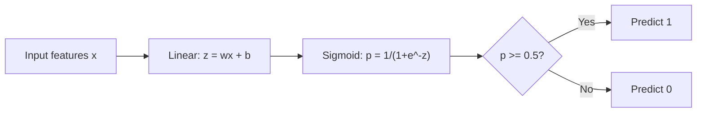
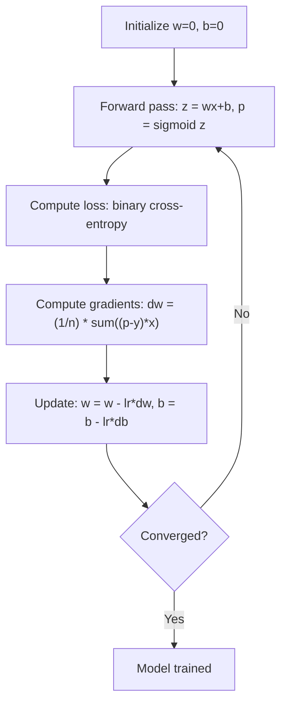

# Lojistik Regresyon

> Lojistik regresyon, olasılıklarla birlikte evet veya hayır sorularını yanıtlamak için düz bir çizgiyi S eğrisine dönüştürür.

**Tür:** Yapım
**Diller:** Python
**Önkoşullar:** Aşama 2 Ders 1-2 (ML Nedir, Doğrusal Regresyon)
**Süre:** ~90 dakika

## Öğrenme Hedefleri

- Sigmoid fonksiyonunu ve ikili çapraz entropi kaybını kullanarak lojistik regresyonu sıfırdan uygulayın
- İkili sınıflandırma için kesinlik, geri çağırma, F1 puanı ve karışıklık matrisini hesaplayın ve yorumlayın
- MSE'nin sınıflandırmada neden başarısız olduğunu ve ikili çapraz entropinin neden dışbükey bir maliyet yüzeyi ürettiğini açıklayın
- Çok sınıflı sınıflandırma için bir softmax regresyon modeli oluşturun ve eşik ayarlama ödünleşimlerini değerlendirin

## Sorun

Boyutuna göre bir tümörün kötü huylu mu yoksa iyi huylu mu olduğunu tahmin etmek istiyorsunuz. Doğrusal regresyonu deneyin. 0,3 veya 1,7 veya -0,5 gibi sayıların çıktısını verir. Bunlar ne anlama geliyor? 1.7 "çok kötü huylu" mu? -0,5 "çok iyi huylu" mu? Doğrusal regresyon sınırsız sayıların çıktısını verir. Sınıflandırma, 0 ile 1 arasında sınırlı olasılıklara ve net bir karara ihtiyaç duyar: evet veya hayır.

Lojistik regresyon bunu çözer. Aynı doğrusal kombinasyonu (wx + b) alır ve bunu, herhangi bir sayıyı (0, 1) aralığına sıkıştıran sigmoid fonksiyonundan geçirir. Çıktı bir olasılıktır. Bir eşik (genellikle 0,5) belirlersiniz ve bir karar verirsiniz.

Bu pratikte en yaygın kullanılan algoritmalardan biridir. İsmine rağmen lojistik regresyon bir regresyon algoritması değil, bir sınıflandırma algoritmasıdır. Adını kullandığı lojistik (sigmoid) fonksiyonundan almaktadır.

## Konsept

### Doğrusal Regresyon Sınıflandırmada Neden Başarısız Olur?

Çalışma saatlerine göre başarılı/başarısız (1/0) tahmininde bulunduğunuzu hayal edin. Doğrusal regresyon veriler boyunca bir çizgi çizer:

```
hours:  1   2   3   4   5   6   7   8   9   10
actual: 0   0   0   0   1   1   1   1   1   1
```

Doğrusal bir uyum, 1. saatte -0,2 ve 10. saatte 1,3 gibi tahminler üretebilir. Bu değerler olasılık değildir. 0'ın altına inerler ve 1'in üstüne çıkarlar. Daha da kötüsü, tek bir aykırı değer (50 saat çalışmış biri) tüm çizgiyi sürükleyerek tahminleri herkes için değiştirir.

Sınıflandırmanın aşağıdakileri sağlayan bir işleve ihtiyacı vardır:
- 0 ile 1 arasındaki değerleri verir (olasılıklar)
- Keskin bir geçiş yaratır (karar sınırı)
- Sınırdan uzaktaki aykırı değerler tarafından bozulmaz

### Sigmoid Fonksiyonu

Sigmoid işlevi tam olarak şunu yapar:

```
sigmoid(z) = 1 / (1 + e^(-z))
```

Özellikler:
- z büyük ve pozitif olduğunda sigmoid(z) 1'e yaklaşır
- z büyük ve negatif olduğunda sigmoid(z) 0'a yaklaşır
- z = 0 olduğunda sigmoid(z) = 0,5
- Çıkış her zaman 0 ile 1 arasındadır
- Fonksiyon düzgündür ve her yerde türevlenebilirdir

Türevin uygun bir formu vardır: sigmoid'(z) = sigmoid(z) * (1 - sigmoid(z)). Bu, gradient hesaplamasını verimli hale getirir.

### Lojistik Regresyon = Doğrusal Model + Sigmoid

Model z = wx + b'yi hesaplar (doğrusal regresyonla aynı), ardından sigmoid uygular:



Çıkış p, girişin 1. sınıfa ait olma olasılığı olan P(y=1 | x) olarak yorumlanır. Karar sınırı wx + b = 0'dır, bu da sigmoid çıkışını tam olarak 0,5 yapar.

### İkili Çapraz Entropi Kaybı

Lojistik regresyon için MSE'yi kullanamazsınız. Sigmoidli MSE, birçok yerel minimuma sahip dışbükey olmayan bir maliyet yüzeyi oluşturur. Bunun yerine ikili çapraz entropiyi (log kaybı) kullanın:

```
Loss = -(1/n) * sum(y * log(p) + (1-y) * log(1-p))
```

Bu neden işe yarıyor:
- y=1 ve p 1'e yakın olduğunda: log(1) = 0, yani kayıp 0'a yakındır (doğru, düşük maliyetli)
- y=1 ve p 0'a yakın olduğunda: log(0) negatif sonsuza yaklaşır, dolayısıyla kayıp çok büyüktür (yanlış, yüksek maliyet)
- y=0 ve p 0'a yakın olduğunda: log(1) = 0, yani kayıp 0'a yakındır (doğru, düşük maliyetli)
- y=0 ve p 1'e yakın olduğunda: log(0) negatif sonsuza yaklaşır, dolayısıyla kayıp çok büyüktür (yanlış, yüksek maliyet)

Bu loss function lojistik regresyon için dışbükeydir ve tek bir küresel minimumu garanti eder.

### Gradient Lojistik Regresyon için İniş

Sigmoidli ikili çapraz entropi için gradient'ler temiz bir forma sahiptir:

```
dL/dw = (1/n) * sum((p - y) * x)
dL/db = (1/n) * sum(p - y)
```

Bunlar doğrusal regresyon gradient'lerle aynı görünüyor. Aradaki fark, p = wx + b yerine p = sigmoid(wx + b) olmasıdır. Sigmoid doğrusal olmamayı sağlar ancak gradient güncelleme kuralı aynı kalır.



### Karar Sınırı

2B giriş (iki özellik) için karar sınırı şu çizgidir:

```
w1*x1 + w2*x2 + b = 0
```

Bir taraftaki noktalar 1, diğer taraftaki noktalar ise 0 olarak sınıflandırılır. Lojistik regresyon her zaman doğrusal bir karar sınırı üretir. Eğri bir sınıra ihtiyacınız varsa ya polinom özellikleri eklersiniz ya da doğrusal olmayan bir model kullanırsınız.

### Softmax ile Çok Sınıflı Sınıflandırma

İkili lojistik regresyon iki sınıfı ele alır. k sınıfı için softmax fonksiyonunu kullanın:

```
softmax(z_i) = e^(z_i) / sum(e^(z_j) for all j)
```

Her sınıfın kendine ait ağırlık vektörü vardır. Model, her sınıf için z_i puanını hesaplar ve ardından softmax, puanları toplamı 1 olan olasılıklara dönüştürür. Tahmin edilen sınıf, en yüksek olasılığa sahip olan sınıftır.

loss function kategorik çapraz entropi haline gelir:

```
Loss = -(1/n) * sum(sum(y_k * log(p_k)))
```

burada y_k, gerçek sınıf için 1 ve diğerleri için 0'dır (tek-etkin kodlama).

### Değerlendirme Metrikleri

Doğruluk tek başına yeterli değildir. %95 negatif ve %5 pozitif olan bir dataset için, her zaman negatifi tahmin eden bir model %95 doğruluk elde eder ancak işe yaramaz.

**Karışıklık Matrisi**:

| | Olumlu Tahmin | Negatif Tahmin |
|---|---|---|
| Aslında Olumlu | Gerçek Pozitif (TP) | Yanlış Negatif (FN) |
| Aslında Olumsuz | Yanlış Pozitif (FP) | Gerçek Negatif (TN) |

**Kesinlik**: Tahmin edilen tüm pozitif sonuçlardan kaç tanesi gerçekten pozitif?
```
Precision = TP / (TP + FP)
```

**Hatırlama** (Hassasiyet): Tüm gerçek pozitiflerden kaçını yakaladık?
```
Recall = TP / (TP + FN)
```

**F1 Puanı**: Hassasiyet ve hatırlamanın harmonik ortalaması. Her iki ölçümü de dengeler.
```
F1 = 2 * (Precision * Recall) / (Precision + Recall)
```

Ne zaman öncelik verilmeli:
- **Hassaslık**: Yanlış pozitifler maliyetli olduğunda (spam filtresi, meşru e-postayı engellemek istemezsiniz)
- **Hatırlayın**: yanlış negatifler maliyetli olduğunda (kanser taraması, bir tümörü gözden kaçırmak istemezsiniz)
- **F1**: tek bir dengeli metriğe ihtiyacınız olduğunda

```figure
logistic-sigmoid
```

## İnşa Et

### Adım 1: Sigmoid işlevi ve veri üretimi

```python
import random
import math

def sigmoid(z):
    z = max(-500, min(500, z))
    return 1.0 / (1.0 + math.exp(-z))


random.seed(42)
N = 200
X = []
y = []

for _ in range(N // 2):
    X.append([random.gauss(2, 1), random.gauss(2, 1)])
    y.append(0)

for _ in range(N // 2):
    X.append([random.gauss(5, 1), random.gauss(5, 1)])
    y.append(1)

combined = list(zip(X, y))
random.shuffle(combined)
X, y = zip(*combined)
X = list(X)
y = list(y)

print(f"Generated {N} samples (2 classes, 2 features)")
print(f"Class 0 center: (2, 2), Class 1 center: (5, 5)")
print(f"First 5 samples:")
for i in range(5):
    print(f"  Features: [{X[i][0]:.2f}, {X[i][1]:.2f}], Label: {y[i]}")
```

### Adım 2: Sıfırdan lojistik regresyon

```python
class LogisticRegression:
    def __init__(self, n_features, learning_rate=0.01):
        self.weights = [0.0] * n_features
        self.bias = 0.0
        self.lr = learning_rate
        self.loss_history = []

    def predict_proba(self, x):
        z = sum(w * xi for w, xi in zip(self.weights, x)) + self.bias
        return sigmoid(z)

    def predict(self, x, threshold=0.5):
        return 1 if self.predict_proba(x) >= threshold else 0

    def compute_loss(self, X, y):
        n = len(y)
        total = 0.0
        for i in range(n):
            p = self.predict_proba(X[i])
            p = max(1e-15, min(1 - 1e-15, p))
            total += y[i] * math.log(p) + (1 - y[i]) * math.log(1 - p)
        return -total / n

    def fit(self, X, y, epochs=1000, print_every=200):
        n = len(y)
        n_features = len(X[0])
        for epoch in range(epochs):
            dw = [0.0] * n_features
            db = 0.0
            for i in range(n):
                p = self.predict_proba(X[i])
                error = p - y[i]
                for j in range(n_features):
                    dw[j] += error * X[i][j]
                db += error
            for j in range(n_features):
                self.weights[j] -= self.lr * (dw[j] / n)
            self.bias -= self.lr * (db / n)
            loss = self.compute_loss(X, y)
            self.loss_history.append(loss)
            if epoch % print_every == 0:
                print(f"  Epoch {epoch:4d} | Loss: {loss:.4f} | w: [{self.weights[0]:.3f}, {self.weights[1]:.3f}] | b: {self.bias:.3f}")
        return self

    def accuracy(self, X, y):
        correct = sum(1 for i in range(len(y)) if self.predict(X[i]) == y[i])
        return correct / len(y)


split = int(0.8 * N)
X_train, X_test = X[:split], X[split:]
y_train, y_test = y[:split], y[split:]

print("\n=== Training Logistic Regression ===")
model = LogisticRegression(n_features=2, learning_rate=0.1)
model.fit(X_train, y_train, epochs=1000, print_every=200)

print(f"\nTrain accuracy: {model.accuracy(X_train, y_train):.4f}")
print(f"Test accuracy:  {model.accuracy(X_test, y_test):.4f}")
print(f"Weights: [{model.weights[0]:.4f}, {model.weights[1]:.4f}]")
print(f"Bias: {model.bias:.4f}")
```

### 3. Adım: Karışıklık matrisi ve sıfırdan ölçümler

```python
class ClassificationMetrics:
    def __init__(self, y_true, y_pred):
        self.tp = sum(1 for t, p in zip(y_true, y_pred) if t == 1 and p == 1)
        self.tn = sum(1 for t, p in zip(y_true, y_pred) if t == 0 and p == 0)
        self.fp = sum(1 for t, p in zip(y_true, y_pred) if t == 0 and p == 1)
        self.fn = sum(1 for t, p in zip(y_true, y_pred) if t == 1 and p == 0)

    def accuracy(self):
        total = self.tp + self.tn + self.fp + self.fn
        return (self.tp + self.tn) / total if total > 0 else 0

    def precision(self):
        denom = self.tp + self.fp
        return self.tp / denom if denom > 0 else 0

    def recall(self):
        denom = self.tp + self.fn
        return self.tp / denom if denom > 0 else 0

    def f1(self):
        p = self.precision()
        r = self.recall()
        return 2 * p * r / (p + r) if (p + r) > 0 else 0

    def print_confusion_matrix(self):
        print(f"\n  Confusion Matrix:")
        print(f"                  Predicted")
        print(f"                  Pos   Neg")
        print(f"  Actual Pos     {self.tp:4d}  {self.fn:4d}")
        print(f"  Actual Neg     {self.fp:4d}  {self.tn:4d}")

    def print_report(self):
        self.print_confusion_matrix()
        print(f"\n  Accuracy:  {self.accuracy():.4f}")
        print(f"  Precision: {self.precision():.4f}")
        print(f"  Recall:    {self.recall():.4f}")
        print(f"  F1 Score:  {self.f1():.4f}")


y_pred_test = [model.predict(x) for x in X_test]
print("\n=== Classification Report (Test Set) ===")
metrics = ClassificationMetrics(y_test, y_pred_test)
metrics.print_report()
```

### Adım 4: Karar sınırı analizi

```python
print("\n=== Decision Boundary ===")
w1, w2 = model.weights
b = model.bias
print(f"Decision boundary: {w1:.4f}*x1 + {w2:.4f}*x2 + {b:.4f} = 0")
if abs(w2) > 1e-10:
    print(f"Solved for x2:     x2 = {-w1/w2:.4f}*x1 + {-b/w2:.4f}")

print("\nSample predictions near the boundary:")
test_points = [
    [3.0, 3.0],
    [3.5, 3.5],
    [4.0, 4.0],
    [2.5, 2.5],
    [5.0, 5.0],
]
for point in test_points:
    prob = model.predict_proba(point)
    pred = model.predict(point)
    print(f"  [{point[0]}, {point[1]}] -> prob={prob:.4f}, class={pred}")
```

### Adım 5: Softmax ile çoklu sınıf

```python
class SoftmaxRegression:
    def __init__(self, n_features, n_classes, learning_rate=0.01):
        self.n_features = n_features
        self.n_classes = n_classes
        self.lr = learning_rate
        self.weights = [[0.0] * n_features for _ in range(n_classes)]
        self.biases = [0.0] * n_classes

    def softmax(self, scores):
        max_score = max(scores)
        exp_scores = [math.exp(s - max_score) for s in scores]
        total = sum(exp_scores)
        return [e / total for e in exp_scores]

    def predict_proba(self, x):
        scores = [
            sum(self.weights[k][j] * x[j] for j in range(self.n_features)) + self.biases[k]
            for k in range(self.n_classes)
        ]
        return self.softmax(scores)

    def predict(self, x):
        probs = self.predict_proba(x)
        return probs.index(max(probs))

    def fit(self, X, y, epochs=1000, print_every=200):
        n = len(y)
        for epoch in range(epochs):
            grad_w = [[0.0] * self.n_features for _ in range(self.n_classes)]
            grad_b = [0.0] * self.n_classes
            total_loss = 0.0
            for i in range(n):
                probs = self.predict_proba(X[i])
                for k in range(self.n_classes):
                    target = 1.0 if y[i] == k else 0.0
                    error = probs[k] - target
                    for j in range(self.n_features):
                        grad_w[k][j] += error * X[i][j]
                    grad_b[k] += error
                true_prob = max(probs[y[i]], 1e-15)
                total_loss -= math.log(true_prob)
            for k in range(self.n_classes):
                for j in range(self.n_features):
                    self.weights[k][j] -= self.lr * (grad_w[k][j] / n)
                self.biases[k] -= self.lr * (grad_b[k] / n)
            if epoch % print_every == 0:
                print(f"  Epoch {epoch:4d} | Loss: {total_loss / n:.4f}")
        return self

    def accuracy(self, X, y):
        correct = sum(1 for i in range(len(y)) if self.predict(X[i]) == y[i])
        return correct / len(y)


random.seed(42)
X_3class = []
y_3class = []

centers = [(1, 1), (5, 1), (3, 5)]
for label, (cx, cy) in enumerate(centers):
    for _ in range(50):
        X_3class.append([random.gauss(cx, 0.8), random.gauss(cy, 0.8)])
        y_3class.append(label)

combined = list(zip(X_3class, y_3class))
random.shuffle(combined)
X_3class, y_3class = zip(*combined)
X_3class = list(X_3class)
y_3class = list(y_3class)

split_3 = int(0.8 * len(X_3class))
X_train_3 = X_3class[:split_3]
y_train_3 = y_3class[:split_3]
X_test_3 = X_3class[split_3:]
y_test_3 = y_3class[split_3:]

print("\n=== Multi-class Softmax Regression (3 classes) ===")
softmax_model = SoftmaxRegression(n_features=2, n_classes=3, learning_rate=0.1)
softmax_model.fit(X_train_3, y_train_3, epochs=1000, print_every=200)
print(f"\nTrain accuracy: {softmax_model.accuracy(X_train_3, y_train_3):.4f}")
print(f"Test accuracy:  {softmax_model.accuracy(X_test_3, y_test_3):.4f}")

print("\nSample predictions:")
for i in range(5):
    probs = softmax_model.predict_proba(X_test_3[i])
    pred = softmax_model.predict(X_test_3[i])
    print(f"  True: {y_test_3[i]}, Predicted: {pred}, Probs: [{', '.join(f'{p:.3f}' for p in probs)}]")
```

### Adım 6: Eşik ayarı

```python
print("\n=== Threshold Tuning ===")
print("Default threshold: 0.5. Adjusting the threshold trades precision for recall.\n")

thresholds = [0.3, 0.4, 0.5, 0.6, 0.7]
print(f"{'Threshold':>10} {'Accuracy':>10} {'Precision':>10} {'Recall':>10} {'F1':>10}")
print("-" * 52)

for t in thresholds:
    y_pred_t = [1 if model.predict_proba(x) >= t else 0 for x in X_test]
    m = ClassificationMetrics(y_test, y_pred_t)
    print(f"{t:>10.1f} {m.accuracy():>10.4f} {m.precision():>10.4f} {m.recall():>10.4f} {m.f1():>10.4f}")
```

## Kullan onu

Şimdi scikit-learn için de aynı şey geçerli.

```python
from sklearn.linear_model import LogisticRegression as SklearnLR
from sklearn.metrics import accuracy_score, precision_score, recall_score, f1_score
from sklearn.metrics import confusion_matrix, classification_report
from sklearn.model_selection import train_test_split
from sklearn.preprocessing import StandardScaler
import numpy as np

np.random.seed(42)
X_0 = np.random.randn(100, 2) + [2, 2]
X_1 = np.random.randn(100, 2) + [5, 5]
X_sk = np.vstack([X_0, X_1])
y_sk = np.array([0] * 100 + [1] * 100)

X_tr, X_te, y_tr, y_te = train_test_split(X_sk, y_sk, test_size=0.2, random_state=42)

scaler = StandardScaler()
X_tr_sc = scaler.fit_transform(X_tr)
X_te_sc = scaler.transform(X_te)

lr = SklearnLR()
lr.fit(X_tr_sc, y_tr)
y_pred = lr.predict(X_te_sc)

print("=== Scikit-learn Logistic Regression ===")
print(f"Accuracy:  {accuracy_score(y_te, y_pred):.4f}")
print(f"Precision: {precision_score(y_te, y_pred):.4f}")
print(f"Recall:    {recall_score(y_te, y_pred):.4f}")
print(f"F1:        {f1_score(y_te, y_pred):.4f}")
print(f"\nConfusion Matrix:\n{confusion_matrix(y_te, y_pred)}")
print(f"\nClassification Report:\n{classification_report(y_te, y_pred)}")
```

Sıfırdan uygulamanız aynı karar sınırını ve ölçümlerini üretir. Scikit-learn, çözücü seçenekleri (liblinear, lbfgs, destan), otomatik düzenleme, çok sınıflı stratejiler (bire karşı dinlenme, çok terimli) ve sayısal kararlılık optimizasyonları ekler.

## Gönderin

Bu ders şunları üretir:
- `code/logistic_regression.py` - metriklerle sıfırdan lojistik regresyon

## Egzersizler

1. Doğrusal olarak ayrılamayan bir dataset oluşturun (e.g., iki eşmerkezli daire). Lojistik regresyonu eğitin ve başarısızlığını gözlemleyin. Daha sonra polinom özelliklerini (x1^2, x2^2, x1*x2) ekleyin ve tekrar eğitin. Doğruluğun arttığını gösterin.
2. 3 sınıflı softmax modeli için çok sınıflı bir karışıklık matrisi uygulayın. Sınıf başına hassasiyeti hesaplayın ve geri çağırın. Hangi sınıfı sınıflandırmak en zordur?
3. Sıfırdan bir ROC eğrisi oluşturun. 0 ile 1 arasındaki 100 eşik değeri için gerçek pozitif oranı ve yanlış pozitif oranını hesaplayın. Yamuk kuralını kullanarak AUC'yi (eğrinin altındaki alan) hesaplayın.

## Anahtar Terimler

| Dönem | İnsanlar ne diyor | Aslında ne anlama geliyor |
|------|----------------|----------------------|
| Lojistik regresyon | "Sınıflandırma için regresyon" | Sınıf olasılıklarının çıktısını veren bir sigmoid fonksiyonunun takip ettiği doğrusal bir model |
| Sigmoid işlevi | "S eğrisi" | Herhangi bir gerçek sayıyı (0, 1) aralığına eşleyen 1/(1+e^(-z)) işlevi |
| İkili çapraz entropi | "Günlük kaybı" | Kendinden emin yanlış tahminleri ciddi şekilde cezalandıran loss function -[y*log(p) + (1-y)*log(1-p)] |
| Karar sınırı | "Ayıran çizgi" | Tahmin edilen sınıfları ayıran, modelin çıktı olasılığının 0,5'e eşit olduğu yüzey |
| Softmax | "Çok sınıflı sigmoid" | Puan vektörünü toplamı 1 | olan olasılıklara dönüştüren bir fonksiyon
| Hassasiyet | "Seçilenlerden kaç tanesi alakalı" | TP / (TP + FP), olumlu tahminlerin aslında olumlu olan oranı |
| Geri Çağırma | "Kaç tane alakalı seçildi" | TP / (TP + FN), modelin doğru şekilde tanımladığı gerçek pozitiflerin oranı |
| F1 puanı | "Dengeli doğruluk" | Hassasiyet ve geri çağırmanın harmonik ortalaması: 2*P*R / (P+R) |
| Karışıklık matrisi | "Hata dökümü" | Her sınıf çifti için TP, TN, FP, FN sayılarını gösteren bir tablo |
| Eşik | "Kesinti" | Modelin sınıf 1'i tahmin ettiği olasılık değeri (varsayılan 0,5, ayarlanabilir) |
| Tek seferde kodlama | "Kategoriler için ikili sütunlar" | k sınıfını, k konumunda 1 olan sıfırlardan oluşan bir vektör olarak temsil etme |
| Kategorik çapraz entropi | "Çok sınıflı günlük kaybı" | Tek sıcak kodlanmış etiketler kullanılarak ikili çapraz entropinin k sınıfa genişletilmesi |
