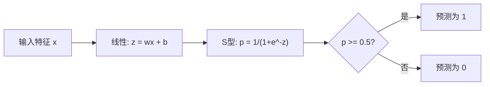
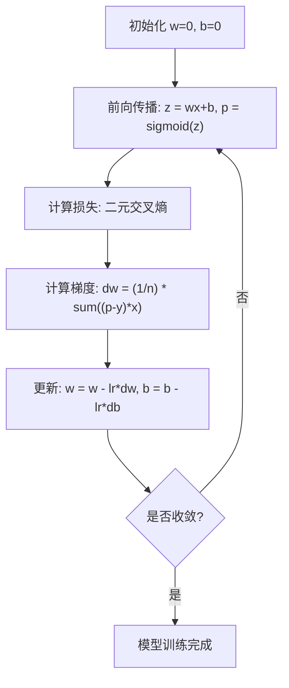

# 逻辑回归（Logistic Regression）

> 逻辑回归将一条直线弯曲成S型曲线，用概率来回答是/否问题。

**类型：** 构建  
**语言：** Python  
**前置知识：** 阶段2 第1-2课（什么是机器学习、线性回归）  
**预计时间：** ~90分钟

## 学习目标

- 使用S型函数（Sigmoid function）和二元交叉熵损失（Binary cross-entropy loss）从零实现逻辑回归
- 计算并解读精确率（Precision）、召回率（Recall）、F1分数（F1 score）和二元分类的混淆矩阵（Confusion matrix）
- 解释为什么均方误差（MSE）不适合分类问题，而二元交叉熵能产生凸的代价曲面
- 构建用于多类分类的Softmax回归模型，并评估阈值调优的权衡

## 问题描述

你希望根据肿瘤大小预测它是恶性还是良性。你尝试了线性回归，但它输出像0.3、1.7或-0.5这样的数值。这些是什么意思？1.7是“非常恶性”吗？-0.5是“非常良性”吗？线性回归输出无界的数值。分类需要0到1之间有界的概率，以及一个明确的决策：是或否。

逻辑回归解决了这个问题。它采用相同的线性组合（wx + b），然后通过S型函数将其压缩到(0, 1)范围内。输出是一个概率。你设定一个阈值（通常是0.5）来做出决策。

这是实际应用中最广泛使用的算法之一。尽管名字叫“回归”，逻辑回归实际上是一个分类算法，而不是回归算法。它的名字来源于它使用的逻辑（S型）函数。

## 概念

### 为什么线性回归不适合分类

想象一下根据学习小时数预测及格/不及格（1/0）。线性回归会在数据上拟合一条直线：

```
小时:   1   2   3   4   5   6   7   8   9   10
实际:   0   0   0   0   1   1   1   1   1   1
```

线性拟合可能会在第1小时产生预测值-0.2，在第10小时产生1.3。这些值不是概率，它们低于0或高于1。更糟的是，一个异常值（比如学习了50小时的人）会拖拽整条直线，改变所有人的预测结果。

分类需要一个函数，它能够：
- 输出介于0和1之间的值（概率）
- 产生一个陡峭的过渡（决策边界）
- 不受远离边界的异常值扭曲

### S型函数

S型函数正好做到这一点：

```
sigmoid(z) = 1 / (1 + e^(-z))
```

性质：
- 当z很大且为正时，sigmoid(z)趋近于1
- 当z很大且为负时，sigmoid(z)趋近于0
- 当z = 0时，sigmoid(z) = 0.5
- 输出总是在0和1之间
- 函数处处光滑且可导

其导数形式简洁：sigmoid'(z) = sigmoid(z) * (1 - sigmoid(z))，这使得梯度计算非常高效。

### 逻辑回归 = 线性模型 + S型函数

模型先计算 z = wx + b（与线性回归相同），然后应用S型函数：



输出p被解释为P(y=1|x)，即输入属于类别1的概率。决策边界是wx + b = 0的位置，此时S型函数输出恰好为0.5。

### 二元交叉熵损失

你不能对逻辑回归使用均方误差（MSE）。MSE与S型函数结合会产生一个非凸的代价曲面，其中包含许多局部极小值。相反，你应该使用二元交叉熵损失（对数损失）：

```
Loss = -(1/n) * sum(y * log(p) + (1-y) * log(1-p))
```

为什么有效：
- 当y=1且p接近1时：log(1)=0，损失接近0（正确，低成本）
- 当y=1且p接近0时：log(0)趋近负无穷，损失巨大（错误，高成本）
- 当y=0且p接近0时：log(1)=0，损失接近0（正确，低成本）
- 当y=0且p接近1时：log(0)趋近负无穷，损失巨大（错误，高成本）

这个损失函数对于逻辑回归是凸的，保证了只有一个全局最小值。

### 逻辑回归的梯度下降

二元交叉熵与S型函数的梯度形式简洁：

```
dL/dw = (1/n) * sum((p - y) * x)
dL/db = (1/n) * sum(p - y)
```

这些与线性回归的梯度看起来完全相同。区别在于 p = sigmoid(wx + b) 而不是 p = wx + b。S型函数引入了非线性，但梯度更新规则保持不变。



### 决策边界

对于二维输入（两个特征），决策边界是满足以下条件的直线：

```
w1*x1 + w2*x2 + b = 0
```

一侧的点被分类为1，另一侧的点被分类为0。逻辑回归总是产生线性决策边界。如果需要弯曲的边界，可以添加多项式特征或使用非线性模型。

### 多类分类与Softmax

二元逻辑回归处理两个类别。对于k个类别，使用Softmax函数：

```
softmax(z_i) = e^(z_i) / sum(e^(z_j) 对所有 j 求和)
```

每个类别都有自己的权重向量。模型为每个类别计算得分z_i，然后Softmax将得分转换为概率，所有概率之和为1。预测的类别是概率最高的那个。

损失函数变为分类交叉熵（Categorical cross-entropy）：

```
Loss = -(1/n) * sum(sum(y_k * log(p_k)))
```

其中y_k在真实类别处为1，其余为0（独热编码（One-hot encoding））。

### 评估指标

仅凭准确率（Accuracy）是不够的。对于一个包含95%负例和5%正例的数据集，一个总是预测负例的模型能达到95%的准确率，但毫无用处。

**混淆矩阵：**

|                | 预测为正例 | 预测为负例 |
|----------------|-----------|-----------|
| 实际为正例     | 真正例 (TP) | 假负例 (FN) |
| 实际为负例     | 假正例 (FP) | 真负例 (TN) |

**精确率：** 在所有预测为正例的样本中，实际为正例的比例？
```
精确率 = TP / (TP + FP)
```

**召回率（灵敏度）：** 在所有实际为正例的样本中，我们成功捕获了多少？
```
召回率 = TP / (TP + FN)
```

**F1分数：** 精确率和召回率的调和平均数，平衡了这两个指标。
```
F1 = 2 * (精确率 * 召回率) / (精确率 + 召回率)
```

何时优先考虑：
- **精确率**：当假正例代价高昂时（垃圾邮件过滤器，你不希望阻断合法邮件）
- **召回率**：当假负例代价高昂时（癌症筛查，你不希望漏掉肿瘤）
- **F1**：当你需要一个单一的平衡指标时

## 动手构建

### 步骤1：S型函数与数据生成

```python
import random
import math

def sigmoid(z):
    z = max(-500, min(500, z))  # 防止数值溢出
    return 1.0 / (1.0 + math.exp(-z))


random.seed(42)
N = 200
X = []
y = []

for _ in range(N // 2):
    X.append([random.gauss(2, 1), random.gauss(2, 1)])
    y.append(0)

for _ in range(N // 2):
    X.append([random.gauss(5, 1), random.gauss(5, 1)])
    y.append(1)

combined = list(zip(X, y))
random.shuffle(combined)
X, y = zip(*combined)
X = list(X)
y = list(y)

print(f"生成了 {N} 个样本（2个类别，2个特征）")
print(f"类别0中心: (2, 2), 类别1中心: (5, 5)")
print(f"前5个样本:")
for i in range(5):
    print(f"  特征: [{X[i][0]:.2f}, {X[i][1]:.2f}], 标签: {y[i]}")
```

### 步骤2：从零实现逻辑回归

```python
class LogisticRegression:
    def __init__(self, n_features, learning_rate=0.01):
        self.weights = [0.0] * n_features
        self.bias = 0.0
        self.lr = learning_rate
        self.loss_history = []

    def predict_proba(self, x):
        z = sum(w * xi for w, xi in zip(self.weights, x)) + self.bias
        return sigmoid(z)

    def predict(self, x, threshold=0.5):
        return 1 if self.predict_proba(x) >= threshold else 0

    def compute_loss(self, X, y):
        n = len(y)
        total = 0.0
        for i in range(n):
            p = self.predict_proba(X[i])
            p = max(1e-15, min(1 - 1e-15, p))  # 防止log(0)
            total += y[i] * math.log(p) + (1 - y[i]) * math.log(1 - p)
        return -total / n

    def fit(self, X, y, epochs=1000, print_every=200):
        n = len(y)
        n_features = len(X[0])
        for epoch in range(epochs):
            dw = [0.0] * n_features
            db = 0.0
            for i in range(n):
                p = self.predict_proba(X[i])
                error = p - y[i]
                for j in range(n_features):
                    dw[j] += error * X[i][j]
                db += error
            for j in range(n_features):
                self.weights[j] -= self.lr * (dw[j] / n)
            self.bias -= self.lr * (db / n)
            loss = self.compute_loss(X, y)
            self.loss_history.append(loss)
            if epoch % print_every == 0:
                print(f"  轮次 {epoch:4d} | 损失: {loss:.4f} | w: [{self.weights[0]:.3f}, {self.weights[1]:.3f}] | b: {self.bias:.3f}")
        return self

    def accuracy(self, X, y):
        correct = sum(1 for i in range(len(y)) if self.predict(X[i]) == y[i])
        return correct / len(y)


split = int(0.8 * N)
X_train, X_test = X[:split], X[split:]
y_train, y_test = y[:split], y[split:]

print("\n=== 训练逻辑回归 ===")
model = LogisticRegression(n_features=2, learning_rate=0.1)
model.fit(X_train, y_train, epochs=1000, print_every=200)

print(f"\n训练准确率: {model.accuracy(X_train, y_train):.4f}")
print(f"测试准确率:  {model.accuracy(X_test, y_test):.4f}")
print(f"权重: [{model.weights[0]:.4f}, {model.weights[1]:.4f}]")
print(f"偏置: {model.bias:.4f}")
```

### 步骤3：从零实现混淆矩阵与指标

```python
class ClassificationMetrics:
    def __init__(self, y_true, y_pred):
        self.tp = sum(1 for t, p in zip(y_true, y_pred) if t == 1 and p == 1)
        self.tn = sum(1 for t, p in zip(y_true, y_pred) if t == 0 and p == 0)
        self.fp = sum(1 for t, p in zip(y_true, y_pred) if t == 0 and p == 1)
        self.fn = sum(1 for t, p in zip(y_true, y_pred) if t == 1 and p == 0)

    def accuracy(self):
        total = self.tp + self.tn + self.fp + self.fn
        return (self.tp + self.tn) / total if total > 0 else 0

    def precision(self):
        denom = self.tp + self.fp
        return self.tp / denom if denom > 0 else 0

    def recall(self):
        denom = self.tp + self.fn
        return self.tp / denom if denom > 0 else 0

    def f1(self):
        p = self.precision()
        r = self.recall()
        return 2 * p * r / (p + r) if (p + r) > 0 else 0

    def print_confusion_matrix(self):
        print(f"\n  混淆矩阵:")
        print(f"                  预测")
        print(f"                  正   负")
        print(f"  实际正     {self.tp:4d}  {self.fn:4d}")
        print(f"  实际负     {self.fp:4d}  {self.tn:4d}")

    def print_report(self):
        self.print_confusion_matrix()
        print(f"\n  准确率:  {self.accuracy():.4f}")
        print(f"  精确率: {self.precision():.4f}")
        print(f"  召回率:    {self.recall():.4f}")
        print(f"  F1分数:  {self.f1():.4f}")


y_pred_test = [model.predict(x) for x in X_test]
print("\n=== 分类报告（测试集） ===")
metrics = ClassificationMetrics(y_test, y_pred_test)
metrics.print_report()
```

### 步骤4：决策边界分析

```python
print("\n=== 决策边界 ===")
w1, w2 = model.weights
b = model.bias
print(f"决策边界: {w1:.4f}*x1 + {w2:.4f}*x2 + {b:.4f} = 0")
if abs(w2) > 1e-10:
    print(f"解出x2:     x2 = {-w1/w2:.4f}*x1 + {-b/w2:.4f}")

print("\n边界附近的样例预测:")
test_points = [
    [3.0, 3.0],
    [3.5, 3.5],
    [4.0, 4.0],
    [2.5, 2.5],
    [5.0, 5.0],
]
for point in test_points:
    prob = model.predict_proba(point)
    pred = model.predict(point)
    print(f"  [{point[0]}, {point[1]}] -> 概率={prob:.4f}, 类别={pred}")
```

### 步骤5：使用Softmax进行多类分类

```python
class SoftmaxRegression:
    def __init__(self, n_features, n_classes, learning_rate=0.01):
        self.n_features = n_features
        self.n_classes = n_classes
        self.lr = learning_rate
        self.weights = [[0.0] * n_features for _ in range(n_classes)]
        self.biases = [0.0] * n_classes

    def softmax(self, scores):
        max_score = max(scores)  # 数值稳定性处理
        exp_scores = [math.exp(s - max_score) for s in scores]
        total = sum(exp_scores)
        return [e / total for e in exp_scores]

    def predict_proba(self, x):
        scores = [
            sum(self.weights[k][j] * x[j] for j in range(self.n_features)) + self.biases[k]
            for k in range(self.n_classes)
        ]
        return self.softmax(scores)

    def predict(self