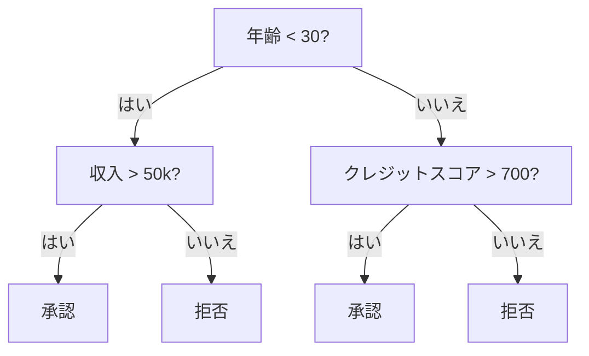
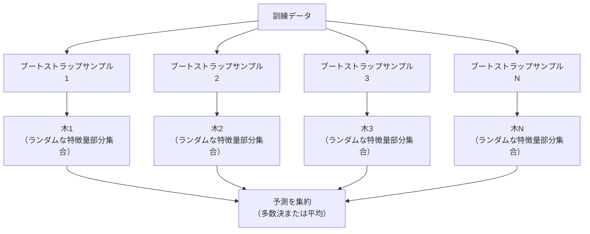

# 決定木とランダムフォレスト

> 決定木は、突き詰めればフローチャートです。けれど、その木を集めた森は、機械学習で最も強力な道具の1つになります。

**タイプ:** Build
**言語:** Python
**前提条件:** フェーズ1（レッスン09 情報理論、06 確率）
**時間:** 約90分

## 学習目標

- 最適な決定木分割を見つけるために、Gini不純度、エントロピー、情報利得の計算を実装する
- 事前枝刈り制御（最大深さ、最小サンプル数）を備えた決定木分類器をゼロから構築する
- ブートストラップサンプリングと特徴量のランダム化を使ってランダムフォレストを構築し、それが分散を下げる理由を説明する
- MDI特徴量重要度とPermutation importanceを比較し、MDIにバイアスがかかる場面を見分ける

## 問題

手元に表形式データがあります。行はサンプル、列は特徴量で、予測したいターゲット列があります。ここにニューラルネットワークを投入することもできます。けれど表形式データでは、木ベースのモデル（決定木、ランダムフォレスト、勾配ブースティング木）が深層学習を一貫して上回ります。構造化データのKaggleコンペを支配しているのはTransformerではなく、XGBoostやLightGBMです。

なぜでしょうか。木は前処理なしで、数値特徴量とカテゴリ特徴量が混在したデータを扱えます。特徴量エンジニアリングなしで非線形関係も扱えます。さらに解釈しやすく、木を見ればなぜその予測になったのかを正確に追えます。そして多数の木を平均するランダムフォレストは、中規模データセットで過学習に強い性質を持ちます。

このレッスンでは、再帰的な分割を使って決定木をゼロから構築し、その上にランダムフォレストを構築します。分割基準（Gini不純度、エントロピー、情報利得）の背後にある数学を実装し、弱い学習器のアンサンブルがなぜ強い学習器になるのかを理解します。

## 概念

### 決定木がしていること

決定木は、はい/いいえで答えられる一連の質問によって、特徴量空間を長方形の領域に分割します。



各内部ノードは、特徴量をしきい値と比較します。各葉ノードは予測を行います。新しいデータ点を分類するには、根から始めて、葉に到達するまで分岐をたどります。

木はトップダウンに構築されます。各ノードで、データを最もよく分ける特徴量としきい値を選びます。この「最もよい」は分割基準によって定義されます。

### 分割基準: 不純度を測る

各ノードにはサンプル集合があります。分割後の子ノードができるだけ「純粋」になるように分けたい、つまり各子ノードにほぼ1つのクラスだけが含まれる状態を目指します。

**Gini不純度**は、そのノードのクラス分布に従ってランダムにラベルを付けた場合に、ランダムに選んだサンプルを誤分類する確率を測ります。

```
Gini(S) = 1 - sum(p_k^2)

ここで p_k は、集合 S におけるクラス k の割合です。
```

純粋なノード（すべて同じクラス）では Gini = 0 です。2クラスが50/50の分割では Gini = 0.5 です。低いほどよい値です。

```
例: 猫6匹、犬4匹

Gini = 1 - (0.6^2 + 0.4^2) = 1 - (0.36 + 0.16) = 0.48
```

**エントロピー**は、ノード内の情報量（乱雑さ）を測ります。フェーズ1 レッスン09で扱いました。

```
Entropy(S) = -sum(p_k * log2(p_k))
```

純粋なノードでは entropy = 0 です。2クラスが50/50の分割では entropy = 1.0 です。低いほどよい値です。

```
例: 猫6匹、犬4匹

Entropy = -(0.6 * log2(0.6) + 0.4 * log2(0.4))
        = -(0.6 * -0.737 + 0.4 * -1.322)
        = 0.442 + 0.529
        = 0.971 bits
```

**情報利得**は、分割によって不純度（エントロピーまたはGini）がどれだけ減ったかを表します。

```
IG(S, feature, threshold) = Impurity(S) - weighted_avg(Impurity(S_left), Impurity(S_right))

ここで重みは、それぞれの子ノードに含まれるサンプル割合です。
```

各ノードでの貪欲アルゴリズムは、すべての特徴量と可能なしきい値を試し、情報利得を最大にする (feature, threshold) の組を選ぶ、というものです。

### 分割のしくみ

現在のノードに n 個の特徴量と m 個のサンプルがあるデータセットについて考えます。

1. 各特徴量 j（j = 1 から n）について:
   - サンプルを特徴量 j でソートする
   - 連続する異なる値の中点をすべてしきい値として試す
   - 各しきい値の情報利得を計算する
2. 情報利得が最も高い特徴量としきい値を選ぶ
3. データを左（feature <= threshold）と右（feature > threshold）に分割する
4. それぞれの子に対して再帰する

この貪欲な方法は、大域的に最適な木を保証しません。最適な木を見つける問題はNP-hardです。それでも実務では、貪欲な分割は十分うまく機能します。

### 停止条件

停止条件がないと、木はすべての葉が純粋になるまで（各葉に1サンプルになるまで）成長します。これは訓練データを完全に丸暗記し、汎化性能は非常に悪くなります。

**事前枝刈り**は、木が完全に成長する前に止めます。
- 最大深さ: 木が設定した深さに到達したら分割を止める
- 葉あたりの最小サンプル数: ノードのサンプル数が k 未満なら止める
- 最小情報利得: 最良の分割による不純度改善がしきい値未満なら止める
- 最大葉ノード数: 葉の総数を制限する

**事後枝刈り**は、完全な木を成長させたあとで切り戻します。
- コスト複雑度枝刈り（scikit-learnで使われる）: 葉の数に比例するペナルティを加える。ペナルティを大きくすると木は小さくなる
- Reduced error pruning: 検証誤差が増えないなら部分木を削除する

事前枝刈りは単純で高速です。事後枝刈りは、さらに有用な分割につながる可能性がある分割を早すぎる段階で止めないため、よりよい木を作ることがよくあります。

### 回帰のための決定木

回帰では、葉の予測値はその葉に含まれるターゲット値の平均です。分割基準も変わります。

**分散減少**が情報利得の代わりになります。

```
VR(S, feature, threshold) = Var(S) - weighted_avg(Var(S_left), Var(S_right))
```

分散を最も大きく下げる分割を選びます。木は入力空間を領域に分割し、各領域で定数（平均）を予測します。

### ランダムフォレスト: アンサンブルの力

単独の決定木は分散が大きいモデルです。データが少し変わるだけで、まったく異なる木が作られることがあります。ランダムフォレストは、多数の木を平均することでこれを改善します。



2つのランダム性が、木に多様性を与えます。

**Bagging（bootstrap aggregating）:** 各木は、訓練データから復元抽出したランダムサンプルであるブートストラップサンプルで学習されます。各ブートストラップには元のサンプルのおよそ63%が現れます（残りはout-of-bagサンプルで、検証に使えます）。

**特徴量のランダム化:** 各分割では、特徴量のランダムな部分集合だけを候補にします。分類では既定値は sqrt(n_features)、回帰では n_features/3 です。これにより、すべての木が同じ支配的な特徴量で分割してしまうことを防ぎます。

重要な洞察は、相関の低い多数の木を平均すると、バイアスを増やさずに分散を下げられることです。個々の木は平凡かもしれません。それでもアンサンブルは強力です。

### 特徴量重要度

ランダムフォレストは、自然に特徴量重要度スコアを提供します。最も一般的な方法は次のものです。

**Mean Decrease in Impurity（MDI）:** 各特徴量について、その特徴量が使われたすべての木・すべてのノードでの不純度減少を合計します。早い分割で大きな不純度減少を生む特徴量ほど重要です。

```
importance(feature_j) = feature_j が使われたすべてのノードについて合計:
    (n_samples_at_node / n_total_samples) * impurity_decrease
```

これは高速です（学習中に計算されます）が、カーディナリティが高い特徴量や、可能な分割点が多い特徴量に偏ります。

代替手法が**Permutation importance**です。1つの特徴量の値をシャッフルし、モデルの精度がどれだけ下がるかを測ります。より信頼できますが、遅くなります。

### 木がニューラルネットワークに勝つ場面

表形式データでは、決定木やフォレストはニューラルネットワークを上回ります。理由はいくつかあります。

| 要因 | 木 | ニューラルネットワーク |
|--------|-------|----------------|
| 混在型（数値 + カテゴリ） | ネイティブ対応 | エンコーディングが必要 |
| 小規模データセット（1万行未満） | よく機能する | 過学習しやすい |
| 特徴量の相互作用 | 分割で見つける | アーキテクチャ設計が必要 |
| 解釈性 | 完全に透明 | ブラックボックス |
| 学習時間 | 数分 | 数時間 |
| ハイパーパラメータ感度 | 低い | 高い |

ニューラルネットワークが勝つのは、データに空間構造や系列構造がある場合（画像、テキスト、音声）です。平坦な特徴量テーブルでは、木が既定の選択肢です。

## 作ってみる

### ステップ1: Gini不純度とエントロピー

2つの分割基準をゼロから作り、どの分割がよいかについて両者がおおむね一致することを確認します。

```python
import math

def gini_impurity(labels):
    n = len(labels)
    if n == 0:
        return 0.0
    counts = {}
    for label in labels:
        counts[label] = counts.get(label, 0) + 1
    return 1.0 - sum((c / n) ** 2 for c in counts.values())

def entropy(labels):
    n = len(labels)
    if n == 0:
        return 0.0
    counts = {}
    for label in labels:
        counts[label] = counts.get(label, 0) + 1
    return -sum(
        (c / n) * math.log2(c / n) for c in counts.values() if c > 0
    )
```

### ステップ2: 最良の分割を見つける

すべての特徴量とすべてのしきい値を試します。情報利得が最も高いものを返します。

```python
def information_gain(parent_labels, left_labels, right_labels, criterion="gini"):
    measure = gini_impurity if criterion == "gini" else entropy
    n = len(parent_labels)
    n_left = len(left_labels)
    n_right = len(right_labels)
    if n_left == 0 or n_right == 0:
        return 0.0
    parent_impurity = measure(parent_labels)
    child_impurity = (
        (n_left / n) * measure(left_labels) +
        (n_right / n) * measure(right_labels)
    )
    return parent_impurity - child_impurity
```

### ステップ3: DecisionTreeクラスを作る

再帰的な分割、予測、特徴量重要度の追跡を実装します。

```python
class DecisionTree:
    def __init__(self, max_depth=None, min_samples_split=2,
                 min_samples_leaf=1, criterion="gini",
                 max_features=None):
        self.max_depth = max_depth
        self.min_samples_split = min_samples_split
        self.min_samples_leaf = min_samples_leaf
        self.criterion = criterion
        self.max_features = max_features
        self.tree = None
        self.feature_importances_ = None

    def fit(self, X, y):
        self.n_features = len(X[0])
        self.feature_importances_ = [0.0] * self.n_features
        self.n_samples = len(X)
        self.tree = self._build(X, y, depth=0)
        total = sum(self.feature_importances_)
        if total > 0:
            self.feature_importances_ = [
                fi / total for fi in self.feature_importances_
            ]

    def predict(self, X):
        return [self._predict_one(x, self.tree) for x in X]
```

### ステップ4: RandomForestクラスを作る

ブートストラップサンプリング、特徴量のランダム化、多数決を実装します。

```python
class RandomForest:
    def __init__(self, n_trees=100, max_depth=None,
                 min_samples_split=2, max_features="sqrt",
                 criterion="gini"):
        self.n_trees = n_trees
        self.max_depth = max_depth
        self.min_samples_split = min_samples_split
        self.max_features = max_features
        self.criterion = criterion
        self.trees = []

    def fit(self, X, y):
        n = len(X)
        for _ in range(self.n_trees):
            indices = [random.randint(0, n - 1) for _ in range(n)]
            X_boot = [X[i] for i in indices]
            y_boot = [y[i] for i in indices]
            tree = DecisionTree(
                max_depth=self.max_depth,
                min_samples_split=self.min_samples_split,
                max_features=self.max_features,
                criterion=self.criterion,
            )
            tree.fit(X_boot, y_boot)
            self.trees.append(tree)

    def predict(self, X):
        all_preds = [tree.predict(X) for tree in self.trees]
        predictions = []
        for i in range(len(X)):
            votes = {}
            for preds in all_preds:
                v = preds[i]
                votes[v] = votes.get(v, 0) + 1
            predictions.append(max(votes, key=votes.get))
        return predictions
```

すべてのヘルパーメソッドを含む完全な実装は `code/trees.py` を参照してください。

## 使ってみる

scikit-learnを使うと、ランダムフォレストの学習は数行で済みます。

```python
from sklearn.ensemble import RandomForestClassifier
from sklearn.datasets import load_iris
from sklearn.model_selection import train_test_split

X, y = load_iris(return_X_y=True)
X_train, X_test, y_train, y_test = train_test_split(X, y, random_state=42)

rf = RandomForestClassifier(n_estimators=100, random_state=42)
rf.fit(X_train, y_train)
print(f"Accuracy: {rf.score(X_test, y_test):.4f}")
print(f"Feature importances: {rf.feature_importances_}")
```

実務では、勾配ブースティング木（XGBoost、LightGBM、CatBoost）がランダムフォレストより強いことがよくあります。木を逐次的に構築し、それぞれの木が前の木の誤りを修正するからです。ただし、ランダムフォレストは設定を誤りにくく、ハイパーパラメータ調整もほとんど必要ありません。

## 仕上げる

このレッスンでは `outputs/prompt-tree-interpreter.md` を作ります。これは、ビジネス関係者向けに決定木の分割を解釈するプロンプトです。学習済み木の構造（深さ、特徴量、分割しきい値、精度）を渡すと、モデルを平易なルールに翻訳し、特徴量重要度を順位付けし、過学習やリークを指摘し、次の手順を提案します。コードを読まない相手に木ベースのモデルを説明する必要があるときに使ってください。

## 演習

1. 3クラスの2Dデータセットで単独の決定木を学習します。分割を手で追跡し、長方形の決定境界を描いてください。max_depth=2 と max_depth=10 の境界を比較します。

2. 回帰木のための分散減少分割を実装します。200点について y = sin(x) + noise を生成し、自分の回帰木をフィットさせてください。木の区分定数の予測を真の曲線と重ねてプロットします。

3. 木の数が1、5、10、50、200のランダムフォレストを構築します。木の数に対する訓練精度とテスト精度をプロットしてください。テスト精度は頭打ちになりますが低下しないこと（フォレストは過学習に強いこと）を観察します。

4. 5つの異なるデータセットで、分割基準としてGini不純度とエントロピーを比較します。精度と木の深さを測定してください。ほとんどの場合、結果はほぼ同じになります。その理由を説明します。

5. Permutation importanceを実装します。1つの特徴量がランダムノイズだが高カーディナリティであるデータセットで、MDI重要度と比較してください。MDIはそのノイズ特徴量を高く順位付けしますが、Permutation importanceはそうしません。

## 重要用語

| 用語 | よくある言い方 | 実際の意味 |
|------|----------------|----------------------|
| 決定木 | 「予測のためのフローチャート」 | if/else分割の列を学習して、特徴量空間を長方形の領域に分割するモデル |
| Gini不純度 | 「ノードがどれくらい混ざっているか」 | ノードでランダムなサンプルを誤分類する確率。0 = 純粋、0.5 = 2クラスでの最大不純度 |
| エントロピー | 「ノード内の乱雑さ」 | ノードの情報量。0 = 純粋、1.0 = 2クラスでの最大不確実性。情報理論に由来 |
| 情報利得 | 「分割がどれくらいよいか」 | 分割後の不純度の減少量。分割を選ぶための貪欲基準 |
| 事前枝刈り | 「木を早めに止める」 | 最大深さ、最小サンプル数、最小利得しきい値を設定して、木の成長を早めに止めること |
| 事後枝刈り | 「あとから木を切る」 | 完全な木を成長させたあと、検証性能を改善しない部分木を取り除くこと |
| Bagging | 「ランダムな部分集合で学習する」 | Bootstrap aggregating。各モデルを、復元抽出された異なるランダムサンプルで学習する |
| ランダムフォレスト | 「木の集まり」 | 各木をブートストラップサンプルで学習し、各分割でランダムな特徴量部分集合を使う決定木のアンサンブル |
| 特徴量重要度（MDI） | 「どの特徴量が効いているか」 | 各特徴量が寄与した不純度減少の総量を、すべての木とノードで合計したもの |
| Permutation importance | 「シャッフルして確認する」 | 特徴量の値をランダムにシャッフルしたときの精度低下。ノイズ特徴量に対してはMDIより信頼しやすい |
| 分散減少 | 「情報利得の回帰版」 | 情報利得に対応する回帰木の基準。ターゲット分散を最も下げる分割を選ぶ |
| ブートストラップサンプル | 「重複ありのランダムサンプル」 | 元のデータセットから復元抽出したランダムサンプル。同じサイズだが重複を含む |

## 参考文献

- [Breiman: Random Forests (2001)](https://link.springer.com/article/10.1023/A:1010933404324) - ランダムフォレストの元論文
- [Grinsztajn et al.: Why do tree-based models still outperform deep learning on tabular data? (2022)](https://arxiv.org/abs/2207.08815) - 表形式タスクにおける木とニューラルネットワークの厳密な比較
- [scikit-learn Decision Trees documentation](https://scikit-learn.org/stable/modules/tree.html) - 可視化ツールを含む実践的ガイド
- [XGBoost: A Scalable Tree Boosting System (Chen & Guestrin, 2016)](https://arxiv.org/abs/1603.02754) - Kaggleを席巻する勾配ブースティングの論文
